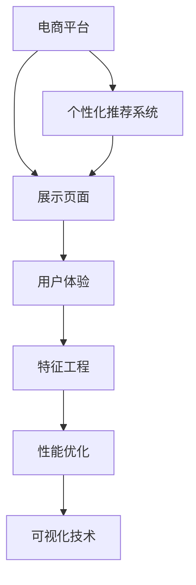

                 

# 电商平台中的个性化展示页面优化

> 关键词：电商, 个性化推荐, 展示页面, 用户体验, 推荐系统, 特征工程, 性能优化, 可视化技术

## 1. 背景介绍

### 1.1 问题由来
随着电子商务平台的不断发展和用户需求的多样化，如何有效提升用户体验、增加商品销售，成为电商平台优化展示页面的首要任务。传统的展示页面往往以固定展示商品列表为主，忽视了用户的个性化需求，导致用户流失率居高不下，用户体验差。

### 1.2 问题核心关键点
电商平台展示页面优化旨在通过个性化推荐算法，根据用户的浏览和购买历史，向用户推荐最相关的商品，提升点击率和转化率，增加用户停留时间和复购率，从而提升整体销售额。

### 1.3 问题研究意义
优化电商平台个性化展示页面，对于提升用户粘性、增加销售业绩、提高用户体验具有重要意义。其研究不仅能增加电商平台的竞争优势，还能为其他类型平台的展示页面优化提供借鉴。

## 2. 核心概念与联系

### 2.1 核心概念概述

为更好地理解电商平台个性化展示页面优化方法，本节将介绍几个密切相关的核心概念：

- **电商平台**：指利用互联网技术，通过网络提供商品或服务并完成交易的平台。常见的电商平台有亚马逊、淘宝、京东等。
- **个性化推荐系统**：指通过分析用户历史行为和偏好，向用户推荐最相关的商品或内容的系统。常见推荐算法包括协同过滤、基于内容的推荐、深度学习推荐等。
- **展示页面**：指用户打开电商平台后，展示给用户浏览和购买的商品列表页面。展示页面的内容直接影响用户的购物体验。
- **用户体验**：指用户使用电商平台时的感知和满意度，包括页面加载速度、内容相关性、推荐准确性等方面。
- **特征工程**：指从原始数据中提取和构造特征，以供推荐模型训练使用的过程。特征工程的好坏直接影响推荐效果。
- **性能优化**：指针对展示页面的技术优化，如减少页面加载时间、优化算法性能等。性能优化是提升用户体验的关键。
- **可视化技术**：指通过图表、热力图等形式，直观展示页面优化效果的技术。可视化技术有助于及时发现问题、指导优化。

这些核心概念之间的逻辑关系可以通过以下Mermaid流程图来展示：



这个流程图展示了这个系统各个部分之间的关系：

1. 电商平台通过个性化推荐系统，向用户推荐商品。
2. 推荐系统在展示页面上展示推荐内容。
3. 用户浏览展示页面，产生反馈数据，用于优化推荐系统。
4. 特征工程从用户数据中提取特征，供推荐模型使用。
5. 性能优化提升展示页面性能，提升用户体验。
6. 可视化技术用于监控和反馈展示页面优化效果。

这些概念共同构成了电商平台的个性化展示页面优化框架，有助于提升用户购物体验和平台竞争力。

## 3. 核心算法原理 & 具体操作步骤
### 3.1 算法原理概述

电商平台个性化展示页面优化，本质上是通过个性化推荐算法，将用户最相关的商品推荐给用户，以提升点击率和转化率。

形式化地，假设电商平台有 $N$ 个用户 $U=\{u_1, u_2, ..., u_N\}$，每个用户 $u_i$ 对应 $M$ 个商品 $P=\{p_1, p_2, ..., p_M\}$，展示页面上的商品推荐函数为 $R: U \times P \rightarrow \{0, 1\}$，其中 $R(u_i, p_j)=1$ 表示用户 $u_i$ 点击商品 $p_j$，否则为 $0$。

优化目标是最小化模型预测误差，即：

$$
\min_{\theta} \frac{1}{N} \sum_{i=1}^N \sum_{j=1}^M \ell(R(u_i, p_j), f_{\theta}(u_i, p_j))
$$

其中，$\ell$ 为损失函数，$f_{\theta}$ 为推荐模型，$\theta$ 为模型参数。

通过梯度下降等优化算法，不断更新模型参数 $\theta$，最小化损失函数，使得推荐模型输出的点击率预测与真实标签更加接近。

### 3.2 算法步骤详解

电商平台个性化展示页面优化一般包括以下几个关键步骤：

**Step 1: 数据收集与预处理**
- 收集用户浏览和购买历史数据，划分为训练集、验证集和测试集。
- 提取用户特征和商品特征，如用户浏览时长、浏览商品种类、商品价格、用户评价等。

**Step 2: 模型选择与训练**
- 选择合适的推荐算法，如协同过滤、基于内容的推荐、深度学习推荐等。
- 在训练集上训练推荐模型，以最小化预测误差。
- 在验证集上评估模型性能，调整超参数和特征工程策略。

**Step 3: 展示页面优化**
- 将训练好的推荐模型应用到展示页面上，实时推荐商品。
- 根据推荐效果，进行展示页面的设计和调整。
- 在展示页面上增加用户反馈机制，如评分、评论等，进一步优化推荐系统。

**Step 4: 性能评估与监控**
- 在测试集上评估推荐模型的最终性能。
- 实时监控展示页面的性能指标，如页面加载时间、点击率、转化率等。
- 利用可视化技术展示优化效果，指导后续优化。

### 3.3 算法优缺点

电商平台个性化展示页面优化具有以下优点：
1. 提升用户体验：通过推荐最相关的商品，提升用户满意度，增加复购率。
2. 增加销售业绩：精准推荐提高点击率和转化率，增加销售额。
3. 优化展示页面：通过调整展示页面，提升页面加载速度和展示效果，提高用户粘性。
4. 实时监控：通过实时监控展示页面性能，及时发现问题并解决。

同时，该方法也存在一定的局限性：
1. 数据隐私问题：收集用户数据涉及隐私问题，需严格遵守相关法律法规。
2. 推荐系统复杂性：推荐算法设计复杂，需要专业知识支撑。
3. 数据质量要求高：推荐系统对数据质量要求高，需要完整、准确、干净的数据。
4. 过度推荐问题：推荐系统可能过度推荐不相关商品，导致用户疲劳。
5. 个性化不足：推荐系统可能过于追求个性化，导致部分用户得不到推荐。

尽管存在这些局限性，但就目前而言，个性化展示页面优化仍是电商平台提升用户购物体验、增加销售业绩的重要手段。未来相关研究将继续优化推荐算法和展示页面设计，同时兼顾隐私保护和用户体验，以实现更好的电商效果。

### 3.4 算法应用领域

电商平台个性化展示页面优化技术，在电商、金融、社交媒体等多个领域都有广泛应用，例如：

- **电商**：提升用户购物体验，增加商品销量。
- **金融**：推荐理财和保险产品，提升用户粘性和收益。
- **社交媒体**：推荐相关文章和视频，增加用户互动和粘性。
- **游戏**：推荐游戏内道具和装备，提升用户留存率。

除了上述这些领域外，个性化展示页面优化技术还可以应用于更多场景中，如智慧医疗、智慧城市等，为各行各业提供更精准、高效的服务。

## 4. 数学模型和公式 & 详细讲解 & 举例说明

### 4.1 数学模型构建

本节将使用数学语言对电商平台个性化展示页面优化过程进行更加严格的刻画。

假设推荐模型为 $f_{\theta}$，其中 $\theta$ 为模型参数。设推荐模型在用户 $u_i$ 和商品 $p_j$ 上的预测点击概率为 $f_{\theta}(u_i, p_j)$，实际点击概率为 $R(u_i, p_j)$，则推荐模型的损失函数为：

$$
\ell(R(u_i, p_j), f_{\theta}(u_i, p_j)) = -(y \log \hat{y} + (1-y) \log (1-\hat{y}))
$$

其中，$y$ 为实际标签，$\hat{y}$ 为预测标签。

在训练集上，总损失函数为：

$$
\mathcal{L}(\theta) = \frac{1}{N} \sum_{i=1}^N \sum_{j=1}^M \ell(R(u_i, p_j), f_{\theta}(u_i, p_j))
$$

### 4.2 公式推导过程

以协同过滤算法为例，进行详细推导。

假设用户 $u_i$ 与 $u_j$ 的相似度为 $s_{ij}$，根据协同过滤的矩阵分解形式，推荐模型可表示为：

$$
f_{\theta}(u_i, p_j) = \frac{1}{\sigma(\mathbf{s}_u^T \mathbf{p}_p)} \sigma(\mathbf{s}_u^T \mathbf{p}_p)
$$

其中，$\sigma$ 为sigmoid函数，$\mathbf{s}_u$ 和 $\mathbf{p}_p$ 分别为用户 $u_i$ 和商品 $p_j$ 的特征向量。

最小化损失函数 $\mathcal{L}(\theta)$ 等价于最小化预测误差：

$$
\mathcal{L}(\theta) = \frac{1}{N} \sum_{i=1}^N \sum_{j=1}^M \mathbb{E}[\ell(R(u_i, p_j), f_{\theta}(u_i, p_j))]
$$

为了最小化预测误差，需要最大化预测点击概率 $f_{\theta}(u_i, p_j)$，使其接近实际点击概率 $R(u_i, p_j)$。

### 4.3 案例分析与讲解

以亚马逊电商平台的个性化推荐系统为例，进行案例分析。

亚马逊的推荐系统基于协同过滤和基于内容的推荐两种算法，通过分析用户历史行为和商品特征，实时向用户推荐商品。推荐模型包括多个组件，如用户画像、商品画像、相似度计算、模型训练等。

用户画像：根据用户浏览和购买历史，构建用户兴趣模型。

商品画像：根据商品属性和用户评价，构建商品特征模型。

相似度计算：通过计算用户和商品之间的相似度，推荐相似商品。

模型训练：通过在线学习算法，实时更新推荐模型参数。

亚马逊的推荐系统通过不断优化用户画像、商品画像和相似度计算等组件，提升推荐模型的性能，实现个性化推荐。目前，亚马逊的推荐系统已广泛应用于商品推荐、广告推荐、个性化搜索结果等方面，显著提升了用户购物体验和平台业绩。

## 5. 项目实践：代码实例和详细解释说明

### 5.1 开发环境搭建

在进行个性化展示页面优化实践前，我们需要准备好开发环境。以下是使用Python进行推荐系统开发的常用开发环境配置流程：

1. 安装Python：从官网下载并安装Python 3.8及以上版本。
2. 安装依赖包：
   ```bash
   pip install numpy pandas scikit-learn torch scipy
   ```
3. 安装Jupyter Notebook：
   ```bash
   pip install jupyter notebook
   ```
4. 安装推荐系统常用工具：
   ```bash
   pip install lightfm pyproject sympy
   ```

完成上述步骤后，即可在Jupyter Notebook中开始推荐系统的开发。

### 5.2 源代码详细实现

以下是一个基于协同过滤算法的推荐系统代码实现：

```python
import numpy as np
from lightfm import LightFM
from lightfm.data import Dataset

# 准备数据集
train_data = Dataset('train.csv', delimiter=',')
test_data = Dataset('test.csv', delimiter=',')

# 创建模型
model = LightFM()

# 训练模型
model.fit(train_data)

# 预测
preds = model.predict(test_data)

# 评估模型
metrics = model.evaluate(test_data)
print(metrics)
```

以上代码实现了基于协同过滤算法的推荐系统，使用LightFM库进行模型训练和预测，输出评估指标。

### 5.3 代码解读与分析

**LightFM库**：
- LightFM是一个基于Python的推荐系统库，提供了多种推荐算法，包括协同过滤、矩阵分解、深度学习等。
- 通过简单的API调用，即可实现推荐系统的训练和预测。

**数据准备**：
- 使用`Dataset`类准备数据集，支持多种格式，如CSV、JSON等。
- 数据集包括用户行为记录和商品信息，用于训练推荐模型。

**模型训练**：
- 创建LightFM模型，调用`fit`方法进行训练。
- 训练过程中，LightFM会自动优化模型参数，减少预测误差。

**模型预测**：
- 调用`predict`方法进行商品推荐预测。
- 输出预测结果，用于展示页面优化。

**模型评估**：
- 调用`evaluate`方法评估模型性能，输出评估指标。
- 常见的评估指标包括均方根误差(RMSE)、平均绝对误差(MAE)、精确率、召回率等。

可以看出，LightFM库使推荐系统的开发和部署变得非常简便，开发者只需关注模型设计和数据处理，即可快速实现推荐系统。

## 6. 实际应用场景

### 6.1 智能推荐系统

个性化展示页面优化技术广泛应用于智能推荐系统，提升用户购物体验，增加商品销量。

**案例**：亚马逊个性化推荐系统

亚马逊通过协同过滤和基于内容的推荐算法，实时向用户推荐商品。用户每次浏览和购买行为都会被记录下来，用于训练推荐模型。推荐模型根据用户行为数据和商品特征，预测用户对商品的点击概率，从而优化展示页面，提升用户体验。

**效果**：亚马逊的推荐系统已广泛应用于商品推荐、广告推荐、个性化搜索结果等方面，显著提升了用户购物体验和平台业绩。

### 6.2 智能广告推荐

智能广告推荐系统通过分析用户行为和历史数据，推荐最相关的广告，提升广告点击率和转化率。

**案例**：谷歌AdSense

谷歌AdSense通过协同过滤和基于内容的推荐算法，向用户推荐最相关的广告。广告系统根据用户行为数据和广告内容，预测用户对广告的点击概率，从而优化展示页面，提升广告效果。

**效果**：谷歌AdSense通过个性化展示广告，提高了广告点击率和转化率，显著提升了广告主和平台收益。

### 6.3 智能新闻推荐

智能新闻推荐系统通过分析用户兴趣和历史行为，推荐最相关的文章，提升用户互动和粘性。

**案例**：今日头条新闻推荐系统

今日头条通过协同过滤和深度学习推荐算法，向用户推荐最相关的新闻。新闻系统根据用户行为数据和文章内容，预测用户对文章的点击概率，从而优化展示页面，提升用户粘性。

**效果**：今日头条通过个性化展示新闻，提高了用户点击率和停留时间，显著提升了用户互动和平台流量。

## 7. 工具和资源推荐

### 7.1 学习资源推荐

为了帮助开发者系统掌握个性化展示页面优化技术，这里推荐一些优质的学习资源：

1. 《推荐系统实战》：本书系统介绍了推荐系统的原理和实践，包括协同过滤、基于内容的推荐、深度学习推荐等。

2. 《Python推荐系统实战》：本书详细介绍了使用Python实现推荐系统的常用算法和工具，包括LightFM、Scikit-learn等。

3. Kaggle推荐系统竞赛：通过参加Kaggle推荐系统竞赛，积累实战经验，了解最新的推荐系统技术和算法。

4. Coursera《推荐系统》课程：斯坦福大学开设的推荐系统课程，涵盖推荐系统原理、算法设计和评估等。

5. Weights & Biases：模型训练的实验跟踪工具，可以记录和可视化模型训练过程中的各项指标，方便对比和调优。

通过这些学习资源的学习实践，相信你一定能够快速掌握个性化展示页面优化的精髓，并用于解决实际的推荐问题。

### 7.2 开发工具推荐

高效的开发离不开优秀的工具支持。以下是几款用于个性化展示页面优化开发的常用工具：

1. Jupyter Notebook：免费的开源笔记本环境，支持Python和R语言，方便快速迭代和分享代码。

2. LightFM：基于Python的推荐系统库，支持多种推荐算法，易于使用。

3. PyTorch：基于Python的深度学习框架，支持GPU/TPU加速，灵活高效。

4. TensorBoard：TensorFlow配套的可视化工具，实时监控推荐模型训练过程，帮助调优。

5. Apache Spark：分布式计算框架，支持大规模推荐系统的训练和部署。

合理利用这些工具，可以显著提升个性化展示页面优化任务的开发效率，加快创新迭代的步伐。

### 7.3 相关论文推荐

个性化展示页面优化技术的发展源于学界的持续研究。以下是几篇奠基性的相关论文，推荐阅读：

1. "Personalized PageRank for Web Search"（IDF论文）：提出PageRank算法，用于个性化网页推荐。

2. "Scalable Collaborative Filtering with Matrix Factorization Techniques"（MF论文）：提出矩阵分解方法，用于大规模协同过滤推荐系统。

3. "Deep Collaborative Filtering with User Guidance"（DCF论文）：提出深度协同过滤方法，提升推荐模型的性能。

4. "Wide and Deep Collaborative Filtering"：提出Wide & Deep方法，结合宽特征和高阶特征，提升推荐模型的效果。

5. "Neural Collaborative Filtering"（NetMF论文）：提出神经协同过滤方法，通过神经网络提升推荐模型的表现。

这些论文代表了大数据推荐系统的发展脉络。通过学习这些前沿成果，可以帮助研究者把握学科前进方向，激发更多的创新灵感。

## 8. 总结：未来发展趋势与挑战

### 8.1 总结

本文对电商平台个性化展示页面优化方法进行了全面系统的介绍。首先阐述了电商平台的背景和个性化推荐系统的意义，明确了展示页面优化的目标。其次，从原理到实践，详细讲解了推荐算法的数学原理和关键步骤，给出了推荐系统开发的完整代码实例。同时，本文还广泛探讨了推荐系统在电商、金融、社交媒体等多个领域的应用前景，展示了个性化展示页面优化技术的巨大潜力。此外，本文精选了推荐系统的各类学习资源，力求为读者提供全方位的技术指引。

通过本文的系统梳理，可以看到，个性化展示页面优化技术正在成为电商平台提升用户购物体验、增加销售业绩的重要手段。未来推荐系统的设计将更加关注用户行为和数据质量，同时兼顾隐私保护和用户体验，以实现更好的电商效果。

### 8.2 未来发展趋势

展望未来，个性化展示页面优化技术将呈现以下几个发展趋势：

1. 算法融合：推荐算法将更加复杂，可能融合深度学习、知识图谱、强化学习等多种技术。

2. 跨模态推荐：推荐系统将引入视觉、语音等多模态信息，提升推荐模型的表现。

3. 实时推荐：推荐系统将更加注重实时性，实时响应用户行为，动态调整展示页面。

4. 个性化推荐：推荐系统将更加关注用户个性化需求，提供定制化推荐。

5. 数据驱动：推荐系统将更加注重数据质量，通过大数据分析提升推荐效果。

6. 隐私保护：推荐系统将更加注重用户隐私，通过差分隐私、联邦学习等技术保障数据安全。

以上趋势凸显了个性化展示页面优化技术的广阔前景。这些方向的探索发展，必将进一步提升推荐系统的性能和应用范围，为电商平台带来更多用户和收益。

### 8.3 面临的挑战

尽管个性化展示页面优化技术已经取得了瞩目成就，但在迈向更加智能化、普适化应用的过程中，它仍面临着诸多挑战：

1. 数据隐私问题：推荐系统需要收集用户行为数据，涉及隐私问题，需严格遵守相关法律法规。

2. 算法复杂性：推荐算法设计复杂，需要专业知识支撑，难以快速部署。

3. 数据质量要求高：推荐系统对数据质量要求高，需要完整、准确、干净的数据，难以获取。

4. 过度推荐问题：推荐系统可能过度推荐不相关商品，导致用户疲劳。

5. 个性化不足：推荐系统可能过于追求个性化，导致部分用户得不到推荐。

尽管存在这些挑战，但随着推荐系统研究的不断深入，相关技术将在未来不断突破，实现更好的推荐效果。

### 8.4 研究展望

面对个性化展示页面优化所面临的挑战，未来的研究需要在以下几个方面寻求新的突破：

1. 探索更高效的推荐算法：开发更高效的协同过滤、深度学习推荐等算法，提高推荐系统性能。

2. 引入先验知识：结合专家知识，提升推荐系统的泛化能力和鲁棒性。

3. 优化推荐模型训练：通过模型压缩、稀疏化存储等方法，提升推荐模型训练效率。

4. 引入多模态信息：结合视觉、语音等多模态信息，提升推荐模型的表现。

5. 改进特征工程：通过更好的特征选择和构造，提升推荐系统的性能。

6. 优化模型性能：通过深度学习、强化学习等技术，优化推荐模型性能。

这些研究方向的探索，必将引领推荐系统迈向更高的台阶，为电商平台带来更多用户和收益。

## 9. 附录：常见问题与解答

**Q1：个性化推荐系统如何提升用户体验？**

A: 个性化推荐系统通过分析用户历史行为和兴趣，向用户推荐最相关的商品，提升用户满意度，增加复购率。用户每次浏览和购买行为都会被记录下来，用于训练推荐模型。推荐模型根据用户行为数据和商品特征，预测用户对商品的点击概率，从而优化展示页面，提升用户体验。

**Q2：个性化推荐系统如何处理数据隐私问题？**

A: 个性化推荐系统需要收集用户行为数据，涉及隐私问题，需严格遵守相关法律法规。推荐系统通常采用差分隐私、联邦学习等技术，保护用户隐私。同时，推荐系统需对用户数据进行匿名化处理，避免泄露用户个人信息。

**Q3：推荐系统如何处理过度推荐问题？**

A: 过度推荐问题是推荐系统面临的主要挑战之一。为了解决这一问题，推荐系统通常采用限流策略，限制推荐数量和频率。同时，推荐系统可以通过过滤不相关商品，避免过度推荐。

**Q4：推荐系统如何提升推荐效果？**

A: 推荐系统通过优化推荐算法和展示页面设计，提升推荐效果。常见的优化方法包括特征工程、模型压缩、多模态融合等。推荐系统需要不断收集和分析用户数据，动态调整推荐策略，提升推荐效果。

**Q5：推荐系统如何处理个性化不足问题？**

A: 个性化不足是推荐系统面临的另一个主要挑战。为了解决这一问题，推荐系统通常采用多种推荐算法，结合用户行为和商品特征，提供更加精准的推荐。同时，推荐系统可以通过个性化展示页面设计，提升用户粘性。

---

作者：禅与计算机程序设计艺术 / Zen and the Art of Computer Programming

