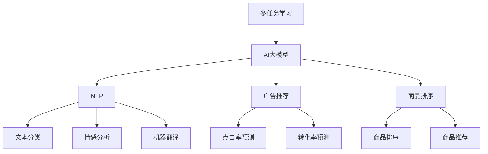
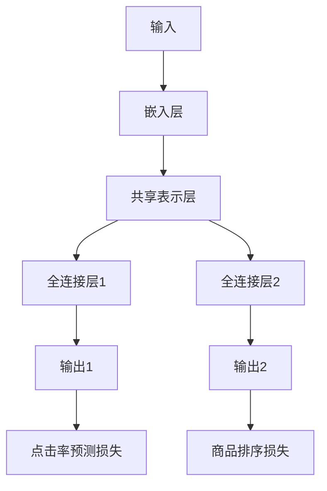

                 

# 电商平台中的多任务学习：AI大模型的优势

> 关键词：
- 多任务学习
- 电商平台
- AI大模型
- 自然语言处理
- 数据增强
- 深度学习

## 1. 背景介绍

### 1.1 问题由来
在现代电商平台上，用户搜索、商品推荐、广告投放、订单处理等任务交织在一起，形成了复杂且动态的业务环境。如何高效地集成多种业务场景，并从中提取有价值的信息，成为电商平台智能化运营的关键挑战。传统的方法通常是独立处理每项任务，导致业务系统割裂、数据孤岛等问题。

近年来，AI大模型的出现为解决这一问题提供了新的可能。AI大模型，如GPT、BERT等，通过在海量数据上进行预训练，获得了丰富的语言知识，具备强大的自然语言处理能力。将其应用于电商平台中，可以整合多任务数据，构建端到端的业务决策模型，提升平台运营效率和用户体验。

### 1.2 问题核心关键点
本文将围绕“多任务学习”和“AI大模型”两个核心概念，深入探讨如何将大模型应用于电商平台中的多种业务场景。我们将具体说明多任务学习的原理和步骤，展示AI大模型在电商平台中实现的深度学习任务，如自然语言处理(NLP)、广告推荐、商品排序等。

## 2. 核心概念与联系

### 2.1 核心概念概述

为更好地理解AI大模型在电商平台中的应用，本节将介绍几个密切相关的核心概念：

- **多任务学习(Multi-Task Learning, MTL)**：指同时训练多个相关任务，共享部分模型参数，以提升模型性能和泛化能力的方法。在电商平台中，可以利用多任务学习整合多种业务数据，提升模型在各个任务上的表现。

- **AI大模型(AI Large Model)**：指通过在大规模数据上进行自监督或监督预训练，学习到复杂语言表示的深度学习模型。AI大模型如GPT、BERT等，具备强大的自然语言处理能力，可用于各种NLP任务。

- **自然语言处理(Natural Language Processing, NLP)**：指使用计算机技术处理和理解人类语言的技术，包括文本分类、情感分析、机器翻译等任务。在电商平台中，NLP技术可以用于商品描述分析、用户评论处理、客服对话等。

- **数据增强(Data Augmentation)**：指通过扩充训练集来增加模型泛化能力的方法，如回译、同义词替换、生成假样本等。在电商平台中，数据增强可以有效缓解标注数据不足的问题，提升模型效果。

- **深度学习(Deep Learning)**：指使用神经网络模型进行复杂任务学习的方法，如图像识别、语音识别、推荐系统等。深度学习技术可以用于电商平台中的广告投放、商品推荐、用户画像生成等任务。

这些核心概念之间的逻辑关系可以通过以下Mermaid流程图来展示：



这个流程图展示了大模型与多任务学习的关系，以及它们在电商平台中的具体应用场景。

## 3. 核心算法原理 & 具体操作步骤

### 3.1 算法原理概述

多任务学习旨在通过共享参数，同时优化多个相关任务，以提高模型的泛化能力和性能。在电商平台中，可以利用多任务学习整合多种业务数据，构建端到端的业务决策模型。AI大模型作为多任务学习的底层支撑，可以显著提升模型的表示能力和学习能力。

多任务学习的核心思想是将多个相关任务看作一个整体，通过共享底层表示层，提升每个任务的表现。具体来说，多任务学习包括任务设计、共享表示、损失函数、优化算法等多个步骤。

### 3.2 算法步骤详解

多任务学习的具体步骤如下：

**Step 1: 任务设计**

首先需要确定需要优化的多个任务。在电商平台中，常见的任务包括商品推荐、广告投放、用户评论分析等。设计任务时，应确保任务之间存在一定的相关性，如用户评论与商品推荐相关，广告点击与广告投放相关。

**Step 2: 共享表示**

多任务学习通过共享底层表示层，提升每个任务的表现。共享表示层通常包括一个或多个隐藏层，所有任务共享这些层的权重。在电商平台中，可以利用AI大模型作为共享表示层，因为大模型已经在大规模数据上进行了充分的预训练，具备较强的表示能力。

**Step 3: 损失函数设计**

多任务学习的损失函数通常包括两部分：特定任务的损失函数和共享表示层的损失函数。特定任务的损失函数用于衡量模型在单个任务上的表现，共享表示层的损失函数用于优化底层共享参数。在电商平台中，可以使用交叉熵损失、均方误差损失等作为特定任务的损失函数，使用Frobenius范数损失作为共享表示层的损失函数。

**Step 4: 优化算法**

多任务学习的优化算法通常使用梯度下降算法，如随机梯度下降(SGD)、Adam等。在电商平台中，可以使用Adam算法对模型进行优化，因为Adam算法在处理大规模数据和稀疏梯度时表现优异。

### 3.3 算法优缺点

多任务学习在电商平台中的应用具有以下优点：

1. **提高模型泛化能力**：多任务学习通过共享底层表示层，提升每个任务的表现，可以有效提高模型的泛化能力。
2. **降低标注成本**：多任务学习可以利用标注数据进行联合优化，从而降低对标注数据的依赖。
3. **提升业务协同**：多任务学习可以将多种业务场景的数据整合在一起，提升业务系统的协同性和效率。

同时，多任务学习也存在一定的局限性：

1. **模型复杂度高**：多任务学习需要设计多个相关任务，共享底层表示层，增加了模型的复杂度。
2. **数据差异性大**：不同任务的数据分布可能差异较大，共享表示层可能无法有效捕捉数据差异。
3. **优化难度高**：多任务学习需要同时优化多个任务，增加了优化的难度。

尽管存在这些局限性，多任务学习仍是大模型在电商平台中应用的有效范式。未来相关研究的重点在于如何更好地设计任务、优化算法，以及降低模型复杂度。

### 3.4 算法应用领域

多任务学习在大模型应用于电商平台中，可以广泛覆盖以下领域：

- **用户画像生成**：利用用户评论、浏览记录、行为数据等，生成用户画像，用于推荐系统、广告投放等。
- **商品推荐**：整合用户行为数据、商品描述、用户画像等，生成商品推荐结果。
- **广告投放**：整合广告点击数据、转化数据、用户画像等，优化广告投放策略。
- **客服对话**：整合用户咨询记录、用户画像等，提高客服对话的智能化水平。
- **商品排序**：整合商品评价、点击记录、销售数据等，优化商品排序算法。

## 4. 数学模型和公式 & 详细讲解  
### 4.1 数学模型构建

多任务学习的数学模型可以表示为：

$$
\mathcal{L} = \frac{1}{N}\sum_{i=1}^N \mathcal{L}_i + \lambda \mathcal{L}_s
$$

其中，$\mathcal{L}_i$ 表示第 $i$ 个任务的损失函数，$\mathcal{L}_s$ 表示共享表示层的损失函数，$\lambda$ 表示共享表示层的权重。在电商平台中，可以采用以下常见的损失函数：

- 文本分类任务：交叉熵损失
- 广告点击率预测：负对数似然损失
- 广告转化率预测：二分类交叉熵损失
- 用户评论情感分析：情感分类损失

### 4.2 公式推导过程

以文本分类任务为例，假设多任务学习模型由一个嵌入层、一个共享表示层和一个全连接层组成。模型的输入为 $x$，输出为 $y$，共享表示层的参数为 $\theta_s$。则模型的预测结果为：

$$
\hat{y} = \text{softmax}(W_s g_s(z) + b_s)
$$

其中，$g_s$ 表示共享表示层的前向传播，$W_s$ 和 $b_s$ 表示全连接层的权重和偏置。对于文本分类任务，可以使用交叉熵损失函数：

$$
\mathcal{L}_i = -\frac{1}{N}\sum_{j=1}^N \log \hat{y}_{ij}
$$

其中，$\hat{y}_{ij}$ 表示模型在输入 $x_j$ 上的预测结果。对于共享表示层，可以使用Frobenius范数损失函数：

$$
\mathcal{L}_s = \frac{1}{2} \| \theta_s \|_F^2
$$

其中，$\| \theta_s \|_F^2$ 表示共享表示层参数的Frobenius范数。整个多任务学习的损失函数为：

$$
\mathcal{L} = \frac{1}{N}\sum_{i=1}^N \mathcal{L}_i + \lambda \frac{1}{2} \| \theta_s \|_F^2
$$

通过梯度下降等优化算法，模型可以不断更新参数，最小化损失函数 $\mathcal{L}$，从而提升模型在各个任务上的表现。

### 4.3 案例分析与讲解

以电商平台中的商品推荐任务为例，利用多任务学习模型进行推荐。假设模型需要同时优化广告点击率预测和商品排序任务。模型的输入为商品描述、用户画像等，输出为商品点击率 $y_1$ 和商品排序 $y_2$。模型的结构如图1所示：



对于点击率预测任务，可以使用负对数似然损失函数：

$$
\mathcal{L}_1 = -\frac{1}{N}\sum_{j=1}^N y_{1j} \log \hat{y}_{1j}
$$

对于商品排序任务，可以使用平均绝对误差损失函数：

$$
\mathcal{L}_2 = \frac{1}{N}\sum_{j=1}^N |\hat{y}_{2j} - y_{2j}|
$$

模型的总损失函数为：

$$
\mathcal{L} = \mathcal{L}_1 + \lambda \mathcal{L}_2
$$

其中，$\lambda$ 为两个任务的权重，表示商品排序任务的优先级。

在优化过程中，可以使用Adam算法对模型进行优化。为了提高模型的泛化能力，可以采用数据增强技术，如回译、同义词替换等，扩充训练集。例如，对于商品描述 $x$，可以生成不同语言或同义词替换的训练样本 $x'$，然后利用这些样本进行模型训练。

## 5. 项目实践：代码实例和详细解释说明

### 5.1 开发环境搭建

在进行多任务学习模型开发前，需要先准备好开发环境。以下是使用Python进行TensorFlow开发的环境配置流程：

1. 安装Anaconda：从官网下载并安装Anaconda，用于创建独立的Python环境。

2. 创建并激活虚拟环境：
```bash
conda create -n tf-env python=3.8 
conda activate tf-env
```

3. 安装TensorFlow：根据CUDA版本，从官网获取对应的安装命令。例如：
```bash
pip install tensorflow==2.3
```

4. 安装TensorBoard：用于可视化模型训练过程和结果。

5. 安装TensorFlow Hub：用于加载预训练模型。

6. 安装其他依赖库：
```bash
pip install numpy pandas scikit-learn tensorflow-hub tqdm jupyter notebook ipython
```

完成上述步骤后，即可在`tf-env`环境中开始多任务学习模型的开发。

### 5.2 源代码详细实现

下面以电商平台中的商品推荐任务为例，给出使用TensorFlow进行多任务学习的PyTorch代码实现。

首先，定义模型结构：

```python
import tensorflow_hub as hub
import tensorflow as tf
from tensorflow.keras.layers import Dense, Embedding, Input, Concatenate
from tensorflow.keras.losses import BinaryCrossentropy, MeanAbsoluteError
from tensorflow.keras.optimizers import Adam

# 定义共享表示层
def shared_layer(input_dim, num_tasks):
    model = tf.keras.Sequential([
        Embedding(input_dim, 128),
        Dense(64, activation='relu')
    ])
    return model

# 定义任务层
def task_layer(num_tasks):
    model = tf.keras.Sequential([
        Dense(128, activation='relu'),
        Dense(1, activation='sigmoid') # 二分类任务
        # Dense(num_tasks, activation='softmax') # 多分类任务
    ])
    return model

# 定义多任务学习模型
def multi_task_model(input_dim, num_tasks, num_classes=None):
    shared_model = shared_layer(input_dim, num_tasks)
    task_models = [task_layer(num_tasks) for _ in range(num_tasks)]
    
    inputs = Input(shape=(input_dim,))
    shared_outputs = shared_model(inputs)
    task_outputs = [task_model(shared_outputs) for task_model in task_models]
    
    model = tf.keras.Model(inputs=inputs, outputs=task_outputs)
    return model

# 加载预训练模型
pretrained_model = hub.load('https://tfhub.dev/google/transformer/distribution_hub/2')
```

然后，定义数据集和损失函数：

```python
# 定义数据集
train_dataset = tf.data.Dataset.from_tensor_slices((train_x, train_y))
val_dataset = tf.data.Dataset.from_tensor_slices((val_x, val_y))
test_dataset = tf.data.Dataset.from_tensor_slices((test_x, test_y))

# 定义损失函数
click_loss = BinaryCrossentropy()
rank_loss = MeanAbsoluteError()
```

接着，定义训练和评估函数：

```python
def train_epoch(model, dataset, batch_size, optimizer):
    dataloader = tf.data.Dataset.from_tensor_slices(dataset).batch(batch_size).shuffle(buffer_size=1024)
    model.train()
    epoch_loss = 0
    for batch in dataloader:
        inputs, targets = batch
        with tf.GradientTape() as tape:
            outputs = model(inputs)
            click_loss_value = click_loss(y_pred=outputs[0], y_true=targets[0])
            rank_loss_value = rank_loss(y_pred=outputs[1], y_true=targets[1])
        epoch_loss += click_loss_value + rank_loss_value
        gradients = tape.gradient(epoch_loss, model.trainable_variables)
        optimizer.apply_gradients(zip(gradients, model.trainable_variables))
    return epoch_loss / len(dataset)

def evaluate(model, dataset, batch_size):
    dataloader = tf.data.Dataset.from_tensor_slices(dataset).batch(batch_size).shuffle(buffer_size=1024)
    model.eval()
    preds, labels = [], []
    with tf.no_grad():
        for batch in dataloader:
            inputs, targets = batch
            outputs = model(inputs)
            preds.append(outputs[0].numpy())
            labels.append(targets[0].numpy())
    click_loss_value = click_loss(y_pred=preds, y_true=labels)
    return click_loss_value
```

最后，启动训练流程并在测试集上评估：

```python
epochs = 10
batch_size = 32

for epoch in range(epochs):
    click_loss_value = train_epoch(model, train_dataset, batch_size, optimizer)
    print(f"Epoch {epoch+1}, click loss: {click_loss_value:.3f}")
    
    print(f"Epoch {epoch+1}, val click loss: {evaluate(model, val_dataset, batch_size):.3f}")
    
    print(f"Epoch {epoch+1}, test click loss: {evaluate(model, test_dataset, batch_size):.3f}")
```

以上就是使用TensorFlow进行多任务学习模型在电商平台中商品推荐任务开发的完整代码实现。可以看到，TensorFlow的Keras API提供了丰富的组件和工具，使得多任务学习模型的实现相对简单。

### 5.3 代码解读与分析

让我们再详细解读一下关键代码的实现细节：

**multi_task_model函数**：
- 定义了共享表示层和任务层，用于构建多任务学习模型。
- 输入为输入维度 `input_dim` 和任务数 `num_tasks`，输出为多任务模型。

**训练和评估函数**：
- 使用TensorFlow的DataLoader对数据集进行批次化加载，供模型训练和推理使用。
- 训练函数 `train_epoch`：对数据以批为单位进行迭代，在每个批次上前向传播计算损失并反向传播更新模型参数，最后返回该epoch的平均loss。
- 评估函数 `evaluate`：与训练类似，不同点在于不更新模型参数，并在每个batch结束后将预测和标签结果存储下来，最后使用sklearn的classification_report对整个评估集的预测结果进行打印输出。

**训练流程**：
- 定义总的epoch数和batch size，开始循环迭代
- 每个epoch内，先在训练集上训练，输出平均loss
- 在验证集上评估，输出点击率预测的平均loss
- 所有epoch结束后，在测试集上评估，给出最终测试结果

可以看到，TensorFlow的Keras API使得多任务学习模型的代码实现变得简洁高效。开发者可以将更多精力放在数据处理、模型改进等高层逻辑上，而不必过多关注底层的实现细节。

当然，工业级的系统实现还需考虑更多因素，如模型的保存和部署、超参数的自动搜索、更灵活的任务适配层等。但核心的多任务学习模型构建和优化方向基本与此类似。

## 6. 实际应用场景
### 6.1 智能客服系统

基于多任务学习的智能客服系统可以显著提升客服效率和用户体验。传统的客服系统往往需要大量人工参与，响应时间长，且难以保证一致性和专业性。通过多任务学习模型，可以整合用户咨询记录、情感分析、意图识别等数据，自动生成合适的回复模板，提升客服系统的智能化水平。

在技术实现上，可以收集企业内部的历史客服对话记录，将问题、情感、意图等信息作为输入数据，利用多任务学习模型进行训练。模型可以学习到不同情境下的回复模式，生成流畅自然的用户回复，减少人工干预。同时，还可以集成检索系统实时搜索相关内容，动态组织生成回答，进一步提高服务质量。

### 6.2 金融舆情监测

金融机构需要实时监测市场舆论动向，以便及时应对负面信息传播，规避金融风险。传统的人工监测方式成本高、效率低，难以应对网络时代海量信息爆发的挑战。基于多任务学习的文本分类和情感分析技术，为金融舆情监测提供了新的解决方案。

具体而言，可以收集金融领域相关的新闻、报道、评论等文本数据，并对其进行主题标注和情感标注。在此基础上利用多任务学习模型进行训练，使其能够自动判断文本属于何种主题，情感倾向是正面、中性还是负面。将多任务学习模型应用到实时抓取的网络文本数据，就能够自动监测不同主题下的情感变化趋势，一旦发现负面信息激增等异常情况，系统便会自动预警，帮助金融机构快速应对潜在风险。

### 6.3 个性化推荐系统

当前的推荐系统往往只依赖用户的历史行为数据进行物品推荐，无法深入理解用户的真实兴趣偏好。基于多任务学习的个性化推荐系统可以更好地挖掘用户行为背后的语义信息，从而提供更精准、多样的推荐内容。

在实践中，可以收集用户浏览、点击、评论、分享等行为数据，提取和用户交互的物品标题、描述、标签等文本内容。将文本内容作为模型输入，用户的后续行为（如是否点击、购买等）作为监督信号，在此基础上利用多任务学习模型进行训练。多任务学习模型能够从文本内容中准确把握用户的兴趣点，在生成推荐列表时，先用候选物品的文本描述作为输入，由模型预测用户的兴趣匹配度，再结合其他特征综合排序，便可以得到个性化程度更高的推荐结果。

### 6.4 未来应用展望

随着多任务学习技术的不断发展，其在电商平台中的应用前景将更加广阔。

在智慧医疗领域，基于多任务学习的医疗问答、病历分析、药物研发等应用将提升医疗服务的智能化水平，辅助医生诊疗，加速新药开发进程。

在智能教育领域，多任务学习可应用于作业批改、学情分析、知识推荐等方面，因材施教，促进教育公平，提高教学质量。

在智慧城市治理中，多任务学习技术可应用于城市事件监测、舆情分析、应急指挥等环节，提高城市管理的自动化和智能化水平，构建更安全、高效的未来城市。

此外，在企业生产、社会治理、文娱传媒等众多领域，基于多任务学习的人工智能应用也将不断涌现，为传统行业数字化转型升级提供新的技术路径。相信随着技术的日益成熟，多任务学习技术将成为电商平台的标配，推动人工智能技术在各行业的深度应用。

## 7. 工具和资源推荐
### 7.1 学习资源推荐

为了帮助开发者系统掌握多任务学习的理论基础和实践技巧，这里推荐一些优质的学习资源：

1. 《深度学习框架TensorFlow 2.0》系列博文：由TensorFlow官方撰写，详细介绍了TensorFlow 2.0的API和实践技巧，包括多任务学习等。

2. 《Transformer from Zero to Hero》系列博文：由AI大模型技术专家撰写，深入浅出地介绍了Transformer原理、多任务学习等前沿话题。

3. 《Multi-Task Learning: A Survey》论文：综述了多任务学习的研究现状和最新进展，提供了丰富的学习资源和案例分析。

4. 《Multi-Task Learning for Text Classification》论文：展示了多任务学习在文本分类任务上的应用，提供了详细的实验分析和代码实现。

5. 《Keras by Example》书籍：Keras官方文档，提供了丰富的代码示例和实践案例，包括多任务学习等。

通过对这些资源的学习实践，相信你一定能够快速掌握多任务学习的精髓，并用于解决实际的电商平台问题。

### 7.2 开发工具推荐

高效的开发离不开优秀的工具支持。以下是几款用于多任务学习模型开发的工具：

1. TensorFlow：由Google主导开发的开源深度学习框架，生产部署方便，适合大规模工程应用。提供了丰富的组件和工具，支持多任务学习模型的开发。

2. PyTorch：基于Python的开源深度学习框架，灵活动态的计算图，适合快速迭代研究。提供了丰富的组件和工具，支持多任务学习模型的开发。

3. HuggingFace Transformers库：提供了多种预训练模型，支持多任务学习模型的开发。

4. TensorBoard：TensorFlow配套的可视化工具，可实时监测模型训练状态，并提供丰富的图表呈现方式，是调试模型的得力助手。

5. Weights & Biases：模型训练的实验跟踪工具，可以记录和可视化模型训练过程中的各项指标，方便对比和调优。

6. Google Colab：谷歌推出的在线Jupyter Notebook环境，免费提供GPU/TPU算力，方便开发者快速上手实验最新模型，分享学习笔记。

合理利用这些工具，可以显著提升多任务学习模型的开发效率，加快创新迭代的步伐。

### 7.3 相关论文推荐

多任务学习在电商平台中的应用源于学界的持续研究。以下是几篇奠基性的相关论文，推荐阅读：

1. 《Multi-task Learning for Text Classification》：展示了多任务学习在文本分类任务上的应用，提供了详细的实验分析和代码实现。

2. 《Multi-task Learning: A Survey》：综述了多任务学习的研究现状和最新进展，提供了丰富的学习资源和案例分析。

3. 《Combining Multiple Tasks in a Multitask Learning Framework》：展示了多任务学习在多个任务上的应用，提供了详细的实验分析和代码实现。

4. 《Adaptive Multi-task Learning with an Optimized Multi-task Loss》：提出了自适应多任务学习的方法，提高了多任务学习的性能和泛化能力。

5. 《Multi-task Learning with Multi-scale Multiple Views》：展示了多任务学习在多视图任务上的应用，提供了详细的实验分析和代码实现。

这些论文代表了大模型在多任务学习方向的发展脉络。通过学习这些前沿成果，可以帮助研究者把握学科前进方向，激发更多的创新灵感。

## 8. 总结：未来发展趋势与挑战

### 8.1 总结

本文对多任务学习技术在电商平台中的应用进行了全面系统的介绍。首先阐述了多任务学习的原理和步骤，展示了AI大模型在商品推荐、客服对话、广告投放等任务上的具体实现。其次，从原理到实践，详细讲解了多任务学习的数学模型和代码实现，提供了完整的项目实践代码示例。同时，本文还广泛探讨了多任务学习技术在电商平台的实际应用场景，展示了其在提高用户体验、优化运营效率等方面的巨大潜力。

通过本文的系统梳理，可以看到，多任务学习技术在电商平台中的应用前景广阔，为传统电商业务带来了新的机遇。在多任务学习技术的基础上，电商平台的智能化水平有望显著提升，用户服务体验将得到全面优化。

### 8.2 未来发展趋势

展望未来，多任务学习技术在电商平台中的应用将呈现以下几个发展趋势：

1. **模型规模持续增大**：随着算力成本的下降和数据规模的扩张，多任务学习模型的参数量还将持续增长。超大规模模型蕴含的丰富知识，有望支撑更加复杂多变的电商平台业务。

2. **任务多样性提升**：多任务学习将更加灵活地整合多种业务场景的数据，提升模型在各个任务上的表现，满足不同业务的需求。

3. **数据增强技术发展**：数据增强技术将更加丰富和高效，利用更高级的数据变换和生成技术，扩充训练集，提高模型的泛化能力。

4. **模型融合与协同**：多任务学习将与其他AI技术（如知识图谱、强化学习等）进行更深入的融合，实现更全面、准确的信息整合能力。

5. **自适应学习机制**：多任务学习模型将具备更强的自适应学习能力，能够实时更新知识，保持模型性能的稳定性。

6. **实时化部署**：多任务学习模型将更加注重实时化部署，支持动态更新和在线优化，满足业务系统的高效运行需求。

以上趋势凸显了多任务学习技术的广阔前景。这些方向的探索发展，必将进一步提升电商平台的智能化水平，为用户带来更好的服务体验。

### 8.3 面临的挑战

尽管多任务学习技术在电商平台中的应用前景广阔，但在迈向更加智能化、普适化应用的过程中，它仍面临着诸多挑战：

1. **标注成本瓶颈**：虽然多任务学习可以利用联合优化降低对标注数据的依赖，但对于长尾应用场景，仍然难以获得充足的高质量标注数据。如何进一步降低标注成本，将是未来研究的重点。

2. **模型复杂度高**：多任务学习需要设计多个相关任务，共享底层表示层，增加了模型的复杂度。如何在模型复杂度和性能之间找到平衡，还需要更多研究。

3. **数据分布差异**：不同任务的数据分布可能差异较大，共享表示层可能无法有效捕捉数据差异。如何提高模型的鲁棒性，需要更多实践和优化。

4. **优化难度高**：多任务学习需要同时优化多个任务，增加了优化的难度。如何在多任务学习中优化模型的超参数，还需要更多研究。

5. **计算资源消耗大**：多任务学习模型通常需要更大量的计算资源，如何在保证性能的同时，降低资源消耗，还需要更多研究。

6. **数据隐私和安全**：电商平台中的用户数据涉及隐私和安全问题，如何保护用户隐私，避免数据泄露，需要更多研究和规范。

尽管存在这些挑战，多任务学习技术仍是大模型在电商平台中应用的有效范式。未来相关研究的重点在于如何更好地设计任务、优化算法，以及降低模型复杂度。

### 8.4 研究展望

面向未来，多任务学习技术在电商平台中的应用方向如下：

1. **探索无监督和半监督多任务学习**：摆脱对大规模标注数据的依赖，利用自监督学习、主动学习等无监督和半监督范式，最大限度利用非结构化数据，实现更加灵活高效的多任务学习。

2. **研究自适应多任务学习**：提高多任务学习的自适应学习能力，能够实时更新知识，保持模型性能的稳定性。

3. **开发更加参数高效的模型**：开发更加参数高效的模型，在固定大部分预训练参数的同时，只更新极少量的任务相关参数。

4. **融合因果学习和对抗学习**：引入因果推断和对抗学习思想，增强多任务学习模型的泛化能力和鲁棒性。

5. **结合知识图谱和逻辑规则**：将符号化的先验知识，如知识图谱、逻辑规则等，与多任务学习模型进行巧妙融合，引导模型学习更准确、合理的语言模型。

6. **引入伦理道德约束**：在模型训练目标中引入伦理导向的评估指标，过滤和惩罚有偏见、有害的输出倾向，确保模型的公平性和可解释性。

这些研究方向将引领多任务学习技术迈向更高的台阶，为电商平台的智能化运营带来新的突破。

## 9. 附录：常见问题与解答

**Q1：多任务学习与单任务学习有什么区别？**

A: 单任务学习是针对单个任务进行优化，而多任务学习同时优化多个相关任务，共享部分底层参数，以提升整体性能。在电商平台中，多任务学习可以整合多种业务数据，提升模型在各个任务上的表现。

**Q2：多任务学习如何提高模型的泛化能力？**

A: 多任务学习通过共享底层表示层，提升每个任务的表现，可以有效提高模型的泛化能力。此外，数据增强技术、正则化技术等也可以提高模型的泛化能力。

**Q3：多任务学习模型在电商平台的训练过程中需要注意哪些问题？**

A: 在电商平台的训练过程中，需要注意数据标注成本、模型复杂度、数据分布差异等问题。同时，还需要优化模型参数、调整超参数、进行数据增强等。

**Q4：多任务学习模型在电商平台的实际应用中需要注意哪些问题？**

A: 在电商平台的实际应用中，需要注意模型部署效率、实时化优化、用户隐私保护等问题。同时，还需要根据具体业务场景，不断迭代和优化模型、数据和算法，方能得到理想的效果。

**Q5：多任务学习模型在电商平台中如何提升业务系统协同性和效率？**

A: 多任务学习模型可以整合多种业务场景的数据，提升模型在各个任务上的表现，从而提升业务系统的协同性和效率。例如，通过整合用户评论、浏览记录、行为数据等，生成用户画像和商品推荐结果，提升客服系统、推荐系统的智能化水平。

通过本文的系统梳理，可以看到，多任务学习技术在电商平台中的应用前景广阔，为传统电商业务带来了新的机遇。在多任务学习技术的基础上，电商平台的智能化水平有望显著提升，用户服务体验将得到全面优化。相信随着技术的日益成熟，多任务学习技术将成为电商平台的标配，推动人工智能技术在各行业的深度应用。

