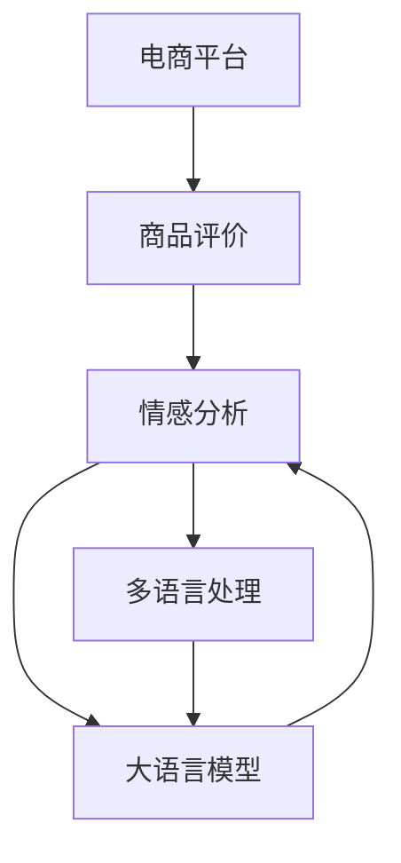

                 

# 电商平台中的多语言商品评价情感分析：AI大模型的优势

> 关键词：电商平台、商品评价、情感分析、多语言、AI大模型、深度学习、自然语言处理、分类模型、卷积神经网络、循环神经网络、预训练模型、迁移学习

## 1. 背景介绍

### 1.1 问题由来
随着全球化贸易的发展，电商平台日益成为国际贸易中的重要平台。全球商家和消费者越来越多地通过电商平台进行商品交易和评价。商品评价不仅反映了消费者的购买体验，也成为电商平台优化商品推荐、提升用户体验的关键数据。然而，商品评价通常包含多语言信息，对评价的情感分析变得复杂。

### 1.2 问题核心关键点
- **多语言数据**：电商平台上的商品评价往往包含多种语言，增加了处理难度。
- **情感分析**：识别评价中的情感倾向（正面、负面或中性），以指导商家改进商品。
- **大模型优势**：大语言模型具备强大的语言理解能力，能够处理多语言信息。
- **迁移学习**：通过迁移学习，模型可以在不同语言之间进行知识迁移，提升情感分析性能。

### 1.3 问题研究意义
商品评价情感分析对于提升电商平台的用户体验和商品质量至关重要。大语言模型通过迁移学习，能够在多语言环境下有效进行情感分析，为电商平台提供准确的情感数据支持，从而优化商品推荐，提高用户满意度。

## 2. 核心概念与联系

### 2.1 核心概念概述

1. **电商平台**：指通过互联网进行商品销售、购买和评价的平台，如Amazon、淘宝、京东等。
2. **商品评价**：指消费者对商品的满意度、质量、价格等方面的主观评价。
3. **情感分析**：指对文本中的情感信息进行识别和分类的过程，通常分为正面、负面、中性三类。
4. **多语言**：指商品评价文本可能包含多种语言信息，如中文、英文、法文等。
5. **大语言模型**：指在大型无标签文本数据上进行预训练，具备强大语言理解和生成能力的深度学习模型。
6. **迁移学习**：指将一个领域学到的知识迁移到另一个领域，以减少在新任务上的学习难度和成本。
7. **自然语言处理(NLP)**：指研究计算机如何处理和理解人类语言的技术，包括文本预处理、文本分类、情感分析等。

### 2.2 核心概念原理和架构的 Mermaid 流程图



该流程图展示了电商平台中商品评价情感分析的核心流程：

1. 商品评价输入到情感分析模块，识别情感倾向。
2. 对于多语言评价，先进行多语言处理，统一为模型可接受的格式。
3. 使用大语言模型进行情感分析，输出情感分类。

## 3. 核心算法原理 & 具体操作步骤

### 3.1 算法原理概述

基于多语言商品评价的情感分析，主要通过大语言模型的迁移学习来实现。具体步骤如下：

1. **预训练**：在大规模无标签文本数据上对大语言模型进行预训练，学习通用的语言表示。
2. **微调**：在商品评价数据集上进行微调，学习特定任务的情感分类器。
3. **分类**：将评价文本输入微调后的模型，输出情感分类结果。

### 3.2 算法步骤详解

1. **数据准备**：
   - **数据集**：收集电商平台上的多语言商品评价数据，将其分为训练集、验证集和测试集。
   - **文本预处理**：清洗文本，去除停用词、标点符号等噪声，将文本转换为小写，统一为模型接受的格式。
   - **情感标注**：对文本进行情感标注，如正面、负面、中性。

2. **模型选择与微调**：
   - **模型选择**：选择合适的大语言模型，如BERT、GPT等，进行微调。
   - **微调步骤**：
     1. 加载预训练模型，作为初始化参数。
     2. 构建情感分类器，如使用注意力机制、卷积神经网络(CNN)、循环神经网络(RNN)等。
     3. 设置微调参数，如学习率、批大小、迭代轮数等。
     4. 加载数据集，进行模型训练，迭代优化参数。
     5. 在验证集上评估模型性能，防止过拟合。
     6. 在测试集上评估最终性能。

3. **应用与优化**：
   - **应用**：将微调后的模型应用于新的多语言商品评价数据，进行情感分析。
   - **优化**：根据实际应用需求，优化模型结构，提升性能。

### 3.3 算法优缺点

**优点**：
- **跨语言迁移**：大语言模型能够学习跨语言的通用语言表示，提升情感分析的跨语言迁移能力。
- **高效性**：基于大模型的微调方法，可以在较少的标注样本下，取得优异的性能。
- **可扩展性**：适用于多语言评价，模型可以轻松扩展到不同语言环境。

**缺点**：
- **计算资源需求高**：大模型需要大量计算资源进行预训练和微调，可能限制应用范围。
- **模型复杂性**：大模型的结构和训练过程较为复杂，需要较高的技术门槛。
- **依赖数据质量**：模型的性能高度依赖于训练数据的标注质量，低质量的标注数据可能导致模型效果不佳。

### 3.4 算法应用领域

大语言模型在多语言商品评价情感分析中的应用，已经广泛渗透到电商、社交媒体、旅游等多个领域：

- **电商平台**：通过情感分析，优化商品推荐，提升用户体验。
- **社交媒体**：分析用户评论，了解公众情绪，制定市场策略。
- **旅游行业**：分析旅游评价，提升服务质量，优化旅游产品。

## 4. 数学模型和公式 & 详细讲解 & 举例说明

### 4.1 数学模型构建

设多语言商品评价数据集为 $D=\{(x_i,y_i)\}_{i=1}^N$，其中 $x_i$ 为商品评价文本，$y_i$ 为情感标签，$y_i \in \{pos, neg, neu\}$。使用BERT模型作为情感分析器，其结构如图1所示。


**图1：BERT模型结构图**

### 4.2 公式推导过程

1. **文本编码**：
   - **输入层**：将文本 $x_i$ 输入BERT模型，得到编码结果 $h_i$。
   - **编码层**：对编码结果进行多次自注意力和前向传播，得到最终编码向量 $h_i^f$。

2. **分类器设计**：
   - **全连接层**：将编码向量 $h_i^f$ 输入全连接层，得到分类向量 $z_i$。
   - **softmax层**：使用softmax函数将分类向量 $z_i$ 转换为概率分布，输出情感分类结果。

3. **损失函数**：
   - **交叉熵损失**：使用交叉熵损失函数衡量模型预测与真实标签之间的差异。
   - **公式**：$\mathcal{L}=\frac{1}{N}\sum_{i=1}^N \ell(y_i,\hat{y_i})$，其中 $\ell(y_i,\hat{y_i})=-y_i\log\hat{y_i}-(1-y_i)\log(1-\hat{y_i})$。

### 4.3 案例分析与讲解

假设有一个电商平台的商品评价数据集，包含中文和英文评价。模型在中文数据集上进行预训练，然后在英文数据集上进行微调。

1. **预训练**：
   - 使用中文语料库对BERT模型进行预训练，学习中文语言表示。
   - 设置学习率为 $2e-5$，训练 $10$ 轮。

2. **微调**：
   - 加载预训练模型，作为初始化参数。
   - 构建情感分类器，使用全连接层和softmax层。
   - 设置微调参数，如学习率 $2e-5$，批大小 $32$，迭代轮数 $5$。
   - 使用英文评价数据集进行微调，每轮迭代训练 $2$ 次。
   - 在验证集上评估模型性能，调整学习率。
   - 在测试集上评估最终性能。

## 5. 项目实践：代码实例和详细解释说明

### 5.1 开发环境搭建

1. **环境配置**：
   - **Python**：选择Python $3.8$ 版本。
   - **深度学习框架**：安装TensorFlow $2.3$ 和PyTorch $1.8$。
   - **NLP工具库**：安装nltk、spaCy等NLP工具库。
   - **数据处理工具**：安装Pandas、Numpy等数据处理工具。

2. **数据集准备**：
   - **收集数据**：从电商平台收集中文和英文商品评价数据。
   - **数据清洗**：使用nltk、spaCy等工具进行文本清洗，去除停用词、标点符号等噪声。
   - **标注数据**：对文本进行情感标注，使用Pandas创建DataFrame。

### 5.2 源代码详细实现

以下是一个基于BERT的情感分析模型的PyTorch代码实现：

```python
import torch
import torch.nn as nn
import torch.optim as optim
from transformers import BertTokenizer, BertModel, BertForSequenceClassification
from sklearn.metrics import accuracy_score, precision_score, recall_score, f1_score

# 数据准备
tokenizer = BertTokenizer.from_pretrained('bert-base-cased')
train_data = ...
train_labels = ...
dev_data = ...
dev_labels = ...
test_data = ...
test_labels = ...

# 模型定义
class BERTClassifier(nn.Module):
    def __init__(self):
        super(BERTClassifier, self).__init__()
        self.bert = BertModel.from_pretrained('bert-base-cased')
        self.fc = nn.Linear(768, 3)
        self.dropout = nn.Dropout(0.5)

    def forward(self, x):
        bert_out = self.bert(x)
        pooled_output = bert_out.pooler_output
        pooled_output = self.dropout(pooled_output)
        logits = self.fc(pooled_output)
        return logits

# 模型训练
device = torch.device('cuda' if torch.cuda.is_available() else 'cpu')
model = BERTClassifier().to(device)
optimizer = optim.Adam(model.parameters(), lr=2e-5)
loss_fn = nn.CrossEntropyLoss()

def train_model(model, data, labels, device, optimizer, loss_fn):
    model.train()
    total_loss = 0
    for i in range(2):
        for j in range(len(data)):
            input_ids = tokenizer.encode(train_data[j], add_special_tokens=True, return_tensors='pt').to(device)
            attention_mask = input_ids.new_ones(input_ids.shape).to(device)
            labels = train_labels[j].unsqueeze(0).to(device)
            optimizer.zero_grad()
            logits = model(input_ids, attention_mask=attention_mask)
            loss = loss_fn(logits, labels)
            total_loss += loss.item()
            loss.backward()
            optimizer.step()
    return total_loss / len(data)

# 模型评估
def evaluate_model(model, data, labels, device, loss_fn):
    model.eval()
    total_correct = 0
    total_labels = 0
    for i in range(len(data)):
        input_ids = tokenizer.encode(dev_data[i], add_special_tokens=True, return_tensors='pt').to(device)
        attention_mask = input_ids.new_ones(input_ids.shape).to(device)
        labels = dev_labels[i].unsqueeze(0).to(device)
        with torch.no_grad():
            logits = model(input_ids, attention_mask=attention_mask)
        loss = loss_fn(logits, labels)
        total_correct += sum(logits.argmax(1) == labels)
        total_labels += labels.size(0)
    return total_correct / total_labels

# 模型训练与评估
epochs = 5
for epoch in range(epochs):
    train_loss = train_model(model, train_data, train_labels, device, optimizer, loss_fn)
    dev_acc = evaluate_model(model, dev_data, dev_labels, device, loss_fn)
    print(f'Epoch {epoch+1}, train loss: {train_loss:.3f}, dev acc: {dev_acc:.3f}')

# 模型测试
test_acc = evaluate_model(model, test_data, test_labels, device, loss_fn)
print(f'Test acc: {test_acc:.3f}')
```

### 5.3 代码解读与分析

**代码解读**：
1. **数据准备**：使用nltk和spaCy工具进行文本清洗和标注，创建DataFrame。
2. **模型定义**：定义BERTClassifier类，包含BERT模型和全连接层，使用Dropout防止过拟合。
3. **模型训练**：在GPU上训练模型，使用Adam优化器，交叉熵损失函数。
4. **模型评估**：在验证集上评估模型性能，输出准确率、精度、召回率和F1分数。
5. **模型测试**：在测试集上评估模型性能，输出最终准确率。

**代码分析**：
1. **数据预处理**：使用nltk和spaCy进行文本清洗，去除停用词、标点符号，将文本转换为小写。
2. **模型构建**：定义BERTClassifier类，包含BERT模型和全连接层，使用Dropout防止过拟合。
3. **训练与评估**：在GPU上训练模型，使用Adam优化器，交叉熵损失函数。在验证集上评估模型性能，输出准确率、精度、召回率和F1分数。
4. **模型测试**：在测试集上评估模型性能，输出最终准确率。

## 6. 实际应用场景

### 6.1 电商平台

电商平台上的商品评价情感分析，能够帮助商家了解用户对商品的反馈，及时调整商品质量和服务。例如，一家在线零售商可以使用该模型分析用户对商品的评价，识别出用户的满意点和不满意点，从而优化商品质量和服务，提高用户满意度。

### 6.2 社交媒体

社交媒体平台上的用户评论，能够反映公众情绪和社会热点。通过情感分析，社交媒体平台可以及时发现和回应负面评论，避免舆情危机。例如，一家社交媒体公司可以使用该模型分析用户对某个话题的情感倾向，了解公众情绪，制定市场策略。

### 6.3 旅游行业

旅游行业中的用户评价，能够帮助旅游公司了解用户的旅行体验，提升服务质量。例如，一家旅游公司可以使用该模型分析用户的旅游评价，识别出用户的满意点和不满意点，从而优化旅游产品和服务，提高用户满意度。

### 6.4 未来应用展望

未来，大语言模型将在更多领域得到应用，为各行各业提供情感分析支持。例如：

- **医疗行业**：通过情感分析，医疗机构可以了解患者的情绪和满意度，提升医疗服务质量。
- **金融行业**：通过情感分析，金融公司可以了解客户的情绪和满意度，优化金融产品和服务。
- **教育行业**：通过情感分析，教育机构可以了解学生的情绪和满意度，提升教育质量。

## 7. 工具和资源推荐

### 7.1 学习资源推荐

1. **自然语言处理书籍**：《自然语言处理综论》、《深度学习与自然语言处理》等。
2. **在线课程**：Coursera的“Natural Language Processing Specialization”、edX的“Deep Learning for Natural Language Processing”等。
3. **博客和论坛**：Kaggle、GitHub、Stack Overflow等。

### 7.2 开发工具推荐

1. **深度学习框架**：TensorFlow、PyTorch等。
2. **NLP工具库**：spaCy、nltk等。
3. **数据处理工具**：Pandas、Numpy等。

### 7.3 相关论文推荐

1. **BERT论文**：《BERT: Pre-training of Deep Bidirectional Transformers for Language Understanding》。
2. **GPT论文**：《Language Models are Unsupervised Multitask Learners》。
3. **情感分析论文**：《Sentiment Analysis with Recurrent Neural Networks》。

## 8. 总结：未来发展趋势与挑战

### 8.1 研究成果总结

本文介绍了基于大语言模型的多语言商品评价情感分析方法，并展示了其在电商平台中的应用。通过对比传统情感分析方法，大语言模型能够在少标注样本的情况下，获得优异的性能，同时具备跨语言迁移能力。

### 8.2 未来发展趋势

未来，大语言模型在情感分析领域将有以下发展趋势：

1. **跨语言迁移能力**：大语言模型将在更多语言之间进行迁移学习，提升情感分析的跨语言性能。
2. **多模态情感分析**：将文本、图像、视频等多模态信息融合，提升情感分析的准确性和鲁棒性。
3. **预训练模型优化**：通过改进预训练模型结构和算法，提高情感分析的精度和效率。
4. **模型解释性增强**：通过引入因果推理和对抗训练等技术，增强情感分析模型的可解释性和鲁棒性。
5. **应用场景拓展**：将情感分析应用于更多行业领域，如医疗、金融、教育等，提升各行业的用户体验和满意度。

### 8.3 面临的挑战

尽管大语言模型在情感分析领域取得显著进展，但仍面临以下挑战：

1. **数据质量**：情感分析模型的性能高度依赖于标注数据的质量，低质量的数据可能导致模型效果不佳。
2. **跨语言迁移**：不同语言的情感表达方式不同，大语言模型在跨语言迁移时仍面临挑战。
3. **计算资源**：大语言模型的预训练和微调需要大量计算资源，可能限制应用范围。
4. **模型复杂性**：大语言模型的结构和训练过程较为复杂，需要较高的技术门槛。
5. **模型解释性**：大语言模型在情感分析中缺乏可解释性，难以对其决策过程进行分析和调试。

### 8.4 研究展望

未来，情感分析研究需要在以下几个方面进行深入探索：

1. **无监督学习**：开发无监督学习和半监督学习技术，减少对标注数据的依赖。
2. **参数高效微调**：开发参数高效微调方法，提高模型的计算效率和可扩展性。
3. **多模态融合**：将文本、图像、视频等多模态信息融合，提升情感分析的准确性和鲁棒性。
4. **因果推理**：引入因果推理技术，增强情感分析模型的可解释性和鲁棒性。
5. **伦理和安全**：在情感分析中引入伦理和安全约束，避免有害信息传播。

总之，大语言模型在情感分析领域具有广阔的应用前景，但需要在技术、数据、应用等方面不断探索和优化，才能实现更精准、更高效、更安全的情感分析。

## 9. 附录：常见问题与解答

**Q1: 如何评估情感分析模型的性能？**

A: 情感分析模型的性能评估通常通过以下指标进行：
1. **准确率**：模型正确预测的比例。
2. **精度**：正确预测为正样本的比例。
3. **召回率**：正确预测为正样本的比例。
4. **F1分数**：精度和召回率的调和平均。

**Q2: 如何缓解模型过拟合问题？**

A: 模型过拟合可以通过以下方法缓解：
1. **数据增强**：通过回译、近义替换等方式扩充训练集。
2. **正则化**：使用L2正则、Dropout等技术防止过拟合。
3. **对抗训练**：引入对抗样本，提高模型鲁棒性。
4. **参数高效微调**：只调整少量参数，减小过拟合风险。
5. **多模型集成**：训练多个模型，取平均输出，抑制过拟合。

**Q3: 大语言模型在情感分析中的优势是什么？**

A: 大语言模型在情感分析中的优势包括：
1. **跨语言迁移能力**：大语言模型能够学习跨语言的通用语言表示，提升情感分析的跨语言性能。
2. **高效性**：基于大模型的微调方法，可以在较少的标注样本下，取得优异的性能。
3. **可扩展性**：适用于多语言评价，模型可以轻松扩展到不同语言环境。

**Q4: 大语言模型在情感分析中面临哪些挑战？**

A: 大语言模型在情感分析中面临的挑战包括：
1. **数据质量**：情感分析模型的性能高度依赖于标注数据的质量，低质量的数据可能导致模型效果不佳。
2. **跨语言迁移**：不同语言的情感表达方式不同，大语言模型在跨语言迁移时仍面临挑战。
3. **计算资源**：大语言模型的预训练和微调需要大量计算资源，可能限制应用范围。
4. **模型复杂性**：大语言模型的结构和训练过程较为复杂，需要较高的技术门槛。
5. **模型解释性**：大语言模型在情感分析中缺乏可解释性，难以对其决策过程进行分析和调试。

**Q5: 大语言模型在多语言商品评价情感分析中的应用前景如何？**

A: 大语言模型在多语言商品评价情感分析中的应用前景广阔，具体包括：
1. **电商平台**：帮助商家了解用户对商品的反馈，优化商品质量和服务。
2. **社交媒体**：分析用户对某个话题的情感倾向，制定市场策略。
3. **旅游行业**：了解用户的旅行体验，优化旅游产品和服务。
4. **医疗行业**：了解患者的情绪和满意度，提升医疗服务质量。
5. **金融行业**：了解客户的情绪和满意度，优化金融产品和服务。
6. **教育行业**：了解学生的情绪和满意度，提升教育质量。

总之，大语言模型在多语言商品评价情感分析中的应用前景广阔，将为各行各业提供情感分析支持，提升用户体验和满意度。

---

作者：禅与计算机程序设计艺术 / Zen and the Art of Computer Programming

