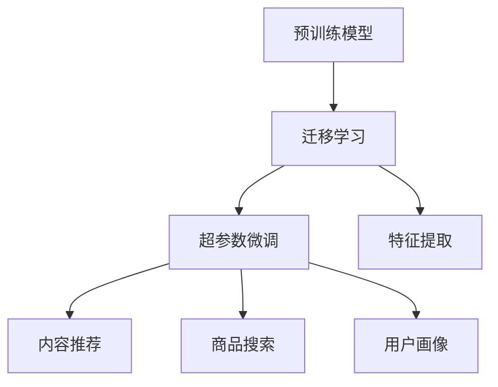

                 

# 电商平台中的大模型迁移学习技术

> 关键词：电商平台,大模型迁移学习,推荐系统,预训练模型,超参数微调,特征提取,内容推荐,商品搜索,用户画像,数据增强

## 1. 背景介绍

随着电商行业的迅速发展，电商平台已成为现代人们日常购物的重要平台。如何提升电商平台的用户体验、提高商品推荐精准度，成为电商平台不断探索的难题。大模型迁移学习技术，通过在大规模无标签数据上进行预训练，再针对特定电商任务进行微调，显著提升了商品推荐系统的精准度和用户体验。本文将对电商平台中的大模型迁移学习技术进行全面介绍，展示其原理、操作步骤、优缺点和应用场景，并通过代码实例和实际应用案例，带领读者深入理解其应用价值。

## 2. 核心概念与联系

### 2.1 核心概念概述

在电商平台中，大模型迁移学习技术主要应用于推荐系统、商品搜索、用户画像等关键模块。其核心概念包括：

- **预训练模型**：如BERT、GPT等，通过大规模无标签数据进行自监督学习，学习到丰富的语言表示。
- **迁移学习**：将预训练模型迁移应用于特定任务，通过微调调整模型，使其适应电商任务的特点。
- **超参数微调**：调整学习率、批大小、迭代轮数等超参数，以优化模型在电商任务上的性能。
- **特征提取**：将电商文本数据（如商品描述、用户评论、搜索关键词等）转换为模型能够理解的数值向量，输入到预训练模型中进行嵌入。
- **内容推荐**：基于用户历史行为和偏好，推荐商品，提升用户体验和销售转化率。
- **商品搜索**：根据用户输入的关键词，快速定位到相关商品，提升搜索体验。
- **用户画像**：通过用户行为数据，构建用户兴趣模型，提升个性化推荐效果。

这些核心概念通过迁移学习范式，紧密联系起来。预训练模型提供了底层语言表示，迁移学习通过微调将其应用于电商任务，超参数微调用于优化模型参数，特征提取将电商数据转换为数值形式，内容推荐和商品搜索、用户画像应用场景则是迁移学习在电商平台中的具体应用。

### 2.2 核心概念原理和架构的 Mermaid 流程图



该图展示了从预训练模型到迁移学习，再到超参数微调、特征提取、内容推荐、商品搜索和用户画像的架构关系。迁移学习是大模型迁移学习技术的核心，通过微调预训练模型，使其适应电商平台的特定任务。超参数微调用于优化模型性能，特征提取将电商数据转换为数值形式，内容推荐、商品搜索和用户画像则是迁移学习在实际应用中的具体体现。

## 3. 核心算法原理 & 具体操作步骤

### 3.1 算法原理概述

电商平台中的大模型迁移学习技术主要基于迁移学习框架，通过在大规模无标签数据上进行预训练，然后在电商任务上进行微调，以提升模型在特定任务上的性能。预训练模型通常通过自监督任务进行学习，如语言模型、掩码语言模型等。在电商任务上，通过对预训练模型的微调，模型可以学习到电商领域特有的知识，如商品类别、用户兴趣、购物行为等。

具体来说，大模型迁移学习技术的算法原理如下：

1. **预训练模型**：在大规模无标签文本数据上进行预训练，学习通用的语言表示。
2. **迁移学习**：在电商任务上进行微调，调整预训练模型，使其适应电商领域的特点。
3. **特征提取**：将电商数据转换为模型能够理解的数值形式，输入到预训练模型中进行嵌入。
4. **超参数微调**：调整学习率、批大小、迭代轮数等超参数，以优化模型性能。

### 3.2 算法步骤详解

电商平台中的大模型迁移学习技术主要包括以下几个步骤：

**Step 1: 准备预训练模型和数据集**
- 选择合适的预训练语言模型，如BERT、GPT等。
- 准备电商任务的数据集，包括商品描述、用户评论、搜索关键词等。

**Step 2: 添加任务适配层**
- 根据任务类型，在预训练模型顶层设计合适的输出层和损失函数。
- 对于分类任务，通常在顶层添加线性分类器和交叉熵损失函数。
- 对于生成任务，通常使用语言模型的解码器输出概率分布，并以负对数似然为损失函数。

**Step 3: 设置微调超参数**
- 选择合适的优化算法及其参数，如AdamW、SGD等，设置学习率、批大小、迭代轮数等。
- 设置正则化技术及强度，包括权重衰减、Dropout、Early Stopping等。
- 确定冻结预训练参数的策略，如仅微调顶层，或全部参数都参与微调。

**Step 4: 执行梯度训练**
- 将训练集数据分批次输入模型，前向传播计算损失函数。
- 反向传播计算参数梯度，根据设定的优化算法和学习率更新模型参数。
- 周期性在验证集上评估模型性能，根据性能指标决定是否触发 Early Stopping。
- 重复上述步骤直到满足预设的迭代轮数或 Early Stopping 条件。

**Step 5: 测试和部署**
- 在测试集上评估微调后模型在电商任务上的性能，对比微调前后的精度提升。
- 使用微调后的模型对新样本进行推理预测，集成到实际的应用系统中。
- 持续收集新的数据，定期重新微调模型，以适应数据分布的变化。

### 3.3 算法优缺点

大模型迁移学习技术在电商平台中的应用具有以下优点：

- **高效性**：利用大规模预训练模型，减少了从头训练的资源和时间投入。
- **泛化能力**：通过迁移学习，模型能够在少样本条件下快速适应电商任务。
- **可扩展性**：模型可以通过微调不断优化，适应电商领域的变化。

同时，该方法也存在一定的局限性：

- **标注成本高**：电商任务通常需要大量标注数据，获取高质量标注数据的成本较高。
- **模型复杂度高**：大模型迁移学习技术需要处理复杂的电商数据，模型结构较为复杂。
- **过拟合风险**：如果数据分布变化较大，模型可能出现过拟合现象。

尽管存在这些局限性，但就目前而言，大模型迁移学习技术仍是电商平台中提升推荐系统、商品搜索、用户画像等模块性能的重要手段。

### 3.4 算法应用领域

大模型迁移学习技术在电商平台中的应用领域包括但不限于：

- **商品推荐系统**：基于用户历史行为和偏好，推荐相关商品，提升用户体验和销售转化率。
- **商品搜索系统**：根据用户输入的关键词，快速定位到相关商品，提升搜索体验。
- **用户画像系统**：通过用户行为数据，构建用户兴趣模型，提升个性化推荐效果。
- **异常检测系统**：通过微调模型，检测商品描述、用户评论中的异常内容，保障平台安全。

这些应用领域展示了大模型迁移学习技术在电商平台中的广泛应用价值。

## 4. 数学模型和公式 & 详细讲解

### 4.1 数学模型构建

电商平台中的大模型迁移学习技术主要利用大语言模型进行迁移学习。以BERT为例，其数学模型构建如下：

1. **输入层**：将电商文本数据转换为模型能够理解的数值向量，输入到BERT中进行嵌入。
2. **BERT模型**：通过多层的Transformer结构，将输入的数值向量进行嵌入，得到高维的语义表示。
3. **输出层**：根据任务类型，设计合适的输出层，如线性分类器、解码器等。
4. **损失函数**：根据任务类型，设计相应的损失函数，如交叉熵、负对数似然等。

### 4.2 公式推导过程

以商品推荐系统为例，使用Cross-Entropy损失函数进行模型训练，其公式推导过程如下：

假设输入为商品描述文本，输出为商品类别标签，模型输出为每个类别的概率分布。则交叉熵损失函数定义为：

$$
\mathcal{L} = -\frac{1}{N}\sum_{i=1}^N \sum_{j=1}^C y_{ij}\log p_{ij}
$$

其中，$N$ 为样本数，$C$ 为类别数，$y_{ij}$ 为第 $i$ 个样本是否属于第 $j$ 个类别的标签，$p_{ij}$ 为模型预测该样本属于第 $j$ 个类别的概率。

通过反向传播算法，可以计算出模型参数 $\theta$ 的梯度，进行优化更新：

$$
\theta \leftarrow \theta - \eta \nabla_{\theta}\mathcal{L}(\theta)
$$

其中，$\eta$ 为学习率。

### 4.3 案例分析与讲解

以电商平台中的用户画像系统为例，分析大模型迁移学习技术的应用。

假设任务为预测用户对某类商品的兴趣程度，模型输入为用户行为数据（如浏览历史、购买记录等），输出为商品类别标签。模型通过微调BERT模型，得到每个类别的概率分布，并根据预测结果构建用户画像，推荐相关商品。

## 5. 项目实践：代码实例和详细解释说明

### 5.1 开发环境搭建

在进行电商项目开发时，需要配置好相应的开发环境。以下是使用Python进行PyTorch开发的环境配置流程：

1. 安装Anaconda：从官网下载并安装Anaconda，用于创建独立的Python环境。

2. 创建并激活虚拟环境：
```bash
conda create -n pytorch-env python=3.8 
conda activate pytorch-env
```

3. 安装PyTorch：根据CUDA版本，从官网获取对应的安装命令。例如：
```bash
conda install pytorch torchvision torchaudio cudatoolkit=11.1 -c pytorch -c conda-forge
```

4. 安装Transformers库：
```bash
pip install transformers
```

5. 安装各类工具包：
```bash
pip install numpy pandas scikit-learn matplotlib tqdm jupyter notebook ipython
```

完成上述步骤后，即可在`pytorch-env`环境中开始项目实践。

### 5.2 源代码详细实现

下面我们以商品推荐系统为例，给出使用Transformers库对BERT模型进行电商任务微调的PyTorch代码实现。

首先，定义电商任务的数据处理函数：

```python
from transformers import BertTokenizer
from torch.utils.data import Dataset
import torch

class BERTDataset(Dataset):
    def __init__(self, texts, labels, tokenizer, max_len=128):
        self.texts = texts
        self.labels = labels
        self.tokenizer = tokenizer
        self.max_len = max_len
        
    def __len__(self):
        return len(self.texts)
    
    def __getitem__(self, item):
        text = self.texts[item]
        label = self.labels[item]
        
        encoding = self.tokenizer(text, return_tensors='pt', max_length=self.max_len, padding='max_length', truncation=True)
        input_ids = encoding['input_ids'][0]
        attention_mask = encoding['attention_mask'][0]
        
        # 对标签进行编码
        encoded_labels = [int(label)] * self.max_len
        labels = torch.tensor(encoded_labels, dtype=torch.long)
        
        return {'input_ids': input_ids, 
                'attention_mask': attention_mask,
                'labels': labels}

# 标签与id的映射
label2id = {0: 'uninterested', 1: 'interested'}
id2label = {v: k for k, v in label2id.items()}

# 创建dataset
tokenizer = BertTokenizer.from_pretrained('bert-base-cased')

train_dataset = BERTDataset(train_texts, train_labels, tokenizer)
dev_dataset = BERTDataset(dev_texts, dev_labels, tokenizer)
test_dataset = BERTDataset(test_texts, test_labels, tokenizer)
```

然后，定义模型和优化器：

```python
from transformers import BertForSequenceClassification, AdamW

model = BertForSequenceClassification.from_pretrained('bert-base-cased', num_labels=len(label2id))

optimizer = AdamW(model.parameters(), lr=2e-5)
```

接着，定义训练和评估函数：

```python
from torch.utils.data import DataLoader
from tqdm import tqdm
from sklearn.metrics import classification_report

device = torch.device('cuda') if torch.cuda.is_available() else torch.device('cpu')
model.to(device)

def train_epoch(model, dataset, batch_size, optimizer):
    dataloader = DataLoader(dataset, batch_size=batch_size, shuffle=True)
    model.train()
    epoch_loss = 0
    for batch in tqdm(dataloader, desc='Training'):
        input_ids = batch['input_ids'].to(device)
        attention_mask = batch['attention_mask'].to(device)
        labels = batch['labels'].to(device)
        model.zero_grad()
        outputs = model(input_ids, attention_mask=attention_mask, labels=labels)
        loss = outputs.loss
        epoch_loss += loss.item()
        loss.backward()
        optimizer.step()
    return epoch_loss / len(dataloader)

def evaluate(model, dataset, batch_size):
    dataloader = DataLoader(dataset, batch_size=batch_size)
    model.eval()
    preds, labels = [], []
    with torch.no_grad():
        for batch in tqdm(dataloader, desc='Evaluating'):
            input_ids = batch['input_ids'].to(device)
            attention_mask = batch['attention_mask'].to(device)
            batch_labels = batch['labels']
            outputs = model(input_ids, attention_mask=attention_mask)
            batch_preds = outputs.logits.argmax(dim=2).to('cpu').tolist()
            batch_labels = batch_labels.to('cpu').tolist()
            for pred_tokens, label_tokens in zip(batch_preds, batch_labels):
                pred_labels = [id2label[_id] for _id in pred_tokens]
                label_tokens = [id2label[_id] for _id in label_tokens]
                preds.append(pred_labels[:len(label_tokens)])
                labels.append(label_tokens)
                
    print(classification_report(labels, preds))
```

最后，启动训练流程并在测试集上评估：

```python
epochs = 5
batch_size = 16

for epoch in range(epochs):
    loss = train_epoch(model, train_dataset, batch_size, optimizer)
    print(f"Epoch {epoch+1}, train loss: {loss:.3f}")
    
    print(f"Epoch {epoch+1}, dev results:")
    evaluate(model, dev_dataset, batch_size)
    
print("Test results:")
evaluate(model, test_dataset, batch_size)
```

以上就是使用PyTorch对BERT进行电商推荐系统微调的完整代码实现。可以看到，借助Transformers库，代码实现变得简洁高效。

### 5.3 代码解读与分析

让我们再详细解读一下关键代码的实现细节：

**BERTDataset类**：
- `__init__`方法：初始化文本、标签、分词器等关键组件。
- `__len__`方法：返回数据集的样本数量。
- `__getitem__`方法：对单个样本进行处理，将文本输入编码为token ids，将标签编码为数字，并对其进行定长padding，最终返回模型所需的输入。

**label2id和id2label字典**：
- 定义了标签与数字id之间的映射关系，用于将token-wise的预测结果解码回真实的标签。

**训练和评估函数**：
- 使用PyTorch的DataLoader对数据集进行批次化加载，供模型训练和推理使用。
- 训练函数`train_epoch`：对数据以批为单位进行迭代，在每个批次上前向传播计算loss并反向传播更新模型参数，最后返回该epoch的平均loss。
- 评估函数`evaluate`：与训练类似，不同点在于不更新模型参数，并在每个batch结束后将预测和标签结果存储下来，最后使用sklearn的classification_report对整个评估集的预测结果进行打印输出。

**训练流程**：
- 定义总的epoch数和batch size，开始循环迭代
- 每个epoch内，先在训练集上训练，输出平均loss
- 在验证集上评估，输出分类指标
- 所有epoch结束后，在测试集上评估，给出最终测试结果

可以看到，PyTorch配合Transformers库使得BERT微调的代码实现变得简洁高效。开发者可以将更多精力放在数据处理、模型改进等高层逻辑上，而不必过多关注底层的实现细节。

当然，工业级的系统实现还需考虑更多因素，如模型的保存和部署、超参数的自动搜索、更灵活的任务适配层等。但核心的微调范式基本与此类似。

## 6. 实际应用场景

### 6.1 智能推荐系统

电商平台的推荐系统是提升用户体验、提高销售转化率的重要组成部分。传统的推荐系统往往依赖用户的历史行为数据进行推荐，难以捕捉用户的兴趣点。基于大模型迁移学习技术的推荐系统，可以通过微调预训练语言模型，学习到用户对商品的兴趣和偏好，实现个性化推荐。

在技术实现上，可以收集用户浏览、点击、评论、收藏等行为数据，提取商品描述、用户评论等文本内容。将文本内容作为模型输入，用户的后续行为作为监督信号，在此基础上微调预训练语言模型。微调后的模型能够从文本内容中准确把握用户的兴趣点，生成更加个性化的商品推荐。

### 6.2 商品搜索系统

商品搜索系统是电商平台中另一个重要的功能模块。传统的搜索系统往往依赖关键词匹配，难以理解用户的查询意图。基于大模型迁移学习技术的搜索系统，可以通过微调预训练语言模型，学习到用户查询意图和商品描述之间的关系，实现更加精准的商品定位。

在技术实现上，可以收集用户输入的搜索关键词和商品描述，将文本内容作为模型输入，商品的搜索结果作为监督信号，在此基础上微调预训练语言模型。微调后的模型能够从文本中提取关键词和描述之间的关系，生成更加精准的搜索结果。

### 6.3 用户画像系统

用户画像系统是电商平台中用于分析用户行为、兴趣、偏好等特征的重要模块。传统的用户画像系统往往依赖人工标注，难以大规模获取用户画像。基于大模型迁移学习技术的用户画像系统，可以通过微调预训练语言模型，学习到用户行为数据中的语义信息，自动生成用户画像。

在技术实现上，可以收集用户行为数据，提取商品描述、用户评论等文本内容。将文本内容作为模型输入，用户的后续行为作为监督信号，在此基础上微调预训练语言模型。微调后的模型能够从文本中提取用户行为特征，自动生成用户画像，用于后续的个性化推荐和广告投放等场景。

### 6.4 未来应用展望

随着大模型迁移学习技术的不断发展，未来在电商平台中的应用前景将更加广阔。

在智慧零售领域，基于大模型迁移学习技术的推荐系统、搜索系统、用户画像系统，将进一步提升用户的购物体验，提高销售转化率。

在供应链管理中，基于大模型迁移学习技术的商品分类、库存预测、物流优化等系统，将提高供应链的自动化和智能化水平，提升供应链的效率和灵活性。

在智能客服中，基于大模型迁移学习技术的对话系统、知识图谱等系统，将提升客服系统的智能化水平，减轻人工客服的工作压力。

总之，大模型迁移学习技术将在电商平台的各个环节发挥重要作用，带来显著的业务价值。

## 7. 工具和资源推荐

### 7.1 学习资源推荐

为了帮助开发者系统掌握大模型迁移学习技术的理论基础和实践技巧，这里推荐一些优质的学习资源：

1. 《Transformer from Zero to Hero》系列博文：由大模型技术专家撰写，深入浅出地介绍了Transformer原理、BERT模型、迁移学习等前沿话题。

2. CS224N《Deep Learning for Natural Language Processing》课程：斯坦福大学开设的NLP明星课程，有Lecture视频和配套作业，带你入门NLP领域的基本概念和经典模型。

3. 《Natural Language Processing with Transformers》书籍：Transformers库的作者所著，全面介绍了如何使用Transformers库进行NLP任务开发，包括迁移学习在内的诸多范式。

4. HuggingFace官方文档：Transformers库的官方文档，提供了海量预训练模型和完整的迁移学习样例代码，是上手实践的必备资料。

5. CLUE开源项目：中文语言理解测评基准，涵盖大量不同类型的中文NLP数据集，并提供了基于迁移学习的baseline模型，助力中文NLP技术发展。

通过对这些资源的学习实践，相信你一定能够快速掌握大模型迁移学习技术的精髓，并用于解决实际的电商问题。

### 7.2 开发工具推荐

高效的开发离不开优秀的工具支持。以下是几款用于大模型迁移学习开发的常用工具：

1. PyTorch：基于Python的开源深度学习框架，灵活动态的计算图，适合快速迭代研究。大部分预训练语言模型都有PyTorch版本的实现。

2. TensorFlow：由Google主导开发的开源深度学习框架，生产部署方便，适合大规模工程应用。同样有丰富的预训练语言模型资源。

3. Transformers库：HuggingFace开发的NLP工具库，集成了众多SOTA语言模型，支持PyTorch和TensorFlow，是进行迁移学习任务开发的利器。

4. Weights & Biases：模型训练的实验跟踪工具，可以记录和可视化模型训练过程中的各项指标，方便对比和调优。与主流深度学习框架无缝集成。

5. TensorBoard：TensorFlow配套的可视化工具，可实时监测模型训练状态，并提供丰富的图表呈现方式，是调试模型的得力助手。

6. Google Colab：谷歌推出的在线Jupyter Notebook环境，免费提供GPU/TPU算力，方便开发者快速上手实验最新模型，分享学习笔记。

合理利用这些工具，可以显著提升大模型迁移学习任务的开发效率，加快创新迭代的步伐。

### 7.3 相关论文推荐

大模型迁移学习技术的发展源于学界的持续研究。以下是几篇奠基性的相关论文，推荐阅读：

1. Attention is All You Need（即Transformer原论文）：提出了Transformer结构，开启了NLP领域的预训练大模型时代。

2. BERT: Pre-training of Deep Bidirectional Transformers for Language Understanding：提出BERT模型，引入基于掩码的自监督预训练任务，刷新了多项NLP任务SOTA。

3. Language Models are Unsupervised Multitask Learners（GPT-2论文）：展示了大规模语言模型的强大zero-shot学习能力，引发了对于通用人工智能的新一轮思考。

4. Parameter-Efficient Transfer Learning for NLP：提出Adapter等参数高效微调方法，在不增加模型参数量的情况下，也能取得不错的迁移学习效果。

5. Prefix-Tuning: Optimizing Continuous Prompts for Generation：引入基于连续型Prompt的迁移学习范式，为如何充分利用预训练知识提供了新的思路。

6. AdaLoRA: Adaptive Low-Rank Adaptation for Parameter-Efficient Fine-Tuning：使用自适应低秩适应的迁移学习方法，在参数效率和精度之间取得了新的平衡。

这些论文代表了大模型迁移学习技术的发展脉络。通过学习这些前沿成果，可以帮助研究者把握学科前进方向，激发更多的创新灵感。

## 8. 总结：未来发展趋势与挑战

### 8.1 总结

本文对电商平台中的大模型迁移学习技术进行了全面系统的介绍。首先阐述了大模型迁移学习技术的研究背景和意义，明确了迁移学习在电商任务中的独特价值。其次，从原理到实践，详细讲解了大模型迁移学习的数学原理和关键步骤，给出了迁移学习任务开发的完整代码实例。同时，本文还广泛探讨了大模型迁移学习技术在推荐系统、商品搜索、用户画像等电商应用场景中的应用前景，展示了其广泛的业务价值。

通过本文的系统梳理，可以看到，基于大模型迁移学习技术在电商平台中的应用，显著提升了电商平台的智能化水平和用户体验。大模型迁移学习技术的未来发展将更加广阔，为电商平台的各个环节带来显著的业务价值。

### 8.2 未来发展趋势

展望未来，大模型迁移学习技术将在电商平台中的应用呈现以下几个发展趋势：

1. **模型规模增大**：随着算力成本的下降和数据规模的扩张，预训练语言模型的参数量还将持续增长。超大规模语言模型蕴含的丰富语言知识，将支撑更加复杂多变的电商任务。

2. **迁移学习范式多样**：除了传统的迁移学习外，未来将涌现更多参数高效的迁移学习方法，如 Adapter、Prefix-Tuning 等，在节省计算资源的同时，也能保证迁移学习的精度。

3. **持续学习和自适应**：未来的电商系统需要不断从新数据中学习，保持已学习的知识，避免灾难性遗忘。这需要模型具备持续学习的能力，适应电商领域的变化。

4. **跨模态融合**：当前迁移学习主要聚焦于纯文本数据，未来将进一步拓展到图像、视频、语音等多模态数据迁移学习。多模态信息的融合，将提升模型对现实世界的理解能力。

5. **知识表示和推理**：将符号化的先验知识，如知识图谱、逻辑规则等，与神经网络模型进行巧妙融合，引导迁移学习过程学习更准确、合理的语言模型。

以上趋势凸显了大模型迁移学习技术的广阔前景。这些方向的探索发展，必将进一步提升电商平台中推荐系统、搜索系统、用户画像等模块的性能和用户体验，为电商平台的智能化转型提供强有力的技术支撑。

### 8.3 面临的挑战

尽管大模型迁移学习技术在电商应用中取得了显著成效，但在其发展过程中仍面临诸多挑战：

1. **标注数据获取成本高**：电商任务通常需要大量标注数据，获取高质量标注数据的成本较高。如何降低标注成本，是未来大模型迁移学习技术面临的重要挑战。

2. **模型复杂度高**：大模型迁移学习技术需要处理复杂的电商数据，模型结构较为复杂。如何降低模型复杂度，提高模型训练和推理效率，是未来的研究方向。

3. **鲁棒性不足**：当前迁移学习模型面对域外数据时，泛化性能往往大打折扣。如何提高迁移学习模型的鲁棒性，避免灾难性遗忘，还需要更多理论和实践的积累。

4. **可解释性不足**：当前迁移学习模型更像是“黑盒”系统，难以解释其内部工作机制和决策逻辑。对于高风险应用，算法的可解释性和可审计性尤为重要。

5. **安全性问题**：预训练语言模型难免会学习到有偏见、有害的信息，通过迁移学习传递到下游任务，产生误导性、歧视性的输出，给实际应用带来安全隐患。

这些挑战需要在未来的研究中得到克服，以促进大模型迁移学习技术的成熟和普及。

### 8.4 研究展望

面对大模型迁移学习技术面临的诸多挑战，未来的研究需要在以下几个方面寻求新的突破：

1. **无监督和半监督迁移学习**：探索无监督和半监督迁移学习方法，摆脱对大规模标注数据的依赖，利用自监督学习、主动学习等无监督和半监督范式，最大限度利用非结构化数据。

2. **参数高效迁移学习**：开发更加参数高效的迁移学习范式，如 Adapter、Prefix-Tuning 等，在固定大部分预训练参数的同时，只更新极少量的任务相关参数。

3. **多任务迁移学习**：引入多任务迁移学习思想，使模型在多个任务上同时进行迁移学习，提高迁移学习的效率和泛化能力。

4. **跨模态迁移学习**：将图像、视频、语音等多模态信息与文本信息进行协同建模，提升迁移学习模型的跨模态理解能力。

5. **鲁棒性和安全性**：引入对抗训练、模型蒸馏等技术，提高迁移学习模型的鲁棒性和安全性，避免偏见和有害信息的影响。

6. **可解释性和可审计性**：引入因果分析、规则图谱等工具，增强迁移学习模型的可解释性和可审计性，提高其透明度和可靠性。

这些研究方向的探索，将进一步推动大模型迁移学习技术的成熟和普及，为电商平台的智能化转型提供强有力的技术支撑。面向未来，大模型迁移学习技术需要与其他人工智能技术进行更深入的融合，如知识表示、因果推理、强化学习等，多路径协同发力，共同推动电商平台的智能化进程。

## 9. 附录：常见问题与解答

**Q1：大模型迁移学习技术是否适用于所有电商任务？**

A: 大模型迁移学习技术在大多数电商任务上都能取得不错的效果，特别是对于数据量较小的任务。但对于一些特定领域的任务，如医药、金融等，仅仅依靠通用语料预训练的模型可能难以很好地适应。此时需要在特定领域语料上进一步预训练，再进行迁移学习，才能获得理想效果。此外，对于一些需要时效性、个性化很强的任务，如对话、推荐等，迁移学习方法也需要针对性的改进优化。

**Q2：迁移学习过程中如何选择合适的学习率？**

A: 迁移学习的学习率一般要比从头训练时小1-2个数量级，如果使用过大的学习率，容易破坏预训练权重，导致过拟合。一般建议从1e-5开始调参，逐步减小学习率，直至收敛。也可以使用warmup策略，在开始阶段使用较小的学习率，再逐渐过渡到预设值。需要注意的是，不同的优化器(如AdamW、Adafactor等)以及不同的学习率调度策略，可能需要设置不同的学习率阈值。

**Q3：迁移学习过程中如何缓解过拟合问题？**

A: 过拟合是迁移学习面临的主要挑战，尤其是在标注数据不足的情况下。常见的缓解策略包括：
1. 数据增强：通过回译、近义替换等方式扩充训练集
2. 正则化：使用L2正则、Dropout、Early Stopping等避免过拟合
3. 对抗训练：引入对抗样本，提高模型鲁棒性
4. 参数高效迁移学习：只调整少量参数(如Adapter、Prefix等)，减小过拟合风险
5. 多模型集成：训练多个迁移学习模型，取平均输出，抑制过拟合

这些策略往往需要根据具体任务和数据特点进行灵活组合。只有在数据、模型、训练、推理等各环节进行全面优化，才能最大限度地发挥大模型迁移学习的威力。

**Q4：迁移学习模型在落地部署时需要注意哪些问题？**

A: 将迁移学习模型转化为实际应用，还需要考虑以下因素：
1. 模型裁剪：去除不必要的层和参数，减小模型尺寸，加快推理速度
2. 量化加速：将浮点模型转为定点模型，压缩存储空间，提高计算效率
3. 服务化封装：将模型封装为标准化服务接口，便于集成调用
4. 弹性伸缩：根据请求流量动态调整资源配置，平衡服务质量和成本
5. 监控告警：实时采集系统指标，设置异常告警阈值，确保服务稳定性
6. 安全防护：采用访问鉴权、数据脱敏等措施，保障数据和模型安全

大模型迁移学习技术为电商平台中的推荐系统、搜索系统、用户画像等模块带来了显著的业务价值。合理利用这些技术，可以提升电商平台的智能化水平和用户体验，驱动电商平台的持续创新和优化。

总之，大模型迁移学习技术需要在数据、模型、训练、推理等各环节进行全面优化，才能最大限度地发挥其潜力，带来显著的业务价值。通过本文的系统梳理，相信读者对大模型迁移学习技术在电商平台中的应用有了更全面的认识，能够更好地应用这些技术，推动电商平台的智能化转型。

