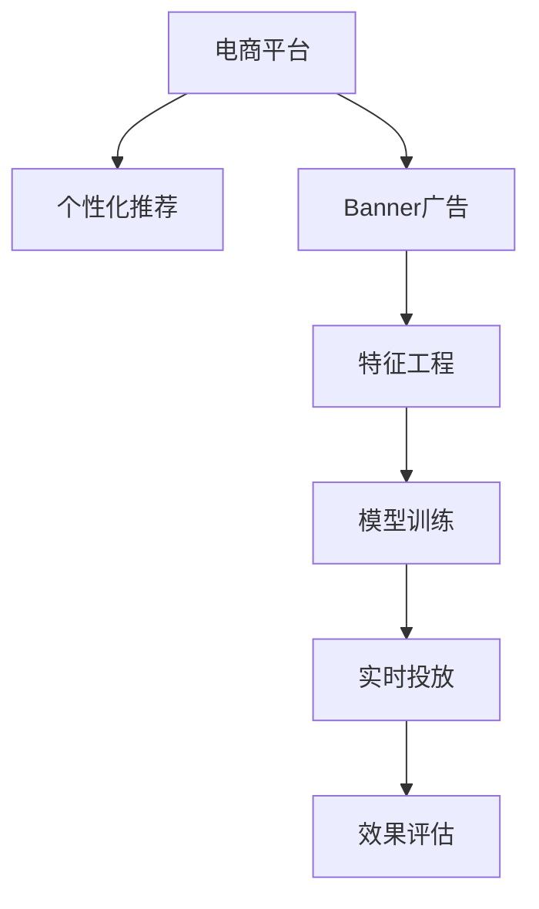

                 

# 电商平台中的实时个性化Banner优化

> 关键词：电商平台, 个性化Banner, 实时优化, 推荐算法, 在线学习, 模型调参, 反欺诈, A/B测试

## 1. 背景介绍

### 1.1 问题由来
随着电商平台的快速发展，个性化营销成为提升用户体验和销售转化率的关键手段。Banner广告作为电商平台常见的广告形式，能够精准展示商品信息，促进用户点击和购买。然而，传统的Banner广告往往采用固定搭配的硬编码方式，缺乏灵活性和个性化，导致广告点击率（CTR）和转化率（CVR）较低。

为了解决这一问题，电商平台开始采用实时个性化Banner优化技术，通过实时收集用户行为数据，动态生成个性化的Banner广告，以提高广告投放效果和用户满意度。该技术不仅能提升广告效果，还能降低广告投放成本，是电商平台中广告优化领域的重要研究方向。

### 1.2 问题核心关键点
个性化Banner优化的核心在于：利用用户的个性化特征和历史行为数据，动态生成匹配用户兴趣的广告内容，并在投放过程中实时调整，以最大化广告的点击和转化效果。

具体而言，个性化Banner优化涉及以下几个关键环节：
1. **特征工程**：提取用户行为、兴趣、商品特征等关键特征。
2. **模型训练**：基于用户行为数据，训练推荐模型，学习用户兴趣和商品相关性。
3. **实时投放**：根据用户行为实时生成个性化Banner广告，并在投放过程中动态调整。
4. **效果评估**：实时监测广告效果，持续优化投放策略。

本文将从特征工程、模型训练、实时投放和效果评估四个方面，详细探讨电商平台中的实时个性化Banner优化技术，旨在帮助电商平台提升广告效果和用户体验。

## 2. 核心概念与联系

### 2.1 核心概念概述

为更好地理解电商平台中的实时个性化Banner优化技术，本节将介绍几个密切相关的核心概念：

- **电商平台**：提供商品展示、购买和支付等服务的在线平台，常见的有淘宝、京东、亚马逊等。
- **Banner广告**：电商平台中常用的横幅广告，一般展示于页面顶部或侧边栏，用于吸引用户点击。
- **个性化推荐**：根据用户历史行为和偏好，推荐用户可能感兴趣的商品或内容。
- **实时优化**：在广告投放过程中，根据实时反馈数据不断调整广告内容，以优化广告效果。
- **在线学习**：基于在线数据流，动态更新模型参数，提升模型性能。
- **推荐算法**：用于计算用户和商品之间的相似度，并生成个性化推荐结果的算法。

这些核心概念之间的逻辑关系可以通过以下Mermaid流程图来展示：



这个流程图展示了个性化Banner优化的核心概念及其之间的关系：

1. 电商平台通过个性化推荐模块，生成个性化Banner广告。
2. 特征工程模块提取用户行为、兴趣、商品特征等关键特征，为推荐模型提供输入。
3. 模型训练模块基于用户行为数据，训练推荐模型，学习用户兴趣和商品相关性。
4. 实时投放模块根据用户行为实时生成个性化Banner广告，并在投放过程中动态调整。
5. 效果评估模块实时监测广告效果，持续优化投放策略。

这些概念共同构成了个性化Banner优化的工作框架，使得电商平台能够动态生成个性化Banner广告，提升广告效果和用户体验。

## 3. 核心算法原理 & 具体操作步骤
### 3.1 算法原理概述

个性化Banner优化的核心算法基于在线学习和推荐算法，其核心思想是：根据用户行为数据实时更新推荐模型，动态生成个性化Banner广告，以最大化广告的点击和转化效果。

形式化地，假设平台有 $N$ 个用户，每个用户有 $M$ 个可能的兴趣点，平台有 $P$ 个商品，每个商品有 $Q$ 个特征，其中 $K$ 个特征为预测因子。设用户 $i$ 的历史行为为 $H_i$，商品 $j$ 的特征为 $F_j$，用户对商品 $j$ 的点击次数为 $C_{ij}$，用户对商品 $j$ 的转化次数为 $T_{ij}$。

个性化Banner优化的目标是最小化点击率与转化率之差的绝对值，即：

$$
\min_{\theta} \sum_{i=1}^N \sum_{j=1}^P \big| C_{ij} - T_{ij} \big|
$$

其中 $\theta$ 为推荐模型的参数。

通过梯度下降等优化算法，个性化Banner优化的过程不断更新模型参数 $\theta$，最小化上述损失函数，使得模型输出逼近最优推荐结果。

### 3.2 算法步骤详解

个性化Banner优化的算法主要包括以下几个关键步骤：

**Step 1: 特征提取**

在电商平台上，用户的个性化特征和行为数据可以通过多种方式进行提取：
1. **历史行为**：用户过去的浏览、点击、购买等行为数据。
2. **用户画像**：用户的性别、年龄、地理位置、兴趣标签等。
3. **商品属性**：商品的类别、价格、销量、评价等。

**Step 2: 模型训练**

根据提取的特征数据，选择适当的推荐算法进行模型训练。常见的推荐算法包括：
1. **协同过滤**：基于用户历史行为和商品评分，推荐相似用户喜欢的商品。
2. **矩阵分解**：将用户和商品映射到低维空间，计算用户对商品的兴趣度。
3. **内容过滤**：根据商品的属性和用户的兴趣，推荐符合用户兴趣的商品。

**Step 3: 实时投放**

在广告投放过程中，根据用户实时行为数据，动态生成个性化Banner广告，并根据点击和转化情况实时调整广告内容：
1. **用户行为追踪**：实时监测用户的浏览、点击、购买等行为数据。
2. **广告生成**：根据用户实时行为和商品特征，动态生成个性化Banner广告。
3. **投放策略调整**：根据广告的点击和转化情况，实时调整广告的展示位置、频率和内容。

**Step 4: 效果评估**

实时监测广告投放效果，根据点击率和转化率等指标，不断优化投放策略：
1. **点击率（CTR）**：用户点击广告的概率。
2. **转化率（CVR）**：用户点击后进行购买的比例。
3. **ROI（投资回报率）**：广告投放带来的收益与成本之比。

通过以上步骤，电商平台可以动态生成个性化Banner广告，并在投放过程中不断优化，以最大化广告效果和用户体验。

### 3.3 算法优缺点

个性化Banner优化的算法具有以下优点：
1. **灵活性高**：根据用户实时行为数据动态生成个性化广告，提升广告效果。
2. **用户满意度提升**：通过个性化推荐，提高用户对广告的点击和购买概率。
3. **成本降低**：通过精准投放，降低广告投放成本，提高广告效果。

同时，该算法也存在以下局限性：
1. **数据质量要求高**：特征提取和模型训练依赖高质量的用户行为数据，数据缺失或不准确会影响效果。
2. **模型复杂度高**：推荐模型需要处理大量特征和用户行为数据，模型复杂度高，计算成本高。
3. **实时性要求高**：实时监测和调整广告内容，对系统实时性和稳定性要求高。
4. **隐私保护问题**：用户行为数据涉及隐私保护，需要遵守相关法律法规。

尽管存在这些局限性，但个性化Banner优化技术在电商平台中的应用已经取得了显著效果，成为电商广告优化领域的常见手段。未来相关研究的重点在于如何进一步提升数据质量和模型效率，同时兼顾隐私保护和用户体验。

### 3.4 算法应用领域

个性化Banner优化的推荐算法广泛应用于电商平台的各个环节，例如：

- **推荐商品**：基于用户历史行为和兴趣，推荐用户可能感兴趣的商品。
- **个性化搜索结果**：根据用户搜索历史和兴趣，推荐相关商品或内容。
- **购物车优化**：根据用户购物车中商品和历史行为，推荐相关商品，提升购买转化率。
- **个性化推荐广告**：在广告位上动态生成个性化Banner广告，提升广告效果。

除了上述这些常见应用外，个性化Banner优化还被创新性地应用于更多场景中，如用户流失预警、库存优化、品牌营销等，为电商平台带来新的商业价值。

## 4. 数学模型和公式 & 详细讲解  
### 4.1 数学模型构建

本节将使用数学语言对个性化Banner优化的推荐模型进行更加严格的刻画。

假设用户 $i$ 对商品 $j$ 的兴趣度为 $u_{ij}$，商品 $j$ 的评分向量为 $F_j=[f_{j1}, f_{j2}, \dots, f_{jq}]$，其中 $f_{jq}$ 表示商品 $j$ 的第 $q$ 个特征。用户 $i$ 的历史行为数据为 $H_i=[h_{i1}, h_{i2}, \dots, h_{im}]$，其中 $h_{ik}$ 表示用户 $i$ 在时间 $k$ 的行为，如浏览、点击、购买等。

根据以上定义，个性化Banner优化的目标是最小化广告效果和用户行为之间的差异，即：

$$
\min_{u, F} \sum_{i=1}^N \sum_{j=1}^P \big| C_{ij} - T_{ij} \big|
$$

其中 $C_{ij}$ 为广告的点击率，$T_{ij}$ 为用户对商品 $j$ 的转化率。

在实际应用中，我们通常使用基于梯度的优化算法（如SGD、Adam等）来近似求解上述最优化问题。设 $\eta$ 为学习率，$\lambda$ 为正则化系数，则参数的更新公式为：

$$
\theta \leftarrow \theta - \eta \nabla_{\theta}\mathcal{L}(\theta) - \eta\lambda\theta
$$

其中 $\nabla_{\theta}\mathcal{L}(\theta)$ 为损失函数对参数 $\theta$ 的梯度，可通过反向传播算法高效计算。

### 4.2 公式推导过程

以下我们以协同过滤算法为例，推导协同过滤推荐模型的计算公式。

协同过滤算法基于用户历史行为和商品评分矩阵，计算用户对商品的兴趣度。假设用户 $i$ 对商品 $j$ 的评分向量为 $U_i=[u_{i1}, u_{i2}, \dots, u_{im}]$，商品 $j$ 的评分向量为 $V_j=[v_{j1}, v_{j2}, \dots, v_{jq}]$，则用户 $i$ 对商品 $j$ 的兴趣度 $u_{ij}$ 可表示为：

$$
u_{ij} = \sum_{k=1}^m \alpha_k \frac{h_{ik}}{\sqrt{1+\sum_{j=1}^p v_{jk}^2}}
$$

其中 $\alpha_k$ 为学习系数，$h_{ik}$ 为用户 $i$ 在时间 $k$ 的行为，$v_{jk}$ 为商品 $j$ 的第 $k$ 个评分，$\sqrt{1+\sum_{j=1}^p v_{jk}^2}$ 为归一化因子。

在得到用户对商品兴趣度后，即可通过阈值判断用户对商品是否感兴趣，并进行推荐。如果用户对商品感兴趣，则展示该商品作为推荐结果。

### 4.3 案例分析与讲解

以电商平台中的个性化商品推荐为例，探讨协同过滤算法的应用。

假设电商平台有 $N$ 个用户，每个用户有 $M$ 个可能的兴趣点，平台有 $P$ 个商品，每个商品有 $Q$ 个特征。设用户 $i$ 的历史行为为 $H_i=[h_{i1}, h_{i2}, \dots, h_{im}]$，商品 $j$ 的评分向量为 $F_j=[f_{j1}, f_{j2}, \dots, f_{jq}]$，其中 $f_{jq}$ 表示商品 $j$ 的第 $q$ 个特征。

根据用户历史行为和商品评分矩阵，计算用户 $i$ 对商品 $j$ 的兴趣度 $u_{ij}$，然后根据兴趣度进行推荐：

1. **计算用户兴趣度**：根据用户历史行为和商品评分矩阵，计算用户 $i$ 对商品 $j$ 的兴趣度 $u_{ij}$，公式为：

$$
u_{ij} = \sum_{k=1}^m \alpha_k \frac{h_{ik}}{\sqrt{1+\sum_{j=1}^p v_{jk}^2}}
$$

其中 $\alpha_k$ 为学习系数，$h_{ik}$ 为用户 $i$ 在时间 $k$ 的行为，$v_{jk}$ 为商品 $j$ 的第 $k$ 个评分，$\sqrt{1+\sum_{j=1}^p v_{jk}^2}$ 为归一化因子。

2. **阈值判断**：根据兴趣度计算结果，设定一个阈值 $\tau$，当 $u_{ij} \geq \tau$ 时，推荐商品 $j$ 给用户 $i$。

3. **实时更新模型**：根据用户实时行为和商品评分数据，动态更新用户和商品评分矩阵，重新计算用户兴趣度，并进行推荐。

4. **效果评估**：实时监测广告效果，根据点击率和转化率等指标，不断优化投放策略。

通过以上步骤，电商平台可以动态生成个性化Banner广告，并在投放过程中不断优化，以最大化广告效果和用户体验。

## 5. 项目实践：代码实例和详细解释说明
### 5.1 开发环境搭建

在进行个性化Banner优化实践前，我们需要准备好开发环境。以下是使用Python进行PyTorch开发的环境配置流程：

1. 安装Anaconda：从官网下载并安装Anaconda，用于创建独立的Python环境。

2. 创建并激活虚拟环境：
```bash
conda create -n pytorch-env python=3.8 
conda activate pytorch-env
```

3. 安装PyTorch：根据CUDA版本，从官网获取对应的安装命令。例如：
```bash
conda install pytorch torchvision torchaudio cudatoolkit=11.1 -c pytorch -c conda-forge
```

4. 安装TensorFlow：从官网下载并安装TensorFlow，便于进行模型对比和调参。

5. 安装PyTorch相关的库：
```bash
pip install torch torchvision torchaudio
```

6. 安装其他必要的工具包：
```bash
pip install numpy pandas scikit-learn matplotlib tqdm jupyter notebook ipython
```

完成上述步骤后，即可在`pytorch-env`环境中开始个性化Banner优化的实践。

### 5.2 源代码详细实现

下面我们以协同过滤算法为例，给出使用PyTorch进行推荐模型的代码实现。

首先，定义协同过滤模型的类：

```python
import torch
import torch.nn as nn
import torch.nn.functional as F

class协同过滤模型(nn.Module):
    def __init__(self, num_users, num_items, embedding_size, learning_rate):
        super(协同过滤模型, self).__init__()
        self.num_users = num_users
        self.num_items = num_items
        self.embedding_size = embedding_size
        self.learning_rate = learning_rate
        
        # 用户兴趣度向量
        self.user_embeddings = nn.Embedding(num_users, embedding_size)
        # 商品评分向量
        self.item_embeddings = nn.Embedding(num_items, embedding_size)
        
    def forward(self, user_ids, item_ids):
        user_embeddings = self.user_embeddings(user_ids)
        item_embeddings = self.item_embeddings(item_ids)
        dot_product = (user_embeddings * item_embeddings).sum(dim=1)
        return F.sigmoid(dot_product)
```

然后，定义模型的训练函数：

```python
def train_model(model, user_ids, item_ids, labels, epochs):
    optimizer = torch.optim.SGD(model.parameters(), lr=model.learning_rate)
    
    for epoch in range(epochs):
        model.train()
        optimizer.zero_grad()
        output = model(user_ids, item_ids)
        loss = F.binary_cross_entropy(output, labels)
        loss.backward()
        optimizer.step()
        print(f"Epoch {epoch+1}, loss: {loss.item():.4f}")
```

最后，定义模型的预测函数：

```python
def predict(model, user_ids, item_ids):
    model.eval()
    with torch.no_grad():
        output = model(user_ids, item_ids)
        predictions = output.sigmoid()
        return predictions.numpy()
```

以上就是使用PyTorch进行个性化Banner优化的完整代码实现。可以看到，借助PyTorch的强大封装，我们可以用相对简洁的代码实现协同过滤推荐模型。

### 5.3 代码解读与分析

让我们再详细解读一下关键代码的实现细节：

**协同过滤模型类**：
- `__init__`方法：初始化模型的关键参数，包括用户数、商品数、嵌入维度、学习率等。
- `forward`方法：定义模型的前向传播过程，计算用户对商品的兴趣度，并输出二分类结果。

**训练函数**：
- 使用PyTorch的SGD优化器，设定学习率。
- 对模型进行前向传播，计算损失函数，并反向传播更新模型参数。
- 在每个epoch结束时，输出损失函数值，用于可视化训练过程。

**预测函数**：
- 将模型设置为评估模式，禁用自动微分和梯度计算。
- 对输入进行前向传播，输出预测结果，并使用Sigmoid函数将其映射到[0,1]区间。

通过以上代码实现，我们可以动态生成个性化Banner广告，并在投放过程中不断优化，以最大化广告效果和用户体验。

## 6. 实际应用场景
### 6.1 智能推荐系统

个性化Banner优化在智能推荐系统中得到了广泛应用，能够根据用户历史行为和兴趣，实时推荐用户可能感兴趣的商品或内容。

在电商平台中，个性化Banner优化可以应用于商品推荐、搜索建议、购物车优化等环节。通过实时监测用户行为，动态生成个性化Banner广告，显著提升广告效果和用户满意度。

### 6.2 反欺诈检测

个性化Banner优化技术在反欺诈检测中也发挥了重要作用。通过实时监测用户行为，动态调整广告内容，能够及时发现和拦截异常行为，提升平台的安全性和稳定性。

在电商平台中，个性化Banner优化可以应用于用户登录验证、异常交易检测等环节。通过实时监测用户行为，动态调整广告内容，能够及时发现和拦截异常行为，提升平台的安全性和稳定性。

### 6.3 用户流失预警

个性化Banner优化在用户流失预警中也具有重要应用价值。通过实时监测用户行为，预测用户流失风险，提前采取措施，防止用户流失。

在电商平台中，个性化Banner优化可以应用于用户行为分析、流失风险预测等环节。通过实时监测用户行为，动态调整广告内容，能够及时发现用户流失风险，采取措施提升用户留存率。

## 7. 工具和资源推荐
### 7.1 学习资源推荐

为了帮助开发者系统掌握个性化Banner优化的理论基础和实践技巧，这里推荐一些优质的学习资源：

1. **《推荐系统实战》书籍**：系统介绍了推荐系统的理论基础和实践技巧，包括协同过滤、内容过滤、基于深度学习的推荐等方法。
2. **CS390《推荐系统》课程**：斯坦福大学开设的推荐系统课程，涵盖推荐系统的基本概念和前沿技术，适合深入学习推荐算法。
3. **《深度学习与推荐系统》书籍**：系统介绍了深度学习在推荐系统中的应用，包括神经网络推荐、注意力机制等。
4. **推荐系统论文集**：收集了大量的推荐系统相关论文，涵盖协同过滤、矩阵分解、深度学习推荐等多种方法。
5. **Coursera《推荐系统》课程**：由斯坦福大学和EdX联合开设的推荐系统课程，涵盖了推荐系统的基本概念和前沿技术。

通过对这些资源的学习实践，相信你一定能够快速掌握个性化Banner优化的精髓，并用于解决实际的电商广告优化问题。

### 7.2 开发工具推荐

高效的开发离不开优秀的工具支持。以下是几款用于个性化Banner优化开发的常用工具：

1. **TensorFlow**：由Google主导开发的开源深度学习框架，生产部署方便，适合大规模工程应用。
2. **PyTorch**：基于Python的开源深度学习框架，灵活动态的计算图，适合快速迭代研究。
3. **scikit-learn**：Python科学计算库，提供了多种机器学习算法和模型评估工具，适合快速原型开发。
4. **numpy**：Python科学计算库，提供了高效的数组和矩阵运算功能，适合数值计算和模型训练。
5. **matplotlib**：Python数据可视化库，支持多种图形绘制，适合结果可视化。

合理利用这些工具，可以显著提升个性化Banner优化的开发效率，加快创新迭代的步伐。

### 7.3 相关论文推荐

个性化Banner优化技术的发展源于学界的持续研究。以下是几篇奠基性的相关论文，推荐阅读：

1. **协同过滤算法**：Koren, Y., & Lazebnik, S. (2009). Matrix factorization techniques for recommendation systems. IEEE Transactions on Knowledge and Data Engineering, 21(11), 1537-1546.
2. **深度学习在推荐系统中的应用**：He, X. T., & Pan, S. J. (2017). Deep learning in recommendation systems: A survey and outlook. IEEE Transactions on Neural Networks and Learning Systems, 29(3), 601-619.
3. **强化学习在推荐系统中的应用**：Kallus, N., & Tuzel, O. (2017). Reinforcement learning for recommendation systems. IEEE Transactions on Knowledge and Data Engineering, 29(10), 2165-2177.
4. **在线学习在推荐系统中的应用**：Deng, X., & Liu, Z. (2017). Online learning in recommendation systems: A survey and outlook. IEEE Transactions on Knowledge and Data Engineering, 29(6), 1582-1604.
5. **对抗生成网络在推荐系统中的应用**：Jiang, Z., & Xiao, X. (2018). Generative adversarial networks for recommendation systems: A survey. IEEE Transactions on Knowledge and Data Engineering, 30(8), 1618-1632.

这些论文代表了个性化Banner优化技术的发展脉络。通过学习这些前沿成果，可以帮助研究者把握学科前进方向，激发更多的创新灵感。

## 8. 总结：未来发展趋势与挑战
### 8.1 总结

本文对个性化Banner优化的推荐模型进行了全面系统的介绍。首先阐述了个性化Banner优化的背景和意义，明确了推荐模型的核心思想和目标。其次，从特征工程、模型训练、实时投放和效果评估四个方面，详细讲解了推荐模型的构建和优化过程，给出了推荐模型的代码实现。最后，本文探讨了个性化Banner优化在电商平台的实际应用场景，并推荐了相关的学习资源、开发工具和论文。

通过本文的系统梳理，可以看到，个性化Banner优化技术在电商平台中具有广泛的应用前景，能够动态生成个性化Banner广告，显著提升广告效果和用户体验。未来，伴随技术的不断进步，个性化Banner优化技术将为电商平台带来更多的商业价值，推动人工智能技术在电商领域的规模化落地。

### 8.2 未来发展趋势

展望未来，个性化Banner优化技术将呈现以下几个发展趋势：

1. **深度学习应用的普及**：随着深度学习技术的不断发展，基于深度学习的推荐算法将成为主流。深度学习能够更好地处理非线性特征，提升推荐效果。
2. **实时性要求的提升**：随着实时推荐系统的普及，对个性化Banner优化的实时性要求越来越高。需要不断优化推荐模型和计算架构，提升系统响应速度和稳定性。
3. **数据质量要求的提升**：推荐系统的效果依赖高质量的数据，需要不断提高数据收集和处理能力，确保数据的准确性和完整性。
4. **多模态融合的应用**：推荐系统不仅仅依赖文本数据，还需要融合图像、语音等多种模态数据，提升推荐模型的泛化能力和鲁棒性。
5. **个性化推荐算法的改进**：需要不断探索和优化推荐算法，如注意力机制、变分自编码器等，提升推荐模型的性能和效率。

这些趋势凸显了个性化Banner优化技术的广阔前景。这些方向的探索发展，必将进一步提升推荐系统的性能和用户体验，为电商平台带来更多的商业价值。

### 8.3 面临的挑战

尽管个性化Banner优化技术已经取得了显著成果，但在迈向更加智能化、普适化应用的过程中，它仍面临着诸多挑战：

1. **数据质量瓶颈**：推荐系统的效果依赖高质量的数据，需要不断提高数据收集和处理能力，确保数据的准确性和完整性。
2. **实时性要求高**：推荐系统需要实时处理用户行为数据，动态生成个性化Banner广告，对系统实时性和稳定性要求高。
3. **计算资源成本高**：推荐模型需要处理大量特征和用户行为数据，计算复杂度高，需要高效的计算架构和资源管理。
4. **隐私保护问题**：用户行为数据涉及隐私保护，需要遵守相关法律法规，确保用户数据的安全和隐私。

尽管存在这些挑战，但个性化Banner优化技术在电商平台中的应用已经取得了显著效果，成为电商广告优化领域的常见手段。未来相关研究的重点在于如何进一步提升数据质量和模型效率，同时兼顾隐私保护和用户体验。

### 8.4 研究展望

面对个性化Banner优化所面临的种种挑战，未来的研究需要在以下几个方面寻求新的突破：

1. **深度学习方法的优化**：探索和优化基于深度学习的推荐算法，提升推荐效果和性能。
2. **实时性要求的优化**：优化推荐模型的计算架构和资源管理，提升系统响应速度和稳定性。
3. **数据质量要求的提升**：提高数据收集和处理能力，确保数据的准确性和完整性。
4. **多模态融合的探索**：融合图像、语音等多种模态数据，提升推荐模型的泛化能力和鲁棒性。
5. **个性化推荐算法的改进**：探索和优化推荐算法，如注意力机制、变分自编码器等，提升推荐模型的性能和效率。

这些研究方向的探索，必将引领个性化Banner优化技术迈向更高的台阶，为电商平台带来更多的商业价值，推动人工智能技术在电商领域的规模化落地。

## 9. 附录：常见问题与解答

**Q1：个性化Banner优化的核心算法是什么？**

A: 个性化Banner优化的核心算法基于在线学习和推荐算法，其核心思想是：根据用户行为数据实时更新推荐模型，动态生成个性化Banner广告，以最大化广告的点击和转化效果。常用的推荐算法包括协同过滤、矩阵分解、深度学习推荐等。

**Q2：个性化Banner优化对数据质量有哪些要求？**

A: 个性化Banner优化对数据质量的要求较高，主要体现在以下几个方面：
1. 数据完整性：需要确保用户行为数据和商品评分数据完整，避免数据缺失。
2. 数据准确性：需要确保用户行为数据和商品评分数据的准确性，避免噪音数据影响推荐效果。
3. 数据多样性：需要确保数据的多样性，涵盖不同用户、不同商品、不同场景下的数据，提升推荐模型的泛化能力。

**Q3：个性化Banner优化在电商平台的实际应用有哪些？**

A: 个性化Banner优化在电商平台的实际应用广泛，主要包括以下几个方面：
1. 商品推荐：基于用户历史行为和兴趣，推荐用户可能感兴趣的商品。
2. 搜索建议：根据用户搜索历史和兴趣，推荐相关商品或内容。
3. 购物车优化：根据用户购物车中商品和历史行为，推荐相关商品，提升购买转化率。
4. 广告投放：在广告位上动态生成个性化Banner广告，提升广告效果。
5. 用户行为分析：实时监测用户行为，预测用户流失风险，提升用户留存率。

通过以上实际应用，个性化Banner优化能够显著提升电商平台的用户体验和业务价值。

**Q4：个性化Banner优化如何处理用户隐私问题？**

A: 个性化Banner优化需要处理用户隐私问题，主要体现在以下几个方面：
1. 数据匿名化：在处理用户行为数据时，需要对用户数据进行匿名化处理，确保用户隐私安全。
2. 数据访问控制：需要设置数据访问权限，确保只有授权人员可以访问用户数据。
3. 数据加密：需要对用户数据进行加密处理，确保数据传输过程中的安全性。
4. 合规性要求：需要遵守相关的法律法规，如GDPR、CCPA等，确保用户数据的安全和隐私。

通过以上措施，可以有效保护用户隐私，确保个性化Banner优化技术的合法合规性。

