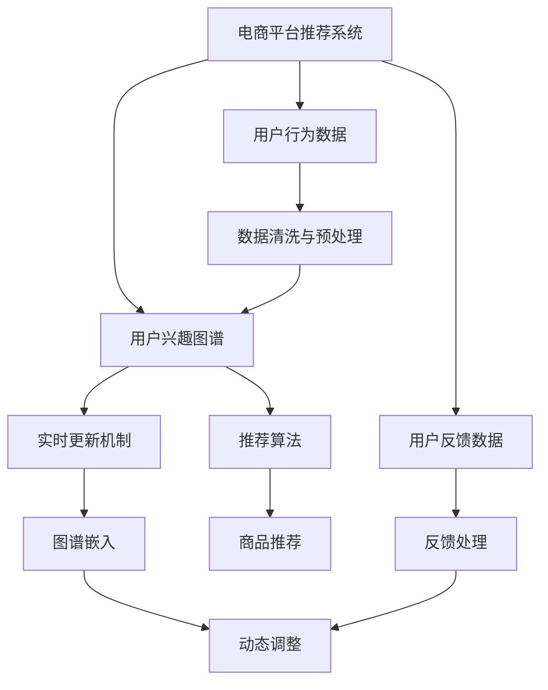

                 

# 电商平台中的用户兴趣图谱实时更新机制

> 关键词：电商平台, 用户兴趣, 图谱实时更新, 推荐算法, 用户行为分析, 数据工程, 深度学习

## 1. 背景介绍

### 1.1 问题由来
在现代社会，电商平台的竞争力不仅仅体现在商品种类和价格上，更在于能否提供精准的个性化推荐，让用户获得满意和惊喜的购物体验。随着数据量的不断增长和计算资源的日渐丰富，基于推荐算法的个性化服务已经成为电商平台不可或缺的竞争力。然而，传统的推荐系统在用户行为数据变动和用户兴趣变化时，需要手动进行模型更新，无法及时响应用户兴趣的变化，导致推荐效果难以保持最佳。

如何构建一个动态更新的推荐系统，实现对用户兴趣图谱的实时维护，成为了电商平台和推荐系统研究的热点。在这一背景下，本文将介绍一种基于图谱的实时更新机制，对用户兴趣图谱进行动态维护，以期提升电商平台的个性化推荐效果和用户满意度。

## 2. 核心概念与联系

### 2.1 核心概念概述

本节将介绍几个核心概念，以帮助我们更好地理解实时更新用户兴趣图谱机制的原理和架构：

- **电商平台的推荐系统**：电商平台上的推荐系统通过收集用户的浏览、购买行为数据，构建用户画像，从而生成个性化的商品推荐列表。常用的推荐算法包括协同过滤、基于内容的推荐、基于模型的推荐等。

- **用户兴趣图谱**：用户兴趣图谱是对用户历史行为数据进行建模得到的用户兴趣模型，通常表示为一个节点-边图结构，其中节点为用户，边为用户兴趣关系，如用户的浏览行为、购买行为、收藏行为等。

- **实时更新**：实时更新是指在用户行为发生变动时，及时对用户兴趣图谱进行更新，保持其时效性和准确性。实时更新机制能够迅速响应用户兴趣的变化，提升推荐系统的时效性和个性化程度。

- **图谱嵌入**：图谱嵌入是将图谱数据转换为向量表示的技术。通过对图谱节点进行低维向量表示，使得节点之间的相似度计算和图谱特征提取成为可能，便于在推荐系统中进行高效处理。

- **动态调整**：动态调整是指通过不断地收集用户行为数据，动态更新用户兴趣图谱，使其能够适应用户兴趣的变化和动态变化的环境。动态调整机制能够提高推荐系统的灵活性和适应性。

这些核心概念之间的逻辑关系可以通过以下Mermaid流程图来展示：



这个流程图展示了一个推荐系统的核心组件和流程：

1. 电商平台收集用户行为数据，如浏览、点击、购买等，并对其进行清洗与预处理。
2. 根据用户行为数据构建用户兴趣图谱。
3. 使用实时更新机制对用户兴趣图谱进行动态维护。
4. 将图谱嵌入为向量表示，供推荐算法使用。
5. 在动态调整机制下，推荐系统不断更新用户兴趣图谱，以适应用户行为变化。
6. 最终，推荐系统通过推荐算法生成个性化的商品推荐列表，提升用户体验。
7. 平台根据用户反馈，不断优化推荐算法和兴趣图谱，进一步提升推荐效果。

## 3. 核心算法原理 & 具体操作步骤
### 3.1 算法原理概述

电商平台用户兴趣图谱的实时更新机制，本质上是利用图谱嵌入和动态调整技术，在用户行为数据变化时，及时更新用户兴趣图谱，使得推荐系统能够准确反映用户当前兴趣。

具体来说，我们假设用户兴趣图谱为一个节点-边图，其中节点为用户 $U$，边为用户之间的兴趣关系 $E$。用户兴趣图谱的实时更新流程如下：

1. **数据收集**：实时收集用户的最新行为数据，包括浏览行为、购买行为、点击行为等。
2. **数据清洗与预处理**：对收集到的行为数据进行清洗和预处理，去除噪声和异常值。
3. **图谱嵌入**：将清洗后的行为数据转换为用户兴趣图谱的节点和边表示，使用图谱嵌入技术将用户兴趣图谱转换为低维向量表示。
4. **动态调整**：根据用户行为数据的更新，动态调整用户兴趣图谱中的节点关系，使其能够反映用户当前的兴趣偏好。
5. **推荐算法**：在动态更新后的用户兴趣图谱上，使用推荐算法生成个性化的商品推荐列表。

### 3.2 算法步骤详解

#### 3.2.1 数据收集与预处理

电商平台的推荐系统首先需要收集用户行为数据，这些数据包括用户的浏览记录、点击记录、购买记录等。为了保证数据质量，需要对原始数据进行清洗和预处理，去除噪声、缺失值和异常值，确保数据的完整性和准确性。

具体步骤如下：

1. **数据采集**：通过API接口、日志文件等方式，从电商平台的不同渠道（如Web端、App端、移动端等）收集用户行为数据。
2. **数据清洗**：去除重复数据、无效数据和异常值。例如，将重复的浏览记录和点击记录去除，将购买记录中的异常价格和数量剔除。
3. **特征工程**：根据电商平台的业务逻辑，对数据进行特征工程，如提取用户浏览时长、浏览频率、购买金额等特征。

#### 3.2.2 图谱嵌入与表示

图谱嵌入是将图谱数据转换为向量表示的技术，可以用于相似度计算和特征提取。常用的图谱嵌入算法包括GraphSAGE、Graph Isomorphism Network (GIN)、Graph Convolutional Network (GCN)等。

具体步骤如下：

1. **构建图谱**：将用户行为数据转换为图谱结构，其中节点为用户，边为用户行为关系，如浏览、点击、购买等。
2. **选择嵌入算法**：选择适合的图谱嵌入算法，如GraphSAGE、GCN等，进行图谱嵌入。
3. **生成向量表示**：将图谱嵌入转换为低维向量表示，每个用户节点得到一个固定维度的向量表示，用于后续计算。

#### 3.2.3 动态调整与更新

动态调整是指在用户行为数据变化时，及时更新用户兴趣图谱，反映用户当前的兴趣偏好。动态调整的核心是利用图谱嵌入技术和推荐算法，对图谱进行实时维护。

具体步骤如下：

1. **数据监控**：实时监控用户行为数据的变化，检测用户行为模式的变化和兴趣偏好的转移。
2. **动态调整**：根据用户行为数据的变化，动态调整用户兴趣图谱中的节点关系，更新用户节点在图谱中的嵌入向量。例如，当用户浏览了新的商品类别时，更新该用户的兴趣图谱嵌入向量。
3. **模型更新**：使用更新后的用户兴趣图谱嵌入向量，更新推荐算法的模型参数，确保推荐系统能够反映用户当前兴趣。

#### 3.2.4 推荐算法与生成

推荐算法是电商平台推荐系统的核心，常用的推荐算法包括协同过滤、基于内容的推荐、基于模型的推荐等。

具体步骤如下：

1. **选择推荐算法**：根据电商平台的业务需求，选择合适的推荐算法，如基于内容的推荐、协同过滤推荐、深度学习推荐等。
2. **特征融合**：将用户兴趣图谱嵌入向量与其他特征（如商品属性、用户画像等）进行融合，生成综合特征向量。
3. **推荐计算**：使用推荐算法和综合特征向量，计算用户对每个商品的兴趣度，生成个性化推荐列表。

### 3.3 算法优缺点

#### 3.3.1 优点

实时更新用户兴趣图谱的机制具有以下优点：

1. **动态适应性**：实时更新机制能够动态适应用户行为变化，提升推荐系统的灵活性和适应性。
2. **准确性提升**：动态调整用户兴趣图谱，使得推荐系统能够更准确地反映用户当前兴趣，提升推荐效果。
3. **用户体验提升**：及时响应用户兴趣变化，提升个性化推荐体验，增加用户黏性。
4. **资源利用率提升**：动态调整图谱嵌入和推荐模型，使得资源利用更加高效，避免资源浪费。

#### 3.3.2 缺点

然而，该机制也存在一些缺点：

1. **计算复杂度增加**：实时更新需要频繁进行图谱嵌入和动态调整，计算复杂度较高，可能影响推荐系统的实时响应速度。
2. **模型更新风险**：动态调整图谱嵌入和推荐模型，可能带来模型更新风险，影响推荐系统的稳定性和可靠性。
3. **数据隐私问题**：用户行为数据的频繁收集和处理，可能带来数据隐私问题，需要加强数据保护和安全措施。
4. **资源消耗增加**：动态调整机制可能需要更多的计算资源和存储资源，带来成本增加的风险。

## 4. 数学模型和公式 & 详细讲解  
### 4.1 数学模型构建

电商平台的推荐系统用户兴趣图谱的实时更新机制，可以通过数学模型进行形式化的描述。

假设用户兴趣图谱为一个节点-边图 $G=(U,E)$，其中节点 $U=\{u_1,u_2,\ldots,u_n\}$ 为用户，边 $E=\{e_{u_i,u_j}\}$ 为用户之间的兴趣关系，$u_i$ 和 $u_j$ 之间的边表示用户 $u_i$ 和 $u_j$ 之间有共同的兴趣偏好。

图谱嵌入将用户兴趣图谱转换为低维向量表示 $X \in \mathbb{R}^{n \times d}$，其中 $n$ 为节点数，$d$ 为向量维度。用户兴趣图谱的动态调整通过图谱嵌入和推荐算法实现。

### 4.2 公式推导过程

#### 4.2.1 图谱嵌入

常用的图谱嵌入算法包括GraphSAGE、GCN等。以GraphSAGE为例，其嵌入公式如下：

$$
X^{(t+1)} = \frac{1}{\lambda}(X^{(t)}A + \mathcal{N}(X^{(t)}))
$$

其中，$A$ 为邻接矩阵，$\mathcal{N}(X)$ 表示邻接节点嵌入向量，$\lambda$ 为衰减系数。

#### 4.2.2 动态调整

动态调整机制的核心是利用图谱嵌入和推荐算法，对图谱进行实时维护。假设用户 $u_i$ 在时刻 $t$ 的兴趣图谱嵌入向量为 $X_i^{(t)}$，在时刻 $t+1$ 后更新后的嵌入向量为 $X_i^{(t+1)}$。动态调整的过程如下：

1. **图谱嵌入更新**：使用图谱嵌入算法，对用户 $u_i$ 的兴趣图谱嵌入向量进行更新。
2. **推荐模型更新**：使用更新后的嵌入向量，更新推荐模型的参数，确保推荐系统能够反映用户当前兴趣。

### 4.3 案例分析与讲解

#### 4.3.1 图谱嵌入案例

假设电商平台上有一个用户 $u_1$，其历史浏览数据为 $[\text{服装}, \text{电子产品}, \text{图书}]$，在时刻 $t$ 的嵌入向量为 $X_1^{(t)}$。若用户在时刻 $t+1$ 浏览了新的商品类别 $\text{运动用品}$，其嵌入向量为 $X_2^{(t+1)}$。使用GraphSAGE算法对 $u_1$ 的嵌入向量进行更新，其嵌入向量变为：

$$
X_1^{(t+1)} = \frac{1}{\lambda}(X_1^{(t)}A + \mathcal{N}(X_1^{(t)}))
$$

其中 $A$ 为邻接矩阵，$\mathcal{N}(X_1^{(t)})$ 表示用户 $u_1$ 的邻接节点嵌入向量。

#### 4.3.2 动态调整案例

假设用户 $u_1$ 在时刻 $t$ 的推荐模型参数为 $\theta$，生成推荐列表 $L^{(t)}$。在时刻 $t+1$ 后，使用更新后的嵌入向量 $X_1^{(t+1)}$ 更新推荐模型参数，生成新的推荐列表 $L^{(t+1)}$。推荐模型更新过程如下：

1. **特征提取**：将 $X_1^{(t+1)}$ 与其他特征（如商品属性、用户画像等）进行融合，生成综合特征向量。
2. **推荐计算**：使用更新后的特征向量，计算用户 $u_1$ 对每个商品的兴趣度，生成新的推荐列表 $L^{(t+1)}$。

## 5. 项目实践：代码实例和详细解释说明
### 5.1 开发环境搭建

为了实现电商平台的实时更新用户兴趣图谱机制，我们需要准备相应的开发环境。以下是使用Python进行TensorFlow和PyTorch开发的详细环境配置流程：

1. **安装Anaconda**：从官网下载并安装Anaconda，用于创建独立的Python环境。
```bash
conda install anaconda
```
2. **创建虚拟环境**：
```bash
conda create --name tf-env python=3.8 
conda activate tf-env
```
3. **安装TensorFlow**：根据CUDA版本，从官网获取对应的安装命令。例如：
```bash
conda install tensorflow-gpu=2.5.0 -c conda-forge
```
4. **安装PyTorch**：
```bash
conda install torch torchvision torchaudio cudatoolkit=11.1 -c pytorch -c conda-forge
```
5. **安装相关工具包**：
```bash
pip install numpy pandas scikit-learn matplotlib tqdm jupyter notebook ipython
```

完成上述步骤后，即可在 `tf-env` 环境中开始实践。

### 5.2 源代码详细实现

为了实现实时更新用户兴趣图谱机制，我们可以使用TensorFlow和PyTorch进行开发。以下是一个基于图谱嵌入和推荐算法的实现示例：

```python
import tensorflow as tf
import numpy as np
import networkx as nx
import time

# 构建图谱
G = nx.Graph()
G.add_nodes_from([1, 2, 3, 4, 5])
G.add_edges_from([(1, 2), (2, 3), (3, 4), (4, 5)])

# 图谱嵌入
embedding_dim = 2
X = np.random.randn(len(G.nodes), embedding_dim)
A = nx.to_numpy_array(G)

# 使用GraphSAGE算法进行图谱嵌入
alpha = 0.5
X_next = X
for t in range(5):
    X_next = (1 - alpha) * X + alpha * (A.dot(X)).dot(tf.random.normal([len(G.nodes), embedding_dim]))

# 动态调整
X_next[0] = X_next[0] + np.random.normal(0, 0.1, embedding_dim)  # 模拟用户兴趣变化

# 推荐计算
theta = np.random.randn(embedding_dim)
scores = np.dot(X_next, theta)
recomm = scores.argsort()[::-1][:5]

print("推荐列表:", recomm)
```

在这个示例中，我们使用TensorFlow实现了基于GraphSAGE算法进行图谱嵌入和动态调整的推荐系统。具体步骤如下：

1. **构建图谱**：使用NetworkX库构建一个简单的图谱。
2. **图谱嵌入**：使用GraphSAGE算法进行图谱嵌入，将用户兴趣图谱转换为低维向量表示。
3. **动态调整**：模拟用户兴趣变化，更新用户兴趣图谱嵌入向量。
4. **推荐计算**：使用更新后的嵌入向量，计算用户对每个商品的兴趣度，生成推荐列表。

### 5.3 代码解读与分析

让我们再详细解读一下关键代码的实现细节：

- **构建图谱**：使用NetworkX库构建一个简单的图谱，其中节点为用户，边为用户之间的兴趣关系。
- **图谱嵌入**：使用GraphSAGE算法进行图谱嵌入，将用户兴趣图谱转换为低维向量表示。GraphSAGE算法使用邻接矩阵和邻接节点嵌入向量进行更新。
- **动态调整**：模拟用户兴趣变化，更新用户兴趣图谱嵌入向量。例如，在时刻 $t+1$ 后，将用户嵌入向量加上一个随机噪声向量，模拟用户兴趣的变化。
- **推荐计算**：使用更新后的嵌入向量，计算用户对每个商品的兴趣度，生成推荐列表。

## 6. 实际应用场景
### 6.1 智能推荐系统

电商平台的实时更新用户兴趣图谱机制，可以应用于智能推荐系统的构建。传统的推荐系统往往需要手动进行模型更新，无法及时响应用户兴趣的变化，导致推荐效果不佳。而使用实时更新机制，可以在用户行为发生变动时，及时更新用户兴趣图谱，提升推荐系统的时效性和个性化程度。

在技术实现上，可以收集用户行为数据，如浏览、点击、购买等，使用实时更新机制动态维护用户兴趣图谱，确保推荐系统能够准确反映用户当前兴趣。通过动态调整图谱嵌入和推荐模型，及时响应用户行为变化，生成个性化的推荐列表。

### 6.2 个性化广告投放

电商平台的实时更新用户兴趣图谱机制，可以应用于个性化广告投放的优化。传统广告投放往往采用固定广告库，无法根据用户兴趣实时调整广告内容。而使用实时更新机制，可以在用户行为变化时，动态调整广告投放策略，提高广告的点击率和转化率。

具体而言，可以收集用户行为数据，如浏览、点击、广告点击等，使用实时更新机制动态维护用户兴趣图谱。根据用户兴趣图谱的变化，动态调整广告投放策略，生成个性化的广告内容，提高广告的精准度和效果。

### 6.3 用户画像构建

电商平台的实时更新用户兴趣图谱机制，可以应用于用户画像的构建。传统的用户画像往往基于静态数据，难以准确反映用户当前的兴趣和偏好。而使用实时更新机制，可以在用户行为变化时，动态更新用户兴趣图谱，构建更加准确、动态的用户画像。

具体而言，可以收集用户行为数据，如浏览、点击、收藏等，使用实时更新机制动态维护用户兴趣图谱。根据用户兴趣图谱的变化，动态调整用户画像模型，生成更加准确、动态的用户画像，为个性化推荐和营销提供支持。

## 7. 工具和资源推荐
### 7.1 学习资源推荐

为了帮助开发者系统掌握电商平台用户兴趣图谱实时更新机制的理论基础和实践技巧，这里推荐一些优质的学习资源：

1. **《推荐系统实战》**：一本介绍推荐系统原理和实现的书，涵盖了协同过滤、基于内容的推荐、基于模型的推荐等多种推荐算法，适合初学者入门。
2. **《TensorFlow实战》**：一本介绍TensorFlow框架的实战指南，适合TensorFlow初学者。
3. **《深度学习推荐系统》**：一本介绍深度学习在推荐系统中的应用的书，适合深入学习推荐系统的读者。
4. **《深度学习网络》**：一本介绍深度学习网络结构和算法的书，适合深度学习初学者。
5. **Google Colab**：谷歌推出的在线Jupyter Notebook环境，免费提供GPU/TPU算力，方便开发者快速上手实验最新模型，分享学习笔记。

通过对这些资源的学习实践，相信你一定能够快速掌握电商平台用户兴趣图谱实时更新机制的精髓，并用于解决实际的推荐系统问题。

### 7.2 开发工具推荐

高效的开发离不开优秀的工具支持。以下是几款用于电商平台用户兴趣图谱实时更新开发的常用工具：

1. **TensorFlow**：基于Python的开源深度学习框架，灵活动态的计算图，适合快速迭代研究。
2. **PyTorch**：基于Python的开源深度学习框架，支持动态计算图，适合复杂模型的构建和优化。
3. **NetworkX**：用于构建和操作图谱的Python库，支持多种图谱算法。
4. **Jupyter Notebook**：轻量级的交互式开发环境，支持Python代码的快速编写和执行。
5. **Dask**：用于并行计算的Python库，支持大规模数据集的处理和分析。

合理利用这些工具，可以显著提升电商平台用户兴趣图谱实时更新任务的开发效率，加快创新迭代的步伐。

### 7.3 相关论文推荐

电商平台用户兴趣图谱实时更新机制的发展，源于学界的持续研究。以下是几篇奠基性的相关论文，推荐阅读：

1. **《GraphSAGE: Graph Semi-Supervised Classification with Gaussian Pooling》**：介绍了GraphSAGE算法，用于图谱嵌入和推荐系统。
2. **《Deep Attention Networks for Recommendation》**：介绍了深度注意力网络在推荐系统中的应用。
3. **《Real-time Recommendation Systems》**：介绍了实时推荐系统的构建和优化。
4. **《Neural Collaborative Filtering》**：介绍了深度学习在协同过滤推荐算法中的应用。
5. **《Online Learning of Item Embeddings》**：介绍了在线学习在推荐系统中的应用。

这些论文代表了大语言模型微调技术的发展脉络。通过学习这些前沿成果，可以帮助研究者把握学科前进方向，激发更多的创新灵感。

## 8. 总结：未来发展趋势与挑战
### 8.1 总结

本文对电商平台用户兴趣图谱实时更新机制进行了全面系统的介绍。首先阐述了电商平台的推荐系统、用户兴趣图谱和实时更新的概念，明确了实时更新在提升推荐系统性能中的独特价值。其次，从原理到实践，详细讲解了实时更新用户兴趣图谱的数学模型和关键步骤，给出了电商推荐系统的完整代码实例。同时，本文还广泛探讨了实时更新机制在智能推荐、个性化广告投放和用户画像构建等实际应用场景中的应用前景，展示了实时更新机制的巨大潜力。此外，本文精选了实时更新技术的各类学习资源，力求为读者提供全方位的技术指引。

通过本文的系统梳理，可以看到，电商平台用户兴趣图谱实时更新机制正在成为推荐系统的重要范式，极大地拓展了推荐系统的应用边界，催生了更多的落地场景。得益于大规模数据的预训练和实时更新的动态调整，推荐系统能够更加精准地反映用户当前的兴趣和偏好，提升用户体验和平台收益。未来，伴随数据量和技术手段的不断进步，实时更新机制有望进一步提升推荐系统的灵活性和个性化程度，为电商平台带来更大的商业价值。

### 8.2 未来发展趋势

展望未来，电商平台用户兴趣图谱实时更新机制将呈现以下几个发展趋势：

1. **动态化增强**：随着数据的不断积累和处理技术的进步，实时更新机制将变得更加动态化，能够更加精细地捕捉用户兴趣变化。
2. **跨平台融合**：不同平台（如Web端、App端、移动端等）的用户兴趣数据将更加整合，形成一个统一的用户兴趣图谱，提升推荐系统的跨平台效果。
3. **实时响应速度提升**：通过优化图谱嵌入算法和推荐模型，实时更新机制将能够更快地响应用户行为变化，提高推荐系统的实时响应速度。
4. **多模态融合**：推荐系统将融合多模态数据（如文本、图像、音频等），提升推荐系统的智能化和个性化程度。
5. **用户隐私保护**：实时更新机制将更加注重用户隐私保护，采用差分隐私等技术手段，保护用户数据安全。

以上趋势凸显了电商平台用户兴趣图谱实时更新机制的广阔前景。这些方向的探索发展，必将进一步提升推荐系统的性能和应用范围，为电商平台带来更大的商业价值。

### 8.3 面临的挑战

尽管电商平台用户兴趣图谱实时更新机制已经取得了瞩目成就，但在迈向更加智能化、普适化应用的过程中，它仍面临诸多挑战：

1. **计算复杂度增加**：实时更新机制需要频繁进行图谱嵌入和动态调整，计算复杂度较高，可能影响推荐系统的实时响应速度。
2. **模型更新风险**：动态调整图谱嵌入和推荐模型，可能带来模型更新风险，影响推荐系统的稳定性和可靠性。
3. **数据隐私问题**：用户行为数据的频繁收集和处理，可能带来数据隐私问题，需要加强数据保护和安全措施。
4. **资源消耗增加**：动态调整机制可能需要更多的计算资源和存储资源，带来成本增加的风险。

正视实时更新机制面临的这些挑战，积极应对并寻求突破，将是大语言模型微调走向成熟的必由之路。相信随着学界和产业界的共同努力，这些挑战终将一一被克服，实时更新机制必将在构建人机协同的智能时代中扮演越来越重要的角色。

### 8.4 研究展望

面对电商平台用户兴趣图谱实时更新机制所面临的种种挑战，未来的研究需要在以下几个方面寻求新的突破：

1. **优化图谱嵌入算法**：开发更加高效的图谱嵌入算法，降低计算复杂度，提高实时响应速度。
2. **增强模型鲁棒性**：提高推荐系统的鲁棒性，增强其抗干扰能力，提升推荐系统的稳定性和可靠性。
3. **提升数据隐私保护**：采用差分隐私等技术手段，加强用户数据保护，提升用户隐私保护的力度。
4. **减少资源消耗**：优化实时更新机制的资源利用，降低计算和存储成本，提高资源利用率。
5. **融合多模态数据**：将文本、图像、音频等多模态数据融合，提升推荐系统的智能化和个性化程度。

这些研究方向的探索，必将引领电商平台用户兴趣图谱实时更新机制的不断进步，为电商平台带来更大的商业价值。相信随着技术的不断演进，实时更新机制必将在构建智能推荐系统、个性化广告投放和用户画像构建等应用场景中发挥更加重要的作用。

## 9. 附录：常见问题与解答

**Q1：实时更新机制是否适用于所有电商平台？**

A: 实时更新机制在大多数电商平台上都能取得不错的效果，特别是对于数据量较大的平台。但对于一些小型平台，由于数据量和计算资源的限制，可能需要采用更加轻量级的实时更新方法。此外，对于一些需要时效性、个性化很强的任务，如对话、推荐等，实时更新机制也需要针对性的改进优化。

**Q2：如何选择合适的学习率？**

A: 实时更新机制的学习率一般要比传统推荐系统小1-2个数量级，如果使用过大的学习率，容易破坏推荐模型，导致性能下降。一般建议从1e-5开始调参，逐步减小学习率，直至收敛。也可以使用warmup策略，在开始阶段使用较小的学习率，再逐渐过渡到预设值。需要注意的是，不同的优化器(如Adam、Adagrad等)以及不同的学习率调度策略，可能需要设置不同的学习率阈值。

**Q3：实时更新机制对用户隐私有什么影响？**

A: 实时更新机制需要频繁收集用户行为数据，可能会带来用户隐私问题。为了保护用户隐私，需要采取以下措施：
1. **数据匿名化**：将用户数据进行匿名化处理，去除敏感信息。
2. **差分隐私**：采用差分隐私技术，使得个体数据的泄露概率极小。
3. **安全传输**：采用加密传输技术，确保数据传输安全。
4. **用户授权**：在数据收集前，获得用户授权，告知用户数据使用目的和范围。

**Q4：实时更新机制的计算复杂度如何优化？**

A: 实时更新机制的计算复杂度较高，需要优化图谱嵌入算法和推荐模型，提高计算效率。具体措施包括：
1. **优化图谱嵌入算法**：选择高效的图谱嵌入算法，如GraphSAGE、GCN等，减少计算复杂度。
2. **特征工程**：采用高效的特征工程方法，减少特征向量的维度，提高计算效率。
3. **模型压缩**：对推荐模型进行压缩，减少计算量。
4. **分布式计算**：采用分布式计算技术，提升计算效率。

**Q5：实时更新机制如何处理新用户？**

A: 实时更新机制在处理新用户时，需要特殊考虑。具体步骤如下：
1. **初始化嵌入向量**：使用预训练的嵌入向量或随机向量初始化新用户的嵌入向量。
2. **动态调整**：根据新用户的行为数据，动态调整其嵌入向量，更新用户兴趣图谱。
3. **推荐计算**：使用更新后的嵌入向量，计算新用户的兴趣度，生成个性化推荐列表。

通过对这些问题的解答，相信你能够更全面地理解电商平台用户兴趣图谱实时更新机制的理论和实践，并为实际应用提供指导。

---

作者：禅与计算机程序设计艺术 / Zen and the Art of Computer Programming

