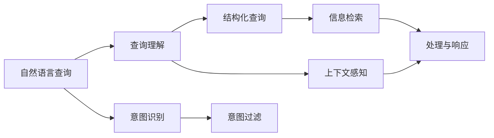

                 

# 电商平台中的自然语言查询理解：大模型的创新应用

> 关键词：自然语言处理,大语言模型,电商平台,查询理解,意图识别,意图过滤

## 1. 背景介绍

### 1.1 问题由来
随着电商平台规模的不断扩大，在线客服人员面临着巨大的工作压力。在客户咨询中，自然语言查询（Natural Language Query, NLQ）问题越来越常见，客户希望通过简单的自然语言描述，获取他们需要的商品信息或服务。如何高效地理解和处理这些自然语言查询，成为了电商平台提升用户体验和运营效率的关键问题。

传统的查询理解方法依赖于规则和模板，难以处理复杂多变的自然语言查询。而现代的深度学习技术，特别是大语言模型，已经展现出在自然语言处理领域的巨大潜力，能够理解自然语言的结构和语义，并提取有价值的信息。

### 1.2 问题核心关键点
1. **自然语言查询处理**：将自然语言查询转换为结构化的查询语句或问题，用于进一步的信息检索和处理。
2. **意图识别**：识别用户查询的意图，以便更好地匹配相应的商品或服务。
3. **意图过滤**：通过意图识别，过滤掉不符合要求的查询，提升查询处理效率。
4. **实时处理**：在线客服场景下，查询理解需要实时响应，要求系统具备高效的计算能力和低延迟。
5. **上下文感知**：在处理多轮对话时，需要考虑查询的上下文信息，提供连贯的回答。
6. **扩展性**：平台需要支持多种语言和多种查询类型，具有高度的可扩展性。

这些关键点共同构成了自然语言查询理解在电商平台中的重要性和复杂性。大语言模型通过预训练学习和微调，有望在这些关键点上提供创新的解决方案。

## 2. 核心概念与联系

### 2.1 核心概念概述

在电商平台中，自然语言查询理解的核心概念主要包括以下几点：

- **自然语言查询（NLQ）**：用户使用自然语言向系统提出的问题，系统需要理解其含义并作出回答。
- **意图识别（Intent Recognition）**：识别用户查询的意图，如查询商品信息、售后服务等，从而提供相应的服务。
- **查询理解（Query Understanding）**：将NLQ转换为结构化的查询，便于系统进行信息检索和处理。
- **大语言模型（Large Language Model, LLM）**：如BERT、GPT等，通过在大规模语料上进行预训练，学习通用的语言表示，具备强大的语言理解和生成能力。
- **微调（Fine-tuning）**：在大模型上利用特定领域的数据进行有监督学习，使其适应具体任务。
- **实时处理（Real-time Processing）**：要求系统在接收到查询后，能够迅速进行处理并返回结果。
- **上下文感知（Context-awareness）**：在处理多轮对话时，系统需要理解查询的上下文信息，提供连贯的回答。

这些概念之间的联系可以通过以下Mermaid流程图来展示：



该流程图展示了自然语言查询理解的主要流程：
1. 用户提出自然语言查询（A）。
2. 系统首先进行查询理解（B），将其转换为结构化的查询（D）。
3. 同时进行意图识别（C），了解用户查询的意图（E）。
4. 基于结构化查询（D）进行信息检索（F）。
5. 对信息进行处理并返回结果（G）。
6. 在多轮对话时，系统需要考虑上下文信息（H）。

## 3. 核心算法原理 & 具体操作步骤
### 3.1 算法原理概述

自然语言查询理解的核心算法是意图识别。意图识别通过机器学习模型，分析用户查询的语言特征，将其映射到预定义的意图类别上。其主要过程包括：

1. **预训练模型选择**：选择如BERT、GPT等大语言模型作为预训练的基础模型。
2. **意图识别模型构建**：在大模型基础上构建意图识别模型，通常使用全连接层或注意力机制进行分类。
3. **微调训练**：利用电商平台的历史查询数据进行微调训练，使模型能够识别平台中的常见查询意图。
4. **实时处理**：在实际应用中，查询理解模块需要实时响应，因此需要对模型进行优化，减少延迟。
5. **上下文感知**：在处理多轮对话时，需要引入上下文信息，提高系统回答的连贯性。

### 3.2 算法步骤详解

下面详细介绍自然语言查询理解的算法步骤：

**Step 1: 准备数据集**
- 收集电商平台的历史查询数据，包括查询文本、意图标签等。
- 对数据进行清洗和标注，确保数据质量。

**Step 2: 构建预训练模型**
- 选择合适的大语言模型，如BERT或GPT。
- 在预训练模型基础上构建意图识别模型，通常包括嵌入层、全连接层和softmax层。

**Step 3: 微调模型**
- 将预训练模型作为初始化参数，利用历史查询数据进行微调。
- 设置合适的学习率、批大小等参数，使用优化算法如AdamW等进行训练。
- 应用正则化技术如L2正则、Dropout等，防止过拟合。
- 设置早停机制，当模型在验证集上不再提升时停止训练。

**Step 4: 实时处理**
- 在实际应用中，系统需要实时响应查询，因此需要使用推理加速技术如Quantization、Pruning等，优化模型结构。
- 通过模型推理引擎，将查询文本输入模型，得到意图标签。
- 根据意图标签，进行相应的查询处理和响应。

**Step 5: 上下文感知**
- 在多轮对话中，系统需要考虑查询的上下文信息，可以使用状态机、记忆网络等方法，记录上下文信息并传递给后续查询处理。
- 系统可以根据上下文信息，提供更加连贯的回答。

### 3.3 算法优缺点

自然语言查询理解的算法有以下优点：

1. **高效性**：利用大语言模型的强大语言理解能力，能够高效处理自然语言查询。
2. **准确性**：通过微调训练，模型的意图识别准确率可以显著提升。
3. **可扩展性**：可以支持多种语言和查询类型，具有良好的可扩展性。
4. **实时响应**：通过优化推理引擎，可以实现实时处理，提升用户体验。

同时，该算法也存在以下缺点：

1. **数据依赖**：模型的性能很大程度上依赖于历史查询数据的标注质量。
2. **计算资源消耗**：大语言模型的计算资源消耗较大，需要高性能硬件支持。
3. **上下文理解难度**：在多轮对话中，理解上下文信息是一个复杂的任务，可能存在错误理解的情况。
4. **模型复杂度**：需要构建复杂的意图识别模型，增加了系统复杂度。

### 3.4 算法应用领域

自然语言查询理解在电商平台中的应用非常广泛，包括：

- **商品搜索**：通过用户输入的查询，快速匹配到相应的商品。
- **客户服务**：回答用户的常见问题和售后服务请求。
- **推荐系统**：根据用户的查询，推荐相关商品或服务。
- **个性化营销**：通过用户查询分析其偏好，进行个性化营销。
- **物流跟踪**：用户查询物流信息，系统提供实时跟踪服务。
- **多语言支持**：支持多种语言的查询理解，提升国际用户的体验。

## 4. 数学模型和公式 & 详细讲解  
### 4.1 数学模型构建

假设查询文本为 $x$，意图标签为 $y$，查询理解模型为 $M_{\theta}$，其中 $\theta$ 为模型参数。意图识别模型可以表示为：

$$
M_{\theta}(x) = \text{softmax}(\mathbf{W}x + \mathbf{b})
$$

其中 $\mathbf{W}$ 为权重矩阵，$\mathbf{b}$ 为偏置向量。模型的损失函数通常为交叉熵损失：

$$
\mathcal{L}(\theta) = -\frac{1}{N}\sum_{i=1}^N \log M_{\theta}(x_i)_{y_i}
$$

### 4.2 公式推导过程

意图识别模型的优化目标是最小化损失函数 $\mathcal{L}(\theta)$，即：

$$
\theta^* = \mathop{\arg\min}_{\theta} \mathcal{L}(\theta)
$$

使用梯度下降等优化算法，模型的更新公式为：

$$
\theta \leftarrow \theta - \eta \nabla_{\theta}\mathcal{L}(\theta)
$$

其中 $\eta$ 为学习率。

在实际应用中，为了提高推理效率，可以通过参数高效微调（PEFT）技术，仅更新模型的一部分参数，如 Top-K 层。PEFT 可以通过冻结底层，只微调顶层，减少计算量，从而提升系统响应速度。

### 4.3 案例分析与讲解

以电商平台中的商品搜索为例，用户输入查询文本，意图识别模型将其转换为意图标签，并根据意图标签进行商品检索。具体步骤如下：

1. **查询输入**：用户输入自然语言查询文本，如“iPhone 12 评测”。
2. **预处理**：对查询文本进行分词、编码等预处理，得到模型输入。
3. **意图识别**：通过模型得到意图标签，如“评测”。
4. **商品检索**：根据意图标签，检索相关的商品信息，如iPhone 12的相关评测信息。
5. **结果呈现**：将检索到的商品信息呈现给用户。

## 5. 项目实践：代码实例和详细解释说明
### 5.1 开发环境搭建

在进行自然语言查询理解的项目实践前，需要先搭建好开发环境。以下是使用Python和Transformers库的开发环境配置流程：

1. 安装Anaconda：从官网下载并安装Anaconda，用于创建独立的Python环境。

2. 创建并激活虚拟环境：
```bash
conda create -n nlp-env python=3.8 
conda activate nlp-env
```

3. 安装必要的库：
```bash
pip install transformers torch sklearn tqdm
```

4. 安装GPU驱动和CUDA库：确保安装适当的GPU驱动和CUDA库，如NVIDIA GeForce RTX 3080 GPU。

### 5.2 源代码详细实现

下面给出一个使用BERT模型的意图识别代码实现：

```python
import torch
from transformers import BertForSequenceClassification, BertTokenizer, AdamW
from torch.utils.data import DataLoader, Dataset

class QueryDataset(Dataset):
    def __init__(self, texts, labels, tokenizer, max_len=128):
        self.texts = texts
        self.labels = labels
        self.tokenizer = tokenizer
        self.max_len = max_len
        
    def __len__(self):
        return len(self.texts)
    
    def __getitem__(self, item):
        text = self.texts[item]
        label = self.labels[item]
        
        encoding = self.tokenizer(text, return_tensors='pt', max_length=self.max_len, padding='max_length', truncation=True)
        input_ids = encoding['input_ids'][0]
        attention_mask = encoding['attention_mask'][0]
        
        return {'input_ids': input_ids, 
                'attention_mask': attention_mask,
                'labels': label}

# 准备数据集
tokenizer = BertTokenizer.from_pretrained('bert-base-uncased')
train_dataset = QueryDataset(train_texts, train_labels, tokenizer)
dev_dataset = QueryDataset(dev_texts, dev_labels, tokenizer)
test_dataset = QueryDataset(test_texts, test_labels, tokenizer)

# 构建模型
model = BertForSequenceClassification.from_pretrained('bert-base-uncased', num_labels=num_labels)
optimizer = AdamW(model.parameters(), lr=2e-5)

# 训练模型
model.train()
for epoch in range(epochs):
    train_loss = 0
    for batch in tqdm(train_loader, desc='Training'):
        input_ids = batch['input_ids'].to(device)
        attention_mask = batch['attention_mask'].to(device)
        labels = batch['labels'].to(device)
        
        model.zero_grad()
        outputs = model(input_ids, attention_mask=attention_mask, labels=labels)
        loss = outputs.loss
        train_loss += loss.item()
        loss.backward()
        optimizer.step()
        
    train_loss /= len(train_loader)
    print(f'Epoch {epoch+1}, train loss: {train_loss:.3f}')

# 评估模型
model.eval()
dev_loss = 0
with torch.no_grad():
    for batch in dev_loader:
        input_ids = batch['input_ids'].to(device)
        attention_mask = batch['attention_mask'].to(device)
        labels = batch['labels'].to(device)
        
        model.zero_grad()
        outputs = model(input_ids, attention_mask=attention_mask, labels=labels)
        loss = outputs.loss
        dev_loss += loss.item()

dev_loss /= len(dev_loader)
print(f'Dev set loss: {dev_loss:.3f}')
```

### 5.3 代码解读与分析

这段代码实现了一个基本的意图识别模型，使用了BERT模型和AdamW优化器。以下是关键代码的解释：

**QueryDataset类**：
- `__init__`方法：初始化查询文本、标签、分词器等组件。
- `__len__`方法：返回数据集的样本数量。
- `__getitem__`方法：对单个样本进行处理，将文本输入编码为token ids，并得到标签。

**模型训练和评估**：
- 通过`BertForSequenceClassification`构建意图识别模型，使用AdamW优化器进行训练。
- 在训练过程中，使用梯度下降更新模型参数。
- 在每个epoch结束后，计算训练集和验证集的损失，并打印输出。

## 6. 实际应用场景
### 6.1 智能客服系统

在智能客服系统中，自然语言查询理解是大模型应用的典型场景之一。传统客服系统依赖人工，成本高、效率低。而大模型可以快速理解客户查询，提供即时响应，大幅提升客服效率。

具体应用流程如下：
1. 收集客服历史对话数据，构建查询-意图标注集。
2. 使用大模型进行微调，训练意图识别模型。
3. 在客服系统中部署模型，实时处理客户查询，输出意图标签和应答模板。
4. 根据意图标签，选择相应的回答模板，进行生成或检索响应。

**6.2 个性化推荐系统**

电商平台的个性化推荐系统依赖于对用户查询的深度理解。通过自然语言查询理解，系统可以精准捕捉用户的兴趣和需求，提供更加个性化的推荐结果。

具体应用流程如下：
1. 收集用户的历史查询数据，构建查询-行为标注集。
2. 使用大模型进行微调，训练意图识别模型。
3. 在推荐系统中部署模型，实时处理用户查询，输出意图标签。
4. 根据意图标签，进行推荐结果的调整和优化。

**6.3 广告投放系统**

广告投放系统需要精准定位用户的意图，提高广告的转化率。通过自然语言查询理解，系统可以分析用户的查询，提供合适的广告内容和投放策略。

具体应用流程如下：
1. 收集用户的广告点击和行为数据，构建查询-广告标注集。
2. 使用大模型进行微调，训练意图识别模型。
3. 在广告投放系统中部署模型，实时处理用户的广告查询，输出意图标签。
4. 根据意图标签，调整广告内容，优化广告投放策略。

## 7. 工具和资源推荐
### 7.1 学习资源推荐

为了帮助开发者系统掌握自然语言查询理解的技术，以下是一些推荐的学习资源：

1. 《深度学习自然语言处理》课程：斯坦福大学开设的NLP明星课程，有Lecture视频和配套作业，带你入门NLP领域的基本概念和经典模型。
2. CS224N《自然语言处理与深度学习》：斯坦福大学课程，涵盖NLP的深度学习技术，包括BERT、GPT等模型。
3. HuggingFace官方文档：提供丰富的模型和工具支持，帮助开发者快速上手大模型微调。
4. 《自然语言处理简明教程》：介绍NLP基础知识和常用技术，适合入门学习。
5. 《Transformers》书籍：Transformer模型的详细介绍，涵盖模型结构和训练方法。

### 7.2 开发工具推荐

为了提高自然语言查询理解的应用效率，以下是一些推荐的开发工具：

1. PyTorch：灵活的深度学习框架，支持动态计算图，适用于模型训练和推理。
2. TensorFlow：强大的生产部署工具，支持分布式训练和优化。
3. Transformers库：提供了预训练模型和微调工具，方便快速搭建意图识别模型。
4. Weights & Biases：实验跟踪工具，记录模型训练过程中的各项指标，方便调优。
5. TensorBoard：可视化工具，监测模型训练状态，提供图表分析。

### 7.3 相关论文推荐

自然语言查询理解在电商平台中的应用，源于学界的持续研究。以下是几篇相关论文的推荐：

1. "Intent Classification with Transformer-based Sequence Labeling"（Bert模型在意图分类中的应用）：展示了BERT模型在意图识别任务上的优势。
2. "Real-time Intent Recognition in Conversational Agents"：介绍了多轮对话中的上下文感知意图识别方法。
3. "Dialogue Response Generation for Smart Customer Service"：介绍了基于大模型的智能客服系统构建方法。
4. "Adaptive Chunking Attention: An Exploration of Multi-Task Learning in Intent Classification"：探索了多任务学习在意图分类中的应用。
5. "Semantic Mining for Customer Sentiment Analysis"：展示了基于自然语言查询理解的情绪分析方法。

## 8. 总结：未来发展趋势与挑战
### 8.1 总结

本文对自然语言查询理解在大模型中的应用进行了全面系统的介绍。通过预训练大模型和微调技术，系统可以高效理解和处理自然语言查询，提升了电商平台的用户体验和运营效率。同时，该技术可以应用于智能客服、个性化推荐、广告投放等多个场景，具有广泛的应用前景。

### 8.2 未来发展趋势

展望未来，自然语言查询理解在电商平台中的应用将呈现以下几个趋势：

1. **多模态融合**：结合视觉、听觉等多模态数据，提升对复杂场景的理解能力。
2. **跨领域应用**：在金融、医疗、教育等多个领域推广应用，提供多场景的解决方案。
3. **模型可解释性**：提高模型的可解释性，让用户了解查询理解的决策过程。
4. **隐私保护**：加强用户隐私保护，确保用户数据的安全性。
5. **实时处理优化**：优化推理引擎，提高实时处理的效率和稳定性。

### 8.3 面临的挑战

尽管自然语言查询理解在电商平台中取得了一定的进展，但仍面临一些挑战：

1. **数据隐私**：电商平台需要平衡用户查询数据的使用和隐私保护，确保数据安全。
2. **模型复杂度**：大规模模型的计算和存储需求较大，需要高性能硬件支持。
3. **多轮对话理解**：在多轮对话中，理解上下文信息是一个复杂的任务，可能存在错误理解的情况。
4. **算法透明性**：模型的决策过程需要透明，方便用户理解和调试。

### 8.4 研究展望

未来的研究需要在以下几个方面寻求新的突破：

1. **隐私保护技术**：研究隐私保护算法，确保用户数据的安全性。
2. **多模态融合技术**：结合视觉、听觉等多模态数据，提升对复杂场景的理解能力。
3. **模型压缩技术**：优化模型结构，减少计算和存储需求。
4. **算法透明性研究**：提高模型的可解释性，让用户了解查询理解的决策过程。

## 9. 附录：常见问题与解答

**Q1：自然语言查询理解是否适用于所有电商平台？**

A: 自然语言查询理解在大多数电商平台中都具有适用性，特别是对于具有丰富文本数据的平台。但对于一些专注于图片、视频等非文本内容为主的平台，需要结合多模态理解技术进行综合应用。

**Q2：大模型如何适应特定的电商平台场景？**

A: 大模型需要在特定电商平台中进一步预训练，了解该平台的常见查询和业务逻辑。在微调阶段，可以使用该平台的标注数据进行训练，调整模型的参数，使其适应特定场景。

**Q3：微调过程中如何优化模型性能？**

A: 微调过程中，可以通过调整学习率、批大小、正则化参数等超参数，优化模型性能。同时，可以通过数据增强、对抗训练等方法，提升模型的泛化能力和鲁棒性。

**Q4：如何处理多轮对话中的上下文信息？**

A: 在多轮对话中，可以使用状态机、记忆网络等方法，记录和传递上下文信息。同时，可以使用预训练的上下文感知模型，提高对话理解的连贯性。

**Q5：自然语言查询理解在安全方面需要注意什么？**

A: 在应用自然语言查询理解时，需要注意用户数据的安全性。确保数据传输和存储的安全性，防止数据泄露和滥用。同时，需要对模型的决策过程进行透明性分析，确保算法的公平性和可靠性。

---

作者：禅与计算机程序设计艺术 / Zen and the Art of Computer Programming

