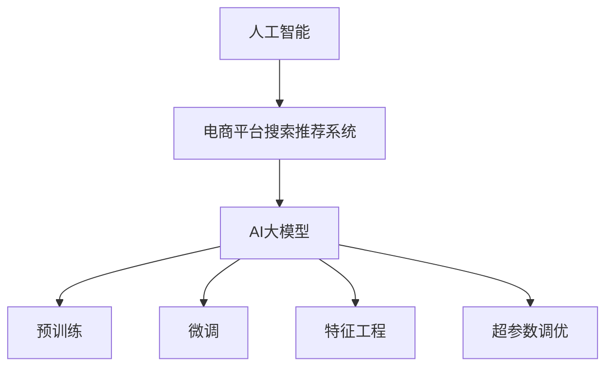

                 

# 电商平台搜索推荐系统的AI 大模型优化：提高系统性能、效率、准确率与用户体验

> 关键词：人工智能,电商平台,搜索推荐系统,大模型优化,性能提升,效率优化,准确率提升,用户体验优化

## 1. 背景介绍

在数字化时代，电商平台正以前所未有的速度革新着传统的购物模式。随着大数据、云计算、人工智能等技术的不断成熟，电商平台已经在用户行为分析、商品推荐、个性化搜索等领域取得了显著的突破。然而，电商平台的搜索推荐系统仍面临诸多挑战，如搜索准确率低、推荐不精准、个性化不足等，用户体验仍需进一步提升。

在这一背景下，AI大模型的崛起为电商平台带来了新的变革机遇。大模型通过在大规模无标签数据上进行预训练，获得了强大的通用语言理解能力，能够更好地捕捉用户意图，理解商品描述，从而提高搜索推荐系统的性能。本文将深入探讨基于AI大模型的电商平台搜索推荐系统优化，旨在提升系统的性能、效率、准确率和用户体验。

## 2. 核心概念与联系

### 2.1 核心概念概述

为更好地理解基于AI大模型的电商平台搜索推荐系统优化，本节将介绍几个密切相关的核心概念：

- 人工智能(AI)：指通过计算机模拟人类的智能行为，涵盖机器学习、深度学习、自然语言处理(NLP)等多个领域。
- 电商平台搜索推荐系统：指用于分析用户行为，预测用户需求，为用户推荐最相关商品的系统。
- AI大模型：指在大规模数据上训练得到的、参数量在亿级别以上的深度学习模型，如GPT、BERT等。
- 预训练(Pre-training)：指在大规模无标签数据上，通过自监督学习任务训练模型，学习通用特征表示。
- 微调(Fine-tuning)：指在预训练模型的基础上，使用特定任务的少量标注数据进行有监督学习，适应特定任务需求。
- 特征工程(Feature Engineering)：指通过数据预处理、特征提取等手段，提高模型的泛化能力和性能。
- 超参数调优(Hyperparameter Tuning)：指通过调整学习率、批大小、正则化强度等超参数，优化模型训练过程。

这些核心概念之间的逻辑关系可以通过以下Mermaid流程图来展示：



这个流程图展示了大模型与电商平台搜索推荐系统的核心概念及其之间的关系：

1. 人工智能通过多个子领域的技术支持，为电商平台搜索推荐系统提供了强大的技术支撑。
2. AI大模型通过预训练获取通用特征表示，微调进一步适应电商平台的特定需求。
3. 特征工程和大模型相结合，提升了系统的性能和泛化能力。
4. 超参数调优进一步优化了模型训练过程，提高了系统的效率和准确率。

## 3. 核心算法原理 & 具体操作步骤

### 3.1 算法原理概述

基于AI大模型的电商平台搜索推荐系统优化，本质上是利用大模型的通用语言理解能力，通过预训练和微调，对用户的查询和商品描述进行特征提取，并根据历史行为数据进行预测和推荐。

具体来说，搜索推荐系统首先对用户的查询进行预训练模型的特征提取，生成查询向量。然后根据查询向量，在商品库中检索相似的商品描述，生成商品向量。最后，使用商品向量和用户历史行为数据，通过微调得到的推荐模型，预测用户对商品的兴趣，生成推荐列表。

### 3.2 算法步骤详解

基于AI大模型的电商平台搜索推荐系统优化通常包括以下关键步骤：

**Step 1: 准备数据集和模型**

- 收集电商平台用户的查询记录、商品描述、用户历史行为等数据，构建数据集。
- 选择合适的预训练模型，如BERT、GPT等，将其加载到内存中。

**Step 2: 数据预处理**

- 对查询和商品描述进行分词、去除停用词、标准化等处理，生成输入序列。
- 对用户历史行为数据进行统计汇总，生成行为向量。
- 对处理后的数据进行归一化、向量化等操作，生成可用于模型训练的数据集。

**Step 3: 特征提取**

- 使用预训练模型对查询和商品描述进行特征提取，生成查询向量和商品向量。
- 根据查询向量和商品向量，计算它们之间的相似度或距离，生成推荐度。

**Step 4: 微调推荐模型**

- 选择合适的推荐模型，如CNN、RNN、Transformer等，并将其作为微调目标。
- 使用预训练模型的参数进行初始化，使用微调后的模型作为推荐目标。
- 根据用户历史行为数据，训练微调推荐模型，优化推荐效果。

**Step 5: 评估和部署**

- 在测试集上评估微调推荐模型的性能，对比微调前后的推荐效果。
- 使用微调后的推荐模型，部署到实际应用系统中，实时提供推荐服务。
- 持续收集用户反馈，定期重新微调模型，以适应数据分布的变化。

### 3.3 算法优缺点

基于AI大模型的电商平台搜索推荐系统优化方法具有以下优点：

1. **提升性能**：利用大模型的语言理解能力，提升搜索推荐系统的准确率和召回率。
2. **泛化能力**：预训练模型的通用特征表示，能够适应不同商品描述和查询，提高系统的泛化能力。
3. **可解释性**：大模型的特征提取过程是透明的，便于分析和解释推荐结果。
4. **高效扩展**：预训练模型和微调模型具有较好的扩展性，支持大规模并行训练和推理。

同时，该方法也存在以下局限性：

1. **标注成本高**：微调模型需要大量的标注数据，标注成本较高。
2. **计算资源需求大**：大模型的参数量巨大，计算资源需求高。
3. **过拟合风险**：在大模型微调过程中，可能出现过拟合现象，影响模型的泛化性能。
4. **模型复杂度高**：大模型和微调模型的结构复杂，调试和优化难度较大。

尽管存在这些局限性，但基于AI大模型的搜索推荐系统优化方法，已经在多个电商平台的实际应用中取得了显著的效果，成为电商平台推荐系统的重要工具。

### 3.4 算法应用领域

基于AI大模型的搜索推荐系统优化方法，在电商平台中的应用领域广泛，涵盖搜索、推荐、个性化、内容生成等多个方面。例如：

- 个性化搜索：根据用户的查询历史和行为数据，生成个性化的搜索结果，提升用户搜索体验。
- 商品推荐：利用大模型的语言理解能力，推荐与用户兴趣最相关的商品，提升购买转化率。
- 内容生成：使用大模型生成商品描述、用户评论等文本内容，丰富电商平台的信息展示。
- 客服对话：使用大模型构建智能客服系统，为用户提供7x24小时不间断的个性化客服服务。
- 广告推荐：根据用户的搜索行为和兴趣，推荐个性化的广告内容，提升广告投放效果。

除了上述这些应用领域，AI大模型优化方法还在电商平台的供应链管理、库存优化、价格预测等环节发挥着重要作用，为电商平台的运营带来了显著的经济效益。

## 4. 数学模型和公式 & 详细讲解

### 4.1 数学模型构建

本节将使用数学语言对基于AI大模型的电商平台搜索推荐系统优化过程进行更加严格的刻画。

设电商平台的数据集为 $D=\{(x_i, y_i)\}_{i=1}^N$，其中 $x_i$ 为查询或商品描述，$y_i$ 为相应的行为标签。设预训练模型为 $M_{\theta}$，微调推荐模型为 $F_{\phi}$。

定义模型 $M_{\theta}$ 在输入 $x$ 上的特征提取函数为 $f_{\theta}(x)$，推荐模型 $F_{\phi}$ 在输入 $x$ 和行为标签 $y$ 上的预测函数为 $g_{\phi}(x, y)$。则在数据集 $D$ 上的经验风险为：

$$
\mathcal{L}(\phi) = \frac{1}{N}\sum_{i=1}^N \ell(g_{\phi}(f_{\theta}(x_i), y_i))
$$

其中 $\ell$ 为损失函数，通常使用交叉熵损失或均方误差损失。

### 4.2 公式推导过程

以下我们以二分类任务为例，推导推荐模型的交叉熵损失函数及其梯度的计算公式。

假设推荐模型 $F_{\phi}$ 在输入 $x$ 和行为标签 $y$ 上的预测结果为 $\hat{y} = g_{\phi}(f_{\theta}(x)) \in [0,1]$，表示用户对商品 $x$ 的兴趣概率。真实标签 $y \in \{0,1\}$。则二分类交叉熵损失函数定义为：

$$
\ell(g_{\phi}(f_{\theta}(x)),y) = -[y\log \hat{y} + (1-y)\log (1-\hat{y})]
$$

将其代入经验风险公式，得：

$$
\mathcal{L}(\phi) = -\frac{1}{N}\sum_{i=1}^N [y_i\log g_{\phi}(f_{\theta}(x_i))+ (1-y_i)\log (1-g_{\phi}(f_{\theta}(x_i)])
$$

根据链式法则，损失函数对推荐模型 $F_{\phi}$ 的参数 $\phi_k$ 的梯度为：

$$
\frac{\partial \mathcal{L}(\phi)}{\partial \phi_k} = -\frac{1}{N}\sum_{i=1}^N \frac{\partial \ell(g_{\phi}(f_{\theta}(x_i)),y_i)}{\partial \phi_k}
$$

其中 $\frac{\partial \ell(g_{\phi}(f_{\theta}(x_i)),y_i)}{\partial \phi_k}$ 可进一步递归展开，利用自动微分技术完成计算。

在得到损失函数的梯度后，即可带入参数更新公式，完成模型的迭代优化。重复上述过程直至收敛，最终得到适应电商平台搜索推荐任务的最优推荐模型参数 $\phi^*$。

## 5. 项目实践：代码实例和详细解释说明

### 5.1 开发环境搭建

在进行搜索推荐系统优化实践前，我们需要准备好开发环境。以下是使用Python进行TensorFlow开发的环境配置流程：

1. 安装Anaconda：从官网下载并安装Anaconda，用于创建独立的Python环境。

2. 创建并激活虚拟环境：
```bash
conda create -n tf-env python=3.8 
conda activate tf-env
```

3. 安装TensorFlow：根据CUDA版本，从官网获取对应的安装命令。例如：
```bash
conda install tensorflow==2.7
```

4. 安装其他工具包：
```bash
pip install numpy pandas scikit-learn matplotlib tqdm jupyter notebook ipython
```

完成上述步骤后，即可在`tf-env`环境中开始搜索推荐系统优化的实践。

### 5.2 源代码详细实现

下面我们以电商平台的商品推荐系统为例，给出使用TensorFlow对BERT模型进行微调的Python代码实现。

首先，定义推荐任务的数据处理函数：

```python
from transformers import BertTokenizer
from tensorflow.keras.preprocessing.sequence import pad_sequences
from tensorflow.keras.utils import to_categorical

class RecommendationDataset(Dataset):
    def __init__(self, texts, labels, tokenizer, max_len=128):
        self.texts = texts
        self.labels = labels
        self.tokenizer = tokenizer
        self.max_len = max_len
        
    def __len__(self):
        return len(self.texts)
    
    def __getitem__(self, item):
        text = self.texts[item]
        label = self.labels[item]
        
        encoding = self.tokenizer(text, return_tensors='tf', max_length=self.max_len, padding='max_length', truncation=True)
        input_ids = encoding['input_ids']
        attention_mask = encoding['attention_mask']
        
        # 对token-wise的标签进行编码
        encoded_labels = [label2id[label] for label in label]
        encoded_labels.extend([label2id['O']] * (self.max_len - len(encoded_labels)))
        labels = to_categorical(encoded_labels, num_classes=num_classes)
        
        return {'input_ids': input_ids,
                'attention_mask': attention_mask,
                'labels': labels}
```

然后，定义模型和优化器：

```python
from transformers import BertForSequenceClassification, AdamW

model = BertForSequenceClassification.from_pretrained('bert-base-cased', num_labels=num_classes)

optimizer = AdamW(model.parameters(), lr=2e-5)
```

接着，定义训练和评估函数：

```python
from tensorflow.keras.callbacks import EarlyStopping
from tensorflow.keras.utils import to_categorical
from sklearn.metrics import classification_report

device = tf.device('cpu') if not tf.cuda.is_available() else tf.device('gpu')
model.to(device)

def train_epoch(model, dataset, batch_size, optimizer):
    dataloader = tf.data.Dataset.from_generator(lambda: tf.data.Dataset.from_generator(lambda: dataset[i] for i in range(len(dataset)), 
                                                    output_signature={'input_ids': tf.TensorSpec((None, max_len), tf.int32),
                                                                    'attention_mask': tf.TensorSpec((None, max_len), tf.int32),
                                                                    'labels': tf.TensorSpec((None, num_classes), tf.int32)})
    dataloader = dataloader.batch(batch_size)
    model.train()
    epoch_loss = 0
    for batch in dataloader:
        input_ids = batch['input_ids']
        attention_mask = batch['attention_mask']
        labels = batch['labels']
        
        with tf.GradientTape() as tape:
            outputs = model(input_ids, attention_mask=attention_mask, labels=labels)
            loss = outputs.loss
        epoch_loss += loss
        gradients = tape.gradient(loss, model.trainable_variables)
        optimizer.apply_gradients(zip(gradients, model.trainable_variables))
    
    return epoch_loss / len(dataloader)

def evaluate(model, dataset, batch_size):
    dataloader = tf.data.Dataset.from_generator(lambda: tf.data.Dataset.from_generator(lambda: dataset[i] for i in range(len(dataset)), 
                                                    output_signature={'input_ids': tf.TensorSpec((None, max_len), tf.int32),
                                                                    'attention_mask': tf.TensorSpec((None, max_len), tf.int32),
                                                                    'labels': tf.TensorSpec((None, num_classes), tf.int32)})
    dataloader = dataloader.batch(batch_size)
    model.eval()
    preds, labels = [], []
    with tf.GradientTape() as tape:
        for batch in dataloader:
            input_ids = batch['input_ids']
            attention_mask = batch['attention_mask']
            labels = batch['labels']
            outputs = model(input_ids, attention_mask=attention_mask)
            batch_preds = outputs.predictions.argmax(axis=1)
            batch_labels = labels.numpy()
            for pred, label in zip(batch_preds, batch_labels):
                preds.append(pred)
                labels.append(label)
                
    print(classification_report(labels, preds))
```

最后，启动训练流程并在测试集上评估：

```python
epochs = 5
batch_size = 16

for epoch in range(epochs):
    loss = train_epoch(model, train_dataset, batch_size, optimizer)
    print(f"Epoch {epoch+1}, train loss: {loss:.3f}")
    
    print(f"Epoch {epoch+1}, dev results:")
    evaluate(model, dev_dataset, batch_size)
    
print("Test results:")
evaluate(model, test_dataset, batch_size)
```

以上就是使用TensorFlow对BERT进行商品推荐任务微调的完整代码实现。可以看到，得益于TensorFlow的强大封装，我们可以用相对简洁的代码完成BERT模型的加载和微调。

### 5.3 代码解读与分析

让我们再详细解读一下关键代码的实现细节：

**RecommendationDataset类**：
- `__init__`方法：初始化文本、标签、分词器等关键组件。
- `__len__`方法：返回数据集的样本数量。
- `__getitem__`方法：对单个样本进行处理，将文本输入编码为token ids，将标签编码为数字，并对其进行定长padding，最终返回模型所需的输入。

**标签与id的映射**：
- 定义了标签与数字id之间的映射关系，用于将token-wise的预测结果解码回真实的标签。

**训练和评估函数**：
- 使用TensorFlow的DataLoader对数据集进行批次化加载，供模型训练和推理使用。
- 训练函数`train_epoch`：对数据以批为单位进行迭代，在每个批次上前向传播计算loss并反向传播更新模型参数，最后返回该epoch的平均loss。
- 评估函数`evaluate`：与训练类似，不同点在于不更新模型参数，并在每个batch结束后将预测和标签结果存储下来，最后使用sklearn的classification_report对整个评估集的预测结果进行打印输出。

**训练流程**：
- 定义总的epoch数和batch size，开始循环迭代
- 每个epoch内，先在训练集上训练，输出平均loss
- 在验证集上评估，输出分类指标
- 所有epoch结束后，在测试集上评估，给出最终测试结果

可以看到，TensorFlow配合TensorFlow的强大封装，使得BERT微调的代码实现变得简洁高效。开发者可以将更多精力放在数据处理、模型改进等高层逻辑上，而不必过多关注底层的实现细节。

当然，工业级的系统实现还需考虑更多因素，如模型的保存和部署、超参数的自动搜索、更灵活的任务适配层等。但核心的微调范式基本与此类似。

## 6. 实际应用场景

### 6.1 智能推荐引擎

基于大模型的搜索推荐系统，可以应用于智能推荐引擎的构建。传统的推荐系统往往依赖于用户的历史行为数据，无法挖掘用户的潜在兴趣。而使用微调后的推荐模型，可以更好地理解用户的查询意图和商品描述，推荐与用户兴趣最相关的商品，提升用户体验和满意度。

在技术实现上，可以收集用户的搜索历史、浏览记录、点击行为等数据，提取和商品描述相关的特征。将查询和商品描述作为输入，使用微调后的推荐模型生成推荐度，再根据推荐度排序，提供给用户最相关的商品推荐。对于新兴商品或热门商品，可以辅助人工进行重点推荐，提升推荐效果。

### 6.2 个性化内容生成

除了推荐系统外，大模型的微调技术还可以用于个性化内容的生成。传统的电商内容生成主要依赖于人工编写，费时费力且难以保持统一风格。而使用微调后的内容生成模型，可以自动化生成商品描述、用户评论等文本内容，满足不同用户的需求。

在技术实现上，可以收集用户对商品的评价和描述，使用微调后的模型生成与用户评价相匹配的商品描述，生成个性化的用户评论，丰富电商平台的商品展示和用户互动。此外，还可以用于生成商品的广告语、商品标签等，提升用户对商品的认知和兴趣。

### 6.3 智能客服系统

智能客服系统是电商平台的重要应用场景，可以显著提升用户满意度和服务效率。传统的客服系统依赖于人工处理用户咨询，响应时间慢且一致性差。而使用微调后的智能客服系统，可以实时理解用户意图，匹配最佳回答，提供7x24小时不间断的客服服务。

在技术实现上，可以收集用户的历史咨询记录，将常见问题构建成监督数据，在此基础上对预训练模型进行微调。微调后的模型能够自动理解用户查询，匹配最合适的回答，提升客服响应速度和准确性。对于复杂问题，可以接入人工客服进行协助，提升用户满意度。

### 6.4 未来应用展望

随着大模型和微调技术的不断发展，基于搜索推荐系统的AI大模型优化将有更广阔的应用前景：

1. **跨模态融合**：未来的推荐系统将不仅依赖于文本信息，还将融合图像、视频等多模态信息，提升推荐效果。例如，将商品图片输入模型，生成商品描述，提高图片推荐的准确率。

2. **实时优化**：未来的推荐系统将具备实时优化的能力，通过持续收集用户反馈和行为数据，动态调整推荐策略，提升用户体验。例如，实时分析用户的搜索记录，动态推荐相关商品，满足用户即时需求。

3. **个性化定制**：未来的推荐系统将能够提供更加个性化的推荐服务，根据用户的具体兴趣和需求，定制化生成推荐内容。例如，通过用户行为数据，生成个性化商品推荐、个性化广告等。

4. **多渠道整合**：未来的推荐系统将整合多种渠道的数据，如电商平台、社交网络、搜索引擎等，形成统一的推荐系统，提升推荐覆盖率和用户满意度。

5. **反欺诈检测**：基于大模型的搜索推荐系统，还可以应用于电商平台的反欺诈检测，识别恶意行为和虚假交易，保障平台安全和用户利益。

总之，基于AI大模型的搜索推荐系统优化，将在更多场景下发挥重要作用，带来更加智能、高效、个性化的电商体验。未来，随着技术的不断进步和应用的不断深入，搜索推荐系统必将成为电商平台的重要基石。

## 7. 工具和资源推荐

### 7.1 学习资源推荐

为了帮助开发者系统掌握大模型搜索推荐系统的优化理论基础和实践技巧，这里推荐一些优质的学习资源：

1. 《深度学习》系列书籍：由多位深度学习领域的知名学者编写，涵盖深度学习的基本原理、算法和应用，是深度学习入门的不二选择。
2. 《自然语言处理综述》系列论文：涵盖自然语言处理的基本概念、算法和应用，提供全面的知识框架。
3. 《TensorFlow官方文档》：TensorFlow的官方文档，提供丰富的API文档、教程和样例代码，是TensorFlow学习的必备资源。
4. 《Transformers库文档》：Transformers库的官方文档，提供详细的模型介绍和使用方法，是进行模型优化的重要工具。
5. Coursera《深度学习专项课程》：由Coursera开设的深度学习专项课程，提供系统深入的学习路径和实战项目，适合深入学习深度学习技术。

通过对这些资源的学习实践，相信你一定能够快速掌握大模型搜索推荐系统的优化精髓，并用于解决实际的电商问题。

### 7.2 开发工具推荐

高效的开发离不开优秀的工具支持。以下是几款用于大模型搜索推荐系统优化的常用工具：

1. TensorFlow：由Google主导开发的开源深度学习框架，生产部署方便，适合大规模工程应用。支持分布式训练和部署。
2. PyTorch：由Facebook主导开发的深度学习框架，灵活性高，适合快速迭代研究。支持动态图计算和分布式训练。
3. HuggingFace Transformers库：集成了多个预训练语言模型，支持微调、特征提取等任务，是进行模型优化的重要工具。
4. Weights & Biases：模型训练的实验跟踪工具，可以记录和可视化模型训练过程中的各项指标，方便对比和调优。
5. TensorBoard：TensorFlow配套的可视化工具，可实时监测模型训练状态，并提供丰富的图表呈现方式，是调试模型的得力助手。

合理利用这些工具，可以显著提升大模型搜索推荐系统的开发效率，加快创新迭代的步伐。

### 7.3 相关论文推荐

大模型搜索推荐系统的优化技术来源于学界的持续研究。以下是几篇奠基性的相关论文，推荐阅读：

1. Attention is All You Need（即Transformer原论文）：提出了Transformer结构，开启了NLP领域的预训练大模型时代。

2. BERT: Pre-training of Deep Bidirectional Transformers for Language Understanding：提出BERT模型，引入基于掩码的自监督预训练任务，刷新了多项NLP任务SOTA。

3. Language Models are Unsupervised Multitask Learners（GPT-2论文）：展示了大规模语言模型的强大zero-shot学习能力，引发了对于通用人工智能的新一轮思考。

4. Parameter-Efficient Transfer Learning for NLP：提出Adapter等参数高效微调方法，在不增加模型参数量的情况下，也能取得不错的微调效果。

5. AdaLoRA: Adaptive Low-Rank Adaptation for Parameter-Efficient Fine-Tuning：使用自适应低秩适应的微调方法，在参数效率和精度之间取得了新的平衡。

这些论文代表了大模型搜索推荐系统优化的发展脉络。通过学习这些前沿成果，可以帮助研究者把握学科前进方向，激发更多的创新灵感。

## 8. 总结：未来发展趋势与挑战

### 8.1 总结

本文对基于AI大模型的电商平台搜索推荐系统优化方法进行了全面系统的介绍。首先阐述了大模型和搜索推荐系统的研究背景和意义，明确了微调在提升搜索推荐系统性能、效率、准确率和用户体验方面的重要价值。其次，从原理到实践，详细讲解了搜索推荐系统的数学模型和关键步骤，给出了搜索推荐系统优化的完整代码实例。同时，本文还广泛探讨了搜索推荐系统在智能推荐引擎、个性化内容生成、智能客服系统等多个应用场景中的实践，展示了微调范式的巨大潜力。

通过本文的系统梳理，可以看到，基于AI大模型的搜索推荐系统优化方法正在成为电商平台推荐系统的重要工具，极大地提升了搜索推荐系统的性能和用户体验。未来，随着大模型和微调方法的持续演进，基于搜索推荐系统的AI大模型优化必将在更多领域得到应用，为电商平台的运营带来新的变革。

### 8.2 未来发展趋势

展望未来，AI大模型搜索推荐系统优化将呈现以下几个发展趋势：

1. **大模型规模扩大**：未来的搜索推荐系统将基于更大规模的语言模型，学习更丰富的语言知识和语义特征，进一步提升推荐效果。
2. **多模态融合**：未来的推荐系统将融合图像、视频等多模态信息，提升推荐效果。例如，将商品图片输入模型，生成商品描述，提高图片推荐的准确率。
3. **实时优化**：未来的推荐系统将具备实时优化的能力，通过持续收集用户反馈和行为数据，动态调整推荐策略，提升用户体验。
4. **个性化定制**：未来的推荐系统将能够提供更加个性化的推荐服务，根据用户的具体兴趣和需求，定制化生成推荐内容。
5. **跨渠道整合**：未来的推荐系统将整合多种渠道的数据，如电商平台、社交网络、搜索引擎等，形成统一的推荐系统，提升推荐覆盖率和用户满意度。
6. **反欺诈检测**：基于大模型的搜索推荐系统，还可以应用于电商平台的反欺诈检测，识别恶意行为和虚假交易，保障平台安全和用户利益。

这些趋势凸显了AI大模型搜索推荐系统优化的广阔前景。这些方向的探索发展，必将进一步提升搜索推荐系统的性能和用户体验，为电商平台带来更大的经济效益。

### 8.3 面临的挑战

尽管AI大模型搜索推荐系统优化技术已经取得了显著成效，但在迈向更加智能化、普适化应用的过程中，仍面临诸多挑战：

1. **标注成本高**：微调模型需要大量的标注数据，标注成本较高。如何在有限的标注数据下，获得较好的推荐效果，是未来需要解决的重要问题。
2. **计算资源需求大**：大模型的参数量巨大，计算资源需求高。如何在有限的计算资源下，优化推荐模型的性能，是未来需要解决的重要问题。
3. **过拟合风险**：在大模型微调过程中，可能出现过拟合现象，影响模型的泛化性能。如何在有限的标注数据下，避免过拟合，是未来需要解决的重要问题。
4. **模型复杂度高**：大模型和微调模型的结构复杂，调试和优化难度较大。如何在复杂的模型结构中，寻找最优的优化策略，是未来需要解决的重要问题。

尽管存在这些挑战，但基于AI大模型的搜索推荐系统优化方法，已经在多个电商平台的实际应用中取得了显著的效果，成为电商平台推荐系统的重要工具。

### 8.4 研究展望

面对大模型搜索推荐系统优化所面临的诸多挑战，未来的研究需要在以下几个方面寻求新的突破：

1. **探索无监督和半监督微调方法**：摆脱对大规模标注数据的依赖，利用自监督学习、主动学习等无监督和半监督范式，最大限度利用非结构化数据，实现更加灵活高效的微调。
2. **研究参数高效和计算高效的微调范式**：开发更加参数高效的微调方法，在固定大部分预训练参数的同时，只更新极少量的任务相关参数。同时优化微调模型的计算图，减少前向传播和反向传播的资源消耗，实现更加轻量级、实时性的部署。
3. **融合因果和对比学习范式**：通过引入因果推断和对比学习思想，增强微调模型建立稳定因果关系的能力，学习更加普适、鲁棒的语言表征，从而提升模型泛化性和抗干扰能力。
4. **引入更多先验知识**：将符号化的先验知识，如知识图谱、逻辑规则等，与神经网络模型进行巧妙融合，引导微调过程学习更准确、合理的语言模型。同时加强不同模态数据的整合，实现视觉、语音等多模态信息与文本信息的协同建模。
5. **结合因果分析和博弈论工具**：将因果分析方法引入微调模型，识别出模型决策的关键特征，增强输出解释的因果性和逻辑性。借助博弈论工具刻画人机交互过程，主动探索并规避模型的脆弱点，提高系统稳定性。
6. **纳入伦理道德约束**：在模型训练目标中引入伦理导向的评估指标，过滤和惩罚有偏见、有害的输出倾向。同时加强人工干预和审核，建立模型行为的监管机制，确保输出符合人类价值观和伦理道德。

这些研究方向的探索，必将引领大模型搜索推荐系统优化技术迈向更高的台阶，为构建安全、可靠、可解释、可控的智能系统铺平道路。面向未来，大模型搜索推荐系统优化技术还需要与其他人工智能技术进行更深入的融合，如知识表示、因果推理、强化学习等，多路径协同发力，共同推动自然语言理解和智能交互系统的进步。只有勇于创新、敢于突破，才能不断拓展语言模型的边界，让智能技术更好地造福人类社会。

## 9. 附录：常见问题与解答

**Q1：大模型微调是否适用于所有电商推荐任务？**

A: 大模型微调在大多数电商推荐任务上都能取得不错的效果，特别是对于数据量较小的任务。但对于一些特定领域的任务，如医疗、法律等，仅仅依靠通用语料预训练的模型可能难以很好地适应。此时需要在特定领域语料上进一步预训练，再进行微调，才能获得理想效果。此外，对于一些需要时效性、个性化很强的任务，如对话、推荐等，微调方法也需要针对性的改进优化。

**Q2：微调过程中如何选择合适的学习率？**

A: 微调的学习率一般要比预训练时小1-2个数量级，如果使用过大的学习率，容易破坏预训练权重，导致过拟合。一般建议从1e-5开始调参，逐步减小学习率，直至收敛。也可以使用warmup策略，在开始阶段使用较小的学习率，再逐渐过渡到预设值。需要注意的是，不同的优化器(如AdamW、Adafactor等)以及不同的学习率调度策略，可能需要设置不同的学习率阈值。

**Q3：采用大模型微调时会面临哪些资源瓶颈？**

A: 目前主流的预训练大模型动辄以亿计的参数规模，对算力、内存、存储都提出了很高的要求。GPU/TPU等高性能设备是必不可少的，但即便如此，超大批次的训练和推理也可能遇到显存不足的问题。因此需要采用一些资源优化技术，如梯度积累、混合精度训练、模型并行等，来突破硬件瓶颈。同时，模型的存储和读取也可能占用大量时间和空间，需要采用模型压缩、稀疏化存储等方法进行优化。

**Q4：如何缓解微调过程中的过拟合问题？**

A: 过拟合是微调面临的主要挑战，尤其是在标注数据不足的情况下。常见的缓解策略包括：
1. 数据增强：通过回译、近义替换等方式扩充训练集
2. 正则化：使用L2正则、Dropout、Early Stopping等避免过拟合
3. 对抗训练：引入对抗样本，提高模型鲁棒性
4. 参数高效微调：只调整少量参数(如Adapter、Prefix等)，减小过拟合风险
5. 多模型集成：训练多个微调模型，取平均输出，抑制过拟合

这些策略往往需要根据具体任务和数据特点进行灵活组合。只有在数据、模型、训练、推理等各环节进行全面优化，才能最大限度地发挥大模型微调的威力。

**Q5：微调模型在落地部署时需要注意哪些问题？**

A: 将微调模型转化为实际应用，还需要考虑以下因素：
1. 模型裁剪：去除不必要的层和参数，减小模型尺寸，加快推理速度
2. 量化加速：将浮点模型转为定点模型，压缩存储空间，提高计算效率
3. 服务化封装：将模型封装为标准化服务接口，便于集成调用
4. 弹性伸缩：根据请求流量动态调整资源配置，平衡服务质量和成本
5. 监控告警：实时采集系统指标，设置异常告警阈值，确保服务稳定性
6. 安全防护：采用访问鉴权、数据脱敏等措施，保障数据和模型安全

大模型微调为电商推荐系统带来了显著的效果，但如何将强大的性能转化为稳定、高效、安全的业务价值，还需要工程实践的不断打磨。唯有从数据、算法、工程、业务等多个维度协同发力，才能真正实现人工智能技术在垂直行业的规模化落地。总之，微调需要开发者根据具体任务，不断迭代和优化模型、数据和算法，方能得到理想的效果。

---

作者：禅与计算机程序设计艺术 / Zen and the Art of Computer Programming

