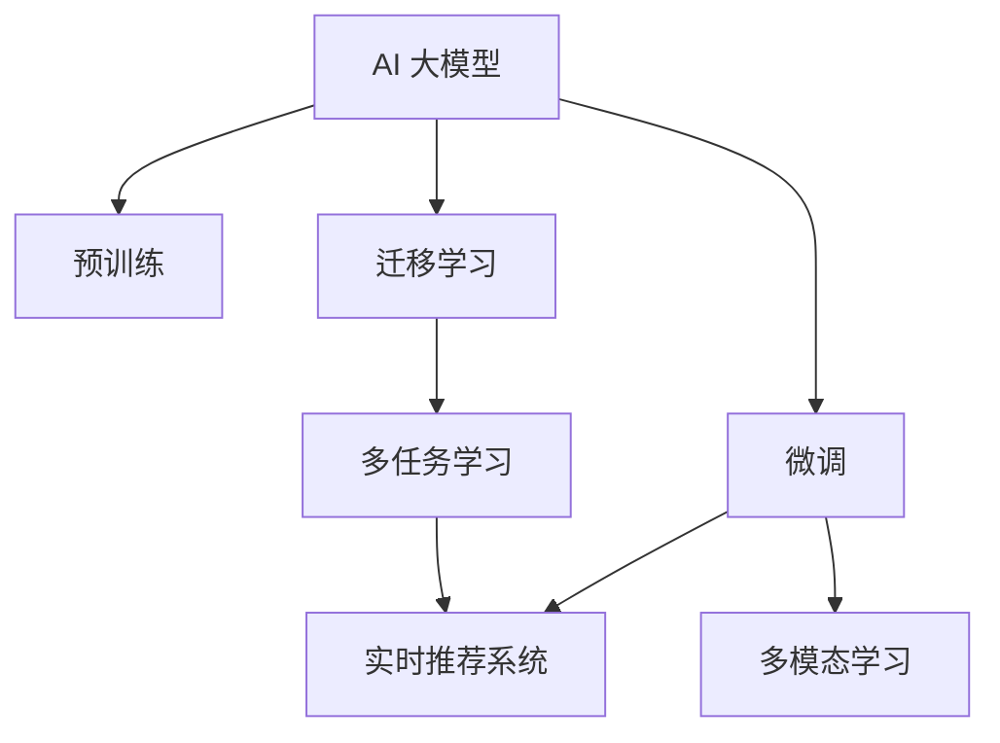

                 

# 电商平台搜索推荐系统的AI 大模型应用：提高系统性能、效率、准确率与实时性

在如今电商平台上，搜索推荐系统的表现直接影响用户体验和转化率。传统基于规则和浅层特征的推荐算法已无法满足用户的个性化需求。AI 大模型的应用带来了革命性的改变，使得推荐系统具备了更加强大的数据处理能力和学习潜力，从而在性能、效率、准确率与实时性方面取得了显著的提升。本文将详细介绍基于 AI 大模型的电商平台搜索推荐系统，包括其核心概念、算法原理、实际应用及未来发展方向。

## 1. 背景介绍

### 1.1 问题由来

电商平台搜索推荐系统旨在通过分析用户行为数据，为用户提供个性化的商品推荐，从而提升用户满意度、增加销售额。然而，传统的推荐算法，如协同过滤、基于内容的推荐等，在面对海量数据和高维度特征时，往往存在扩展性差、效果不稳定的问题。而 AI 大模型的应用，则通过自监督预训练和下游微调的方式，解决了这些问题，显著提升了推荐系统的性能和效果。

### 1.2 问题核心关键点

AI 大模型在电商平台搜索推荐系统中的主要应用集中在以下几个方面：

1. **数据驱动的个性化推荐**：利用大模型学习用户行为、商品属性等复杂非结构化数据，实现高质量的个性化推荐。
2. **实时动态更新**：通过在线微调，使模型能够快速适应用户行为变化和市场动态，实现实时推荐。
3. **多模态融合**：将文本、图像、视频等多种模态数据融合，提升推荐系统的表现力和泛化能力。
4. **增强的泛化能力和适应性**：利用大模型的语言理解和生成能力，扩展推荐系统在更多场景中的应用。

## 2. 核心概念与联系

### 2.1 核心概念概述

为更好地理解基于 AI 大模型的电商平台搜索推荐系统，本节将介绍几个密切相关的核心概念：

- **AI 大模型**：指通过大规模数据自监督预训练和下游微调得到的通用语言或视觉模型。具备强大的数据处理和泛化能力，能够对复杂的非结构化数据进行处理和建模。
- **预训练**：指在大规模无标签数据上，通过自监督任务训练通用模型，使其具备对新任务的适应能力。
- **微调**：指在预训练模型基础上，使用下游任务标注数据进行有监督学习，进一步优化模型性能。
- **多模态学习**：指同时处理文本、图像、视频等多种模态数据，通过跨模态融合提升推荐系统效果。
- **实时推荐系统**：指能够根据用户实时行为和市场动态，动态生成个性化推荐结果的系统。
- **迁移学习**：指将在大模型预训练过程中学到的知识，迁移到下游任务中，提升模型在新任务上的性能。

这些核心概念之间的逻辑关系可以通过以下 Mermaid 流程图来展示：



这个流程图展示了大模型的核心概念及其之间的关系：

1. 大模型通过预训练获得基础能力。
2. 微调是对预训练模型进行任务特定的优化，进一步提升模型性能。
3. 实时推荐系统能够实时生成个性化推荐，提升用户体验。
4. 多模态学习使模型能够处理更多种类的数据，提高推荐系统的表现力。
5. 迁移学习促进模型的跨领域泛化能力，提升模型在新任务上的性能。

这些核心概念共同构成了 AI 大模型在电商平台搜索推荐系统中的应用框架，使其能够在各种场景下发挥强大的推荐能力。

## 3. 核心算法原理 & 具体操作步骤
### 3.1 算法原理概述

基于 AI 大模型的电商平台搜索推荐系统，本质上是一个数据驱动的个性化推荐系统，利用大模型的泛化能力和迁移学习能力，实现高质量的个性化推荐。其核心思想是：将预训练的大模型视为一个强大的特征提取器，通过有监督的微调过程，学习用户行为和商品属性之间的复杂关系，从而实现精准的个性化推荐。

形式化地，假设推荐系统需要处理的数据集为 $D=\{(x_i,y_i)\}_{i=1}^N$，其中 $x_i$ 为用户的交互行为或商品属性数据，$y_i$ 为推荐结果。定义模型 $M_{\theta}$ 在数据集 $D$ 上的预测函数为：

$$
M_{\theta}(x) = \text{softmax}(W_1 A_1 + W_2 A_2 + \ldots + W_k A_k + b)
$$

其中 $W_i$ 和 $b$ 为模型参数，$A_i$ 为 $x$ 经过预训练模型后的表示，$k$ 为模型层数。推荐系统的目标是最小化预测误差，即：

$$
\min_{\theta} \sum_{i=1}^N \ell(M_{\theta}(x_i), y_i)
$$

其中 $\ell$ 为交叉熵损失函数，$\theta$ 为模型参数。通过梯度下降等优化算法，微调过程不断更新模型参数，使得模型预测结果与真实标签尽量接近。

### 3.2 算法步骤详解

基于 AI 大模型的电商平台搜索推荐系统的一般流程包括以下几个关键步骤：

**Step 1: 准备预训练模型和数据集**
- 选择合适的预训练模型，如BERT、GPT、ViT等，作为初始化参数。
- 准备推荐系统的标注数据集 $D$，通常包括用户行为数据、商品属性数据和用户反馈数据。

**Step 2: 添加任务适配层**
- 根据推荐任务的类型，设计合适的输出层和损失函数。
- 对于推荐任务，通常使用多任务学习框架，如CausalLM，将多个任务共用一个预训练模型。

**Step 3: 设置微调超参数**
- 选择合适的优化算法及其参数，如AdamW、SGD等，设置学习率、批大小、迭代轮数等。
- 设置正则化技术及强度，包括L2正则、Dropout、Early Stopping等。
- 确定冻结预训练参数的策略，如仅微调顶层，或全部参数都参与微调。

**Step 4: 执行梯度训练**
- 将训练集数据分批次输入模型，前向传播计算损失函数。
- 反向传播计算参数梯度，根据设定的优化算法和学习率更新模型参数。
- 周期性在验证集上评估模型性能，根据性能指标决定是否触发 Early Stopping。
- 重复上述步骤直到满足预设的迭代轮数或 Early Stopping 条件。

**Step 5: 测试和部署**
- 在测试集上评估微调后模型 $M_{\hat{\theta}}$ 的性能，对比微调前后的推荐效果。
- 使用微调后的模型对新样本进行推理预测，集成到实际的应用系统中。
- 持续收集新的数据，定期重新微调模型，以适应数据分布的变化。

以上是基于 AI 大模型的电商平台搜索推荐系统的一般流程。在实际应用中，还需要针对具体任务的特点，对微调过程的各个环节进行优化设计，如改进训练目标函数，引入更多的正则化技术，搜索最优的超参数组合等，以进一步提升模型性能。

### 3.3 算法优缺点

基于 AI 大模型的电商平台搜索推荐系统具有以下优点：
1. 数据驱动：能够处理复杂的非结构化数据，从中学习用户行为和商品属性之间的复杂关系。
2. 泛化能力强：通过预训练和微调，模型具备良好的泛化能力，能够在不同场景下表现稳定。
3. 实时性高：利用在线微调技术，模型能够快速适应用户行为和市场动态，实现实时推荐。
4. 多模态融合：能够处理多种模态数据，提高推荐系统的表现力和泛化能力。

同时，该方法也存在一定的局限性：
1. 依赖数据：需要大量的标注数据进行微调，标注成本较高。
2. 模型复杂：大模型参数量较大，计算资源需求高，推理速度较慢。
3. 可解释性不足：模型复杂度较高，难以解释其内部工作机制和决策逻辑。
4. 数据偏差：预训练和微调过程中可能会学习到数据集中的偏差，导致推荐结果不公平。

尽管存在这些局限性，但就目前而言，基于 AI 大模型的推荐系统仍然是电商平台推荐领域的主流范式。未来相关研究的重点在于如何进一步降低微调对标注数据的依赖，提高模型的实时性和可解释性，同时兼顾可解释性和伦理安全性等因素。

### 3.4 算法应用领域

基于 AI 大模型的电商平台搜索推荐系统已经在诸多领域得到了应用，覆盖了几乎所有常见的推荐任务，例如：

- **个性化推荐**：根据用户历史行为和兴趣，推荐最适合的商品。
- **广告推荐**：针对用户特征和兴趣，推荐相关广告内容。
- **内容推荐**：推荐用户可能感兴趣的新闻、文章、视频等。
- **多模态推荐**：结合文本、图像、视频等多模态数据，提升推荐效果。
- **实时推荐**：根据用户实时行为和市场动态，动态生成推荐结果。
- **情感分析**：通过分析用户评论，推荐与其情感状态相匹配的商品。
- **多任务学习**：将推荐任务与其他相关任务（如广告点击预测、商品质量评价等）共用一个模型，提高模型性能。

除了上述这些经典任务外，AI 大模型还创新性地应用于更多场景中，如可控推荐、个性化视频推荐、跨领域推荐等，为电商平台推荐系统带来了全新的突破。随着 AI 大模型和推荐方法的不断进步，相信电商平台推荐系统将在更广阔的应用领域大放异彩。

## 4. 数学模型和公式 & 详细讲解
### 4.1 数学模型构建

在电商平台搜索推荐系统中，大模型通常用于处理用户行为和商品属性等复杂非结构化数据。本文以用户行为数据为例，说明其数学模型构建过程。

假设用户行为数据集为 $D=\{(x_i,y_i)\}_{i=1}^N$，其中 $x_i$ 为用户的交互行为数据，$y_i$ 为推荐结果。定义模型 $M_{\theta}$ 在数据集 $D$ 上的预测函数为：

$$
M_{\theta}(x) = \text{softmax}(W_1 A_1 + W_2 A_2 + \ldots + W_k A_k + b)
$$

其中 $W_i$ 和 $b$ 为模型参数，$A_i$ 为 $x$ 经过预训练模型后的表示，$k$ 为模型层数。推荐系统的目标是最小化预测误差，即：

$$
\min_{\theta} \sum_{i=1}^N \ell(M_{\theta}(x_i), y_i)
$$

其中 $\ell$ 为交叉熵损失函数，$\theta$ 为模型参数。

### 4.2 公式推导过程

以下我们以二分类推荐任务为例，推导交叉熵损失函数及其梯度的计算公式。

假设模型 $M_{\theta}$ 在用户行为数据 $x$ 上的输出为 $\hat{y}=M_{\theta}(x) \in [0,1]$，表示用户可能点击商品的概率。真实标签 $y \in \{0,1\}$。则二分类交叉熵损失函数定义为：

$$
\ell(M_{\theta}(x),y) = -[y\log \hat{y} + (1-y)\log(1-\hat{y})]
$$

将其代入经验风险公式，得：

$$
\mathcal{L}(\theta) = -\frac{1}{N}\sum_{i=1}^N [y_i\log M_{\theta}(x_i)+(1-y_i)\log(1-M_{\theta}(x_i))]
$$

根据链式法则，损失函数对参数 $\theta_k$ 的梯度为：

$$
\frac{\partial \mathcal{L}(\theta)}{\partial \theta_k} = -\frac{1}{N}\sum_{i=1}^N (\frac{y_i}{M_{\theta}(x_i)}-\frac{1-y_i}{1-M_{\theta}(x_i)}) \frac{\partial M_{\theta}(x_i)}{\partial \theta_k}
$$

其中 $\frac{\partial M_{\theta}(x_i)}{\partial \theta_k}$ 可进一步递归展开，利用自动微分技术完成计算。

在得到损失函数的梯度后，即可带入参数更新公式，完成模型的迭代优化。重复上述过程直至收敛，最终得到适应推荐任务的最优模型参数 $\theta^*$。

## 5. 项目实践：代码实例和详细解释说明
### 5.1 开发环境搭建

在进行推荐系统开发前，我们需要准备好开发环境。以下是使用 Python 进行 PyTorch 开发的环境配置流程：

1. 安装 Anaconda：从官网下载并安装 Anaconda，用于创建独立的 Python 环境。

2. 创建并激活虚拟环境：
```bash
conda create -n pytorch-env python=3.8 
conda activate pytorch-env
```

3. 安装 PyTorch：根据 CUDA 版本，从官网获取对应的安装命令。例如：
```bash
conda install pytorch torchvision torchaudio cudatoolkit=11.1 -c pytorch -c conda-forge
```

4. 安装 Transformers 库：
```bash
pip install transformers
```

5. 安装各类工具包：
```bash
pip install numpy pandas scikit-learn matplotlib tqdm jupyter notebook ipython
```

完成上述步骤后，即可在 `pytorch-env` 环境中开始推荐系统开发。

### 5.2 源代码详细实现

下面以多任务学习框架 CausalLM 为例，给出使用 Transformers 库对 BERT 模型进行多任务推荐系统开发的 PyTorch 代码实现。

首先，定义推荐系统任务的数据处理函数：

```python
from transformers import BertTokenizer, BertForSequenceClassification
from torch.utils.data import Dataset
import torch

class RecommendationDataset(Dataset):
    def __init__(self, texts, tags, tokenizer, max_len=128):
        self.texts = texts
        self.tags = tags
        self.tokenizer = tokenizer
        self.max_len = max_len
        
    def __len__(self):
        return len(self.texts)
    
    def __getitem__(self, item):
        text = self.texts[item]
        tags = self.tags[item]
        
        encoding = self.tokenizer(text, return_tensors='pt', max_length=self.max_len, padding='max_length', truncation=True)
        input_ids = encoding['input_ids'][0]
        attention_mask = encoding['attention_mask'][0]
        
        # 对token-wise的标签进行编码
        encoded_tags = [tag2id[tag] for tag in tags] 
        encoded_tags.extend([tag2id['O']] * (self.max_len - len(encoded_tags)))
        labels = torch.tensor(encoded_tags, dtype=torch.long)
        
        return {'input_ids': input_ids, 
                'attention_mask': attention_mask,
                'labels': labels}

# 标签与id的映射
tag2id = {'O': 0, 'A': 1, 'B': 2, 'C': 3, 'D': 4}
id2tag = {v: k for k, v in tag2id.items()}

# 创建dataset
tokenizer = BertTokenizer.from_pretrained('bert-base-cased')

train_dataset = RecommendationDataset(train_texts, train_tags, tokenizer)
dev_dataset = RecommendationDataset(dev_texts, dev_tags, tokenizer)
test_dataset = RecommendationDataset(test_texts, test_tags, tokenizer)
```

然后，定义模型和优化器：

```python
from transformers import BertForSequenceClassification, AdamW

model = BertForSequenceClassification.from_pretrained('bert-base-cased', num_labels=len(tag2id))

optimizer = AdamW(model.parameters(), lr=2e-5)
```

接着，定义训练和评估函数：

```python
from torch.utils.data import DataLoader
from tqdm import tqdm
from sklearn.metrics import classification_report

device = torch.device('cuda') if torch.cuda.is_available() else torch.device('cpu')
model.to(device)

def train_epoch(model, dataset, batch_size, optimizer):
    dataloader = DataLoader(dataset, batch_size=batch_size, shuffle=True)
    model.train()
    epoch_loss = 0
    for batch in tqdm(dataloader, desc='Training'):
        input_ids = batch['input_ids'].to(device)
        attention_mask = batch['attention_mask'].to(device)
        labels = batch['labels'].to(device)
        model.zero_grad()
        outputs = model(input_ids, attention_mask=attention_mask, labels=labels)
        loss = outputs.loss
        epoch_loss += loss.item()
        loss.backward()
        optimizer.step()
    return epoch_loss / len(dataloader)

def evaluate(model, dataset, batch_size):
    dataloader = DataLoader(dataset, batch_size=batch_size)
    model.eval()
    preds, labels = [], []
    with torch.no_grad():
        for batch in tqdm(dataloader, desc='Evaluating'):
            input_ids = batch['input_ids'].to(device)
            attention_mask = batch['attention_mask'].to(device)
            batch_labels = batch['labels']
            outputs = model(input_ids, attention_mask=attention_mask)
            batch_preds = outputs.logits.argmax(dim=2).to('cpu').tolist()
            batch_labels = batch_labels.to('cpu').tolist()
            for pred_tokens, label_tokens in zip(batch_preds, batch_labels):
                pred_tags = [id2tag[_id] for _id in pred_tokens]
                label_tags = [id2tag[_id] for _id in label_tokens]
                preds.append(pred_tags[:len(label_tags)])
                labels.append(label_tags)
                
    print(classification_report(labels, preds))
```

最后，启动训练流程并在测试集上评估：

```python
epochs = 5
batch_size = 16

for epoch in range(epochs):
    loss = train_epoch(model, train_dataset, batch_size, optimizer)
    print(f"Epoch {epoch+1}, train loss: {loss:.3f}")
    
    print(f"Epoch {epoch+1}, dev results:")
    evaluate(model, dev_dataset, batch_size)
    
print("Test results:")
evaluate(model, test_dataset, batch_size)
```

以上就是使用 PyTorch 对 BERT 进行多任务推荐系统微调的完整代码实现。可以看到，得益于 Transformers 库的强大封装，我们可以用相对简洁的代码完成 BERT 模型的加载和微调。

### 5.3 代码解读与分析

让我们再详细解读一下关键代码的实现细节：

**RecommendationDataset 类**：
- `__init__` 方法：初始化文本、标签、分词器等关键组件。
- `__len__` 方法：返回数据集的样本数量。
- `__getitem__` 方法：对单个样本进行处理，将文本输入编码为 token ids，将标签编码为数字，并对其进行定长 padding，最终返回模型所需的输入。

**tag2id 和 id2tag 字典**：
- 定义了标签与数字 id 之间的映射关系，用于将 token-wise 的预测结果解码回真实的标签。

**训练和评估函数**：
- 使用 PyTorch 的 DataLoader 对数据集进行批次化加载，供模型训练和推理使用。
- 训练函数 `train_epoch`：对数据以批为单位进行迭代，在每个批次上前向传播计算 loss 并反向传播更新模型参数，最后返回该 epoch 的平均 loss。
- 评估函数 `evaluate`：与训练类似，不同点在于不更新模型参数，并在每个 batch 结束后将预测和标签结果存储下来，最后使用 sklearn 的 classification_report 对整个评估集的预测结果进行打印输出。

**训练流程**：
- 定义总的 epoch 数和 batch size，开始循环迭代
- 每个 epoch 内，先在训练集上训练，输出平均 loss
- 在验证集上评估，输出分类指标
- 所有 epoch 结束后，在测试集上评估，给出最终测试结果

可以看到，PyTorch 配合 Transformers 库使得 BERT 微调的代码实现变得简洁高效。开发者可以将更多精力放在数据处理、模型改进等高层逻辑上，而不必过多关注底层的实现细节。

当然，工业级的系统实现还需考虑更多因素，如模型的保存和部署、超参数的自动搜索、更灵活的任务适配层等。但核心的微调范式基本与此类似。

## 6. 实际应用场景
### 6.1 电商商品推荐

基于 AI 大模型的电商推荐系统可以应用于商品推荐，为每位用户推荐其可能感兴趣的商品。传统推荐算法依赖于用户的显式评分和行为数据，难以刻画用户的隐式兴趣和行为。利用大模型的泛化能力和迁移学习能力，推荐系统能够更准确地理解用户的多样化需求。

在技术实现上，可以收集用户浏览、点击、购买等行为数据，提取和商品相关的文本信息、图片信息、评价信息等，将这些多模态数据作为模型输入，通过微调学习用户对商品的兴趣。在推荐时，将用户的实时行为和历史行为作为输入，通过在线微调模型生成推荐结果，实现动态更新。

### 6.2 广告定向投放

基于 AI 大模型的广告定向投放系统能够根据用户特征和兴趣，推荐相关广告内容，提升广告点击率和转化率。通过收集用户的浏览记录、搜索记录、互动记录等数据，提取用户的多维特征，使用大模型进行预训练和微调，学习用户对不同广告内容的兴趣。在广告投放时，将用户的实时行为作为输入，生成推荐结果，实现实时定向投放。

### 6.3 内容推荐系统

基于 AI 大模型的内容推荐系统能够推荐用户可能感兴趣的新闻、文章、视频等。通过收集用户的阅读记录、观看记录、分享记录等数据，提取内容的多维特征，使用大模型进行预训练和微调，学习用户对不同内容的兴趣。在推荐时，将用户的实时行为作为输入，生成推荐结果，实现实时推荐。

### 6.4 实时推荐引擎

基于 AI 大模型的实时推荐引擎能够根据用户实时行为和市场动态，动态生成个性化推荐结果。通过收集用户的实时行为数据，提取实时行为的多维特征，使用大模型进行在线微调，学习用户对当前场景的兴趣。在推荐时，将用户的实时行为作为输入，生成推荐结果，实现实时推荐。

### 6.5 个性化视频推荐

基于 AI 大模型的个性化视频推荐系统能够推荐用户可能感兴趣的视频内容。通过收集用户的观看记录、评价记录等数据，提取视频的多维特征，使用大模型进行预训练和微调，学习用户对不同视频内容的兴趣。在推荐时，将用户的实时行为作为输入，生成推荐结果，实现实时推荐。

### 6.6 多模态推荐系统

基于 AI 大模型的多模态推荐系统能够结合文本、图像、视频等多种模态数据，提升推荐系统的表现力和泛化能力。通过收集用户的多模态行为数据，提取不同模态的多维特征，使用大模型进行预训练和微调，学习用户对不同模态内容的兴趣。在推荐时，将用户的实时行为作为输入，生成推荐结果，实现实时推荐。

### 6.7 跨领域推荐系统

基于 AI 大模型的跨领域推荐系统能够将不同领域的推荐任务共用一个模型，提高模型的泛化能力和资源利用率。通过收集不同领域的多维数据，提取不同领域的特征，使用大模型进行预训练和微调，学习用户对不同领域内容的兴趣。在推荐时，将用户的实时行为作为输入，生成推荐结果，实现实时推荐。

### 6.8 电商商品搜索

基于 AI 大模型的电商商品搜索系统能够根据用户搜索记录、浏览记录等数据，推荐与用户兴趣相符的商品。通过收集用户的搜索记录、浏览记录等数据，提取商品的特征，使用大模型进行预训练和微调，学习用户对不同商品的兴趣。在搜索时，将用户的搜索行为作为输入，生成推荐结果，实现实时推荐。

## 7. 工具和资源推荐
### 7.1 学习资源推荐

为了帮助开发者系统掌握 AI 大模型在电商平台搜索推荐系统中的应用，这里推荐一些优质的学习资源：

1. 《Transformers: A State-of-the-Art Text-to-Text Toolkit》系列博文：由 Transformers 库的开发者撰写，详细介绍了 Transformers 库的使用方法和 AI 大模型的最新研究进展。

2. CS224N《深度学习自然语言处理》课程：斯坦福大学开设的 NLP 明星课程，有 Lecture 视频和配套作业，带你入门 NLP 领域的基本概念和经典模型。

3. 《Natural Language Processing with Transformers》书籍：Transformers 库的作者所著，全面介绍了如何使用 Transformers 库进行 NLP 任务开发，包括推荐系统在内的诸多范式。

4. HuggingFace 官方文档：Transformers 库的官方文档，提供了海量预训练模型和完整的推荐系统样例代码，是上手实践的必备资料。

5. CLUE 开源项目：中文语言理解测评基准，涵盖大量不同类型的中文 NLP 数据集，并提供了基于 AI 大模型的推荐系统 baseline 模型，助力中文 NLP 技术发展。

通过对这些资源的学习实践，相信你一定能够快速掌握 AI 大模型在电商平台搜索推荐系统中的应用，并用于解决实际的推荐问题。
###  7.2 开发工具推荐

高效的开发离不开优秀的工具支持。以下是几款用于 AI 大模型推荐系统开发的常用工具：

1. PyTorch：基于 Python 的开源深度学习框架，灵活动态的计算图，适合快速迭代研究。大部分预训练语言模型都有 PyTorch 版本的实现。

2. TensorFlow：由 Google 主导开发的开源深度学习框架，生产部署方便，适合大规模工程应用。同样有丰富的预训练语言模型资源。

3. Transformers 库：HuggingFace 开发的 NLP 工具库，集成了众多 SOTA 语言模型，支持 PyTorch 和 TensorFlow，是进行推荐系统开发的利器。

4. Weights & Biases：模型训练的实验跟踪工具，可以记录和可视化模型训练过程中的各项指标，方便对比和调优。与主流深度学习框架无缝集成。

5. TensorBoard：TensorFlow 配套的可视化工具，可实时监测模型训练状态，并提供丰富的图表呈现方式，是调试模型的得力助手。

6. Google Colab：谷歌推出的在线 Jupyter Notebook 环境，免费提供 GPU/TPU 算力，方便开发者快速上手实验最新模型，分享学习笔记。

合理利用这些工具，可以显著提升 AI 大模型推荐系统的开发效率，加快创新迭代的步伐。

### 7.3 相关论文推荐

AI 大模型和推荐系统的发展源于学界的持续研究。以下是几篇奠基性的相关论文，推荐阅读：

1. Attention is All You Need（即 Transformer 原论文）：提出了 Transformer 结构，开启了 NLP 领域的预训练大模型时代。

2. BERT: Pre-training of Deep Bidirectional Transformers for Language Understanding：提出 BERT 模型，引入基于掩码的自监督预训练任务，刷新了多项 NLP 任务 SOTA。

3. Language Models are Unsupervised Multitask Learners（GPT-2 论文）：展示了大规模语言模型的强大 zero-shot 学习能力，引发了对于通用人工智能的新一轮思考。

4. Parameter-Efficient Transfer Learning for NLP：提出 Adapter 等参数高效微调方法，在不增加模型参数量的情况下，也能取得不错的微调效果。

5. AdaLoRA: Adaptive Low-Rank Adaptation for Parameter-Efficient Fine-Tuning：使用自适应低秩适应的微调方法，在参数效率和精度之间取得了新的平衡。

这些论文代表了大语言模型在推荐系统中的发展脉络。通过学习这些前沿成果，可以帮助研究者把握学科前进方向，激发更多的创新灵感。

## 8. 总结：未来发展趋势与挑战
### 8.1 总结

本文对基于 AI 大模型的电商平台搜索推荐系统进行了全面系统的介绍。首先阐述了 AI 大模型和微调技术的研究背景和意义，明确了推荐系统在电商平台中的重要地位。其次，从原理到实践，详细讲解了 AI 大模型在推荐系统中的应用，包括数据驱动的个性化推荐、实时动态更新、多模态融合等方面。最后，本文还广泛探讨了 AI 大模型在电商平台推荐系统中的实际应用，展示了其在电商商品推荐、广告定向投放、内容推荐等多个场景中的表现。

通过本文的系统梳理，可以看到，基于 AI 大模型的推荐系统正在成为电商平台推荐领域的重要范式，极大地拓展了推荐系统的性能和效果。未来，伴随 AI 大模型和推荐方法的不断进步，相信电商平台推荐系统将在更广阔的应用领域大放异彩，深刻影响用户的购物体验。

### 8.2 未来发展趋势

展望未来，AI 大模型在电商平台搜索推荐系统中的发展将呈现以下几个趋势：

1. **模型规模持续增大**：随着算力成本的下降和数据规模的扩张，预训练语言模型的参数量还将持续增长。超大规模语言模型蕴含的丰富语言知识，有望支撑更加复杂多变的推荐任务。

2. **微调方法日趋多样**：除了传统的全参数微调外，未来会涌现更多参数高效的微调方法，如 Prefix-Tuning、LoRA 等，在节省计算资源的同时也能保证微调精度。

3. **实时推荐成为常态**：通过在线微调技术，推荐系统能够实时更新，及时响应市场变化和用户需求，实现实时推荐。

4. **多模态融合加深**：将文本、图像、视频等多种模态数据融合，提升推荐系统的表现力和泛化能力。

5. **知识融合能力增强**：将符号化的先验知识，如知识图谱、逻辑规则等，与神经网络模型进行巧妙融合，引导微调过程学习更准确、合理的语言模型。

6. **跨领域推荐能力提升**：通过多任务学习和跨领域迁移学习，使推荐系统具备更强的泛化能力，适应更多领域的应用场景。

以上趋势凸显了 AI 大模型在电商平台搜索推荐系统中的广阔前景。这些方向的探索发展，必将进一步提升推荐系统的性能和应用范围，为电商平台推荐系统带来变革性影响。

### 8.3 面临的挑战

尽管 AI 大模型在电商平台搜索推荐系统中取得了显著效果，但在实际应用中仍面临诸多挑战：

1. **数据获取和标注成本高**：推荐系统需要大量的用户行为数据和商品属性数据，标注成本较高，数据获取难度大。

2. **模型复杂度高**：大模型的参数量较大，计算资源需求高，推理速度较慢。

3. **可解释性不足**：模型复杂度较高，难以解释其内部工作机制和决策逻辑，难以满足监管需求。

4. **用户隐私保护**：用户行为数据隐私问题突出，如何在推荐系统应用中保护用户隐私，是一个重要课题。

尽管存在这些挑战，但 AI 大模型在电商平台搜索推荐系统中的优势不可忽视，未来研究需要在数据、模型、算法、隐私等方面进行综合考虑，以实现系统的最优性能。

### 8.4 研究展望

面对 AI 大模型推荐系统面临的挑战，未来的研究需要在以下几个方面寻求新的突破：

1. **数据高效获取和标注**：探索无监督和半监督推荐方法，减少对标注数据的依赖，降低数据获取成本。

2. **模型压缩和优化**：开发更加参数高效的微调方法，如 Prefix-Tuning、LoRA 等，在节省计算资源的同时保证微调精度。

3. **实时推荐系统优化**：研究实时推荐系统的优化策略，提高模型的实时响应能力和用户体验。

4. **多模态数据融合**：探索多模态数据融合的方法，提升推荐系统的表现力和泛化能力。

5. **跨领域推荐方法**：研究跨领域推荐的有效方法，提高推荐系统在不同领域的应用效果。

6. **用户隐私保护**：研究用户隐私保护技术，如差分隐私、联邦学习等，保护用户数据隐私。

7. **模型可解释性**：研究推荐系统的可解释性技术，如可视化工具、解释模型等，提高系统的可解释性和可信度。

通过这些研究方向的探索，相信 AI 大模型在电商平台搜索推荐系统中的应用将更加广泛和深入，为电商平台推荐系统带来革命性的变革。

