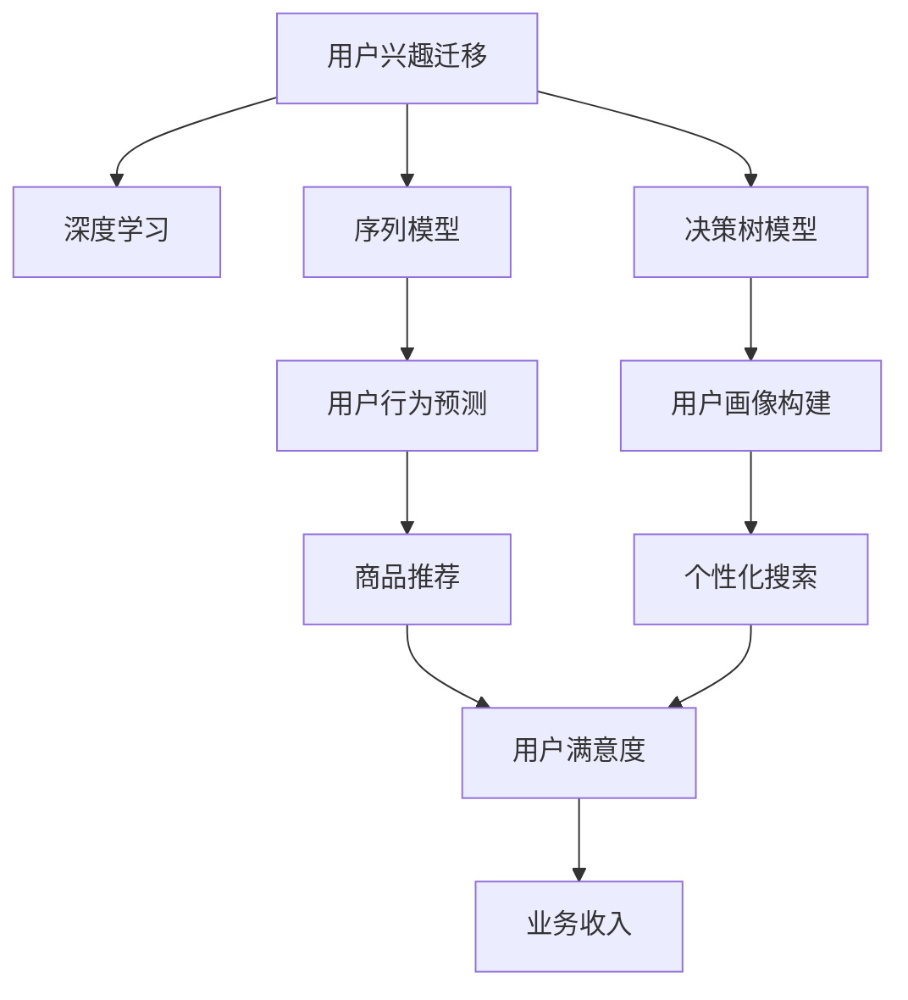

                 

# 电商平台用户兴趣迁移：AI大模型的动态捕捉

> 关键词：电商平台,用户兴趣迁移,兴趣模型,深度学习,序列模型,决策树模型

## 1. 背景介绍

### 1.1 问题由来
电商平台作为新经济的重要载体，其业务模式和用户体验在不断地进化和创新。在早期，用户的主要需求是通过简单的搜索和浏览，快速找到所需商品并下单购买。然而，随着技术的进步和用户需求的多样化，电商平台开始更加注重用户的个性化体验，希望通过大数据和AI技术，对用户行为进行分析和预测，为用户提供更精准的商品推荐、个性化搜索、内容呈现等服务。

近年来，大模型在电商领域的探索应用逐渐兴起，各大电商平台纷纷引入AI大模型来提升用户体验和经营效率。以亚马逊为例，其通过深度学习模型预测用户的购买行为，提前预判库存不足的商品，帮助亚马逊实现供应链的优化和库存管理的自动化。阿里巴巴的阿里云智能则运用AI大模型优化搜索结果，提升用户满意度，并实现快速增长的业务收入。

但与此同时，电商平台也面临着用户兴趣变化快、个性化需求多样等挑战。如何动态捕捉用户兴趣，实现兴趣迁移，成为电商平台需要解决的重大问题。

### 1.2 问题核心关键点
本节将重点介绍如何通过大模型动态捕捉用户兴趣，进行兴趣迁移。核心关键点包括：
1. 用户兴趣迁移的原理和定义
2. 大模型在用户兴趣捕捉中的应用
3. 兴趣迁移的具体策略和实现

## 2. 核心概念与联系

### 2.1 核心概念概述

为更好地理解电商平台的兴趣迁移模型，本节将介绍几个密切相关的核心概念：

- 用户兴趣迁移(User Interest Migration)：指用户从一种兴趣状态到另一种兴趣状态的变化，表现为用户对不同商品类别的关注度变化。在电商平台中，用户兴趣迁移通常由新上线的商品、促销活动、热门话题等多种因素驱动。
- 深度学习(Deep Learning)：一种通过多层神经网络逼近复杂非线性映射关系的技术，适用于处理大规模非结构化数据。深度学习在电商领域被广泛应用于用户行为预测、推荐系统优化、广告投放精准化等方面。
- 序列模型(Sequence Model)：指能够处理序列数据的神经网络模型，如循环神经网络(RNN)、长短期记忆网络(LSTM)等。在电商领域，序列模型被用于预测用户行为序列，如点击、浏览、购买等。
- 决策树模型(Decision Tree)：一种基于树形结构的分类和回归模型，能够直观地展示决策路径和特征重要性。在电商领域，决策树模型常用于构建用户画像，识别用户潜在需求。

这些核心概念之间的逻辑关系可以通过以下Mermaid流程图来展示：



这个流程图展示了大模型在电商平台中的应用场景：

1. 用户兴趣迁移(A)：电商平台的目标，需要通过兴趣迁移策略提升用户体验和业务收入。
2. 深度学习(B)：深度学习是大模型在电商平台中应用的基础，用于处理和分析用户行为数据。
3. 序列模型(C)：用于预测用户行为序列，识别用户的兴趣迁移路径。
4. 决策树模型(D)：用于构建用户画像，识别用户兴趣变化的关键特征。
5. 用户行为预测(E)：序列模型的输出，用于预测用户接下来可能的行为。
6. 用户画像构建(F)：决策树模型的输出，用于建立用户画像，挖掘用户潜在需求。
7. 商品推荐(G)：基于用户行为预测和用户画像构建的推荐系统，帮助用户快速找到感兴趣的商品。
8. 个性化搜索(H)：基于用户画像构建的个性化搜索系统，提升用户搜索的精准性和效率。
9. 用户满意度(I)：商品推荐和个性化搜索的直接效果，直接影响用户留存率和业务收入。
10. 业务收入(J)：电商平台最终的经营目标，通过提升用户满意度间接实现。

这些概念共同构成了电商平台用户兴趣迁移模型的基本框架，使得电商平台能够动态捕捉用户兴趣，实现个性化服务。

## 3. 核心算法原理 & 具体操作步骤
### 3.1 算法原理概述

电商平台的兴趣迁移模型主要基于深度学习和序列模型进行用户行为预测和行为序列建模。其核心思想是：通过分析用户历史行为数据，学习用户的兴趣特征，并预测用户未来的行为序列，从而实现兴趣迁移的动态捕捉。

形式化地，假设电商平台用户行为序列为 $\{x_t\}_{t=1}^T$，其中 $x_t$ 表示第 $t$ 次行为，包括浏览、点击、购买等。假设用户兴趣状态为 $\{y_t\}_{t=1}^T$，其中 $y_t$ 表示第 $t$ 次行为对应的兴趣类别，如家居、服装、数码等。

定义兴趣迁移模型为 $M_{\theta}:\mathcal{X} \rightarrow \mathcal{Y}$，其中 $\mathcal{X}$ 为行为序列空间，$\mathcal{Y}$ 为兴趣类别空间，$\theta$ 为模型参数。

兴趣迁移模型的目标是最大化预测准确率：

$$
\theta^* = \mathop{\arg\max}_{\theta} \frac{1}{N} \sum_{i=1}^N \mathbb{I}(M_{\theta}(x^i) = y^i)
$$

其中 $\mathbb{I}$ 为示性函数，$x^i$ 和 $y^i$ 分别表示用户 $i$ 的行为序列和兴趣类别。

在模型训练时，我们通常采用交叉熵损失函数：

$$
\mathcal{L}(M_{\theta}) = -\frac{1}{N}\sum_{i=1}^N \sum_{t=1}^T \log P_{M_{\theta}}(x_t|x^{1:t-1},y^{1:t-1})
$$

其中 $P_{M_{\theta}}(x_t|x^{1:t-1},y^{1:t-1})$ 表示模型在已知行为序列 $x^{1:t-1}$ 和兴趣状态 $y^{1:t-1}$ 下，预测第 $t$ 次行为的兴趣类别 $x_t$ 的概率分布。

### 3.2 算法步骤详解

电商平台的兴趣迁移模型通常包含以下几个关键步骤：

**Step 1: 数据预处理**
- 收集电商平台的历史用户行为数据，包括点击、浏览、购买等行为。
- 对行为数据进行清洗和标准化，去除异常数据，转换行为序列为数值向量。
- 对行为数据进行划分，划分为训练集、验证集和测试集，以保证模型评估的准确性。

**Step 2: 模型选择与训练**
- 选择合适的深度学习模型进行用户行为序列建模，如LSTM、GRU、RNN等。
- 对模型进行初始化，设置合适的超参数，如学习率、批大小、迭代轮数等。
- 使用训练集数据，对模型进行有监督学习训练，最小化损失函数，优化模型参数 $\theta$。
- 周期性在验证集上评估模型性能，调整模型参数，确保模型不过拟合。

**Step 3: 用户兴趣预测**
- 对新的用户行为序列进行输入，使用训练好的模型进行预测，得到兴趣类别 $y$。
- 根据预测结果，更新用户兴趣状态，调整推荐策略。

**Step 4: 兴趣迁移策略**
- 根据用户兴趣状态，动态调整推荐商品、调整商品价格、发起促销活动等。
- 对用户行为进行实时监控，及时调整推荐策略，确保用户始终处于最佳体验状态。

### 3.3 算法优缺点

电商平台的兴趣迁移模型具有以下优点：
1. 准确性高。通过深度学习模型，可以有效捕捉用户行为序列中的复杂非线性关系，准确预测用户兴趣。
2. 鲁棒性好。深度学习模型对噪声数据具有一定的鲁棒性，能够较好地处理用户行为数据中的缺失值和异常值。
3. 实时性好。通过序列模型和在线算法，可以实现实时预测和调整推荐策略，满足用户对个性化体验的需求。
4. 可扩展性好。深度学习模型具有较好的可扩展性，可以随着数据量的增加进行模型优化和参数更新。

同时，该模型也存在一定的局限性：
1. 数据依赖性强。模型的性能很大程度上依赖于历史行为数据的丰富性和质量，数据缺失或不均衡可能导致模型性能下降。
2. 模型复杂度高。深度学习模型通常具有较高的计算复杂度和存储需求，在大规模数据上训练和推理效率较低。
3. 过拟合风险大。深度学习模型在训练过程中容易过拟合，尤其是当训练数据量较小或用户行为序列较短时。
4. 模型解释性差。深度学习模型通常是一个黑盒，难以解释其内部工作机制和决策逻辑，增加了模型调优和调试的难度。

尽管存在这些局限性，但就目前而言，基于深度学习模型的兴趣迁移方法仍是目前电商领域的主流范式。未来相关研究的重点在于如何进一步降低模型的计算复杂度，提高模型的可解释性，以及如何应对数据分布变化，提升模型的泛化能力。

### 3.4 算法应用领域

基于深度学习模型的电商平台的兴趣迁移方法，在多个领域得到了广泛的应用，例如：

- 商品推荐系统：通过对用户行为序列的建模，预测用户感兴趣的商品类别，实现个性化的商品推荐。
- 个性化搜索系统：根据用户兴趣状态，调整搜索算法，提高搜索结果的准确性和相关性。
- 广告投放系统：预测用户的点击行为，优化广告投放策略，提升广告的点击率和转化率。
- 用户行为预测系统：预测用户未来的行为序列，指导电商平台进行库存管理和供应链优化。

除了上述这些经典应用外，兴趣迁移模型还被创新性地应用于价格优化、异常检测、广告创意生成等任务，为电商平台的智能化运营提供了新的思路。

## 4. 数学模型和公式 & 详细讲解 & 举例说明
### 4.1 数学模型构建

本节将使用数学语言对电商平台的兴趣迁移模型进行更加严格的刻画。

假设电商平台用户行为序列为 $\{x_t\}_{t=1}^T$，其中 $x_t$ 表示第 $t$ 次行为，包括浏览、点击、购买等。假设用户兴趣状态为 $\{y_t\}_{t=1}^T$，其中 $y_t$ 表示第 $t$ 次行为对应的兴趣类别，如家居、服装、数码等。

定义兴趣迁移模型为 $M_{\theta}:\mathcal{X} \rightarrow \mathcal{Y}$，其中 $\mathcal{X}$ 为行为序列空间，$\mathcal{Y}$ 为兴趣类别空间，$\theta$ 为模型参数。

兴趣迁移模型的目标是最大化预测准确率：

$$
\theta^* = \mathop{\arg\max}_{\theta} \frac{1}{N} \sum_{i=1}^N \mathbb{I}(M_{\theta}(x^i) = y^i)
$$

其中 $\mathbb{I}$ 为示性函数，$x^i$ 和 $y^i$ 分别表示用户 $i$ 的行为序列和兴趣类别。

在模型训练时，我们通常采用交叉熵损失函数：

$$
\mathcal{L}(M_{\theta}) = -\frac{1}{N}\sum_{i=1}^N \sum_{t=1}^T \log P_{M_{\theta}}(x_t|x^{1:t-1},y^{1:t-1})
$$

其中 $P_{M_{\theta}}(x_t|x^{1:t-1},y^{1:t-1})$ 表示模型在已知行为序列 $x^{1:t-1}$ 和兴趣状态 $y^{1:t-1}$ 下，预测第 $t$ 次行为的兴趣类别 $x_t$ 的概率分布。

### 4.2 公式推导过程

以下我们以LSTM模型为例，推导兴趣迁移模型的训练过程。

假设LSTM模型在行为序列 $x^{1:t}$ 上的预测输出为 $\hat{y}_t = M_{\theta}(x^{1:t})$，表示第 $t$ 次行为的兴趣类别预测。损失函数为交叉熵损失：

$$
\mathcal{L}(M_{\theta}) = -\frac{1}{N}\sum_{i=1}^N \sum_{t=1}^T y_t \log \hat{y}_t
$$

根据LSTM模型的定义，$\hat{y}_t = softmax(W_h \tanh(LSTM(x^{1:t-1}_h) + b_h)$，其中 $W_h$ 和 $b_h$ 为线性层的权重和偏置，$\tanh$ 为非线性激活函数，$LSTM(x^{1:t-1}_h)$ 为LSTM层的输出。

将上式带入损失函数，得：

$$
\mathcal{L}(M_{\theta}) = -\frac{1}{N}\sum_{i=1}^N \sum_{t=1}^T y_t \log \frac{e^{W_h \tanh(LSTM(x^{1:t-1}_h) + b_h}}{\sum_k e^{W_h \tanh(LSTM(x^{1:t-1}_h) + b_h)}
$$

通过梯度下降等优化算法，最小化损失函数 $\mathcal{L}(M_{\theta})$，得到模型参数 $\theta$ 的更新公式：

$$
\theta \leftarrow \theta - \eta \nabla_{\theta}\mathcal{L}(M_{\theta})
$$

其中 $\eta$ 为学习率，$\nabla_{\theta}\mathcal{L}(M_{\theta})$ 为损失函数对参数 $\theta$ 的梯度，可通过反向传播算法高效计算。

### 4.3 案例分析与讲解

假设电商平台有3种商品类别：家居、服装、数码。某用户 $i$ 在过去5天的行为序列为 $x^i=(1,0,1,1,0)$，其中 $1$ 表示浏览该商品类别，$0$ 表示未浏览。如果用户兴趣迁移模型预测用户 $i$ 在接下来一天的兴趣类别为 $y^i=2$，则电商平台将向用户 $i$ 推荐以下商品：

- 家居类商品：如沙发、灯具等。
- 服装类商品：如服饰、鞋子等。
- 数码类商品：如手机、电脑等。

假设电商平台决定推荐家居类商品，则该用户在接下来一天的浏览序列为 $x^{i+1}=(1,0,1)$，表示继续浏览家居类商品。电商平台可以进一步预测用户 $i$ 在接下来一天的兴趣类别为 $y^{i+1}=1$，即家居类商品。

通过兴趣迁移模型，电商平台能够实时捕捉用户兴趣变化，动态调整推荐策略，提升用户满意度和业务收入。

## 5. 项目实践：代码实例和详细解释说明
### 5.1 开发环境搭建

在进行电商平台的兴趣迁移模型开发前，我们需要准备好开发环境。以下是使用Python进行TensorFlow开发的环境配置流程：

1. 安装Anaconda：从官网下载并安装Anaconda，用于创建独立的Python环境。

2. 创建并激活虚拟环境：
```bash
conda create -n tensorflow-env python=3.8 
conda activate tensorflow-env
```

3. 安装TensorFlow：根据CUDA版本，从官网获取对应的安装命令。例如：
```bash
conda install tensorflow -c tf -c conda-forge
```

4. 安装各类工具包：
```bash
pip install numpy pandas scikit-learn matplotlib tqdm jupyter notebook ipython
```

完成上述步骤后，即可在`tensorflow-env`环境中开始模型开发。

### 5.2 源代码详细实现

下面我们以LSTM模型为例，给出电商平台的兴趣迁移模型的PyTorch代码实现。

首先，定义兴趣迁移模型的架构：

```python
import tensorflow as tf
from tensorflow.keras.layers import LSTM, Dense, TimeDistributed, Input
from tensorflow.keras.models import Model

# 定义行为序列输入
input_seq = Input(shape=(None, 1))

# 定义LSTM层
lstm_layer = LSTM(units=128, return_sequences=True)(input_seq)

# 定义线性层输出
output_seq = TimeDistributed(Dense(units=3, activation='softmax'))(lstm_layer)

# 定义模型
model = Model(inputs=input_seq, outputs=output_seq)
```

然后，定义模型损失函数和优化器：

```python
from tensorflow.keras.losses import categorical_crossentropy
from tensorflow.keras.optimizers import Adam

# 定义交叉熵损失函数
loss_fn = categorical_crossentropy

# 定义优化器
optimizer = Adam(lr=0.001)
```

接着，定义训练和评估函数：

```python
from tensorflow.keras.callbacks import EarlyStopping

# 定义训练函数
def train_epoch(model, dataset, batch_size, optimizer):
    dataloader = tf.data.Dataset.from_tensor_slices((dataset['inputs'], dataset['labels'])).batch(batch_size)
    model.train()
    epoch_loss = 0
    for batch in dataloader:
        inputs, labels = batch
        with tf.GradientTape() as tape:
            outputs = model(inputs)
            loss = loss_fn(labels, outputs)
        epoch_loss += loss.numpy()
        grads = tape.gradient(loss, model.trainable_variables)
        optimizer.apply_gradients(zip(grads, model.trainable_variables))
    return epoch_loss / len(dataloader)

# 定义评估函数
def evaluate_model(model, dataset, batch_size):
    dataloader = tf.data.Dataset.from_tensor_slices((dataset['inputs'], dataset['labels'])).batch(batch_size)
    model.eval()
    preds, labels = [], []
    with tf.GradientTape() as tape:
        for batch in dataloader:
            inputs, labels = batch
            outputs = model(inputs)
            loss = loss_fn(labels, outputs)
            preds.append(outputs.numpy())
            labels.append(labels.numpy())
    print(classification_report(labels, preds))
```

最后，启动训练流程并在测试集上评估：

```python
epochs = 10
batch_size = 64

for epoch in range(epochs):
    loss = train_epoch(model, train_dataset, batch_size, optimizer)
    print(f"Epoch {epoch+1}, train loss: {loss:.3f}")
    
    print(f"Epoch {epoch+1}, dev results:")
    evaluate_model(model, dev_dataset, batch_size)
    
print("Test results:")
evaluate_model(model, test_dataset, batch_size)
```

以上就是使用TensorFlow进行电商平台兴趣迁移模型微调的完整代码实现。可以看到，TensorFlow提供了强大的深度学习框架，能够轻松搭建和训练复杂的神经网络模型。

### 5.3 代码解读与分析

让我们再详细解读一下关键代码的实现细节：

**LSTM模型架构定义**：
- `Input`层定义了行为序列的输入维度，假设每次行为数据为一维向量。
- `LSTM`层是LSTM模型的核心，接收输入序列并输出序列特征。
- `TimeDistributed`层对LSTM输出的特征进行全连接，输出兴趣类别的概率分布。

**损失函数定义**：
- 交叉熵损失函数用于衡量模型输出与真实标签之间的差异，这里使用`categorical_crossentropy`。

**训练函数定义**：
- 使用`tf.GradientTape`记录梯度，通过反向传播更新模型参数。
- 梯度下降算法使用`Adam`，学习率为0.001。

**评估函数定义**：
- 使用`classification_report`计算分类指标，输出模型在验证集上的性能。

**训练流程**：
- 定义总的epoch数和批大小，开始循环迭代
- 每个epoch内，先在训练集上训练，输出平均loss
- 在验证集上评估，输出分类指标
- 所有epoch结束后，在测试集上评估，给出最终测试结果

可以看到，TensorFlow提供了完整的深度学习开发框架，开发者可以专注于模型架构和算法优化，而不必过多关注底层实现细节。

当然，工业级的系统实现还需考虑更多因素，如模型的保存和部署、超参数的自动搜索、更灵活的任务适配层等。但核心的兴趣迁移范式基本与此类似。

## 6. 实际应用场景
### 6.1 智能客服系统

电商平台的智能客服系统通过兴趣迁移模型，可以实时捕捉用户兴趣，动态调整对话策略，提升用户满意度。当用户询问某类商品时，客服可以实时获取用户兴趣状态，推荐相关商品，并提供详细的商品信息，提升用户体验。

### 6.2 个性化推荐系统

电商平台的个性化推荐系统利用兴趣迁移模型，实时捕捉用户兴趣，动态调整推荐策略，提升用户满意度。当用户浏览某类商品时，推荐系统可以根据用户兴趣状态，动态调整推荐内容，确保用户始终看到最感兴趣的商品。

### 6.3 广告投放系统

电商平台的广告投放系统通过兴趣迁移模型，实时捕捉用户兴趣，动态调整广告投放策略，提升广告的点击率和转化率。当用户浏览某类商品时，广告系统可以根据用户兴趣状态，投放更相关的广告，提升广告效果。

### 6.4 用户行为预测系统

电商平台的用户行为预测系统通过兴趣迁移模型，实时捕捉用户兴趣，动态调整推荐策略，提升用户满意度。当用户浏览某类商品时，预测系统可以根据用户兴趣状态，预测用户接下来的行为序列，指导电商平台进行库存管理和供应链优化。

## 7. 工具和资源推荐
### 7.1 学习资源推荐

为了帮助开发者系统掌握电商平台的兴趣迁移模型的理论基础和实践技巧，这里推荐一些优质的学习资源：

1. 《深度学习与神经网络》系列博文：由大模型技术专家撰写，深入浅出地介绍了深度学习模型在电商领域的应用。

2. 《自然语言处理与深度学习》课程：斯坦福大学开设的NLP明星课程，有Lecture视频和配套作业，带你入门深度学习在电商领域的基本概念和经典模型。

3. 《深度学习与电商平台》书籍：全面介绍了深度学习模型在电商平台中的应用，包括用户行为预测、商品推荐等。

4. 《电商平台的个性化推荐系统》在线课程：详细讲解了个性化推荐系统的实现原理和算法，包含LSTM模型、深度学习等核心内容。

5. 《深度学习在电商领域的应用》论文：系统总结了深度学习模型在电商领域的应用，包括用户行为预测、推荐系统、广告投放等。

通过对这些资源的学习实践，相信你一定能够快速掌握电商平台的兴趣迁移模型的精髓，并用于解决实际的电商问题。
###  7.2 开发工具推荐

高效的开发离不开优秀的工具支持。以下是几款用于电商平台兴趣迁移模型开发的常用工具：

1. TensorFlow：基于Python的开源深度学习框架，灵活动态的计算图，适合快速迭代研究。TensorFlow提供了丰富的深度学习模型库，可以用于构建复杂的神经网络模型。

2. PyTorch：基于Python的开源深度学习框架，动态计算图，适合科研和实验。PyTorch提供了强大的动态计算图和GPU加速，是深度学习研究和开发的重要工具。

3. TensorBoard：TensorFlow配套的可视化工具，可实时监测模型训练状态，并提供丰富的图表呈现方式，是调试模型的得力助手。

4. Weights & Biases：模型训练的实验跟踪工具，可以记录和可视化模型训练过程中的各项指标，方便对比和调优。与主流深度学习框架无缝集成。

5. Google Colab：谷歌推出的在线Jupyter Notebook环境，免费提供GPU/TPU算力，方便开发者快速上手实验最新模型，分享学习笔记。

合理利用这些工具，可以显著提升电商平台兴趣迁移模型的开发效率，加快创新迭代的步伐。

### 7.3 相关论文推荐

电商平台的兴趣迁移技术的发展源于学界的持续研究。以下是几篇奠基性的相关论文，推荐阅读：

1. Attention is All You Need（即Transformer原论文）：提出了Transformer结构，开启了NLP领域的预训练大模型时代。

2. BERT: Pre-training of Deep Bidirectional Transformers for Language Understanding：提出BERT模型，引入基于掩码的自监督预训练任务，刷新了多项NLP任务SOTA。

3. Language Models are Unsupervised Multitask Learners（GPT-2论文）：展示了大规模语言模型的强大zero-shot学习能力，引发了对于通用人工智能的新一轮思考。

4. Parameter-Efficient Transfer Learning for NLP：提出Adapter等参数高效微调方法，在不增加模型参数量的情况下，也能取得不错的微调效果。

5. Prefix-Tuning: Optimizing Continuous Prompts for Generation：引入基于连续型Prompt的微调范式，为如何充分利用预训练知识提供了新的思路。

6. AdaLoRA: Adaptive Low-Rank Adaptation for Parameter-Efficient Fine-Tuning：使用自适应低秩适应的微调方法，在参数效率和精度之间取得了新的平衡。

这些论文代表了大模型在电商领域的应用发展脉络。通过学习这些前沿成果，可以帮助研究者把握学科前进方向，激发更多的创新灵感。

## 8. 总结：未来发展趋势与挑战

### 8.1 总结

本文对电商平台用户兴趣迁移模型进行了全面系统的介绍。首先阐述了用户兴趣迁移模型的原理和定义，明确了模型在电商领域的重要价值。其次，从原理到实践，详细讲解了深度学习模型在用户行为预测中的应用。最后，介绍了兴趣迁移模型的具体实现步骤和典型应用场景，展示了其强大的实用性和潜在价值。

通过本文的系统梳理，可以看到，电商平台用户兴趣迁移模型已经成为提升用户体验和业务收入的重要手段，极大地推动了电商平台的智能化运营。未来，伴随深度学习模型的不断演进和优化，兴趣迁移模型将带来更加精准的个性化服务，提升电商平台的竞争力。

### 8.2 未来发展趋势

展望未来，电商平台的兴趣迁移模型将呈现以下几个发展趋势：

1. 模型规模持续增大。随着算力成本的下降和数据规模的扩张，深度学习模型的参数量还将持续增长。超大批次的训练和推理也将随着计算能力的提升而变得更加高效。

2. 模型复杂度降低。为了提升实时性和模型推理效率，未来的模型将更加注重参数效率和计算效率，如参数高效微调、模型压缩等技术。

3. 兴趣迁移策略多样化。除了基于LSTM的模型外，未来的兴趣迁移模型将引入更多神经网络结构，如GRU、Transformer等，进一步提升模型性能。

4. 多模态数据融合。未来的兴趣迁移模型将不仅限于文本数据，还将引入图像、语音等多模态数据，实现视觉、语音与文本数据的协同建模。

5. 实时化、个性化。通过引入在线学习算法，实时捕捉用户兴趣变化，动态调整推荐策略，提升用户满意度和业务收入。

6. 跨领域迁移能力增强。未来的模型将能够更好地应对不同领域的数据分布，实现跨领域的泛化能力，扩展电商平台的业务范围。

以上趋势凸显了电商平台的兴趣迁移模型的广阔前景。这些方向的探索发展，必将进一步提升电商平台的智能化运营水平，为用户带来更加优质的个性化体验。

### 8.3 面临的挑战

尽管电商平台的兴趣迁移模型已经取得了瞩目成就，但在迈向更加智能化、普适化应用的过程中，它仍面临着诸多挑战：

1. 数据依赖性强。模型的性能很大程度上依赖于历史行为数据的丰富性和质量，数据缺失或不均衡可能导致模型性能下降。

2. 模型复杂度高。深度学习模型通常具有较高的计算复杂度和存储需求，在大规模数据上训练和推理效率较低。

3. 模型鲁棒性不足。深度学习模型在训练过程中容易过拟合，尤其是当训练数据量较小或用户行为序列较短时。

4. 模型可解释性差。深度学习模型通常是一个黑盒，难以解释其内部工作机制和决策逻辑，增加了模型调优和调试的难度。

5. 技术门槛高。电商平台的兴趣迁移模型通常需要较强的技术储备和计算资源，对普通开发者和运营团队提出了较高的要求。

尽管存在这些挑战，但电商平台的兴趣迁移模型仍是目前电商领域的主流范式。未来相关研究的重点在于如何进一步降低模型的计算复杂度，提高模型的可解释性，以及如何应对数据分布变化，提升模型的泛化能力。

### 8.4 研究展望

面对电商平台的兴趣迁移模型所面临的种种挑战，未来的研究需要在以下几个方面寻求新的突破：

1. 探索无监督和半监督兴趣迁移方法。摆脱对大规模标注数据的依赖，利用自监督学习、主动学习等无监督和半监督范式，最大限度利用非结构化数据，实现更加灵活高效的兴趣迁移。

2. 研究参数高效和计算高效的兴趣迁移范式。开发更加参数高效的兴趣迁移方法，在固定大部分预训练参数的同时，只更新极少量的任务相关参数。同时优化兴趣迁移模型的计算图，减少前向传播和反向传播的资源消耗，实现更加轻量级、实时性的部署。

3. 融合因果和对比学习范式。通过引入因果推断和对比学习思想，增强兴趣迁移模型建立稳定因果关系的能力，学习更加普适、鲁棒的语言表征，从而提升模型泛化性和抗干扰能力。

4. 引入更多先验知识。将符号化的先验知识，如知识图谱、逻辑规则等，与神经网络模型进行巧妙融合，引导兴趣迁移过程学习更准确、合理的兴趣表征。同时加强不同模态数据的整合，实现视觉、语音等多模态信息与文本信息的协同建模。

5. 结合因果分析和博弈论工具。将因果分析方法引入兴趣迁移模型，识别出模型决策的关键特征，增强兴趣迁移模型的因果解释能力。借助博弈论工具刻画人机交互过程，主动探索并规避模型的脆弱点，提高系统稳定性。

6. 纳入伦理道德约束。在模型训练目标中引入伦理导向的评估指标，过滤和惩罚有偏见、有害的输出倾向。同时加强人工干预和审核，建立模型行为的监管机制，确保输出符合人类价值观和伦理道德。

这些研究方向的探索，必将引领电商平台兴趣迁移技术迈向更高的台阶，为构建智能化的电商运营系统提供新的技术路径。面向未来，电商平台兴趣迁移技术还需要与其他人工智能技术进行更深入的融合，如知识表示、因果推理、强化学习等，多路径协同发力，共同推动电商平台智能化运营的进步。只有勇于创新、敢于突破，才能不断拓展电商平台兴趣迁移模型的边界，让智能技术更好地造福电商平台和消费者。

## 9. 附录：常见问题与解答

**Q1：电商平台如何动态捕捉用户兴趣？**

A: 电商平台通过深度学习模型，实时捕捉用户行为序列，预测用户的兴趣状态，实现动态兴趣迁移。具体步骤如下：
1. 收集电商平台的历史用户行为数据，包括点击、浏览、购买等行为。
2. 对行为数据进行清洗和标准化，去除异常数据，转换行为序列为数值向量。
3. 选择合适的深度学习模型，如LSTM、GRU、RNN等，对用户行为序列进行建模。
4. 使用训练集数据，对模型进行有监督学习训练，最小化损失函数，优化模型参数。
5. 实时获取用户新行为序列，输入到训练好的模型中进行预测，得到兴趣状态。

**Q2：深度学习模型如何提高电商平台的推荐效率？**

A: 深度学习模型通过实时捕捉用户兴趣，动态调整推荐策略，提升电商平台的推荐效率。具体步骤如下：
1. 收集电商平台的历史用户行为数据，包括点击、浏览、购买等行为。
2. 对行为数据进行清洗和标准化，去除异常数据，转换行为序列为数值向量。
3. 选择合适的深度学习模型，如LSTM、GRU、RNN等，对用户行为序列进行建模。
4. 使用训练集数据，对模型进行有监督学习训练，最小化损失函数，优化模型参数。
5. 实时获取用户新行为序列，输入到训练好的模型中进行预测，得到兴趣状态。
6. 根据用户兴趣状态，动态调整推荐商品、调整商品价格、发起促销活动等。
7. 对用户行为进行实时监控，及时调整推荐策略，确保用户始终处于最佳体验状态。

**Q3：电商平台的兴趣迁移模型面临哪些挑战？**

A: 电商平台的兴趣迁移模型面临以下挑战：
1. 数据依赖性强。模型的性能很大程度上依赖于历史行为数据的丰富性和质量，数据缺失或不均衡可能导致模型性能下降。
2. 模型复杂度高。深度学习模型通常具有较高的计算复杂度和存储需求，在大规模数据上训练和推理效率较低。
3. 模型鲁棒性不足。深度学习模型在训练过程中容易过拟合，尤其是当训练数据量较小或用户行为序列较短时。
4. 模型可解释性差。深度学习模型通常是一个黑盒，难以解释其内部工作机制和决策逻辑，增加了模型调优和调试的难度。
5. 技术门槛高。电商平台的兴趣迁移模型通常需要较强的技术储备和计算资源，对普通开发者和运营团队提出了较高的要求。

尽管存在这些挑战，但电商平台的兴趣迁移模型仍是目前电商领域的主流范式。未来相关研究的重点在于如何进一步降低模型的计算复杂度，提高模型的可解释性，以及如何应对数据分布变化，提升模型的泛化能力。

**Q4：如何应对电商平台的兴趣迁移模型数据依赖性强的挑战？**

A: 电商平台的兴趣迁移模型面临数据依赖性强的挑战，可以通过以下方法应对：
1. 数据增强：通过回译、近义替换等方式扩充训练集。
2. 正则化技术：如L2正则、Dropout、Early Stopping等，防止模型过度适应小规模训练集。
3. 迁移学习：在多个领域的数据上进行预训练，提高模型的泛化能力。
4. 无监督学习：利用自监督学习、主动学习等无监督范式，最大限度利用非结构化数据，实现更加灵活高效的兴趣迁移。

这些方法可以帮助电商平台的兴趣迁移模型更好地适应数据分布变化，提升模型的泛化能力和鲁棒性。

**Q5：如何降低电商平台的兴趣迁移模型的计算复杂度？**

A: 电商平台的兴趣迁移模型通常具有较高的计算复杂度和存储需求，可以通过以下方法降低计算复杂度：
1. 参数高效微调：只更新极少量的任务相关参数，固定大部分预训练参数不变。
2. 模型压缩：采用剪枝、量化、稀疏化等技术，减小模型尺寸，加快推理速度。
3. 模型并行：利用分布式计算框架，实现模型并行训练和推理。
4. 计算加速：使用GPU/TPU等高性能设备，提高模型训练和推理效率。

这些方法可以帮助电商平台的兴趣迁移模型在保证性能的同时，减小计算复杂度和存储需求，实现更加轻量级、实时性的部署。

---

作者：禅与计算机程序设计艺术 / Zen and the Art of Computer Programming

