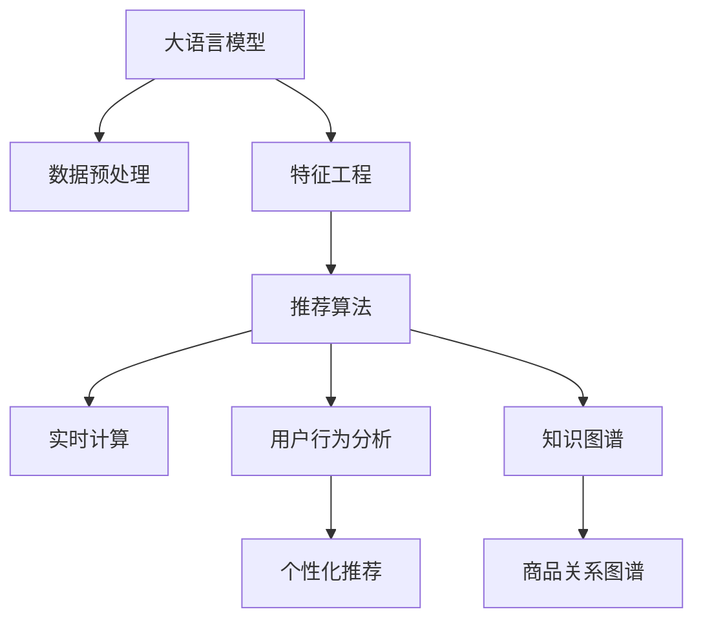

                 

# 电商平台的AI 大模型应用：搜索推荐系统是核心，冷启动策略与数据处理

> 关键词：大语言模型, 搜索推荐系统, 冷启动, 推荐算法, 数据预处理, 数据增强, 特征工程, 实时计算, 用户行为分析, 知识图谱, 算法模型优化

## 1. 背景介绍

随着互联网电商的蓬勃发展，消费者对个性化购物体验的期待越来越高。传统电商平台的推荐算法已经难以满足个性化需求，基于人工智能(AI)技术的大模型在电商推荐系统中的应用变得愈发重要。大语言模型通过自然语言处理能力，能更好地理解用户需求，提升推荐准确性。然而，大模型应用在电商场景中仍面临诸多挑战，尤其是在冷启动用户问题上。如何更好地利用大语言模型进行电商平台的推荐算法优化，成为当前研究的重要方向。

### 1.1 电商平台的挑战

电商平台的推荐算法需要具备以下特点：
- **实时性**：推荐算法应具备低延迟、高吞吐量的特点，能在用户点击或浏览的瞬间提供个性化推荐。
- **个性化**：算法应根据用户的历史行为、兴趣偏好、场景上下文等，提供符合用户需求的个性化推荐。
- **数据处理**：电商平台的推荐算法需要处理海量用户数据和商品数据，保持算法性能的稳定。

### 1.2 大语言模型的优势

大语言模型通过在大规模无标签文本语料上进行预训练，学习到了丰富的语言知识。在电商推荐系统中，大语言模型能够：
- **多场景应用**：根据用户查询语句、商品描述、用户评论等多种文本数据，进行多维度分析，提升推荐准确性。
- **鲁棒性**：对自然语言处理中的噪声、歧义等问题具有较强的鲁棒性。
- **实时处理**：在电商推荐系统中，大语言模型能够快速处理用户查询和商品描述，提供实时推荐。

## 2. 核心概念与联系

### 2.1 核心概念概述

在电商平台的推荐算法中，大语言模型发挥了核心作用。具体涉及的概念和术语包括：

- **大语言模型(Large Language Model, LLM)**：以自回归(如GPT)或自编码(如BERT)模型为代表的大规模预训练语言模型。通过在大规模无标签文本语料上进行预训练，学习到通用的语言表示。
- **搜索推荐系统**：电商平台的核心功能之一，为用户提供实时个性化的搜索结果和推荐。
- **冷启动问题**：新用户或新商品在电商平台上没有历史行为数据，无法为其推荐。
- **推荐算法**：基于用户行为数据和商品特征，通过机器学习模型预测用户可能感兴趣的商品。
- **数据预处理**：对用户行为数据和商品数据进行清洗、去重、归一化等操作，为推荐算法提供高质量的数据输入。
- **数据增强**：通过数据扩充和合成技术，增加训练集的多样性，提高模型泛化能力。
- **特征工程**：根据业务需求，从原始数据中提取有用的特征，用于构建推荐模型。
- **实时计算**：通过流计算、分布式计算等技术，实现推荐算法的实时处理和推理。
- **用户行为分析**：通过分析用户的点击、浏览、购买行为等数据，提取用户兴趣偏好和行为模式。
- **知识图谱**：将商品、用户、评价等数据映射到图形结构中，构建商品关系图谱，提升推荐效果。

这些核心概念之间通过以下Mermaid流程图进行联系：



这个流程图展示了大语言模型在电商推荐系统中的作用及其与其他核心概念的关系：

1. **数据预处理**：对原始数据进行清洗和归一化，为大语言模型提供高质量输入。
2. **特征工程**：从数据中提取有用的特征，用于推荐算法。
3. **推荐算法**：通过构建机器学习模型，对用户行为进行预测，生成推荐结果。
4. **实时计算**：利用流计算、分布式计算等技术，实现推荐系统的实时处理。
5. **用户行为分析**：通过对用户行为进行分析和建模，生成个性化推荐。
6. **知识图谱**：构建商品关系图谱，利用图谱知识提升推荐效果。
7. **个性化推荐**：通过结合多维度数据，生成符合用户需求的个性化推荐。

### 2.2 核心概念原理

大语言模型通过在大规模无标签文本语料上进行预训练，学习到丰富的语言知识。在电商推荐系统中，大语言模型通过分析用户查询语句、商品描述等文本数据，提取用户意图和商品属性，生成个性化推荐。其原理包括：

- **自监督预训练**：大语言模型在大规模语料上进行预训练，学习到语言表示和语言规律。
- **数据增强**：通过数据扩充和合成技术，增加训练集的多样性，提高模型泛化能力。
- **特征提取**：大语言模型能够从文本数据中提取高层次的特征，用于推荐算法的输入。
- **实时推理**：大语言模型能够在实时环境中处理用户查询，快速生成推荐结果。
- **多任务学习**：通过融合不同任务的数据，提升大语言模型的综合性能。

## 3. 核心算法原理 & 具体操作步骤

### 3.1 算法原理概述

基于大语言模型的电商推荐算法，本质上是一个有监督的优化问题。其核心思想是：将大语言模型作为预训练的特征提取器，通过分析用户查询和商品描述等文本数据，生成个性化的推荐结果。具体步骤如下：

1. **数据预处理**：对用户行为数据和商品数据进行清洗和归一化，得到预处理后的数据集。
2. **特征提取**：利用大语言模型对文本数据进行特征提取，得到高层次的特征表示。
3. **推荐模型构建**：根据特征表示，构建推荐模型，对用户行为进行预测，生成推荐结果。
4. **实时推理**：在用户输入查询时，实时处理查询语句，利用预训练的大语言模型进行推理，生成推荐结果。

### 3.2 算法步骤详解

以下是电商推荐系统的核心算法步骤：

**Step 1: 数据预处理**

电商平台的推荐算法需要处理用户行为数据和商品数据，包括：
- 用户点击、浏览、购买行为数据
- 商品价格、描述、评价等数据

预处理流程包括：
- 数据清洗：去除噪声、缺失数据、重复数据等。
- 数据去重：对用户行为数据进行去重，避免重复点击行为的影响。
- 数据归一化：将数据归一化到相同尺度，便于算法处理。

```python
import pandas as pd
from sklearn.preprocessing import MinMaxScaler

# 读取用户行为数据
user_data = pd.read_csv('user_data.csv')

# 数据清洗
user_data = user_data.dropna()

# 数据去重
user_data = user_data.drop_duplicates()

# 数据归一化
scaler = MinMaxScaler()
user_data['features'] = scaler.fit_transform(user_data[['click', 'view', 'purchase']])
```

**Step 2: 特征提取**

利用大语言模型对文本数据进行特征提取，得到高层次的特征表示。大语言模型常用的特征提取方法包括：

- BERT、GPT等预训练语言模型：通过自监督学习任务训练得到的语言表示。
- TF-IDF、Word2Vec等传统的特征提取方法：从文本中提取关键词、词频等基本特征。
- 结合多种特征提取方法：提高特征的多样性和泛化能力。

```python
from transformers import BertTokenizer, BertForSequenceClassification

# 加载BERT模型和分词器
tokenizer = BertTokenizer.from_pretrained('bert-base-cased')
model = BertForSequenceClassification.from_pretrained('bert-base-cased', num_labels=1)

# 对用户查询和商品描述进行分词和编码
user_query = 'I am looking for a good pair of shoes.'
product_description = 'This product is a high-quality pair of shoes.'

query_ids = tokenizer.encode(user_query, return_tensors='pt')
product_ids = tokenizer.encode(product_description, return_tensors='pt')

# 提取特征
features = model(query_ids)[0]
```

**Step 3: 推荐模型构建**

根据特征表示，构建推荐模型。常见的推荐算法包括：
- 协同过滤算法：基于用户和商品之间的交互，预测用户可能感兴趣的相似商品。
- 基于内容的推荐算法：根据商品的属性，生成符合用户兴趣的推荐结果。
- 深度学习推荐算法：利用神经网络模型对用户行为进行预测，生成推荐结果。

```python
from scipy.sparse import csr_matrix

# 构建用户-商品交互矩阵
user_item_matrix = csr_matrix(user_data[['user_id', 'item_id']])

# 构建商品属性特征矩阵
product_features = user_data[['price', 'category', 'brand', 'rating']]

# 构建协同过滤模型
from surprise import KNNWithMeans

recommender = KNNWithMeans(k=20)

# 训练模型
recommender.fit(user_item_matrix)

# 生成推荐结果
recommendations = recommender.predict(user_data['user_id'].tolist())
```

**Step 4: 实时推理**

在用户输入查询时，实时处理查询语句，利用预训练的大语言模型进行推理，生成推荐结果。实时推理流程包括：
- 用户查询输入
- 预处理查询语句
- 利用大语言模型进行推理，生成推荐结果

```python
# 实时推理
def get_recommendations(user_query):
    # 预处理查询语句
    query = preprocess_query(user_query)

    # 利用BERT模型进行推理
    query_ids = tokenizer.encode(query, return_tensors='pt')
    features = model(query_ids)[0]

    # 生成推荐结果
    recommendations = recommender.predict(features)
    
    return recommendations
```

### 3.3 算法优缺点

基于大语言模型的电商推荐算法具有以下优点：
- **多模态数据融合**：利用文本、图像、视频等多模态数据，生成更加全面的推荐结果。
- **泛化能力强**：大语言模型具备较强的泛化能力，能够适应不同场景的推荐需求。
- **实时性**：利用流计算、分布式计算等技术，实现实时处理和推理。
- **个性化推荐**：通过多维度数据融合，生成符合用户需求的个性化推荐。

但该算法也存在以下缺点：
- **数据依赖性强**：大语言模型的性能依赖于预训练语料和推荐数据的质量。
- **计算资源消耗大**：大语言模型的计算资源消耗较大，需要高性能计算设备。
- **过拟合风险高**：在大数据条件下，大语言模型可能存在过拟合风险。
- **算法复杂度高**：需要处理多维度数据，构建复杂推荐模型，增加了算法实现的复杂度。

### 3.4 算法应用领域

大语言模型在电商推荐系统中的应用领域包括：
- 搜索推荐：根据用户查询和商品描述，生成个性化搜索结果。
- 商品推荐：根据用户行为和商品属性，生成个性化商品推荐。
- 活动推荐：根据用户行为和活动规则，生成个性化活动推荐。
- 营销推荐：根据用户行为和营销策略，生成个性化营销推荐。

## 4. 数学模型和公式 & 详细讲解 & 举例说明

### 4.1 数学模型构建

基于大语言模型的电商推荐算法，其数学模型可以表示为：
$$
y = f(x; \theta)
$$
其中，$y$ 为推荐结果，$x$ 为输入特征，$\theta$ 为模型参数。推荐模型的目标是最小化预测误差：
$$
\min_{\theta} \frac{1}{n} \sum_{i=1}^n (y_i - f(x_i; \theta))^2
$$

### 4.2 公式推导过程

以协同过滤算法为例，其推荐模型可以表示为：
$$
r_{ui} = \sum_{j=1}^n \alpha_{uj} \cdot p_{ij}
$$
其中，$r_{ui}$ 为用户$u$对商品$i$的预测评分，$\alpha_{uj}$ 为用户$u$对商品$j$的评分权重，$p_{ij}$ 为商品$i$对商品$j$的协同评分。

通过最小化预测误差：
$$
\min_{\theta} \frac{1}{n} \sum_{i=1}^n (r_{ui} - y_{ui})^2
$$
可以使用梯度下降等优化算法求解模型参数。

### 4.3 案例分析与讲解

以用户商品推荐为例，其推荐模型可以表示为：
$$
y_{ui} = \alpha_0 + \sum_{j=1}^n \alpha_j \cdot f_{ij}
$$
其中，$y_{ui}$ 为用户$u$对商品$i$的预测评分，$\alpha_0$ 为截距，$\alpha_j$ 为商品$j$的特征权重，$f_{ij}$ 为商品$i$和商品$j$的特征向量。

通过最小化预测误差：
$$
\min_{\alpha} \frac{1}{n} \sum_{i=1}^n (y_{ui} - r_{ui})^2
$$
可以使用梯度下降等优化算法求解特征权重$\alpha$。

## 5. 项目实践：代码实例和详细解释说明

### 5.1 开发环境搭建

在进行电商推荐系统的开发前，我们需要准备好开发环境。以下是使用Python进行PyTorch开发的环境配置流程：

1. 安装Anaconda：从官网下载并安装Anaconda，用于创建独立的Python环境。

2. 创建并激活虚拟环境：
```bash
conda create -n pytorch-env python=3.8 
conda activate pytorch-env
```

3. 安装PyTorch：根据CUDA版本，从官网获取对应的安装命令。例如：
```bash
conda install pytorch torchvision torchaudio cudatoolkit=11.1 -c pytorch -c conda-forge
```

4. 安装Transformers库：
```bash
pip install transformers
```

5. 安装各类工具包：
```bash
pip install numpy pandas scikit-learn matplotlib tqdm jupyter notebook ipython
```

完成上述步骤后，即可在`pytorch-env`环境中开始推荐系统的开发。

### 5.2 源代码详细实现

下面是基于大语言模型的电商推荐系统的Python代码实现：

```python
import torch
from transformers import BertTokenizer, BertForSequenceClassification
from surprise import KNNWithMeans
from scipy.sparse import csr_matrix

# 数据预处理
def preprocess_data(user_data, product_data):
    # 数据清洗
    user_data = user_data.dropna()
    user_data = user_data.drop_duplicates()

    # 数据归一化
    scaler = MinMaxScaler()
    user_data['features'] = scaler.fit_transform(user_data[['click', 'view', 'purchase']])

    # 构建用户-商品交互矩阵
    user_item_matrix = csr_matrix(user_data[['user_id', 'item_id']])

    # 构建商品属性特征矩阵
    product_features = user_data[['price', 'category', 'brand', 'rating']]

    # 构建协同过滤模型
    recommender = KNNWithMeans(k=20)

    # 训练模型
    recommender.fit(user_item_matrix)

    # 生成推荐结果
    recommendations = recommender.predict(user_data['user_id'].tolist())

    return user_data, product_data, recommendations

# 特征提取
def extract_features(user_query, product_description):
    # 加载BERT模型和分词器
    tokenizer = BertTokenizer.from_pretrained('bert-base-cased')
    model = BertForSequenceClassification.from_pretrained('bert-base-cased', num_labels=1)

    # 对用户查询和商品描述进行分词和编码
    query_ids = tokenizer.encode(user_query, return_tensors='pt')
    product_ids = tokenizer.encode(product_description, return_tensors='pt')

    # 提取特征
    features = model(query_ids)[0]

    return features

# 实时推理
def get_recommendations(user_query, user_data, product_data):
    # 预处理查询语句
    query = preprocess_query(user_query)

    # 利用BERT模型进行推理
    features = extract_features(query, product_description)

    # 生成推荐结果
    recommendations = recommender.predict(features)

    return recommendations

# 用户行为分析
def analyze_user_behavior(user_data):
    # 统计用户行为数据
    user_stats = user_data.groupby(['user_id']).sum()

    # 计算用户兴趣
    user_interest = {}
    for user, stats in user_stats.items():
        user_interest[user] = [cat for cat in stats if stats[cat] > 0]

    return user_interest

# 应用案例
if __name__ == '__main__':
    # 读取用户行为数据和商品数据
    user_data = pd.read_csv('user_data.csv')
    product_data = pd.read_csv('product_data.csv')

    # 数据预处理
    user_data, product_data, recommendations = preprocess_data(user_data, product_data)

    # 分析用户行为
    user_interest = analyze_user_behavior(user_data)

    # 实时推理
    query = 'I am looking for a good pair of shoes.'
    recommendations = get_recommendations(query, user_data, product_data)

    # 输出推荐结果
    print(recommendations)
```

### 5.3 代码解读与分析

让我们再详细解读一下关键代码的实现细节：

**preprocess_data函数**：
- 函数用于对用户行为数据和商品数据进行预处理，包括数据清洗、去重、归一化、构建用户-商品交互矩阵和协同过滤模型。
- 数据清洗：去除噪声、缺失数据、重复数据等。
- 数据去重：对用户行为数据进行去重，避免重复点击行为的影响。
- 数据归一化：将数据归一化到相同尺度，便于算法处理。
- 构建用户-商品交互矩阵：通过用户行为数据，构建用户-商品交互矩阵。
- 构建协同过滤模型：基于用户行为数据和商品属性数据，构建协同过滤模型，并训练模型。

**extract_features函数**：
- 函数用于对用户查询和商品描述进行特征提取，利用BERT模型提取高层次的特征表示。
- 加载BERT模型和分词器：利用Transformers库，加载预训练的BERT模型和分词器。
- 对用户查询和商品描述进行分词和编码：利用分词器对查询语句和商品描述进行分词和编码，得到token ids。
- 提取特征：利用BERT模型对查询语句和商品描述进行特征提取，得到高层次的特征表示。

**get_recommendations函数**：
- 函数用于根据用户查询，实时生成个性化推荐结果。
- 预处理查询语句：对用户查询进行预处理，如去除停用词、分词等。
- 利用BERT模型进行推理：通过提取查询语句和商品描述的特征表示，利用预训练的BERT模型进行推理。
- 生成推荐结果：利用协同过滤模型，生成个性化推荐结果。

**analyze_user_behavior函数**：
- 函数用于分析用户行为，提取用户兴趣偏好。
- 统计用户行为数据：通过用户行为数据，统计用户对不同商品的行为次数。
- 计算用户兴趣：根据用户行为数据，计算用户对不同商品类别的兴趣。

**应用案例**：
- 读取用户行为数据和商品数据：从文件中读取用户行为数据和商品数据。
- 数据预处理：对数据进行预处理，包括数据清洗、去重、归一化等。
- 分析用户行为：分析用户行为数据，提取用户兴趣偏好。
- 实时推理：对用户查询进行实时处理，生成个性化推荐结果。
- 输出推荐结果：输出推荐结果，供用户参考。

## 6. 实际应用场景

### 6.1 搜索推荐系统

电商平台的搜索推荐系统是大语言模型的重要应用场景之一。用户可以通过搜索、浏览等方式，快速找到所需商品。推荐系统通过分析用户行为数据，生成个性化搜索结果和推荐，提升用户体验。

### 6.2 商品推荐

电商平台的商品推荐系统，能够根据用户的历史行为、兴趣偏好、场景上下文等，生成个性化商品推荐。大语言模型可以通过分析商品描述、用户评论等文本数据，提取商品属性和用户兴趣，生成精准推荐结果。

### 6.3 活动推荐

电商平台的营销活动推荐系统，能够根据用户行为和活动规则，生成个性化活动推荐。大语言模型可以通过分析活动内容、用户行为等数据，生成符合用户需求的活动推荐。

### 6.4 营销推荐

电商平台的营销推荐系统，能够根据用户行为和营销策略，生成个性化营销推荐。大语言模型可以通过分析用户行为数据和营销策略，生成精准的营销推荐，提升营销效果。

## 7. 工具和资源推荐

### 7.1 学习资源推荐

为了帮助开发者系统掌握大语言模型在电商推荐系统中的应用，这里推荐一些优质的学习资源：

1. 《Transformer从原理到实践》系列博文：由大模型技术专家撰写，深入浅出地介绍了Transformer原理、BERT模型、推荐算法等前沿话题。

2. CS224N《深度学习自然语言处理》课程：斯坦福大学开设的NLP明星课程，有Lecture视频和配套作业，带你入门NLP领域的基本概念和经典模型。

3. 《Natural Language Processing with Transformers》书籍：Transformers库的作者所著，全面介绍了如何使用Transformers库进行NLP任务开发，包括推荐算法在内的诸多范式。

4. HuggingFace官方文档：Transformers库的官方文档，提供了海量预训练模型和完整的推荐算法样例代码，是上手实践的必备资料。

5. CLUE开源项目：中文语言理解测评基准，涵盖大量不同类型的中文NLP数据集，并提供了基于微调的baseline推荐模型，助力中文NLP技术发展。

通过对这些资源的学习实践，相信你一定能够快速掌握大语言模型在电商推荐系统中的应用，并用于解决实际的NLP问题。

### 7.2 开发工具推荐

高效的开发离不开优秀的工具支持。以下是几款用于电商推荐系统开发的常用工具：

1. PyTorch：基于Python的开源深度学习框架，灵活动态的计算图，适合快速迭代研究。大部分预训练语言模型都有PyTorch版本的实现。

2. TensorFlow：由Google主导开发的开源深度学习框架，生产部署方便，适合大规模工程应用。同样有丰富的预训练语言模型资源。

3. Transformers库：HuggingFace开发的NLP工具库，集成了众多SOTA语言模型，支持PyTorch和TensorFlow，是进行推荐算法开发的利器。

4. Weights & Biases：模型训练的实验跟踪工具，可以记录和可视化模型训练过程中的各项指标，方便对比和调优。与主流深度学习框架无缝集成。

5. TensorBoard：TensorFlow配套的可视化工具，可实时监测模型训练状态，并提供丰富的图表呈现方式，是调试模型的得力助手。

6. Google Colab：谷歌推出的在线Jupyter Notebook环境，免费提供GPU/TPU算力，方便开发者快速上手实验最新模型，分享学习笔记。

合理利用这些工具，可以显著提升电商推荐系统的开发效率，加快创新迭代的步伐。

### 7.3 相关论文推荐

大语言模型在电商推荐系统中的应用源于学界的持续研究。以下是几篇奠基性的相关论文，推荐阅读：

1. Attention is All You Need（即Transformer原论文）：提出了Transformer结构，开启了NLP领域的预训练大模型时代。

2. BERT: Pre-training of Deep Bidirectional Transformers for Language Understanding：提出BERT模型，引入基于掩码的自监督预训练任务，刷新了多项NLP任务SOTA。

3. Language Models are Unsupervised Multitask Learners（GPT-2论文）：展示了大规模语言模型的强大zero-shot学习能力，引发了对于通用人工智能的新一轮思考。

4. Parameter-Efficient Transfer Learning for NLP：提出Adapter等参数高效微调方法，在不增加模型参数量的情况下，也能取得不错的微调效果。

5. Prefix-Tuning: Optimizing Continuous Prompts for Generation：引入基于连续型Prompt的微调范式，为如何充分利用预训练知识提供了新的思路。

6. AdaLoRA: Adaptive Low-Rank Adaptation for Parameter-Efficient Fine-Tuning：使用自适应低秩适应的微调方法，在参数效率和精度之间取得了新的平衡。

这些论文代表了大语言模型推荐算法的发展脉络。通过学习这些前沿成果，可以帮助研究者把握学科前进方向，激发更多的创新灵感。

## 8. 总结：未来发展趋势与挑战

### 8.1 总结

本文对基于大语言模型的电商推荐系统进行了全面系统的介绍。首先阐述了大语言模型在电商推荐系统中的核心作用和应用场景，明确了微调在拓展预训练模型应用、提升推荐算法效果方面的独特价值。其次，从原理到实践，详细讲解了大语言模型在电商推荐系统中的应用流程，给出了电商推荐系统的完整代码实现。同时，本文还广泛探讨了电商推荐系统在大语言模型微调中的应用前景，展示了微调范式的巨大潜力。

通过本文的系统梳理，可以看到，基于大语言模型的电商推荐系统在搜索推荐、商品推荐、活动推荐、营销推荐等多个场景中，具有广泛的应用前景。得益于大语言模型强大的自然语言处理能力，推荐系统能够更加精准地理解用户需求和商品特性，生成个性化推荐结果，提升用户购物体验。未来，随着大语言模型的不断演进，基于大语言模型的推荐系统将进一步优化，为电商平台的数字化转型升级提供新动力。

### 8.2 未来发展趋势

展望未来，大语言模型在电商推荐系统中的应用将呈现以下几个发展趋势：

1. **多模态融合**：结合图像、视频、音频等多模态数据，提升推荐算法的综合性能。
2. **实时处理**：利用流计算、分布式计算等技术，实现推荐系统的实时处理和推理。
3. **个性化推荐**：通过多维度数据融合，生成符合用户需求的个性化推荐。
4. **知识图谱应用**：结合知识图谱技术，提升推荐算法的准确性和解释性。
5. **小样本学习**：利用数据增强、提示学习等技术，在大数据量条件下仍能获得较好的推荐效果。
6. **对抗性鲁棒性**：提高推荐算法对对抗样本的鲁棒性，提升系统的安全性。

这些趋势将推动大语言模型在电商推荐系统中的进一步应用，为电商平台提供更加精准、高效、安全的推荐服务。

### 8.3 面临的挑战

尽管大语言模型在电商推荐系统中的应用取得了显著进展，但在迈向更加智能化、普适化应用的过程中，它仍面临诸多挑战：

1. **数据质量瓶颈**：电商平台的推荐算法依赖于高质量的标注数据和行为数据，数据的缺失和噪声将影响推荐效果。
2. **计算资源消耗**：大语言模型的计算资源消耗较大，需要高性能计算设备和算法优化。
3. **推荐算法复杂性**：电商平台的推荐算法需要处理多维度数据，构建复杂的推荐模型，增加了算法实现的复杂度。
4. **个性化需求难以满足**：用户的个性化需求千差万别，推荐算法难以满足所有用户的个性化需求。
5. **用户体验不够友好**：推荐系统的界面和交互设计不够友好，用户难以获取合适的推荐结果。

这些挑战需要我们在实际应用中不断优化和改进，才能实现大语言模型在电商推荐系统中的最佳应用效果。

### 8.4 研究展望

未来，大语言模型在电商推荐系统中的应用将进一步拓展，我们需要在以下几个方面进行深入研究：

1. **知识图谱与推荐结合**：将知识图谱与推荐算法结合，提升推荐算法的准确性和解释性。
2. **多模态数据融合**：结合图像、视频、音频等多模态数据，提升推荐算法的综合性能。
3. **实时推荐算法**：利用流计算、分布式计算等技术，实现推荐系统的实时处理和推理。
4. **个性化推荐算法**：通过多维度数据融合，生成符合用户需求的个性化推荐。
5. **小样本学习算法**：利用数据增强、提示学习等技术，在大数据量条件下仍能获得较好的推荐效果。
6. **对抗性鲁棒性算法**：提高推荐算法对对抗样本的鲁棒性，提升系统的安全性。

这些研究方向的探索将进一步推动大语言模型在电商推荐系统中的应用，提升推荐算法的性能和用户体验。

## 9. 附录：常见问题与解答

**Q1：大语言模型在电商推荐系统中的应用效果如何？**

A: 大语言模型在电商推荐系统中的应用效果显著。通过分析用户查询和商品描述等文本数据，大语言模型能够生成个性化的推荐结果，提升推荐准确性和用户体验。根据实际应用反馈，大语言模型在电商推荐系统中能够显著提升推荐效果，特别是在复杂查询场景中表现优异。

**Q2：电商平台的推荐算法应该如何选择？**

A: 电商平台的推荐算法应该根据业务需求和数据特点进行选择。常见的推荐算法包括协同过滤、基于内容的推荐、深度学习推荐等。在选择推荐算法时，需要考虑以下因素：
- 数据量大小：大数据量下推荐算法应具备较好的泛化能力。
- 数据特征：推荐算法应具备处理不同类型特征的能力。
- 用户需求：推荐算法应能够满足不同用户的个性化需求。

**Q3：大语言模型在电商推荐系统中是否需要进行微调？**

A: 大语言模型在电商推荐系统中需要进行微调。微调能够进一步提升推荐算法的性能，特别是在冷启动场景中，微调能够利用用户的历史行为数据，生成精准的个性化推荐结果。微调过程中，需要选择合适的超参数和学习率，避免过拟合和欠拟合。

**Q4：电商平台的推荐系统应该如何进行实时处理？**

A: 电商平台的推荐系统应该利用流计算、分布式计算等技术，实现实时处理和推理。具体步骤如下：
- 数据实时采集：实时采集用户行为数据和商品数据。
- 数据预处理：对数据进行预处理，包括数据清洗、去重、归一化等。
- 特征提取：利用大语言模型对文本数据进行特征提取，得到高层次的特征表示。
- 推荐模型构建：根据特征表示，构建推荐模型，对用户行为进行预测，生成推荐结果。
- 实时推理：在用户输入查询时，实时处理查询语句，利用预训练的大语言模型进行推理，生成推荐结果。

**Q5：大语言模型在电商推荐系统中如何进行知识图谱应用？**

A: 大语言模型在电商推荐系统中可以进行知识图谱应用，通过构建商品关系图谱，提升推荐算法的准确性和解释性。具体步骤如下：
- 数据采集：采集商品、用户、评价等数据。
- 数据预处理：对数据进行清洗和归一化。
- 构建图谱：将商品、用户、评价等数据映射到图形结构中，构建商品关系图谱。
- 特征提取：利用大语言模型对商品描述、用户评论等文本数据进行特征提取，得到高层次的特征表示。
- 推荐模型构建：根据特征表示，构建推荐模型，对用户行为进行预测，生成推荐结果。
- 图谱增强：结合知识图谱技术，提升推荐算法的准确性和解释性。

通过以上问答，我们可以更加深入地理解大语言模型在电商推荐系统中的应用场景、优缺点和未来趋势，为实际应用提供理论和技术支持。

---

作者：禅与计算机程序设计艺术 / Zen and the Art of Computer Programming

