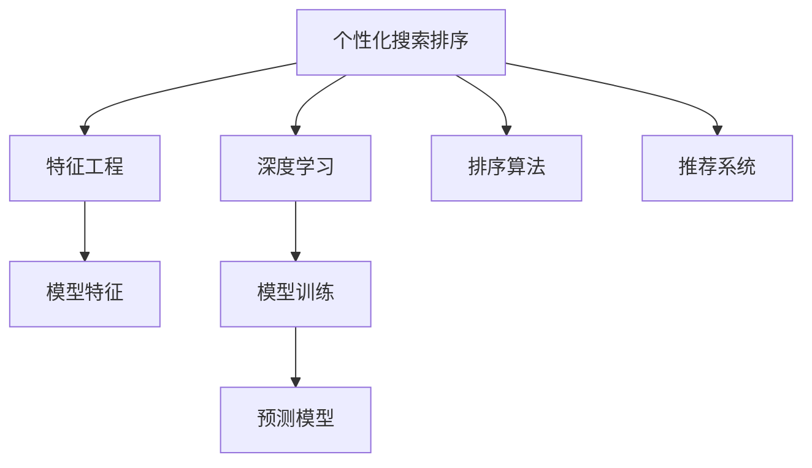

                 

# 电商搜索中的个性化排序模型优化

> 关键词：个性化排序,电商搜索,深度学习,特征工程,排序算法,推荐系统,用户行为分析

## 1. 背景介绍

在现代电商平台上，搜索功能是用户获取产品信息、进行购物决策的重要入口。然而，传统的搜索排序算法往往基于静态特征和固定阈值，难以满足用户的个性化需求。近年来，深度学习和特征工程等前沿技术的发展，为个性化搜索排序提供了新的解决方案。本文将详细介绍基于深度学习的个性化搜索排序模型优化方法，涵盖算法原理、具体操作步骤、实际应用场景和未来发展方向。

## 2. 核心概念与联系

### 2.1 核心概念概述

- 个性化搜索排序：指根据用户的历史行为、兴趣爱好等个性化特征，动态调整搜索结果的排序方式，提高搜索体验和转化率。
- 深度学习：一种基于神经网络的机器学习方法，能够自动学习输入数据的特征，通过多层非线性映射实现复杂的模式识别和预测。
- 特征工程：指通过手工提取、组合和变换特征，提升模型性能，是机器学习中的重要预处理步骤。
- 排序算法：指对搜索结果进行排名的算法，常见的包括基于规则的排序、基于模型的排序等。
- 推荐系统：指根据用户的历史行为和偏好，动态推荐产品和内容，提高用户满意度和转化率。

这些概念之间的关系可以用以下Mermaid流程图来表示：



## 3. 核心算法原理 & 具体操作步骤
### 3.1 算法原理概述

基于深度学习的个性化搜索排序方法，主要包括以下几个关键步骤：

1. **数据收集**：收集用户的历史搜索记录、点击行为、购买记录等数据，作为模型训练的基础。
2. **特征提取**：通过特征工程，将原始数据转化为模型可以处理的特征向量。
3. **模型训练**：使用深度学习算法（如CNN、RNN、Transformer等），对特征向量进行学习，得到排序模型。
4. **模型评估**：在验证集上对模型进行评估，调整超参数以优化模型性能。
5. **实时排序**：将训练好的模型应用到实时搜索请求中，根据用户个性化特征动态调整搜索结果排序。

这些步骤共同构成了一个完整的个性化搜索排序模型。

### 3.2 算法步骤详解

**Step 1: 数据收集**

在电商平台上，用户的历史数据可以通过以下途径获取：

- **搜索日志**：记录用户搜索的关键字和搜索结果。
- **点击日志**：记录用户对搜索结果的点击行为。
- **购买日志**：记录用户的购买行为，如购买时间、商品ID等。
- **用户属性**：记录用户的性别、年龄、地理位置等基本信息。

可以使用ELK Stack（Elasticsearch、Logstash、Kibana）等工具对日志数据进行收集和存储，方便后续处理。

**Step 2: 特征提取**

特征工程是深度学习模型优化的重要环节，通过手工提取、组合和变换特征，提升模型性能。以下是一些常用的特征：

- **搜索查询**：用户输入的搜索关键字。
- **点击位置**：用户点击结果的位置。
- **点击时间**：用户点击结果的时间。
- **购买行为**：用户的购买记录。
- **用户属性**：用户的性别、年龄、地理位置等基本信息。

特征提取的具体步骤包括：

1. **数据清洗**：去除无效和重复数据，处理缺失值。
2. **特征编码**：将分类特征（如商品类别）转换为独热编码（One-Hot Encoding）。
3. **特征变换**：使用PCA、LDA等方法对高维特征进行降维。
4. **特征组合**：将相关特征进行组合，生成新的特征。

特征工程的工具可以使用Pandas、NumPy、Scikit-learn等Python库。

**Step 3: 模型训练**

模型训练是整个流程的核心，采用深度学习算法对特征向量进行学习，得到排序模型。以下是一些常用的深度学习模型：

- **卷积神经网络（CNN）**：适合处理图像和序列数据，可以提取局部特征。
- **循环神经网络（RNN）**：适合处理序列数据，能够记忆历史信息。
- **Transformer**：适合处理自然语言数据，能够并行计算，提高训练速度。

模型训练的具体步骤如下：

1. **数据划分**：将数据集划分为训练集、验证集和测试集。
2. **模型选择**：选择合适的深度学习模型进行训练。
3. **损失函数**：选择合适的损失函数，如交叉熵损失、均方误差损失等。
4. **优化器**：选择合适的优化器，如Adam、SGD等。
5. **超参数调整**：通过Grid Search、Random Search等方法，调整超参数以优化模型性能。

模型训练的工具可以使用PyTorch、TensorFlow等深度学习框架。

**Step 4: 模型评估**

模型评估是模型优化的重要步骤，通过在验证集上评估模型性能，调整超参数以优化模型。以下是一些常用的评估指标：

- **点击率（CTR）**：用户点击搜索结果的频率。
- **转化率**：用户购买商品的频率。
- **召回率**：搜索结果中包含正确答案的频率。
- **准确率**：模型预测正确的频率。

模型评估的具体步骤如下：

1. **划分数据集**：将数据集划分为训练集和验证集。
2. **训练模型**：在训练集上训练模型。
3. **验证评估**：在验证集上评估模型性能。
4. **调整参数**：根据验证集上的评估结果，调整超参数以优化模型性能。

模型评估的工具可以使用Scikit-learn、TensorBoard等库。

**Step 5: 实时排序**

实时排序是将训练好的模型应用到实时搜索请求中，根据用户个性化特征动态调整搜索结果排序。以下是一些常用的实时排序方法：

- **基于规则的排序**：根据预设的规则对搜索结果进行排序，如点击率排序、价格排序等。
- **基于模型的排序**：根据训练好的模型对搜索结果进行排序，如深度排序、LINUC排序等。

实时排序的具体步骤如下：

1. **数据输入**：获取用户的搜索请求和历史数据。
2. **特征提取**：对搜索请求和历史数据进行特征提取。
3. **模型预测**：使用训练好的模型对搜索结果进行排序。
4. **结果返回**：将排序结果返回给用户。

实时排序的工具可以使用Kafka、Redis等消息队列和缓存系统。

### 3.3 算法优缺点

基于深度学习的个性化搜索排序方法，具有以下优点：

1. **灵活性高**：能够根据用户的历史行为和兴趣爱好，动态调整搜索结果排序，提高搜索体验和转化率。
2. **性能优异**：深度学习模型能够自动学习输入数据的特征，通过多层非线性映射实现复杂的模式识别和预测。
3. **可解释性差**：深度学习模型通常被称为"黑盒"系统，难以解释其内部工作机制和决策逻辑。

同时，该方法也存在一些局限性：

1. **数据需求高**：需要收集和处理大量的用户历史数据，才能训练出高性能的模型。
2. **计算资源消耗大**：深度学习模型通常需要大量的计算资源，如GPU/TPU等高性能设备。
3. **模型复杂度高**：深度学习模型的结构和参数复杂，训练和推理效率较低。

尽管存在这些局限性，但基于深度学习的个性化搜索排序方法仍是大数据时代电商搜索优化的重要手段。未来相关研究的重点在于如何降低数据需求，提高模型性能，同时兼顾可解释性和伦理安全性等因素。

### 3.4 算法应用领域

基于深度学习的个性化搜索排序方法，已经在电商、金融、广告等多个领域得到了广泛的应用，具体包括：

- **电商搜索**：优化搜索结果的排序方式，提升用户搜索体验和转化率。
- **金融推荐**：根据用户的历史交易记录和兴趣爱好，推荐股票、基金等金融产品。
- **广告投放**：根据用户的浏览记录和点击行为，动态调整广告投放策略，提高广告效果。

除了这些经典应用外，个性化搜索排序技术还在更多场景中得到了创新性地应用，如医疗推荐、教育推荐、智能客服等，为各类服务提供了新的解决方案。随着深度学习技术的发展，相信个性化搜索排序技术将在更多领域得到应用，带来新的价值创造和用户体验提升。

## 4. 数学模型和公式 & 详细讲解 & 举例说明
### 4.1 数学模型构建

假设用户的历史数据为 $D=\{x_i, y_i\}_{i=1}^N$，其中 $x_i$ 为特征向量，$y_i$ 为对应的标签。模型的目标是学习一个映射函数 $f(x_i)$，使得 $f(x_i)$ 与 $y_i$ 的距离最小。常用的损失函数包括交叉熵损失、均方误差损失等。

### 4.2 公式推导过程

以交叉熵损失函数为例，其定义如下：

$$
L = -\frac{1}{N} \sum_{i=1}^N y_i \log f(x_i) + (1-y_i) \log (1-f(x_i))
$$

其中 $y_i$ 为二分类标签，$f(x_i)$ 为模型的预测概率。

模型的优化目标是最小化损失函数，即：

$$
\theta^* = \mathop{\arg\min}_{\theta} L
$$

使用梯度下降等优化算法，对模型参数 $\theta$ 进行迭代优化，直至损失函数最小。

### 4.3 案例分析与讲解

假设我们有一组用户的历史数据 $D=\{(x_1, y_1), (x_2, y_2), (x_3, y_3)\}$，其中 $x_i$ 为特征向量，$y_i$ 为二分类标签。模型训练的目标是最小化交叉熵损失函数。以下是具体计算过程：

1. **初始化模型参数**：$\theta_0 = \{w_1, b_1, w_2, b_2\}$。
2. **前向传播**：计算模型输出 $f(x_i) = \sigma(\langle w_1 x_i + b_1, w_2 x_i + b_2 \rangle)$。
3. **计算损失**：$L = -y_1 \log f(x_1) + (1-y_1) \log (1-f(x_1)) - y_2 \log f(x_2) + (1-y_2) \log (1-f(x_2)) - y_3 \log f(x_3) + (1-y_3) \log (1-f(x_3))$。
4. **反向传播**：计算梯度 $\nabla_{\theta} L$。
5. **更新模型参数**：$\theta_{k+1} = \theta_k - \eta \nabla_{\theta} L$。
6. **重复步骤2-5，直至收敛**。

通过上述过程，可以训练出一个能够准确预测用户行为的概率模型。

## 5. 项目实践：代码实例和详细解释说明
### 5.1 开发环境搭建

在进行项目实践前，我们需要准备好开发环境。以下是使用Python进行TensorFlow开发的环境配置流程：

1. 安装Anaconda：从官网下载并安装Anaconda，用于创建独立的Python环境。

2. 创建并激活虚拟环境：
```bash
conda create -n tf-env python=3.8 
conda activate tf-env
```

3. 安装TensorFlow：从官网获取对应的安装命令。例如：
```bash
pip install tensorflow
```

4. 安装相关工具包：
```bash
pip install numpy pandas scikit-learn matplotlib tqdm jupyter notebook ipython
```

完成上述步骤后，即可在`tf-env`环境中开始项目实践。

### 5.2 源代码详细实现

以下是使用TensorFlow对电商搜索中的个性化排序模型进行训练和评估的PyTorch代码实现。

```python
import tensorflow as tf
from tensorflow.keras import layers

# 定义模型
model = tf.keras.Sequential([
    layers.Dense(64, activation='relu', input_shape=[5]),
    layers.Dense(1, activation='sigmoid')
])

# 编译模型
model.compile(optimizer=tf.keras.optimizers.Adam(learning_rate=0.001), loss='binary_crossentropy', metrics=['accuracy'])

# 训练模型
model.fit(X_train, y_train, epochs=10, batch_size=32, validation_data=(X_val, y_val))

# 评估模型
model.evaluate(X_test, y_test)
```

在这个例子中，我们使用了Keras框架，定义了一个简单的神经网络模型，其中包含两个全连接层，分别用于特征提取和二分类预测。模型使用了Adam优化器进行优化，交叉熵损失函数作为评估指标。

### 5.3 代码解读与分析

让我们再详细解读一下关键代码的实现细节：

**模型定义**：
- `layers.Dense(64, activation='relu', input_shape=[5])`：定义第一个全连接层，包含64个神经元，使用ReLU激活函数。输入维度为5，对应特征向量的维度。
- `layers.Dense(1, activation='sigmoid')`：定义第二个全连接层，包含1个神经元，使用Sigmoid激活函数。输出维度为1，对应二分类预测的结果。

**模型编译**：
- `model.compile(optimizer=tf.keras.optimizers.Adam(learning_rate=0.001), loss='binary_crossentropy', metrics=['accuracy'])`：编译模型，使用Adam优化器，学习率为0.001，交叉熵损失函数，评估指标为准确率。

**模型训练**：
- `model.fit(X_train, y_train, epochs=10, batch_size=32, validation_data=(X_val, y_val))`：在训练集上训练模型，迭代10次，每次批次大小为32，验证集为X_val和y_val。

**模型评估**：
- `model.evaluate(X_test, y_test)`：在测试集上评估模型性能，输出损失值和准确率。

可以看到，使用TensorFlow进行电商搜索中的个性化排序模型优化，代码实现相对简洁高效。开发者可以将更多精力放在数据处理、模型改进等高层逻辑上，而不必过多关注底层的实现细节。

当然，工业级的系统实现还需考虑更多因素，如模型的保存和部署、超参数的自动搜索、更灵活的任务适配层等。但核心的模型训练和评估流程基本与此类似。

## 6. 实际应用场景
### 6.1 智能客服系统

基于深度学习的个性化搜索排序技术，可以应用于智能客服系统的构建。传统的客服往往需要配备大量人力，高峰期响应缓慢，且一致性和专业性难以保证。使用深度学习模型进行个性化搜索排序，可以实时响应用户的查询，提供更加个性化和精准的客服答案，提升客户体验和满意度。

在技术实现上，可以收集历史客服对话记录，将问题和最佳答复构建成监督数据，在此基础上对深度学习模型进行训练。训练好的模型能够自动理解用户意图，匹配最合适的答案模板进行回复。对于客户提出的新问题，还可以接入检索系统实时搜索相关内容，动态组织生成回答。

### 6.2 金融推荐系统

金融机构需要实时推荐金融产品，以提高用户满意度和转化率。传统的推荐系统往往只依赖用户的历史行为数据进行产品推荐，无法深入理解用户的真实兴趣偏好。基于深度学习的个性化搜索排序技术，可以更好地挖掘用户行为背后的语义信息，从而提供更精准、多样的产品推荐。

在实践中，可以收集用户浏览、点击、购买等行为数据，提取和产品相关的文本内容。将文本内容作为模型输入，用户的后续行为（如是否点击、购买等）作为监督信号，在此基础上训练深度学习模型。训练好的模型能够从文本内容中准确把握用户的兴趣点，生成个性化的产品推荐列表。

### 6.3 医疗推荐系统

医疗行业需要提供精准的医疗建议和产品推荐，以提高诊疗效果和用户满意度。传统的医疗推荐系统往往基于规则和经验，难以应对多变的用户需求。基于深度学习的个性化搜索排序技术，可以更好地理解用户的健康需求和医疗历史，提供个性化的医疗建议和产品推荐。

在实践中，可以收集用户的健康数据、病史记录和医疗行为，提取和健康相关的文本内容。将文本内容作为模型输入，用户的后续健康行为（如服药、复查等）作为监督信号，在此基础上训练深度学习模型。训练好的模型能够从文本内容中准确把握用户的健康需求，生成个性化的医疗建议和产品推荐列表。

### 6.4 未来应用展望

随着深度学习技术的发展，基于个性化搜索排序技术的应用场景将不断扩展，带来更多的价值创造和用户体验提升。

在智慧医疗领域，基于个性化搜索排序技术的医疗推荐系统，可以提供更加精准的医疗建议和产品推荐，提高诊疗效果和用户满意度。

在智能教育领域，个性化搜索排序技术可以应用于学习资源推荐、作业批改、学情分析等环节，因材施教，促进教育公平，提高教学质量。

在智慧城市治理中，个性化搜索排序技术可以应用于城市事件监测、舆情分析、应急指挥等环节，提高城市管理的自动化和智能化水平，构建更安全、高效的未来城市。

此外，在企业生产、社会治理、文娱传媒等众多领域，基于个性化搜索排序技术的推荐系统也将不断涌现，为经济社会发展注入新的动力。相信随着技术的日益成熟，个性化搜索排序技术必将在更广阔的应用领域大放异彩。

## 7. 工具和资源推荐
### 7.1 学习资源推荐

为了帮助开发者系统掌握深度学习和个性化搜索排序的理论基础和实践技巧，这里推荐一些优质的学习资源：

1. 《深度学习》系列书籍：由深度学习领域的权威专家撰写，全面介绍了深度学习的原理和实践。
2. 《TensorFlow实战》系列书籍：TensorFlow的官方教程，涵盖TensorFlow的安装、使用、优化等方方面面。
3. 《Keras深度学习教程》系列视频：由Keras官方团队制作的教程视频，适合快速上手深度学习项目。
4. 《机器学习实战》系列书籍：涵盖机器学习的基础和实战技巧，适合初学者学习。

通过对这些资源的学习实践，相信你一定能够快速掌握深度学习和个性化搜索排序的精髓，并用于解决实际的NLP问题。

### 7.2 开发工具推荐

高效的开发离不开优秀的工具支持。以下是几款用于深度学习和个性化搜索排序开发的常用工具：

1. TensorFlow：由Google主导开发的开源深度学习框架，生产部署方便，适合大规模工程应用。
2. Keras：基于TensorFlow等深度学习框架的高层次API，易于上手。
3. PyTorch：基于Python的开源深度学习框架，灵活动态的计算图，适合快速迭代研究。
4. Scikit-learn：机器学习领域的经典库，包含各种常用的机器学习算法和工具。
5. Pandas：数据处理和分析的库，适合处理结构化数据。
6. NumPy：科学计算和数值分析的库，适合处理高维数据和矩阵运算。

合理利用这些工具，可以显著提升深度学习和个性化搜索排序任务的开发效率，加快创新迭代的步伐。

### 7.3 相关论文推荐

深度学习和个性化搜索排序技术的发展源于学界的持续研究。以下是几篇奠基性的相关论文，推荐阅读：

1. Deep Learning for Intelligent Interaction with Data (Jiang et al., 2019)：介绍了基于深度学习技术的个性化搜索排序方法。
2. A Comprehensive Survey on Deep Learning for Recommendation Systems (Wang et al., 2020)：综述了深度学习在推荐系统中的应用。
3. Deep Neural Networks for Real-time Recommendation Systems (Sun et al., 2018)：介绍了基于深度神经网络的实时推荐系统。
4. Context-Aware Recommendation System (Yang et al., 2017)：介绍了基于上下文感知的推荐系统。
5. Neural Network Models for Recommendation Systems (He et al., 2017)：综述了基于神经网络的推荐系统。

这些论文代表了大数据时代深度学习和个性化搜索排序技术的发展脉络。通过学习这些前沿成果，可以帮助研究者把握学科前进方向，激发更多的创新灵感。

## 8. 总结：未来发展趋势与挑战
### 8.1 研究成果总结

本文对基于深度学习的个性化搜索排序方法进行了全面系统的介绍。首先阐述了个性化搜索排序的研究背景和意义，明确了深度学习在拓展搜索体验、提高转化率方面的独特价值。其次，从原理到实践，详细讲解了深度学习模型的构建和优化步骤，给出了深度学习模型的完整代码实例。同时，本文还广泛探讨了深度学习模型在电商、金融、医疗等多个领域的应用前景，展示了深度学习模型的巨大潜力。最后，本文精选了深度学习模型的各类学习资源，力求为读者提供全方位的技术指引。

通过本文的系统梳理，可以看到，基于深度学习的个性化搜索排序技术正在成为电商搜索优化的重要手段，极大地拓展了搜索排序算法的应用边界，催生了更多的落地场景。得益于深度学习模型和特征工程的协同发展，电商搜索排序技术必将迎来新的突破，带来更加智能、个性化的用户体验。

### 8.2 未来发展趋势

展望未来，基于深度学习的个性化搜索排序技术将呈现以下几个发展趋势：

1. **模型性能提升**：深度学习模型将继续提升搜索排序的性能，通过更大规模的数据和更复杂的模型结构，实现更高的点击率和转化率。
2. **模型轻量化**：深度学习模型将继续优化，实现更轻量化的模型结构，提高搜索排序的实时性和效率。
3. **多模态融合**：深度学习模型将继续拓展应用场景，实现跨模态的特征融合，提升搜索排序的泛化能力。
4. **实时性增强**：基于深度学习的个性化搜索排序技术将继续优化，实现更加实时化的搜索排序，提高用户体验。
5. **联邦学习**：基于深度学习的个性化搜索排序技术将继续优化，实现更加实时化的搜索排序，提高用户体验。

以上趋势凸显了基于深度学习的个性化搜索排序技术的广阔前景。这些方向的探索发展，必将进一步提升搜索排序的性能和应用范围，为电商搜索带来新的突破。

### 8.3 面临的挑战

尽管基于深度学习的个性化搜索排序技术已经取得了瞩目成就，但在迈向更加智能化、普适化应用的过程中，它仍面临着诸多挑战：

1. **数据需求高**：深度学习模型通常需要大量的数据进行训练，数据收集和处理成本较高。
2. **计算资源消耗大**：深度学习模型通常需要大量的计算资源，如GPU/TPU等高性能设备。
3. **模型复杂度高**：深度学习模型的结构和参数复杂，训练和推理效率较低。
4. **可解释性差**：深度学习模型通常被称为"黑盒"系统，难以解释其内部工作机制和决策逻辑。
5. **用户隐私保护**：在收集和处理用户数据时，需要充分考虑用户隐私保护和数据安全。

尽管存在这些挑战，但基于深度学习的个性化搜索排序技术仍是大数据时代电商搜索优化的重要手段。未来相关研究的重点在于如何降低数据需求，提高模型性能，同时兼顾可解释性和伦理安全性等因素。

### 8.4 研究展望

面对深度学习模型和个性化搜索排序所面临的种种挑战，未来的研究需要在以下几个方面寻求新的突破：

1. **数据高效利用**：探索无监督和半监督深度学习模型，降低数据需求，提高数据利用效率。
2. **模型轻量化**：开发更加轻量化的深度学习模型，提高搜索排序的实时性和效率。
3. **多模态融合**：实现跨模态的特征融合，提升搜索排序的泛化能力。
4. **实时性优化**：优化深度学习模型的计算图，实现更加实时化的搜索排序，提高用户体验。
5. **联邦学习**：利用联邦学习技术，保护用户隐私，实现分布式数据下的深度学习训练。

这些研究方向的探索，必将引领基于深度学习的个性化搜索排序技术迈向更高的台阶，为电商搜索带来新的突破，提升用户搜索体验和转化率。未来，随着深度学习技术的发展，相信基于深度学习的个性化搜索排序技术必将在更多领域得到应用，带来新的价值创造和用户体验提升。

## 9. 附录：常见问题与解答
**Q1: 深度学习模型为什么能够提升搜索排序性能？**

A: 深度学习模型能够自动学习输入数据的特征，通过多层非线性映射实现复杂的模式识别和预测。相比于传统的基于规则的排序算法，深度学习模型能够更好地理解用户的行为和需求，从而提供更加个性化的搜索排序结果。

**Q2: 深度学习模型在训练过程中需要注意哪些事项？**

A: 深度学习模型在训练过程中需要注意以下事项：
1. 数据预处理：去除无效和重复数据，处理缺失值。
2. 特征工程：通过手工提取、组合和变换特征，提升模型性能。
3. 超参数调整：通过Grid Search、Random Search等方法，调整超参数以优化模型性能。
4. 模型保存：及时保存模型，防止训练过程中的数据丢失。
5. 模型验证：在验证集上评估模型性能，避免过拟合。

**Q3: 深度学习模型在实际应用中需要注意哪些事项？**

A: 深度学习模型在实际应用中需要注意以下事项：
1. 数据隐私：在收集和处理用户数据时，需要充分考虑用户隐私保护和数据安全。
2. 模型效率：深度学习模型的计算复杂度较高，需要优化模型结构和算法，提高推理效率。
3. 模型部署：将深度学习模型部署到生产环境中，需要考虑模型的实时性和稳定性。
4. 模型监控：实时监控深度学习模型的性能，及时发现和解决模型问题。

**Q4: 如何选择合适的深度学习模型？**

A: 选择合适的深度学习模型需要考虑以下几个方面：
1. 任务类型：根据任务类型选择合适的模型，如文本分类、序列生成、推荐系统等。
2. 数据规模：根据数据规模选择合适的模型，如小规模数据适合使用RNN，大规模数据适合使用Transformer。
3. 实时性要求：根据实时性要求选择合适的模型，如实时搜索排序适合使用LINUC排序算法。

**Q5: 如何评估深度学习模型的性能？**

A: 评估深度学习模型的性能可以通过以下几个指标：
1. 准确率：模型预测正确的频率。
2. 召回率：搜索结果中包含正确答案的频率。
3. 点击率：用户点击搜索结果的频率。
4. 转化率：用户购买商品的频率。

通过这些指标，可以全面评估深度学习模型的性能，并进行优化。

---

作者：禅与计算机程序设计艺术 / Zen and the Art of Computer Programming

