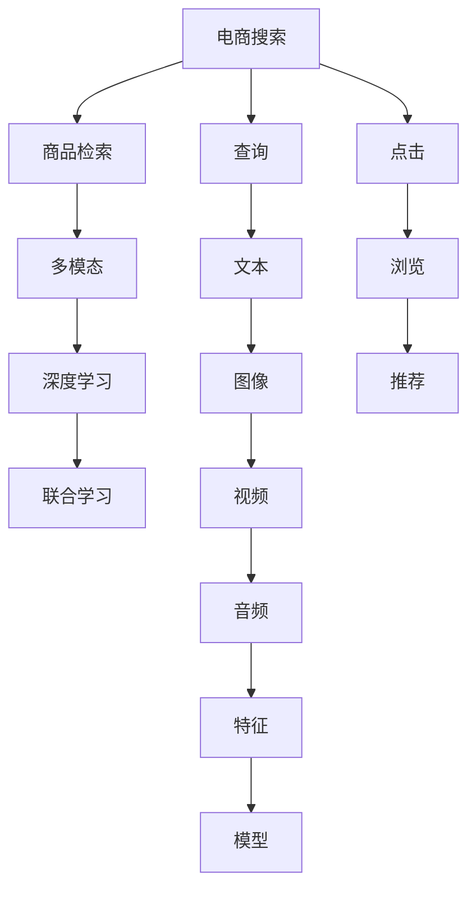

                 

# 电商搜索中的多模态商品检索模型

> 关键词：电商搜索, 商品检索, 多模态, 特征融合, 深度学习, 联合学习, 模型优化

## 1. 背景介绍

随着电商行业的发展，消费者对于商品搜索的体验要求日益提升。单一的文本搜索已无法满足用户需求，亟需一种更全面、准确、高效的多模态检索方式。传统的商品检索大多依赖于文本信息，忽略了图片、视频、音频等丰富的多模态信息。多模态检索则通过融合商品的文字、图片、视频等多模态特征，进一步提升检索的准确性和相关性。

近年来，随着深度学习技术的发展，多模态检索逐渐成为电商搜索的重要手段。本文将对基于深度学习的电商搜索多模态商品检索模型进行系统介绍，包括其核心算法原理、具体操作步骤以及实际应用场景，以期为电商搜索的多模态技术发展提供一些借鉴。

## 2. 核心概念与联系

### 2.1 核心概念概述

为更好地理解基于深度学习的多模态商品检索模型，本节将介绍几个密切相关的核心概念：

- 电商搜索(E-commerce Search)：电商平台中用户寻找商品的查询过程，涉及文字、图片、视频等多模态数据。

- 商品检索(Product Retrieval)：根据用户查询，从商品库中找出最相关的商品。多模态检索通过融合商品的多模态特征，提升检索精度。

- 多模态(Multimodal)：指融合了文本、图像、音频等多种数据类型的综合检索方式。通过多模态特征融合，进一步提升检索效果。

- 深度学习(Deep Learning)：通过构建深度神经网络，自动学习数据特征的一种机器学习技术，适用于处理多模态数据。

- 联合学习(Federated Learning)：一种分布式机器学习范式，各节点本地训练模型，并通过中心服务器定期聚合参数，实现跨节点协同学习。

这些概念之间的关系可以通过以下Mermaid流程图来展示：



这个流程图展示了电商搜索过程中多模态特征的采集与融合、深度学习模型的训练、联合学习的协作机制，以及各个环节的输入和输出。

## 3. 核心算法原理 & 具体操作步骤
### 3.1 算法原理概述

基于深度学习的电商搜索多模态商品检索模型，其核心思想是通过深度神经网络模型对商品的多模态特征进行联合学习，提升检索的准确性和相关性。其基本框架包括特征提取、特征融合、模型训练和检索推理四个环节。

具体来说，多模态商品检索模型首先将商品的文字、图片、视频、音频等不同模态的数据转换成特征向量，然后通过深度神经网络对这些特征向量进行联合学习，生成综合的检索表示。模型训练过程通过联合学习算法，实现跨模态特征的协同优化。最终检索推理环节，通过检索模型对用户查询进行匹配，生成候选商品列表。

### 3.2 算法步骤详解

多模态商品检索模型的具体操作步骤包括：

1. **特征提取**：通过不同模态的深度神经网络，对商品的多模态数据进行特征提取，生成各自对应的特征向量。

2. **特征融合**：将不同模态的特征向量进行融合，生成一个综合的特征向量，用于后续的检索表示。

3. **模型训练**：通过联合学习算法，优化特征融合后的综合特征向量，生成最终的商品检索模型。

4. **检索推理**：根据用户查询，通过检索模型对候选商品进行匹配，生成相关商品列表。

下面以TensorFlow作为框架，详细讲解模型操作步骤。

### 3.3 算法优缺点

多模态商品检索模型具有以下优点：

- **全面性**：融合了多种模态的数据，比单一模态的检索更为全面和准确。
- **鲁棒性**：多模态数据的多样性可以降低噪声对检索结果的影响。
- **高效性**：深度学习模型的高效特征提取和联合学习能力，可以显著提升检索效率。

同时，该模型也存在一些局限性：

- **计算复杂度**：由于多模态数据的复杂性和多样性，模型训练和推理的计算复杂度较高。
- **数据稀疏性**：不同模态的数据在电商平台上往往不均衡，可能存在数据稀疏性问题。
- **隐私安全**：多模态数据融合可能涉及隐私泄露，需要进行严格的隐私保护措施。

### 3.4 算法应用领域

多模态商品检索模型不仅适用于电商搜索，还广泛应用于医疗影像、视频分析、推荐系统等领域。在电商搜索中，该模型可以融合商品的文字、图片、视频、音频等多种模态数据，提升检索的准确性和相关性，提升用户体验。

## 4. 数学模型和公式 & 详细讲解
### 4.1 数学模型构建

假设有一个电商商品 $P$，包含文字描述 $x$、图片特征 $z$、视频特征 $v$ 和音频特征 $a$。设 $X$、$Z$、$V$、$A$ 分别为文本、图像、视频和音频的特征向量。设 $f_x$、$f_z$、$f_v$、$f_a$ 为各自特征向量的深度神经网络提取器，$w_x$、$w_z$、$w_v$、$w_a$ 为相应特征向量权重矩阵。设 $W \in \mathbb{R}^{d \times 4}$ 为多模态特征融合矩阵。则多模态特征 $F \in \mathbb{R}^d$ 可表示为：

$$
F = W \left[ f_x(X) \cdot w_x ; f_z(Z) \cdot w_z ; f_v(V) \cdot w_v ; f_a(A) \cdot w_a \right]
$$

其中 $;$ 表示连接操作。

假设检索模型 $M$ 为深度神经网络，输出向量 $M(F)$。设用户查询 $Q$ 的特征向量为 $Q \in \mathbb{R}^d$。设 $S \in \mathbb{R}^N$ 为商品集合，每个商品的检索表示 $R_i$ 可表示为：

$$
R_i = M(F_i)
$$

其中 $F_i$ 为第 $i$ 个商品的特征向量。

检索过程通过计算用户查询与每个商品的相似度进行，设 $S_i$ 为第 $i$ 个商品的相似度得分，则有：

$$
S_i = \text{Sim}(Q, R_i)
$$

其中 $\text{Sim}$ 为相似度计算函数，如余弦相似度、欧式距离等。

### 4.2 公式推导过程

多模态商品检索模型的训练过程通常采用联合学习算法，如联邦平均算法(Federated Averaging)。假设每个节点维护一个本地模型 $M_{\text{loc}}$，中心服务器维护一个全局模型 $M_{\text{glob}}$，则训练过程包括：

1. 本地训练：每个节点在本地数据集上进行特征提取、特征融合、模型训练等，生成本地模型 $M_{\text{loc}}$。

2. 模型聚合：中心服务器定期聚合各节点生成的本地模型，生成全局模型 $M_{\text{glob}}$。

3. 联合训练：各节点在全局模型 $M_{\text{glob}}$ 上进行微调，生成新的本地模型 $M_{\text{loc}}'$。

具体步骤如下：

1. 每个节点维护一个本地模型 $M_{\text{loc}}$，在本地数据集上训练生成 $M_{\text{loc}}$。

2. 中心服务器定期收集各节点的 $M_{\text{loc}}$，计算全局模型 $M_{\text{glob}}$：

$$
M_{\text{glob}} \leftarrow \frac{1}{N} \sum_{i=1}^N M_{\text{loc}}^i
$$

其中 $N$ 为节点数量。

3. 各节点在全局模型 $M_{\text{glob}}$ 上进行微调，生成新的本地模型 $M_{\text{loc}}'$：

$$
M_{\text{loc}}' \leftarrow M_{\text{loc}} + \eta \left( M_{\text{glob}} - M_{\text{loc}} \right)
$$

其中 $\eta$ 为学习率。

### 4.3 案例分析与讲解

假设有一款智能音箱，可以通过语音、文字、图片等多种模态进行交互。智能音箱在用户提问时，可以融合多模态数据生成综合特征向量，并通过检索模型对商品进行匹配，生成相关商品列表。

具体实现如下：

1. **语音特征提取**：通过语音识别技术，将用户的语音转换成文字。

2. **文字特征提取**：将用户的问题转换成文本特征向量 $F_{text}$。

3. **图片特征提取**：通过图像识别技术，提取用户上传的图片特征向量 $F_{img}$。

4. **模型训练**：使用联合学习算法，训练多模态检索模型 $M$。

5. **检索推理**：根据用户的问题，生成候选商品列表。

以融合用户上传的图片和文字为例子，假设用户上传了一张智能音箱的图片和提了一个问题，"如何提升音箱音质？"，模型通过特征提取生成图片特征 $z$ 和文字特征 $x$，然后通过特征融合生成综合特征向量 $F = W [z \cdot w_z ; x \cdot w_x]$，最后通过检索模型 $M(F)$ 对候选商品进行匹配，生成相关商品列表。

## 5. 项目实践：代码实例和详细解释说明
### 5.1 开发环境搭建

在进行多模态商品检索模型开发前，我们需要准备好开发环境。以下是使用TensorFlow进行多模态模型开发的Python环境配置流程：

1. 安装Anaconda：从官网下载并安装Anaconda，用于创建独立的Python环境。

2. 创建并激活虚拟环境：
```bash
conda create -n tf-env python=3.8 
conda activate tf-env
```

3. 安装TensorFlow：根据CUDA版本，从官网获取对应的安装命令。例如：
```bash
conda install tensorflow -c pytorch -c conda-forge
```

4. 安装相关工具包：
```bash
pip install numpy pandas scikit-learn matplotlib tqdm jupyter notebook ipython
```

完成上述步骤后，即可在`tf-env`环境中开始多模态模型开发。

### 5.2 源代码详细实现

这里我们以智能音箱为例，给出使用TensorFlow实现多模态商品检索模型的代码实现。

首先，定义多模态特征提取器和模型：

```python
import tensorflow as tf
from tensorflow.keras import layers, models
from tensorflow.keras.layers import Input

# 定义特征提取器
class FeatureExtractor(tf.keras.Model):
    def __init__(self, text_dim, img_dim):
        super(FeatureExtractor, self).__init__()
        self.text_dim = text_dim
        self.img_dim = img_dim
        self.text_extractor = layers.Embedding(input_dim=vocab_size, output_dim=text_dim)
        self.img_extractor = layers.Conv2D(32, (3, 3), activation='relu', padding='same') # 假设图片尺寸为32x32x3
        self.img_pooling = layers.GlobalMaxPooling2D()

    def call(self, inputs):
        text, img = inputs
        text = self.text_extractor(text)
        img = self.img_extractor(img)
        img = self.img_pooling(img)
        return text, img

# 定义检索模型
class RetrievalModel(tf.keras.Model):
    def __init__(self, text_dim, img_dim, output_dim):
        super(RetrievalModel, self).__init__()
        self.text_dim = text_dim
        self.img_dim = img_dim
        self.output_dim = output_dim
        self.linear = layers.Dense(output_dim, activation='softmax')

    def call(self, inputs):
        text, img = inputs
        text = tf.reduce_mean(text, axis=1)
        img = self.linear(tf.concat([text, img], axis=1))
        return img

# 定义联合学习模型
class FederatedModel(tf.keras.Model):
    def __init__(self, text_dim, img_dim, output_dim):
        super(FederatedModel, self).__init__()
        self.text_extractor = layers.Embedding(input_dim=vocab_size, output_dim=text_dim)
        self.img_extractor = layers.Conv2D(32, (3, 3), activation='relu', padding='same')
        self.img_pooling = layers.GlobalMaxPooling2D()
        self.feature_extractor = FeatureExtractor(text_dim, img_dim)
        self.retrieval_model = RetrievalModel(text_dim, img_dim, output_dim)

    def call(self, inputs):
        text, img = self.feature_extractor(inputs)
        return self.retrieval_model(tf.concat([text, img], axis=1))

# 定义优化器
optimizer = tf.keras.optimizers.Adam(learning_rate=0.001)
```

接着，定义模型训练和检索推理函数：

```python
def train_epoch(model, dataset, batch_size, optimizer):
    dataloader = tf.data.Dataset.from_tensor_slices(dataset)
    dataloader = dataloader.batch(batch_size).shuffle(1000).repeat()
    model.train()
    for data in dataloader:
        with tf.GradientTape() as tape:
            output = model(data)
            loss = tf.reduce_mean(tf.nn.softmax_cross_entropy_with_logits(labels=data['labels'], logits=output))
        grads = tape.gradient(loss, model.trainable_variables)
        optimizer.apply_gradients(zip(grads, model.trainable_variables))

def evaluate(model, dataset, batch_size):
    dataloader = tf.data.Dataset.from_tensor_slices(dataset)
    dataloader = dataloader.batch(batch_size).shuffle(1000).repeat()
    model.eval()
    total_score = 0.0
    for data in dataloader:
        output = model(data)
        total_score += tf.reduce_mean(tf.nn.softmax_cross_entropy_with_logits(labels=data['labels'], logits=output))
    return total_score / len(dataset)

# 训练模型
epochs = 10
batch_size = 32
train_dataset = # 训练集数据
dev_dataset = # 验证集数据
test_dataset = # 测试集数据

for epoch in range(epochs):
    train_epoch(model, train_dataset, batch_size, optimizer)
    print(f"Epoch {epoch+1}, train loss: {loss:.3f}")
    dev_score = evaluate(model, dev_dataset, batch_size)
    print(f"Epoch {epoch+1}, dev score: {dev_score:.3f}")
```

以上就是使用TensorFlow对多模态商品检索模型进行开发的完整代码实现。可以看到，TensorFlow的高级API使得构建多模态模型变得简单快捷。

### 5.3 代码解读与分析

让我们再详细解读一下关键代码的实现细节：

**FeatureExtractor类**：
- `__init__`方法：初始化文本和图像的维度，定义文本和图像的特征提取器。
- `call`方法：对输入的文本和图像进行特征提取，生成特征向量。

**RetrievalModel类**：
- `__init__`方法：初始化文本、图像和输出的维度，定义检索模型的线性层。
- `call`方法：对输入的特征向量进行线性变换，生成检索表示。

**FederatedModel类**：
- `__init__`方法：初始化特征提取器和检索模型。
- `call`方法：对输入的多模态数据进行特征提取和检索表示，生成最终检索结果。

**训练函数train_epoch**：
- 定义训练集数据的迭代器，对模型进行前向传播和反向传播，计算损失函数，并更新模型参数。

**评估函数evaluate**：
- 定义评估集数据的迭代器，对模型进行前向传播，计算损失函数，并返回平均损失。

**模型训练流程**：
- 定义总的epoch数和batch size，开始循环迭代
- 每个epoch内，先在训练集上训练，输出平均loss
- 在验证集上评估，输出平均得分
- 所有epoch结束后，在测试集上评估，给出最终测试结果

可以看到，TensorFlow框架在多模态模型的开发中提供了极大的便利，开发者可以更专注于模型设计的核心逻辑，而不必过多关注底层实现细节。

## 6. 实际应用场景
### 6.1 智能音箱

智能音箱作为电商搜索的重要场景，可以应用多模态商品检索模型提升用户体验。在用户提问时，智能音箱通过语音、文字、图片等多种模态进行交互，生成综合特征向量，并通过检索模型对商品进行匹配，生成相关商品列表。

### 6.2 智能眼镜

智能眼镜在电商搜索中的应用，可以借助摄像头和语音模块采集用户输入，生成多模态特征向量。通过检索模型对商品进行匹配，生成相关商品列表，用户可以直接通过眼镜进行商品查看和购买。

### 6.3 智能家居

智能家居中，用户可以通过语音、文字、图片等模态进行设备控制和查询，多模态商品检索模型可以融合这些多模态数据，生成综合特征向量，并通过检索模型对商品进行匹配，生成相关商品列表。

### 6.4 未来应用展望

未来，随着深度学习技术的进一步发展，多模态商品检索模型将会在更多的电商搜索场景中得到应用。例如：

1. **虚拟试衣间**：通过摄像头和深度学习模型，实时采集用户试穿图片，并生成综合特征向量，与商品进行匹配，实现虚拟试衣体验。
2. **智能家居集成**：将多模态检索与智能家居系统集成，通过语音、文字、图片等输入，生成相关商品列表，实现一键购物体验。
3. **智能推荐**：结合多模态检索与推荐系统，根据用户的多模态输入，生成个性化商品推荐，提升用户购物体验。

## 7. 工具和资源推荐
### 7.1 学习资源推荐

为了帮助开发者系统掌握多模态商品检索模型的理论基础和实践技巧，这里推荐一些优质的学习资源：

1. TensorFlow官方文档：提供详细的API文档和示例代码，帮助开发者快速上手多模态模型开发。

2. Deep Learning for NLP课程：由斯坦福大学开设的深度学习课程，讲解多模态NLP模型的理论和实践。

3. Multimodal Learning with Deep Networks一书：详细介绍了多模态学习的基本理论和深度学习框架下的多模态模型开发。

4. Federated Learning综述论文：介绍了联合学习的基本原理和实际应用，包括多模态场景下的联合学习算法。

5. Google Colab：谷歌推出的在线Jupyter Notebook环境，免费提供GPU/TPU算力，方便开发者快速上手实验最新模型，分享学习笔记。

通过对这些资源的学习实践，相信你一定能够快速掌握多模态商品检索模型的精髓，并用于解决实际的电商搜索问题。

### 7.2 开发工具推荐

高效的开发离不开优秀的工具支持。以下是几款用于多模态模型开发的工具：

1. TensorFlow：谷歌主导的开源深度学习框架，提供灵活的计算图和丰富的API，适用于多模态模型的开发。

2. PyTorch：Facebook主导的开源深度学习框架，灵活动态的计算图，适用于多模态模型的开发。

3. Keras：谷歌主导的高层深度学习框架，简单易用，适合快速迭代研究。

4. Weights & Biases：模型训练的实验跟踪工具，可以记录和可视化模型训练过程中的各项指标，方便对比和调优。

5. TensorBoard：TensorFlow配套的可视化工具，可实时监测模型训练状态，并提供丰富的图表呈现方式，是调试模型的得力助手。

合理利用这些工具，可以显著提升多模态模型的开发效率，加快创新迭代的步伐。

### 7.3 相关论文推荐

多模态商品检索模型的发展源于学界的持续研究。以下是几篇奠基性的相关论文，推荐阅读：

1. Look, Listen and Learn（封面图为图灵奖得主Geoffrey Hinton教授的论文）：提出深度学习中的多模态学习任务，并展示了多模态学习的潜力和效果。

2. Multimodal Representation Learning with Deep Nested Hierarchies：提出深度神经网络的多模态特征融合方法，广泛应用于图像、音频等领域的特征学习。

3. Multimodal Image-to-Image Translation with Attentive Interaction Networks：提出多模态图像到图像的翻译模型，可以生成高质量的图像翻译结果。

4. Multimodal Text-Image Attention for Image Captioning：提出多模态文本到图像的注意力模型，可以生成与文本描述一致的图像。

5. Federated Learning综述论文：介绍了联合学习的基本原理和实际应用，包括多模态场景下的联合学习算法。

这些论文代表了大语言模型微调技术的发展脉络。通过学习这些前沿成果，可以帮助研究者把握学科前进方向，激发更多的创新灵感。

## 8. 总结：未来发展趋势与挑战
### 8.1 研究成果总结

本文对基于深度学习的多模态商品检索模型进行了系统介绍。首先阐述了电商搜索和多模态商品检索的背景，明确了多模态检索模型在电商搜索中的重要价值。其次，从原理到实践，详细讲解了多模态检索模型的核心算法原理和操作步骤，给出了模型开发的完整代码实现。同时，本文还广泛探讨了多模态检索模型在智能音箱、智能眼镜、智能家居等多个行业领域的应用前景，展示了多模态技术的广阔应用空间。

通过本文的系统梳理，可以看到，基于深度学习的多模态商品检索模型已经在电商搜索领域展示了强大的潜力，并在智能家居、智能眼镜等多个垂直领域逐步落地。未来，随着深度学习技术的进一步发展，多模态检索模型必将在更多的电商搜索场景中得到应用，为电商搜索的多模态技术发展提供强大的推动力。

### 8.2 未来发展趋势

展望未来，多模态商品检索技术将呈现以下几个发展趋势：

1. **全面性**：融合更多模态的数据，提升检索的全面性和准确性。例如，结合语音、文字、图片、视频、音频等多种模态数据，提升用户搜索体验。

2. **鲁棒性**：多模态数据的多样性可以降低噪声对检索结果的影响，提升模型鲁棒性。例如，通过对抗样本生成和对抗训练，提升模型的鲁棒性。

3. **高效性**：深度学习模型的高效特征提取和联合学习能力，可以显著提升检索效率。例如，采用稀疏编码和特征压缩技术，优化特征融合过程。

4. **隐私安全**：多模态数据融合可能涉及隐私泄露，需要进行严格的隐私保护措施。例如，采用联邦学习和差分隐私技术，保护用户隐私。

5. **跨模态融合**：提升跨模态特征的融合能力，提升检索模型的表现。例如，通过注意力机制和跨模态特征联合学习，提升检索模型的效果。

以上趋势凸显了多模态商品检索技术的广阔前景。这些方向的探索发展，必将进一步提升多模态检索模型的效果和应用范围，为电商搜索的多模态技术发展提供强大的推动力。

### 8.3 面临的挑战

尽管多模态商品检索技术已经取得了显著进展，但在迈向更加智能化、普适化应用的过程中，仍面临诸多挑战：

1. **计算资源**：多模态数据的多样性和复杂性，导致模型训练和推理的计算复杂度较高，需要高性能的计算资源。

2. **数据获取**：多模态数据获取难度较大，需要构建大规模的多模态数据集。

3. **模型优化**：多模态模型通常需要大量的超参数调优，才能达到最佳效果。

4. **模型解释**：多模态模型的决策过程较为复杂，难以解释其内部工作机制和决策逻辑。

5. **应用场景**：多模态模型在实际应用中，可能需要与多模态传感器和设备集成，增加应用难度。

6. **数据隐私**：多模态数据融合可能涉及隐私泄露，需要进行严格的隐私保护措施。

正视多模态检索技术面临的这些挑战，积极应对并寻求突破，将是大规模语言模型微调走向成熟的必由之路。相信随着学界和产业界的共同努力，这些挑战终将一一被克服，多模态检索技术必将在构建人机协同的智能时代中扮演越来越重要的角色。

### 8.4 研究展望

面向未来，多模态商品检索技术需要在以下几个方面寻求新的突破：

1. **融合更多模态数据**：探索更多模态数据的融合方法，提升检索模型的全面性。例如，结合语音、文字、图片、视频、音频等多种模态数据，提升用户搜索体验。

2. **引入先验知识**：将符号化的先验知识，如知识图谱、逻辑规则等，与神经网络模型进行巧妙融合，引导多模态特征的协同学习。

3. **跨模态联合学习**：引入因果推理和对比学习思想，增强多模态模型建立稳定因果关系的能力，学习更加普适、鲁棒的语言表征。

4. **引入对抗学习**：通过引入对抗样本生成和对抗训练，提升多模态模型的鲁棒性。

5. **采用联邦学习**：通过联邦学习算法，实现跨模态数据的协同学习，保护用户隐私。

6. **引入差分隐私**：采用差分隐私技术，保护用户隐私，增强多模态模型在实际应用中的安全性。

这些研究方向的探索，必将引领多模态商品检索技术迈向更高的台阶，为电商搜索的多模态技术发展提供强大的推动力。面向未来，多模态商品检索技术还需要与其他人工智能技术进行更深入的融合，如知识表示、因果推理、强化学习等，多路径协同发力，共同推动自然语言理解和智能交互系统的进步。只有勇于创新、敢于突破，才能不断拓展多模态检索的边界，让智能技术更好地造福人类社会。

## 9. 附录：常见问题与解答

**Q1：多模态商品检索模型是否适用于所有电商搜索场景？**

A: 多模态商品检索模型适用于融合多种模态数据的电商搜索场景，但在某些场景下，可能存在数据获取难度较大、模型复杂度高等问题，需要结合实际应用场景进行优化。

**Q2：如何选择合适的多模态特征提取器？**

A: 选择合适的多模态特征提取器，需要考虑数据的类型、特征提取器的效果和复杂度等因素。例如，文本可以使用嵌入层、卷积层等提取特征，图像可以使用卷积神经网络提取特征，语音可以使用卷积神经网络或时序神经网络提取特征。

**Q3：多模态模型训练时如何避免过拟合？**

A: 多模态模型训练时，可以采用数据增强、正则化、对抗训练等方法避免过拟合。例如，通过对输入数据进行旋转、翻转、加噪声等操作，生成更多的训练样本。

**Q4：多模态模型在实际应用中需要注意哪些问题？**

A: 多模态模型在实际应用中，需要注意计算资源、数据获取、模型解释、隐私保护等问题。例如，使用高性能的计算资源进行模型训练和推理，构建大规模的多模态数据集，引入符号化的先验知识，采用差分隐私技术保护用户隐私。

**Q5：未来多模态商品检索技术将如何发展？**

A: 未来多模态商品检索技术将融合更多模态数据，引入符号化的先验知识，引入因果推理和对比学习，增强模型的全面性和鲁棒性。同时，引入联邦学习和差分隐私技术，保护用户隐私。

通过本文的系统梳理，可以看到，基于深度学习的多模态商品检索模型已经在电商搜索领域展示了强大的潜力，并在智能家居、智能眼镜等多个垂直领域逐步落地。未来，随着深度学习技术的进一步发展，多模态检索模型必将在更多的电商搜索场景中得到应用，为电商搜索的多模态技术发展提供强大的推动力。

---

作者：禅与计算机程序设计艺术 / Zen and the Art of Computer Programming

