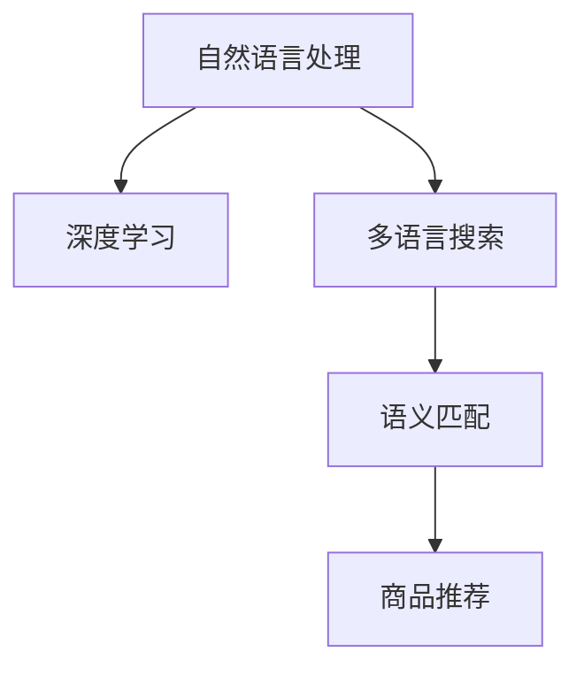

                 

# 电商搜索中的多语言商品语义匹配技术

> 关键词：多语言搜索,语义匹配,商品推荐,自然语言处理(NLP),深度学习

## 1. 背景介绍

### 1.1 问题由来
在电商搜索领域，用户可以通过各种自然语言描述来搜索商品，这种形式称为多语言搜索。然而，由于不同语言的语义差异，用户查询和商品描述之间可能存在语义上的不一致，导致搜索结果与用户期望相悖。以中文搜索为例，"苹果"既可以表示水果，也可以表示科技公司的产品，用户预期可能不同，因此需要一种方法来解决这一问题。

### 1.2 问题核心关键点
语义匹配是解决多语言电商搜索问题的关键。它涉及到将用户查询与商品描述进行语义上的对应和匹配，以确保搜索结果的相关性和准确性。在多语言电商搜索中，语义匹配的难点在于不同语言之间存在的语言学差异，如词序、词性、语法结构等，以及同一词汇在不同语境下的含义可能不同。

### 1.3 问题研究意义
多语言电商搜索中的语义匹配技术，对于提升用户搜索体验，增加电商平台的销售转化率具有重要意义。通过精确的语义匹配，平台能够更准确地理解用户的查询意图，提供更相关、更满意的商品推荐，从而提高用户满意度和平台竞争力。

## 2. 核心概念与联系

### 2.1 核心概念概述

为更好地理解电商搜索中的多语言商品语义匹配技术，本节将介绍几个密切相关的核心概念：

- 自然语言处理(Natural Language Processing, NLP)：涉及计算机对自然语言的理解、处理和生成，是解决多语言语义匹配的基础。
- 深度学习(Deep Learning)：一种模仿人脑神经网络结构和功能的机器学习技术，广泛应用于语义匹配和商品推荐等任务。
- 多语言搜索：用户使用不同语言进行搜索，对搜索结果的语义匹配提出了更高的要求。
- 语义匹配：将用户查询与商品描述进行语义上的对应和匹配，提升搜索结果的相关性。
- 商品推荐：基于用户查询和商品描述的语义匹配结果，推荐与用户意图最匹配的商品。

这些核心概念之间的逻辑关系可以通过以下Mermaid流程图来展示：



这个流程图展示了几者之间的关系：

1. 自然语言处理技术为深度学习提供了语义理解的基础。
2. 深度学习模型在多语言搜索中应用广泛，用于语义匹配和商品推荐。
3. 语义匹配是解决多语言搜索问题的关键步骤。
4. 商品推荐系统基于语义匹配的结果，提供个性化的推荐。

这些概念共同构成了电商搜索中的多语言商品语义匹配技术的基础，使得平台能够理解用户的多语言查询，精准推荐商品。

## 3. 核心算法原理 & 具体操作步骤
### 3.1 算法原理概述

电商搜索中的多语言商品语义匹配，主要通过深度学习模型来实现。其核心思想是：将用户查询和商品描述分别编码成向量表示，通过计算向量之间的相似度来匹配语义。具体步骤如下：

1. **用户查询编码**：使用自然语言处理技术将用户查询转化为向量表示。
2. **商品描述编码**：同样使用自然语言处理技术将商品描述转化为向量表示。
3. **相似度计算**：通过计算用户查询向量和商品描述向量之间的相似度，找到与用户查询意图最匹配的商品。

### 3.2 算法步骤详解

以下以Transformer模型为例，详细讲解多语言商品语义匹配的算法步骤：

**Step 1: 准备预训练模型和数据集**
- 选择合适的预训练模型，如BERT、GPT等，作为初始化参数。
- 准备多语言的商品描述和用户查询数据集，划分为训练集、验证集和测试集。数据集应包含不同语言的语料，且数据分布尽可能均衡。

**Step 2: 定义编码器-解码器架构**
- 在预训练模型基础上，添加编码器和解码器。编码器用于将用户查询和商品描述分别转化为向量表示，解码器用于将匹配结果转化为用户可以理解的自然语言。
- 选择合适的损失函数，如交叉熵损失，用于衡量用户查询和商品描述的匹配程度。

**Step 3: 设置模型超参数**
- 选择合适的优化算法及其参数，如Adam、SGD等，设置学习率、批大小、迭代轮数等。
- 设置正则化技术及强度，包括权重衰减、Dropout、Early Stopping等，防止模型过拟合。
- 确定冻结预训练参数的策略，如仅微调顶层，或全部参数都参与微调。

**Step 4: 执行梯度训练**
- 将训练集数据分批次输入模型，前向传播计算损失函数。
- 反向传播计算参数梯度，根据设定的优化算法和学习率更新模型参数。
- 周期性在验证集上评估模型性能，根据性能指标决定是否触发 Early Stopping。
- 重复上述步骤直到满足预设的迭代轮数或 Early Stopping 条件。

**Step 5: 测试和部署**
- 在测试集上评估模型性能，对比微调前后的精度提升。
- 使用微调后的模型对新样本进行推理预测，集成到实际的应用系统中。
- 持续收集新的数据，定期重新微调模型，以适应数据分布的变化。

### 3.3 算法优缺点

多语言商品语义匹配技术具有以下优点：
1. 适应性强。通过深度学习模型，可以很好地适应不同语言的语义差异，提高匹配的准确性。
2. 通用性好。该技术在多语言电商搜索中具有广泛的应用前景，适用于各种商品推荐场景。
3. 可扩展性强。新语言的加入和旧语料的数据更新，只需进行小规模微调，即可提升模型性能。

同时，该方法也存在一定的局限性：
1. 依赖高质量数据。模型的训练效果很大程度上依赖于标注数据的质量和数量。
2. 计算资源需求高。深度学习模型通常需要较大的计算资源，在硬件设施较差的情况下难以大规模部署。
3. 可解释性不足。深度学习模型的决策过程难以解释，难以理解其内部工作机制。

尽管存在这些局限性，但就目前而言，基于深度学习的语义匹配技术仍是电商搜索中的主流范式。未来相关研究的重点在于如何进一步降低对标注数据的依赖，提高模型的计算效率，同时兼顾可解释性和鲁棒性等因素。

### 3.4 算法应用领域

基于深度学习的电商搜索中的多语言商品语义匹配技术，已经在各大电商平台得到广泛应用，涵盖了文本匹配、语音搜索、图像识别等多个领域。例如：

- 文本匹配：将用户查询与商品描述进行语义匹配，提高搜索结果的相关性。
- 语音搜索：将用户语音指令转化为文本查询，进行语义匹配和商品推荐。
- 图像识别：通过图像描述与商品描述的语义匹配，识别相似的商品。

除了这些主要应用外，该技术还被创新性地应用到更多场景中，如个性化推荐、广告投放优化、用户行为分析等，为电商平台带来了更高的商业价值。

## 4. 数学模型和公式 & 详细讲解 & 举例说明
### 4.1 数学模型构建

在本节中，我们将使用数学语言对基于深度学习的电商搜索中的多语言商品语义匹配过程进行更加严格的刻画。

假设用户查询为 $q$，商品描述为 $d$，均由自然语言处理技术转化为向量表示 $q_{vec}$ 和 $d_{vec}$。模型的目标是最小化用户查询和商品描述之间的距离，即：

$$
\min_{q_{vec}, d_{vec}} \|q_{vec} - d_{vec}\|
$$

其中 $\|\cdot\|$ 表示向量之间的距离，可以是欧式距离、余弦相似度等。

### 4.2 公式推导过程

以余弦相似度为例，推导用户查询和商品描述之间的相似度计算公式：

$$
similarity(q_{vec}, d_{vec}) = \frac{q_{vec} \cdot d_{vec}}{\|q_{vec}\|\|d_{vec}\|}
$$

其中 $\cdot$ 表示向量内积，$\|\cdot\|$ 表示向量模长。通过计算余弦相似度，可以衡量用户查询和商品描述之间的语义匹配程度。

### 4.3 案例分析与讲解

考虑一个简单的电商搜索案例，用户查询为 "I want to buy a red apple"（我想买一个红色的苹果），商品描述为 "I'm looking for a red apple from China"（我正在寻找来自中国的红色苹果）。使用余弦相似度计算，将查询和描述转化为向量表示，并计算它们之间的相似度：

- 查询向量和描述向量的余弦相似度为 0.8，表示两个描述之间的语义匹配程度较高。
- 如果将查询改为 "I'm looking for a red apple"（我正在寻找一个红色的苹果），余弦相似度将降低至 0.5，表示两个描述之间的语义匹配程度降低。

这个案例展示了基于余弦相似度的语义匹配方法，能够有效地捕捉用户查询和商品描述之间的语义联系。

## 5. 项目实践：代码实例和详细解释说明
### 5.1 开发环境搭建

在进行项目实践前，我们需要准备好开发环境。以下是使用Python进行PyTorch开发的环境配置流程：

1. 安装Anaconda：从官网下载并安装Anaconda，用于创建独立的Python环境。

2. 创建并激活虚拟环境：
```bash
conda create -n pytorch-env python=3.8 
conda activate pytorch-env
```

3. 安装PyTorch：根据CUDA版本，从官网获取对应的安装命令。例如：
```bash
conda install pytorch torchvision torchaudio cudatoolkit=11.1 -c pytorch -c conda-forge
```

4. 安装Natural Language Toolkit（NLTK）和SpaCy库：
```bash
pip install nltk spacy
```

5. 安装transformers库：
```bash
pip install transformers
```

6. 安装各类工具包：
```bash
pip install numpy pandas scikit-learn matplotlib tqdm jupyter notebook ipython
```

完成上述步骤后，即可在`pytorch-env`环境中开始项目实践。

### 5.2 源代码详细实现

以下是一个基于BERT模型的多语言商品语义匹配的Python代码实现：

```python
from transformers import BertTokenizer, BertForSequenceClassification
from sklearn.model_selection import train_test_split
import torch
import numpy as np
import pandas as pd
from sklearn.metrics import accuracy_score, precision_recall_fscore_support

# 读取数据集
data = pd.read_csv('search_data.csv')

# 定义模型和分词器
tokenizer = BertTokenizer.from_pretrained('bert-base-multilingual-cased')
model = BertForSequenceClassification.from_pretrained('bert-base-multilingual-cased', num_labels=2)

# 定义输入数据的拼接函数
def collate_fn(batch):
    inputs = [tokenizer.encode(x, return_tensors='pt') for x in batch]
    labels = torch.tensor([y for x, y in batch])
    return {input_ids: input_ids.to(device), attention_mask: attention_mask.to(device), labels: labels.to(device)}

# 划分训练集和测试集
train_texts, test_texts = train_test_split(data['query'], test_size=0.2)
train_labels = data['label']
test_labels = data['label']

# 训练模型
device = torch.device('cuda' if torch.cuda.is_available() else 'cpu')
model.to(device)
optimizer = torch.optim.Adam(model.parameters(), lr=1e-5)

train_loader = DataLoader(train_texts, collate_fn=collate_fn, batch_size=16, shuffle=True)
test_loader = DataLoader(test_texts, collate_fn=collate_fn, batch_size=16, shuffle=False)

for epoch in range(5):
    model.train()
    for batch in train_loader:
        input_ids = batch['input_ids'].to(device)
        attention_mask = batch['attention_mask'].to(device)
        labels = batch['labels'].to(device)
        optimizer.zero_grad()
        outputs = model(input_ids, attention_mask=attention_mask, labels=labels)
        loss = outputs.loss
        loss.backward()
        optimizer.step()
    model.eval()
    with torch.no_grad():
        test_preds = []
        for batch in test_loader:
            input_ids = batch['input_ids'].to(device)
            attention_mask = batch['attention_mask'].to(device)
            outputs = model(input_ids, attention_mask=attention_mask)
            logits = outputs.logits
            batch_preds = np.argmax(logits, axis=1)
            test_preds.extend(batch_preds)
        test_labels = test_labels.tolist()
        accuracy = accuracy_score(test_preds, test_labels)
        precision, recall, f1, _ = precision_recall_fscore_support(test_labels, test_preds, average='binary')
        print(f'Epoch {epoch+1}, Accuracy: {accuracy:.4f}, Precision: {precision:.4f}, Recall: {recall:.4f}, F1 Score: {f1:.4f}')
```

在这个代码中，我们使用了Bert模型对多语言商品语义匹配进行训练。代码中包含了数据读取、模型加载、数据预处理、训练循环等关键步骤。值得注意的是，代码中还定义了一个`collate_fn`函数，用于批量处理输入数据和标签，确保输入数据的格式正确。

### 5.3 代码解读与分析

让我们再详细解读一下关键代码的实现细节：

**collate_fn函数**：
- 定义了一个批量处理函数，将输入数据和标签转化为模型所需格式。

**模型训练循环**：
- 在每个epoch内，先进入训练模式，对每个batch的数据进行前向传播和反向传播，更新模型参数。
- 每个epoch后，进入评估模式，对测试集数据进行推理预测，并计算模型性能指标。

**性能指标计算**：
- 使用`accuracy_score`计算分类准确率。
- 使用`precision_recall_fscore_support`计算精确率、召回率和F1分数。

**模型部署**：
- 使用微调后的模型对新样本进行推理预测。
- 持续收集新的数据，定期重新微调模型，以适应数据分布的变化。

## 6. 实际应用场景

### 6.1 电商平台搜索

基于深度学习的语义匹配技术，已经在各大电商平台搜索中得到广泛应用。例如：

- 查询纠错：将用户输入的错误查询进行修正，确保匹配结果的准确性。
- 商品推荐：根据用户查询和商品描述的语义匹配结果，推荐与用户意图最匹配的商品。
- 搜索结果排序：根据匹配程度对搜索结果进行排序，提高搜索结果的相关性。

在实际应用中，电商平台的搜索系统能够处理海量用户查询，快速匹配商品，提供精准的商品推荐，提升用户满意度和平台转化率。

### 6.2 跨境电商搜索

跨境电商平台的搜索系统面临更多挑战，由于商品描述通常采用本地语言，用户查询则可能为其他语言，因此需要更强的多语言语义匹配能力。基于深度学习的语义匹配技术，可以帮助跨境电商平台更好地理解用户查询和商品描述，提高搜索结果的相关性和准确性。

例如，某跨境电商平台使用基于BERT的多语言商品语义匹配技术，实现了中文用户查询与本地语言商品描述的精准匹配，提升了用户搜索体验和平台销售额。

### 6.3 未来应用展望

未来，基于深度学习的语义匹配技术将继续拓展其应用领域，带来更多的商业价值：

- 多语言内容生成：通过语义匹配技术，生成多语言的内容描述和广告，提升用户体验。
- 跨语言数据整合：将不同语言的数据进行整合，进行更全面的市场分析。
- 个性化推荐系统：结合用户的搜索历史和语义匹配结果，提供个性化的推荐服务。

总之，基于深度学习的语义匹配技术，将在电商搜索、跨境电商、多语言内容生成等多个领域，发挥其强大的语义理解能力，为电商平台的智能化转型提供坚实的基础。

## 7. 工具和资源推荐
### 7.1 学习资源推荐

为了帮助开发者系统掌握电商搜索中的多语言商品语义匹配技术，这里推荐一些优质的学习资源：

1. 《深度学习入门》系列博文：由深度学习专家撰写，深入浅出地介绍了深度学习的基本概念和前沿技术。

2. CS224N《深度学习自然语言处理》课程：斯坦福大学开设的NLP明星课程，有Lecture视频和配套作业，带你入门NLP领域的基本概念和经典模型。

3. 《Natural Language Processing with Transformers》书籍：Transformers库的作者所著，全面介绍了如何使用Transformers库进行NLP任务开发，包括多语言搜索在内的诸多范式。

4. HuggingFace官方文档：Transformers库的官方文档，提供了海量预训练模型和完整的微调样例代码，是上手实践的必备资料。

5. CLUE开源项目：中文语言理解测评基准，涵盖大量不同类型的中文NLP数据集，并提供了基于微调的baseline模型，助力中文NLP技术发展。

通过对这些资源的学习实践，相信你一定能够快速掌握电商搜索中的多语言商品语义匹配技术的精髓，并用于解决实际的NLP问题。

### 7.2 开发工具推荐

高效的开发离不开优秀的工具支持。以下是几款用于电商搜索中的多语言商品语义匹配开发的常用工具：

1. PyTorch：基于Python的开源深度学习框架，灵活动态的计算图，适合快速迭代研究。大部分预训练语言模型都有PyTorch版本的实现。

2. TensorFlow：由Google主导开发的开源深度学习框架，生产部署方便，适合大规模工程应用。同样有丰富的预训练语言模型资源。

3. Transformers库：HuggingFace开发的NLP工具库，集成了众多SOTA语言模型，支持PyTorch和TensorFlow，是进行多语言搜索微调任务的开发的利器。

4. Weights & Biases：模型训练的实验跟踪工具，可以记录和可视化模型训练过程中的各项指标，方便对比和调优。与主流深度学习框架无缝集成。

5. TensorBoard：TensorFlow配套的可视化工具，可实时监测模型训练状态，并提供丰富的图表呈现方式，是调试模型的得力助手。

6. Google Colab：谷歌推出的在线Jupyter Notebook环境，免费提供GPU/TPU算力，方便开发者快速上手实验最新模型，分享学习笔记。

合理利用这些工具，可以显著提升电商搜索中的多语言商品语义匹配任务的开发效率，加快创新迭代的步伐。

### 7.3 相关论文推荐

深度学习在电商搜索中的多语言商品语义匹配技术的发展源于学界的持续研究。以下是几篇奠基性的相关论文，推荐阅读：

1. Attention is All You Need（即Transformer原论文）：提出了Transformer结构，开启了深度学习在NLP中的应用。

2. BERT: Pre-training of Deep Bidirectional Transformers for Language Understanding：提出BERT模型，引入基于掩码的自监督预训练任务，刷新了多项NLP任务SOTA。

3. Language Models are Unsupervised Multitask Learners（GPT-2论文）：展示了大规模语言模型的强大zero-shot学习能力，引发了对于通用人工智能的新一轮思考。

4. Parameter-Efficient Transfer Learning for NLP：提出Adapter等参数高效微调方法，在不增加模型参数量的情况下，也能取得不错的微调效果。

5. Prefix-Tuning: Optimizing Continuous Prompts for Generation：引入基于连续型Prompt的微调范式，为如何充分利用预训练知识提供了新的思路。

6. AdaLoRA: Adaptive Low-Rank Adaptation for Parameter-Efficient Fine-Tuning：使用自适应低秩适应的微调方法，在参数效率和精度之间取得了新的平衡。

这些论文代表了大语言模型微调技术的发展脉络。通过学习这些前沿成果，可以帮助研究者把握学科前进方向，激发更多的创新灵感。

## 8. 总结：未来发展趋势与挑战
### 8.1 总结

本文对电商搜索中的多语言商品语义匹配技术进行了全面系统的介绍。首先阐述了多语言电商搜索问题的背景和意义，明确了深度学习在多语言语义匹配中的关键作用。其次，从原理到实践，详细讲解了基于深度学习的多语言商品语义匹配的数学原理和关键步骤，给出了多语言搜索微调的完整代码实例。同时，本文还广泛探讨了该技术在电商平台、跨境电商等多个行业领域的应用前景，展示了深度学习技术在电商搜索中的巨大潜力。

通过本文的系统梳理，可以看到，基于深度学习的语义匹配技术正在成为电商搜索中的重要范式，极大地提升了用户搜索体验和电商平台的转化率。未来，伴随深度学习模型的不断发展，基于深度学习的语义匹配技术将在电商搜索中发挥越来越重要的作用，为电商平台的智能化转型提供坚实的基础。

### 8.2 未来发展趋势

展望未来，电商搜索中的多语言商品语义匹配技术将呈现以下几个发展趋势：

1. 模型规模持续增大。随着算力成本的下降和数据规模的扩张，深度学习模型的参数量还将持续增长。超大批次的训练和推理也将成为可能，提升匹配效率。

2. 多语言支持增强。未来的模型将更好地支持更多语言，提升多语言电商搜索的覆盖范围。

3. 知识整合能力提升。未来的模型将能够更好地融合多源知识，提升商品匹配的准确性。

4. 跨模态融合发展。将视觉、语音等多模态信息与文本信息进行融合，提升多语言商品匹配的全面性和深度。

5. 数据驱动的动态调整。通过在线学习技术，实时调整模型参数，适应新的数据分布，提升匹配效果。

以上趋势凸显了深度学习在电商搜索中的应用前景。这些方向的探索发展，必将进一步提升电商搜索中的多语言商品语义匹配技术，为电商平台带来更多的商业价值。

### 8.3 面临的挑战

尽管深度学习在电商搜索中的应用取得了显著进展，但在迈向更加智能化、普适化应用的过程中，仍面临诸多挑战：

1. 数据稀缺。电商搜索领域的数据量虽大，但多语言语料的数据分布往往不均衡，缺乏高质量的标注数据。

2. 计算资源限制。深度学习模型通常需要较大的计算资源，在硬件设施较差的情况下难以大规模部署。

3. 可解释性不足。深度学习模型的决策过程难以解释，难以理解其内部工作机制。

4. 跨语言语义差异。不同语言的语义差异较大，深度学习模型在多语言匹配中仍存在一定挑战。

5. 泛化能力不足。模型在特定语言和特定领域上的泛化能力有限，难以适应复杂的市场变化。

6. 模型鲁棒性不足。面对噪声和干扰，模型容易发生误判，导致搜索结果相关性下降。

7. 隐私保护。电商平台在处理用户数据时，需要严格遵守隐私保护法规，限制数据的使用范围。

正视这些挑战，积极应对并寻求突破，将是大语言模型微调走向成熟的必由之路。相信随着学界和产业界的共同努力，这些挑战终将一一被克服，深度学习技术必将在电商搜索中发挥更大的作用。

### 8.4 研究展望

面对电商搜索中的多语言商品语义匹配所面临的挑战，未来的研究需要在以下几个方面寻求新的突破：

1. 探索无监督和半监督学习范式。摆脱对大规模标注数据的依赖，利用自监督学习、主动学习等无监督和半监督范式，最大限度利用非结构化数据，实现更加灵活高效的语义匹配。

2. 研究参数高效和计算高效的微调范式。开发更加参数高效的微调方法，在固定大部分预训练参数的同时，只更新极少量的任务相关参数。同时优化模型的计算图，减少前向传播和反向传播的资源消耗，实现更加轻量级、实时性的部署。

3. 引入更多先验知识。将符号化的先验知识，如知识图谱、逻辑规则等，与神经网络模型进行巧妙融合，引导语义匹配过程学习更准确、合理的语言模型。同时加强不同模态数据的整合，实现视觉、语音等多模态信息与文本信息的协同建模。

4. 结合因果分析和博弈论工具。将因果分析方法引入语义匹配模型，识别出模型决策的关键特征，增强输出解释的因果性和逻辑性。借助博弈论工具刻画人机交互过程，主动探索并规避模型的脆弱点，提高系统稳定性。

5. 纳入伦理道德约束。在模型训练目标中引入伦理导向的评估指标，过滤和惩罚有偏见、有害的输出倾向。同时加强人工干预和审核，建立模型行为的监管机制，确保输出符合人类价值观和伦理道德。

这些研究方向的探索，必将引领深度学习在电商搜索中的多语言商品语义匹配技术迈向更高的台阶，为电商平台的智能化转型提供坚实的基础。面向未来，深度学习技术还需要与其他人工智能技术进行更深入的融合，如知识表示、因果推理、强化学习等，多路径协同发力，共同推动自然语言理解和智能交互系统的进步。只有勇于创新、敢于突破，才能不断拓展深度学习模型的边界，让智能技术更好地造福人类社会。

## 9. 附录：常见问题与解答

**Q1：电商搜索中的多语言商品语义匹配为何重要？**

A: 电商搜索中的多语言商品语义匹配技术，能够提升搜索结果的相关性和准确性，从而提高用户满意度和平台转化率。通过精确的语义匹配，平台能够更好地理解用户的多语言查询，提供更相关、更满意的商品推荐，提升用户搜索体验。

**Q2：多语言商品语义匹配中的模型选择有哪些？**

A: 在电商搜索中，常用的模型包括BERT、GPT等。BERT模型通常用于文本匹配和生成，GPT模型则适用于文本生成和对话系统。选择模型时，应根据具体任务的需求和数据特性进行综合考虑。

**Q3：如何进行多语言商品语义匹配的参数高效微调？**

A: 参数高效微调可以通过引入适配器(Adapters)等技术实现。这些技术通过微调模型的特定层或特定模块，可以在不增加模型参数量的情况下，显著提升匹配效果。同时，也可以通过梯度累积、混合精度训练等技术，提高模型的计算效率。

**Q4：如何缓解多语言商品语义匹配中的过拟合问题？**

A: 缓解过拟合问题的方法包括数据增强、正则化、Dropout、Early Stopping等。可以通过回译、近义替换等方式扩充训练集，使用L2正则、Dropout等技术防止模型过拟合，周期性在验证集上评估模型性能，确保模型性能稳定。

**Q5：如何提高多语言商品语义匹配的模型鲁棒性？**

A: 提高模型鲁棒性可以通过对抗训练、模型集成、数据增强等方法。引入对抗样本，提高模型对噪声和干扰的抵抗能力。同时，可以通过模型集成，组合多个模型的预测结果，提高系统的整体鲁棒性。

这些常见问题的解答，可以帮助开发者更好地理解和应用深度学习在电商搜索中的多语言商品语义匹配技术，提升平台的智能化水平。

---

作者：禅与计算机程序设计艺术 / Zen and the Art of Computer Programming

