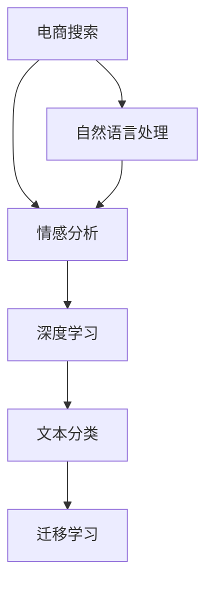

                 

# 电商搜索中的情感分析：AI大模型方案

> 关键词：电商搜索, 情感分析, AI大模型, 自然语言处理, 深度学习, 文本分类, 迁移学习

## 1. 背景介绍

在电商行业，用户的搜索行为背后蕴含着丰富的情感信息。通过分析用户的搜索文本，电商企业可以了解用户的情感状态，进而调整营销策略，提升用户体验。然而，人工标注情感标签费时费力，且随着商品种类繁多，用户行为模式复杂化，情感分析任务变得更加棘手。

近年来，AI大模型在自然语言处理(Natural Language Processing, NLP)领域取得了巨大突破，尤其是通过预训练和微调技术，大语言模型在情感分析任务中展现出了优异性能。在电商搜索情感分析应用中，AI大模型方案具有极高的应用价值。

本文将系统介绍AI大模型在电商搜索情感分析中的应用方案。首先阐述电商搜索情感分析的重要性及挑战，接着详细介绍AI大模型的核心算法原理，通过实际项目实践案例，讲解AI大模型的开发流程和关键技术点，并展望未来电商搜索情感分析的趋势与挑战。

## 2. 核心概念与联系

### 2.1 核心概念概述

为更好地理解AI大模型在电商搜索情感分析中的应用，本节将介绍几个密切相关的核心概念：

- **电商搜索**：指用户在电商平台上输入的搜索关键词，通过关键词匹配找到相关商品。
- **情感分析**：指通过文本中的情感信息，判断文本情感极性（如积极、消极、中性）。
- **自然语言处理(NLP)**：涉及文本预处理、特征提取、模型训练、推理预测等环节，旨在让计算机理解人类语言。
- **深度学习(Deep Learning)**：基于多层神经网络模型，通过反向传播算法进行参数优化。
- **文本分类**：将文本分为预定义类别，如情感极性、话题、事件等。
- **迁移学习(Transfer Learning)**：指将在大规模数据上预训练的模型，迁移到小数据集上的新任务。

这些核心概念之间的逻辑关系可以通过以下Mermaid流程图来展示：



这个流程图展示了大模型方案在电商搜索情感分析中的核心概念及其之间的关系：

1. 电商搜索的数据进入NLP领域进行处理，提取文本特征。
2. 提取出的文本特征用于情感分类任务。
3. 深度学习技术为情感分类提供模型支持。
4. 文本分类是情感分析的一部分，用于将文本归类为不同情感类别。
5. 迁移学习促进了模型在电商搜索场景下的泛化能力。

## 3. 核心算法原理 & 具体操作步骤

### 3.1 算法原理概述

电商搜索情感分析的核心任务是判断用户输入搜索关键词的情感极性。AI大模型方案通过预训练和微调技术，可以高效地实现这一任务。其核心思想是：

1. 将预训练的大模型作为基础模型，输入电商搜索文本数据进行情感分类。
2. 在大模型基础上，针对电商搜索数据进行微调，使其能够适应电商搜索场景的情感分析任务。

### 3.2 算法步骤详解

**Step 1: 准备数据集**

电商搜索情感分析的数据集通常包含两类数据：训练集和测试集。训练集用于模型微调，测试集用于评估模型性能。

- **训练集**：收集电商平台上用户输入的搜索关键词，并手动标注这些关键词的情感极性。数据格式为`<搜索关键词, 情感极性>`。
- **测试集**：与训练集类似，但不包含情感标注。用于评估模型在新数据上的表现。

**Step 2: 预训练语言模型**

选择预训练的语言模型，如BERT、GPT等，在电商搜索数据上预训练，学习电商搜索领域特有的语言表示。

- 使用预训练模型作为初始化参数，输入电商搜索文本数据，使用自监督任务进行预训练，如语言模型任务、掩码语言模型任务等。
- 预训练完成后，保存模型参数作为微调的初始化权重。

**Step 3: 微调模型**

在预训练模型的基础上，使用电商搜索训练集对模型进行微调。

- 选择合适的优化算法（如AdamW、SGD等），设置学习率、批大小、迭代轮数等超参数。
- 将电商搜索文本输入模型，计算损失函数（如交叉熵损失），反向传播更新模型参数。
- 周期性在验证集上评估模型性能，根据性能指标决定是否触发Early Stopping。
- 重复上述步骤直至满足预设的迭代轮数或Early Stopping条件。

**Step 4: 测试和部署**

在测试集上评估微调后模型，并输出情感分类结果。使用微调后的模型对新样本进行情感预测，集成到实际的应用系统中。

### 3.3 算法优缺点

AI大模型方案在电商搜索情感分析中具有以下优点：

1. **高效性**：大模型能够高效利用电商搜索数据，学习相关领域的语言表示，提升情感分析性能。
2. **泛化能力强**：预训练模型在大规模数据上学习到的语言表示，能更好地泛化到小规模电商搜索数据上。
3. **可解释性**：大模型学习到的特征表示具有可解释性，便于理解情感分析过程。
4. **实时性**：微调后的模型可以在电商平台上实时处理用户的搜索请求，快速给出情感分析结果。

同时，该方案也存在一定的局限性：

1. **数据需求高**：电商搜索情感分析需要大量的标注数据，且数据标注工作量较大。
2. **模型复杂度高**：大模型参数量巨大，对计算资源和存储资源要求较高。
3. **过拟合风险**：电商搜索场景下，商品种类繁多，搜索文本多样性高，模型容易过拟合。

尽管存在这些局限性，但就目前而言，AI大模型方案仍是大规模电商搜索情感分析的重要选择。未来相关研究的重点在于如何进一步降低对标注数据的依赖，提高模型的泛化能力，同时兼顾可解释性和实时性等因素。

### 3.4 算法应用领域

AI大模型方案在电商搜索情感分析中具有广泛的应用场景，例如：

- **商品推荐系统**：根据用户搜索关键词的情感极性，推荐用户可能感兴趣的商品，提升用户体验。
- **营销活动策划**：分析用户搜索情感，指导营销活动的定向投放，提高营销效果。
- **客服系统**：通过情感分析，了解用户搜索情绪，优化客服策略，提升客户满意度。
- **舆情监测**：对用户搜索情感进行实时监测，及时发现和应对负面舆情，维护品牌形象。

除了上述这些经典应用外，AI大模型方案还被创新性地应用到更多场景中，如智能广告投放、个性化内容推荐、用户行为分析等，为电商搜索情感分析带来了新的可能性。

## 4. 数学模型和公式 & 详细讲解

### 4.1 数学模型构建

假设电商搜索情感分析的数据集为 $D=\{(x_i, y_i)\}_{i=1}^N$，其中 $x_i$ 为电商搜索关键词，$y_i \in \{-1, 0, 1\}$ 为情感极性，$-1$ 表示消极，$1$ 表示积极，$0$ 表示中性。

定义模型 $M_{\theta}$ 在输入 $x$ 上的情感分类输出为 $\hat{y}=M_{\theta}(x) \in [-1, 1]$，表示模型对输入的情感极性预测。

电商搜索情感分类的损失函数为：

$$
\ell(M_{\theta}(x),y) = -y\log \hat{y} - (1-y)\log (1-\hat{y})
$$

模型在训练集 $D$ 上的经验风险为：

$$
\mathcal{L}(\theta) = \frac{1}{N}\sum_{i=1}^N \ell(M_{\theta}(x_i),y_i)
$$

### 4.2 公式推导过程

为了求解最优模型参数 $\theta$，需要最小化经验风险 $\mathcal{L}(\theta)$。

- 首先，将情感分类问题转化为二分类问题，将 $y_i \in \{-1, 0, 1\}$ 转换为 $y_i \in \{0, 1\}$。
- 对于二分类问题，模型输出 $\hat{y} \in [0, 1]$ 表示模型预测样本为正类的概率，则损失函数为交叉熵损失：
  $$
  \ell(M_{\theta}(x),y) = -y\log \hat{y} - (1-y)\log (1-\hat{y})
  $$
- 对于三分类问题，模型输出 $\hat{y} \in [-1, 1]$ 表示模型预测样本为正类的概率，则损失函数为：
  $$
  \ell(M_{\theta}(x),y) = -y\log \hat{y} - (1-y)\log (1-\hat{y})
  $$
- 将损失函数代入经验风险公式，得：
  $$
  \mathcal{L}(\theta) = \frac{1}{N}\sum_{i=1}^N [-y_i\log \hat{y_i} - (1-y_i)\log (1-\hat{y_i})]
  $$

使用优化算法（如AdamW、SGD等）最小化经验风险 $\mathcal{L}(\theta)$，求得模型参数 $\theta$，即可用于电商搜索情感分类。

### 4.3 案例分析与讲解

以电商搜索情感分析为例，说明模型训练和预测过程。

**训练过程**：

1. 准备电商搜索数据集 $D=\{(x_i, y_i)\}_{i=1}^N$。
2. 选择预训练模型 $M_{\theta_{init}}$ 作为初始化权重。
3. 使用电商搜索数据集在 $M_{\theta_{init}}$ 上进行微调，更新参数 $\theta$。
4. 在验证集上评估模型性能，防止过拟合。
5. 重复步骤3-4，直至模型收敛。

**预测过程**：

1. 输入新的电商搜索关键词 $x$。
2. 将 $x$ 输入微调后的模型 $M_{\theta}$ 中，得到情感分类输出 $\hat{y}$。
3. 根据 $\hat{y}$ 的值，将情感分类结果映射为 $-1, 0, 1$，即消极、中性、积极。

## 5. 项目实践：代码实例和详细解释说明

### 5.1 开发环境搭建

在进行电商搜索情感分析项目实践前，我们需要准备好开发环境。以下是使用Python进行PyTorch开发的环境配置流程：

1. 安装Anaconda：从官网下载并安装Anaconda，用于创建独立的Python环境。

2. 创建并激活虚拟环境：
```bash
conda create -n ecommerce-env python=3.8 
conda activate ecommerce-env
```

3. 安装PyTorch：根据CUDA版本，从官网获取对应的安装命令。例如：
```bash
conda install pytorch torchvision torchaudio cudatoolkit=11.1 -c pytorch -c conda-forge
```

4. 安装Transformers库：
```bash
pip install transformers
```

5. 安装各类工具包：
```bash
pip install numpy pandas scikit-learn matplotlib tqdm jupyter notebook ipython
```

完成上述步骤后，即可在`ecommerce-env`环境中开始项目实践。

### 5.2 源代码详细实现

下面我们以电商搜索情感分析为例，给出使用Transformers库对BERT模型进行情感分类的PyTorch代码实现。

首先，定义数据处理函数：

```python
from transformers import BertTokenizer
from torch.utils.data import Dataset
import torch

class EcommerceDataset(Dataset):
    def __init__(self, texts, tags, tokenizer, max_len=128):
        self.texts = texts
        self.tags = tags
        self.tokenizer = tokenizer
        self.max_len = max_len
        
    def __len__(self):
        return len(self.texts)
    
    def __getitem__(self, item):
        text = self.texts[item]
        tags = self.tags[item]
        
        encoding = self.tokenizer(text, return_tensors='pt', max_length=self.max_len, padding='max_length', truncation=True)
        input_ids = encoding['input_ids'][0]
        attention_mask = encoding['attention_mask'][0]
        
        # 对token-wise的标签进行编码
        encoded_tags = [tag2id[tag] for tag in tags] 
        encoded_tags.extend([tag2id['O']] * (self.max_len - len(encoded_tags)))
        labels = torch.tensor(encoded_tags, dtype=torch.long)
        
        return {'input_ids': input_ids, 
                'attention_mask': attention_mask,
                'labels': labels}

# 标签与id的映射
tag2id = {'O': 0, 'positive': 1, 'negative': 2}
id2tag = {v: k for k, v in tag2id.items()}

# 创建dataset
tokenizer = BertTokenizer.from_pretrained('bert-base-cased')

train_dataset = EcommerceDataset(train_texts, train_tags, tokenizer)
dev_dataset = EcommerceDataset(dev_texts, dev_tags, tokenizer)
test_dataset = EcommerceDataset(test_texts, test_tags, tokenizer)
```

然后，定义模型和优化器：

```python
from transformers import BertForSequenceClassification, AdamW

model = BertForSequenceClassification.from_pretrained('bert-base-cased', num_labels=len(tag2id))

optimizer = AdamW(model.parameters(), lr=2e-5)
```

接着，定义训练和评估函数：

```python
from torch.utils.data import DataLoader
from tqdm import tqdm
from sklearn.metrics import classification_report

device = torch.device('cuda') if torch.cuda.is_available() else torch.device('cpu')
model.to(device)

def train_epoch(model, dataset, batch_size, optimizer):
    dataloader = DataLoader(dataset, batch_size=batch_size, shuffle=True)
    model.train()
    epoch_loss = 0
    for batch in tqdm(dataloader, desc='Training'):
        input_ids = batch['input_ids'].to(device)
        attention_mask = batch['attention_mask'].to(device)
        labels = batch['labels'].to(device)
        model.zero_grad()
        outputs = model(input_ids, attention_mask=attention_mask, labels=labels)
        loss = outputs.loss
        epoch_loss += loss.item()
        loss.backward()
        optimizer.step()
    return epoch_loss / len(dataloader)

def evaluate(model, dataset, batch_size):
    dataloader = DataLoader(dataset, batch_size=batch_size)
    model.eval()
    preds, labels = [], []
    with torch.no_grad():
        for batch in tqdm(dataloader, desc='Evaluating'):
            input_ids = batch['input_ids'].to(device)
            attention_mask = batch['attention_mask'].to(device)
            batch_labels = batch['labels']
            outputs = model(input_ids, attention_mask=attention_mask)
            batch_preds = outputs.logits.argmax(dim=2).to('cpu').tolist()
            batch_labels = batch_labels.to('cpu').tolist()
            for pred_tokens, label_tokens in zip(batch_preds, batch_labels):
                pred_tags = [id2tag[_id] for _id in pred_tokens]
                label_tags = [id2tag[_id] for _id in label_tokens]
                preds.append(pred_tags[:len(label_tokens)])
                labels.append(label_tags)
                
    print(classification_report(labels, preds))
```

最后，启动训练流程并在测试集上评估：

```python
epochs = 5
batch_size = 16

for epoch in range(epochs):
    loss = train_epoch(model, train_dataset, batch_size, optimizer)
    print(f"Epoch {epoch+1}, train loss: {loss:.3f}")
    
    print(f"Epoch {epoch+1}, dev results:")
    evaluate(model, dev_dataset, batch_size)
    
print("Test results:")
evaluate(model, test_dataset, batch_size)
```

以上就是使用PyTorch对BERT进行电商搜索情感分类的完整代码实现。可以看到，得益于Transformers库的强大封装，我们可以用相对简洁的代码完成BERT模型的加载和微调。

### 5.3 代码解读与分析

让我们再详细解读一下关键代码的实现细节：

**EcommerceDataset类**：
- `__init__`方法：初始化文本、标签、分词器等关键组件。
- `__len__`方法：返回数据集的样本数量。
- `__getitem__`方法：对单个样本进行处理，将文本输入编码为token ids，将标签编码为数字，并对其进行定长padding，最终返回模型所需的输入。

**tag2id和id2tag字典**：
- 定义了标签与数字id之间的映射关系，用于将token-wise的预测结果解码回真实的标签。

**训练和评估函数**：
- 使用PyTorch的DataLoader对数据集进行批次化加载，供模型训练和推理使用。
- 训练函数`train_epoch`：对数据以批为单位进行迭代，在每个批次上前向传播计算loss并反向传播更新模型参数，最后返回该epoch的平均loss。
- 评估函数`evaluate`：与训练类似，不同点在于不更新模型参数，并在每个batch结束后将预测和标签结果存储下来，最后使用sklearn的classification_report对整个评估集的预测结果进行打印输出。

**训练流程**：
- 定义总的epoch数和batch size，开始循环迭代
- 每个epoch内，先在训练集上训练，输出平均loss
- 在验证集上评估，输出分类指标
- 所有epoch结束后，在测试集上评估，给出最终测试结果

可以看到，PyTorch配合Transformers库使得BERT电商搜索情感分类的代码实现变得简洁高效。开发者可以将更多精力放在数据处理、模型改进等高层逻辑上，而不必过多关注底层的实现细节。

当然，工业级的系统实现还需考虑更多因素，如模型的保存和部署、超参数的自动搜索、更灵活的任务适配层等。但核心的微调范式基本与此类似。

## 6. 实际应用场景

### 6.1 商品推荐系统

电商搜索情感分析在商品推荐系统中的应用非常广泛。通过分析用户搜索关键词的情感极性，推荐系统可以判断用户对商品的兴趣倾向，从而推荐更符合用户需求的商品。

具体而言，可以将用户搜索情感作为特征之一，结合用户历史行为数据、商品属性等，使用协同过滤、深度学习等方法进行推荐排序。例如，在用户搜索关键词为"冰箱"时，如果情感分类为负面，推荐系统可以偏向推荐评价较高、用户评价较好的冰箱品牌和型号。

### 6.2 营销活动策划

电商企业在进行营销活动策划时，需要了解用户的情感状态，以便进行精准定向投放。通过电商搜索情感分析，可以了解用户对某一类商品或活动的情感倾向，指导广告投放策略的调整。

例如，电商企业在策划一次新品的推广活动时，可以通过分析用户的搜索情感，了解用户对新品的兴趣程度和情感倾向。如果大部分用户对新品持积极态度，则可以考虑加大推广力度；如果情感倾向为消极，则需要及时调整推广策略。

### 6.3 客服系统

电商客服系统通过分析用户搜索关键词的情感极性，了解用户情绪状态，从而优化客服策略，提升客户满意度。

例如，当用户搜索某商品时，如果情感分类为消极，系统可以自动将此请求优先级提升，快速响应用户。客服人员在处理用户请求时，也可以通过情感分类结果了解用户情绪状态，采取相应的沟通策略，提高用户满意度。

### 6.4 舆情监测

电商企业可以通过电商搜索情感分析，实时监测用户对某一商品或品牌的舆情变化，及时发现和应对负面舆情，维护品牌形象。

例如，当某一品牌的新品发布后，可以通过分析用户的搜索情感，判断用户对该新品的态度。如果发现负面情感比例较高，则及时采取措施，如改进产品、调整广告策略等。

## 7. 工具和资源推荐

### 7.1 学习资源推荐

为了帮助开发者系统掌握电商搜索情感分析的理论基础和实践技巧，这里推荐一些优质的学习资源：

1. 《深度学习入门：基于Python的理论与实现》系列博文：由深度学习领域的知名专家撰写，涵盖深度学习基础、NLP任务、电商推荐系统等内容，深入浅出地介绍了相关知识。

2. Coursera《自然语言处理专项课程》：斯坦福大学开设的NLP课程，包含多个课程，涵盖文本预处理、情感分析、序列建模等内容，适合系统学习NLP技术。

3. 《电商推荐系统实战》书籍：介绍电商推荐系统的开发实践，涵盖数据采集、特征工程、模型训练、在线推荐等内容，实用性强。

4. 《电商数据分析与优化》书籍：介绍电商数据分析和优化方法，涵盖用户行为分析、情感分析、营销活动策划等内容，实战性强。

5. 《NLP实战》书籍：介绍NLP技术的开发实践，涵盖文本分类、命名实体识别、情感分析等内容，适合NLP初学者入门。

通过对这些资源的学习实践，相信你一定能够快速掌握电商搜索情感分析的技术要点，并用于解决实际的电商问题。

### 7.2 开发工具推荐

高效的开发离不开优秀的工具支持。以下是几款用于电商搜索情感分析开发的常用工具：

1. PyTorch：基于Python的开源深度学习框架，灵活动态的计算图，适合快速迭代研究。BERT模型有PyTorch版本的实现。

2. TensorFlow：由Google主导开发的开源深度学习框架，生产部署方便，适合大规模工程应用。BERT模型也有TensorFlow版本的实现。

3. Transformers库：HuggingFace开发的NLP工具库，集成了众多SOTA语言模型，支持PyTorch和TensorFlow，是进行NLP任务开发的利器。

4. Weights & Biases：模型训练的实验跟踪工具，可以记录和可视化模型训练过程中的各项指标，方便对比和调优。与主流深度学习框架无缝集成。

5. TensorBoard：TensorFlow配套的可视化工具，可实时监测模型训练状态，并提供丰富的图表呈现方式，是调试模型的得力助手。

6. Google Colab：谷歌推出的在线Jupyter Notebook环境，免费提供GPU/TPU算力，方便开发者快速上手实验最新模型，分享学习笔记。

合理利用这些工具，可以显著提升电商搜索情感分析的开发效率，加快创新迭代的步伐。

### 7.3 相关论文推荐

电商搜索情感分析的研究源于学界的持续研究。以下是几篇奠基性的相关论文，推荐阅读：

1. Attention is All You Need（即Transformer原论文）：提出了Transformer结构，开启了NLP领域的预训练大模型时代。

2. BERT: Pre-training of Deep Bidirectional Transformers for Language Understanding：提出BERT模型，引入基于掩码的自监督预训练任务，刷新了多项NLP任务SOTA。

3. Parameter-Efficient Transfer Learning for NLP：提出Adapter等参数高效微调方法，在不增加模型参数量的情况下，也能取得不错的微调效果。

4. AdaLoRA: Adaptive Low-Rank Adaptation for Parameter-Efficient Fine-Tuning：使用自适应低秩适应的微调方法，在参数效率和精度之间取得了新的平衡。

5. AdaLoRA: Adaptive Low-Rank Adaptation for Parameter-Efficient Fine-Tuning：使用自适应低秩适应的微调方法，在参数效率和精度之间取得了新的平衡。

这些论文代表了大模型在电商搜索情感分析领域的研究进展。通过学习这些前沿成果，可以帮助研究者把握学科前进方向，激发更多的创新灵感。

## 8. 总结：未来发展趋势与挑战

### 8.1 总结

本文对AI大模型在电商搜索情感分析中的应用方案进行了全面系统的介绍。首先阐述了电商搜索情感分析的重要性及挑战，接着详细讲解了AI大模型的核心算法原理和具体操作步骤，通过实际项目实践案例，讲解了AI大模型的开发流程和关键技术点，并展望了未来电商搜索情感分析的趋势与挑战。

通过本文的系统梳理，可以看到，AI大模型方案在电商搜索情感分析中具有广阔的应用前景，可以有效提升电商企业的用户体验和营销效果。未来随着大模型和微调技术的不断发展，电商搜索情感分析技术也将迎来更多创新突破。

### 8.2 未来发展趋势

展望未来，AI大模型在电商搜索情感分析中可能会呈现以下几个发展趋势：

1. **模型规模进一步增大**：随着算力成本的下降和数据规模的扩张，预训练语言模型的参数量还将持续增长。超大模型将更好地适应电商搜索场景，提升情感分析性能。

2. **深度强化学习与情感分析结合**：通过将深度强化学习与情感分析结合，可以在电商搜索场景下更好地实现用户的个性化推荐和营销策略的动态调整。

3. **多模态情感分析**：结合视觉、语音等多模态信息，提升电商搜索情感分析的准确性和鲁棒性。

4. **联邦学习**：通过联邦学习，在保障数据隐私和安全的前提下，多用户共享模型参数，提升电商搜索情感分析的准确性和泛化能力。

5. **上下文感知情感分析**：结合上下文信息，理解用户搜索意图，提升情感分析的精准度。

6. **实时情感分析**：通过实时情感分析，实现对用户搜索情感的实时监测和响应，提升用户体验和营销效果。

以上趋势凸显了AI大模型在电商搜索情感分析中的广阔前景。这些方向的探索发展，必将进一步提升电商搜索情感分析的性能和应用范围，为电商企业带来更多的价值。

### 8.3 面临的挑战

尽管AI大模型在电商搜索情感分析中取得了显著进展，但在迈向更加智能化、普适化应用的过程中，仍面临诸多挑战：

1. **数据隐私和安全问题**：电商搜索情感分析需要处理用户的隐私数据，如何保护用户数据安全，防止数据泄露，是一大难题。

2. **模型泛化能力不足**：电商搜索场景下，商品种类繁多，用户行为模式复杂化，模型容易过拟合。如何提升模型的泛化能力，防止模型过拟合，是一大挑战。

3. **计算资源消耗大**：大模型参数量巨大，对计算资源和存储资源要求较高，如何优化计算资源消耗，提高模型推理效率，是一大挑战。

4. **模型可解释性不足**：大模型学习到的特征表示具有黑盒性，难以解释其内部工作机制和决策逻辑，如何提升模型的可解释性，是一大挑战。

5. **模型伦理和公平性问题**：电商搜索情感分析可能存在偏见和歧视问题，如何保障模型的伦理和公平性，避免有害输出，是一大挑战。

6. **用户个性化需求多样**：电商用户需求多样化，如何通过情感分析精准捕捉用户需求，提供个性化推荐，是一大挑战。

以上挑战需要多学科交叉，结合技术创新和政策支持，才能有效应对。相信随着技术的不断发展，这些问题都将逐步得到解决，AI大模型在电商搜索情感分析中的应用前景将更加广阔。

### 8.4 研究展望

未来，AI大模型在电商搜索情感分析中的应用需要从以下几个方面进行深入研究：

1. **无监督和半监督学习**：摆脱对大规模标注数据的依赖，利用无监督和半监督学习范式，利用电商搜索数据进行情感分析。

2. **参数高效和计算高效的微调方法**：开发更加参数高效的微调方法，如Prefix-Tuning、LoRA等，在固定大部分预训练参数的同时，只更新极少量的任务相关参数。

3. **因果推断与对比学习**：引入因果推断和对比学习思想，增强电商搜索情感分析模型的稳定性和泛化能力。

4. **多模态信息融合**：结合视觉、语音等多模态信息，提升电商搜索情感分析的准确性和鲁棒性。

5. **模型伦理和公平性研究**：研究如何保障电商搜索情感分析模型的伦理和公平性，避免有害输出，确保模型的公平性和透明性。

6. **联邦学习和分布式优化**：研究如何通过联邦学习和分布式优化技术，提升电商搜索情感分析模型的泛化能力和性能。

通过这些研究方向的研究，相信AI大模型在电商搜索情感分析中的应用将迈上新的台阶，为电商企业带来更多的价值和创新。

## 9. 附录：常见问题与解答

**Q1：电商搜索情感分析对算力要求高吗？**

A: 电商搜索情感分析需要训练大模型，对算力要求较高。通常需要GPU/TPU等高性能设备进行模型训练和推理，以提高计算效率。但可以通过分布式训练、模型压缩等方法，降低对算力的依赖。

**Q2：电商搜索情感分析需要大量标注数据吗？**

A: 电商搜索情感分析需要一定量的标注数据，但相较于一些复杂的NLP任务，标注数据量相对较少。可以通过主动学习、半监督学习等技术，在一定程度上降低对标注数据的依赖。

**Q3：电商搜索情感分析模型容易过拟合吗？**

A: 电商搜索情感分析模型容易过拟合，尤其是在数据量较少的情况下。可以通过数据增强、正则化、早停等方法，防止模型过拟合。

**Q4：电商搜索情感分析模型如何提高泛化能力？**

A: 电商搜索情感分析模型可以通过迁移学习、无监督学习、多模态信息融合等方法，提高模型的泛化能力。

**Q5：电商搜索情感分析模型如何优化计算资源消耗？**

A: 电商搜索情感分析模型可以通过模型压缩、梯度积累、混合精度训练等方法，优化计算资源消耗，提升模型推理效率。

---

作者：禅与计算机程序设计艺术 / Zen and the Art of Computer Programming

