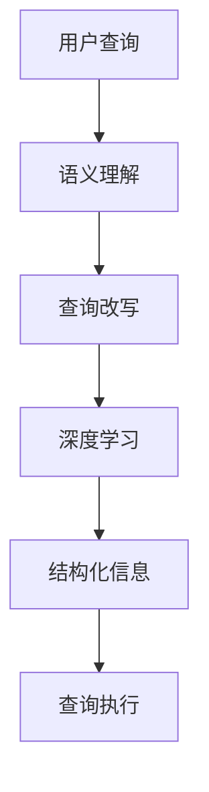
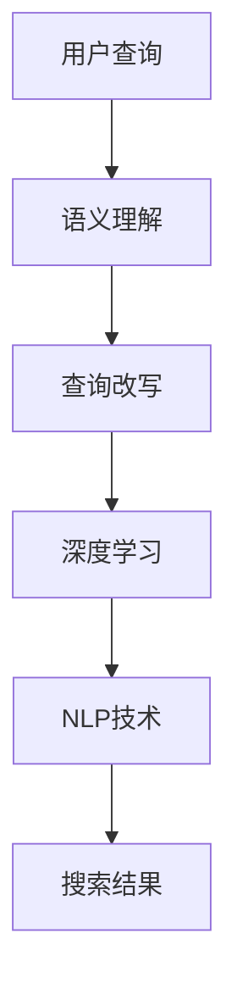

                 

# 电商搜索中的语义理解与查询改写技术

> 关键词：语义理解,查询改写,自然语言处理(NLP),电商搜索,信息检索,深度学习,神经网络

## 1. 背景介绍

### 1.1 问题由来

随着互联网和电子商务的快速发展，电商搜索已成为消费者获取商品信息的重要渠道。然而，传统的关键词搜索方法往往存在语义模糊、结果相关性低等缺陷，无法满足用户日益提升的搜索体验需求。因此，提升电商搜索的语义理解能力，进行有效的查询改写，是当前电商领域面临的重要课题。

近年来，自然语言处理（NLP）技术的迅猛发展，特别是预训练语言模型（如BERT、GPT等）在各种任务上取得了巨大突破。这些模型通过大规模无监督学习，具备强大的语义理解能力，能够较好地处理自然语言中的语义信息。将这一技术引入电商搜索，可以显著提升搜索的准确性和用户体验，使得电商搜索向更加智能化、个性化迈进。

### 1.2 问题核心关键点

语义理解与查询改写技术，本质上是对自然语言进行语义分析和改写，以提升搜索的准确性和相关性。核心关键点包括：

1. **语义理解**：从用户查询中提取关键信息，理解用户意图。
2. **查询改写**：将模糊、不明确的查询改写为更具体、相关的查询表达式。
3. **深度学习**：利用深度学习模型进行语义理解与查询改写，提升处理效率和效果。
4. **自然语言处理**：将自然语言转换为结构化信息，进行语义分析。

以下Mermaid流程图展示了语义理解与查询改写的核心流程：



通过深度学习和自然语言处理技术，电商搜索系统可以更好地理解用户查询，并自动改写为更符合搜索语义的查询表达式，从而提高搜索结果的相关性和用户满意度。

### 1.3 问题研究意义

电商搜索中的语义理解与查询改写技术，具有以下重要意义：

1. **提升搜索体验**：通过准确理解用户查询意图，提供更个性化、精准的搜索结果，显著提升用户搜索体验。
2. **增加用户满意度**：高效处理模糊、歧义查询，减少用户搜索时长，增加用户粘性。
3. **提高转化率**：通过更相关的搜索结果，增加商品展示和点击率，提升电商平台的销售转化率。
4. **优化资源利用**：减少无效搜索，优化搜索系统的资源利用率，降低运营成本。
5. **推动电商创新**：为电商平台提供更智能化的搜索解决方案，推动电商行业向智慧化、个性化方向发展。

## 2. 核心概念与联系

### 2.1 核心概念概述

为更好地理解电商搜索中的语义理解与查询改写技术，本节将介绍几个密切相关的核心概念：

- **语义理解(Semantic Understanding)**：指通过自然语言处理技术，理解用户查询中的语义信息，提取关键实体、关系和意图。
- **查询改写(Query Rewriting)**：将模糊、不明确的查询改写为具体、相关的查询表达式，提高搜索结果的相关性和准确性。
- **深度学习(Deep Learning)**：利用深度神经网络对自然语言进行处理，提升语义理解与查询改写的效果。
- **自然语言处理(NLP)**：涉及自然语言的生成、理解、分析和处理，是语义理解与查询改写的技术基础。

这些核心概念之间的逻辑关系可以通过以下Mermaid流程图来展示：



这个流程图展示了大语言模型在电商搜索中的应用流程：

1. 用户输入查询。
2. 通过语义理解技术提取查询中的关键信息。
3. 利用查询改写技术将模糊查询改写为具体查询。
4. 应用深度学习模型进行语义分析和改写。
5. 通过自然语言处理技术生成结构化信息。
6. 最终生成搜索结果。

## 3. 核心算法原理 & 具体操作步骤

### 3.1 算法原理概述

电商搜索中的语义理解与查询改写技术，主要是通过自然语言处理（NLP）和深度学习模型来实现。其核心思想是：

- **语义理解**：利用预训练语言模型（如BERT、GPT等）对用户查询进行语义分析，提取关键实体、关系和意图。
- **查询改写**：通过改写技术将模糊、不明确的查询转换为具体的查询表达式，提升搜索效果。
- **深度学习**：使用深度神经网络进行语义分析与改写，提升处理效率和效果。

### 3.2 算法步骤详解

以下是电商搜索中语义理解与查询改写的具体操作步骤：

**Step 1: 数据预处理**

1. **数据收集**：收集电商平台的搜索查询数据，进行清洗和标注。标注数据可以包括查询意图、查询实体等信息。
2. **数据划分**：将数据划分为训练集、验证集和测试集，用于模型训练、验证和测试。

**Step 2: 构建语义理解模型**

1. **选择模型**：选择合适的预训练语言模型，如BERT、GPT等，作为初始化参数。
2. **任务适配**：根据电商搜索任务的特点，设计任务适配层，如分类层、实体识别层等。
3. **微调模型**：使用训练集数据，对预训练模型进行微调，提升其在电商搜索任务上的语义理解能力。

**Step 3: 查询改写**

1. **模糊查询识别**：对用户查询进行语义分析，识别模糊、不明确的查询。
2. **查询改写规则**：设计查询改写规则，如同义词替换、补全等，提高查询的准确性和相关性。
3. **改写引擎**：使用改写规则对模糊查询进行改写，生成具体的查询表达式。

**Step 4: 查询执行**

1. **搜索排序**：使用改写后的查询，执行搜索并生成搜索结果。
2. **评估结果**：通过相关性评估指标，如查询准确率、召回率、F1值等，评估改写后的查询效果。
3. **优化改写策略**：根据评估结果，不断优化查询改写规则和改写策略，提升搜索效果。

### 3.3 算法优缺点

电商搜索中的语义理解与查询改写技术具有以下优点：

1. **提高搜索效果**：通过语义理解技术，能够更好地理解用户查询意图，提供更精准的搜索结果。
2. **减少噪音查询**：模糊查询是搜索噪音的主要来源，通过查询改写技术，可以有效减少噪音查询，提升搜索效果。
3. **提升用户体验**：提高搜索结果的相关性和精准度，增加用户满意度。
4. **降低运营成本**：减少无效搜索，优化搜索系统的资源利用率，降低运营成本。

同时，该技术也存在以下缺点：

1. **依赖高质量数据**：模型效果依赖于标注数据的质量，标注数据的获取和维护成本较高。
2. **计算资源消耗大**：深度学习模型需要大量的计算资源，特别是对于大规模数据集的训练，成本较高。
3. **模型泛化能力有限**：电商搜索场景特定，模型泛化能力有限，难以应用于其他领域。
4. **改写策略复杂**：设计有效的查询改写策略复杂，需要不断迭代优化。

尽管存在这些局限性，但就目前而言，基于深度学习的语义理解与查询改写技术仍是电商搜索领域的主要范式。未来相关研究的重点在于如何进一步降低计算资源消耗，提高模型的泛化能力，同时兼顾可解释性和伦理安全性等因素。

### 3.4 算法应用领域

基于深度学习的语义理解与查询改写技术，已经在电商搜索领域得到了广泛应用，覆盖了如下主要应用场景：

1. **商品搜索**：利用语义理解技术，从用户查询中提取关键商品信息，提供精准的商品搜索结果。
2. **分类查询**：识别用户查询中的商品分类，生成相关分类查询结果，如"男装、女装"等。
3. **商品关联推荐**：通过语义理解技术，提取用户查询中的关联商品信息，生成推荐商品列表。
4. **价格搜索**：利用查询改写技术，将模糊的价格查询转换为具体的范围查询，提高搜索结果的相关性。
5. **品牌搜索**：识别品牌信息，生成相关品牌搜索结果，提高品牌搜索的精准度。

除了上述这些经典应用外，语义理解与查询改写技术还被创新性地应用于更多场景中，如基于自然语言交互的智能客服、个性化推荐系统等，为电商搜索带来了更多的创新可能。

## 4. 数学模型和公式 & 详细讲解 & 举例说明

### 4.1 数学模型构建

电商搜索中的语义理解与查询改写技术，主要涉及自然语言处理（NLP）和深度学习模型。以下以BERT为例，展示电商搜索中的语义理解数学模型。

设用户查询为 $x$，商品信息为 $y$，预训练模型为 $M_{\theta}$。假定查询改写后生成具体查询表达式为 $y'$。电商搜索的语义理解任务可以表示为：

$$
\min_{\theta} \| M_{\theta}(x) - y' \|_2
$$

其中，$\| \cdot \|_2$ 表示欧式距离，衡量模型输出与查询改写结果之间的差距。

### 4.2 公式推导过程

以下以BERT模型为例，推导语义理解任务的损失函数及其梯度计算过程。

假设模型在输入 $x$ 上的输出为 $M_{\theta}(x)$，为 $d$ 维向量。查询改写后的具体查询为 $y'$，为 $d'$ 维向量。则语义理解任务的损失函数为：

$$
\ell(x, y') = \frac{1}{N} \sum_{i=1}^N (\| M_{\theta}(x_i) - y'_i \|_2)^2
$$

其中，$N$ 为样本数，$i$ 表示样本编号。

根据链式法则，损失函数对模型参数 $\theta$ 的梯度为：

$$
\nabla_{\theta}\ell(x, y') = \frac{2}{N} \sum_{i=1}^N \left[ (M_{\theta}(x_i) - y'_i) M_{\theta}(x_i)^T \right]
$$

通过反向传播算法，可以高效计算模型的参数更新，使得模型输出逼近查询改写结果。

### 4.3 案例分析与讲解

以"什么是手机"查询为例，展示语义理解与查询改写的过程。

1. **语义理解**：通过BERT模型对查询进行语义分析，提取关键实体和意图，如"手机"。
2. **查询改写**：将查询改写为具体的查询表达式，如"手机价格"、"手机型号"、"手机品牌"等。
3. **查询执行**：使用改写后的查询，生成搜索结果，如"最新手机价格"、"热门手机型号"等。

通过这个过程，电商搜索系统能够更准确地理解用户查询意图，生成更相关、精准的搜索结果。

## 5. 项目实践：代码实例和详细解释说明

### 5.1 开发环境搭建

在进行语义理解与查询改写实践前，我们需要准备好开发环境。以下是使用Python进行PyTorch开发的环境配置流程：

1. 安装Anaconda：从官网下载并安装Anaconda，用于创建独立的Python环境。

2. 创建并激活虚拟环境：
```bash
conda create -n pytorch-env python=3.8 
conda activate pytorch-env
```

3. 安装PyTorch：根据CUDA版本，从官网获取对应的安装命令。例如：
```bash
conda install pytorch torchvision torchaudio cudatoolkit=11.1 -c pytorch -c conda-forge
```

4. 安装Transformers库：
```bash
pip install transformers
```

5. 安装各类工具包：
```bash
pip install numpy pandas scikit-learn matplotlib tqdm jupyter notebook ipython
```

完成上述步骤后，即可在`pytorch-env`环境中开始语义理解与查询改写实践。

### 5.2 源代码详细实现

下面我们以商品分类查询为例，给出使用Transformers库对BERT模型进行语义理解与查询改写的PyTorch代码实现。

首先，定义查询分类任务的数据处理函数：

```python
from transformers import BertTokenizer
from torch.utils.data import Dataset
import torch

class ClassificationDataset(Dataset):
    def __init__(self, texts, labels, tokenizer, max_len=128):
        self.texts = texts
        self.labels = labels
        self.tokenizer = tokenizer
        self.max_len = max_len
        
    def __len__(self):
        return len(self.texts)
    
    def __getitem__(self, item):
        text = self.texts[item]
        label = self.labels[item]
        
        encoding = self.tokenizer(text, return_tensors='pt', max_length=self.max_len, padding='max_length', truncation=True)
        input_ids = encoding['input_ids'][0]
        attention_mask = encoding['attention_mask'][0]
        
        # 将标签转化为独热编码
        label = torch.tensor(1 if label == 'clothing' else 0, dtype=torch.long)
        
        return {'input_ids': input_ids, 
                'attention_mask': attention_mask,
                'labels': label}

# 加载预训练模型和分词器
tokenizer = BertTokenizer.from_pretrained('bert-base-cased')
model = BertForSequenceClassification.from_pretrained('bert-base-cased', num_labels=2)

# 创建训练集、验证集和测试集
train_dataset = ClassificationDataset(train_texts, train_labels, tokenizer)
dev_dataset = ClassificationDataset(dev_texts, dev_labels, tokenizer)
test_dataset = ClassificationDataset(test_texts, test_labels, tokenizer)
```

然后，定义训练和评估函数：

```python
from torch.utils.data import DataLoader
from tqdm import tqdm
from sklearn.metrics import accuracy_score

device = torch.device('cuda') if torch.cuda.is_available() else torch.device('cpu')
model.to(device)

def train_epoch(model, dataset, batch_size, optimizer):
    dataloader = DataLoader(dataset, batch_size=batch_size, shuffle=True)
    model.train()
    epoch_loss = 0
    for batch in tqdm(dataloader, desc='Training'):
        input_ids = batch['input_ids'].to(device)
        attention_mask = batch['attention_mask'].to(device)
        labels = batch['labels'].to(device)
        model.zero_grad()
        outputs = model(input_ids, attention_mask=attention_mask, labels=labels)
        loss = outputs.loss
        epoch_loss += loss.item()
        loss.backward()
        optimizer.step()
    return epoch_loss / len(dataloader)

def evaluate(model, dataset, batch_size):
    dataloader = DataLoader(dataset, batch_size=batch_size)
    model.eval()
    preds, labels = [], []
    with torch.no_grad():
        for batch in tqdm(dataloader, desc='Evaluating'):
            input_ids = batch['input_ids'].to(device)
            attention_mask = batch['attention_mask'].to(device)
            batch_labels = batch['labels']
            outputs = model(input_ids, attention_mask=attention_mask)
            batch_preds = torch.argmax(outputs.logits, dim=1).to('cpu').tolist()
            batch_labels = batch_labels.to('cpu').tolist()
            for pred, label in zip(batch_preds, batch_labels):
                preds.append(pred)
                labels.append(label)
                
    print(f'Accuracy: {accuracy_score(labels, preds)}')
```

最后，启动训练流程并在测试集上评估：

```python
epochs = 5
batch_size = 16

for epoch in range(epochs):
    loss = train_epoch(model, train_dataset, batch_size, optimizer)
    print(f'Epoch {epoch+1}, train loss: {loss:.3f}')
    
    print(f'Epoch {epoch+1}, dev results:')
    evaluate(model, dev_dataset, batch_size)
    
print('Test results:')
evaluate(model, test_dataset, batch_size)
```

以上就是使用PyTorch对BERT进行商品分类查询的完整代码实现。可以看到，得益于Transformers库的强大封装，我们能够以较少的代码实现商品分类查询任务。

### 5.3 代码解读与分析

让我们再详细解读一下关键代码的实现细节：

**ClassificationDataset类**：
- `__init__`方法：初始化文本、标签、分词器等关键组件。
- `__len__`方法：返回数据集的样本数量。
- `__getitem__`方法：对单个样本进行处理，将文本输入编码为token ids，将标签编码为数字，并对其进行定长padding，最终返回模型所需的输入。

**训练和评估函数**：
- 使用PyTorch的DataLoader对数据集进行批次化加载，供模型训练和推理使用。
- 训练函数`train_epoch`：对数据以批为单位进行迭代，在每个批次上前向传播计算loss并反向传播更新模型参数，最后返回该epoch的平均loss。
- 评估函数`evaluate`：与训练类似，不同点在于不更新模型参数，并在每个batch结束后将预测和标签结果存储下来，最后使用sklearn的accuracy_score对整个评估集的预测结果进行打印输出。

**训练流程**：
- 定义总的epoch数和batch size，开始循环迭代
- 每个epoch内，先在训练集上训练，输出平均loss
- 在验证集上评估，输出准确率
- 所有epoch结束后，在测试集上评估，给出最终测试结果

可以看到，PyTorch配合Transformers库使得BERT模型的微调代码实现变得简洁高效。开发者可以将更多精力放在数据处理、模型改进等高层逻辑上，而不必过多关注底层的实现细节。

当然，工业级的系统实现还需考虑更多因素，如模型的保存和部署、超参数的自动搜索、更灵活的任务适配层等。但核心的微调范式基本与此类似。

## 6. 实际应用场景

### 6.1 智能客服系统

基于语义理解与查询改写技术，智能客服系统可以提供更加智能化、个性化的客户服务。传统客服往往需要配备大量人力，高峰期响应缓慢，且一致性和专业性难以保证。而使用语义理解与查询改写技术，智能客服系统能够7x24小时不间断服务，快速响应客户咨询，用自然流畅的语言解答各类常见问题。

在技术实现上，可以收集企业内部的历史客服对话记录，将问题-答复构建成监督数据，在此基础上对预训练语言模型进行微调。微调后的语言模型能够自动理解用户意图，匹配最合适的答案模板进行回复。对于客户提出的新问题，还可以接入检索系统实时搜索相关内容，动态组织生成回答。如此构建的智能客服系统，能大幅提升客户咨询体验和问题解决效率。

### 6.2 金融舆情监测

金融机构需要实时监测市场舆论动向，以便及时应对负面信息传播，规避金融风险。传统的人工监测方式成本高、效率低，难以应对网络时代海量信息爆发的挑战。基于语义理解与查询改写技术的文本分类和情感分析技术，为金融舆情监测提供了新的解决方案。

具体而言，可以收集金融领域相关的新闻、报道、评论等文本数据，并对其进行主题标注和情感标注。在此基础上对预训练语言模型进行微调，使其能够自动判断文本属于何种主题，情感倾向是正面、中性还是负面。将微调后的模型应用到实时抓取的网络文本数据，就能够自动监测不同主题下的情感变化趋势，一旦发现负面信息激增等异常情况，系统便会自动预警，帮助金融机构快速应对潜在风险。

### 6.3 个性化推荐系统

当前的推荐系统往往只依赖用户的历史行为数据进行物品推荐，无法深入理解用户的真实兴趣偏好。基于语义理解与查询改写技术的个性化推荐系统，可以更好地挖掘用户行为背后的语义信息，从而提供更精准、多样的推荐内容。

在实践中，可以收集用户浏览、点击、评论、分享等行为数据，提取和用户交互的物品标题、描述、标签等文本内容。将文本内容作为模型输入，用户的后续行为（如是否点击、购买等）作为监督信号，在此基础上微调预训练语言模型。微调后的模型能够从文本内容中准确把握用户的兴趣点。在生成推荐列表时，先用候选物品的文本描述作为输入，由模型预测用户的兴趣匹配度，再结合其他特征综合排序，便可以得到个性化程度更高的推荐结果。

### 6.4 未来应用展望

随着语义理解与查询改写技术的不断发展，其在电商搜索、智能客服、金融舆情监测、个性化推荐等多个领域的应用前景将更加广阔。

在智慧医疗领域，基于语义理解与查询改写技术的医疗问答、病历分析、药物研发等应用将提升医疗服务的智能化水平，辅助医生诊疗，加速新药开发进程。

在智能教育领域，语义理解与查询改写技术可应用于作业批改、学情分析、知识推荐等方面，因材施教，促进教育公平，提高教学质量。

在智慧城市治理中，语义理解与查询改写技术可应用于城市事件监测、舆情分析、应急指挥等环节，提高城市管理的自动化和智能化水平，构建更安全、高效的未来城市。

此外，在企业生产、社会治理、文娱传媒等众多领域，基于语义理解与查询改写技术的人工智能应用也将不断涌现，为经济社会发展注入新的动力。相信随着技术的日益成熟，语义理解与查询改写技术将成为人工智能落地应用的重要范式，推动人工智能技术向更广阔的领域加速渗透。

## 7. 工具和资源推荐
### 7.1 学习资源推荐

为了帮助开发者系统掌握语义理解与查询改写理论基础和实践技巧，这里推荐一些优质的学习资源：

1. 《自然语言处理综论》书籍：斯坦福大学自然语言处理课程的教材，系统介绍了自然语言处理的基本概念和技术。
2. 《深度学习》书籍：Ian Goodfellow等编写的深度学习经典教材，深入浅出地介绍了深度学习的基本原理和应用。
3. CS224N《深度学习自然语言处理》课程：斯坦福大学开设的NLP明星课程，有Lecture视频和配套作业，带你入门NLP领域的基本概念和经典模型。
4. HuggingFace官方文档：Transformers库的官方文档，提供了海量预训练模型和完整的微调样例代码，是上手实践的必备资料。
5. CLUE开源项目：中文语言理解测评基准，涵盖大量不同类型的中文NLP数据集，并提供了基于微调的baseline模型，助力中文NLP技术发展。

通过对这些资源的学习实践，相信你一定能够快速掌握语义理解与查询改写的精髓，并用于解决实际的NLP问题。
###  7.2 开发工具推荐

高效的开发离不开优秀的工具支持。以下是几款用于语义理解与查询改写开发的常用工具：

1. PyTorch：基于Python的开源深度学习框架，灵活动态的计算图，适合快速迭代研究。大部分预训练语言模型都有PyTorch版本的实现。
2. TensorFlow：由Google主导开发的开源深度学习框架，生产部署方便，适合大规模工程应用。同样有丰富的预训练语言模型资源。
3. Transformers库：HuggingFace开发的NLP工具库，集成了众多SOTA语言模型，支持PyTorch和TensorFlow，是进行语义理解与查询改写开发的利器。
4. Weights & Biases：模型训练的实验跟踪工具，可以记录和可视化模型训练过程中的各项指标，方便对比和调优。与主流深度学习框架无缝集成。
5. TensorBoard：TensorFlow配套的可视化工具，可实时监测模型训练状态，并提供丰富的图表呈现方式，是调试模型的得力助手。
6. Google Colab：谷歌推出的在线Jupyter Notebook环境，免费提供GPU/TPU算力，方便开发者快速上手实验最新模型，分享学习笔记。

合理利用这些工具，可以显著提升语义理解与查询改写任务的开发效率，加快创新迭代的步伐。

### 7.3 相关论文推荐

语义理解与查询改写技术的发展源于学界的持续研究。以下是几篇奠基性的相关论文，推荐阅读：

1. Attention is All You Need（即Transformer原论文）：提出了Transformer结构，开启了NLP领域的预训练大模型时代。
2. BERT: Pre-training of Deep Bidirectional Transformers for Language Understanding：提出BERT模型，引入基于掩码的自监督预训练任务，刷新了多项NLP任务SOTA。
3. Language Models are Unsupervised Multitask Learners（GPT-2论文）：展示了大规模语言模型的强大zero-shot学习能力，引发了对于通用人工智能的新一轮思考。
4. Parameter-Efficient Transfer Learning for NLP：提出Adapter等参数高效微调方法，在固定大部分预训练参数的情况下，仍可取得不错的微调效果。
5. Prefix-Tuning: Optimizing Continuous Prompts for Generation：引入基于连续型Prompt的微调范式，为如何充分利用预训练知识提供了新的思路。
6. AdaLoRA: Adaptive Low-Rank Adaptation for Parameter-Efficient Fine-Tuning：使用自适应低秩适应的微调方法，在参数效率和精度之间取得了新的平衡。

这些论文代表了大语言模型微调技术的发展脉络。通过学习这些前沿成果，可以帮助研究者把握学科前进方向，激发更多的创新灵感。

## 8. 总结：未来发展趋势与挑战

### 8.1 总结

本文对电商搜索中的语义理解与查询改写技术进行了全面系统的介绍。首先阐述了电商搜索中语义理解与查询改写的背景和意义，明确了语义理解与查询改写在电商搜索任务中的独特价值。其次，从原理到实践，详细讲解了语义理解与查询改写的数学原理和关键步骤，给出了电商搜索任务开发的完整代码实例。同时，本文还广泛探讨了语义理解与查询改写技术在智能客服、金融舆情、个性化推荐等多个领域的应用前景，展示了语义理解与查询改写技术的巨大潜力。此外，本文精选了语义理解与查询改写技术的各类学习资源，力求为读者提供全方位的技术指引。

通过本文的系统梳理，可以看到，基于深度学习的语义理解与查询改写技术正在成为电商搜索领域的重要范式，极大地提升了电商搜索的智能度和用户体验，推动了电商搜索系统的演进。未来，伴随深度学习技术的发展，语义理解与查询改写技术还将继续拓展其应用边界，为电商搜索系统带来更多的创新可能。

### 8.2 未来发展趋势

展望未来，语义理解与查询改写技术将呈现以下几个发展趋势：

1. **模型规模持续增大**：随着算力成本的下降和数据规模的扩张，预训练语言模型的参数量还将持续增长。超大规模语言模型蕴含的丰富语言知识，有望支撑更加复杂多变的电商搜索任务。
2. **多任务学习**：语义理解与查询改写技术将与更多NLP任务进行融合，如对话生成、文本摘要、命名实体识别等，进一步提升电商搜索的效果和效率。
3. **跨语言处理**：语义理解与查询改写技术将应用于多语言搜索场景，通过跨语言处理，提升电商搜索的国际化水平。
4. **个性化推荐**：与个性化推荐系统结合，通过更精准的语义理解，提供更个性化的搜索结果，提升用户满意度。
5. **情感分析**：结合情感分析技术，对电商搜索中的商品评价、用户评论等进行情感分析，提升用户对商品的真实感受和满意度。

以上趋势凸显了语义理解与查询改写技术的广阔前景。这些方向的探索发展，必将进一步提升电商搜索系统的性能和用户体验，为电商行业带来更多的商业价值和社会效益。

### 8.3 面临的挑战

尽管语义理解与查询改写技术已经取得了瞩目成就，但在迈向更加智能化、普适化应用的过程中，它仍面临着诸多挑战：

1. **依赖高质量数据**：模型效果依赖于标注数据的质量，标注数据的获取和维护成本较高。如何进一步降低计算资源消耗，提高模型的泛化能力，是未来的重要研究方向。
2. **计算资源消耗大**：深度学习模型需要大量的计算资源，特别是对于大规模数据集的训练，成本较高。如何优化计算资源配置，提高模型训练和推理效率，是未来的重要挑战。
3. **模型鲁棒性不足**：电商搜索场景特定，模型泛化能力有限，难以应用于其他领域。如何在更广泛的应用场景中提高模型鲁棒性，是未来的重要研究方向。
4. **改写策略复杂**：设计有效的查询改写策略复杂，需要不断迭代优化。如何设计更加高效、灵活的改写策略，是未来的重要挑战。
5. **可解释性不足**：语义理解与查询改写模型的内部工作机制难以解释，难以进行调试和优化。如何赋予模型更强的可解释性，是未来的重要研究方向。
6. **安全性有待保障**：预训练语言模型难免会学习到有偏见、有害的信息，通过改写传递到电商搜索任务，产生误导性、歧视性的输出，给实际应用带来安全隐患。如何从数据和算法层面消除模型偏见，避免恶意用途，确保输出的安全性，也是未来的重要挑战。

尽管存在这些挑战，但随着深度学习技术的不断发展，相信语义理解与查询改写技术将在更多领域得到应用，为人工智能技术带来更多的创新和突破。

### 8.4 研究展望

面对语义理解与查询改写所面临的种种挑战，未来的研究需要在以下几个方面寻求新的突破：

1. **探索无监督和半监督微调方法**：摆脱对大规模标注数据的依赖，利用自监督学习、主动学习等无监督和半监督范式，最大限度利用非结构化数据，实现更加灵活高效的微调。
2. **研究参数高效和计算高效的微调范式**：开发更加参数高效的微调方法，在固定大部分预训练参数的情况下，只更新极少量的任务相关参数。同时优化微调模型的计算图，减少前向传播和反向传播的资源消耗，实现更加轻量级、实时性的部署。
3. **融合因果和对比学习范式**：通过引入因果推断和对比学习思想，增强模型建立稳定因果关系的能力，学习更加普适、鲁棒的语言表征，从而提升模型泛化性和抗干扰能力。
4. **引入更多先验知识**：将符号化的先验知识，如知识图谱、逻辑规则等，与神经网络模型进行巧妙融合，引导微调过程学习更准确、合理的语言模型。同时加强不同模态数据的整合，实现视觉、语音等多模态信息与文本信息的协同建模。
5. **结合因果分析和博弈论工具**：将因果分析方法引入微调模型，识别出模型决策的关键特征，增强输出解释的因果性和逻辑性。借助博弈论工具刻画人机交互过程，主动探索并规避模型的脆弱点，提高系统稳定性。
6. **纳入伦理道德约束**：在模型训练目标中引入伦理导向的评估指标，过滤和惩罚有偏见、有害的输出倾向。同时加强人工干预和审核，建立模型行为的监管机制，确保输出符合人类价值观和伦理道德。

这些研究方向的探索，必将引领语义理解与查询改写技术迈向更高的台阶，为构建安全、可靠、可解释、可控的智能系统铺平道路。面向未来，语义理解与查询改写技术还需要与其他人工智能技术进行更深入的融合，如知识表示、因果推理、强化学习等，多路径协同发力，共同推动自然语言理解和智能交互系统的进步。只有勇于创新、敢于突破，才能不断拓展语言模型的边界，让智能技术更好地造福人类社会。

## 9. 附录：常见问题与解答

**Q1：电商搜索中的语义理解与查询改写技术是否适用于所有电商场景？**

A: 语义理解与查询改写技术在电商搜索中取得了良好的效果，但并非所有电商场景都适合应用。对于垂直领域，如B2B电商、垂直行业电商等，由于用户查询更加专业、精细，语义理解与查询改写的提升效果可能不如在大众电商场景中显著。此时需要根据具体情况，选择合适的技术方案。

**Q2：如何选择合适的语义理解模型？**

A: 选择合适的语义理解模型需要考虑多个因素，如数据量、场景复杂度、计算资源等。对于小规模数据集，可以使用预训练语言模型，如BERT、GPT等。对于大规模数据集，可以考虑使用更大规模的预训练模型，如GPT-3、T5等。同时，不同的模型结构适用于不同的任务类型，需要根据具体需求选择合适的模型。

**Q3：如何优化查询改写策略？**

A: 查询改写策略的优化是提升语义理解与查询改写效果的关键。可以从以下几个方面入手：
1. **设计多维度改写规则**：根据不同的查询类型和业务场景，设计多维度的改写规则，如同义词替换、补全、纠错等。
2. **引入先验知识**：将电商领域的专业词汇、常用表达等先验知识引入改写规则，提升改写效果。
3. **利用用户反馈**：收集用户对改写结果的反馈，不断优化改写策略，提升用户满意度。
4. **数据驱动改写**：利用用户查询数据，训练改写模型，实现自动化的改写优化。

**Q4：语义理解与查询改写技术在电商搜索中的应用前景如何？**

A: 语义理解与查询改写技术在电商搜索中的应用前景广阔。未来，随着深度学习技术的不断发展，语义理解与查询改写技术将进一步提升电商搜索的智能化和个性化水平，推动电商行业向智慧化、个性化方向发展。在智能客服、金融舆情监测、个性化推荐等更多领域，语义理解与查询改写技术也将发挥重要作用，赋能各行各业，推动人工智能技术在经济社会发展中发挥更大价值。

---

作者：禅与计算机程序设计艺术 / Zen and the Art of Computer Programming

