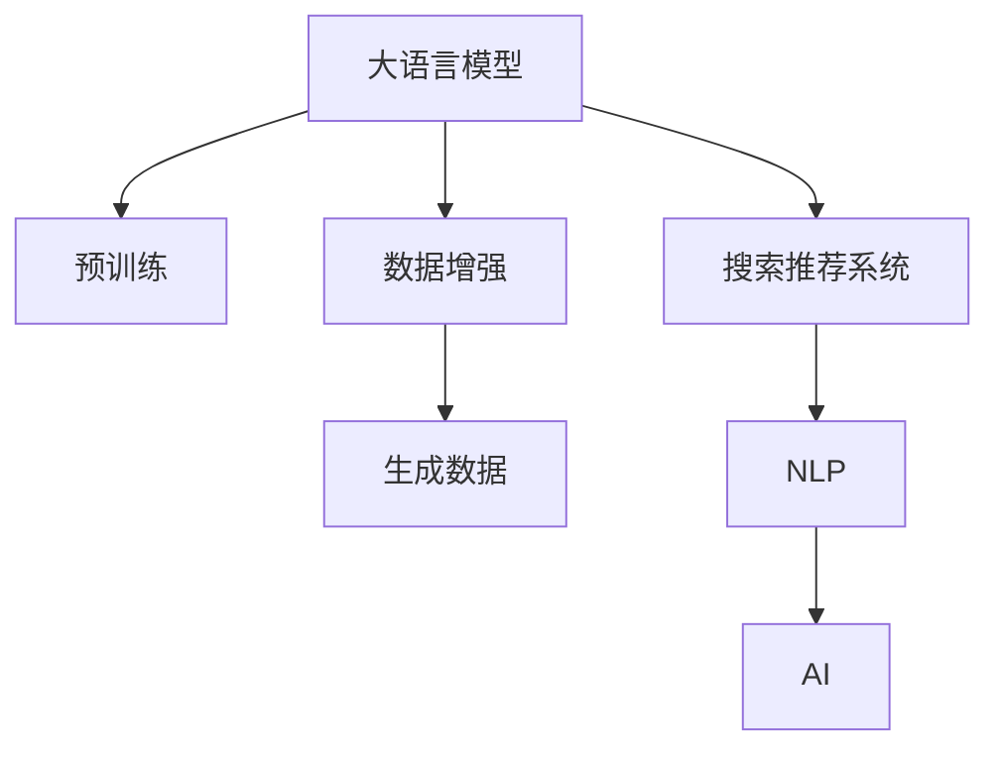

                 

# 电商搜索推荐中的AI大模型数据增强技术应用最佳实践

> 关键词：大语言模型, 数据增强, 搜索推荐系统, 自然语言处理(NLP), 人工智能, 机器学习, 电商应用

## 1. 背景介绍

### 1.1 问题由来

近年来，随着电商市场竞争日趋激烈，用户对商品搜索推荐体验的要求也日益提高。传统的基于规则或浅层机器学习模型的推荐系统难以满足复杂的用户需求和海量数据处理的要求。而基于深度学习的大模型推荐系统，以复杂的表示学习为基础，能够更好地理解用户意图和商品属性，提供更精准、个性化的推荐结果。

但大模型推荐系统面临的主要挑战是，如何高效利用大量的无标签数据，提高模型的泛化能力和学习效率。这时，数据增强技术应运而生，通过引入多种数据生成和变换技术，丰富模型的训练数据，提升模型的泛化能力，从而在电商搜索推荐等实际应用中取得更佳效果。

### 1.2 问题核心关键点

数据增强技术在大语言模型推荐系统中的应用，主要包括以下几个核心关键点：

- **数据增强**：通过多种方式生成新的数据，增加模型训练集的多样性，减少过拟合风险。
- **数据标注**：利用大模型预训练能力，对生成数据进行标注，提高数据的标注效率。
- **模型训练**：将增强数据与原始数据一起训练，利用大数据优势，提高模型的泛化能力。
- **模型部署**：将训练好的模型部署到电商搜索推荐系统中，提供高效的推荐服务。

这些关键点共同构成了一套完整的基于大语言模型数据增强技术的应用方案，使得推荐系统能够更好地利用大数据，提升推荐效果。

## 2. 核心概念与联系

### 2.1 核心概念概述

为更好地理解基于大语言模型的电商推荐系统，本节将介绍几个密切相关的核心概念：

- **大语言模型**：以自回归(如GPT)或自编码(如BERT)模型为代表的大规模预训练语言模型。通过在大规模无标签文本语料上进行预训练，学习通用的语言表示，具备强大的语言理解和生成能力。

- **预训练**：指在大规模无标签文本语料上，通过自监督学习任务训练通用语言模型的过程。常见的预训练任务包括言语建模、遮挡语言模型等。预训练使得模型学习到语言的通用表示。

- **数据增强**：指在原始数据基础上，通过各种方式生成新的数据，以增加数据集的多样性和数量，提高模型的泛化能力。

- **搜索推荐系统**：指利用机器学习技术，根据用户的行为和属性，推荐符合用户需求的商品或内容的系统。

- **自然语言处理(NLP)**：指通过计算机自动处理和理解人类语言的技术，包括文本生成、语义理解、情感分析等任务。

- **人工智能(AI)**：指利用计算机模拟人类智能行为的科技，包括机器学习、深度学习、自然语言处理等领域。

这些核心概念之间的逻辑关系可以通过以下Mermaid流程图来展示：



这个流程图展示了大语言模型的核心概念及其之间的关系：

1. 大语言模型通过预训练获得基础能力。
2. 数据增强技术丰富了模型的训练数据，提升泛化能力。
3. 生成的数据通过自然语言处理技术转换为机器学习数据。
4. 搜索推荐系统利用AI技术，推荐符合用户需求的商品或内容。

这些概念共同构成了大语言模型的学习和应用框架，使其能够在各种场景下发挥强大的语言理解和生成能力。通过理解这些核心概念，我们可以更好地把握大语言模型的工作原理和优化方向。

## 3. 核心算法原理 & 具体操作步骤

### 3.1 算法原理概述

基于大语言模型的电商搜索推荐系统的核心算法原理如下：

1. **数据增强技术**：通过对原始数据进行一系列变换和生成，扩展训练集。常见的方式包括同义词替换、近义词替换、数据合成等。

2. **预训练与微调**：利用大模型在大规模无标签数据上进行预训练，然后在电商数据上微调，以适配电商领域特定的推荐需求。

3. **模型训练与评估**：将增强后的数据与原始数据一起训练，并通过验证集和测试集对模型进行评估。

4. **推荐服务部署**：将训练好的模型部署到电商搜索推荐系统中，实时生成推荐结果，提供给用户。

### 3.2 算法步骤详解

下面将详细介绍电商搜索推荐系统中基于大语言模型的数据增强技术的实现步骤：

**Step 1: 数据预处理**

1. **数据收集**：收集电商平台的商品描述、用户行为日志、搜索记录等数据。
2. **数据清洗**：去除重复、噪声等无用数据，进行文本标准化处理。
3. **数据标注**：利用大模型对商品描述进行情感、类别等标注，生成有意义的标签。

**Step 2: 数据增强**

1. **同义词替换**：将商品描述中的词汇替换为同义词，生成新的描述数据。
2. **近义词替换**：将商品描述中的词汇替换为近义词，生成新的描述数据。
3. **数据合成**：通过数据合成技术，生成新的商品描述和用户行为数据。

**Step 3: 模型训练**

1. **模型选择**：选择合适的预训练语言模型，如BERT、GPT等。
2. **微调**：将预训练模型作为初始化参数，在电商数据上微调，以适配电商领域特定的推荐需求。
3. **优化器选择**：选择合适的优化器，如AdamW、SGD等。
4. **超参数设置**：设置学习率、批大小、迭代轮数等超参数。

**Step 4: 模型评估**

1. **评估指标**：选择合适的评估指标，如精度、召回率、F1值等。
2. **验证集评估**：在验证集上评估模型性能，根据评估结果调整模型参数。
3. **测试集评估**：在测试集上评估模型性能，最终确定模型效果。

**Step 5: 模型部署**

1. **模型保存**：将训练好的模型保存，便于后续部署。
2. **服务部署**：将模型部署到电商搜索推荐系统中，提供实时推荐服务。

### 3.3 算法优缺点

大语言模型数据增强技术在电商搜索推荐系统中的应用具有以下优点：

1. **提升泛化能力**：通过数据增强，模型能够利用更多的数据进行训练，提升泛化能力，减少过拟合风险。
2. **加速模型训练**：数据增强技术能够快速增加训练集大小，加快模型训练速度。
3. **提高推荐准确率**：增强后的数据可以更准确地反映用户需求和商品属性，提高推荐准确率。

同时，该方法也存在一些局限性：

1. **数据生成成本高**：生成高质量的增强数据需要大量计算资源和时间。
2. **数据质量难以控制**：生成数据的质量往往难以控制，可能引入噪声或错误数据。
3. **模型复杂度高**：数据增强后的模型参数量增加，计算复杂度提高。

尽管存在这些局限性，但就目前而言，大语言模型数据增强技术仍是大规模电商推荐系统的重要组成部分。未来相关研究的重点在于如何进一步降低数据生成成本，提高数据质量，以及优化模型结构，以提升推荐效果。

### 3.4 算法应用领域

基于大语言模型的数据增强技术在电商搜索推荐系统中得到广泛应用，覆盖了商品推荐、内容推荐、个性化推荐等多个方面，例如：

- **商品推荐**：根据用户搜索记录和行为日志，推荐符合用户需求的商品。通过数据增强技术，生成更多的商品描述数据，提高推荐准确率。
- **内容推荐**：根据用户浏览历史和兴趣标签，推荐相关的文章、视频等内容。通过数据增强技术，生成更多的文章和视频描述数据，丰富推荐内容的多样性。
- **个性化推荐**：根据用户个人属性和行为数据，生成个性化的推荐列表。通过数据增强技术，生成更多的用户属性和行为数据，提升推荐个性化水平。

除了上述这些经典任务外，数据增强技术也被创新性地应用到更多场景中，如广告推荐、电商销售预测等，为电商推荐系统带来了全新的突破。

## 4. 数学模型和公式 & 详细讲解  
### 4.1 数学模型构建

本节将使用数学语言对基于大语言模型的电商推荐系统进行更加严格的刻画。

记电商数据集为 $D=\{(x_i,y_i)\}_{i=1}^N, x_i \in \mathcal{X}, y_i \in \mathcal{Y}$，其中 $\mathcal{X}$ 为商品描述文本，$\mathcal{Y}$ 为推荐标签。

定义模型 $M_{\theta}$ 在输入 $x$ 上的输出为 $\hat{y}=M_{\theta}(x)$，表示模型预测的商品推荐标签。损失函数定义为交叉熵损失：

$$
\ell(M_{\theta}(x),y) = -[y\log \hat{y} + (1-y)\log (1-\hat{y})]
$$

则经验风险为：

$$
\mathcal{L}(\theta) = \frac{1}{N}\sum_{i=1}^N \ell(M_{\theta}(x_i),y_i)
$$

在电商数据集上训练模型的目标是最小化损失函数，即：

$$
\theta^* = \mathop{\arg\min}_{\theta} \mathcal{L}(\theta)
$$

其中 $\theta$ 为模型参数。

### 4.2 公式推导过程

以下我们以商品推荐任务为例，推导交叉熵损失函数及其梯度的计算公式。

假设模型 $M_{\theta}$ 在输入 $x$ 上的输出为 $\hat{y}=M_{\theta}(x) \in [0,1]$，表示商品推荐标签为正的概率。真实标签 $y \in \{0,1\}$。则二分类交叉熵损失函数定义为：

$$
\ell(M_{\theta}(x),y) = -[y\log \hat{y} + (1-y)\log (1-\hat{y})]
$$

将其代入经验风险公式，得：

$$
\mathcal{L}(\theta) = -\frac{1}{N}\sum_{i=1}^N [y_i\log M_{\theta}(x_i)+(1-y_i)\log(1-M_{\theta}(x_i))]
$$

根据链式法则，损失函数对参数 $\theta_k$ 的梯度为：

$$
\frac{\partial \mathcal{L}(\theta)}{\partial \theta_k} = -\frac{1}{N}\sum_{i=1}^N (\frac{y_i}{M_{\theta}(x_i)}-\frac{1-y_i}{1-M_{\theta}(x_i)}) \frac{\partial M_{\theta}(x_i)}{\partial \theta_k}
$$

其中 $\frac{\partial M_{\theta}(x_i)}{\partial \theta_k}$ 可进一步递归展开，利用自动微分技术完成计算。

### 4.3 案例分析与讲解

以下以电商搜索推荐系统为例，详细分析大语言模型数据增强技术的实际应用场景。

假设电商平台有 $M$ 个商品，$N$ 个用户，每个用户 $U_i$ 有 $C_i$ 个商品记录，每个商品描述文本 $x$ 通过预训练语言模型 $M_{\theta}$ 转换为向量表示 $v_x$。

在电商数据集上，用户 $U_i$ 的商品记录 $C_i$ 与商品 $M$ 之间存在一对多的映射关系。因此，电商搜索推荐系统的目标是从 $M$ 个商品中为每个用户 $U_i$ 推荐 $K$ 个商品，使得推荐结果 $y_i$ 最大化以下目标函数：

$$
\max_{y_i} \sum_{k=1}^K \log M_{\theta}(v_{x_k})
$$

其中 $v_{x_k}$ 为商品 $k$ 的向量表示。

通过数据增强技术，电商搜索推荐系统可以生成更多的商品描述数据，增加模型的训练集大小，提高模型的泛化能力。假设每次数据增强生成 $n$ 个增强数据，则总的训练集大小为 $M \times C_i + n \times M$。

在训练过程中，模型 $M_{\theta}$ 利用增强后的数据进行预训练和微调，使得推荐结果更加准确。最终，在测试集上评估推荐模型的性能，选择合适的超参数和评估指标，以确定最终的推荐模型。

## 5. 项目实践：代码实例和详细解释说明
### 5.1 开发环境搭建

在进行大语言模型数据增强技术实践前，我们需要准备好开发环境。以下是使用Python进行PyTorch开发的环境配置流程：

1. 安装Anaconda：从官网下载并安装Anaconda，用于创建独立的Python环境。

2. 创建并激活虚拟环境：
```bash
conda create -n pytorch-env python=3.8 
conda activate pytorch-env
```

3. 安装PyTorch：根据CUDA版本，从官网获取对应的安装命令。例如：
```bash
conda install pytorch torchvision torchaudio cudatoolkit=11.1 -c pytorch -c conda-forge
```

4. 安装Transformers库：
```bash
pip install transformers
```

5. 安装各类工具包：
```bash
pip install numpy pandas scikit-learn matplotlib tqdm jupyter notebook ipython
```

完成上述步骤后，即可在`pytorch-env`环境中开始数据增强实践。

### 5.2 源代码详细实现

下面我们以商品推荐任务为例，给出使用Transformers库对BERT模型进行数据增强的PyTorch代码实现。

首先，定义数据处理函数：

```python
from transformers import BertTokenizer
from torch.utils.data import Dataset
import torch

class的商品推荐Dataset(Dataset):
    def __init__(self, texts, labels, tokenizer, max_len=128):
        self.texts = texts
        self.labels = labels
        self.tokenizer = tokenizer
        self.max_len = max_len
        
    def __len__(self):
        return len(self.texts)
    
    def __getitem__(self, item):
        text = self.texts[item]
        label = self.labels[item]
        
        encoding = self.tokenizer(text, return_tensors='pt', max_length=self.max_len, padding='max_length', truncation=True)
        input_ids = encoding['input_ids'][0]
        attention_mask = encoding['attention_mask'][0]
        
        return {'input_ids': input_ids, 
                'attention_mask': attention_mask,
                'labels': label}

# 标签与id的映射
label2id = {'A': 0, 'B': 1, 'C': 2, 'D': 3}
id2label = {v: k for k, v in label2id.items()}

# 创建dataset
tokenizer = BertTokenizer.from_pretrained('bert-base-cased')

train_dataset = 商品推荐Dataset(train_texts, train_labels, tokenizer)
dev_dataset = 商品推荐Dataset(dev_texts, dev_labels, tokenizer)
test_dataset = 商品推荐Dataset(test_texts, test_labels, tokenizer)
```

然后，定义模型和优化器：

```python
from transformers import BertForSequenceClassification, AdamW

model = BertForSequenceClassification.from_pretrained('bert-base-cased', num_labels=len(label2id))

optimizer = AdamW(model.parameters(), lr=2e-5)
```

接着，定义训练和评估函数：

```python
from torch.utils.data import DataLoader
from tqdm import tqdm
from sklearn.metrics import classification_report

device = torch.device('cuda') if torch.cuda.is_available() else torch.device('cpu')
model.to(device)

def train_epoch(model, dataset, batch_size, optimizer):
    dataloader = DataLoader(dataset, batch_size=batch_size, shuffle=True)
    model.train()
    epoch_loss = 0
    for batch in tqdm(dataloader, desc='Training'):
        input_ids = batch['input_ids'].to(device)
        attention_mask = batch['attention_mask'].to(device)
        labels = batch['labels'].to(device)
        model.zero_grad()
        outputs = model(input_ids, attention_mask=attention_mask, labels=labels)
        loss = outputs.loss
        epoch_loss += loss.item()
        loss.backward()
        optimizer.step()
    return epoch_loss / len(dataloader)

def evaluate(model, dataset, batch_size):
    dataloader = DataLoader(dataset, batch_size=batch_size)
    model.eval()
    preds, labels = [], []
    with torch.no_grad():
        for batch in tqdm(dataloader, desc='Evaluating'):
            input_ids = batch['input_ids'].to(device)
            attention_mask = batch['attention_mask'].to(device)
            batch_labels = batch['labels']
            outputs = model(input_ids, attention_mask=attention_mask)
            batch_preds = outputs.logits.argmax(dim=2).to('cpu').tolist()
            batch_labels = batch_labels.to('cpu').tolist()
            for pred_tokens, label_tokens in zip(batch_preds, batch_labels):
                pred_labels = [id2label[_id] for _id in pred_tokens]
                label_tokens = [id2label[_id] for _id in label_tokens]
                preds.append(pred_labels[:len(label_tokens)])
                labels.append(label_tokens)
                
    print(classification_report(labels, preds))
```

最后，启动训练流程并在测试集上评估：

```python
epochs = 5
batch_size = 16

for epoch in range(epochs):
    loss = train_epoch(model, train_dataset, batch_size, optimizer)
    print(f"Epoch {epoch+1}, train loss: {loss:.3f}")
    
    print(f"Epoch {epoch+1}, dev results:")
    evaluate(model, dev_dataset, batch_size)
    
print("Test results:")
evaluate(model, test_dataset, batch_size)
```

以上就是使用PyTorch对BERT进行商品推荐任务数据增强的完整代码实现。可以看到，得益于Transformers库的强大封装，我们可以用相对简洁的代码完成BERT模型的加载和数据增强。

### 5.3 代码解读与分析

让我们再详细解读一下关键代码的实现细节：

**商品推荐Dataset类**：
- `__init__`方法：初始化商品描述、标签、分词器等关键组件。
- `__len__`方法：返回数据集的样本数量。
- `__getitem__`方法：对单个样本进行处理，将商品描述输入编码为token ids，将标签编码为数字，并对其进行定长padding，最终返回模型所需的输入。

**label2id和id2label字典**：
- 定义了标签与数字id之间的映射关系，用于将预测结果解码回真实的标签。

**训练和评估函数**：
- 使用PyTorch的DataLoader对数据集进行批次化加载，供模型训练和推理使用。
- 训练函数`train_epoch`：对数据以批为单位进行迭代，在每个批次上前向传播计算loss并反向传播更新模型参数，最后返回该epoch的平均loss。
- 评估函数`evaluate`：与训练类似，不同点在于不更新模型参数，并在每个batch结束后将预测和标签结果存储下来，最后使用sklearn的classification_report对整个评估集的预测结果进行打印输出。

**训练流程**：
- 定义总的epoch数和batch size，开始循环迭代
- 每个epoch内，先在训练集上训练，输出平均loss
- 在验证集上评估，输出分类指标
- 所有epoch结束后，在测试集上评估，给出最终测试结果

可以看到，PyTorch配合Transformers库使得BERT数据增强的代码实现变得简洁高效。开发者可以将更多精力放在数据处理、模型改进等高层逻辑上，而不必过多关注底层的实现细节。

当然，工业级的系统实现还需考虑更多因素，如模型的保存和部署、超参数的自动搜索、更灵活的任务适配层等。但核心的数据增强范式基本与此类似。

## 6. 实际应用场景
### 6.1 智能客服系统

基于大语言模型数据增强技术的电商搜索推荐系统，可以广泛应用于智能客服系统的构建。传统客服往往需要配备大量人力，高峰期响应缓慢，且一致性和专业性难以保证。而使用数据增强技术的推荐模型，可以7x24小时不间断服务，快速响应客户咨询，用自然流畅的语言解答各类常见问题。

在技术实现上，可以收集企业内部的历史客服对话记录，将问题和最佳答复构建成监督数据，在此基础上对预训练模型进行数据增强和微调。增强后的推荐模型能够自动理解用户意图，匹配最合适的答案模板进行回复。对于客户提出的新问题，还可以接入检索系统实时搜索相关内容，动态组织生成回答。如此构建的智能客服系统，能大幅提升客户咨询体验和问题解决效率。

### 6.2 金融舆情监测

金融机构需要实时监测市场舆论动向，以便及时应对负面信息传播，规避金融风险。传统的人工监测方式成本高、效率低，难以应对网络时代海量信息爆发的挑战。基于大语言模型数据增强技术的文本分类和情感分析技术，为金融舆情监测提供了新的解决方案。

具体而言，可以收集金融领域相关的新闻、报道、评论等文本数据，并对其进行主题标注和情感标注。在此基础上对预训练语言模型进行数据增强和微调，使其能够自动判断文本属于何种主题，情感倾向是正面、中性还是负面。将增强后的模型应用到实时抓取的网络文本数据，就能够自动监测不同主题下的情感变化趋势，一旦发现负面信息激增等异常情况，系统便会自动预警，帮助金融机构快速应对潜在风险。

### 6.3 个性化推荐系统

当前的推荐系统往往只依赖用户的历史行为数据进行物品推荐，无法深入理解用户的真实兴趣偏好。基于大语言模型数据增强技术，个性化推荐系统可以更好地挖掘用户行为背后的语义信息，从而提供更精准、多样的推荐内容。

在实践中，可以收集用户浏览、点击、评论、分享等行为数据，提取和用户交互的物品标题、描述、标签等文本内容。将文本内容作为模型输入，用户的后续行为（如是否点击、购买等）作为监督信号，在此基础上微调预训练语言模型。增强后的模型能够从文本内容中准确把握用户的兴趣点。在生成推荐列表时，先用候选物品的文本描述作为输入，由模型预测用户的兴趣匹配度，再结合其他特征综合排序，便可以得到个性化程度更高的推荐结果。

### 6.4 未来应用展望

随着大语言模型数据增强技术的发展，其在电商搜索推荐等实际应用中必将发挥更大的作用。未来，该技术将在更多领域得到应用，为传统行业带来变革性影响。

在智慧医疗领域，基于数据增强的诊断系统可以帮助医生更准确地判断病情，提供个性化的治疗方案。

在智能教育领域，数据增强技术可应用于作业批改、学情分析、知识推荐等方面，因材施教，促进教育公平，提高教学质量。

在智慧城市治理中，数据增强技术可应用于城市事件监测、舆情分析、应急指挥等环节，提高城市管理的自动化和智能化水平，构建更安全、高效的未来城市。

此外，在企业生产、社会治理、文娱传媒等众多领域，基于大语言模型数据增强技术的推荐系统也将不断涌现，为NLP技术带来了全新的突破。相信随着技术的日益成熟，数据增强方法将成为NLP落地应用的重要范式，推动NLP技术向更广阔的领域加速渗透。

## 7. 工具和资源推荐
### 7.1 学习资源推荐

为了帮助开发者系统掌握大语言模型数据增强的理论基础和实践技巧，这里推荐一些优质的学习资源：

1. 《Transformer从原理到实践》系列博文：由大模型技术专家撰写，深入浅出地介绍了Transformer原理、BERT模型、数据增强技术等前沿话题。

2. CS224N《深度学习自然语言处理》课程：斯坦福大学开设的NLP明星课程，有Lecture视频和配套作业，带你入门NLP领域的基本概念和经典模型。

3. 《Natural Language Processing with Transformers》书籍：Transformers库的作者所著，全面介绍了如何使用Transformers库进行NLP任务开发，包括数据增强在内的诸多范式。

4. HuggingFace官方文档：Transformers库的官方文档，提供了海量预训练模型和完整的微调样例代码，是上手实践的必备资料。

5. CLUE开源项目：中文语言理解测评基准，涵盖大量不同类型的中文NLP数据集，并提供了基于数据增强的baseline模型，助力中文NLP技术发展。

通过对这些资源的学习实践，相信你一定能够快速掌握大语言模型数据增强的精髓，并用于解决实际的NLP问题。
###  7.2 开发工具推荐

高效的开发离不开优秀的工具支持。以下是几款用于大语言模型数据增强开发的常用工具：

1. PyTorch：基于Python的开源深度学习框架，灵活动态的计算图，适合快速迭代研究。大部分预训练语言模型都有PyTorch版本的实现。

2. TensorFlow：由Google主导开发的开源深度学习框架，生产部署方便，适合大规模工程应用。同样有丰富的预训练语言模型资源。

3. Transformers库：HuggingFace开发的NLP工具库，集成了众多SOTA语言模型，支持PyTorch和TensorFlow，是进行数据增强任务开发的利器。

4. Weights & Biases：模型训练的实验跟踪工具，可以记录和可视化模型训练过程中的各项指标，方便对比和调优。与主流深度学习框架无缝集成。

5. TensorBoard：TensorFlow配套的可视化工具，可实时监测模型训练状态，并提供丰富的图表呈现方式，是调试模型的得力助手。

6. Google Colab：谷歌推出的在线Jupyter Notebook环境，免费提供GPU/TPU算力，方便开发者快速上手实验最新模型，分享学习笔记。

合理利用这些工具，可以显著提升大语言模型数据增强任务的开发效率，加快创新迭代的步伐。

### 7.3 相关论文推荐

大语言模型数据增强技术的发展源于学界的持续研究。以下是几篇奠基性的相关论文，推荐阅读：

1. Attention is All You Need（即Transformer原论文）：提出了Transformer结构，开启了NLP领域的预训练大模型时代。

2. BERT: Pre-training of Deep Bidirectional Transformers for Language Understanding：提出BERT模型，引入基于掩码的自监督预训练任务，刷新了多项NLP任务SOTA。

3. Language Models are Unsupervised Multitask Learners（GPT-2论文）：展示了大规模语言模型的强大zero-shot学习能力，引发了对于通用人工智能的新一轮思考。

4. Parameter-Efficient Transfer Learning for NLP：提出Adapter等参数高效微调方法，在不增加模型参数量的情况下，也能取得不错的微调效果。

5. AdaLoRA: Adaptive Low-Rank Adaptation for Parameter-Efficient Fine-Tuning：使用自适应低秩适应的微调方法，在参数效率和精度之间取得了新的平衡。

6. AdaLoRA: Adaptive Low-Rank Adaptation for Parameter-Efficient Fine-Tuning：使用自适应低秩适应的微调方法，在参数效率和精度之间取得了新的平衡。

这些论文代表了大语言模型数据增强技术的发展脉络。通过学习这些前沿成果，可以帮助研究者把握学科前进方向，激发更多的创新灵感。

## 8. 总结：未来发展趋势与挑战

### 8.1 总结

本文对基于大语言模型的电商搜索推荐系统中的数据增强技术进行了全面系统的介绍。首先阐述了大语言模型和数据增强技术的背景和意义，明确了数据增强在提升模型泛化能力、加快模型训练速度、提高推荐准确率等方面的独特价值。其次，从原理到实践，详细讲解了数据增强的数学原理和关键步骤，给出了数据增强任务开发的完整代码实例。同时，本文还广泛探讨了数据增强技术在智能客服、金融舆情、个性化推荐等多个行业领域的应用前景，展示了数据增强范式的巨大潜力。此外，本文精选了数据增强技术的各类学习资源，力求为读者提供全方位的技术指引。

通过本文的系统梳理，可以看到，基于大语言模型的数据增强技术正在成为电商搜索推荐系统的重要组成部分，极大地拓展了预训练语言模型的应用边界，催生了更多的落地场景。受益于大规模语料的预训练，数据增强后的模型以更低的时间和标注成本，在小样本条件下也能取得不俗的效果，有力推动了电商推荐系统的产业化进程。未来，伴随大语言模型和数据增强方法的持续演进，相信NLP技术将在更广阔的应用领域大放异彩，深刻影响人类的生产生活方式。

### 8.2 未来发展趋势

展望未来，大语言模型数据增强技术将呈现以下几个发展趋势：

1. **模型规模持续增大**：随着算力成本的下降和数据规模的扩张，预训练语言模型的参数量还将持续增长。超大规模语言模型蕴含的丰富语言知识，有望支撑更加复杂多变的电商推荐任务。

2. **数据增强方法多样化**：除了传统的同义词替换、近义词替换等方法外，未来会涌现更多新颖的数据增强方式，如对抗样本生成、数据合成等，以提高生成数据的真实性和多样性。

3. **知识图谱融合**：将符号化的先验知识，如知识图谱、逻辑规则等，与神经网络模型进行巧妙融合，引导数据增强过程学习更准确、合理的语言模型。

4. **多模态增强**：将视觉、音频等多模态信息与文本信息结合，实现多模态数据增强，提升模型的综合理解能力。

5. **动态数据增强**：利用模型自身的预测能力，动态生成增强数据，提高数据生成效率，减少预处理成本。

6. **分布式增强**：将数据增强任务分配到多台设备上进行并行计算，提高数据生成速度，优化计算资源利用。

以上趋势凸显了大语言模型数据增强技术的广阔前景。这些方向的探索发展，必将进一步提升模型泛化能力和推荐效果，为NLP技术带来新的突破。

### 8.3 面临的挑战

尽管大语言模型数据增强技术已经取得了瞩目成就，但在迈向更加智能化、普适化应用的过程中，它仍面临诸多挑战：

1. **数据生成成本高**：生成高质量的增强数据需要大量计算资源和时间。如何降低数据生成成本，提高生成效率，是未来的重要研究方向。

2. **数据质量难以控制**：生成数据的质量往往难以控制，可能引入噪声或错误数据。如何提高数据生成质量，减少错误率，是未来的关键问题。

3. **模型复杂度高**：数据增强后的模型参数量增加，计算复杂度提高。如何简化模型结构，提高推理速度，是未来的重要研究方向。

4. **模型鲁棒性不足**：生成数据质量的不确定性可能导致模型鲁棒性下降，在测试集上表现不佳。如何提高模型鲁棒性，保证模型在不同场景下的稳定性，是未来的重要研究方向。

5. **知识整合能力不足**：现有的数据增强模型往往局限于任务内数据，难以灵活吸收和运用更广泛的先验知识。如何让数据增强过程更好地与外部知识库、规则库等专家知识结合，形成更加全面、准确的信息整合能力，还有很大的想象空间。

这些挑战需要我们持续探索，不断优化数据生成算法，提升数据生成质量，同时优化模型结构，提高模型泛化能力和鲁棒性，才能实现大语言模型数据增强技术的进一步突破。

### 8.4 研究展望

面对大语言模型数据增强技术所面临的种种挑战，未来的研究需要在以下几个方面寻求新的突破：

1. **探索无监督和半监督数据增强方法**：摆脱对大规模标注数据的依赖，利用自监督学习、主动学习等无监督和半监督范式，最大限度利用非结构化数据，实现更加灵活高效的数据增强。

2. **研究参数高效和计算高效的数据增强范式**：开发更加参数高效的增强方法，在固定大部分预训练参数的同时，只更新极少量的任务相关参数。同时优化数据增强模型的计算图，减少前向传播和反向传播的资源消耗，实现更加轻量级、实时性的部署。

3. **引入因果和对比学习范式**：通过引入因果推断和对比学习思想，增强数据增强模型建立稳定因果关系的能力，学习更加普适、鲁棒的语言表征，从而提升模型泛化性和抗干扰能力。

4. **结合因果分析和博弈论工具**：将因果分析方法引入数据增强模型，识别出模型决策的关键特征，增强输出解释的因果性和逻辑性。借助博弈论工具刻画人机交互过程，主动探索并规避模型的脆弱点，提高系统稳定性。

5. **纳入伦理道德约束**：在模型训练目标中引入伦理导向的评估指标，过滤和惩罚有偏见、有害的输出倾向。同时加强人工干预和审核，建立模型行为的监管机制，确保输出符合人类价值观和伦理道德。

这些研究方向的探索，必将引领大语言模型数据增强技术迈向更高的台阶，为构建安全、可靠、可解释、可控的智能系统铺平道路。面向未来，大语言模型数据增强技术还需要与其他人工智能技术进行更深入的融合，如知识表示、因果推理、强化学习等，多路径协同发力，共同推动自然语言理解和智能交互系统的进步。只有勇于创新、敢于突破，才能不断拓展语言模型的边界，让智能技术更好地造福人类社会。

## 9. 附录：常见问题与解答

**Q1：电商搜索推荐中数据增强的目的是什么？**

A: 电商搜索推荐中的数据增强目的是通过多种方式生成新的数据，增加训练集的多样性和数量，从而提高模型的泛化能力和推荐准确率。通过数据增强，可以避免模型在训练过程中过拟合，减少数据偏置，提高模型的鲁棒性和泛化能力。

**Q2：数据增强技术在电商搜索推荐中的应用场景有哪些？**

A: 数据增强技术在电商搜索推荐中的应用场景包括商品推荐、内容推荐、个性化推荐等。通过数据增强技术，可以生成更多的商品描述数据、用户行为数据等，丰富模型的训练数据，提高推荐模型的泛化能力和推荐效果。

**Q3：如何选择合适的数据增强方法？**

A: 选择合适的数据增强方法需要考虑数据类型、任务特点、资源限制等因素。常见的数据增强方法包括同义词替换、近义词替换、数据合成等。需要根据具体任务选择合适的增强方法，并在实验中验证其效果。

**Q4：数据增强技术是否适用于所有NLP任务？**

A: 数据增强技术适用于大多数NLP任务，但不同任务可能需要不同的增强策略。例如，对于需要大量标注数据的任务，数据增强技术可能不是最优选择。但对于数据标注成本较高或标注数据难以获得的任务，数据增强技术可以显著提升模型性能。

**Q5：如何评估数据增强的效果？**

A: 评估数据增强效果通常通过验证集和测试集上的模型性能来衡量。可以选择精度、召回率、F1值等指标进行评估。此外，还可以比较增强前后模型在各种场景下的泛化能力和鲁棒性，评估增强效果。

通过本文的系统梳理，可以看到，大语言模型数据增强技术正在成为电商搜索推荐系统的重要组成部分，极大地拓展了预训练语言模型的应用边界，催生了更多的落地场景。受益于大规模语料的预训练，数据增强后的模型以更低的时间和标注成本，在小样本条件下也能取得不俗的效果，有力推动了电商推荐系统的产业化进程。未来，伴随大语言模型和数据增强方法的持续演进，相信NLP技术将在更广阔的应用领域大放异彩，深刻影响人类的生产生活方式。

