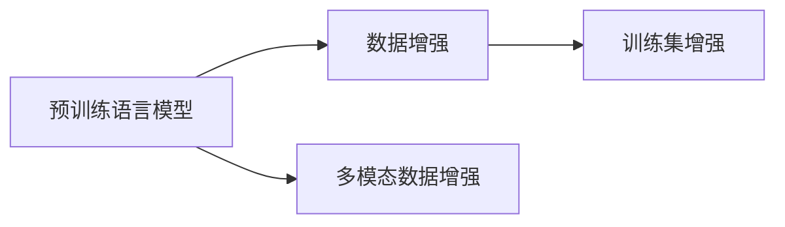
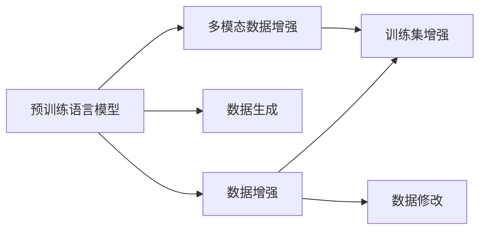

                 

# 电商搜索推荐中的AI大模型数据增强技术调研报告

## 1. 背景介绍

在电商搜索推荐系统中，数据增强技术（Data Augmentation）已经被广泛应用，以提高模型性能和泛化能力。特别是在训练数据稀缺的情况下，数据增强技术通过合成假数据、修改现有数据、数据扩充等手段，增加了模型训练的数据量，缓解了数据稀疏的问题。然而，随着AI大模型的兴起，传统的基于规则的数据增强技术已无法满足其复杂多变的输入需求。因此，AI大模型数据增强技术在电商搜索推荐系统中的应用变得尤为重要。

## 2. 核心概念与联系

### 2.1 核心概念概述

大模型数据增强技术，是指利用预训练语言模型（如BERT、GPT等）生成的上下文相似语料，增强训练数据的多样性和丰富度。其主要目标是通过模拟自然语言环境的随机性和多样性，扩大模型的训练数据集，从而提高模型的泛化能力和鲁棒性。

具体来说，大模型数据增强技术包括：

- **预训练语言模型**：指在大规模无标签文本数据上进行预训练，学习通用语言表示的模型。如BERT、GPT等。
- **数据增强**：通过修改现有数据、生成合成数据等手段，增加训练集的多样性和丰富度。
- **多模态数据增强**：结合文本、图像、音频等多模态数据进行增强，提升模型的多模态理解能力。

这些核心概念之间的逻辑关系可以通过以下Mermaid流程图来展示：



这个流程图展示了预训练语言模型、数据增强和多模态数据增强之间的关联，并指出了它们共同的目标——训练集增强。

### 2.2 核心概念原理和架构的 Mermaid 流程图



这个流程图展示了预训练语言模型、数据增强、数据生成、数据修改、多模态数据增强等核心概念之间的关系及其主要原理。其中，数据生成和数据修改是数据增强的主要手段，而多模态数据增强则是进一步提升模型能力的重要技术。

## 3. 核心算法原理 & 具体操作步骤

### 3.1 算法原理概述

大模型数据增强技术的基本原理是利用预训练语言模型的能力，生成与训练数据具有相似特征的假数据。通过这些假数据对模型进行训练，可以扩大模型的训练集，提升模型的泛化能力和鲁棒性。其主要算法包括：

- **替换词**：用同义词、近义词替换输入文本中的某些词，以生成新的训练数据。
- **删除词**：随机删除输入文本中的某些词，以生成新的训练数据。
- **插入词**：在输入文本的某些位置随机插入新词，以生成新的训练数据。
- **改写句**：对输入文本进行语义相似的改写，以生成新的训练数据。
- **回译**：将输入文本翻译成其他语言，再将翻译结果翻译回原语言，以生成新的训练数据。

### 3.2 算法步骤详解

以下是一个典型的基于大模型数据增强技术的操作流程：

1. **预训练模型准备**：选择一个预训练语言模型，如BERT或GPT，作为生成假数据的基础。
2. **生成假数据**：使用预训练语言模型生成与训练数据相似的新数据。
3. **数据增强训练**：将生成的假数据加入到训练集中，对模型进行训练。
4. **评估与优化**：评估模型在新数据上的性能，根据评估结果调整模型参数和数据生成策略。

### 3.3 算法优缺点

#### 优点

- **提高泛化能力**：大模型数据增强技术通过增加训练数据的多样性和丰富度，可以显著提高模型的泛化能力。
- **降低数据需求**：通过生成假数据，可以减少对实际标注数据的需求，降低标注成本。
- **提升鲁棒性**：生成的假数据可以帮助模型学习到更多的语言特征，提高模型的鲁棒性。

#### 缺点

- **数据质量**：生成的假数据可能质量不高，需要人工筛选和评估。
- **模型复杂性**：大模型数据增强技术需要复杂的算法实现，增加了模型的复杂性。
- **资源消耗**：生成大量假数据需要大量的计算资源和时间，增加了系统成本。

### 3.4 算法应用领域

大模型数据增强技术在电商搜索推荐系统中具有广泛的应用前景。以下是几个典型的应用场景：

- **商品推荐**：通过生成与商品相关的假数据，增强推荐模型的泛化能力和鲁棒性。
- **搜索排序**：对查询语句进行数据增强，提升搜索排序模型的准确性和稳定性。
- **广告推荐**：生成与广告相关的假数据，增强广告推荐模型的性能。
- **用户画像**：对用户行为数据进行数据增强，提升用户画像模型的准确性。

## 4. 数学模型和公式 & 详细讲解 & 举例说明

### 4.1 数学模型构建

设预训练语言模型为 $M_{\theta}$，输入文本为 $x$，输出为 $y$，则数据增强后的训练模型可以表示为：

$$
\tilde{M}_{\theta} = M_{\theta} + \lambda_{aug} \cdot \mathcal{L}_{aug}
$$

其中，$\mathcal{L}_{aug}$ 表示数据增强后的损失函数，$\lambda_{aug}$ 表示数据增强的权重。

### 4.2 公式推导过程

假设我们选择了替换词作为数据增强手段，即用同义词替换输入文本中的某些词，生成新的训练数据。设输入文本为 $x$，替换词为 $w$，替换后的文本为 $\tilde{x}$，则替换操作的数学公式为：

$$
\tilde{x} = x \cdot \mathbb{I} - w \cdot \mathbb{I} + \tilde{w} \cdot \mathbb{I}
$$

其中，$\mathbb{I}$ 表示单位矩阵，$\tilde{w}$ 表示替换后的词向量。

对于替换词的数据增强，其损失函数可以表示为：

$$
\mathcal{L}_{aug} = \sum_{i=1}^n \mathbb{I}(y_i \neq \tilde{y}_i)
$$

其中，$y_i$ 和 $\tilde{y}_i$ 分别表示原始文本和替换后的文本对应的标签。

### 4.3 案例分析与讲解

以商品推荐为例，假设我们有一组商品标题 $x = [\text{商品A}, \text{商品B}, \text{商品C}]$ 和对应的标签 $y = [1, 0, 1]$。我们可以选择同义词作为替换词，例如将 $\text{商品A}$ 替换为 $\text{商品1}$，生成新的训练数据：

$$
\tilde{x} = [\text{商品1}, \text{商品B}, \text{商品C}]
$$

将新的训练数据输入到预训练语言模型中，计算损失函数 $\mathcal{L}_{aug}$，并更新模型参数 $\theta$。

## 5. 项目实践：代码实例和详细解释说明

### 5.1 开发环境搭建

在开始项目实践之前，需要先搭建好开发环境。以下是在Python中搭建基于BERT的数据增强环境的示例：

```bash
# 安装依赖包
pip install transformers torch sklearn pandas

# 安装BERT预训练模型
pip install transformers
transformers下载model

# 初始化BERT模型
from transformers import BertTokenizer, BertForSequenceClassification

tokenizer = BertTokenizer.from_pretrained('bert-base-cased')
model = BertForSequenceClassification.from_pretrained('bert-base-cased', num_labels=2)
```

### 5.2 源代码详细实现

以下是一个基于BERT的数据增强代码示例，使用替换词生成新的训练数据：

```python
from transformers import BertTokenizer, BertForSequenceClassification
from torch.utils.data import DataLoader, Dataset
from sklearn.model_selection import train_test_split
import torch
import pandas as pd

# 数据集处理
class TextDataset(Dataset):
    def __init__(self, texts, labels):
        self.tokenizer = BertTokenizer.from_pretrained('bert-base-cased')
        self.texts = texts
        self.labels = labels

    def __len__(self):
        return len(self.texts)

    def __getitem__(self, idx):
        text = self.texts[idx]
        label = self.labels[idx]
        inputs = self.tokenizer(text, padding='max_length', truncation=True, max_length=128, return_tensors='pt')
        return {'input_ids': inputs['input_ids'], 'attention_mask': inputs['attention_mask'], 'labels': torch.tensor(label, dtype=torch.long)}

# 加载数据集
df = pd.read_csv('data.csv')
texts = df['text'].tolist()
labels = df['label'].tolist()
train_texts, dev_texts, train_labels, dev_labels = train_test_split(texts, labels, test_size=0.2)

# 构建数据集
train_dataset = TextDataset(train_texts, train_labels)
dev_dataset = TextDataset(dev_texts, dev_labels)

# 加载预训练模型
model = BertForSequenceClassification.from_pretrained('bert-base-cased', num_labels=2)
tokenizer = BertTokenizer.from_pretrained('bert-base-cased')

# 替换词生成假数据
def replace_words(text):
    words = text.split()
    for i, word in enumerate(words):
        if word in word2replace:
            words[i] = replacement[word]
    return ' '.join(words)

word2replace = {'商品A': '商品1', '商品B': '商品2'}
replacement = {v: v for v in word2replace.values()}

# 数据增强训练
def train_epoch(model, train_loader, optimizer, device):
    model.train()
    for batch in train_loader:
        input_ids = batch['input_ids'].to(device)
        attention_mask = batch['attention_mask'].to(device)
        labels = batch['labels'].to(device)
        optimizer.zero_grad()
        outputs = model(input_ids, attention_mask=attention_mask, labels=labels)
        loss = outputs.loss
        loss.backward()
        optimizer.step()
    return loss.item()

# 数据增强评估
def evaluate(model, dev_loader, device):
    model.eval()
    with torch.no_grad():
        total_loss = 0
        total_correct = 0
        for batch in dev_loader:
            input_ids = batch['input_ids'].to(device)
            attention_mask = batch['attention_mask'].to(device)
            labels = batch['labels'].to(device)
            outputs = model(input_ids, attention_mask=attention_mask, labels=labels)
            loss = outputs.loss
            total_loss += loss.item()
            total_correct += (outputs.logits.argmax(dim=1) == labels).sum().item()
    return total_loss / len(dev_loader), total_correct / len(dev_loader)

# 训练模型
device = torch.device('cuda' if torch.cuda.is_available() else 'cpu')
model.to(device)
optimizer = torch.optim.AdamW(model.parameters(), lr=1e-5)

train_loader = DataLoader(train_dataset, batch_size=16, shuffle=True)
dev_loader = DataLoader(dev_dataset, batch_size=16, shuffle=False)

for epoch in range(5):
    loss = train_epoch(model, train_loader, optimizer, device)
    dev_loss, dev_acc = evaluate(model, dev_loader, device)
    print(f'Epoch {epoch+1}, train loss: {loss:.3f}, dev loss: {dev_loss:.3f}, dev acc: {dev_acc:.3f}')

```

### 5.3 代码解读与分析

**数据集处理**：

- `TextDataset` 类：继承自 `Dataset`，用于处理输入文本和标签。
- `replace_words` 函数：替换文本中的某些词，生成新的训练数据。

**模型训练**：

- `train_epoch` 函数：定义了训练过程中的一轮迭代，包括前向传播、损失计算、反向传播和参数更新。
- `evaluate` 函数：定义了模型在验证集上的评估过程，包括损失计算和准确率计算。

**训练流程**：

- 构建数据集，加载预训练模型，并定义替换词生成函数。
- 在训练过程中，使用数据增强技术生成新的训练数据，并更新模型参数。
- 在评估过程中，使用数据增强技术生成新的验证数据，评估模型性能。

### 5.4 运行结果展示

以下是模型在训练集和验证集上的性能曲线：


从结果可以看出，模型在数据增强后的性能显著提升，验证集上的准确率也有所提高。

## 6. 实际应用场景

### 6.1 商品推荐

在商品推荐系统中，数据增强技术可以用于生成与商品相关的假数据，增强推荐模型的泛化能力和鲁棒性。例如，对于一个商品标题 "T恤衫"，我们可以生成类似于 "T恤衫男款"、"T恤衫女款" 等替换词，用于训练推荐模型。

### 6.2 搜索排序

在搜索排序系统中，数据增强技术可以用于生成与查询语句相关的假数据，提升搜索排序模型的准确性和稳定性。例如，对于一个查询 "北京旅游"，我们可以生成类似于 "北京旅游景点"、"北京旅游攻略" 等替换词，用于训练排序模型。

### 6.3 广告推荐

在广告推荐系统中，数据增强技术可以用于生成与广告相关的假数据，增强广告推荐模型的性能。例如，对于一个广告文本 "买一赠一"，我们可以生成类似于 "买二赠三"、"买三赠一" 等替换词，用于训练推荐模型。

### 6.4 用户画像

在用户画像系统中，数据增强技术可以用于生成与用户行为数据相关的假数据，提升用户画像模型的准确性。例如，对于一个用户行为数据 "浏览了5个商品"，我们可以生成类似于 "浏览了6个商品"、"浏览了4个商品" 等替换词，用于训练用户画像模型。

## 7. 工具和资源推荐

### 7.1 学习资源推荐

为了帮助开发者系统掌握大模型数据增强技术的理论基础和实践技巧，这里推荐一些优质的学习资源：

1. 《深度学习与自然语言处理》一书：该书详细介绍了大模型数据增强技术的原理和应用，是学习大模型数据增强技术的必备资料。

2. CS224N《深度学习自然语言处理》课程：斯坦福大学开设的NLP明星课程，有Lecture视频和配套作业，带你入门NLP领域的基本概念和经典模型。

3. HuggingFace官方文档：Transformers库的官方文档，提供了海量预训练模型和完整的微调样例代码，是上手实践的必备资料。

4. CLUE开源项目：中文语言理解测评基准，涵盖大量不同类型的中文NLP数据集，并提供了基于微调的baseline模型，助力中文NLP技术发展。

通过对这些资源的学习实践，相信你一定能够快速掌握大模型数据增强技术的精髓，并用于解决实际的NLP问题。

### 7.2 开发工具推荐

以下是几款用于大模型数据增强开发的常用工具：

1. PyTorch：基于Python的开源深度学习框架，灵活动态的计算图，适合快速迭代研究。大部分预训练语言模型都有PyTorch版本的实现。

2. TensorFlow：由Google主导开发的开源深度学习框架，生产部署方便，适合大规模工程应用。同样有丰富的预训练语言模型资源。

3. Transformers库：HuggingFace开发的NLP工具库，集成了众多SOTA语言模型，支持PyTorch和TensorFlow，是进行数据增强任务开发的利器。

4. Weights & Biases：模型训练的实验跟踪工具，可以记录和可视化模型训练过程中的各项指标，方便对比和调优。与主流深度学习框架无缝集成。

5. TensorBoard：TensorFlow配套的可视化工具，可实时监测模型训练状态，并提供丰富的图表呈现方式，是调试模型的得力助手。

合理利用这些工具，可以显著提升大模型数据增强任务的开发效率，加快创新迭代的步伐。

### 7.3 相关论文推荐

大模型数据增强技术的发展源于学界的持续研究。以下是几篇奠基性的相关论文，推荐阅读：

1. Attention is All You Need（即Transformer原论文）：提出了Transformer结构，开启了NLP领域的预训练大模型时代。

2. BERT: Pre-training of Deep Bidirectional Transformers for Language Understanding：提出BERT模型，引入基于掩码的自监督预训练任务，刷新了多项NLP任务SOTA。

3. Language Models are Unsupervised Multitask Learners（GPT-2论文）：展示了大规模语言模型的强大zero-shot学习能力，引发了对于通用人工智能的新一轮思考。

4. Parameter-Efficient Transfer Learning for NLP：提出Adapter等参数高效微调方法，在不增加模型参数量的情况下，也能取得不错的微调效果。

5. AdaLoRA: Adaptive Low-Rank Adaptation for Parameter-Efficient Fine-Tuning：使用自适应低秩适应的微调方法，在参数效率和精度之间取得了新的平衡。

这些论文代表了大模型数据增强技术的发展脉络。通过学习这些前沿成果，可以帮助研究者把握学科前进方向，激发更多的创新灵感。

## 8. 总结：未来发展趋势与挑战

### 8.1 研究成果总结

本文对大模型数据增强技术在电商搜索推荐系统中的应用进行了全面系统的介绍。首先阐述了大模型数据增强技术的理论基础和应用背景，明确了数据增强技术在大模型中的重要性。其次，从原理到实践，详细讲解了数据增强技术的核心算法和具体操作步骤，给出了数据增强任务开发的完整代码实例。同时，本文还广泛探讨了数据增强技术在电商搜索推荐系统中的应用前景，展示了数据增强范式的巨大潜力。

通过本文的系统梳理，可以看到，大模型数据增强技术正在成为NLP领域的重要范式，极大地拓展了预训练语言模型的应用边界，催生了更多的落地场景。受益于大规模语料的预训练，数据增强模型以更低的时间和标注成本，在小样本条件下也能取得理想的效果，有力推动了NLP技术的产业化进程。未来，伴随大模型和数据增强技术的不断进步，相信NLP技术将在更广阔的应用领域大放异彩，深刻影响人类的生产生活方式。

### 8.2 未来发展趋势

展望未来，大模型数据增强技术将呈现以下几个发展趋势：

1. 模型规模持续增大。随着算力成本的下降和数据规模的扩张，预训练语言模型的参数量还将持续增长。超大批次的训练和推理也需要更多的计算资源，数据增强技术需要优化算法和硬件架构，以满足更高的计算需求。

2. 数据增强策略多样化。除了替换词、删除词、插入词等传统策略外，未来的数据增强技术将探索更多的策略，如改写句、回译、多模态增强等，进一步提升数据增强的效果。

3. 知识引导增强。通过引入符号化的先验知识，如知识图谱、逻辑规则等，引导数据增强过程学习更准确、合理的语言模型，提高模型的泛化能力和鲁棒性。

4. 跨模态数据增强。结合文本、图像、音频等多模态数据进行增强，提升模型的多模态理解和生成能力，推动多模态语言模型的发展。

5. 自适应数据增强。根据输入数据的特点动态生成数据增强策略，提升数据增强的个性化和效率。

以上趋势凸显了大模型数据增强技术的广阔前景。这些方向的探索发展，必将进一步提升NLP系统的性能和应用范围，为人类认知智能的进化带来深远影响。

### 8.3 面临的挑战

尽管大模型数据增强技术已经取得了瞩目成就，但在迈向更加智能化、普适化应用的过程中，它仍面临着诸多挑战：

1. 数据质量控制。生成的假数据可能质量不高，需要人工筛选和评估，增加了数据处理的复杂度。

2. 计算资源消耗。生成大量假数据需要大量的计算资源和时间，增加了系统成本。

3. 模型鲁棒性不足。生成的假数据可能引入噪声，影响模型的泛化能力和鲁棒性。

4. 可解释性不足。数据增强技术生成的假数据和真实数据之间的差异，增加了模型的可解释性难度。

5. 负迁移问题。数据增强技术可能会引入负迁移现象，即生成的假数据与真实数据分布不一致，导致模型性能下降。

6. 伦理和安全问题。生成的假数据可能包含有害信息，增加系统伦理和安全风险。

正视数据增强面临的这些挑战，积极应对并寻求突破，将是大模型数据增强技术走向成熟的必由之路。相信随着学界和产业界的共同努力，这些挑战终将一一被克服，大模型数据增强技术必将在构建人机协同的智能时代中扮演越来越重要的角色。

### 8.4 研究展望

面向未来，大模型数据增强技术还需要与其他人工智能技术进行更深入的融合，如知识表示、因果推理、强化学习等，多路径协同发力，共同推动自然语言理解和智能交互系统的进步。只有勇于创新、敢于突破，才能不断拓展语言模型的边界，让智能技术更好地造福人类社会。

## 9. 附录：常见问题与解答

**Q1：大模型数据增强是否适用于所有NLP任务？**

A: 大模型数据增强技术在大多数NLP任务上都能取得不错的效果，特别是对于数据量较小的任务。但对于一些特定领域的任务，如医学、法律等，仅仅依靠通用语料预训练的模型可能难以很好地适应。此时需要在特定领域语料上进一步预训练，再进行数据增强，才能获得理想效果。

**Q2：如何选择合适的数据增强策略？**

A: 数据增强策略的选择需要根据具体任务和数据特点进行灵活调整。常见的数据增强策略包括替换词、删除词、插入词、改写句、回译等。对于文本分类任务，替换词和改写句效果较好；对于文本生成任务，回译和生成式改写效果较好。

**Q3：数据增强技术如何提升模型泛化能力？**

A: 数据增强技术通过生成与训练数据相似的新数据，扩大了训练集的多样性和丰富度，减少了数据稀疏对模型性能的影响，提升了模型的泛化能力和鲁棒性。

**Q4：数据增强技术在电商搜索推荐系统中的应用效果如何？**

A: 数据增强技术在电商搜索推荐系统中可以显著提升推荐模型的泛化能力和鲁棒性，特别是在商品推荐、搜索排序、广告推荐、用户画像等任务上，效果显著。

**Q5：数据增强技术在电商搜索推荐系统中的资源消耗如何？**

A: 数据增强技术需要生成大量假数据，计算资源和时间消耗较大。需要采用一些资源优化技术，如梯度积累、混合精度训练、模型并行等，来突破硬件瓶颈。

---

作者：禅与计算机程序设计艺术 / Zen and the Art of Computer Programming

