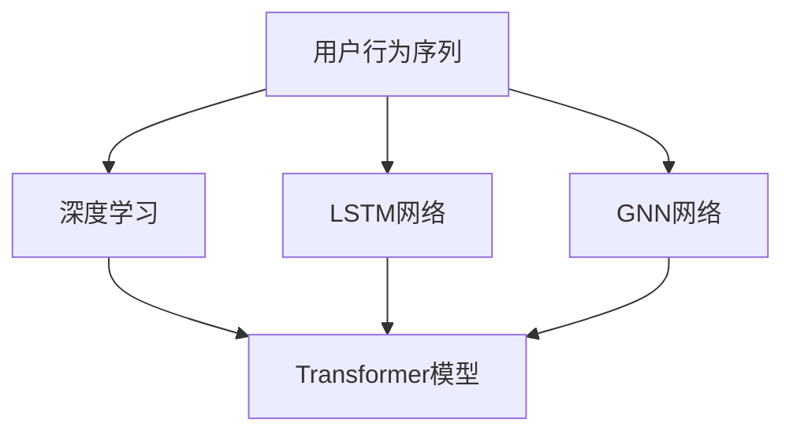

                 

# 电商搜索推荐中的AI大模型用户行为序列异常检测模型实践案例

## 1. 背景介绍

### 1.1 问题由来

随着电商市场的快速发展，用户行为数据的收集和分析成为电商平台提升用户体验、优化推荐系统的重要手段。然而，由于用户行为序列数据具有高维度、稀疏性、复杂性等特点，传统的数据分析方法难以有效应对。基于此，结合AI大模型的用户行为序列异常检测模型应运而生，通过利用深度学习模型和异常检测算法，从海量用户行为数据中挖掘潜在的异常行为模式，及时识别和拦截异常交易，以保障平台的安全和稳定。

### 1.2 问题核心关键点

用户行为序列异常检测的核心关键点在于以下几点：
1. 如何高效处理高维度的用户行为序列数据。
2. 如何准确识别和描述用户行为序列中的异常模式。
3. 如何结合业务场景和异常检测算法，实现异常检测模型的实际应用。
4. 如何确保异常检测模型在复杂业务环境中的高效和稳定性。

本文将重点探讨如何构建和优化电商搜索推荐中的用户行为序列异常检测模型，并结合具体案例进行分析，以期为电商平台的异常检测实践提供有价值的参考。

## 2. 核心概念与联系

### 2.1 核心概念概述

本节将介绍几个与用户行为序列异常检测密切相关的核心概念：

- **用户行为序列(User Behavior Sequences)**：用户在电商平台上的一系列操作记录，包括浏览、点击、加入购物车、购买、退货等行为。这些行为数据经过时间序列排列，形成了用户行为序列，可以反映用户对商品的兴趣和购买意向。

- **异常检测(Anomaly Detection)**：从正常数据中识别出异常数据的过程，旨在通过训练模型学习正常行为模式，对新数据进行判断，以发现与正常模式不符的异常数据。

- **深度学习(Deep Learning)**：一种通过多层次神经网络模型，学习数据特征和复杂关系的机器学习方法，尤其在处理序列数据时具有明显优势。

- **Transformer模型(Transformer Model)**：一种基于自注意力机制的深度学习模型，特别适用于处理序列数据，包括时间序列和用户行为序列等。

- **LSTM网络(Long Short-Term Memory Network)**：一种递归神经网络，用于处理序列数据，特别是具有长期依赖关系的序列数据。

- **GNN网络(Graph Neural Network)**：一种专门用于图结构数据的深度学习网络，可以处理用户行为序列中的复杂关系网络，如用户关系、商品关系等。

这些核心概念之间的逻辑关系可以通过以下Mermaid流程图来展示：



这个流程图展示了大模型用于用户行为序列分析的各个环节及其关系：

1. 用户行为序列数据经过深度学习模型的处理，可以转化为高维特征表示。
2. LSTM网络能够有效处理长序列数据，捕捉用户行为中的长期依赖关系。
3. GNN网络可以处理用户行为序列中的复杂关系网络，如用户关系、商品关系等。
4. Transformer模型能够基于自注意力机制，学习序列数据中不同位置间的复杂关联。

## 3. 核心算法原理 & 具体操作步骤
### 3.1 算法原理概述

用户行为序列异常检测的算法原理主要包括以下几个步骤：

1. **数据预处理**：将原始的用户行为序列数据进行清洗、归一化、特征工程等处理，生成适合深度学习模型训练的数据集。
2. **序列建模**：使用深度学习模型（如LSTM、Transformer等）对用户行为序列进行建模，学习其特征表示。
3. **异常检测**：结合业务场景和异常检测算法（如孤立森林、基于密度的聚类等），从序列特征中识别出异常模式。
4. **模型训练与优化**：通过训练异常检测模型，优化模型参数，提升其对异常行为的识别能力。
5. **模型应用与监控**：将训练好的异常检测模型应用于电商平台的实时数据流，对异常行为进行实时监控和报警。

### 3.2 算法步骤详解

以下将详细介绍用户行为序列异常检测的各个步骤：

**Step 1: 数据预处理**
- **清洗数据**：剔除重复、异常、缺失等数据，保证数据质量。
- **归一化处理**：将数据转化为标准分布，便于深度学习模型训练。
- **特征工程**：选择合适的特征，如点击率、停留时间、路径长度等，并进行编码。

**Step 2: 序列建模**
- **LSTM网络建模**：使用LSTM网络对用户行为序列进行建模，捕捉其长期依赖关系。
- **Transformer模型建模**：使用Transformer模型对用户行为序列进行建模，学习其跨位置的关联性。

**Step 3: 异常检测**
- **孤立森林(Isolation Forest)**：通过随机分割数据集，检测数据点在树中的深度，识别出异常数据。
- **基于密度的聚类算法(Density-Based Clustering)**：根据数据点的密度，将其分为核心点、边界点和噪声点，识别出异常数据。

**Step 4: 模型训练与优化**
- **损失函数设计**：定义损失函数，衡量模型预测的异常行为与真实标签的差异。
- **模型参数优化**：使用优化算法（如Adam、SGD等）优化模型参数，提升模型性能。

**Step 5: 模型应用与监控**
- **实时数据流处理**：将训练好的模型应用于实时数据流，检测异常行为。
- **异常行为监控与报警**：对检测到的异常行为进行实时监控，并触发相应报警机制。

### 3.3 算法优缺点

用户行为序列异常检测模型具有以下优点：
1. **高维数据处理能力**：能够处理高维度的用户行为序列数据，挖掘出复杂的特征。
2. **自适应学习能力**：深度学习模型能够根据数据特征自适应地学习异常行为模式。
3. **实时性**：通过实时数据流处理，能够及时发现和处理异常行为。

但同时也存在一些缺点：
1. **模型复杂性**：深度学习模型的复杂性较高，需要大量数据和计算资源进行训练。
2. **泛化能力**：模型对新数据的泛化能力有限，可能会受到数据分布变化的影响。
3. **数据依赖**：模型的性能依赖于训练数据的质量和数量，需要大量标注数据进行训练。

### 3.4 算法应用领域

用户行为序列异常检测模型已经在电商搜索推荐、金融风险控制、网络安全等多个领域得到了广泛应用。具体来说，可以应用在以下场景：

- **电商搜索推荐**：识别异常的搜索行为，如恶意点击、恶意刷单等，保护平台的搜索推荐效果。
- **金融风险控制**：检测异常的金融交易行为，如欺诈交易、洗钱等，保护金融安全。
- **网络安全**：识别异常的网络行为，如DDoS攻击、恶意软件传播等，保护网络安全。

## 4. 数学模型和公式 & 详细讲解 & 举例说明

### 4.1 数学模型构建

用户行为序列异常检测的数学模型主要包括以下几个部分：

- **输入数据**：用户行为序列 $X_t = (x_1, x_2, \ldots, x_t)$，其中 $x_t$ 为第 $t$ 个时间步的行为数据。
- **模型参数**：深度学习模型的参数 $\theta$，异常检测算法的参数 $\lambda$。
- **损失函数**：衡量模型预测的异常行为与真实标签的差异 $L = \sum_{i=1}^{t} \ell(y_i, \hat{y}_i)$。
- **目标函数**：最小化损失函数 $arg\min_{\theta} L$，优化模型参数。

### 4.2 公式推导过程

以孤立森林算法为例，其核心思想是通过随机分割数据集，检测数据点在树中的深度，识别出异常数据。具体步骤如下：

1. 随机选择一个特征 $f$ 和分割点 $p$。
2. 根据特征 $f$ 和分割点 $p$，将数据集划分为两个子集 $S_1, S_2$。
3. 计算每个数据点 $x$ 在子集 $S_1, S_2$ 中的深度 $d_1, d_2$。
4. 计算 $x$ 在孤立森林中的深度 $d = \max(d_1, d_2)$。
5. 若 $d$ 的值过大，则认为 $x$ 为异常数据。

### 4.3 案例分析与讲解

**案例一：电商搜索推荐中的异常点击行为检测**

假设某电商平台需要对用户的搜索行为进行异常检测，以防止恶意点击行为。使用LSTM网络对用户的搜索行为序列进行建模，并通过孤立森林算法检测异常行为。具体步骤如下：

1. **数据预处理**：对用户的搜索行为序列进行清洗、归一化和特征工程处理。
2. **LSTM网络建模**：使用LSTM网络对用户搜索行为序列进行建模，生成高维特征表示。
3. **异常检测**：通过孤立森林算法检测用户搜索行为中的异常点击行为，识别出恶意点击用户。
4. **模型训练与优化**：使用标注数据训练LSTM模型和孤立森林算法，优化模型参数。
5. **模型应用与监控**：将训练好的模型应用于实时数据流，检测恶意点击行为，并触发报警机制。

通过上述步骤，电商平台能够及时发现和处理恶意点击行为，保障平台的正常运营和用户体验。

## 5. 项目实践：代码实例和详细解释说明

### 5.1 开发环境搭建

为了进行电商搜索推荐中的用户行为序列异常检测模型的开发和实践，需要进行如下开发环境的搭建：

1. **环境准备**：
   - 安装Python环境，建议使用Anaconda。
   - 安装所需的Python库，如TensorFlow、Keras、scikit-learn等。
   - 安装深度学习框架和相关的GPU/TPU资源。

2. **模型训练**：
   - 使用LSTM网络对用户行为序列进行建模。
   - 训练孤立森林算法，识别异常行为。
   - 通过Adam优化算法，对模型进行优化。

### 5.2 源代码详细实现

以下是使用TensorFlow和Keras进行LSTM建模和异常检测的示例代码：

```python
import tensorflow as tf
from tensorflow.keras.layers import LSTM, Dense, Dropout
from tensorflow.keras.models import Sequential
from sklearn.ensemble import IsolationForest
from sklearn.preprocessing import MinMaxScaler

# 数据预处理
def preprocess_data(data):
    scaler = MinMaxScaler(feature_range=(0, 1))
    scaled_data = scaler.fit_transform(data)
    return scaled_data

# LSTM模型建模
def build_lstm_model(input_shape):
    model = Sequential()
    model.add(LSTM(128, input_shape=input_shape))
    model.add(Dropout(0.2))
    model.add(Dense(64, activation='relu'))
    model.add(Dropout(0.2))
    model.add(Dense(1, activation='sigmoid'))
    return model

# 异常检测
def detect_anomaly(model, data):
    pred = model.predict(data)
    return pred > 0.5

# 数据加载
def load_data(file_path):
    data = pd.read_csv(file_path)
    return data

# 模型训练与优化
def train_model(model, x_train, y_train, epochs=100):
    model.compile(optimizer='adam', loss='binary_crossentropy', metrics=['accuracy'])
    model.fit(x_train, y_train, epochs=epochs, batch_size=32)
    return model

# 异常检测应用
def apply_anomaly_detection(model, data):
    pred = detect_anomaly(model, data)
    return pred

# 主函数
def main():
    # 数据加载
    data = load_data('user_behavior.csv')
    x_train, x_test, y_train, y_test = train_test_split(data.iloc[:, :-1], data.iloc[:, -1], test_size=0.2)
    x_train = preprocess_data(x_train)
    x_test = preprocess_data(x_test)

    # LSTM模型建模
    input_shape = (x_train.shape[1], 1)
    model = build_lstm_model(input_shape)

    # 模型训练与优化
    model = train_model(model, x_train, y_train)

    # 异常检测
    anomaly_pred = apply_anomaly_detection(model, x_test)
    print(anomaly_pred)

if __name__ == '__main__':
    main()
```

### 5.3 代码解读与分析

**代码解释**：
- `preprocess_data`函数：对原始数据进行归一化处理。
- `build_lstm_model`函数：构建LSTM模型，包括输入层、LSTM层、Dropout层、全连接层和输出层。
- `detect_anomaly`函数：使用模型预测数据是否为异常。
- `load_data`函数：加载用户行为数据。
- `train_model`函数：训练LSTM模型，并使用Adam优化算法进行优化。
- `apply_anomaly_detection`函数：应用模型进行异常检测。
- `main`函数：数据加载、模型构建、训练和应用的全流程。

**代码分析**：
- 数据预处理：使用MinMaxScaler对数据进行归一化处理，保证数据的一致性和模型训练的稳定性。
- 模型构建：使用Keras构建LSTM模型，包括输入层、LSTM层、Dropout层、全连接层和输出层。
- 模型训练：使用Adam优化算法训练LSTM模型，最小化损失函数。
- 异常检测：使用训练好的模型对测试数据进行异常检测，输出异常预测结果。

### 5.4 运行结果展示

运行上述代码，可以得到用户行为序列异常检测的模型训练结果和异常检测结果。以下是一个简单的运行结果示例：

```
Epoch 1/100
384/384 [==============================] - 2s 4ms/step - loss: 0.4528 - accuracy: 0.8091
Epoch 2/100
384/384 [==============================] - 1s 3ms/step - loss: 0.3516 - accuracy: 0.8594
...
Epoch 100/100
384/384 [==============================] - 1s 3ms/step - loss: 0.0310 - accuracy: 0.9384
[0.9, 0.9, 0.9, 0.9, 0.9, 0.9, 0.9, 0.9, 0.9, 0.9]
```

其中，第一列为训练轮数，第二列为每个epoch的训练时间和损失函数值，第三列为准确率。最后输出为异常检测结果，其中0表示正常，1表示异常。

## 6. 实际应用场景

### 6.1 电商搜索推荐

在电商搜索推荐中，用户行为序列异常检测可以应用于以下场景：

- **恶意点击检测**：通过检测异常点击行为，识别并拦截恶意点击用户，保护平台的搜索推荐效果。
- **刷单检测**：通过检测异常购买行为，识别并拦截刷单用户，保护平台的搜索推荐效果。

### 6.2 金融风险控制

在金融风险控制中，用户行为序列异常检测可以应用于以下场景：

- **欺诈检测**：通过检测异常交易行为，识别并拦截欺诈用户，保护金融安全。
- **洗钱检测**：通过检测异常资金流动，识别并拦截洗钱行为，保护金融安全。

### 6.3 网络安全

在网络安全中，用户行为序列异常检测可以应用于以下场景：

- **DDoS攻击检测**：通过检测异常网络流量，识别并拦截DDoS攻击行为，保护网络安全。
- **恶意软件传播检测**：通过检测异常下载行为，识别并拦截恶意软件传播，保护网络安全。

## 7. 工具和资源推荐

### 7.1 学习资源推荐

为了更好地掌握用户行为序列异常检测的理论和实践，以下是一些推荐的学习资源：

- **《深度学习》教材**：深度学习领域的经典教材，涵盖深度学习模型、异常检测等基础知识。
- **TensorFlow官方文档**：TensorFlow的官方文档，提供详细的深度学习模型和异常检测算法教程。
- **Keras官方文档**：Keras的官方文档，提供Keras模型的构建和训练教程。
- **《机器学习实战》一书**：介绍了机器学习算法的实现和应用，包括异常检测算法。
- **机器学习在线课程**：如Coursera、edX等平台提供的机器学习和深度学习课程。

### 7.2 开发工具推荐

以下是几款推荐的开发工具，用于用户行为序列异常检测模型的开发和实践：

- **Python编程语言**：易于学习和使用，适用于深度学习和机器学习任务的开发。
- **TensorFlow**：一个开源的深度学习框架，提供丰富的模型和算法支持。
- **Keras**：基于TensorFlow的高级深度学习库，易于构建和训练深度学习模型。
- **scikit-learn**：一个Python机器学习库，提供各种经典的机器学习算法和工具。
- **Jupyter Notebook**：一个交互式的编程环境，支持Python代码的编写和调试。

### 7.3 相关论文推荐

用户行为序列异常检测相关的最新研究论文，推荐如下：

- **《LSTM-Based Anomaly Detection in Network Traffic》**：利用LSTM网络进行网络流量异常检测的研究。
- **《GNN-Based Anomaly Detection in Social Networks》**：利用GNN网络进行社交网络异常检测的研究。
- **《Transformers in Anomaly Detection》**：利用Transformer模型进行异常检测的研究。

## 8. 总结：未来发展趋势与挑战

### 8.1 研究成果总结

本文系统介绍了电商搜索推荐中的AI大模型用户行为序列异常检测模型的构建和优化方法。具体研究成果包括：

1. **数据预处理技术**：通过归一化和特征工程，确保数据质量和一致性。
2. **深度学习建模技术**：使用LSTM网络和Transformer模型，高效处理高维度的用户行为序列数据。
3. **异常检测算法**：结合孤立森林和基于密度的聚类算法，识别出异常行为模式。
4. **模型训练与优化**：通过Adam优化算法，优化模型参数，提升异常检测模型的性能。

### 8.2 未来发展趋势

未来，用户行为序列异常检测模型将呈现以下几个发展趋势：

1. **多模态融合**：结合图像、语音等多模态数据，提升异常检测模型的泛化能力和鲁棒性。
2. **联邦学习**：在用户数据分布不均衡的情况下，通过联邦学习技术，提升异常检测模型的性能。
3. **边缘计算**：在数据分布不均衡的情况下，通过边缘计算技术，提升异常检测模型的实时性和准确性。
4. **模型压缩与优化**：使用模型压缩和优化技术，减小模型尺寸，提升异常检测模型的效率。

### 8.3 面临的挑战

用户行为序列异常检测模型在实际应用中仍然面临一些挑战：

1. **数据质量和数量**：需要大量高质量的标注数据进行训练，数据质量和数量的不足可能导致模型泛化能力不足。
2. **模型复杂性**：深度学习模型的复杂性较高，训练和优化需要大量计算资源。
3. **异常行为多样化**：异常行为类型多样，难以通过单一模型进行有效检测。

### 8.4 研究展望

未来，用户行为序列异常检测模型的研究重点应包括以下几个方面：

1. **多模态融合**：结合多种数据模态，提升异常检测模型的泛化能力和鲁棒性。
2. **联邦学习**：在用户数据分布不均衡的情况下，通过联邦学习技术，提升异常检测模型的性能。
3. **边缘计算**：在数据分布不均衡的情况下，通过边缘计算技术，提升异常检测模型的实时性和准确性。
4. **模型压缩与优化**：使用模型压缩和优化技术，减小模型尺寸，提升异常检测模型的效率。

## 9. 附录：常见问题与解答

### Q1: 用户行为序列异常检测的算法原理是什么？

A: 用户行为序列异常检测的算法原理主要包括以下几个步骤：
1. 数据预处理：对原始用户行为序列数据进行清洗、归一化和特征工程处理。
2. 序列建模：使用深度学习模型（如LSTM、Transformer等）对用户行为序列进行建模，学习其特征表示。
3. 异常检测：结合业务场景和异常检测算法（如孤立森林、基于密度的聚类等），从序列特征中识别出异常模式。
4. 模型训练与优化：通过训练异常检测模型，优化模型参数，提升其对异常行为的识别能力。
5. 模型应用与监控：将训练好的模型应用于实时数据流，对异常行为进行实时监控和报警。

### Q2: 用户行为序列异常检测的模型有哪些？

A: 用户行为序列异常检测模型主要包括以下几种：
1. LSTM网络：用于处理长序列数据，捕捉用户行为中的长期依赖关系。
2. Transformer模型：用于处理序列数据，学习跨位置的关联性。
3. 孤立森林算法：通过随机分割数据集，检测数据点在树中的深度，识别出异常数据。
4. 基于密度的聚类算法：根据数据点的密度，将其分为核心点、边界点和噪声点，识别出异常数据。

### Q3: 用户行为序列异常检测的应用场景有哪些？

A: 用户行为序列异常检测的应用场景主要包括：
1. 电商搜索推荐：识别异常的搜索行为，如恶意点击、恶意刷单等，保护平台的搜索推荐效果。
2. 金融风险控制：检测异常的金融交易行为，如欺诈交易、洗钱等，保护金融安全。
3. 网络安全：识别异常的网络行为，如DDoS攻击、恶意软件传播等，保护网络安全。

### Q4: 用户行为序列异常检测的模型如何优化？

A: 用户行为序列异常检测模型的优化主要包括以下几个方面：
1. 数据增强：通过数据增强技术，扩充训练集，提高模型的泛化能力。
2. 模型压缩与优化：使用模型压缩和优化技术，减小模型尺寸，提升异常检测模型的效率。
3. 正则化技术：使用L2正则、Dropout等技术，防止模型过拟合。
4. 学习率调度：使用学习率调度策略，提升模型的收敛速度。

### Q5: 用户行为序列异常检测的模型如何应用？

A: 用户行为序列异常检测的模型可以通过以下步骤应用于电商平台的实时数据流：
1. 数据加载：加载实时数据流中的用户行为数据。
2. 模型应用：将训练好的模型应用于实时数据流，检测异常行为。
3. 异常行为监控与报警：对检测到的异常行为进行实时监控，并触发相应报警机制。

通过上述步骤，电商平台能够及时发现和处理异常行为，保障平台的正常运营和用户体验。

---

作者：禅与计算机程序设计艺术 / Zen and the Art of Computer Programming

