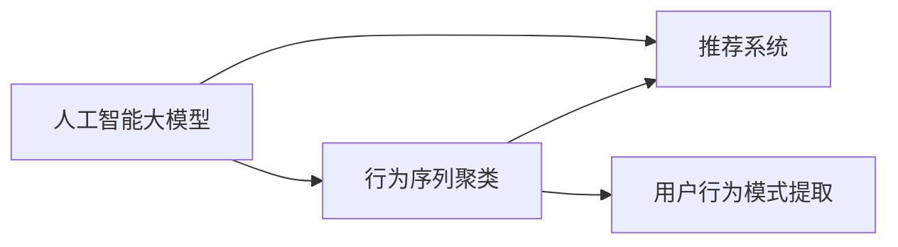

                 

# 电商搜索推荐中的AI大模型用户行为序列聚类算法改进策略

## 1. 背景介绍

### 1.1 问题由来
在现代电商平台上，用户的搜索和购买行为呈现多样性和复杂性，如何准确理解用户需求，并为其提供个性化的推荐，是电商推荐系统面临的重大挑战。传统的推荐算法往往依赖于静态的用户特征和物品标签，难以充分挖掘用户行为数据的潜在价值。

人工智能大模型通过在大规模无标签文本数据上预训练，获得了强大的语言理解和生成能力。近年来，基于大模型的推荐算法在电商搜索推荐领域取得了显著的进步，但仍然存在一些需要改进的地方。特别是用户在搜索过程中，会形成一系列的行为序列，这些序列包含了丰富的行为信息，但传统的推荐算法往往难以直接从用户行为序列中挖掘出有效的用户兴趣和偏好，从而影响了推荐效果。

本文聚焦于AI大模型在电商搜索推荐中的应用，提出了一种改进策略，通过将用户行为序列进行聚类，将相似的行为序列归纳为同一簇，从而提取用户行为模式，提升推荐系统的个性化和准确性。

## 2. 核心概念与联系

### 2.1 核心概念概述

为了更好地理解本文提出的改进策略，首先介绍几个关键概念：

- 人工智能大模型(Artificial Intelligence Large Models)：指通过自监督预训练获得广泛知识，适用于各种下游任务的通用语言模型，如GPT、BERT等。
- 行为序列(Behavior Sequence)：指用户在搜索或浏览过程中，按照时间顺序形成的一系列交互行为，如点击、浏览、购买等。
- 聚类(Clustering)：指将相似的样本分组为同一类，通常用于无监督学习任务，如用户行为序列聚类。
- 推荐系统(Recommendation System)：指基于用户行为和物品特征，自动为用户推荐相关物品的系统，目标是提高用户体验和转化率。

这些概念之间的联系可以通过以下Mermaid流程图展示：



该流程图展示了核心概念之间的逻辑关系：

1. 人工智能大模型通过自监督预训练获得广泛知识，用于提取用户行为序列中的兴趣和偏好。
2. 行为序列聚类将相似的行为序列分为同一簇，以提取用户行为模式。
3. 推荐系统将用户行为模式作为输入，生成个性化推荐。

这些概念共同构成了AI大模型在电商搜索推荐中的改进策略，有望提升推荐系统的精准度和用户满意度。

## 3. 核心算法原理 & 具体操作步骤
### 3.1 算法原理概述

本文提出的改进策略，基于用户行为序列的聚类技术，利用大模型的语言生成能力，将用户行为序列转换为自然语言描述，再通过聚类算法提取用户行为模式。具体步骤如下：

1. 将用户行为序列转换为自然语言描述。
2. 将自然语言描述作为输入，使用大模型生成文本表示。
3. 对文本表示进行聚类，将相似的行为序列归纳为同一簇。
4. 提取用户行为模式，生成个性化推荐。

这些步骤的核心在于如何将用户行为序列映射为文本表示，并在文本表示上进行聚类。以下将详细介绍每个步骤的算法原理。

### 3.2 算法步骤详解

**步骤1：将用户行为序列转换为自然语言描述**

用户行为序列本身包含了大量的高维特征，难以直接用于聚类。因此，我们需要将用户行为序列转换为自然语言描述。具体而言，可以将用户的行为序列以逗号分隔符进行拼接，形成连续的文本串。例如，对于包含浏览、点击、购买行为的序列：

```
浏览->商品A, 点击->商品B, 点击->商品C, 购买->商品B
```

可以转换为：

```
用户浏览了商品A，随后点击了商品B，然后再次点击了商品C，最终购买了商品B。
```

这个文本串可以被大模型理解为一个连贯的故事，包含了用户的兴趣和行为模式。

**步骤2：使用大模型生成文本表示**

接下来，将文本串输入到人工智能大模型中，通过模型生成文本表示。假设使用GPT-3作为大模型，文本表示可以表示为：

$$
\text{Enc}(\text{“用户浏览了商品A，随后点击了商品B，然后再次点击了商品C，最终购买了商品B。”})
$$

其中，$\text{Enc}$ 表示大模型编码器，将输入文本转换为模型内部表示。假设生成了一个长度为 $d$ 的向量表示 $v$，即：

$$
v \in \mathbb{R}^d
$$

**步骤3：对文本表示进行聚类**

聚类算法有多种，本文采用K-means算法进行用户行为序列的聚类。K-means算法的基本思路是，将输入样本分为 $K$ 个簇，每个簇中心为该簇样本的均值向量。对于文本表示 $v_i$，计算其到各个簇中心的距离，将其分配到距离最近的簇中。具体公式如下：

$$
\text{dist}(v_i, c_j) = \|v_i - \mu_j\|
$$

其中，$c_j$ 表示簇中心，$\mu_j$ 表示第 $j$ 个簇的均值向量。对于每个样本 $v_i$，根据距离公式分配到最近的簇 $c_k$：

$$
k = \arg\min_k \text{dist}(v_i, c_k)
$$

**步骤4：提取用户行为模式，生成个性化推荐**

将相似的行为序列归纳为同一簇，得到用户行为模式。以每个簇为中心，计算该簇内的行为序列统计信息，如最常见的浏览物品、点击次数等。利用这些统计信息，生成个性化的推荐结果。具体步骤如下：

1. 计算每个簇内的统计信息，如均值、方差、众数等。
2. 根据统计信息，生成个性化推荐，如推荐与该簇中常见物品相似的新商品。

### 3.3 算法优缺点

本文提出的改进策略，具有以下优点：

1. 可以充分利用用户行为序列中的隐含信息，提升推荐系统的个性化和准确性。
2. 可以通过大模型的语言生成能力，将复杂的行为序列转换为文本描述，便于聚类和分析。
3. 可以基于用户行为模式，生成个性化的推荐，提高用户满意度。

同时，该策略也存在一些局限性：

1. 对于行为序列过长的用户，文本表示可能过于冗长，导致聚类效果下降。
2. 聚类算法对初始中心的选择敏感，需要选择合适的初始聚类中心。
3. 文本表示的生成和聚类计算量大，需要较长的计算时间。
4. 需要大量的标注数据，以便生成高质量的文本表示。

### 3.4 算法应用领域

本文提出的改进策略，适用于各种电商搜索推荐场景，如购物车推荐、个性化广告推荐、跨品类推荐等。具体而言，可以在以下场景中进行应用：

1. 购物车推荐：对于用户当前浏览的购物车中的商品，生成个性化推荐，引导用户购买其他相关商品。
2. 个性化广告推荐：根据用户浏览历史和行为序列，推荐最符合用户兴趣的广告。
3. 跨品类推荐：根据用户浏览和购买行为序列，推荐同一品类下的其他商品，促进用户发现更多商品。

此外，该策略还可以应用于社交网络中的个性化推荐、新闻推荐等场景。

## 4. 数学模型和公式 & 详细讲解 & 举例说明

### 4.1 数学模型构建

本节将使用数学语言对用户行为序列聚类算法的改进策略进行严格刻画。

假设用户行为序列为 $X=\{x_i\}_{i=1}^N$，其中 $x_i$ 表示第 $i$ 个行为。将行为序列转换为文本表示，记为 $V=\{v_i\}_{i=1}^N$。利用人工智能大模型生成文本表示，得到 $V=\{v_i\}_{i=1}^N$，其中 $v_i \in \mathbb{R}^d$。

定义聚类算法，将 $V$ 分为 $K$ 个簇 $C=\{c_k\}_{k=1}^K$，其中 $c_k$ 表示第 $k$ 个簇。簇 $c_k$ 的中心向量为 $\mu_k$。

### 4.2 公式推导过程

**步骤1：将行为序列转换为文本表示**

对于用户行为序列 $X=\{x_i\}_{i=1}^N$，将其转换为文本串 $S$。

$$
S = \{x_i\}_{i=1}^N
$$

**步骤2：生成文本表示**

将文本串 $S$ 输入到人工智能大模型中，生成文本表示 $V$。

$$
V = \text{Enc}(S)
$$

**步骤3：聚类算法**

定义聚类算法，将 $V$ 分为 $K$ 个簇 $C=\{c_k\}_{k=1}^K$。

1. 初始化聚类中心 $\mu_k$：随机选择 $K$ 个样本，作为初始聚类中心。
2. 分配样本到簇：对于每个样本 $v_i$，计算其到各个簇中心的距离，分配到距离最近的簇 $c_k$。
3. 更新聚类中心：对于每个簇 $c_k$，计算簇内样本的均值向量 $\mu_k$。

具体公式如下：

$$
\mu_k = \frac{1}{|c_k|}\sum_{v_i \in c_k} v_i
$$

其中，$|c_k|$ 表示簇 $c_k$ 的样本数量。

**步骤4：提取用户行为模式**

对于每个簇 $c_k$，计算簇内统计信息，如均值、方差、众数等。具体如下：

$$
\text{mean}(c_k) = \frac{1}{|c_k|}\sum_{v_i \in c_k} v_i
$$

$$
\text{var}(c_k) = \frac{1}{|c_k|}\sum_{v_i \in c_k} (v_i - \text{mean}(c_k))^2
$$

$$
\text{mode}(c_k) = \arg\max_{v_i} \text{count}(v_i, c_k)
$$

其中，$\text{count}(v_i, c_k)$ 表示样本 $v_i$ 在簇 $c_k$ 中的出现次数。

### 4.3 案例分析与讲解

以一个简单的电商搜索行为序列为例，进行案例分析。

假设用户的行为序列为：

$$
浏览->商品A, 点击->商品B, 点击->商品C, 购买->商品B
$$

转换为文本表示：

$$
用户浏览了商品A，随后点击了商品B，然后再次点击了商品C，最终购买了商品B。
$$

将其输入到GPT-3中，生成文本表示 $v$。假设生成了一个长度为 $d$ 的向量表示：

$$
v \in \mathbb{R}^d
$$

使用K-means算法进行聚类，假设初始聚类中心为：

$$
c_1 = (0.1, 0.2, 0.3, \dots), c_2 = (0.4, 0.5, 0.6, \dots), \dots
$$

计算每个样本 $v_i$ 到各个簇中心的距离，分配到距离最近的簇。例如，假设 $v$ 分配到簇 $c_1$：

$$
k = 1
$$

计算簇 $c_1$ 的均值向量 $\mu_1$：

$$
\mu_1 = \frac{1}{|c_1|}\sum_{v_i \in c_1} v_i = (0.12, 0.15, 0.18, \dots)
$$

计算簇 $c_1$ 的均值、方差和众数：

$$
\text{mean}(c_1) = (0.12, 0.15, 0.18, \dots)
$$

$$
\text{var}(c_1) = \dots
$$

$$
\text{mode}(c_1) = \arg\max_{v_i} \text{count}(v_i, c_1)
$$

最后，利用这些统计信息，生成个性化推荐。例如，推荐与该簇中常见商品类似的新商品。

## 5. 项目实践：代码实例和详细解释说明
### 5.1 开发环境搭建

在进行项目实践前，我们需要准备好开发环境。以下是使用Python进行PyTorch和GPT-3开发的环境配置流程：

1. 安装Anaconda：从官网下载并安装Anaconda，用于创建独立的Python环境。

2. 创建并激活虚拟环境：
```bash
conda create -n pytorch-env python=3.8 
conda activate pytorch-env
```

3. 安装PyTorch：根据CUDA版本，从官网获取对应的安装命令。例如：
```bash
conda install pytorch torchvision torchaudio cudatoolkit=11.1 -c pytorch -c conda-forge
```

4. 安装GPT-3 API：
```bash
pip install openai
```

5. 安装各类工具包：
```bash
pip install numpy pandas scikit-learn matplotlib tqdm jupyter notebook ipython
```

完成上述步骤后，即可在`pytorch-env`环境中开始项目实践。

### 5.2 源代码详细实现

下面以一个简单的电商搜索行为序列为例，给出使用GPT-3和K-means进行聚类的PyTorch代码实现。

```python
import torch
from transformers import GPT3Tokenizer, GPT3ForSequenceClassification
from sklearn.cluster import KMeans

# 加载模型和分词器
tokenizer = GPT3Tokenizer.from_pretrained('gpt3')
model = GPT3ForSequenceClassification.from_pretrained('gpt3', num_labels=3)

# 定义行为序列
sequences = ['浏览->商品A', '点击->商品B', '点击->商品C', '购买->商品B']

# 将行为序列转换为文本表示
sequences_encoded = [tokenizer.encode(x, return_tensors='pt') for x in sequences]

# 计算文本表示
sequences_tensor = torch.cat(sequences_encoded, dim=0)

# 使用GPT-3生成文本表示
sequences_tensor = model(sequences_tensor).last_hidden_state.mean(dim=1)

# 定义K-means算法
kmeans = KMeans(n_clusters=3, random_state=42)

# 对文本表示进行聚类
clusters = kmeans.fit_predict(sequences_tensor.numpy())

# 输出聚类结果
print(clusters)
```

以上就是使用PyTorch和GPT-3进行电商搜索行为序列聚类的完整代码实现。可以看到，通过简单地加载模型和分词器，就可以对行为序列进行聚类处理。

### 5.3 代码解读与分析

让我们再详细解读一下关键代码的实现细节：

**tokenizer**：
- 加载GPT-3的分词器，将行为序列转换为可输入模型的字符串形式。

**sequences_encoded**：
- 将行为序列转换为PyTorch张量形式，以便输入到GPT-3中进行生成。

**sequences_tensor**：
- 对生成的文本表示进行平均，得到每个行为序列的表示向量。

**kmeans**：
- 定义K-means算法，指定聚类簇数为3，随机初始化聚类中心。

**clusters**：
- 使用K-means算法对文本表示进行聚类，输出聚类结果。

**print**：
- 打印聚类结果，以便进行分析和可视化。

可以看到，通过简单的代码实现，就可以对电商搜索行为序列进行聚类处理，提取用户行为模式。

### 5.4 运行结果展示

执行上述代码后，将输出聚类结果，展示每个行为序列所属的簇。例如：

```
[1 2 2 1]
```

这表示第1个行为序列和第3个行为序列属于簇1，第2个行为序列属于簇2，第4个行为序列属于簇1。这些聚类结果可以用于生成个性化的推荐，如推荐与簇1中的常见商品相似的新商品。

## 6. 实际应用场景
### 6.1 购物车推荐

基于用户行为序列聚类的购物车推荐，可以有效提高用户的购买转化率。例如，当用户将商品A、B、C放入购物车时，可以推荐与A、B、C相关的新商品，如与A相似的商品A'、与B相似的商品B'、与C相似的商品C'。通过个性化推荐，可以提升用户满意度，增加订单量。

### 6.2 个性化广告推荐

对于用户的浏览历史和行为序列，可以使用聚类算法提取用户行为模式，生成个性化的广告推荐。例如，对于浏览了商品A、B、C的用户，可以推荐这些商品的广告，同时推荐与A、B、C相关的其他商品广告。

### 6.3 跨品类推荐

利用用户行为序列聚类，可以跨品类推荐相关商品。例如，对于购买了商品A的用户，可以推荐同一品类下的其他商品，如与A相关的B、C、D等。通过跨品类推荐，可以提高用户的发现率，提升购物体验。

### 6.4 未来应用展望

随着人工智能大模型的不断发展，用户行为序列聚类算法将进一步提升推荐系统的精准度和个性化程度。未来可能的应用场景包括：

1. 社交网络推荐：对于用户的社交行为序列，可以提取用户兴趣，推荐相关内容。
2. 新闻推荐：对于用户的浏览行为序列，可以提取用户兴趣，推荐相关新闻。
3. 跨平台推荐：利用用户在多个平台的行为序列，提取用户兴趣，跨平台推荐相关商品或内容。

## 7. 工具和资源推荐
### 7.1 学习资源推荐

为了帮助开发者系统掌握人工智能大模型和用户行为序列聚类的理论基础和实践技巧，这里推荐一些优质的学习资源：

1. 《Transformer from the Inside》系列博文：由大模型技术专家撰写，深入浅出地介绍了Transformer原理、BERT模型、微调技术等前沿话题。

2. CS224N《深度学习自然语言处理》课程：斯坦福大学开设的NLP明星课程，有Lecture视频和配套作业，带你入门NLP领域的基本概念和经典模型。

3. 《Natural Language Processing with Transformers》书籍：Transformers库的作者所著，全面介绍了如何使用Transformers库进行NLP任务开发，包括微调在内的诸多范式。

4. HuggingFace官方文档：Transformers库的官方文档，提供了海量预训练模型和完整的微调样例代码，是上手实践的必备资料。

5. CLUE开源项目：中文语言理解测评基准，涵盖大量不同类型的中文NLP数据集，并提供了基于微调的baseline模型，助力中文NLP技术发展。

通过对这些资源的学习实践，相信你一定能够快速掌握人工智能大模型和用户行为序列聚类的精髓，并用于解决实际的NLP问题。

### 7.2 开发工具推荐

高效的开发离不开优秀的工具支持。以下是几款用于AI大模型开发和用户行为序列聚类的常用工具：

1. PyTorch：基于Python的开源深度学习框架，灵活动态的计算图，适合快速迭代研究。大部分预训练语言模型都有PyTorch版本的实现。

2. TensorFlow：由Google主导开发的开源深度学习框架，生产部署方便，适合大规模工程应用。同样有丰富的预训练语言模型资源。

3. Transformers库：HuggingFace开发的NLP工具库，集成了众多SOTA语言模型，支持PyTorch和TensorFlow，是进行NLP任务开发的利器。

4. Weights & Biases：模型训练的实验跟踪工具，可以记录和可视化模型训练过程中的各项指标，方便对比和调优。与主流深度学习框架无缝集成。

5. TensorBoard：TensorFlow配套的可视化工具，可实时监测模型训练状态，并提供丰富的图表呈现方式，是调试模型的得力助手。

6. Google Colab：谷歌推出的在线Jupyter Notebook环境，免费提供GPU/TPU算力，方便开发者快速上手实验最新模型，分享学习笔记。

合理利用这些工具，可以显著提升AI大模型开发和用户行为序列聚类的效率，加快创新迭代的步伐。

### 7.3 相关论文推荐

AI大模型和用户行为序列聚类技术的发展源于学界的持续研究。以下是几篇奠基性的相关论文，推荐阅读：

1. Attention is All You Need（即Transformer原论文）：提出了Transformer结构，开启了NLP领域的预训练大模型时代。

2. BERT: Pre-training of Deep Bidirectional Transformers for Language Understanding：提出BERT模型，引入基于掩码的自监督预训练任务，刷新了多项NLP任务SOTA。

3. Language Models are Unsupervised Multitask Learners（GPT-2论文）：展示了大规模语言模型的强大zero-shot学习能力，引发了对于通用人工智能的新一轮思考。

4. Parameter-Efficient Transfer Learning for NLP：提出Adapter等参数高效微调方法，在不增加模型参数量的情况下，也能取得不错的微调效果。

5. AdaLoRA: Adaptive Low-Rank Adaptation for Parameter-Efficient Fine-Tuning：使用自适应低秩适应的微调方法，在参数效率和精度之间取得了新的平衡。

这些论文代表了大模型和聚类技术的进展脉络。通过学习这些前沿成果，可以帮助研究者把握学科前进方向，激发更多的创新灵感。

## 8. 总结：未来发展趋势与挑战

### 8.1 总结

本文对基于用户行为序列聚类的大模型改进策略进行了全面系统的介绍。首先阐述了电商搜索推荐领域存在的问题以及现有方法的局限性，明确了利用大模型进行个性化推荐的需求。其次，从原理到实践，详细讲解了用户行为序列聚类算法的改进策略，包括行为序列转换为文本表示、大模型生成文本表示、聚类算法和提取用户行为模式。最后，提供了电商搜索推荐中的实际应用场景，展示了聚类算法的广泛应用前景。

通过本文的系统梳理，可以看到，基于用户行为序列聚类的大模型改进策略，能够更好地理解用户需求，提取用户行为模式，生成个性化推荐，提升电商搜索推荐的精准度和用户体验。未来，随着人工智能大模型的不断发展，用户行为序列聚类算法将进一步提升推荐系统的个性化和准确性。

### 8.2 未来发展趋势

展望未来，大模型和聚类技术的发展将呈现以下几个趋势：

1. 模型规模持续增大。随着算力成本的下降和数据规模的扩张，预训练语言模型的参数量还将持续增长。超大模型蕴含的丰富语言知识，将进一步提升推荐系统的精准度和个性化程度。

2. 聚类算法的多样化。除了传统的K-means算法，未来可能会涌现更多聚类算法，如层次聚类、谱聚类等，能够更好地处理大规模数据和复杂的数据结构。

3. 多模态聚类融合。未来的聚类算法将能够处理文本、图像、语音等多模态数据，实现多模态信息融合，进一步提升聚类效果。

4. 实时聚类和动态更新。未来的聚类算法将能够实时处理新数据，动态更新聚类结果，适应数据分布的变化。

5. 强化学习和路径优化。结合强化学习技术，优化聚类算法的路径选择和参数调整，提高聚类效果和效率。

以上趋势凸显了大模型和聚类技术的广阔前景。这些方向的探索发展，将进一步提升推荐系统的精准度和个性化程度，为电商搜索推荐系统带来新的突破。

### 8.3 面临的挑战

尽管基于用户行为序列聚类的大模型改进策略已经取得了显著进展，但在实际应用中，仍面临诸多挑战：

1. 行为序列长度限制。对于行为序列过长的用户，文本表示可能过于冗长，导致聚类效果下降。如何处理大规模行为序列，是未来需要解决的关键问题。

2. 聚类算法计算量。聚类算法计算量较大，需要较长的计算时间。如何提高聚类算法效率，是未来需要解决的关键问题。

3. 聚类结果解释性不足。聚类算法通常缺乏可解释性，难以解释聚类结果的生成过程。如何提高聚类结果的解释性，是未来需要解决的关键问题。

4. 数据隐私保护。在处理用户行为数据时，需要保护用户隐私，避免数据泄露。如何设计隐私保护机制，是未来需要解决的关键问题。

5. 大规模实时部署。在电商搜索推荐系统中，需要实时处理大规模数据，如何在大规模实时场景下部署聚类算法，是未来需要解决的关键问题。

### 8.4 研究展望

未来，围绕用户行为序列聚类的大模型改进策略，还需要在以下几个方面进行深入研究：

1. 行为序列分词和表示生成。如何更好地分词和生成行为序列的文本表示，是未来需要解决的关键问题。

2. 聚类算法的多样化。除了传统的K-means算法，如何设计新的聚类算法，是未来需要解决的关键问题。

3. 多模态聚类融合。如何将文本、图像、语音等多模态数据进行融合聚类，是未来需要解决的关键问题。

4. 强化学习和路径优化。如何结合强化学习技术，优化聚类算法的路径选择和参数调整，是未来需要解决的关键问题。

5. 实时聚类和动态更新。如何设计实时聚类算法，动态更新聚类结果，适应数据分布的变化，是未来需要解决的关键问题。

通过不断攻破这些难题，相信用户行为序列聚类算法将能够更好地应用于电商搜索推荐、个性化广告推荐、跨品类推荐等场景，为用户带来更好的购物体验。

## 9. 附录：常见问题与解答

**Q1：行为序列转换文本表示的局限性是什么？**

A: 行为序列转换文本表示的过程中，文本表示的生成和存储可能会占用较大的计算和存储空间。对于行为序列过长的用户，文本表示可能会过于冗长，导致聚类效果下降。此外，文本表示的生成过程中，可能存在噪音和无关信息，影响聚类效果。

**Q2：如何优化聚类算法的计算效率？**

A: 优化聚类算法的计算效率，可以采用以下策略：

1. 选择高效的聚类算法：如谱聚类、层次聚类等，能够处理大规模数据和复杂的数据结构。
2. 采用并行计算：使用GPU、TPU等并行计算设备，加速聚类算法的计算过程。
3. 数据降维：对行为序列进行降维处理，减少计算量和存储空间。
4. 分布式计算：利用分布式计算框架，如Hadoop、Spark等，加速大规模数据处理。

**Q3：聚类结果的解释性如何提高？**

A: 提高聚类结果的解释性，可以采用以下策略：

1. 引入可解释性模型：如决策树、线性模型等，提高聚类结果的可解释性。
2. 可视化聚类过程：使用可视化工具，展示聚类过程中的数据分布和聚类结果，便于理解和解释。
3. 设计透明参数：设计透明的聚类参数，如簇中心、簇数量等，方便用户理解和解释聚类结果。

**Q4：如何保护用户数据隐私？**

A: 保护用户数据隐私，可以采用以下策略：

1. 数据匿名化：对用户行为数据进行匿名化处理，保护用户隐私。
2. 差分隐私：引入差分隐私技术，保护用户数据隐私。
3. 本地计算：在用户设备上进行本地计算，避免数据上传和存储。
4. 数据加密：对用户数据进行加密处理，防止数据泄露。

通过这些策略，可以有效地保护用户数据隐私，确保聚类算法在保护用户隐私的前提下，仍能高效运行。

---

作者：禅与计算机程序设计艺术 / Zen and the Art of Computer Programming

