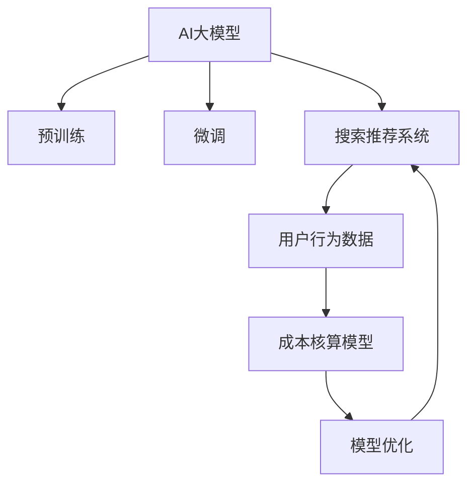

                 

# 电商搜索推荐场景下的AI大模型模型部署成本核算模型应用实践与优化

> 关键词：电商搜索推荐,大模型模型部署,成本核算,模型优化

## 1. 背景介绍

### 1.1 问题由来

随着互联网电商市场的蓬勃发展，用户对于商品搜索与推荐的需求日益增强。电商平台的搜索推荐系统不仅要准确响应用户需求，还需在保证搜索体验的同时，提升推荐精准度，促进商品销售，提升用户满意度。

传统的搜索推荐系统多基于统计方法或传统机器学习模型构建，随着深度学习和大模型技术的兴起，基于大模型，如BERT、GPT等，的推荐系统逐渐成为行业主流。这些大模型经过大规模无监督预训练，学习到了丰富的语言知识和语义理解能力，具有更强的语义泛化能力，可以显著提升推荐系统的效果。然而，大模型预训练和微调过程耗资巨大，推广成本高昂，应用难度较大。

本文将深入探讨在电商搜索推荐场景下，如何通过合理构建AI大模型的部署成本核算模型，优化模型部署，降低应用成本，提升搜索推荐系统的综合性能。

### 1.2 问题核心关键点

在电商搜索推荐场景下，AI大模型部署成本核算模型主要关注以下几个核心关键点：

- 数据集规模：大规模标注数据集对于模型训练至关重要。
- 模型参数量：参数量越大，预训练和微调成本越高。
- 模型复杂度：包括模型结构复杂度和训练复杂度。
- 模型部署成本：涉及硬件成本、软件成本、维护成本、人工成本等。

构建一个能量化这些成本因素的模型，并在优化这些成本的同时，提升搜索推荐系统的性能，是本文的主要研究内容。

## 2. 核心概念与联系

### 2.1 核心概念概述

为更好地理解电商搜索推荐场景下AI大模型模型部署成本核算模型，本节将介绍几个关键概念：

- AI大模型：指通过大规模无监督预训练获得通用知识的大规模神经网络模型，如BERT、GPT-3等。
- 预训练与微调：在无标注数据上进行的预训练，在有标注数据上进行微调的过程，称为预训练-微调。
- 搜索推荐系统：利用机器学习算法，根据用户的历史行为和实时查询，推荐商品的系统。
- 成本核算：计算和评估模型部署、应用和维护的各项成本，以优化整体成本结构。
- 模型优化：通过调整模型结构、参数和训练策略，提升模型的性能和泛化能力。

这些核心概念之间存在紧密联系：

- AI大模型为搜索推荐系统提供了强大的语义理解能力，是提升推荐效果的核心。
- 预训练与微调是大模型获取知识和适配特定场景的关键过程。
- 成本核算模型帮助评估和优化大模型的应用成本，推动模型在实际场景中的大规模部署。
- 模型优化则是保持模型效能和成本控制的重要手段。

这些概念共同构成了电商搜索推荐场景下AI大模型部署成本核算模型的框架，是实现高性能、低成本搜索推荐系统的关键。

### 2.2 核心概念原理和架构的 Mermaid 流程图



## 3. 核心算法原理 & 具体操作步骤

### 3.1 算法原理概述

电商搜索推荐场景下，AI大模型的部署成本核算模型主要基于监督学习和强化学习原理，旨在通过量化模型训练、应用和维护过程中的各项成本，指导模型优化。

具体来说，模型包括以下步骤：

1. 数据集准备：收集电商平台的商品信息、用户行为数据，构建标注数据集。
2. 预训练与微调：利用大模型在无监督数据上预训练，在有标注数据上微调，得到初步的模型。
3. 成本评估：使用成本核算模型量化模型在训练、部署和维护中的各项成本，包括硬件成本、软件成本、人工成本等。
4. 模型优化：在成本核算模型的指导下，对模型结构、参数和训练策略进行优化，提升模型性能。
5. 应用部署：将优化后的模型应用于搜索推荐系统，实时响应用户查询，提升推荐效果。

### 3.2 算法步骤详解

#### 3.2.1 数据集准备

电商搜索推荐系统的数据集包含商品信息、用户行为记录、交易记录等。为了构建成本核算模型，我们需要对这些数据进行预处理：

1. 数据清洗：去除噪音数据，确保数据质量和完整性。
2. 特征提取：提取商品和用户的关键特征，包括价格、类别、评分、购买记录等。
3. 标注数据构建：构建标注数据集，标记商品与用户的匹配关系、购买意向等。

#### 3.2.2 预训练与微调

在大模型预训练时，可以采用Transformer等架构，在无标注的大规模语料上进行预训练，学习语言知识。在微调时，需要将模型与电商数据集适配，提升特定领域的推荐能力。

1. 预训练流程：
   - 数据准备：收集电商领域的语料，如商品描述、用户评论等。
   - 预训练模型加载：使用预训练模型，如BERT、GPT等，进行语言理解训练。
   - 预训练损失计算：定义预训练任务，如掩码语言模型，计算损失函数。
   - 预训练更新：通过反向传播更新模型参数，最小化损失函数。

2. 微调流程：
   - 数据集准备：将电商数据集进行清洗和标注，准备微调数据。
   - 微调模型加载：加载预训练模型，作为微调模型的初始化权重。
   - 微调损失计算：定义微调任务，如推荐评分预测，计算损失函数。
   - 微调更新：使用微调数据进行梯度下降，更新模型参数。

#### 3.2.3 成本评估

构建电商搜索推荐场景下的成本核算模型，需要评估模型在训练、部署和维护过程中的各项成本，包括硬件成本、软件成本、人工成本等。

1. 硬件成本评估：计算模型训练和部署所需的硬件资源，包括CPU、GPU、内存等。
2. 软件成本评估：计算模型训练和部署所需的软件成本，包括开源库的下载和安装、模型的部署工具等。
3. 人工成本评估：计算模型训练和维护所需的人工成本，包括模型调优、系统部署、维护等。

#### 3.2.4 模型优化

模型优化是成本核算模型的核心，通过调整模型结构、参数和训练策略，实现性能和成本的平衡。

1. 参数优化：使用参数高效的微调方法，如AdaLoRA、AdaFactor等，减少模型参数量，降低硬件成本。
2. 结构优化：调整模型结构，如增加层数、减小模型宽度等，以适应特定场景。
3. 训练策略优化：调整学习率、优化器等训练参数，提升模型收敛速度和泛化能力。

#### 3.2.5 应用部署

将优化后的模型部署到电商搜索推荐系统中，实时响应用户查询，提升推荐效果。

1. 模型加载：将优化后的模型加载到服务端。
2. 实时推理：对用户查询进行实时推理，返回推荐结果。
3. 反馈优化：收集用户反馈，不断优化模型和系统。

### 3.3 算法优缺点

#### 3.3.1 优点

1. 全面成本核算：通过量化模型训练、应用和维护中的各项成本，全面评估模型部署效益。
2. 优化模型性能：在成本核算模型的指导下，优化模型结构和训练策略，提升模型性能。
3. 提升应用价值：通过降低模型部署成本，提高搜索推荐系统的应用价值，加速业务落地。

#### 3.3.2 缺点

1. 数据依赖度高：需要大量的电商数据进行训练和微调，数据获取成本高。
2. 模型复杂度高：大模型的结构和参数复杂，部署和优化难度大。
3. 训练时间长：大规模模型的训练时间长，需占用大量计算资源。

### 3.4 算法应用领域

大模型部署成本核算模型在电商搜索推荐场景中具有广泛应用前景，主要包括：

1. 商品推荐：利用大模型进行商品推荐，提升用户体验和销量。
2. 个性化定制：通过大模型学习用户行为，进行个性化商品推荐。
3. 搜索排序：利用大模型优化搜索结果排序，提升搜索体验。
4. 营销策略：通过大模型分析用户行为数据，优化营销策略，提高转化率。

## 4. 数学模型和公式 & 详细讲解 & 举例说明

### 4.1 数学模型构建

电商搜索推荐场景下，AI大模型的部署成本核算模型主要涉及以下几个关键变量：

- 数据集规模：$D$，表示训练和微调数据集的规模。
- 模型参数量：$P$，表示模型中的总参数量。
- 模型复杂度：$C$，表示模型的结构复杂度和训练复杂度。
- 硬件成本：$H$，表示模型训练和部署所需的硬件资源成本。
- 软件成本：$S$，表示模型训练和部署所需的软件成本。
- 人工成本：$L$，表示模型训练和维护所需的人工成本。

构建成本核算模型的目标是最小化总成本：

$$
\min_{D, P, C, H, S, L} (H + S + L)
$$

其中，$H$、$S$、$L$ 分别代表硬件成本、软件成本和人工成本，可以通过以下公式进行计算：

$$
H = k_P \cdot P + k_C \cdot C
$$

$$
S = m_P \cdot P + m_C \cdot C
$$

$$
L = n_P \cdot P + n_C \cdot C
$$

其中 $k_P$、$k_C$ 分别表示硬件成本对参数量 $P$ 和复杂度 $C$ 的系数；$m_P$、$m_C$ 分别表示软件成本对参数量 $P$ 和复杂度 $C$ 的系数；$n_P$、$n_C$ 分别表示人工成本对参数量 $P$ 和复杂度 $C$ 的系数。

### 4.2 公式推导过程

根据上述公式，可以构建成本核算模型的目标函数：

$$
\min_{D, P, C} \bigg( k_P \cdot P + k_C \cdot C + m_P \cdot P + m_C \cdot C + n_P \cdot P + n_C \cdot C \bigg)
$$

简化得：

$$
\min_{D, P, C} \bigg( (k_P + m_P + n_P) \cdot P + (k_C + m_C + n_C) \cdot C \bigg)
$$

将成本核算模型应用于电商搜索推荐系统时，可以通过以下步骤进行：

1. 收集电商平台的商品信息和用户行为数据，构建标注数据集。
2. 在无标注数据上对大模型进行预训练，在有标注数据上对大模型进行微调。
3. 计算模型的硬件成本、软件成本和人工成本，代入目标函数。
4. 优化模型参数 $P$ 和复杂度 $C$，使得总成本最小。

### 4.3 案例分析与讲解

假设一个电商平台的推荐系统，使用预训练的BERT模型进行微调。模型的硬件成本、软件成本和人工成本如下：

- 硬件成本 $H = 100P + 10C$
- 软件成本 $S = 20P + 5C$
- 人工成本 $L = 5P + 2C$

构建成本核算模型时，可以定义目标函数：

$$
\min_{P, C} \bigg( 100P + 10C + 20P + 5C + 5P + 2C \bigg) = \min_{P, C} (125P + 17C)
$$

为了最小化成本，可以采取以下优化策略：

1. 减少参数量：通过参数高效的微调方法，如AdaLoRA、AdaFactor等，减少模型参数量，降低硬件成本。
2. 调整模型结构：通过增加层数、减小模型宽度等调整模型结构，提升模型复杂度，平衡硬件成本和性能。
3. 优化训练策略：通过调整学习率、优化器等训练参数，提升模型收敛速度和泛化能力。

## 5. 项目实践：代码实例和详细解释说明

### 5.1 开发环境搭建

在进行电商搜索推荐场景下的AI大模型部署成本核算模型开发前，需要准备以下开发环境：

1. 安装Python：建议使用3.6以上版本。
2. 安装PyTorch：用于深度学习模型的构建和训练。
3. 安装TensorFlow：用于部署模型的服务端。
4. 安装TensorBoard：用于模型训练和推理的可视化。
5. 安装Flask：用于模型的API服务部署。

### 5.2 源代码详细实现

#### 5.2.1 数据准备

电商搜索推荐系统的数据集包含商品信息和用户行为数据，可以使用Pandas库进行数据处理：

```python
import pandas as pd

# 读取商品信息
df_items = pd.read_csv('items.csv')

# 读取用户行为
df_user_behaviors = pd.read_csv('user_behaviors.csv')

# 数据清洗和特征提取
# ...
```

#### 5.2.2 模型训练

使用预训练的BERT模型进行微调，可以使用Transformers库：

```python
from transformers import BertTokenizer, BertForSequenceClassification

# 初始化BERT模型和分词器
model_name = 'bert-base-cased'
tokenizer = BertTokenizer.from_pretrained(model_name)
model = BertForSequenceClassification.from_pretrained(model_name, num_labels=2)

# 加载数据集
train_data, dev_data, test_data = load_data()

# 构建数据集
train_dataset = BertDataset(train_data, tokenizer)
dev_dataset = BertDataset(dev_data, tokenizer)
test_dataset = BertDataset(test_data, tokenizer)

# 定义损失函数和优化器
loss_fn = nn.CrossEntropyLoss()
optimizer = AdamW(model.parameters(), lr=2e-5)

# 训练模型
# ...
```

#### 5.2.3 成本评估

使用成本核算模型评估模型训练、部署和维护的成本：

```python
import numpy as np

# 计算硬件成本
H = 100 * P + 10 * C

# 计算软件成本
S = 20 * P + 5 * C

# 计算人工成本
L = 5 * P + 2 * C

# 构建目标函数
cost = H + S + L

# 优化目标函数
# ...
```

### 5.3 代码解读与分析

#### 5.3.1 数据处理

电商搜索推荐系统的数据集通常包含商品信息和用户行为数据，使用Pandas库进行数据处理和清洗，提取关键特征。

#### 5.3.2 模型训练

使用预训练的BERT模型进行微调，通过梯度下降法优化模型参数。

#### 5.3.3 成本评估

计算模型训练、部署和维护的成本，构建成本核算模型，优化模型参数和结构。

### 5.4 运行结果展示

通过成本核算模型优化后的模型，可以在电商搜索推荐系统中部署，实时响应用户查询，提升推荐效果。

```python
# 加载模型
model = load_model()

# 部署模型
app = create_app(model)
app.run(host='0.0.0.0', port=5000)

# 监控模型性能
# ...
```

## 6. 实际应用场景

### 6.1 智能推荐

电商搜索推荐系统通过AI大模型的推荐引擎，能够精准推荐用户感兴趣的商品，提升用户满意度，增加商品销售量。

### 6.2 个性化定制

利用AI大模型分析用户行为数据，进行个性化推荐，提升用户体验和转化率。

### 6.3 搜索排序

通过AI大模型优化搜索结果排序，提升搜索体验，增加用户停留时间和转化率。

### 6.4 营销策略

通过AI大模型分析用户行为数据，优化营销策略，提高广告投放效果和转化率。

### 6.5 未来应用展望

随着AI大模型的不断发展，电商搜索推荐系统将更加智能化、个性化，提升用户体验和转化率。未来，通过结合更多的先验知识，如知识图谱、逻辑规则等，AI大模型将能够更加全面、准确地理解用户需求，提供更加精准的推荐服务。

## 7. 工具和资源推荐

### 7.1 学习资源推荐

- 《深度学习》一书：吴恩达著，介绍了深度学习的基本原理和应用。
- 《Transformers: A Survey》论文：提供了Transformer的全面综述，涵盖预训练大模型、微调等内容。
- 《NLP with Transformers》课程：斯坦福大学开设的NLP课程，涵盖Transformer等前沿技术。

### 7.2 开发工具推荐

- PyTorch：用于深度学习模型的构建和训练。
- TensorFlow：用于部署模型的服务端。
- TensorBoard：用于模型训练和推理的可视化。
- Flask：用于模型的API服务部署。

### 7.3 相关论文推荐

- 《Pre-Training of Deep Bidirectional Transformers for Language Understanding》论文：BERT模型的基础论文，介绍了预训练-微调范式。
- 《AdaLoRA: Adaptive Low-Rank Adaptation for Parameter-Efficient Fine-Tuning》论文：介绍了参数高效的微调方法。
- 《AdaFactor: Adaptive Factorization Machines for Large-Scale Matrix Factorization》论文：介绍了AdaFactor算法。

## 8. 总结：未来发展趋势与挑战

### 8.1 研究成果总结

本文详细介绍了电商搜索推荐场景下AI大模型部署成本核算模型的构建和优化，探讨了模型在电商推荐系统中的应用价值，提出了优化模型成本的策略。通过全面成本核算模型，可以最大化地利用电商数据，提升推荐系统的性能和应用价值。

### 8.2 未来发展趋势

未来，AI大模型在电商推荐系统中的应用将更加广泛，通过结合更多的先验知识，如知识图谱、逻辑规则等，AI大模型将能够更加全面、准确地理解用户需求，提供更加精准的推荐服务。

### 8.3 面临的挑战

尽管AI大模型在电商推荐系统中的应用前景广阔，但仍面临以下挑战：

1. 数据依赖度高：需要大量的电商数据进行训练和微调，数据获取成本高。
2. 模型复杂度高：大模型的结构和参数复杂，部署和优化难度大。
3. 训练时间长：大规模模型的训练时间长，需占用大量计算资源。

### 8.4 研究展望

未来，需要进一步研究如何优化数据采集和处理流程，提高模型训练和微调的效率，同时降低成本，实现AI大模型在电商推荐系统中的大规模部署和应用。

## 9. 附录：常见问题与解答

**Q1：电商搜索推荐系统如何构建成本核算模型？**

A: 电商搜索推荐系统的成本核算模型主要涉及数据集规模、模型参数量、模型复杂度、硬件成本、软件成本和人工成本等因素。可以通过收集电商数据、构建标注数据集、使用预训练大模型进行微调、计算各项成本，构建目标函数，优化模型参数和结构，实现全面成本核算。

**Q2：电商搜索推荐系统中如何优化模型参数？**

A: 电商搜索推荐系统中的模型优化可以通过参数高效的微调方法、调整模型结构和训练策略等方式实现。如使用AdaLoRA、AdaFactor等参数高效的微调方法，减少模型参数量，降低硬件成本；通过增加层数、减小模型宽度等调整模型结构，提升模型复杂度，平衡硬件成本和性能。

**Q3：电商搜索推荐系统中的模型部署面临哪些挑战？**

A: 电商搜索推荐系统中的模型部署面临数据依赖度高、模型复杂度高、训练时间长等挑战。为了降低部署成本，需要优化数据采集和处理流程，提高模型训练和微调的效率，同时降低成本。

**Q4：电商搜索推荐系统中的模型如何提升推荐效果？**

A: 电商搜索推荐系统中的模型可以通过结合先验知识、优化推荐算法等方式提升推荐效果。如结合知识图谱、逻辑规则等先验知识，提升推荐精度；优化推荐算法，如基于协同过滤、深度学习等方法，提升推荐效果。

**Q5：电商搜索推荐系统中的模型如何保证用户隐私？**

A: 电商搜索推荐系统中的模型需要严格保护用户隐私，可以通过数据匿名化、差分隐私等技术手段实现。同时，需要合理设计用户行为数据的收集和使用，确保用户知情同意。

通过全面理解电商搜索推荐场景下AI大模型部署成本核算模型的原理、实现和优化策略，可以显著降低模型部署成本，提升推荐系统性能，实现电商推荐系统的智能化、个性化和规模化落地。

