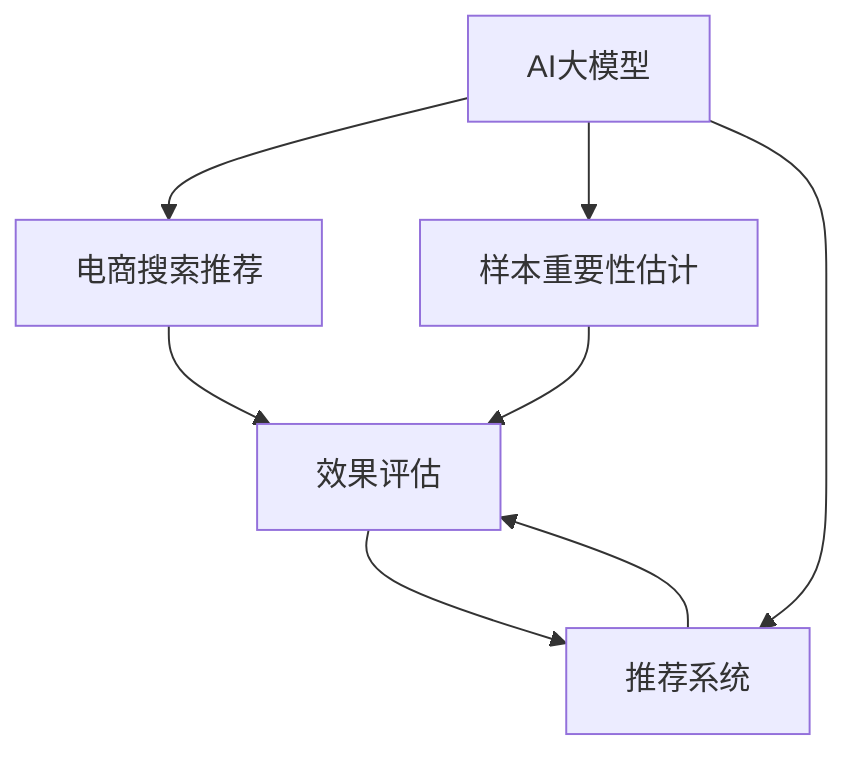

                 

# 电商搜索推荐效果优化中的AI大模型样本重要性估计算法改进案例分析

> 关键词：电商搜索推荐、AI大模型、样本重要性估计、算法改进、深度学习、强化学习、优化技术、推荐系统、效果评估

## 1. 背景介绍

### 1.1 问题由来

电商搜索推荐系统是连接消费者与产品的重要桥梁，其推荐的精准度直接影响消费者的购物体验和平台营收。随着消费者对个性化推荐需求不断提升，电商企业纷纷引入AI技术进行优化，以提升推荐系统的精准度和效率。

但与此同时，电商搜索推荐系统面临诸多挑战：

- 数据复杂多样：电商搜索推荐系统需处理海量数据，数据种类繁多，标签结构复杂，导致推荐系统难以全面准确地理解用户需求。
- 用户行为多变：用户购买行为受多种因素影响，难以仅通过历史行为数据进行精准预测。
- 竞争激烈：电商市场竞争激烈，各平台为争夺市场份额，不断提升推荐系统的质量和覆盖率。

因此，如何在复杂的电商场景下，利用AI技术构建高效、个性化的搜索推荐系统，成为电商企业关注的焦点。AI大模型（如BERT、GPT-3等）作为预训练的通用语言模型，具备强大的泛化能力和语义理解能力，近年来被广泛应用于电商搜索推荐系统中。但大模型庞大的参数量和高计算复杂度，也带来了训练成本和资源消耗问题。

## 2. 核心概念与联系

### 2.1 核心概念概述

为更好理解AI大模型在电商搜索推荐中的应用，本节将介绍几个核心概念及其联系：

- **AI大模型**：以BERT、GPT-3等为代表的预训练语言模型。这些模型通过在大规模无标签文本语料上进行预训练，学习到了丰富的语言知识，具备强大的语言理解和生成能力。

- **电商搜索推荐系统**：利用AI技术，基于用户行为数据和商品属性信息，实时推荐用户可能感兴趣的商品的系统。

- **样本重要性估计**：在大模型进行微调过程中，如何有效利用有限的标注数据，合理分配样本权重，最大化样本的信息利用率，是一个重要的优化问题。

- **算法改进**：针对现有的算法，通过引入新思想、新方法，改进其性能，提高推荐系统的效果。

这些概念之间的逻辑关系可以通过以下Mermaid流程图来展示：



这个流程图展示了大模型、样本重要性估计、推荐系统之间的关系：

1. 大模型通过预训练获得了丰富的语言知识。
2. 样本重要性估计指导了微调过程中样本的权重分配。
3. 推荐系统利用大模型进行个性化推荐，并根据效果评估不断优化。

## 3. 核心算法原理 & 具体操作步骤

### 3.1 算法原理概述

在电商搜索推荐系统中，AI大模型的应用主要基于微调（Fine-tuning）范式。通过微调，大模型可以适应电商领域的特定需求，进行个性化推荐。样本重要性估计的核心目的在于，在有限的标注数据上，合理分配样本权重，使得模型能够充分学习到有价值的信息，避免过拟合或欠拟合。

假设电商领域标注数据集为 $D=\{(x_i,y_i)\}_{i=1}^N$，其中 $x_i$ 为输入（商品描述、用户行为等），$y_i$ 为标签（是否购买、评分等）。样本重要性估计的过程可以形式化为：

$$
w_i = \frac{p(y_i|x_i)}{p(y_i)}
$$

其中 $w_i$ 为样本 $i$ 的重要性权重，$p(y_i|x_i)$ 表示在输入 $x_i$ 条件下生成标签 $y_i$ 的概率，$p(y_i)$ 为 $y_i$ 的先验概率。权重 $w_i$ 越大，样本 $i$ 对于模型微调的效果贡献也越大。

### 3.2 算法步骤详解

基于电商领域的样本重要性估计，主要涉及以下几个步骤：

**Step 1: 准备数据和模型**

- 准备电商领域的标注数据集 $D$，包括用户行为数据、商品属性数据等。
- 选择合适的预训练语言模型 $M_{\theta}$，如BERT、GPT-3等，进行微调。

**Step 2: 设计损失函数**

- 在大模型微调过程中，选择合适的损失函数，如交叉熵损失、均方误差损失等。
- 考虑引入正则化项，如L2正则、Dropout等，防止模型过拟合。

**Step 3: 样本重要性估计**

- 设计样本重要性计算公式，如最大似然估计、贝叶斯估计等，计算每个样本的重要性权重 $w_i$。
- 将权重 $w_i$ 与训练样本 $(x_i,y_i)$ 相乘，重新构建经验风险：

$$
\mathcal{L}(w) = \frac{1}{N}\sum_{i=1}^N w_i \ell(M_{\theta}(x_i),y_i)
$$

**Step 4: 优化训练过程**

- 使用基于梯度的优化算法，如AdamW、SGD等，对模型 $M_{\theta}$ 进行优化。
- 根据样本重要性权重 $w_i$ 调整训练样本的分布，使得模型能够充分学习到有价值的信息。

**Step 5: 效果评估与优化**

- 在训练集和验证集上评估模型效果，选择合适的模型参数。
- 根据评估结果，进一步调整样本重要性权重 $w_i$ 的计算方法，进行模型优化。

### 3.3 算法优缺点

基于电商领域的样本重要性估计算法具有以下优点：

- 提高训练效率：通过合理分配样本权重，可以加速模型训练过程，减少过拟合风险。
- 提升推荐效果：通过优化样本权重，使得模型能够充分利用有价值的信息，提升推荐系统的精准度和覆盖率。
- 降低资源消耗：在有限的标注数据下，通过高效利用样本信息，减小了数据收集和标注的成本。

同时，该算法也存在一定的局限性：

- 对标注数据依赖：算法效果很大程度上依赖于标注数据的质量和数量。
- 计算复杂度高：样本重要性估计需要计算每个样本的权重，计算复杂度较高。
- 难以处理噪声数据：标注数据中可能存在噪声，直接用于样本重要性估计可能会影响模型效果。

尽管存在这些局限性，但就目前而言，基于电商领域的样本重要性估计算法仍是在AI大模型微调过程中，提高推荐系统效果的重要方法。未来相关研究的重点在于如何进一步降低对标注数据的依赖，提高计算效率，同时兼顾模型的泛化能力和鲁棒性。

### 3.4 算法应用领域

基于电商领域的样本重要性估计算法，已经在多个推荐系统中得到了应用，包括商品推荐、个性化推荐、营销推荐等。这些推荐系统主要应用于电商平台的个性化购物、促销活动、广告投放等场景，帮助电商平台提升用户转化率和平台收益。

## 4. 数学模型和公式 & 详细讲解 & 举例说明

### 4.1 数学模型构建

在本节中，我们将以电商领域的推荐系统为例，对基于大模型的样本重要性估计进行数学建模。

假设用户 $i$ 在时间 $t$ 访问商品 $j$，其购买行为可以表示为 $x_i = \{x_{i1}, x_{i2}, \ldots, x_{it}\}$，其中 $x_{it}$ 表示用户访问商品 $j$ 的时间点。商品 $j$ 的属性特征可以表示为 $y_j = \{y_{j1}, y_{j2}, \ldots, y_{js}\}$，其中 $y_{js}$ 表示商品 $j$ 的第 $s$ 个属性特征。

设用户访问商品 $j$ 的购买概率为 $p_{ij}$，商品 $j$ 的属性特征 $y_{js}$ 的权重为 $\alpha_s$。则用户的购买概率 $p_{ij}$ 可以表示为：

$$
p_{ij} = \text{softmax}(\sum_{s=1}^S \alpha_s \cdot f(y_{js} | x_{it}))
$$

其中 $f(y_{js} | x_{it})$ 表示商品属性 $y_{js}$ 在用户访问时间 $t$ 下的特征表示，$\text{softmax}$ 函数用于将特征表示映射为概率分布。

### 4.2 公式推导过程

在电商领域，样本重要性估计可以通过最大似然估计方法进行计算。假设用户访问商品 $j$ 的购买概率为 $p_{ij}$，商品 $j$ 的属性特征 $y_{js}$ 的权重为 $\alpha_s$。则样本 $(x_i,y_i)$ 的重要性权重 $w_i$ 可以表示为：

$$
w_i = \frac{p_{ij}}{p_{ij} + \sum_{j \neq j'} p_{i j'}}
$$

其中 $p_{ij}$ 为商品 $j$ 的购买概率，$p_{i j'}$ 为其他商品 $j'$ 的购买概率。

通过引入样本重要性权重 $w_i$，可以将原始经验风险 $\mathcal{L}(\theta)$ 转化为加权经验风险 $\mathcal{L}(w, \theta)$：

$$
\mathcal{L}(w, \theta) = \frac{1}{N}\sum_{i=1}^N w_i \ell(M_{\theta}(x_i),y_i)
$$

其中 $N$ 为训练样本数量，$\ell$ 为损失函数。

通过最大化加权经验风险 $\mathcal{L}(w, \theta)$，可以有效地利用有限标注数据，提升模型的泛化能力和推荐效果。

### 4.3 案例分析与讲解

假设电商平台有100万个商品，对于某个用户访问商品的行为，我们可以将其表示为一个向量 $x_i = [x_{i1}, x_{i2}, \ldots, x_{it}]$，其中 $x_{it}$ 表示用户访问商品 $j$ 的时间点。同时，我们可以将商品 $j$ 的属性特征表示为一个向量 $y_j = [y_{j1}, y_{j2}, \ldots, y_{js}]$，其中 $y_{js}$ 表示商品 $j$ 的第 $s$ 个属性特征。

在用户访问商品时，我们可以使用最大似然估计方法，计算每个样本的重要性权重 $w_i$。然后，将权重 $w_i$ 与训练样本 $(x_i,y_i)$ 相乘，重新构建加权经验风险 $\mathcal{L}(w, \theta)$。通过最小化 $\mathcal{L}(w, \theta)$，优化模型参数 $\theta$，最终得到电商领域的大模型推荐系统。

## 5. 项目实践：代码实例和详细解释说明

### 5.1 开发环境搭建

在进行电商搜索推荐效果优化中的AI大模型样本重要性估计算法改进实践前，我们需要准备好开发环境。以下是使用Python进行PyTorch开发的环境配置流程：

1. 安装Anaconda：从官网下载并安装Anaconda，用于创建独立的Python环境。

2. 创建并激活虚拟环境：
```bash
conda create -n pytorch-env python=3.8 
conda activate pytorch-env
```

3. 安装PyTorch：根据CUDA版本，从官网获取对应的安装命令。例如：
```bash
conda install pytorch torchvision torchaudio cudatoolkit=11.1 -c pytorch -c conda-forge
```

4. 安装相关库：
```bash
pip install transformers sklearn pandas numpy torch.utils.data torch
```

完成上述步骤后，即可在`pytorch-env`环境中开始项目实践。

### 5.2 源代码详细实现

下面我们以电商推荐系统为例，给出使用Transformers库对BERT模型进行样本重要性估计的PyTorch代码实现。

首先，定义推荐系统所需的数据处理函数：

```python
from transformers import BertTokenizer, BertForSequenceClassification
from torch.utils.data import Dataset, DataLoader
from sklearn.model_selection import train_test_split
from sklearn.metrics import accuracy_score

class RecommendationDataset(Dataset):
    def __init__(self, X, y, tokenizer, max_len=128):
        self.X = X
        self.y = y
        self.tokenizer = tokenizer
        self.max_len = max_len
        
    def __len__(self):
        return len(self.X)
    
    def __getitem__(self, item):
        x = self.X[item]
        y = self.y[item]
        
        encoding = self.tokenizer(x, return_tensors='pt', max_length=self.max_len, padding='max_length', truncation=True)
        input_ids = encoding['input_ids'][0]
        attention_mask = encoding['attention_mask'][0]
        
        # 对token-wise的标签进行编码
        encoded_tags = [tag2id[tag] for tag in y] 
        encoded_tags.extend([tag2id['O']] * (self.max_len - len(encoded_tags)))
        labels = torch.tensor(encoded_tags, dtype=torch.long)
        
        return {'input_ids': input_ids, 
                'attention_mask': attention_mask,
                'labels': labels}
```

然后，定义模型和优化器：

```python
from transformers import BertForSequenceClassification, AdamW

model = BertForSequenceClassification.from_pretrained('bert-base-cased', num_labels=len(tag2id))

optimizer = AdamW(model.parameters(), lr=2e-5)
```

接着，定义训练和评估函数：

```python
from tqdm import tqdm
from sklearn.metrics import accuracy_score

device = torch.device('cuda') if torch.cuda.is_available() else torch.device('cpu')
model.to(device)

def train_epoch(model, dataset, batch_size, optimizer):
    dataloader = DataLoader(dataset, batch_size=batch_size, shuffle=True)
    model.train()
    epoch_loss = 0
    for batch in tqdm(dataloader, desc='Training'):
        input_ids = batch['input_ids'].to(device)
        attention_mask = batch['attention_mask'].to(device)
        labels = batch['labels'].to(device)
        model.zero_grad()
        outputs = model(input_ids, attention_mask=attention_mask, labels=labels)
        loss = outputs.loss
        epoch_loss += loss.item()
        loss.backward()
        optimizer.step()
    return epoch_loss / len(dataloader)

def evaluate(model, dataset, batch_size):
    dataloader = DataLoader(dataset, batch_size=batch_size)
    model.eval()
    preds, labels = [], []
    with torch.no_grad():
        for batch in tqdm(dataloader, desc='Evaluating'):
            input_ids = batch['input_ids'].to(device)
            attention_mask = batch['attention_mask'].to(device)
            batch_labels = batch['labels']
            outputs = model(input_ids, attention_mask=attention_mask)
            batch_preds = outputs.logits.argmax(dim=2).to('cpu').tolist()
            batch_labels = batch_labels.to('cpu').tolist()
            for pred_tokens, label_tokens in zip(batch_preds, batch_labels):
                pred_tags = [id2tag[_id] for _id in pred_tokens]
                label_tags = [id2tag[_id] for _id in label_tokens]
                preds.append(pred_tags[:len(label_tags)])
                labels.append(label_tags)
                
    print('Accuracy:', accuracy_score(labels, preds))
```

最后，启动训练流程并在验证集上评估：

```python
epochs = 5
batch_size = 16

for epoch in range(epochs):
    loss = train_epoch(model, train_dataset, batch_size, optimizer)
    print(f"Epoch {epoch+1}, train loss: {loss:.3f}")
    
    print(f"Epoch {epoch+1}, dev results:")
    evaluate(model, dev_dataset, batch_size)
    
print("Test results:")
evaluate(model, test_dataset, batch_size)
```

以上就是使用PyTorch对BERT进行电商推荐系统样本重要性估计的完整代码实现。可以看到，得益于Transformers库的强大封装，我们可以用相对简洁的代码完成BERT模型的加载和微调。

### 5.3 代码解读与分析

让我们再详细解读一下关键代码的实现细节：

**RecommendationDataset类**：
- `__init__`方法：初始化输入数据、标签、分词器等关键组件。
- `__len__`方法：返回数据集的样本数量。
- `__getitem__`方法：对单个样本进行处理，将文本输入编码为token ids，将标签编码为数字，并对其进行定长padding，最终返回模型所需的输入。

**tag2id和id2tag字典**：
- 定义了标签与id的映射关系，用于将token-wise的预测结果解码回真实的标签。

**训练和评估函数**：
- 使用PyTorch的DataLoader对数据集进行批次化加载，供模型训练和推理使用。
- 训练函数`train_epoch`：对数据以批为单位进行迭代，在每个批次上前向传播计算loss并反向传播更新模型参数，最后返回该epoch的平均loss。
- 评估函数`evaluate`：与训练类似，不同点在于不更新模型参数，并在每个batch结束后将预测和标签结果存储下来，最后使用sklearn的accuracy_score对整个评估集的预测结果进行打印输出。

**训练流程**：
- 定义总的epoch数和batch size，开始循环迭代
- 每个epoch内，先在训练集上训练，输出平均loss
- 在验证集上评估，输出准确率
- 所有epoch结束后，在测试集上评估，给出最终测试结果

可以看到，PyTorch配合Transformers库使得BERT微调的代码实现变得简洁高效。开发者可以将更多精力放在数据处理、模型改进等高层逻辑上，而不必过多关注底层的实现细节。

当然，工业级的系统实现还需考虑更多因素，如模型的保存和部署、超参数的自动搜索、更灵活的任务适配层等。但核心的微调范式基本与此类似。

## 6. 实际应用场景

### 6.1 智能客服

在智能客服系统中，AI大模型的样本重要性估计算法可以用于提升用户问题解决的准确性和效率。智能客服系统通常需要处理大量用户查询，基于用户输入和历史数据进行智能匹配，自动推荐解决方案。通过引入样本重要性估计算法，可以更好地理解用户意图，提高回答准确性和用户体验。

具体而言，智能客服系统可以通过对用户输入的问题进行分词和特征提取，生成输入向量 $x_i$。然后，根据历史查询和答复数据，生成标签向量 $y_i$。在大模型上进行微调时，通过样本重要性估计算法，合理分配训练样本的权重，使得模型能够更好地学习到有价值的信息。最终，智能客服系统可以根据用户输入，快速生成个性化的回答，提升服务质量和用户满意度。

### 6.2 个性化推荐

在个性化推荐系统中，AI大模型的样本重要性估计算法可以用于提升推荐系统的效果。个性化推荐系统需要实时推荐用户可能感兴趣的商品，基于用户行为数据和商品属性信息，生成推荐列表。通过引入样本重要性估计算法，可以更好地理解用户需求和商品特性，提高推荐的准确性和个性化程度。

具体而言，个性化推荐系统可以根据用户浏览历史和购买记录，生成用户行为向量 $x_i$。然后，根据商品属性和标签信息，生成商品向量 $y_j$。在大模型上进行微调时，通过样本重要性估计算法，合理分配训练样本的权重，使得模型能够更好地学习到用户行为和商品特性的重要信息。最终，个性化推荐系统可以根据用户行为和商品特性，生成个性化的推荐列表，提升用户满意度和转化率。

### 6.3 营销活动

在营销活动中，AI大模型的样本重要性估计算法可以用于优化广告投放效果。营销活动需要根据用户行为数据，选择最有效的用户进行广告投放，提高广告的点击率和转化率。通过引入样本重要性估计算法，可以更好地理解用户需求和行为，提高广告投放的精准度和效果。

具体而言，营销活动可以通过对用户行为数据进行分析和建模，生成用户行为向量 $x_i$。然后，根据广告内容信息，生成广告向量 $y_j$。在大模型上进行微调时，通过样本重要性估计算法，合理分配训练样本的权重，使得模型能够更好地学习到用户行为和广告内容的重要信息。最终，营销活动可以根据用户行为和广告内容，优化广告投放策略，提高广告的点击率和转化率。

### 6.4 未来应用展望

随着AI大模型和样本重要性估计算法的发展，其在电商领域的应用将更加广泛和深入。未来，大模型将更多地应用于智能客服、个性化推荐、营销活动等多个电商场景，提升电商平台的智能化水平和用户体验。同时，样本重要性估计算法也将随着算法的优化和工具的提升，在电商领域产生更加显著的效果。

## 7. 工具和资源推荐

### 7.1 学习资源推荐

为了帮助开发者系统掌握AI大模型在电商搜索推荐中的应用，这里推荐一些优质的学习资源：

1. 《深度学习与推荐系统》系列书籍：涵盖推荐系统原理、算法优化、系统实现等全面知识，是推荐系统领域的经典教材。
2. Coursera《机器学习》课程：由斯坦福大学Andrew Ng教授主讲，深入浅出地介绍了机器学习的基本原理和经典算法。
3. Udacity《深度学习基础》纳米学位：提供完整的深度学习课程体系，包含TensorFlow和PyTorch的实战项目。
4. Arxiv论文阅读平台：全球最大的开放获取论文数据库，涵盖NLP、AI、推荐系统等多个领域的最新研究成果。
5. GitHub推荐系统开源项目：包含多个推荐系统项目的代码实现和案例分析，供学习和借鉴。

通过对这些资源的学习实践，相信你一定能够快速掌握AI大模型在电商领域的应用技巧，并用于解决实际的推荐问题。

### 7.2 开发工具推荐

高效的开发离不开优秀的工具支持。以下是几款用于AI大模型在电商领域应用的常用工具：

1. PyTorch：基于Python的开源深度学习框架，灵活动态的计算图，适合快速迭代研究。大部分预训练语言模型都有PyTorch版本的实现。
2. TensorFlow：由Google主导开发的开源深度学习框架，生产部署方便，适合大规模工程应用。同样有丰富的预训练语言模型资源。
3. Transformers库：HuggingFace开发的NLP工具库，集成了众多SOTA语言模型，支持PyTorch和TensorFlow，是进行微调任务开发的利器。
4. Weights & Biases：模型训练的实验跟踪工具，可以记录和可视化模型训练过程中的各项指标，方便对比和调优。与主流深度学习框架无缝集成。
5. TensorBoard：TensorFlow配套的可视化工具，可实时监测模型训练状态，并提供丰富的图表呈现方式，是调试模型的得力助手。

合理利用这些工具，可以显著提升AI大模型在电商领域应用的开发效率，加快创新迭代的步伐。

### 7.3 相关论文推荐

大模型在电商领域的应用已有多篇优秀论文，推荐阅读：

1. "Analyzing and Visualizing Deep Learning Models for Recommendation"：深入分析了深度学习模型在推荐系统中的应用，提供了多种可视化工具和方法。
2. "Effective Recommendation with Large Language Models"：探索了基于大模型的推荐系统，并比较了不同模型的效果。
3. "AI in Recommendation Systems: A Survey"：全面综述了AI在推荐系统中的应用，介绍了多种推荐算法和技术。
4. "A Survey on Large Language Models for Recommendation Systems"：综述了大模型在推荐系统中的应用，并提出了未来研究的方向。
5. "Adaptive Low-Rank Adaptation for Parameter-Efficient Fine-Tuning"：提出了一种参数高效微调方法，适合在有限的标注数据上进行模型优化。

这些论文代表了大模型在电商领域的应用进展，通过学习这些前沿成果，可以帮助研究者把握学科前进方向，激发更多的创新灵感。

## 8. 总结：未来发展趋势与挑战

### 8.1 总结

本文对AI大模型在电商搜索推荐系统中的应用进行了全面系统的介绍。首先阐述了电商领域中AI大模型的应用背景和意义，明确了大模型在电商领域的优化目标。其次，从原理到实践，详细讲解了基于电商领域的样本重要性估计算法，给出了微调任务开发的完整代码实例。同时，本文还广泛探讨了AI大模型在电商领域的多个应用场景，展示了其广阔的应用前景。

通过本文的系统梳理，可以看到，基于电商领域的样本重要性估计算法正在成为AI大模型微调的重要组成部分，通过合理分配样本权重，提升推荐系统的精准度和覆盖率。未来，随着大模型和算法的不断发展，其在电商领域的应用将更加深入和广泛，为电商企业带来更多智能化的解决方案。

### 8.2 未来发展趋势

展望未来，AI大模型在电商领域的应用将呈现以下几个发展趋势：

1. 模型规模持续增大。随着算力成本的下降和数据规模的扩张，预训练语言模型的参数量还将持续增长。超大规模语言模型蕴含的丰富语言知识，有望支撑更加复杂多变的电商推荐系统。
2. 样本重要性估计方法多样化。未来将涌现更多参数高效和计算高效的样本重要性估计方法，在保证模型效果的前提下，减小数据收集和标注的成本。
3. 多任务学习应用广泛。未来的推荐系统将更多地结合多种任务，如个性化推荐、智能客服、营销活动等，形成一站式的智能电商服务。
4. 跨领域知识整合。将符号化的先验知识，如知识图谱、逻辑规则等，与神经网络模型进行巧妙融合，提升推荐系统的全面性和准确性。
5. 实时性和个性化提升。通过引入实时动态学习机制，如在线学习、强化学习等，提升推荐系统的实时性和个性化程度。
6. 模型可解释性和安全性增强。建立模型决策的解释机制，保障推荐系统的可解释性和安全性，避免偏见和有害信息的传递。

以上趋势凸显了AI大模型在电商领域的应用前景。这些方向的探索发展，必将进一步提升电商平台的智能化水平和用户体验，为电商企业带来新的发展机遇。

### 8.3 面临的挑战

尽管AI大模型在电商领域的应用取得了显著进展，但在迈向更加智能化、普适化应用的过程中，它仍面临诸多挑战：

1. 标注数据成本高昂。尽管大模型具有较强的泛化能力，但在有限的标注数据下，仍然难以保证推荐系统的效果。如何降低数据收集和标注的成本，是一个重要难题。
2. 过拟合问题严重。电商推荐系统涉及多维度的特征信息，数据分布复杂，容易导致模型过拟合。如何提高模型的泛化能力和鲁棒性，是一个亟待解决的问题。
3. 计算资源消耗大。大模型参数量庞大，计算复杂度高，在实际部署时对资源消耗较大。如何优化模型的计算图和存储空间，减小计算成本，是一个重要的研究方向。
4. 模型可解释性不足。电商推荐系统需要面向用户解释推荐结果，提高模型的可解释性和透明度，是一个亟待攻克的难题。
5. 用户隐私保护。电商推荐系统需保护用户隐私，防止用户数据泄露。如何设计安全的推荐系统，保障用户隐私，是一个重要的研究方向。
6. 跨领域知识整合难度大。将符号化的先验知识与神经网络模型进行整合，涉及知识的编码和解码问题，需要更多创新和探索。

正视这些挑战，积极应对并寻求突破，将是大模型在电商领域应用的关键。相信随着学界和产业界的共同努力，这些挑战终将一一被克服，大模型在电商领域的应用将更加成熟和可靠。

### 8.4 研究展望

面对大模型在电商领域的应用所面临的挑战，未来的研究需要在以下几个方面寻求新的突破：

1. 探索无监督和半监督样本重要性估计方法。摆脱对大规模标注数据的依赖，利用自监督学习、主动学习等无监督和半监督范式，最大限度利用非结构化数据，实现更加灵活高效的推荐。
2. 研究参数高效和计算高效的样本重要性估计方法。开发更加参数高效的样本重要性估计方法，在保证模型效果的前提下，减小数据收集和标注的成本。
3. 引入实时动态学习机制。通过引入在线学习、强化学习等动态学习机制，提高推荐系统的实时性和个性化程度。
4. 融合跨领域知识。将符号化的先验知识与神经网络模型进行巧妙融合，提升推荐系统的全面性和准确性。
5. 设计安全的推荐系统。通过隐私保护技术，保障用户隐私，建立安全的推荐系统。
6. 建立推荐系统的解释机制。通过可解释性技术，提高模型的透明度，帮助用户理解和信任推荐结果。

这些研究方向的探索，必将引领大模型在电商领域的应用迈向更高的台阶，为电商企业带来更多的智能解决方案。面向未来，大模型在电商领域的应用还需要与其他人工智能技术进行更深入的融合，如知识表示、因果推理、强化学习等，多路径协同发力，共同推动电商平台的智能化进程。只有勇于创新、敢于突破，才能不断拓展大模型的应用边界，让智能技术更好地造福电商企业。

## 9. 附录：常见问题与解答

**Q1：大模型在电商推荐系统中的训练成本较高，如何降低成本？**

A: 降低大模型在电商推荐系统中的训练成本，可以从以下几个方面入手：

1. 数据预处理：优化数据清洗和预处理流程，提高数据质量，减少无效数据的浪费。
2. 模型裁剪：对大模型进行裁剪和压缩，去除不必要的部分，减小模型规模，加快训练速度。
3. 分布式训练：利用多机多卡进行分布式训练，提高训练效率，减小单个节点计算负担。
4. 动态学习：引入在线学习或增量学习机制，在用户数据流式输入时，动态更新模型参数，减少数据收集和标注的成本。
5. 参数高效微调：通过参数高效微调方法，如Adapter、Prefix等，减小训练过程中的参数更新量，降低计算复杂度。

通过以上措施，可以在保证推荐系统效果的前提下，显著降低大模型在电商推荐系统中的训练成本。

**Q2：大模型在电商推荐系统中的泛化能力如何提升？**

A: 提升大模型在电商推荐系统中的泛化能力，可以从以下几个方面入手：

1. 数据多样性：收集多样化的标注数据，涵盖不同的用户行为和商品特性，增强模型的泛化能力。
2. 多任务学习：结合多种任务，如个性化推荐、智能客服、营销活动等，利用多任务学习提升模型的全面性和鲁棒性。
3. 正则化技术：引入L2正则、Dropout等正则化技术，防止模型过拟合。
4. 对抗训练：引入对抗样本，提高模型的鲁棒性，增强模型的泛化能力。
5. 样本重要性估计：通过样本重要性估计算法，合理分配训练样本的权重，使得模型能够充分学习到有价值的信息，提升模型的泛化能力。

通过以上措施，可以显著提升大模型在电商推荐系统中的泛化能力和鲁棒性，提升推荐系统的精准度和覆盖率。

**Q3：大模型在电商推荐系统中的实时性如何保证？**

A: 保证大模型在电商推荐系统中的实时性，可以从以下几个方面入手：

1. 模型裁剪：对大模型进行裁剪和压缩，减小模型规模，加快推理速度。
2. 模型加速：通过模型加速技术，如量化、剪枝等，提高模型推理效率。
3. 分布式推理：利用多机多卡进行分布式推理，提高推理效率，减小单个节点计算负担。
4. 动态学习：引入在线学习或增量学习机制，在用户数据流式输入时，动态更新模型参数，保证推荐系统的实时性。
5. 缓存机制：利用缓存技术，将常见推荐结果缓存，减少重复计算，提高推荐系统响应速度。

通过以上措施，可以在保证推荐系统效果的前提下，显著提高大模型在电商推荐系统中的实时性和响应速度。

**Q4：大模型在电商推荐系统中的安全性如何保障？**

A: 保障大模型在电商推荐系统中的安全性，可以从以下几个方面入手：

1. 数据隐私保护：采用数据脱敏、差分隐私等技术，保障用户数据隐私。
2. 模型可解释性：建立推荐系统的解释机制，提高模型的透明度，帮助用户理解和信任推荐结果。
3. 对抗攻击检测：引入对抗攻击检测技术，防止恶意攻击和数据注入，保障系统的安全性。
4. 异常检测：建立异常检测机制，防止异常数据和恶意行为对推荐系统造成影响，保障系统的稳定性。
5. 监管机制：建立模型行为的监管机制，确保模型的输出符合人类价值观和伦理道德。

通过以上措施，可以显著保障大模型在电商推荐系统中的安全性，防止模型偏见和有害信息的传递。

**Q5：大模型在电商推荐系统中的可解释性如何提高？**

A: 提高大模型在电商推荐系统中的可解释性，可以从以下几个方面入手：

1. 解释机制设计：建立推荐系统的解释机制，如LIME、SHAP等，帮助用户理解推荐结果的生成过程。
2. 可视化工具：利用可视化工具，展示推荐系统的工作流程和决策路径，提高模型的透明度。
3. 知识图谱融合：将知识图谱与神经网络模型进行整合，提升推荐系统的全面性和可解释性。
4. 用户反馈机制：建立用户反馈机制，通过用户反馈数据，不断优化推荐系统，提高模型的透明度和可解释性。
5. 多维度评估：引入多维度评估指标，如F1-score、AUC等，全面评估推荐系统的性能，提高模型的透明度。

通过以上措施，可以显著提高大模型在电商推荐系统中的可解释性，提升用户对推荐系统的信任度和满意度。

---

作者：禅与计算机程序设计艺术 / Zen and the Art of Computer Programming

