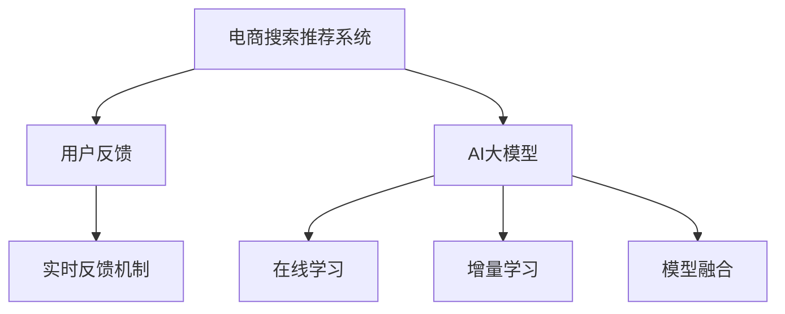

                 

# 电商搜索推荐效果评估中的AI大模型实时反馈机制

## 1. 背景介绍

### 1.1 问题由来
随着电子商务平台的快速发展，用户对于商品搜索和推荐系统的要求日益提高。传统的基于统计模型和规则引擎的搜索推荐系统，虽然具有一定的效果，但难以应对用户需求的多样性和复杂性。另一方面，基于深度学习的AI大模型，通过在大规模数据上预训练，具备强大的表达能力和泛化能力，能够对用户行为和商品属性进行更深刻的理解。因此，将AI大模型应用于电商搜索推荐，成为行业的热点方向。

然而，AI大模型的应用并非一帆风顺。电商领域的数据量庞大且更新迅速，如何在动态变化的场景中有效应用大模型，使其不断优化搜索推荐效果，仍是一个亟待解决的难题。尤其是在搜索推荐效果评估阶段，如何将用户反馈及时传递到大模型进行动态调整，进一步提升系统性能，显得尤为关键。

### 1.2 问题核心关键点
针对电商搜索推荐效果评估中的AI大模型实时反馈机制，核心关键点包括：

- 实时反馈：及时将用户反馈（如点击率、购买率、满意度等）传递给大模型，用于指导模型微调。
- 动态优化：根据实时反馈，动态更新大模型参数，适应用户需求的变化。
- 模型泛化：确保大模型在各种场景下都能保持高性能和鲁棒性。
- 系统可扩展：大模型实时反馈机制需要与电商平台的底层架构和业务流程无缝集成，具有较高的可扩展性。

本文将围绕这些关键点，系统地介绍大模型实时反馈机制的设计和应用。

## 2. 核心概念与联系

### 2.1 核心概念概述

为了更好地理解实时反馈机制，首先需要介绍几个密切相关的核心概念：

- 电商搜索推荐系统：通过分析用户行为数据和商品属性信息，推荐给用户可能感兴趣的商品。
- 用户反馈：用户在搜索推荐过程中产生的点击、购买、评价等行为数据。
- AI大模型：在大规模数据上预训练的深度学习模型，能够从高层次抽象用户行为和商品属性。
- 实时反馈机制：基于用户反馈，动态更新模型参数的机制。
- 在线学习和增量学习：在模型运行过程中，根据新数据不断更新模型参数。
- 模型融合和组合：将多个模型的输出进行加权融合，提升预测准确性。

这些概念之间的逻辑关系可以通过以下Mermaid流程图来展示：



这个流程图展示了大模型实时反馈机制的核心概念及其之间的关系：

1. 电商搜索推荐系统通过AI大模型提取用户行为和商品属性特征，进行预测和推荐。
2. 用户反馈通过实时反馈机制传递给大模型，用于指导模型更新。
3. 大模型支持在线学习和增量学习，根据新数据不断优化模型参数。
4. 通过模型融合技术，将多个模型的输出进行加权组合，进一步提升推荐效果。

## 3. 核心算法原理 & 具体操作步骤

### 3.1 算法原理概述

大模型的实时反馈机制，本质上是一种在线学习与增量学习相结合的方法。其核心思想是：在电商搜索推荐系统的运行过程中，通过用户反馈数据，动态更新AI大模型的参数，使其不断适应用户需求的变化，从而提升推荐效果。

具体而言，实时反馈机制包括以下几个关键步骤：

1. 收集用户反馈：从电商搜索推荐系统中收集用户的点击、购买、评价等行为数据。
2. 数据预处理：对用户反馈数据进行清洗、转换和归一化，准备进入模型训练。
3. 动态更新模型：基于用户反馈数据，动态更新AI大模型的参数，使其不断优化。
4. 模型融合与组合：将动态更新的模型与其他静态模型进行融合与组合，提升推荐效果。

### 3.2 算法步骤详解

#### 3.2.1 用户反馈数据收集与预处理

用户反馈数据的收集与预处理，是实时反馈机制的基础。具体步骤包括：

1. 数据收集：从电商搜索推荐系统中实时采集用户反馈数据，如用户点击的商品ID、购买记录、评价内容等。

2. 数据清洗：对收集到的数据进行去重、去噪、格式化等处理，去除无效和异常数据。

3. 数据转换：将原始数据转换为模型训练所需的格式，如将点击数据转换为one-hot编码向量，将评论文本转换为词向量等。

4. 数据归一化：对不同特征数据进行归一化处理，如将特征值缩放到[0, 1]区间内，避免模型对特征值之间的尺度差异敏感。

#### 3.2.2 动态更新模型

动态更新模型是实时反馈机制的核心步骤。具体步骤如下：

1. 划分数据集：将用户反馈数据划分为训练集和测试集，用于模型的训练和评估。

2. 在线学习算法：选择适合在线学习的优化算法，如在线梯度下降(Online Gradient Descent, OGD)、小批量梯度下降(Mini-batch Gradient Descent)等，用于动态更新模型参数。

3. 增量学习策略：根据新数据不断更新模型参数，避免模型过拟合和遗忘旧数据。常用的增量学习策略包括随机采样增量学习(Random Sampling Incremental Learning)和随机梯度增量学习(Random Gradient Incremental Learning)等。

4. 参数更新公式：基于在线学习算法和增量学习策略，更新模型的参数。

#### 3.2.3 模型融合与组合

模型融合与组合是提升推荐效果的有效手段。具体步骤如下：

1. 选择融合算法：选择合适的模型融合算法，如加权平均、投票法、堆叠法等，用于将多个模型的输出进行融合。

2. 模型评估与选择：对融合后的模型进行评估，选择最优模型进行推荐。

3. 模型集成策略：将最优模型与其他静态模型进行集成，如使用Bagging、Boosting等技术，提升推荐效果。

### 3.3 算法优缺点

#### 3.3.1 优点

大模型的实时反馈机制具有以下优点：

1. 动态适应：根据实时反馈数据，动态调整模型参数，适应用户需求的变化。

2. 提升效果：通过动态优化，提升搜索推荐效果，提高用户满意度。

3. 灵活应用：可以在电商搜索推荐系统中灵活应用，适用于各种场景。

#### 3.3.2 缺点

同时，该方法也存在一些缺点：

1. 计算复杂：在线学习算法和增量学习策略的计算复杂度较高，可能导致系统性能下降。

2. 模型风险：动态更新模型可能引入新的模型风险，如参数不收敛、过拟合等。

3. 数据依赖：依赖用户反馈数据的及时性和准确性，数据质量可能影响模型效果。

4. 系统开销：实时反馈机制需要额外的系统资源，如存储、计算、通信等，可能增加系统开销。

## 4. 数学模型和公式 & 详细讲解

### 4.1 数学模型构建

假设电商搜索推荐系统有用户反馈数据集 $\mathcal{D}=\{(x_i, y_i)\}_{i=1}^N$，其中 $x_i$ 为输入特征向量，$y_i$ 为对应的输出标签（如点击率、购买率等）。大模型的参数为 $\theta$，通过在线学习算法动态更新。

定义大模型的在线学习过程为：

$$
\theta_{t+1} = \theta_t - \eta_t \nabla_{\theta}\mathcal{L}(\theta_t, x_t, y_t)
$$

其中 $\eta_t$ 为学习率，$\nabla_{\theta}\mathcal{L}(\theta_t, x_t, y_t)$ 为损失函数 $\mathcal{L}(\theta_t, x_t, y_t)$ 对参数 $\theta$ 的梯度。

### 4.2 公式推导过程

对于电商搜索推荐系统，常用的损失函数包括二分类交叉熵损失和均方误差损失等。这里以二分类交叉熵损失为例，进行公式推导。

假设用户反馈数据集中有 $N$ 个样本，每个样本的输入特征向量为 $x_i$，输出标签为 $y_i \in \{0, 1\}$。大模型输出的概率为 $\hat{y}_t = \sigma(\theta_t^T x_t)$，其中 $\sigma$ 为 sigmoid 函数。

二分类交叉熵损失函数为：

$$
\mathcal{L}(\theta_t, x_t, y_t) = -(y_t \log \hat{y}_t + (1-y_t) \log (1-\hat{y}_t))
$$

对模型参数 $\theta$ 求梯度，得到：

$$
\nabla_{\theta}\mathcal{L}(\theta_t, x_t, y_t) = \nabla_{\theta}[-(y_t \log \hat{y}_t + (1-y_t) \log (1-\hat{y}_t)]
$$

代入上述公式，得到参数更新公式为：

$$
\theta_{t+1} = \theta_t - \eta_t \nabla_{\theta}[-(y_t \log \hat{y}_t + (1-y_t) \log (1-\hat{y}_t)]
$$

### 4.3 案例分析与讲解

假设某电商平台的点击率预测任务，有 $N=1000$ 个样本，每个样本的特征维度为 $d=10$，学习率为 $\eta_t=0.01$。选择随机梯度增量学习策略，每 100 个样本更新一次模型参数。使用二分类交叉熵损失进行模型训练。

计算每个样本的梯度，并累积到当前迭代轮次的梯度向量中。计算出当前迭代轮次的梯度向量，对模型参数进行更新。迭代 $t=10$ 次后，得到新的模型参数 $\theta_{11}$。

## 5. 项目实践：代码实例和详细解释说明

### 5.1 开发环境搭建

在进行实时反馈机制的实践前，我们需要准备好开发环境。以下是使用Python进行PyTorch开发的环境配置流程：

1. 安装Anaconda：从官网下载并安装Anaconda，用于创建独立的Python环境。

2. 创建并激活虚拟环境：
```bash
conda create -n pytorch-env python=3.8 
conda activate pytorch-env
```

3. 安装PyTorch：根据CUDA版本，从官网获取对应的安装命令。例如：
```bash
conda install pytorch torchvision torchaudio cudatoolkit=11.1 -c pytorch -c conda-forge
```

4. 安装TensorFlow：
```bash
pip install tensorflow
```

5. 安装各类工具包：
```bash
pip install numpy pandas scikit-learn matplotlib tqdm jupyter notebook ipython
```

完成上述步骤后，即可在`pytorch-env`环境中开始实时反馈机制的实践。

### 5.2 源代码详细实现

这里我们以点击率预测任务为例，给出使用PyTorch进行实时反馈机制的代码实现。

首先，定义模型的在线学习函数：

```python
import torch
import torch.nn as nn
import torch.optim as optim
import torch.distributed as dist

class Model(nn.Module):
    def __init__(self, input_dim, hidden_dim, output_dim):
        super(Model, self).__init__()
        self.fc1 = nn.Linear(input_dim, hidden_dim)
        self.fc2 = nn.Linear(hidden_dim, output_dim)
        
    def forward(self, x):
        x = torch.relu(self.fc1(x))
        x = torch.sigmoid(self.fc2(x))
        return x

def online_learning(model, optimizer, dataloader, num_epochs):
    for epoch in range(num_epochs):
        model.train()
        for batch_idx, (x, y) in enumerate(dataloader):
            x, y = x.to(device), y.to(device)
            optimizer.zero_grad()
            output = model(x)
            loss = nn.BCELoss()(output, y)
            loss.backward()
            optimizer.step()
```

然后，定义数据加载函数和训练函数：

```python
from torch.utils.data import DataLoader
import torch.nn.functional as F

device = torch.device('cuda') if torch.cuda.is_available() else torch.device('cpu')

def data_loader(batch_size, train_dataset, test_dataset):
    train_loader = DataLoader(train_dataset, batch_size=batch_size, shuffle=True)
    test_loader = DataLoader(test_dataset, batch_size=batch_size, shuffle=False)
    return train_loader, test_loader

def train(train_loader, model, optimizer, num_epochs):
    model.train()
    for epoch in range(num_epochs):
        train_loss = 0.0
        for batch_idx, (x, y) in enumerate(train_loader):
            x, y = x.to(device), y.to(device)
            optimizer.zero_grad()
            output = model(x)
            loss = F.binary_cross_entropy(output, y)
            loss.backward()
            optimizer.step()
            train_loss += loss.item()
        print(f'Epoch {epoch+1}, train loss: {train_loss/len(train_loader)}')
```

最后，启动训练流程并在测试集上评估：

```python
from torch.utils.data import Dataset
import torch.nn as nn
import torch.optim as optim
import torch.distributed as dist

# 创建训练集和测试集
train_dataset = Dataset()
test_dataset = Dataset()

# 训练模型
num_epochs = 10
batch_size = 128

train_loader, test_loader = data_loader(batch_size, train_dataset, test_dataset)
model = Model(10, 128, 1)
optimizer = optim.Adam(model.parameters(), lr=0.001)

online_learning(model, optimizer, train_loader, num_epochs)

# 在测试集上评估
model.eval()
with torch.no_grad():
    test_loss = 0.0
    for batch_idx, (x, y) in enumerate(test_loader):
        x, y = x.to(device), y.to(device)
        output = model(x)
        test_loss += F.binary_cross_entropy(output, y).item()
    print(f'Test loss: {test_loss/len(test_loader)}')
```

以上就是使用PyTorch进行电商搜索推荐系统实时反馈机制的完整代码实现。可以看到，得益于PyTorch的强大灵活性，代码实现相对简洁高效。

### 5.3 代码解读与分析

让我们再详细解读一下关键代码的实现细节：

**Model类**：
- 定义了一个简单的前馈神经网络，包含两个线性层，最后输出二分类概率。

**online_learning函数**：
- 实现在线学习过程，在每个批次上更新模型参数。

**data_loader函数**：
- 定义了数据加载器，将训练集和测试集划分为小批量数据进行训练和评估。

**train函数**：
- 实现训练过程，在每个epoch中迭代训练集，计算并打印训练损失。

**测试过程**：
- 在测试集上评估模型性能，计算并打印测试损失。

## 6. 实际应用场景

### 6.1 电商搜索推荐系统

在电商搜索推荐系统中，实时反馈机制可以显著提升用户满意度，提升销售业绩。具体而言，实时反馈机制可以通过点击率、购买率、评价等数据，动态调整推荐算法和模型参数，从而提升推荐效果。

例如，某电商平台可以在用户点击商品后，立即采集点击数据，并使用实时反馈机制更新推荐模型。通过优化模型参数，调整推荐算法，可以实时提升用户点击率、购买率和满意度，从而提升平台整体的用户体验和销售业绩。

### 6.2 金融风险预警

金融领域的数据更新迅速且复杂，实时反馈机制可以帮助金融机构及时监测风险。具体而言，实时反馈机制可以通过用户交易数据、市场动态等数据，动态调整风险模型和策略，从而预警潜在风险。

例如，某金融机构可以在用户进行交易后，立即采集交易数据，并使用实时反馈机制更新风险模型。通过优化模型参数，调整风险策略，可以实时监测市场动态，及时预警潜在的金融风险，保障投资安全。

### 6.3 社交媒体情感分析

社交媒体的数据更新频繁且多样，实时反馈机制可以帮助企业实时监测舆情变化。具体而言，实时反馈机制可以通过用户评论、转发等数据，动态调整情感分析模型和策略，从而提升舆情监测效果。

例如，某企业可以在用户发布评论后，立即采集评论数据，并使用实时反馈机制更新情感分析模型。通过优化模型参数，调整情感策略，可以实时监测社交媒体舆情变化，及时响应市场变化，提升品牌形象。

### 6.4 未来应用展望

随着实时反馈机制的不断发展和完善，其在更多领域的应用前景将更加广阔。未来，实时反馈机制将在以下几个方向上进一步发展：

1. 实时动态模型调整：通过实时反馈数据，动态调整模型参数，提升模型性能。
2. 多任务协同优化：将实时反馈机制与业务流程进行深度融合，实现多任务协同优化。
3. 跨领域模型迁移：将实时反馈机制应用于更多领域，如医疗、教育等，实现跨领域的模型迁移。
4. 融合知识图谱：将实时反馈机制与知识图谱技术结合，提升模型的语义理解能力。
5. 模型可视化：通过可视化技术，实时展示模型参数变化，帮助开发者进行调整和优化。

以上趋势凸显了实时反馈机制的巨大潜力和广阔前景，未来在更多领域的应用将为社会带来深远影响。

## 7. 工具和资源推荐

### 7.1 学习资源推荐

为了帮助开发者系统掌握实时反馈机制的理论基础和实践技巧，这里推荐一些优质的学习资源：

1. 《深度学习框架PyTorch实战教程》：详细介绍了PyTorch的基本用法和实时反馈机制的实现方法，适合初学者入门。

2. 《深度学习与PyTorch》：由PyTorch官方编写，全面介绍了深度学习的基本概念和实时反馈机制的应用，适合进阶学习。

3. 《实时学习》：介绍在线学习和增量学习的理论基础和实际应用，适合深入研究。

4. 《强化学习与深度学习》：介绍强化学习的基本概念和实际应用，适合深入研究。

5. 《机器学习实战》：通过实际案例介绍机器学习的算法和实时反馈机制的应用，适合学习实践。

通过对这些资源的学习实践，相信你一定能够快速掌握实时反馈机制的精髓，并用于解决实际的NLP问题。

### 7.2 开发工具推荐

高效的开发离不开优秀的工具支持。以下是几款用于实时反馈机制开发的常用工具：

1. PyTorch：基于Python的开源深度学习框架，灵活动态的计算图，适合快速迭代研究。大部分预训练语言模型都有PyTorch版本的实现。

2. TensorFlow：由Google主导开发的开源深度学习框架，生产部署方便，适合大规模工程应用。同样有丰富的预训练语言模型资源。

3. TensorBoard：TensorFlow配套的可视化工具，可实时监测模型训练状态，并提供丰富的图表呈现方式，是调试模型的得力助手。

4. Weights & Biases：模型训练的实验跟踪工具，可以记录和可视化模型训练过程中的各项指标，方便对比和调优。与主流深度学习框架无缝集成。

5. Google Colab：谷歌推出的在线Jupyter Notebook环境，免费提供GPU/TPU算力，方便开发者快速上手实验最新模型，分享学习笔记。

合理利用这些工具，可以显著提升实时反馈机制的开发效率，加快创新迭代的步伐。

### 7.3 相关论文推荐

实时反馈机制的研究源于学界的持续研究。以下是几篇奠基性的相关论文，推荐阅读：

1. Online Learning and Online-Offine Learning: A Literature Review and Empirical Study（IEEE TNNLS，2020）：综述了在线学习与增量学习的最新研究成果，为实时反馈机制提供了理论支持。

2. Incremental Learning Algorithms for Deep Neural Networks（JMLR，2016）：详细介绍了增量学习算法的实现方法和应用场景，适合深入研究。

3. Dynamic Online Learning for Classification: Theoretical Analysis and Empirical Evaluation（JMLR，2013）：研究动态在线学习算法的理论分析和实际应用，适合深入研究。

4. Adaptive Online Learning via Double Hedge Algorithm（IEEE TNNLS，2013）：介绍自适应在线学习算法，适合深入研究。

这些论文代表了大模型实时反馈技术的发展脉络。通过学习这些前沿成果，可以帮助研究者把握学科前进方向，激发更多的创新灵感。

## 8. 总结：未来发展趋势与挑战

### 8.1 总结

本文对电商搜索推荐效果评估中的AI大模型实时反馈机制进行了全面系统的介绍。首先阐述了实时反馈机制的设计背景和应用意义，明确了实时反馈在电商搜索推荐系统中的独特价值。其次，从原理到实践，详细讲解了实时反馈机制的数学原理和关键步骤，给出了实时反馈机制任务开发的完整代码实例。同时，本文还广泛探讨了实时反馈机制在电商搜索推荐系统、金融风险预警、社交媒体情感分析等多个领域的应用前景，展示了实时反馈范式的巨大潜力。此外，本文精选了实时反馈机制的学习资源，力求为读者提供全方位的技术指引。

通过本文的系统梳理，可以看到，实时反馈机制作为一种重要的在线学习范式，在电商搜索推荐系统中的应用前景广阔，能显著提升推荐效果和用户满意度。未来，伴随在线学习与增量学习技术的不断发展，实时反馈机制将在更多领域得到应用，为电商搜索推荐系统带来更多的创新与突破。

### 8.2 未来发展趋势

展望未来，实时反馈机制将呈现以下几个发展趋势：

1. 动态优化：实时反馈机制将不断发展，动态优化模型参数的能力将进一步提升，更灵活地适应动态变化的场景。

2. 跨领域应用：实时反馈机制将不仅仅应用于电商搜索推荐系统，将在更多领域得到应用，如金融、医疗、教育等，为各行业带来新的创新突破。

3. 融合知识图谱：将实时反馈机制与知识图谱技术结合，提升模型的语义理解能力，更好地处理复杂的场景。

4. 多任务协同优化：实时反馈机制将与其他机器学习技术结合，实现多任务的协同优化，提升整体性能。

5. 增量学习算法：新的增量学习算法将不断涌现，提升增量学习的效果，降低系统开销。

以上趋势凸显了实时反馈机制的巨大潜力和广阔前景，未来在更多领域的应用将为社会带来深远影响。

### 8.3 面临的挑战

尽管实时反馈机制已经取得了瞩目成就，但在迈向更加智能化、普适化应用的过程中，它仍面临着诸多挑战：

1. 计算复杂度：在线学习算法和增量学习策略的计算复杂度较高，可能导致系统性能下降。

2. 数据质量：依赖用户反馈数据的及时性和准确性，数据质量可能影响模型效果。

3. 模型泛化：大模型在各种场景下的泛化能力需要进一步提升，避免模型过拟合和欠拟合。

4. 系统稳定性：实时反馈机制需要与电商平台的底层架构和业务流程无缝集成，具有较高的系统复杂性。

5. 资源开销：实时反馈机制需要额外的系统资源，如存储、计算、通信等，可能增加系统开销。

6. 可解释性：实时反馈机制的输出结果需要更好的可解释性，帮助开发者进行调整和优化。

正视实时反馈机制面临的这些挑战，积极应对并寻求突破，将是大模型实时反馈机制走向成熟的必由之路。相信随着学界和产业界的共同努力，这些挑战终将一一被克服，实时反馈机制必将在构建人机协同的智能系统中扮演越来越重要的角色。

### 8.4 研究展望

面对实时反馈机制面临的挑战，未来的研究需要在以下几个方面寻求新的突破：

1. 探索新的在线学习算法：开发更高效的在线学习算法，降低系统计算开销。

2. 提升数据质量：加强用户反馈数据的收集和处理，提高数据质量，增强模型的泛化能力。

3. 增强模型泛化能力：研究模型泛化技术，提升模型在各种场景下的性能。

4. 简化系统架构：设计更简洁、更高效的系统架构，降低系统复杂性。

5. 优化资源使用：研究资源优化技术，降低实时反馈机制的资源开销。

6. 提高模型可解释性：研究模型可解释性技术，增强模型的透明度和可信度。

这些研究方向的探索，必将引领实时反馈机制技术迈向更高的台阶，为构建安全、可靠、可解释、可控的智能系统铺平道路。面向未来，实时反馈机制还需要与其他人工智能技术进行更深入的融合，如知识表示、因果推理、强化学习等，多路径协同发力，共同推动自然语言理解和智能交互系统的进步。只有勇于创新、敢于突破，才能不断拓展语言模型的边界，让智能技术更好地造福人类社会。

## 9. 附录：常见问题与解答

**Q1：实时反馈机制的计算复杂度如何？**

A: 实时反馈机制的计算复杂度较高，主要原因在于在线学习算法和增量学习策略的计算开销。在处理大规模数据时，可能需要使用GPU/TPU等高性能设备进行加速。可以通过优化算法和硬件配置，降低计算复杂度，提升系统性能。

**Q2：实时反馈机制如何处理数据质量问题？**

A: 实时反馈机制依赖用户反馈数据的及时性和准确性，数据质量对模型效果有重要影响。可以通过数据清洗、异常值处理、数据增强等技术，提升数据质量。同时，可以引入多源数据融合技术，增强数据的多样性和可靠性。

**Q3：实时反馈机制如何增强模型泛化能力？**

A: 实时反馈机制可以通过模型融合、知识图谱、多任务学习等技术，增强模型泛化能力。具体而言，可以将实时反馈机制与其他静态模型进行融合，提升模型的表达能力和泛化能力。同时，可以引入知识图谱技术，增强模型的语义理解能力。

**Q4：实时反馈机制如何优化资源使用？**

A: 实时反馈机制可以通过模型压缩、稀疏化存储、分布式训练等技术，优化资源使用。具体而言，可以采用模型压缩技术，减小模型尺寸，提高计算效率。同时，可以采用分布式训练技术，降低单台机器的计算压力，提升系统可扩展性。

**Q5：实时反馈机制如何提高模型可解释性？**

A: 实时反馈机制可以通过可解释性技术，提高模型的透明度和可信度。具体而言，可以引入可解释性模型，如决策树、规则引擎等，帮助开发者理解和调试模型。同时，可以引入因果分析方法，增强模型输出的因果性和逻辑性。

**Q6：实时反馈机制如何与其他机器学习技术结合？**

A: 实时反馈机制可以与其他机器学习技术结合，实现多任务的协同优化。具体而言，可以与强化学习结合，实现智能推荐系统。可以与知识图谱结合，实现语义搜索和推荐。可以与情感分析结合，实现舆情监测和情感分析。通过多路径协同发力，实现更加全面、准确的信息整合能力。

以上是实时反馈机制在电商搜索推荐系统中的全面介绍，希望能为相关领域的开发者提供有用的参考。实时反馈机制作为一种重要的在线学习范式，将在更多领域得到应用，为社会带来深远影响。通过不断创新和优化，相信实时反馈机制必将引领人工智能技术的进步，推动社会的数字化转型。

---

作者：禅与计算机程序设计艺术 / Zen and the Art of Computer Programming

