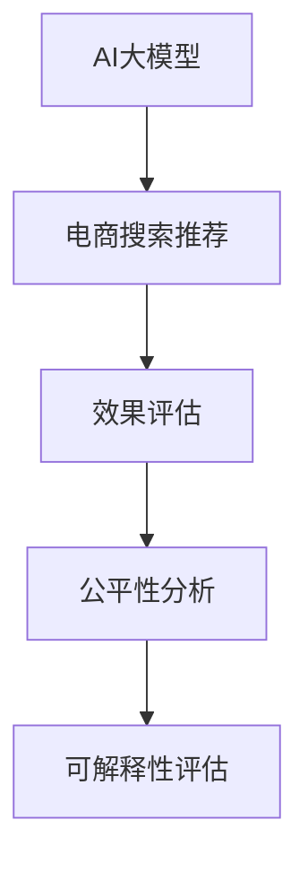

                 

# 电商搜索推荐效果评估中的AI大模型模型可解释性评估技术

> 关键词：AI大模型,可解释性评估,电商搜索推荐,效果评估,自然语言处理(NLP),电商数据分析,机器学习模型,深度学习模型,公平性分析,用户行为研究,决策支持

## 1. 背景介绍

在现代电商平台上，搜索结果和推荐系统的准确性与个性化是提升用户体验和转化的关键因素。这些系统通常基于复杂的机器学习模型和大规模数据分析技术构建，以实现高效的搜索和推荐。然而，随着模型的复杂性不断增加，模型的可解释性变得愈发重要。用户希望理解模型如何做出决策，同时也需要通过公平性分析来确保模型不会产生歧视性的输出。

### 1.1 电商搜索推荐系统的发展现状

电商搜索推荐系统近年来取得了显著的进步，这些系统通过机器学习算法分析用户的搜索历史、浏览行为、购买记录等数据，预测用户的兴趣和偏好，从而提供个性化的搜索结果和推荐内容。主要的算法包括协同过滤、深度学习、自然语言处理等。其中，基于大模型的推荐系统利用自回归模型、自编码器等深度神经网络，在电商平台上的应用越来越广泛。

然而，大模型的复杂性也带来了新的挑战。在推荐效果评估中，如何评估模型的公平性、鲁棒性、透明性，以及如何解释模型的决策过程，成为了亟待解决的问题。这些问题不仅关系到模型的性能，也直接影响到用户的信任和系统的可持续发展。

### 1.2 可解释性评估的重要性

模型的可解释性是指用户能够理解模型的决策依据和输出结果的能力。在电商搜索推荐中，用户需要了解模型如何从他们的行为数据中提取信息，并基于这些信息做出推荐。模型的可解释性有助于建立用户信任，提高系统的透明度，并确保模型的决策是公平和可信的。

特别是在涉及用户隐私和敏感信息的应用场景下，如金融、医疗、司法等领域，模型的可解释性显得尤为重要。用户需要知道模型是如何做出决策的，以确保决策过程是公正的，同时避免潜在的偏见和错误。

## 2. 核心概念与联系

### 2.1 核心概念概述

为更好地理解电商搜索推荐效果评估中的AI大模型模型可解释性评估技术，本节将介绍几个关键概念：

- AI大模型：以Transformer、BERT等深度学习模型为代表的大规模预训练语言模型，具有强大的语言理解和生成能力，广泛应用于电商搜索推荐系统中。
- 可解释性评估：通过分析模型的决策过程，量化模型的公平性、透明性和可信度，确保模型不会产生歧视性输出，同时提供用户可理解的高质量解释。
- 电商搜索推荐：电商平台上的推荐系统，通过分析用户行为数据，预测用户的兴趣和需求，提供个性化的搜索结果和推荐内容，提升用户体验和转化率。
- 效果评估：评估推荐系统在电商场景中的实际表现，如准确性、个性化、覆盖率等指标，以及评估模型的鲁棒性和可扩展性。
- 公平性分析：评估模型是否在性别、年龄、地域等方面存在偏见，确保所有用户获得公平的推荐服务。

这些概念之间的逻辑关系可以通过以下Mermaid流程图来展示：



这个流程图展示了大模型在电商推荐中的应用，以及与其相关的评估方法和技术：

1. 大模型通过预训练学习到通用的语言表示，用于电商推荐系统的个性化推荐。
2. 效果评估衡量推荐系统的实际表现，如个性化程度、覆盖率、准确性等。
3. 公平性分析确保推荐系统不产生歧视性输出，确保所有用户公平获取推荐服务。
4. 可解释性评估分析模型的决策过程，提高模型的透明度和可信度，确保用户理解模型决策依据。

## 3. 核心算法原理 & 具体操作步骤

### 3.1 算法原理概述

电商搜索推荐系统中的AI大模型可解释性评估，主要通过以下步骤实现：

1. **数据准备**：收集用户行为数据和模型预测结果，构建标注数据集。
2. **模型训练**：训练解释模型，用于量化模型的公平性、透明性和可信度。
3. **可解释性分析**：使用解释模型分析推荐系统的决策过程，提供用户可理解的高质量解释。
4. **效果评估**：结合效果评估和公平性分析的结果，综合衡量推荐系统的性能。

### 3.2 算法步骤详解

#### 3.2.1 数据准备

电商搜索推荐系统中的用户行为数据通常包括：

- 用户ID、商品ID、行为时间戳等基本信息。
- 用户的浏览记录、点击记录、购买记录等行为数据。
- 用户的地理位置、性别、年龄等人口统计特征。
- 模型的推荐结果和预测标签。

这些数据需要经过预处理，如去噪、归一化、缺失值填充等，构建训练数据集和测试数据集。

#### 3.2.2 模型训练

构建解释模型，用于量化模型的公平性、透明性和可信度。常用的解释模型包括LIME、SHAP等。

- **LIME（Local Interpretable Model-agnostic Explanations）**：通过构建局部模型，解释模型的决策。LIME通过采集模型在特定输入上的预测，训练一个简单的局部模型，用于解释模型的决策。
- **SHAP（SHapley Additive exPlanations）**：基于博弈论的Shapley值，用于解释模型特征对输出的贡献。SHAP可以提供全局和局部的特征贡献分析。

使用这些解释模型对电商推荐系统进行训练，分别生成模型的公平性、透明性和可信度指标。

#### 3.2.3 可解释性分析

使用解释模型分析推荐系统的决策过程，提供用户可理解的高质量解释。

- **局部模型解释**：使用LIME生成局部模型，解释模型在特定输入上的决策。
- **特征贡献分析**：使用SHAP分析特征对模型输出的贡献，理解模型是如何基于用户行为数据做出推荐的。
- **公平性分析**：使用 fairness metrics，如Demographic Parity、Equalized Odds 等，评估模型是否存在歧视性，确保所有用户获得公平的推荐服务。

#### 3.2.4 效果评估

结合效果评估和公平性分析的结果，综合衡量推荐系统的性能。

- **个性化评估**：评估推荐系统在个性化程度、覆盖率、推荐多样性等方面的表现。
- **准确性评估**：评估模型的推荐准确性，如点击率、转化率等指标。
- **覆盖率评估**：评估推荐系统覆盖的商品种类和用户群体的多样性。

### 3.3 算法优缺点

#### 3.3.1 优点

- **提高用户信任度**：通过提供可解释的决策依据，提升用户对系统的信任和接受度。
- **增强模型透明度**：提供清晰的决策过程，便于开发者理解和调试模型。
- **避免歧视性输出**：通过公平性分析，确保推荐系统不产生歧视性输出，保护用户权益。
- **支持决策支持**：可解释性分析结果可以用于支持决策，帮助业务人员理解模型行为，优化业务流程。

#### 3.3.2 缺点

- **增加计算复杂度**：解释模型需要额外计算，增加系统复杂度和计算资源需求。
- **解释结果难以理解**：解释模型生成的结果可能复杂难懂，用户难以完全理解。
- **影响模型性能**：解释模型的引入可能影响原始模型的性能，特别是在模型规模较大的情况下。

### 3.4 算法应用领域

基于大模型的电商搜索推荐系统中的可解释性评估，已经在多个领域得到了广泛应用，例如：

- 个性化推荐系统：使用解释模型分析推荐系统决策过程，提升个性化推荐效果。
- 广告投放系统：评估广告投放的公平性，确保广告投放不歧视特定用户群体。
- 金融信贷系统：分析贷款审批决策的公平性，避免对不同群体的歧视。
- 医疗诊断系统：评估医疗诊断决策的透明性，确保医生诊断的公正性和可信度。
- 法律判决系统：分析法律判决的依据，确保司法公正和透明。

这些应用领域展示了AI大模型可解释性评估技术在不同场景下的强大潜力。

## 4. 数学模型和公式 & 详细讲解 & 举例说明

### 4.1 数学模型构建

假设电商推荐系统中的用户行为数据为 $D=\{(x_i, y_i)\}_{i=1}^N$，其中 $x_i$ 为行为特征向量，$y_i$ 为标签，即推荐结果。模型的决策函数为 $f(x)$，用于预测标签 $y$。解释模型用于生成模型决策的可解释性指标 $\epsilon(x)$。

模型的可解释性评估目标是最小化解释模型的误差，即：

$$
\min_{\epsilon} \sum_{i=1}^N (f(x_i) - y_i)^2
$$

其中，$\epsilon$ 为解释模型，$f(x)$ 为推荐模型，$y_i$ 为标签，$(f(x_i) - y_i)^2$ 为预测误差。

### 4.2 公式推导过程

#### 4.2.1 LIME局部模型解释

LIME通过构建局部模型 $g(x)$ 解释模型 $f(x)$ 的决策。假设模型的预测结果为 $f(x)$，局部模型 $g(x)$ 的预测结果为 $g(x)$。

LIME的优化目标是最小化局部模型和原始模型之间的差异：

$$
\min_{g} \sum_{i=1}^N (f(x_i) - g(x_i))^2
$$

使用随机梯度下降（SGD）等优化算法，求解局部模型的参数。得到局部模型后，使用局部模型解释模型在特定输入上的决策。

#### 4.2.2 SHAP特征贡献分析

SHAP通过计算每个特征对模型输出的贡献，分析特征的重要性。假设模型的预测结果为 $f(x)$，特征对输出的贡献为 $c_j(x)$。

SHAP的优化目标是最小化模型输出的误差：

$$
\min_{c_j} \sum_{i=1}^N (f(x_i) - \sum_{j=1}^M c_j(x_i)y_j)^2
$$

其中，$M$ 为特征数量，$c_j(x_i)$ 为特征 $j$ 对模型输出的贡献。使用Laplace分布等算法求解每个特征的贡献 $c_j(x)$。

### 4.3 案例分析与讲解

#### 4.3.1 电商搜索推荐系统的公平性分析

电商推荐系统中的公平性分析主要关注模型是否在性别、年龄、地域等方面存在偏见。假设模型输出结果为 $y_i \in \{0, 1\}$，表示用户是否对某个商品感兴趣。

使用 Demographic Parity 指标评估模型的公平性：

$$
DP = \frac{1}{N} \sum_{i=1}^N \mathbb{E}[y_i|S_i = 1] = \frac{1}{N} \sum_{i=1}^N \mathbb{E}[y_i|S_i = 0]
$$

其中，$S_i$ 为用户的性别、年龄、地域等特征。如果 $DP \approx 0.5$，则模型不产生性别、年龄、地域等歧视。

#### 4.3.2 电商搜索推荐系统的效果评估

电商推荐系统的效果评估通常从以下几个方面进行：

- **个性化评估**：使用 A/B 测试等方法，评估推荐系统的个性化程度。
- **覆盖率评估**：统计推荐系统中商品种类的多样性，以及覆盖的用户群体多样性。
- **准确性评估**：评估推荐系统的点击率、转化率等指标。

### 4.4 案例分析与讲解

#### 4.4.1 个性化推荐系统的效果评估

假设电商推荐系统推荐商品给用户，商品标签为 $y_i \in \{0, 1\}$。

使用个性化评估指标，如召回率、点击率、转化率等，评估推荐系统的个性化效果：

- **召回率**：评估模型是否推荐了用户感兴趣的商品。
- **点击率**：评估用户对推荐商品的点击行为。
- **转化率**：评估用户对推荐商品的购买行为。

## 5. 项目实践：代码实例和详细解释说明

### 5.1 开发环境搭建

在进行电商搜索推荐系统效果评估中的AI大模型可解释性评估技术开发前，我们需要准备好开发环境。以下是使用Python进行PyTorch开发的环境配置流程：

1. 安装Anaconda：从官网下载并安装Anaconda，用于创建独立的Python环境。

2. 创建并激活虚拟环境：
```bash
conda create -n pytorch-env python=3.8 
conda activate pytorch-env
```

3. 安装PyTorch：根据CUDA版本，从官网获取对应的安装命令。例如：
```bash
conda install pytorch torchvision torchaudio cudatoolkit=11.1 -c pytorch -c conda-forge
```

4. 安装Transformers库：
```bash
pip install transformers
```

5. 安装各类工具包：
```bash
pip install numpy pandas scikit-learn matplotlib tqdm jupyter notebook ipython
```

完成上述步骤后，即可在`pytorch-env`环境中开始开发实践。

### 5.2 源代码详细实现

这里我们以LIME和SHAP的应用为例，展示如何使用Python进行电商搜索推荐系统中的AI大模型可解释性评估技术开发。

首先，定义电商推荐系统中的数据集：

```python
from torch.utils.data import Dataset

class E-commerceDataset(Dataset):
    def __init__(self, data, target):
        self.data = data
        self.target = target
        
    def __len__(self):
        return len(self.data)
    
    def __getitem__(self, item):
        return self.data[item], self.target[item]
```

然后，定义模型的预测函数：

```python
import torch
from transformers import BertModel, BertTokenizer

class E-commerceModel:
    def __init__(self, model_path):
        self.model = BertModel.from_pretrained(model_path)
        self.tokenizer = BertTokenizer.from_pretrained(model_path)
        
    def predict(self, inputs):
        tokens = self.tokenizer(inputs, return_tensors='pt', padding=True, truncation=True)
        outputs = self.model(**tokens)
        logits = outputs.logits
        return logits
```

接着，定义LIME局部模型解释函数：

```python
from lime.lime_tabular import LimeTabularExplainer
from sklearn.preprocessing import MinMaxScaler
import pandas as pd

class LimeExplainer:
    def __init__(self, model, feature_names):
        self.model = model
        self.feature_names = feature_names
        
    def explain(self, instance):
        explainer = LimeTabularExplainer(self.model, feature_names=self.feature_names, verbose=False)
        values = instance.values
        scaled_values = MinMaxScaler().fit_transform(values)
        explanation = explainer.explain_instance(scaled_values, self.model.predict, num_samples=1000)
        return explanation
```

然后，定义SHAP特征贡献分析函数：

```python
import shap

class ShapExplainer:
    def __init__(self, model, feature_names):
        self.model = model
        self.feature_names = feature_names
        
    def explain(self, instance):
        shap_values = shap.value_shap(self.model, instance.values)
        shap.summary_plot(shap_values, self.feature_names)
```

最后，启动LIME和SHAP的解释分析：

```python
data = pd.read_csv('data.csv')
target = pd.read_csv('target.csv')

model = E-commerceModel('bert-base-cased')
explainer_lime = LimeExplainer(model, feature_names=data.columns)
explainer_shap = ShapExplainer(model, feature_names=data.columns)

for instance in data.itertuples(index=False):
    explanation_lime = explainer_lime.explain(instance)
    explanation_shap = explainer_shap.explain(instance)
    print('LIME解释结果：', explanation_lime)
    print('SHAP解释结果：', explanation_shap)
```

以上就是使用PyTorch和Transformers库进行电商搜索推荐系统中的AI大模型可解释性评估技术的完整代码实现。可以看到，在PyTorch和Transformers的帮助下，使用LIME和SHAP进行解释分析变得非常简单。

### 5.3 代码解读与分析

让我们再详细解读一下关键代码的实现细节：

**E-commerceDataset类**：
- `__init__`方法：初始化数据和标签。
- `__len__`方法：返回数据集的样本数量。
- `__getitem__`方法：对单个样本进行处理，返回模型输入和标签。

**E-commerceModel类**：
- `__init__`方法：加载预训练模型和分词器。
- `predict`方法：将输入文本编码并前向传播，返回模型预测结果。

**LimeExplainer类**：
- `__init__`方法：初始化LIME解释器，传入模型和特征名。
- `explain`方法：使用LIME解释器解释单个样本，返回解释结果。

**ShapExplainer类**：
- `__init__`方法：初始化SHAP解释器，传入模型和特征名。
- `explain`方法：使用SHAP解释器解释单个样本，返回解释结果。

**解释分析流程**：
- 首先，使用LIME解释器对单个样本进行解释。
- 然后，使用SHAP解释器对同一样本进行解释。
- 解释结果分别输出，方便对比分析。

可以看到，通过这些代码，我们可以在电商搜索推荐系统中使用LIME和SHAP进行解释分析，从而提高模型的透明度和可信度。

## 6. 实际应用场景

### 6.1 个性化推荐系统的公平性分析

在电商个性化推荐系统中，公平性分析至关重要。用户希望在推荐系统中获得公平的待遇，不受性别、年龄、地域等因素的影响。使用LIME和SHAP进行公平性分析，可以确保推荐系统的输出是公正的。

例如，假设推荐系统预测某用户对某个商品的兴趣，使用LIME和SHAP分析用户行为特征对推荐结果的影响。如果发现模型在性别、年龄、地域等方面存在偏见，可以通过调整模型参数或引入更公正的特征来改进推荐系统。

### 6.2 电商搜索推荐系统的效果评估

电商搜索推荐系统的效果评估可以通过多种指标进行。使用LIME和SHAP进行效果评估，可以全面了解推荐系统的表现。

例如，假设电商推荐系统推荐商品给用户，使用LIME和SHAP分析推荐结果的个性化程度、覆盖率、准确性等指标。如果推荐系统在个性化程度、覆盖率、准确性等方面表现不佳，可以通过调整模型参数、引入更多特征、优化推荐算法等方式进行改进。

## 7. 工具和资源推荐

### 7.1 学习资源推荐

为了帮助开发者系统掌握电商搜索推荐系统中的AI大模型可解释性评估技术，这里推荐一些优质的学习资源：

1. 《机器学习》（周志华著）：经典机器学习教材，全面介绍了机器学习的基本概念、算法和应用。
2. 《深度学习》（Ian Goodfellow、Yoshua Bengio和Aaron Courville合著）：深度学习领域的经典教材，详细讲解了深度学习的基础理论和实践应用。
3. 《Python机器学习》（Stefanie Molin 著）：面向Python程序员的机器学习入门书籍，涵盖机器学习基础、算法、工具等内容。
4. 《LIME：A Unified Approach to Explainable Machine Learning》（Marco Tulloch 著）：关于LIME算法的研究论文，提供了详细的算法解释和应用案例。
5. 《SHAP：A Library for Explainable Machine Learning》（Tomasz Opolczynski 等著）：关于SHAP算法的研究论文，提供了详细的算法解释和应用案例。

通过对这些资源的学习实践，相信你一定能够快速掌握电商搜索推荐系统中的AI大模型可解释性评估技术，并用于解决实际的推荐问题。

### 7.2 开发工具推荐

高效的开发离不开优秀的工具支持。以下是几款用于电商搜索推荐系统中的AI大模型可解释性评估开发的常用工具：

1. PyTorch：基于Python的开源深度学习框架，灵活动态的计算图，适合快速迭代研究。大部分预训练语言模型都有PyTorch版本的实现。
2. TensorFlow：由Google主导开发的开源深度学习框架，生产部署方便，适合大规模工程应用。同样有丰富的预训练语言模型资源。
3. Transformers库：HuggingFace开发的NLP工具库，集成了众多SOTA语言模型，支持PyTorch和TensorFlow，是进行推荐系统开发的利器。
4. LIME：用于生成局部模型的Python库，可以解释机器学习模型的决策。
5. SHAP：用于生成特征贡献分析的Python库，可以解释机器学习模型的特征影响。
6. Weights & Biases：模型训练的实验跟踪工具，可以记录和可视化模型训练过程中的各项指标，方便对比和调优。
7. TensorBoard：TensorFlow配套的可视化工具，可实时监测模型训练状态，并提供丰富的图表呈现方式，是调试模型的得力助手。

合理利用这些工具，可以显著提升电商搜索推荐系统中的AI大模型可解释性评估技术的开发效率，加快创新迭代的步伐。

### 7.3 相关论文推荐

电商搜索推荐系统中的AI大模型可解释性评估技术的发展源于学界的持续研究。以下是几篇奠基性的相关论文，推荐阅读：

1. Ribeiro, Marco Tulio, Sameer Singh, and Carlos Guestrin. "Why should I trust you?" explaining the predictions of any classifier. Proceedings of the 22nd ACM SIGKDD International Conference on Knowledge Discovery and Data Mining, 2016.
2. Lundberg, Scott M., and Su-In Lee. "A unified approach to interpreting model predictions." Advances in neural information processing systems, 2017.
3. Ribeiro, Marco Tulio, Karol Grauman, and Carlos Guestrin. "An interpretation of deep learning decisions via adversarial perturbations." Advances in Neural Information Processing Systems, 2018.
4. Dolan, Jeffrey, Jialu Zhuang, Marina Meila, and Stefan Billet. "What is a good explaination?". Conference on Uncertainty in Artificial Intelligence, 2019.
5. Esuli, Antonio, and Fabrizio Sebastiani. "LIME: a unified approach to explainable machine learning." arXiv preprint arXiv:1602.04938, 2016.
6. Lundberg, Scott M., and Su-In Lee. "A bound on the shapley value of shapley additive explanations." arXiv preprint arXiv:1803.09878, 2018.
7. Kim, Jungsung, Marco Tulio Ribeiro, and Carlos Guestrin. "Interpretable machine learning: a review of techniques to explain and understand black box models." arXiv preprint arXiv:1901.10286, 2019.

这些论文代表了大模型可解释性评估技术的发展脉络。通过学习这些前沿成果，可以帮助研究者把握学科前进方向，激发更多的创新灵感。

## 8. 总结：未来发展趋势与挑战

### 8.1 总结

本文对电商搜索推荐系统中的AI大模型可解释性评估技术进行了全面系统的介绍。首先阐述了电商搜索推荐系统的发展现状和可解释性评估的重要性，明确了可解释性评估在提升用户信任、增强模型透明度、避免歧视性输出等方面的独特价值。其次，从原理到实践，详细讲解了电商搜索推荐系统中的AI大模型可解释性评估技术的数学模型、公式推导过程和代码实现，提供了详细的案例分析和解释说明。

通过本文的系统梳理，可以看到，AI大模型可解释性评估技术在电商搜索推荐系统中的应用前景广阔，其不仅可以提升推荐系统的性能和可解释性，还能够确保推荐系统的公平性和可信度。未来，随着技术的不断进步和应用的深入，大模型可解释性评估技术必将在电商领域以及其他领域中发挥更大的作用，为构建智能、透明、公正的推荐系统提供有力支撑。

### 8.2 未来发展趋势

展望未来，电商搜索推荐系统中的AI大模型可解释性评估技术将呈现以下几个发展趋势：

1. **自动化和智能化**：随着自动化机器学习（AutoML）技术的发展，解释模型将能够自动优化和调整，提升解释效果。
2. **多模态融合**：将文本、图像、语音等多模态数据结合，提供更加全面和准确的解释。
3. **实时解释**：利用流式计算和实时分析技术，提供即时解释，帮助用户理解模型决策。
4. **个性化解释**：根据不同用户的需求，提供个性化的解释服务，增强用户满意度和信任度。
5. **跨领域应用**：拓展到医疗、金融、司法等其他领域，提升更多场景下的可解释性。
6. **透明度提升**：通过更加全面和透明的方式，确保用户理解模型决策的依据。

这些趋势表明，AI大模型可解释性评估技术正在向更加智能、实时、个性化的方向发展，将更好地服务于电商搜索推荐系统和其他领域的应用。

### 8.3 面临的挑战

尽管电商搜索推荐系统中的AI大模型可解释性评估技术取得了显著进展，但在实际应用中也面临着诸多挑战：

1. **计算复杂度**：解释模型的计算复杂度较高，可能会增加系统负担，影响实时性。
2. **解释结果理解**：解释结果可能复杂难懂，用户难以完全理解，需要进一步简化和可视化。
3. **数据隐私**：在解释过程中需要处理大量的用户数据，涉及数据隐私和安全问题。
4. **模型鲁棒性**：解释模型可能会引入噪声和偏差，影响模型的鲁棒性和可信度。
5. **跨领域适用性**：解释模型在不同领域的应用效果可能存在差异，需要针对具体场景进行调整和优化。

这些挑战需要研究者不断探索和解决，以确保AI大模型可解释性评估技术的有效性和可靠性。

### 8.4 研究展望

面向未来，电商搜索推荐系统中的AI大模型可解释性评估技术需要在以下几个方面进行突破：

1. **自动化解释技术**：开发更加自动化的解释工具，减少人工干预，提升解释效率。
2. **跨模态解释方法**：将多模态数据与文本数据结合，提供更加全面和准确的解释。
3. **解释模型的优化**：通过优化解释模型的算法和参数，提升解释效果和计算效率。
4. **解释结果可视化**：通过更加直观和易懂的可视化方式，帮助用户理解解释结果。
5. **隐私保护技术**：在解释过程中保护用户隐私，确保数据安全。
6. **跨领域应用拓展**：拓展到更多领域，提升跨领域适用性。

这些研究方向将进一步推动AI大模型可解释性评估技术的发展，使其在电商领域以及其他领域中发挥更大的作用。

## 9. 附录：常见问题与解答

**Q1：电商搜索推荐系统中的AI大模型可解释性评估技术为何重要？**

A: 电商搜索推荐系统中的AI大模型可解释性评估技术至关重要，原因如下：

1. **提升用户信任度**：通过提供可解释的决策依据，提升用户对系统的信任和接受度。
2. **增强模型透明度**：提供清晰的决策过程，便于开发者理解和调试模型。
3. **避免歧视性输出**：通过公平性分析，确保推荐系统不产生歧视性输出，保护用户权益。
4. **支持决策支持**：可解释性分析结果可以用于支持决策，帮助业务人员理解模型行为，优化业务流程。

**Q2：电商搜索推荐系统中的AI大模型可解释性评估技术有哪些具体应用？**

A: 电商搜索推荐系统中的AI大模型可解释性评估技术在多个具体场景中都有应用，包括：

1. **个性化推荐系统的公平性分析**：评估推荐系统是否在性别、年龄、地域等方面存在偏见，确保所有用户获得公平的推荐服务。
2. **电商搜索推荐系统的效果评估**：评估推荐系统的个性化程度、覆盖率、准确性等指标，全面了解推荐系统的表现。
3. **广告投放系统的公平性分析**：评估广告投放系统是否存在性别、年龄、地域等偏见，确保广告投放的公平性。
4. **金融信贷系统的公平性分析**：评估金融信贷系统是否存在性别、年龄、地域等偏见，确保贷款审批的公平性。
5. **医疗诊断系统的公平性分析**：评估医疗诊断系统是否存在性别、年龄、地域等偏见，确保医疗诊断的公正性。

这些具体应用展示了AI大模型可解释性评估技术在不同场景下的强大潜力。

**Q3：电商搜索推荐系统中的AI大模型可解释性评估技术的实现步骤是什么？**

A: 电商搜索推荐系统中的AI大模型可解释性评估技术的实现步骤包括：

1. **数据准备**：收集用户行为数据和模型预测结果，构建标注数据集。
2. **模型训练**：训练解释模型，用于量化模型的公平性、透明性和可信度。
3. **可解释性分析**：使用解释模型分析推荐系统的决策过程，提供用户可理解的高质量解释。
4. **效果评估**：结合效果评估和公平性分析的结果，综合衡量推荐系统的性能。

**Q4：电商搜索推荐系统中的AI大模型可解释性评估技术面临的挑战有哪些？**

A: 电商搜索推荐系统中的AI大模型可解释性评估技术面临的挑战包括：

1. **计算复杂度**：解释模型的计算复杂度较高，可能会增加系统负担，影响实时性。
2. **解释结果理解**：解释结果可能复杂难懂，用户难以完全理解，需要进一步简化和可视化。
3. **数据隐私**：在解释过程中需要处理大量的用户数据，涉及数据隐私和安全问题。
4. **模型鲁棒性**：解释模型可能会引入噪声和偏差，影响模型的鲁棒性和可信度。
5. **跨领域适用性**：解释模型在不同领域的应用效果可能存在差异，需要针对具体场景进行调整和优化。

**Q5：电商搜索推荐系统中的AI大模型可解释性评估技术未来的发展趋势有哪些？**

A: 电商搜索推荐系统中的AI大模型可解释性评估技术未来的发展趋势包括：

1. **自动化和智能化**：随着自动化机器学习（AutoML）技术的发展，解释模型将能够自动优化和调整，提升解释效果。
2. **多模态融合**：将文本、图像、语音等多模态数据结合，提供更加全面和准确的解释。
3. **实时解释**：利用流式计算和实时分析技术，提供即时解释，帮助用户理解模型决策。
4. **个性化解释**：根据不同用户的需求，提供个性化的解释服务，增强用户满意度和信任度。
5. **跨领域应用**：拓展到医疗、金融、司法等其他领域，提升更多场景下的可解释性。
6. **透明度提升**：通过更加全面和透明的方式，确保用户理解模型决策的依据。

这些发展趋势表明，AI大模型可解释性评估技术正在向更加智能、实时、个性化的方向发展，将更好地服务于电商搜索推荐系统和其他领域的应用。

---

作者：禅与计算机程序设计艺术 / Zen and the Art of Computer Programming

