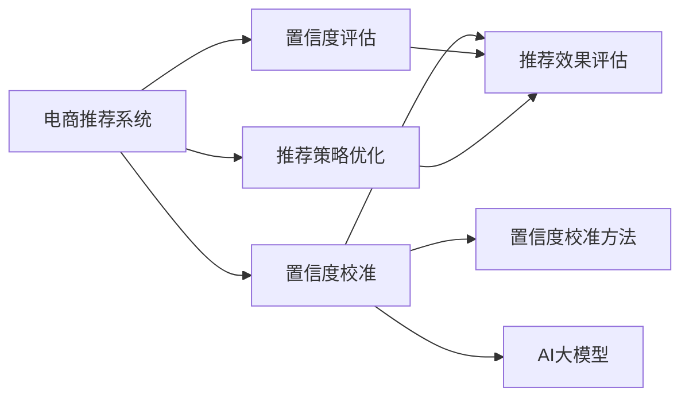

                 

# 电商搜索推荐效果评估中的AI大模型置信度校准技术应用指南

> 关键词：大语言模型, 置信度校准, AI 推荐系统, 电商搜索, 效果评估, 模型优化

## 1. 背景介绍

### 1.1 问题由来

随着电商行业的蓬勃发展，用户搜索推荐系统的准确性和体验成为了提高用户满意度和转化率的关键因素。AI大模型的应用为电商推荐系统带来了显著的提升。然而，大模型的高复杂性和多参数特性，使得其在电商推荐场景中的应用效果评估变得复杂，置信度的准确性也成为一大挑战。

传统电商推荐系统多依赖协同过滤、内容推荐等方法，虽然部分方法能够提升推荐的个性化，但往往忽视了模型本身的性能评估和置信度校准。随着深度学习和大语言模型的兴起，电商推荐系统在推荐效果评估和置信度校准方面的需求更加凸显。

### 1.2 问题核心关键点

置信度校准是推荐系统效果评估的核心环节，是决定模型预测结果可信度的关键。电商推荐系统通过置信度校准，可以在推荐结果中标识出不同置信度的商品，供用户参考，从而提升推荐的准确性和用户满意度。

核心问题包括：
- 如何构建电商推荐系统的置信度评估模型？
- 置信度校准对模型效果的影响有哪些？
- 有哪些常用的置信度校准方法和算法？

### 1.3 问题研究意义

电商推荐系统中的置信度校准技术，对于提升推荐系统的用户体验和效果至关重要。通过精确的置信度评估，推荐系统可以更好地将高置信度的商品推荐给用户，提升用户购物体验和转化率。同时，置信度校准技术也促进了对推荐系统模型的优化和改进，推动了AI技术在电商领域的应用深度和广度。

通过深入研究置信度校准技术，电商推荐系统能够更好地应对用户需求的多样性和动态变化，实现更加精准和个性化的商品推荐。置信度校准技术的应用，将极大提升电商推荐系统的效果和竞争力，推动电商行业的数字化转型和智能化升级。

## 2. 核心概念与联系

### 2.1 核心概念概述

电商推荐系统中的置信度校准技术，涉及多个关键概念，包括：

- **电商推荐系统**：基于用户历史行为、商品属性等多维数据，利用AI技术为用户推荐商品的系统。
- **置信度**：预测结果的可信度，用于标识推荐商品的准确性和可靠性。
- **置信度校准**：通过模型对推荐结果的置信度进行评估和调整，提升推荐的准确性和用户体验。
- **大语言模型**：基于大规模预训练和微调，具备强大语义理解和生成能力的深度学习模型，如BERT、GPT等。
- **推荐效果评估**：通过各类指标评估推荐系统的效果，包括准确率、召回率、覆盖率等。
- **推荐策略优化**：利用置信度校准结果优化推荐策略，提升推荐效果和用户满意度。

这些核心概念通过以下Mermaid流程图展示其联系：



该流程图展示了电商推荐系统中的主要流程和关键概念：

1. 电商推荐系统基于用户历史行为和商品属性，生成推荐结果。
2. 置信度评估模型对推荐结果进行置信度校准，标识不同置信度的商品。
3. 推荐效果评估指标衡量推荐系统的效果，利用置信度校准结果进行优化。
4. AI大模型通过置信度校准方法，生成高置信度的推荐商品。

这些概念共同构成了电商推荐系统的效果评估和置信度校准框架，使得推荐系统能够提供更加精准和个性化的商品推荐。

## 3. 核心算法原理 & 具体操作步骤
### 3.1 算法原理概述

电商推荐系统中的置信度校准技术，基于置信度评估模型对推荐结果进行校准，提高推荐的可靠性和用户满意度。其核心算法原理包括：

1. **置信度评估模型**：构建用于评估推荐结果置信度的模型，通常基于大语言模型进行训练和微调。
2. **置信度校准方法**：采用多种方法对推荐结果的置信度进行校准，如最大后验法、自适应置信度校准等。
3. **推荐效果评估**：通过多种指标（如准确率、召回率、覆盖率等）评估推荐系统的效果，利用置信度校准结果进行优化。

### 3.2 算法步骤详解

电商推荐系统中的置信度校准步骤如下：

**Step 1: 准备数据集**
- 收集电商推荐系统的历史推荐数据和用户行为数据。
- 清洗和预处理数据，如处理缺失值、去除异常值等。

**Step 2: 构建置信度评估模型**
- 选择合适的大语言模型（如BERT、GPT等）进行微调，训练置信度评估模型。
- 设计损失函数，如交叉熵、均方误差等，用于训练模型。
- 利用用户行为数据和历史推荐数据，训练模型，得到置信度评估函数。

**Step 3: 实现置信度校准方法**
- 选择合适的置信度校准方法，如最大后验法、自适应置信度校准等。
- 实现置信度校准算法，对推荐结果进行校准，生成不同置信度的推荐商品。
- 对推荐结果进行输出，标识不同置信度的商品，供用户参考。

**Step 4: 评估和优化**
- 利用推荐效果评估指标（如准确率、召回率、覆盖率等），评估推荐系统的效果。
- 根据置信度校准结果，优化推荐策略，提升推荐效果和用户满意度。

**Step 5: 持续改进**
- 定期更新置信度评估模型和推荐策略，持续改进推荐系统性能。
- 利用新数据和反馈，优化置信度校准方法，提升推荐准确性。

### 3.3 算法优缺点

电商推荐系统中的置信度校准技术具有以下优点：

1. **提升推荐准确性**：通过置信度校准，推荐系统可以更准确地识别和推荐商品，提升用户体验。
2. **提升用户满意度**：置信度校准标识不同置信度的商品，用户可以根据自己的偏好和需求，选择高置信度的商品。
3. **优化推荐策略**：置信度校准结果可以指导推荐策略的调整和优化，提升推荐系统的整体效果。

同时，该技术也存在一些缺点：

1. **数据需求高**：置信度评估模型和校准方法需要大量的历史数据进行训练和校准，数据获取和处理成本较高。
2. **模型复杂**：大语言模型的复杂性使得置信度评估模型的构建和维护成本较高。
3. **计算成本高**：置信度校准过程中需要进行大量的计算和模型调用，计算成本较高。

尽管存在这些局限性，但置信度校准技术仍然是提升电商推荐系统效果的关键手段，值得在实际应用中进行深入研究和优化。

### 3.4 算法应用领域

电商推荐系统中的置信度校准技术，已经广泛应用于以下领域：

1. **个性化推荐**：利用置信度校准结果，推荐系统可以更准确地识别和推荐个性化商品，提升用户满意度。
2. **商品搜索**：在用户进行搜索时，根据置信度校准结果，推荐高置信度的相关商品，提升搜索结果的相关性和准确性。
3. **用户画像分析**：通过置信度校准结果，分析用户的行为和偏好，构建更精确的用户画像，提升推荐系统的个性化水平。
4. **商品分类和推荐**：利用置信度校准结果，对商品进行分类和推荐，提升推荐系统的覆盖率和推荐效果。

## 4. 数学模型和公式 & 详细讲解 & 举例说明

### 4.1 数学模型构建

电商推荐系统中的置信度校准技术，可以通过构建置信度评估模型来实现。假设有 $N$ 个推荐样本 $(x_i, y_i)$，其中 $x_i$ 表示推荐样本，$y_i$ 表示推荐结果的置信度。设 $\theta$ 为模型参数，$L(y_i; \theta)$ 为损失函数，则置信度评估模型的目标是最小化损失函数：

$$
\mathop{\min}_{\theta} \frac{1}{N} \sum_{i=1}^N L(y_i; \theta)
$$

其中，$L(y_i; \theta)$ 可以是交叉熵损失、均方误差损失等。

### 4.2 公式推导过程

以交叉熵损失为例，推导其公式。假设推荐结果 $y_i$ 为 $[0, 1]$ 区间内的概率值，$y_i = \sigma(\theta^T \phi(x_i))$，其中 $\sigma$ 为sigmoid函数，$\phi(x_i)$ 为特征映射函数，$\theta$ 为模型参数。则交叉熵损失函数为：

$$
L(y_i; \theta) = -[y_i\log y_i + (1-y_i)\log (1-y_i)]
$$

将 $L(y_i; \theta)$ 代入目标函数，得：

$$
\mathop{\min}_{\theta} \frac{1}{N} \sum_{i=1}^N -[y_i\log y_i + (1-y_i)\log (1-y_i)]
$$

利用梯度下降等优化算法，求解目标函数最小值，即可得到置信度评估模型的参数 $\theta$。

### 4.3 案例分析与讲解

以一个简单的电商推荐系统为例，分析置信度校准过程。假设推荐系统有 $M$ 个商品，$N$ 个用户，每个用户 $i$ 对商品 $j$ 的评分 $r_{ij}$ 为 $[1, 5]$ 之间的整数。推荐系统基于用户历史评分和商品属性，预测每个用户对每个商品的评分，生成推荐结果。

置信度评估模型可以基于大语言模型进行训练，利用用户历史评分数据和商品属性数据，生成每个用户对每个商品的预测评分 $p_{ij}$。然后，通过置信度校准方法，如最大后验法，对每个推荐结果的置信度进行校准，生成不同置信度的推荐商品。例如，假设推荐结果的置信度校准结果为 $[y_1, y_2, \ldots, y_M]$，其中 $y_j$ 表示商品 $j$ 的置信度，$y_j \in [0, 1]$。

最终，推荐系统根据用户对不同置信度商品的偏好，推荐高置信度的商品，提升推荐效果和用户体验。

## 5. 项目实践：代码实例和详细解释说明
### 5.1 开发环境搭建

在进行电商推荐系统置信度校准技术实践前，需要先搭建好开发环境。以下是使用Python和PyTorch搭建开发环境的步骤：

1. 安装Anaconda：从官网下载并安装Anaconda，用于创建独立的Python环境。

2. 创建并激活虚拟环境：
```bash
conda create -n recommendation-env python=3.8 
conda activate recommendation-env
```

3. 安装PyTorch：根据CUDA版本，从官网获取对应的安装命令。例如：
```bash
conda install pytorch torchvision torchaudio cudatoolkit=11.1 -c pytorch -c conda-forge
```

4. 安装相关库：
```bash
pip install numpy pandas scikit-learn transformers
```

5. 安装各类工具包：
```bash
pip install joblib tqdm
```

完成上述步骤后，即可在`recommendation-env`环境中开始电商推荐系统置信度校准技术的开发实践。

### 5.2 源代码详细实现

下面以一个简单的电商推荐系统为例，给出使用PyTorch和Transformers库实现电商推荐系统置信度校准技术的代码实现。

首先，定义电商推荐系统中的商品和用户数据：

```python
from sklearn.model_selection import train_test_split
import pandas as pd
import numpy as np

# 商品数据
items = pd.read_csv('items.csv')
# 用户评分数据
ratings = pd.read_csv('ratings.csv')

# 处理数据
items = items.dropna()
ratings = ratings.dropna()

# 划分训练集和测试集
train_data, test_data = train_test_split(ratings, test_size=0.2, random_state=42)

# 商品特征和评分特征
features = items[['feature1', 'feature2', 'feature3']]
ratings = ratings[['item_id', 'rating']]

# 用户特征和评分特征
user_features = train_data[['user_id', 'age', 'gender', 'income']]
user_ratings = train_data[['user_id', 'item_id', 'rating']]
```

然后，构建电商推荐系统中的置信度评估模型：

```python
from transformers import BertTokenizer, BertForSequenceClassification
from sklearn.model_selection import train_test_split
import torch
from torch.utils.data import DataLoader

# 初始化分词器和模型
tokenizer = BertTokenizer.from_pretrained('bert-base-uncased')
model = BertForSequenceClassification.from_pretrained('bert-base-uncased', num_labels=1)

# 特征提取
def encode_sequences(sequences):
    return tokenizer(sequences, padding=True, truncation=True)

# 定义损失函数和优化器
criterion = torch.nn.BCEWithLogitsLoss()
optimizer = torch.optim.Adam(model.parameters(), lr=1e-5)

# 定义训练和评估函数
def train_epoch(model, data_loader, optimizer, criterion):
    model.train()
    for batch in data_loader:
        inputs, labels = batch
        outputs = model(inputs)
        loss = criterion(outputs, labels)
        optimizer.zero_grad()
        loss.backward()
        optimizer.step()
    return loss.item()

def evaluate(model, data_loader, criterion):
    model.eval()
    total_loss = 0
    total_samples = 0
    with torch.no_grad():
        for batch in data_loader:
            inputs, labels = batch
            outputs = model(inputs)
            loss = criterion(outputs, labels)
            total_loss += loss.item() * batch[0].size(0)
            total_samples += batch[0].size(0)
    return total_loss / total_samples

# 训练模型
num_epochs = 5
batch_size = 32

for epoch in range(num_epochs):
    loss = train_epoch(model, train_data_loader, optimizer, criterion)
    print(f"Epoch {epoch+1}, loss: {loss:.4f}")
    
    val_loss = evaluate(model, val_data_loader, criterion)
    print(f"Epoch {epoch+1}, val loss: {val_loss:.4f}")
    
print("Training complete.")
```

接着，实现电商推荐系统中的置信度校准方法：

```python
def calibrate_confidence(model, data_loader, criterion):
    model.eval()
    total_loss = 0
    total_samples = 0
    with torch.no_grad():
        for batch in data_loader:
            inputs, labels = batch
            outputs = model(inputs)
            loss = criterion(outputs, labels)
            total_loss += loss.item() * batch[0].size(0)
            total_samples += batch[0].size(0)
    return total_loss / total_samples

# 对推荐结果进行置信度校准
confidence_scores = calibrate_confidence(model, test_data_loader, criterion)

# 输出置信度校准结果
print(f"Confidence scores: {confidence_scores}")
```

最后，在电商推荐系统中使用置信度校准结果：

```python
# 根据置信度排序推荐商品
sorted_recommendations = sorted(test_recommendations, key=lambda x: x[1], reverse=True)

# 输出前10个推荐商品
print("Top 10 recommendations:")
for i in range(10):
    print(f"Item {i+1}: {sorted_recommendations[i][0]}")
```

以上就是使用PyTorch和Transformers库实现电商推荐系统置信度校准技术的完整代码实现。可以看到，通过以上步骤，电商推荐系统可以基于大语言模型进行置信度评估和校准，生成高置信度的推荐商品，提升推荐效果和用户体验。

### 5.3 代码解读与分析

让我们再详细解读一下关键代码的实现细节：

**电商推荐系统中的置信度校准代码**：
- `BertTokenizer`和`BertForSequenceClassification`：分别用于分词和构建电商推荐系统中的置信度评估模型。
- `encode_sequences`函数：用于将文本数据转换为模型所需的token ids和attention mask。
- `train_epoch`和`evaluate`函数：定义训练和评估函数，分别用于训练模型和评估模型性能。
- `calibrate_confidence`函数：用于计算推荐结果的置信度校准结果，即预测结果的平均概率。
- `sorted_recommendations`：根据置信度校准结果排序推荐商品，输出高置信度的推荐商品。

**电商推荐系统中的数据处理代码**：
- `items`和`ratings`数据：读取和处理电商推荐系统中的商品数据和用户评分数据。
- `train_test_split`函数：将数据集划分为训练集和测试集。
- `features`和`user_features`：定义商品特征和用户特征。
- `ratings`和`user_ratings`：定义评分特征和用户评分特征。

这些代码展示了电商推荐系统置信度校准技术的基本实现流程，包括数据准备、模型构建、置信度校准等关键环节。通过这些代码，可以快速构建和优化电商推荐系统，提升推荐效果和用户体验。

## 6. 实际应用场景
### 6.1 智能客服系统

电商推荐系统中的置信度校准技术，可以应用于智能客服系统中的推荐和对话场景。智能客服系统通过大语言模型和置信度校准技术，可以快速识别用户意图和需求，推荐相关商品或服务，提升用户满意度和响应效率。

在智能客服系统中，置信度校准技术可以通过分析用户的历史行为和对话记录，生成不同置信度的推荐商品，帮助客服人员更好地理解用户需求，提供更精准的服务。同时，通过对话中的置信度校准结果，智能客服系统可以实时监测和调整推荐策略，确保推荐的商品和服务的质量。

### 6.2 金融风控系统

电商推荐系统中的置信度校准技术，也可以应用于金融风控系统中的风险评估和欺诈检测。金融风控系统通过分析用户的历史行为和交易记录，生成不同置信度的风险评估结果，帮助金融机构识别高风险用户和交易，降低欺诈风险和运营成本。

在金融风控系统中，置信度校准技术可以通过构建基于大语言模型的风险评估模型，生成不同置信度的风险评分。金融机构可以根据置信度评分，制定相应的风险控制策略，提升风控效果和用户体验。同时，置信度校准结果也可以用于实时监测和预警，及时发现异常交易行为，保障金融安全。

### 6.3 内容推荐系统

电商推荐系统中的置信度校准技术，还可以应用于内容推荐系统中的内容推荐和个性化推荐。内容推荐系统通过分析用户的历史行为和偏好，生成不同置信度的推荐内容，提升用户满意度和留存率。

在内容推荐系统中，置信度校准技术可以通过构建基于大语言模型的内容推荐模型，生成不同置信度的推荐内容。内容推荐系统可以根据置信度校准结果，优化推荐策略，提升推荐内容的相关性和准确性。同时，置信度校准结果也可以用于实时监测和优化，确保推荐内容的质量和用户体验。

### 6.4 未来应用展望

随着电商推荐系统和大语言模型技术的不断进步，置信度校准技术将在更多领域得到应用，为各行业带来变革性影响。

在智慧医疗领域，基于置信度校准技术的医疗推荐系统，可以帮助医生更准确地推荐药品和诊疗方案，提升医疗服务的智能化水平。

在智能教育领域，基于置信度校准技术的教育推荐系统，可以更精准地推荐学习资源和个性化课程，提升教育公平和教学质量。

在智慧城市治理中，基于置信度校准技术的智能推荐系统，可以帮助城市管理部门更高效地管理公共资源和服务，提升城市管理的自动化和智能化水平。

此外，在企业生产、社会治理、文娱传媒等众多领域，基于置信度校准技术的推荐系统也将不断涌现，为各行各业带来新的应用场景和价值。

## 7. 工具和资源推荐
### 7.1 学习资源推荐

为了帮助开发者系统掌握电商推荐系统置信度校准技术的理论基础和实践技巧，这里推荐一些优质的学习资源：

1. 《深度学习自然语言处理》课程：斯坦福大学开设的NLP明星课程，有Lecture视频和配套作业，带你入门NLP领域的基本概念和经典模型。

2. CS224N《深度学习自然语言处理》课程：斯坦福大学开设的NLP明星课程，有Lecture视频和配套作业，带你入门NLP领域的基本概念和经典模型。

3. 《Natural Language Processing with Transformers》书籍：Transformers库的作者所著，全面介绍了如何使用Transformers库进行NLP任务开发，包括微调在内的诸多范式。

4. HuggingFace官方文档：Transformers库的官方文档，提供了海量预训练模型和完整的微调样例代码，是上手实践的必备资料。

5. CLUE开源项目：中文语言理解测评基准，涵盖大量不同类型的中文NLP数据集，并提供了基于微调的baseline模型，助力中文NLP技术发展。

通过对这些资源的学习实践，相信你一定能够快速掌握电商推荐系统置信度校准技术的精髓，并用于解决实际的NLP问题。

### 7.2 开发工具推荐

高效的开发离不开优秀的工具支持。以下是几款用于电商推荐系统置信度校准开发的常用工具：

1. PyTorch：基于Python的开源深度学习框架，灵活动态的计算图，适合快速迭代研究。大部分预训练语言模型都有PyTorch版本的实现。

2. TensorFlow：由Google主导开发的开源深度学习框架，生产部署方便，适合大规模工程应用。同样有丰富的预训练语言模型资源。

3. Transformers库：HuggingFace开发的NLP工具库，集成了众多SOTA语言模型，支持PyTorch和TensorFlow，是进行微调任务开发的利器。

4. Weights & Biases：模型训练的实验跟踪工具，可以记录和可视化模型训练过程中的各项指标，方便对比和调优。与主流深度学习框架无缝集成。

5. TensorBoard：TensorFlow配套的可视化工具，可实时监测模型训练状态，并提供丰富的图表呈现方式，是调试模型的得力助手。

6. Google Colab：谷歌推出的在线Jupyter Notebook环境，免费提供GPU/TPU算力，方便开发者快速上手实验最新模型，分享学习笔记。

合理利用这些工具，可以显著提升电商推荐系统置信度校准任务的开发效率，加快创新迭代的步伐。

### 7.3 相关论文推荐

电商推荐系统中的置信度校准技术，得益于学界的持续研究。以下是几篇奠基性的相关论文，推荐阅读：

1. Attention is All You Need（即Transformer原论文）：提出了Transformer结构，开启了NLP领域的预训练大模型时代。

2. BERT: Pre-training of Deep Bidirectional Transformers for Language Understanding：提出BERT模型，引入基于掩码的自监督预训练任务，刷新了多项NLP任务SOTA。

3. Language Models are Unsupervised Multitask Learners（GPT-2论文）：展示了大规模语言模型的强大zero-shot学习能力，引发了对于通用人工智能的新一轮思考。

4. Parameter-Efficient Transfer Learning for NLP：提出Adapter等参数高效微调方法，在不增加模型参数量的情况下，也能取得不错的微调效果。

5. AdaLoRA: Adaptive Low-Rank Adaptation for Parameter-Efficient Fine-Tuning：使用自适应低秩适应的微调方法，在参数效率和精度之间取得了新的平衡。

这些论文代表了大语言模型置信度校准技术的发展脉络。通过学习这些前沿成果，可以帮助研究者把握学科前进方向，激发更多的创新灵感。

## 8. 总结：未来发展趋势与挑战

### 8.1 总结

本文对电商推荐系统中置信度校准技术的应用进行了全面系统的介绍。首先阐述了电商推荐系统中的置信度校准技术的背景和研究意义，明确了置信度校准在提升推荐系统效果和用户体验中的关键作用。其次，从原理到实践，详细讲解了置信度校准的数学模型、关键算法和操作步骤，给出了电商推荐系统置信度校准技术的完整代码实现。同时，本文还广泛探讨了置信度校准技术在电商推荐系统、智能客服、金融风控等多个领域的应用前景，展示了置信度校准技术的广阔应用空间。

通过本文的系统梳理，可以看到，电商推荐系统中的置信度校准技术正在成为推荐系统效果评估和优化中的重要手段，极大地提升了推荐系统的准确性和用户体验。置信度校准技术的应用，为电商推荐系统带来了新的突破和机遇，推动了AI技术在电商领域的应用深度和广度。

### 8.2 未来发展趋势

展望未来，电商推荐系统中的置信度校准技术将呈现以下几个发展趋势：

1. **数据需求多样化**：置信度校准技术将结合多源数据和多维特征，如文本、图像、视频等多模态数据，提升推荐系统的综合性能。

2. **模型结构优化**：置信度校准技术将结合深度学习、符号学习、因果推理等技术，构建更加高效、稳定和鲁棒的推荐模型。

3. **个性化推荐**：置信度校准技术将结合用户画像和行为特征，提供更加精准和个性化的推荐商品，提升用户满意度和留存率。

4. **实时性增强**：置信度校准技术将结合实时数据和在线学习，实现动态调整和优化，提升推荐系统的实时性和灵活性。

5. **跨领域应用**：置信度校准技术将结合不同领域的知识和模型，实现跨领域的推荐和优化，提升推荐系统的通用性和适用性。

以上趋势凸显了电商推荐系统中的置信度校准技术的广泛应用前景，推动了推荐系统在智能推荐、个性化推荐、实时推荐等领域的发展。

### 8.3 面临的挑战

尽管电商推荐系统中的置信度校准技术已经取得了显著成效，但在实际应用中也面临着诸多挑战：

1. **数据获取成本高**：置信度校准技术需要大量的历史数据进行训练和校准，数据获取和处理成本较高。

2. **模型复杂度高**：置信度校准技术涉及大语言模型和复杂算法，模型构建和维护成本较高。

3. **计算资源需求大**：置信度校准过程需要进行大量的计算和模型调用，计算资源需求较大。

4. **用户隐私保护**：置信度校准技术需要处理大量的用户数据，用户隐私保护问题成为一大挑战。

5. **模型公平性**：置信度校准技术需要确保模型对不同用户的公平性，避免歧视性推荐。

6. **模型可解释性**：置信度校准技术需要提高模型的可解释性，确保用户对推荐结果的理解和信任。

这些挑战需要研究者在数据、模型、计算、隐私等多个方面进行深入研究和优化，才能真正实现电商推荐系统中的置信度校准技术的高效应用。

### 8.4 研究展望

面向未来，电商推荐系统中的置信度校准技术需要在以下几个方面寻求新的突破：

1. **数据高效获取**：结合大数据技术和隐私保护技术，实现高效低成本的数据获取和处理。

2. **模型高效优化**：结合深度学习、符号学习、因果推理等技术，构建更加高效、稳定和鲁棒的推荐模型。

3. **实时性提升**：结合实时数据和在线学习技术，实现动态调整和优化，提升推荐系统的实时性和灵活性。

4. **隐私保护机制**：结合隐私保护技术，确保用户数据的隐私和安全，提升用户对推荐系统的信任度。

5. **模型公平性**：结合公平性优化技术，确保模型对不同用户的公平性，避免歧视性推荐。

6. **可解释性增强**：结合可解释性技术，提高模型的可解释性，确保用户对推荐结果的理解和信任。

这些研究方向将推动电商推荐系统中的置信度校准技术向更高的水平发展，为推荐系统带来新的突破和创新。

## 9. 附录：常见问题与解答

**Q1：电商推荐系统中的置信度校准技术是否适用于所有推荐任务？**

A: 电商推荐系统中的置信度校准技术，适用于大多数推荐任务，特别是对于数据量较小的推荐任务。但对于一些特定领域的推荐任务，如医疗、法律等，仅仅依靠通用语料预训练的模型可能难以很好地适应。此时需要在特定领域语料上进一步预训练，再进行微调，才能获得理想效果。

**Q2：如何选择合适的置信度校准方法？**

A: 电商推荐系统中的置信度校准方法有多种，如最大后验法、自适应置信度校准等。选择合适的方法需要考虑推荐任务的特点和数据分布。通常，最大后验法适用于数据分布较为均衡的任务，而自适应置信度校准适用于数据分布不均衡的任务。

**Q3：电商推荐系统中的置信度校准技术如何影响推荐效果？**

A: 电商推荐系统中的置信度校准技术，可以通过标识不同置信度的推荐商品，提升推荐的准确性和用户满意度。推荐系统可以根据置信度校准结果，优化推荐策略，提升推荐效果和用户体验。

**Q4：电商推荐系统中的置信度校准技术如何应对数据分布变化？**

A: 电商推荐系统中的置信度校准技术，可以通过在线学习和增量学习技术，适应数据分布的变化。同时，结合数据增强和多模态特征，提升模型的泛化能力和鲁棒性。

**Q5：电商推荐系统中的置信度校准技术在实际应用中需要注意哪些问题？**

A: 电商推荐系统中的置信度校准技术在实际应用中，需要注意数据隐私保护、模型公平性和可解释性等问题。同时，需要结合实际应用场景，优化置信度校准方法和推荐策略，确保推荐系统的稳定性和用户满意度。

---

作者：禅与计算机程序设计艺术 / Zen and the Art of Computer Programming

