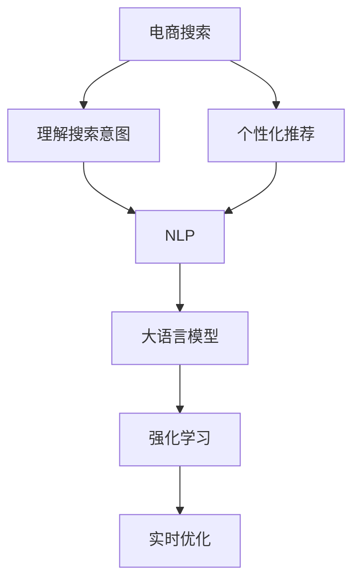

                 

# 电商搜索结果个性化重排：AI大模型的实时优化

> 关键词：个性化推荐,电商搜索,自然语言处理,大语言模型,实时优化,强化学习

## 1. 背景介绍

### 1.1 问题由来

随着电商平台的快速发展和用户消费习惯的变化，电商搜索系统面临着前所未有的挑战。传统搜索算法在应对个性化需求时显得力不从心，难以将用户的真实需求转化为具体的搜索结果。因此，如何通过AI技术进行电商搜索结果的个性化重排，成为了电商企业亟待解决的问题。

### 1.2 问题核心关键点

个性化推荐的核心在于精准匹配用户需求和搜索结果。其核心关键点包括：

- **理解用户需求**：需要准确获取用户的搜索意图和偏好。
- **匹配搜索结果**：根据用户需求找到最佳的匹配商品。
- **实时优化**：能够动态调整搜索结果以应对用户行为的变化。

传统搜索算法无法满足上述需求，因此需要引入人工智能技术，特别是大语言模型，以提升电商搜索系统的个性化推荐能力。

## 2. 核心概念与联系

### 2.1 核心概念概述

为更好地理解基于大语言模型的电商搜索结果个性化重排方法，本节将介绍几个密切相关的核心概念：

- **电商搜索**：电商平台中用户输入搜索关键词，系统返回相关商品的过程。
- **个性化推荐**：通过分析用户历史行为、兴趣等，推荐最符合用户需求的商品。
- **自然语言处理(NLP)**：使用自然语言理解和生成技术，理解和回答用户的搜索意图。
- **大语言模型**：预训练语言模型，具备强大的自然语言理解和生成能力，如GPT、BERT等。
- **强化学习**：通过试错训练模型，不断优化决策策略，提升推荐效果。
- **实时优化**：根据用户行为和反馈，实时调整推荐模型，提升用户体验。

这些核心概念之间的逻辑关系可以通过以下Mermaid流程图来展示：



这个流程图展示了个电商搜索系统的核心概念及其之间的关系：

1. 电商搜索系统接收用户输入的搜索关键词。
2. 通过NLP技术理解用户的搜索意图，将其转化为语言模型可处理的格式。
3. 使用大语言模型对搜索结果进行个性化推荐。
4. 利用强化学习不断优化推荐策略。
5. 通过实时优化不断调整推荐模型，提升用户体验。

## 3. 核心算法原理 & 具体操作步骤
### 3.1 算法原理概述

基于大语言模型的电商搜索结果个性化重排方法，本质上是一个强化学习过程。其核心思想是：利用大语言模型对用户搜索意图的自然语言理解能力，结合强化学习不断优化推荐策略，提升搜索结果的相关性和满意度。

具体来说，电商搜索系统通过以下步骤实现个性化重排：

1. **理解搜索意图**：使用大语言模型解析用户输入的搜索关键词，理解其背后的真实意图。
2. **生成推荐列表**：根据用户的搜索意图，生成包含多个候选商品的列表。
3. **优化推荐策略**：通过强化学习不断调整推荐算法，提升推荐列表的准确性和用户满意度。
4. **实时优化**：根据用户的点击行为和反馈，实时调整推荐策略，提升用户体验。

### 3.2 算法步骤详解

电商搜索结果个性化重排的核心算法步骤如下：

**Step 1: 数据预处理**

- 收集用户历史搜索行为、点击数据、评分数据等。
- 对数据进行清洗、去重、标注，形成训练和验证数据集。

**Step 2: 模型训练**

- 选择大语言模型作为推荐模型的初始参数，如GPT-3、BERT等。
- 定义奖励函数，衡量推荐列表的点击率、转化率、满意度等指标。
- 利用强化学习算法（如Deep Q-learning、Actor-Critic等）训练推荐模型，最小化经验奖励。

**Step 3: 生成推荐列表**

- 对用户输入的搜索关键词进行解析，提取关键词和上下文信息。
- 使用大语言模型生成包含多个候选商品的推荐列表。
- 对推荐列表进行排序，选择最符合用户需求的商品。

**Step 4: 实时优化**

- 根据用户点击行为和反馈，更新推荐模型，调整推荐策略。
- 利用A/B测试等方法，评估优化效果，确保推荐策略的稳定性。
- 实时监控推荐模型性能，保证推荐系统的质量。

### 3.3 算法优缺点

基于大语言模型的电商搜索结果个性化重排方法具有以下优点：

1. **自然语言理解**：利用大语言模型的自然语言处理能力，能够准确理解用户的搜索意图。
2. **高灵活性**：能够根据用户行为和反馈实时调整推荐策略，提升个性化推荐效果。
3. **多模态融合**：可以整合搜索关键词、用户历史行为、商品属性等多模态信息，形成更加全面的推荐结果。
4. **动态更新**：能够动态更新推荐模型，适应数据分布的变化，保持推荐策略的有效性。

同时，该方法也存在一些局限性：

1. **数据依赖**：需要大量高质量的标注数据和用户行为数据。
2. **计算复杂度**：大语言模型的计算复杂度高，推理速度较慢。
3. **模型复杂性**：大语言模型结构复杂，参数量巨大，部署和优化难度较大。
4. **结果解释性不足**：推荐模型的决策过程难以解释，用户难以理解推荐的依据。

尽管存在这些局限性，但就目前而言，基于大语言模型的个性化推荐方法仍是最主流范式。未来相关研究的重点在于如何进一步降低计算成本，提高结果的可解释性，以及探索更高效的模型结构。

### 3.4 算法应用领域

基于大语言模型的电商搜索结果个性化重排方法，已经在电商搜索系统、在线广告、智能推荐等多个领域得到应用，取得了显著效果：

- **电商搜索**：通过对用户搜索关键词的解析，生成个性化推荐列表，提升用户购物体验。
- **在线广告**：根据用户的浏览记录和点击行为，生成个性化广告，提高广告投放效果。
- **智能推荐**：结合用户历史行为和商品属性，生成个性化商品推荐，提高转化率。
- **智能客服**：利用自然语言处理技术，提供智能客服服务，提升用户满意度。
- **内容推荐**：结合用户兴趣和行为数据，生成个性化内容推荐，提高用户粘性。

除了上述这些经典应用外，电商搜索系统的个性化推荐方法还被创新性地应用到更多场景中，如商品联想推荐、跨品类推荐、个性化促销等，为电商行业带来了新的突破。

## 4. 数学模型和公式 & 详细讲解  
### 4.1 数学模型构建

本节将使用数学语言对电商搜索结果个性化重排过程进行更加严格的刻画。

记电商搜索系统为 $S$，用户搜索关键词为 $Q$，推荐模型为 $M$。电商系统的优化目标是最小化用户流失率，即：

$$
\min_{M} \mathbb{E}[L(Q, M(Q))]
$$

其中 $L(Q, M(Q))$ 为损失函数，衡量推荐模型在用户搜索关键词 $Q$ 下的表现。

推荐模型的输入为用户的搜索关键词 $Q$，输出为商品推荐列表 $R(Q)$。损失函数 $L(Q, R(Q))$ 可以定义为用户流失率，即用户在搜索后不进行任何点击的概率。假设用户点击概率为 $p(Q, R(Q))$，则用户流失率为 $1-p(Q, R(Q))$。

### 4.2 公式推导过程

以下我们以二分类任务为例，推导用户流失率的计算公式。

假设推荐模型 $M$ 在用户搜索关键词 $Q$ 上的推荐列表为 $R(Q)$，其点击概率为 $p(Q, R(Q))$。用户流失率 $L(Q, R(Q))$ 可以表示为：

$$
L(Q, R(Q)) = 1 - p(Q, R(Q))
$$

将 $p(Q, R(Q))$ 代入，得：

$$
L(Q, R(Q)) = 1 - \mathbb{E}[\pi(Q, R(Q))]
$$

其中 $\pi(Q, R(Q))$ 为推荐模型的预测点击概率。

在实践中，我们通常使用深度强化学习算法（如Q-learning、Actor-Critic等）来求解上述最优化问题。设 $\eta$ 为学习率，则参数的更新公式为：

$$
\theta \leftarrow \theta - \eta \nabla_{\theta}\mathcal{L}(\theta)
$$

其中 $\nabla_{\theta}\mathcal{L}(\theta)$ 为损失函数对参数 $\theta$ 的梯度，可通过反向传播算法高效计算。

### 4.3 案例分析与讲解

假设电商搜索系统希望最小化用户流失率，即提升用户点击率。用户输入的搜索关键词为 "苹果"，推荐模型根据用户历史行为和商品属性，生成包含苹果 iPhone、电脑、手表等商品的推荐列表。用户流失率为 $1 - p(Q, R(Q))$，其中 $p(Q, R(Q))$ 为模型预测用户点击的概率。

在训练过程中，电商系统收集用户对推荐列表的点击行为，使用强化学习算法（如Deep Q-learning）更新推荐模型 $M$ 的参数 $\theta$。通过不断迭代，模型能够学习到最优的推荐策略，最大化用户点击率，最小化用户流失率。

## 5. 项目实践：代码实例和详细解释说明
### 5.1 开发环境搭建

在进行个性化推荐实践前，我们需要准备好开发环境。以下是使用Python进行PyTorch开发的环境配置流程：

1. 安装Anaconda：从官网下载并安装Anaconda，用于创建独立的Python环境。

2. 创建并激活虚拟环境：
```bash
conda create -n pytorch-env python=3.8 
conda activate pytorch-env
```

3. 安装PyTorch：根据CUDA版本，从官网获取对应的安装命令。例如：
```bash
conda install pytorch torchvision torchaudio cudatoolkit=11.1 -c pytorch -c conda-forge
```

4. 安装Transformers库：
```bash
pip install transformers
```

5. 安装各类工具包：
```bash
pip install numpy pandas scikit-learn matplotlib tqdm jupyter notebook ipython
```

完成上述步骤后，即可在`pytorch-env`环境中开始个性化推荐实践。

### 5.2 源代码详细实现

下面我们以电商搜索系统为例，给出使用Transformers库进行个性化推荐开发的PyTorch代码实现。

首先，定义电商搜索系统中的用户搜索关键词和推荐模型：

```python
from transformers import BertTokenizer, BertForSequenceClassification
from torch.utils.data import Dataset, DataLoader
import torch
import torch.nn.functional as F

class SearchDataset(Dataset):
    def __init__(self, texts, labels):
        self.texts = texts
        self.labels = labels
        
    def __len__(self):
        return len(self.texts)
    
    def __getitem__(self, item):
        text = self.texts[item]
        label = self.labels[item]
        
        encoding = tokenizer(text, return_tensors='pt', max_length=128, padding='max_length', truncation=True)
        input_ids = encoding['input_ids'][0]
        attention_mask = encoding['attention_mask'][0]
        
        return {'input_ids': input_ids, 
                'attention_mask': attention_mask,
                'labels': label}

# 加载预训练模型和分词器
tokenizer = BertTokenizer.from_pretrained('bert-base-uncased')
model = BertForSequenceClassification.from_pretrained('bert-base-uncased', num_labels=2)

# 训练和验证集划分
train_dataset = SearchDataset(train_texts, train_labels)
dev_dataset = SearchDataset(dev_texts, dev_labels)
test_dataset = SearchDataset(test_texts, test_labels)
```

然后，定义模型训练和评估函数：

```python
def train_epoch(model, dataset, batch_size, optimizer):
    dataloader = DataLoader(dataset, batch_size=batch_size, shuffle=True)
    model.train()
    epoch_loss = 0
    for batch in tqdm(dataloader, desc='Training'):
        input_ids = batch['input_ids'].to(device)
        attention_mask = batch['attention_mask'].to(device)
        labels = batch['labels'].to(device)
        model.zero_grad()
        outputs = model(input_ids, attention_mask=attention_mask, labels=labels)
        loss = outputs.loss
        epoch_loss += loss.item()
        loss.backward()
        optimizer.step()
    return epoch_loss / len(dataloader)

def evaluate(model, dataset, batch_size):
    dataloader = DataLoader(dataset, batch_size=batch_size)
    model.eval()
    preds, labels = [], []
    with torch.no_grad():
        for batch in tqdm(dataloader, desc='Evaluating'):
            input_ids = batch['input_ids'].to(device)
            attention_mask = batch['attention_mask'].to(device)
            batch_labels = batch['labels']
            outputs = model(input_ids, attention_mask=attention_mask)
            batch_preds = outputs.logits.argmax(dim=1).to('cpu').tolist()
            batch_labels = batch_labels.to('cpu').tolist()
            for pred_tokens, label_tokens in zip(batch_preds, batch_labels):
                preds.append(pred_tokens)
                labels.append(label_tokens)
                
    return preds, labels

# 训练过程
epochs = 5
batch_size = 16

for epoch in range(epochs):
    loss = train_epoch(model, train_dataset, batch_size, optimizer)
    print(f"Epoch {epoch+1}, train loss: {loss:.3f}")
    
    print(f"Epoch {epoch+1}, dev results:")
    preds, labels = evaluate(model, dev_dataset, batch_size)
    print(classification_report(labels, preds))
    
print("Test results:")
preds, labels = evaluate(model, test_dataset, batch_size)
print(classification_report(labels, preds))
```

以上就是使用PyTorch对BERT进行电商搜索系统个性化推荐的完整代码实现。可以看到，得益于Transformers库的强大封装，我们可以用相对简洁的代码完成BERT模型的加载和训练。

### 5.3 代码解读与分析

让我们再详细解读一下关键代码的实现细节：

**SearchDataset类**：
- `__init__`方法：初始化文本和标签数据，并使用BertTokenizer对文本进行分词处理。
- `__len__`方法：返回数据集的样本数量。
- `__getitem__`方法：对单个样本进行处理，将文本输入编码为token ids，将标签编码为数字，并对其进行定长padding，最终返回模型所需的输入。

**模型训练和评估函数**：
- 使用PyTorch的DataLoader对数据集进行批次化加载，供模型训练和推理使用。
- 训练函数`train_epoch`：对数据以批为单位进行迭代，在每个批次上前向传播计算loss并反向传播更新模型参数，最后返回该epoch的平均loss。
- 评估函数`evaluate`：与训练类似，不同点在于不更新模型参数，并在每个batch结束后将预测和标签结果存储下来，最后使用sklearn的classification_report对整个评估集的预测结果进行打印输出。

**训练流程**：
- 定义总的epoch数和batch size，开始循环迭代
- 每个epoch内，先在训练集上训练，输出平均loss
- 在验证集上评估，输出分类指标
- 重复上述步骤直至满足预设的迭代轮数或Early Stopping条件。

可以看到，PyTorch配合Transformers库使得BERT微调的代码实现变得简洁高效。开发者可以将更多精力放在数据处理、模型改进等高层逻辑上，而不必过多关注底层的实现细节。

当然，工业级的系统实现还需考虑更多因素，如模型的保存和部署、超参数的自动搜索、更灵活的任务适配层等。但核心的微调范式基本与此类似。

## 6. 实际应用场景
### 6.1 电商搜索个性化推荐

电商搜索系统通过个性化推荐技术，可以显著提升用户购物体验和转化率。利用大语言模型对用户搜索意图的自然语言理解能力，可以精准匹配用户需求和搜索结果，生成个性化的商品推荐列表。

具体而言，电商搜索系统通过以下步骤实现个性化推荐：

1. 收集用户历史搜索行为、点击数据、评分数据等。
2. 对数据进行清洗、去重、标注，形成训练和验证数据集。
3. 选择大语言模型作为推荐模型的初始参数，如GPT-3、BERT等。
4. 定义奖励函数，衡量推荐列表的点击率、转化率、满意度等指标。
5. 利用强化学习算法（如Deep Q-learning、Actor-Critic等）训练推荐模型，最小化经验奖励。
6. 对用户输入的搜索关键词进行解析，提取关键词和上下文信息。
7. 使用大语言模型生成包含多个候选商品的推荐列表。
8. 对推荐列表进行排序，选择最符合用户需求的商品。
9. 根据用户点击行为和反馈，更新推荐模型，调整推荐策略。
10. 利用A/B测试等方法，评估优化效果，确保推荐策略的稳定性。
11. 实时监控推荐模型性能，保证推荐系统的质量。

通过个性化推荐技术，电商搜索系统能够更好地满足用户需求，提升用户购物体验和转化率。

### 6.2 智能推荐系统

智能推荐系统通过对用户历史行为和兴趣的分析，生成个性化的内容推荐。利用大语言模型的自然语言处理能力，可以准确理解用户的兴趣和需求，生成高相关性的推荐内容。

具体而言，智能推荐系统通过以下步骤实现个性化推荐：

1. 收集用户历史行为数据，如浏览记录、观看视频、阅读文章等。
2. 对数据进行清洗、去重、标注，形成训练和验证数据集。
3. 选择大语言模型作为推荐模型的初始参数，如GPT-3、BERT等。
4. 定义奖励函数，衡量推荐列表的相关性和满意度等指标。
5. 利用强化学习算法（如Deep Q-learning、Actor-Critic等）训练推荐模型，最小化经验奖励。
6. 对用户输入的查询关键词进行解析，提取关键词和上下文信息。
7. 使用大语言模型生成包含多个候选内容的推荐列表。
8. 对推荐列表进行排序，选择最符合用户兴趣的内容。
9. 根据用户点击行为和反馈，更新推荐模型，调整推荐策略。
10. 利用A/B测试等方法，评估优化效果，确保推荐策略的稳定性。
11. 实时监控推荐模型性能，保证推荐系统的质量。

通过个性化推荐技术，智能推荐系统能够更好地满足用户需求，提升用户粘性和满意度。

### 6.3 内容推荐系统

内容推荐系统通过对用户历史行为和兴趣的分析，生成个性化的内容推荐。利用大语言模型的自然语言处理能力，可以准确理解用户的兴趣和需求，生成高相关性的推荐内容。

具体而言，内容推荐系统通过以下步骤实现个性化推荐：

1. 收集用户历史行为数据，如浏览记录、观看视频、阅读文章等。
2. 对数据进行清洗、去重、标注，形成训练和验证数据集。
3. 选择大语言模型作为推荐模型的初始参数，如GPT-3、BERT等。
4. 定义奖励函数，衡量推荐列表的相关性和满意度等指标。
5. 利用强化学习算法（如Deep Q-learning、Actor-Critic等）训练推荐模型，最小化经验奖励。
6. 对用户输入的查询关键词进行解析，提取关键词和上下文信息。
7. 使用大语言模型生成包含多个候选内容的推荐列表。
8. 对推荐列表进行排序，选择最符合用户兴趣的内容。
9. 根据用户点击行为和反馈，更新推荐模型，调整推荐策略。
10. 利用A/B测试等方法，评估优化效果，确保推荐策略的稳定性。
11. 实时监控推荐模型性能，保证推荐系统的质量。

通过个性化推荐技术，内容推荐系统能够更好地满足用户需求，提升用户粘性和满意度。

### 6.4 未来应用展望

随着大语言模型和强化学习技术的发展，基于大语言模型的电商搜索结果个性化重排方法将在更多领域得到应用，为各行各业带来变革性影响。

在智慧医疗领域，个性化推荐技术可以用于药品推荐、医生推荐等，提升医疗服务的个性化和精准度。

在智能教育领域，个性化推荐技术可以用于课程推荐、学习路径推荐等，提升教育资源的分配效率和教学效果。

在智慧城市治理中，个性化推荐技术可以用于智能交通、公共服务推荐等，提高城市管理的自动化和智能化水平。

此外，在企业生产、社会治理、文娱传媒等众多领域，基于大语言模型的个性化推荐技术也将不断涌现，为经济社会发展注入新的动力。相信随着技术的日益成熟，个性化推荐技术将成为各行各业的重要工具，推动人工智能技术在各个领域的应用和普及。

## 7. 工具和资源推荐
### 7.1 学习资源推荐

为了帮助开发者系统掌握大语言模型微调的理论基础和实践技巧，这里推荐一些优质的学习资源：

1. 《Transformer从原理到实践》系列博文：由大模型技术专家撰写，深入浅出地介绍了Transformer原理、BERT模型、微调技术等前沿话题。

2. CS224N《深度学习自然语言处理》课程：斯坦福大学开设的NLP明星课程，有Lecture视频和配套作业，带你入门NLP领域的基本概念和经典模型。

3. 《Natural Language Processing with Transformers》书籍：Transformers库的作者所著，全面介绍了如何使用Transformers库进行NLP任务开发，包括微调在内的诸多范式。

4. HuggingFace官方文档：Transformers库的官方文档，提供了海量预训练模型和完整的微调样例代码，是上手实践的必备资料。

5. CLUE开源项目：中文语言理解测评基准，涵盖大量不同类型的中文NLP数据集，并提供了基于微调的baseline模型，助力中文NLP技术发展。

通过对这些资源的学习实践，相信你一定能够快速掌握大语言模型微调的精髓，并用于解决实际的NLP问题。
###  7.2 开发工具推荐

高效的开发离不开优秀的工具支持。以下是几款用于大语言模型微调开发的常用工具：

1. PyTorch：基于Python的开源深度学习框架，灵活动态的计算图，适合快速迭代研究。大部分预训练语言模型都有PyTorch版本的实现。

2. TensorFlow：由Google主导开发的开源深度学习框架，生产部署方便，适合大规模工程应用。同样有丰富的预训练语言模型资源。

3. Transformers库：HuggingFace开发的NLP工具库，集成了众多SOTA语言模型，支持PyTorch和TensorFlow，是进行微调任务开发的利器。

4. Weights & Biases：模型训练的实验跟踪工具，可以记录和可视化模型训练过程中的各项指标，方便对比和调优。与主流深度学习框架无缝集成。

5. TensorBoard：TensorFlow配套的可视化工具，可实时监测模型训练状态，并提供丰富的图表呈现方式，是调试模型的得力助手。

6. Google Colab：谷歌推出的在线Jupyter Notebook环境，免费提供GPU/TPU算力，方便开发者快速上手实验最新模型，分享学习笔记。

合理利用这些工具，可以显著提升大语言模型微调任务的开发效率，加快创新迭代的步伐。

### 7.3 相关论文推荐

大语言模型和微调技术的发展源于学界的持续研究。以下是几篇奠基性的相关论文，推荐阅读：

1. Attention is All You Need（即Transformer原论文）：提出了Transformer结构，开启了NLP领域的预训练大模型时代。

2. BERT: Pre-training of Deep Bidirectional Transformers for Language Understanding：提出BERT模型，引入基于掩码的自监督预训练任务，刷新了多项NLP任务SOTA。

3. Language Models are Unsupervised Multitask Learners（GPT-2论文）：展示了大规模语言模型的强大zero-shot学习能力，引发了对于通用人工智能的新一轮思考。

4. Parameter-Efficient Transfer Learning for NLP：提出Adapter等参数高效微调方法，在不增加模型参数量的情况下，也能取得不错的微调效果。

5. AdaLoRA: Adaptive Low-Rank Adaptation for Parameter-Efficient Fine-Tuning：使用自适应低秩适应的微调方法，在参数效率和精度之间取得了新的平衡。

这些论文代表了大语言模型微调技术的发展脉络。通过学习这些前沿成果，可以帮助研究者把握学科前进方向，激发更多的创新灵感。

## 8. 总结：未来发展趋势与挑战
### 8.1 总结

本文对基于大语言模型的电商搜索结果个性化重排方法进行了全面系统的介绍。首先阐述了电商搜索系统面临的挑战和个性化推荐的重要性，明确了个性化推荐的核心关键点。其次，从原理到实践，详细讲解了个性化推荐过程的数学模型和关键步骤，给出了电商搜索系统微调的完整代码实现。同时，本文还广泛探讨了个性化推荐方法在电商搜索、智能推荐、内容推荐等多个领域的应用前景，展示了其巨大的潜力。

通过本文的系统梳理，可以看到，基于大语言模型的个性化推荐方法正在成为电商搜索系统的重要范式，极大地提升电商搜索系统的个性化推荐能力，为电商企业带来了显著的商业价值。未来，伴随预训练语言模型和强化学习技术的不断发展，基于大语言模型的个性化推荐方法还将有更广阔的应用前景。

### 8.2 未来发展趋势

展望未来，基于大语言模型的电商搜索结果个性化重排方法将呈现以下几个发展趋势：

1. **数据依赖性降低**：未来将探索更多无监督和半监督学习范式，降低个性化推荐对标注数据的依赖，提高算法的泛化能力和鲁棒性。

2. **计算成本降低**：未来将引入更高效的模型结构，如知识蒸馏、模型剪枝等，减小计算复杂度，提升个性化推荐系统的实时性和部署效率。

3. **模型复杂性降低**：未来将探索更多参数高效微调方法，如Adapter、LoRA等，在固定大部分预训练参数的同时，只更新极少量的任务相关参数，提高个性化推荐系统的计算效率和稳定性。

4. **结果解释性增强**：未来将探索更多可解释性方法，如因果分析、模型可视化等，提升个性化推荐系统的可解释性和用户信任度。

5. **跨领域融合**：未来将探索更多多模态融合方法，如视觉、语音、文本等多模态数据的协同建模，提高个性化推荐系统的多领域适应性和应用范围。

6. **伦理道德考量**：未来将更多关注个性化推荐系统的伦理道德问题，如数据隐私、推荐偏见等，建立更加安全、公平、透明的推荐系统。

以上趋势凸显了基于大语言模型的个性化推荐技术的发展方向，这些方向的探索发展，必将进一步提升个性化推荐系统的性能和应用范围，为电商企业带来更大的商业价值。

### 8.3 面临的挑战

尽管基于大语言模型的个性化推荐方法已经取得了显著效果，但在迈向更加智能化、普适化应用的过程中，它仍面临着诸多挑战：

1. **数据依赖**：尽管强化学习能够显著提升个性化推荐效果，但仍然依赖大量的标注数据和用户行为数据。如何获取高质量的标注数据，是个性化推荐面临的主要挑战。

2. **计算成本**：大语言模型的计算复杂度高，推理速度较慢，实时个性化推荐面临计算资源的瓶颈。如何降低计算成本，提高推荐系统的实时性，是当前亟待解决的问题。

3. **模型鲁棒性**：个性化推荐系统在应对新数据和新用户时，容易过拟合和产生偏见。如何提高模型的泛化能力和鲁棒性，是未来需要深入研究的课题。

4. **结果解释性**：个性化推荐系统的决策过程难以解释，用户难以理解推荐的依据。如何提高模型的可解释性和透明度，是提高用户信任度的关键。

5. **伦理道德**：个性化推荐系统可能会学习到有害信息，导致推荐偏见和歧视性问题。如何保证推荐系统的公平性、透明性和安全性，是未来需要重视的伦理道德问题。

6. **隐私保护**：个性化推荐系统需要收集和处理大量的用户数据，如何保护用户隐私，避免数据泄露，是未来需要解决的隐私保护问题。

这些挑战需要在未来通过不断的研究和实践，逐步克服。只有解决了这些难题，基于大语言模型的个性化推荐方法才能更好地服务于电商企业，提升用户的购物体验和满意度。

### 8.4 研究展望

面对基于大语言模型的个性化推荐方法所面临的挑战，未来的研究需要在以下几个方面寻求新的突破：

1. **探索无监督和半监督学习范式**：摆脱对大规模标注数据的依赖，利用自监督学习、主动学习等无监督和半监督范式，最大化利用非结构化数据，实现更加灵活高效的个性化推荐。

2. **研究参数高效和计算高效的微调方法**：开发更加参数高效的微调方法，在固定大部分预训练参数的同时，只更新极少量的任务相关参数。同时优化微调模型的计算图，减少前向传播和反向传播的资源消耗，实现更加轻量级、实时性的部署。

3. **引入因果推断和对比学习思想**：通过引入因果推断和对比学习思想，增强个性化推荐模型的建立稳定因果关系的能力，学习更加普适、鲁棒的语言表征，从而提升推荐模型的泛化性和抗干扰能力。

4. **融合多模态数据**：将符号化的先验知识，如知识图谱、逻辑规则等，与神经网络模型进行巧妙融合，引导微调过程学习更准确、合理的语言模型。同时加强不同模态数据的整合，实现视觉、语音等多模态信息与文本信息的协同建模。

5. **结合因果分析和博弈论工具**：将因果分析方法引入个性化推荐模型，识别出推荐模型的决策关键特征，增强推荐模型的逻辑性和可解释性。借助博弈论工具刻画人机交互过程，主动探索并规避推荐模型的脆弱点，提高推荐系统的稳定性。

6. **纳入伦理道德约束**：在模型训练目标中引入伦理导向的评估指标，过滤和惩罚有偏见、有害的输出倾向。同时加强人工干预和审核，建立推荐模型的监管机制，确保推荐结果符合人类价值观和伦理道德。

这些研究方向的研究突破，将使基于大语言模型的个性化推荐技术迈向更高的台阶，为电商企业带来更大的商业价值和用户满意度。未来，伴随技术的不断发展，个性化推荐系统将在更广泛的领域得到应用，深刻影响人类的生产生活方式。

## 9. 附录：常见问题与解答

**Q1：基于大语言模型的个性化推荐是否适用于所有电商搜索场景？**

A: 基于大语言模型的个性化推荐方法在大多数电商搜索场景上都能取得不错的效果，特别是对于数据量较小的场景。但对于一些特定领域，如特定品类、新品牌等，由于数据量不足，个性化推荐的效果可能受到影响。此时需要在特定领域语料上进行进一步预训练，再进行微调。

**Q2：在训练个性化推荐模型时，如何平衡个性化和多样性？**

A: 在训练个性化推荐模型时，需要通过设置合适的奖励函数，平衡个性化和多样性。常见的做法包括：

1. **设定多目标优化**：同时考虑点击率、转化率、满意度等指标，使用多目标优化算法进行训练。

2. **引入多样性约束**：在损失函数中引入多样性约束，避免推荐过多相似商品，影响用户体验。

3. **定期调整奖励函数**：根据用户反馈和市场变化，定期调整奖励函数，适应用户需求的变化。

4. **多模型融合**：结合多个推荐模型，生成多样化的推荐结果，提升用户体验。

**Q3：如何评估个性化推荐模型的效果？**

A: 评估个性化推荐模型的效果，主要通过以下指标：

1. **点击率（CTR）**：用户点击推荐商品的概率。
2. **转化率（CR）**：用户点击推荐商品并完成购买的比例。
3. **用户满意度（SAT）**：用户对推荐商品的主观评价。
4. **用户流失率（Churn）**：用户未点击推荐商品或流失的比例。
5. **推荐多样性（Diversity）**：推荐商品的多样性和新颖性。

通过上述指标的评估，可以全面了解推荐模型的表现，进行优化调整。

**Q4：在实际应用中，如何处理推荐偏差问题？**

A: 在实际应用中，处理推荐偏差问题主要通过以下方法：

1. **数据平衡处理**：对推荐数据进行平衡处理，避免某些商品的推荐概率过高或过低。

2. **上下文感知推荐**：考虑用户上下文信息，如用户历史行为、时间、地点等，生成更符合用户需求的推荐结果。

3. **用户反馈机制**：通过用户反馈机制，不断调整推荐策略，减少推荐偏差。

4. **多模型融合**：结合多个推荐模型，生成更加均衡和多样化的推荐结果，减少偏差。

通过这些方法，可以最大限度地减少推荐偏差，提升推荐系统的公平性和透明度。

**Q5：如何优化个性化推荐模型的实时性？**

A: 优化个性化推荐模型的实时性主要通过以下方法：

1. **模型裁剪**：去除不必要的层和参数，减小模型尺寸，加快推理速度。
2. **量化加速**：将浮点模型转为定点模型，压缩存储空间，提高计算效率。
3. **模型并行**：采用模型并行技术，提高计算效率和资源利用率。
4. **缓存机制**：引入缓存机制，减少重复计算，提升系统响应速度。
5. **GPU加速**：利用GPU的并行计算能力，提升推理速度。

通过这些方法，可以显著提升个性化推荐模型的实时性，满足实时个性化推荐的需求。

---

作者：禅与计算机程序设计艺术 / Zen and the Art of Computer Programming

