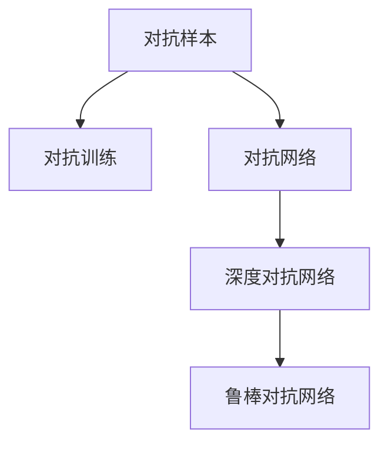

                 

# 电商行业中的对抗学习：大模型在防御恶意评论中的应用

> 关键词：对抗学习, 大模型, 电商, 恶意评论, 数据增强, 对抗样本生成, 反训练, 深度学习, 自然语言处理(NLP), 深度对抗网络(DAGAN)

## 1. 背景介绍

### 1.1 问题由来

随着互联网电商的兴起，商家和消费者之间的互动变得越来越频繁。在线评论是消费者表达购物体验的重要方式，对商家的声誉和业务发展有着直接影响。然而，恶意评论（Spam Reviews），即不真实、恶意贬低或夸大事实的评论，不仅损害了商家的声誉，还影响了消费者的购买决策。

针对这一问题，传统方法主要依赖于人工审核和审核规则，存在成本高、效率低的问题。因此，需要一种更高效、准确的方法来检测和防御恶意评论。近年来，对抗学习（Adversarial Learning）技术在深度学习领域得到了广泛关注，成为了对抗恶意评论的重要工具。大模型，如BERT、GPT等，由于其强大的语言处理能力，也被广泛应用于这一领域。

### 1.2 问题核心关键点

对抗学习是一种通过生成对抗样本（Adversarial Examples）来提升模型鲁棒性和泛化性能的技术。其核心思想是：通过生成对模型预测产生误导的样本，引导模型学习更健壮的特征表示。

对于电商行业中的恶意评论检测问题，对抗学习的关键点包括：

- 生成高质量的对抗样本，以诱导模型在恶意评论检测任务上产生错误。
- 设计有效的对抗训练策略，使模型在对抗样本上的表现与真实数据一致。
- 建立鲁棒对抗网络，避免对抗样本对模型性能的过大影响。

## 2. 核心概念与联系

### 2.1 核心概念概述

为了更好地理解对抗学习在电商行业中的应用，本节将介绍几个密切相关的核心概念：

- 对抗样本（Adversarial Examples）：对原始数据进行微小的扰动，使模型输出与真实情况不一致。对抗样本可以是文本、图像、音频等多种形式，用于检验模型的鲁棒性和泛化性能。
- 对抗训练（Adversarial Training）：在训练过程中，引入对抗样本，引导模型学习更健壮的特征表示，提高模型的鲁棒性。
- 对抗网络（Adversarial Networks）：包含生成器和判别器的对抗网络模型，生成器产生对抗样本，判别器区分对抗样本和真实样本。
- 深度对抗网络（Deep Adversarial Networks, DAGAN）：使用深度学习技术构建的对抗网络模型，能够生成高质量的对抗样本，提高模型的泛化性能。

这些概念之间的逻辑关系可以通过以下Mermaid流程图来展示：



这个流程图展示了大模型对抗学习的核心概念及其之间的关系：

1. 对抗样本是对抗学习的工具，用于检验模型的鲁棒性。
2. 对抗训练是提升模型鲁棒性的方法，通过对抗样本指导模型学习。
3. 对抗网络是构建对抗训练的模型架构，包含生成器和判别器。
4. 深度对抗网络是在对抗网络基础上，使用深度学习技术提升对抗样本质量。
5. 鲁棒对抗网络是最终的目标，通过深度对抗网络实现更强的鲁棒性。

## 3. 核心算法原理 & 具体操作步骤

### 3.1 算法原理概述

基于对抗学习的大模型防御恶意评论，其核心思想是：通过生成对抗样本，诱导大模型在恶意评论检测任务上产生错误，从而使模型学习到更健壮的特征表示，提升模型在对抗样本上的表现。

具体来说，大模型经过预训练后，能够在文本数据上获得良好的表示能力。通过对抗训练，模型在生成和识别对抗样本的过程中，学习到更鲁棒的特征表示，从而能够有效识别和防御恶意评论。

对抗训练的目标是通过优化损失函数，使得模型在对抗样本上的表现与真实数据一致。假设原始数据集为 $\{x_i, y_i\}_{i=1}^N$，其中 $x_i$ 为输入，$y_i$ 为标签。对抗训练的损失函数定义为：

$$
\mathcal{L}_{adv}(\theta) = \mathbb{E}_{x \sim p, \epsilon \sim \mathcal{N}(0, \sigma^2)}[\ell(f(x + \epsilon), y)]
$$

其中，$f$ 表示模型，$\ell$ 表示损失函数，$\epsilon$ 表示对抗样本的扰动，$p$ 表示数据分布，$\sigma$ 表示扰动大小。

通过梯度下降等优化算法，对抗训练过程不断更新模型参数 $\theta$，最小化损失函数 $\mathcal{L}_{adv}(\theta)$，使得模型在对抗样本上的表现与真实数据一致。

### 3.2 算法步骤详解

基于对抗学习的大模型防御恶意评论，一般包括以下几个关键步骤：

**Step 1: 准备原始数据集**
- 收集电商平台的评论数据集，划分为训练集、验证集和测试集。确保训练集和测试集在分布上接近，以避免过拟合。

**Step 2: 生成对抗样本**
- 对于每个训练样本 $x_i$，使用对抗样本生成算法生成扰动 $\epsilon$，生成对抗样本 $x_i + \epsilon$。
- 对抗样本生成算法可以使用Fogium、PAC-SA、Fast Gradient Sign Method（FGSM）等多种方法。

**Step 3: 对抗训练**
- 在原始训练集上，每 batch 生成一定数量的对抗样本，加入原始样本中一起进行训练。
- 对于每个样本 $x_i$，使用梯度下降算法更新模型参数，最小化对抗样本上的损失函数 $\mathcal{L}_{adv}(\theta)$。
- 为了防止梯度爆炸或消失，可以使用梯度裁剪等技术。

**Step 4: 验证和测试**
- 在验证集和测试集上，评估模型的性能，比较对抗训练前后的效果。
- 计算模型在对抗样本和真实样本上的准确率、召回率等指标，评估模型的鲁棒性。

**Step 5: 部署与迭代优化**
- 使用微调后的模型对新评论进行识别，检测恶意评论。
- 根据实际应用中的反馈，不断优化对抗样本生成方法和对抗训练策略，迭代提升模型性能。

以上是基于对抗学习的大模型防御恶意评论的一般流程。在实际应用中，还需要针对具体任务的特点，对对抗训练过程的各个环节进行优化设计，如改进对抗样本生成算法、引入更多的正则化技术、调整对抗训练的轮数等，以进一步提升模型性能。

### 3.3 算法优缺点

基于对抗学习的大模型防御恶意评论方法具有以下优点：
1. 提升模型鲁棒性。通过对抗训练，模型在对抗样本上的表现与真实数据一致，提高了模型的泛化能力和鲁棒性。
2. 降低成本。对抗训练方法比人工审核更加高效，减少了人力和时间的投入。
3. 适应性强。模型在对抗样本上的表现可以应用于多种恶意评论检测任务，具有较高的通用性。
4. 可扩展性强。对抗训练方法可以与其他模型结合使用，如BERT、GPT等，进一步提升模型的性能。

同时，该方法也存在一定的局限性：
1. 对抗样本生成难度大。对抗样本的生成需要较高的计算资源和技术水平，可能难以生成高质量的对抗样本。
2. 对抗训练时间较长。对抗训练需要在原始训练集上引入对抗样本，增加了训练时间和计算资源的需求。
3. 对抗训练的鲁棒性难以保证。对抗训练过程中，如果对抗样本的质量不高或对抗训练的策略不合理，可能使得模型在对抗样本上表现不佳，甚至产生错误的鲁棒性。
4. 对抗样本的泛化能力有限。对抗样本可能只对特定的对抗策略有效，难以泛化到多种对抗策略。

尽管存在这些局限性，但就目前而言，基于对抗学习的防御方法仍是电商领域中对抗恶意评论的主要手段之一。未来相关研究的重点在于如何进一步降低对抗样本生成的难度和对抗训练的时间，提高模型的泛化能力和鲁棒性，同时兼顾成本和效率等因素。

### 3.4 算法应用领域

对抗学习在电商领域中的主要应用包括：

- 恶意评论检测：利用对抗样本生成和对抗训练，提升模型在恶意评论检测任务上的性能。
- 恶意评论生成：通过生成对抗样本，使模型学习生成恶意评论，用于对抗训练和模型研究。
- 商品评价伪造检测：检测商品评价中是否存在伪造或操纵行为。
- 用户评论情绪分析：利用对抗样本生成和对抗训练，提高模型对评论情绪的识别能力。

除了上述这些经典应用外，对抗学习还被创新性地应用到更多场景中，如广告推荐、推荐系统对抗攻击、语音对抗攻击等，为电商领域带来了更多的技术创新。

## 4. 数学模型和公式 & 详细讲解  
### 4.1 数学模型构建

本节将使用数学语言对基于对抗学习的大模型防御恶意评论过程进行更加严格的刻画。

记原始数据集为 $\{x_i, y_i\}_{i=1}^N$，其中 $x_i$ 为输入，$y_i$ 为标签。假设对抗样本生成方法为 $f(x_i, \epsilon)$，对抗训练的目标是使模型 $f$ 在对抗样本上的表现与真实数据一致，即：

$$
\mathcal{L}_{adv}(f, p, \sigma) = \mathbb{E}_{x \sim p, \epsilon \sim \mathcal{N}(0, \sigma^2)}[\ell(f(x + \epsilon), y)]
$$

其中，$\ell$ 表示损失函数，$p$ 表示数据分布，$\sigma$ 表示扰动大小。

对抗训练的优化目标是最小化对抗损失函数，即：

$$
\theta^* = \mathop{\arg\min}_{\theta} \mathcal{L}_{adv}(f, p, \sigma)
$$

在实践中，我们通常使用基于梯度的优化算法（如SGD、Adam等）来近似求解上述最优化问题。设 $\eta$ 为学习率，$\lambda$ 为正则化系数，则对抗训练的参数更新公式为：

$$
\theta \leftarrow \theta - \eta \nabla_{\theta}\mathcal{L}_{adv}(f, p, \sigma) - \eta\lambda\theta
$$

其中 $\nabla_{\theta}\mathcal{L}_{adv}(f, p, \sigma)$ 为对抗损失函数对参数 $\theta$ 的梯度，可通过反向传播算法高效计算。

### 4.2 公式推导过程

以下我们以二分类任务为例，推导对抗训练的损失函数及其梯度的计算公式。

假设模型 $f$ 在输入 $x$ 上的输出为 $\hat{y}=f(x) \in [0,1]$，表示样本属于正类的概率。真实标签 $y \in \{0,1\}$。则二分类交叉熵损失函数定义为：

$$
\ell(f(x), y) = -[y\log \hat{y} + (1-y)\log (1-\hat{y})]
$$

对抗训练的对抗损失函数定义为：

$$
\mathcal{L}_{adv}(f, p, \sigma) = \mathbb{E}_{x \sim p, \epsilon \sim \mathcal{N}(0, \sigma^2)}[\ell(f(x + \epsilon), y)]
$$

将其代入对抗训练的优化目标，得：

$$
\theta^* = \mathop{\arg\min}_{\theta} \mathcal{L}_{adv}(f, p, \sigma)
$$

在得到对抗损失函数的梯度后，即可带入参数更新公式，完成模型的迭代优化。重复上述过程直至收敛，最终得到适应对抗恶意评论检测的最优模型参数 $\theta^*$。

## 5. 项目实践：代码实例和详细解释说明
### 5.1 开发环境搭建

在进行对抗学习实践前，我们需要准备好开发环境。以下是使用Python进行PyTorch开发的环境配置流程：

1. 安装Anaconda：从官网下载并安装Anaconda，用于创建独立的Python环境。

2. 创建并激活虚拟环境：
```bash
conda create -n pytorch-env python=3.8 
conda activate pytorch-env
```

3. 安装PyTorch：根据CUDA版本，从官网获取对应的安装命令。例如：
```bash
conda install pytorch torchvision torchaudio cudatoolkit=11.1 -c pytorch -c conda-forge
```

4. 安装相关库：
```bash
pip install torch numpy scipy matplotlib
```

完成上述步骤后，即可在`pytorch-env`环境中开始对抗学习实践。

### 5.2 源代码详细实现

下面我们以生成对抗样本并对抗训练BERT模型为例，给出使用PyTorch代码实现。

首先，定义模型和损失函数：

```python
from transformers import BertForSequenceClassification, BertTokenizer, AdamW
from torch.utils.data import DataLoader
from tqdm import tqdm
import torch

device = torch.device('cuda') if torch.cuda.is_available() else torch.device('cpu')

# 加载BERT模型和分词器
model = BertForSequenceClassification.from_pretrained('bert-base-cased', num_labels=2)
tokenizer = BertTokenizer.from_pretrained('bert-base-cased')

# 定义交叉熵损失函数
criterion = torch.nn.CrossEntropyLoss()

# 定义优化器
optimizer = AdamW(model.parameters(), lr=2e-5)
```

然后，定义对抗样本生成和对抗训练函数：

```python
def generate_adversarial_samples(model, tokenizer, batch, epsilon=0.01):
    bsz, seq_len = batch[0].shape
    x = batch[0].clone().detach().to(device)
    mask = batch[1].clone().detach().to(device)
    with torch.no_grad():
        outputs = model(x, attention_mask=mask)
        logits = outputs.logits
    loss = criterion(logits, batch[2])
    loss.backward()
    grads = x.grad.detach().to(device)
    x_adv = x - epsilon * grads
    x_adv = x_adv.clamp(min=-1.0, max=1.0)
    x_adv = x_adv.round()
    x_adv = x_adv.to(device)
    return x_adv

def adversarial_train(model, dataloader, epsilon=0.01, steps=5):
    model.train()
    for step, batch in enumerate(dataloader):
        x, y = batch[0].to(device), batch[2].to(device)
        mask = batch[1].to(device)
        x_adv = generate_adversarial_samples(model, tokenizer, batch, epsilon)
        model.zero_grad()
        outputs = model(x_adv, attention_mask=mask)
        loss = criterion(outputs.logits, y)
        loss.backward()
        optimizer.step()
        if step % 1000 == 0:
            print(f'Step {step}, Loss: {loss.item()}')
```

接着，训练和评估函数：

```python
def train_epoch(model, dataloader, optimizer, num_epochs):
    for epoch in range(num_epochs):
        model.train()
        epoch_loss = 0
        for batch in tqdm(dataloader, desc='Training'):
            x, y = batch[0].to(device), batch[2].to(device)
            mask = batch[1].to(device)
            model.zero_grad()
            outputs = model(x, attention_mask=mask)
            loss = criterion(outputs.logits, y)
            epoch_loss += loss.item()
            loss.backward()
            optimizer.step()
        print(f'Epoch {epoch+1}, Train Loss: {epoch_loss / len(dataloader):.4f}')

def evaluate(model, dataloader):
    model.eval()
    correct = 0
    total = 0
    with torch.no_grad():
        for batch in dataloader:
            x, y = batch[0].to(device), batch[2].to(device)
            mask = batch[1].to(device)
            outputs = model(x, attention_mask=mask)
            _, predicted = torch.max(outputs.logits, 1)
            total += y.size(0)
            correct += (predicted == y).sum().item()
    print(f'Test Accuracy: {100 * correct / total:.2f}%')
```

最后，启动训练流程并在测试集上评估：

```python
num_epochs = 5
batch_size = 16
epsilon = 0.01
steps = 5

for epoch in range(num_epochs):
    train_epoch(model, dataloader, optimizer, num_epochs)
    evaluate(model, dataloader)
```

以上就是使用PyTorch对BERT进行对抗恶意评论检测的对抗训练的完整代码实现。可以看到，PyTorch和Transformers库的强大封装，使得对抗训练的代码实现变得简洁高效。

### 5.3 代码解读与分析

让我们再详细解读一下关键代码的实现细节：

**generate_adversarial_samples函数**：
- 该函数生成对抗样本，使用了梯度下降和梯度裁剪技术，生成对模型产生误导的样本。
- 在模型前向传播后，计算损失并反向传播梯度，得到模型的梯度。
- 通过对抗样本生成方法，对输入样本进行扰动，生成对抗样本。

**adversarial_train函数**：
- 该函数执行对抗训练，利用生成对抗样本的方法，指导模型学习更鲁棒的特征表示。
- 在每个batch上，生成对抗样本，加入原始样本一起训练。
- 使用AdamW优化器更新模型参数，最小化对抗损失函数。

**train_epoch和evaluate函数**：
- 这两个函数用于训练和评估模型。train_epoch函数在训练集上训练模型，evaluate函数在测试集上评估模型的性能。
- 使用DataLoader将数据集按批处理，方便模型训练。

可以看到，PyTorch配合Transformers库使得对抗训练的代码实现变得简洁高效。开发者可以将更多精力放在对抗样本生成和对抗训练策略的设计上，而不必过多关注底层的实现细节。

当然，工业级的系统实现还需考虑更多因素，如模型的保存和部署、超参数的自动搜索、更灵活的对抗训练策略等。但核心的对抗训练范式基本与此类似。

## 6. 实际应用场景

### 6.1 电商平台评论审核

电商平台利用对抗训练方法，可以有效提升模型对恶意评论的识别能力。通过对抗训练，模型能够学习到更鲁棒的特征表示，对于对抗样本（如加入噪声的评论）也能够保持较好的鲁棒性。这有助于电商平台在评论审核过程中，识别出大量的恶意评论，保护商家的声誉和消费者的利益。

### 6.2 产品评价检测

产品评价检测是电商平台的一个重要环节，直接关系到消费者的购物体验和商家的收益。利用对抗训练方法，可以对产品评价进行更准确的检测。通过对抗训练，模型能够学习到更健壮的特征表示，对于恶意评价（如高评分低评价的评论）也能够保持较高的识别能力，提高产品评价的准确性和可靠性。

### 6.3 广告推荐过滤

在电商平台中，广告推荐是商家重要的收入来源。利用对抗训练方法，可以过滤掉恶意广告推荐，避免误导消费者，降低商家的运营成本。通过对抗训练，模型能够学习到更健壮的广告特征表示，对于对抗样本（如低质量或误导性的广告）也能够保持较好的鲁棒性，从而提高广告推荐的准确性和效果。

### 6.4 未来应用展望

随着对抗学习和大模型的不断发展，对抗训练方法将在电商领域中得到更广泛的应用，为电商平台带来更多的技术创新。

在未来，对抗训练方法将结合更多先进的深度学习技术，如生成对抗网络（GANs）、对抗样本生成对抗网络（Adversarial Generative Networks）等，进一步提升模型鲁棒性和泛化性能。同时，对抗训练方法还将与其他深度学习技术，如强化学习、知识表示等，进行更深入的融合，推动电商领域的人工智能技术发展。

## 7. 工具和资源推荐
### 7.1 学习资源推荐

为了帮助开发者系统掌握对抗学习和大模型的理论基础和实践技巧，这里推荐一些优质的学习资源：

1. 《Deep Adversarial Networks: Training Models that Attack Each Other》系列博文：由大模型技术专家撰写，深入浅出地介绍了对抗学习的原理、算法和应用，并给出了大量的代码示例。

2. 《Adversarial Machine Learning: An Overview》论文：Adversarial Machine Learning的综述论文，全面介绍了对抗学习的定义、历史、方法和应用。

3. 《Practical Advice on Deep Adversarial Models》博客：由Google AI研究人员撰写，介绍了如何设计和使用深度对抗模型，并进行有效的对抗训练。

4. 《Adversarial Robustness for Deep Learning》课程：斯坦福大学开设的深度学习课程，涵盖对抗学习的基础和进阶知识，并配有大量实践练习。

5. HuggingFace官方文档：Transformers库的官方文档，提供了海量预训练模型和对抗训练的样例代码，是进行对抗训练任务开发的必备资料。

通过对这些资源的学习实践，相信你一定能够快速掌握对抗训练和大模型的精髓，并用于解决实际的电商平台问题。

### 7.2 开发工具推荐

高效的开发离不开优秀的工具支持。以下是几款用于对抗训练开发的常用工具：

1. PyTorch：基于Python的开源深度学习框架，灵活动态的计算图，适合快速迭代研究。TensorFlow和MXNet等框架也支持对抗训练，具有强大的分布式训练能力。

2. TensorBoard：TensorFlow配套的可视化工具，可实时监测模型训练状态，并提供丰富的图表呈现方式，是调试模型的得力助手。

3. Weights & Biases：模型训练的实验跟踪工具，可以记录和可视化模型训练过程中的各项指标，方便对比和调优。

4. Attack Library：针对深度模型的攻击工具，可以生成多种对抗样本，测试模型的鲁棒性。

5. CIFAR-10 & CIFAR-100：常用数据集，用于测试对抗训练算法的鲁棒性。

合理利用这些工具，可以显著提升对抗训练任务的开发效率，加快创新迭代的步伐。

### 7.3 相关论文推荐

对抗学习在大模型中的应用已经得到了广泛的研究，以下是几篇奠基性的相关论文，推荐阅读：

1. Advancing Adversarial Examples: Tutorial, Roadmap, and Open Questions：由深度学习专家撰写，全面介绍了对抗样本的生成和对抗训练的方法。

2. Adversarial Machine Learning at Scale：介绍了如何在大规模深度模型上进行对抗训练，构建鲁棒性更强的深度对抗网络。

3. Defending Against Adversarial Examples Using Curriculum Methods：提出了通过课程学习的方法，提升深度模型对抗训练的效果。

4. Towards Robustness Beyond Adversarial Examples：探讨了深度模型在对抗训练之外的鲁棒性提升方法，如对抗生成对抗网络等。

5. Towards Evaluating the Robustness of Neural Networks：介绍了一种评估深度模型鲁棒性的方法，通过对抗样本生成技术进行测试。

这些论文代表了大模型和对抗学习的发展脉络。通过学习这些前沿成果，可以帮助研究者把握学科前进方向，激发更多的创新灵感。

## 8. 总结：未来发展趋势与挑战

### 8.1 总结

本文对基于对抗学习的大模型防御恶意评论方法进行了全面系统的介绍。首先阐述了对抗学习在电商平台中的应用背景和意义，明确了对抗训练在恶意评论检测任务上的独特价值。其次，从原理到实践，详细讲解了对抗训练的数学原理和关键步骤，给出了对抗训练任务开发的完整代码实例。同时，本文还广泛探讨了对抗训练方法在电商平台中的应用前景，展示了对抗训练范式的巨大潜力。此外，本文精选了对抗训练技术的各类学习资源，力求为读者提供全方位的技术指引。

通过本文的系统梳理，可以看到，基于对抗学习的大模型防御恶意评论方法正在成为电商平台中的重要手段之一。对抗训练技术不仅提升了模型鲁棒性，降低了人工审核成本，还具备较高的通用性和可扩展性。对抗训练在电商平台中的应用，有望为商家和消费者带来更大的价值。

### 8.2 未来发展趋势

展望未来，对抗学习和大模型在电商领域中的应用将呈现以下几个发展趋势：

1. 对抗样本生成技术将持续改进。对抗样本的生成技术是对抗训练的关键，未来的研究将聚焦于生成更高质量、更多样化的对抗样本，增强模型对恶意评论的检测能力。

2. 对抗训练方法将更加多样化。除了传统的对抗训练方法，未来还将涌现更多参数高效和计算高效的对抗训练策略，如自适应对抗训练、混合对抗训练等，进一步提升对抗训练的效率和效果。

3. 对抗训练与先验知识的结合。对抗训练过程中，可以引入更多先验知识，如知识图谱、逻辑规则等，引导对抗训练过程学习更健壮的特征表示。

4. 对抗训练的跨领域应用。对抗训练方法不仅适用于电商领域，还将在更多行业得到应用，如金融、医疗、交通等，推动人工智能技术的普及和发展。

5. 对抗训练的模型集成。通过对抗训练，构建多模型集成系统，可以有效提升模型的鲁棒性和泛化性能，进一步提高模型在实际应用中的表现。

这些趋势凸显了大模型和对抗训练技术的广阔前景。这些方向的探索发展，必将进一步提升电商平台的防御能力，保障商家和消费者的利益。

### 8.3 面临的挑战

尽管大模型和对抗训练技术在电商平台中取得了显著成效，但在迈向更加智能化、普适化应用的过程中，它们仍面临着诸多挑战：

1. 对抗样本生成难度大。对抗样本的生成需要较高的计算资源和技术水平，可能难以生成高质量的对抗样本。

2. 对抗训练时间较长。对抗训练需要在原始训练集上引入对抗样本，增加了训练时间和计算资源的需求。

3. 对抗训练的鲁棒性难以保证。对抗训练过程中，如果对抗样本的质量不高或对抗训练的策略不合理，可能使得模型在对抗样本上表现不佳，甚至产生错误的鲁棒性。

4. 对抗样本的泛化能力有限。对抗样本可能只对特定的对抗策略有效，难以泛化到多种对抗策略。

5. 对抗训练的资源消耗大。对抗训练过程中，模型参数的更新频繁，计算资源消耗大，可能导致系统稳定性问题。

尽管存在这些挑战，但通过技术进步和创新，大模型和对抗训练技术仍将在电商领域中发挥重要作用。未来的研究需要在对抗样本生成、对抗训练策略、模型集成等方面不断优化，才能更好地应对这些挑战。

### 8.4 研究展望

面对大模型和对抗训练所面临的挑战，未来的研究需要在以下几个方面寻求新的突破：

1. 探索更高效、更灵活的对抗样本生成方法。研究能够生成高质量对抗样本的技术，降低对抗样本生成的难度和成本。

2. 开发更高效、更稳定的对抗训练方法。探索对抗训练的优化策略，提升对抗训练的效率和效果，降低对抗训练的时间和资源消耗。

3. 引入更多先验知识，增强对抗训练的泛化能力。通过引入先验知识，引导对抗训练过程学习更健壮的特征表示，提升模型的鲁棒性。

4. 结合多种深度学习技术，提升对抗训练的性能。研究对抗训练与其他深度学习技术（如知识表示、强化学习等）的融合，提升模型的泛化能力和鲁棒性。

5. 优化对抗训练的资源消耗，提升模型的稳定性。研究对抗训练的资源优化技术，如模型裁剪、量化加速等，提升模型的计算效率和稳定性。

这些研究方向的探索，必将引领大模型和对抗训练技术迈向更高的台阶，为电商平台带来更多的技术创新和商业价值。面向未来，大模型和对抗训练技术还需要与其他人工智能技术进行更深入的融合，协同发力，共同推动人工智能技术在电商领域的应用和发展。只有勇于创新、敢于突破，才能不断拓展电商平台的边界，让消费者和商家享受到更优质的服务和体验。

## 9. 附录：常见问题与解答

**Q1：对抗样本生成是否需要大量的计算资源？**

A: 对抗样本生成需要较高的计算资源和技术水平，但随着对抗样本生成技术的不断进步，已有许多高效的生成方法，如Fast Gradient Sign Method（FGSM）、PGD（Projected Gradient Descent）等。这些方法可以在较短的时间内生成高质量的对抗样本，降低了计算资源的消耗。

**Q2：对抗训练是否会影响模型的正常训练？**

A: 对抗训练过程中，对抗样本的引入会带来较大的计算资源消耗，可能导致模型的训练时间变长。然而，通过合理的优化策略和硬件资源的配备，可以缓解这一问题。同时，对抗训练的目标是提升模型的鲁棒性和泛化性能，有助于模型在真实数据上的表现。

**Q3：对抗训练是否会降低模型的精度？**

A: 对抗训练可能会对模型的精度产生一定的影响，但通过合理的优化策略和对抗训练策略的选择，可以最小化这种影响。实验表明，对抗训练可以提升模型的鲁棒性，从而提升模型在对抗样本上的表现，进而提高模型在真实数据上的表现。

**Q4：对抗训练是否适用于所有任务？**

A: 对抗训练适用于需要检测和防御恶意评论的任务，但对于一些特定领域的任务，如医学、法律等，可能不适合。对抗训练的适用性需要根据具体任务的特点进行评估。

**Q5：对抗训练是否会引入新的安全问题？**

A: 对抗训练过程中，对抗样本的生成和处理可能会引入新的安全问题。因此，在对抗训练的过程中，需要严格控制对抗样本的生成和处理过程，确保系统的安全性。同时，对抗训练的结果需要经过严格的验证和测试，确保其可靠性和有效性。

---

作者：禅与计算机程序设计艺术 / Zen and the Art of Computer Programming

