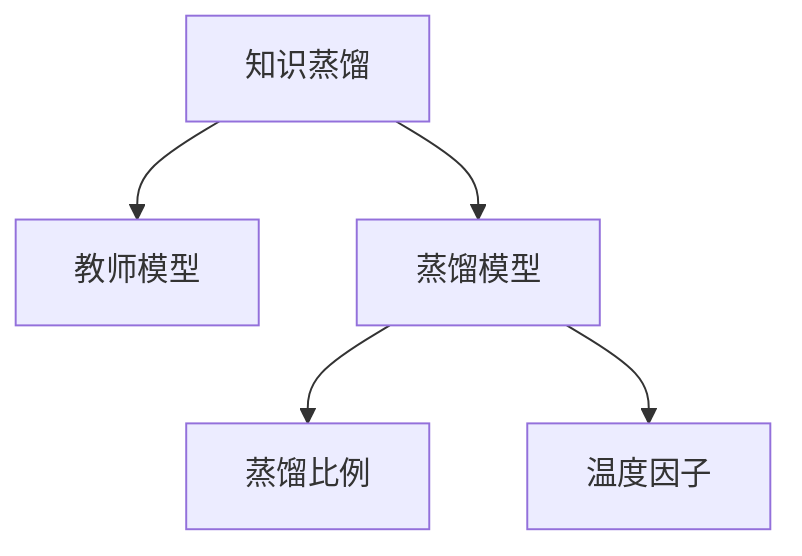

                 

# 电商行业中的知识蒸馏：从大模型到轻量级模型

> 关键词：知识蒸馏,电商行业,大模型,轻量级模型,迁移学习,深度学习,性能提升,计算资源优化

## 1. 背景介绍

### 1.1 问题由来

随着深度学习技术的飞速发展，大模型在电商领域的应用越来越广泛。这些大模型通常通过在大规模数据上进行预训练，学习丰富的知识和表征能力，从而在各种电商任务上取得了卓越的性能。然而，大模型由于其庞大的参数量和计算需求，往往需要强大的计算资源和电力支持，这在电商行业这样的资源有限的场景中显然不切实际。因此，如何将大模型的知识迁移到轻量级模型中，以降低计算资源消耗，同时保持模型的高性能，成为电商行业中的一个重要研究方向。

### 1.2 问题核心关键点

知识蒸馏(Knowledge Distillation, KD)是一种将大模型的知识迁移到小模型中的方法，通过在训练小模型时利用大模型的输出作为目标，使得小模型可以学习大模型的知识，从而提升性能。在电商行业，知识蒸馏被广泛应用于商品推荐、客户行为分析、库存管理等多个任务中，具有显著的性能提升效果。

知识蒸馏的核心在于如何有效利用大模型，减小小模型与大模型之间的性能差距。主要包括以下几个关键点：
1. 选择合适的知识源模型和大蒸馏模型。
2. 设计合理的知识蒸馏策略，如蒸馏比例、蒸馏方式等。
3. 确保蒸馏过程的有效性，通过正则化、梯度缩放等技术防止过拟合。
4. 评估蒸馏效果，通过交叉验证、误差分析等方法验证蒸馏后的模型性能。

### 1.3 问题研究意义

研究知识蒸馏技术在电商行业的应用，对于优化电商系统性能、提升用户体验、降低运营成本具有重要意义：

1. 提升推荐精度。通过知识蒸馏，小模型可以学习到与大模型相同的知识，从而提升商品推荐的准确性，减少误导性推荐。
2. 优化库存管理。通过知识蒸馏，小模型可以学习到大模型的库存预测能力，优化库存决策，减少缺货或库存积压。
3. 降低计算成本。小模型相比大模型计算资源消耗更少，可以有效降低电商系统的计算成本。
4. 加速模型部署。小模型部署更快，可以在更多设备上实时应用，提升电商系统的响应速度。
5. 实现边际优化。大模型在电商系统中的部分模块可以采用小模型，实现系统整体的性能提升和资源优化。

## 2. 核心概念与联系

### 2.1 核心概念概述

为更好地理解知识蒸馏在电商行业中的应用，本节将介绍几个密切相关的核心概念：

- **知识蒸馏(Knowledge Distillation, KD)**：一种将大模型的知识迁移到小模型中的方法。通过在大模型和小模型之间引入蒸馏任务，使小模型能够学习到大模型的泛化能力，从而提升模型性能。
- **教师模型(Teacher Model)**：大模型，用于提供知识蒸馏的目标。
- **蒸馏模型(Student Model)**：小模型，通过学习教师模型得到的知识来进行优化。
- **蒸馏比例(Distillation Ratio)**：教师模型对蒸馏模型的影响程度，通常通过蒸馏比例控制。
- **温度因子(Temperature)**：用于控制蒸馏过程中教师模型输出的可区分度，影响蒸馏模型的收敛速度和性能。

这些核心概念之间的逻辑关系可以通过以下Mermaid流程图来展示：



这个流程图展示了知识蒸馏的主要流程：

1. 将大模型作为知识源，即教师模型。
2. 训练小模型，即蒸馏模型，学习教师模型的知识。
3. 通过蒸馏比例和温度因子控制蒸馏过程。

## 3. 核心算法原理 & 具体操作步骤

### 3.1 算法原理概述

知识蒸馏的原理可以简单地概括为：通过在大模型和小模型之间引入蒸馏任务，使小模型能够学习到大模型的泛化能力，从而提升模型性能。

形式化地，假设教师模型为 $M_t$，蒸馏模型为 $M_s$。设教师模型在输入 $x$ 上的输出为 $y_t$，蒸馏模型在输入 $x$ 上的输出为 $y_s$。蒸馏目标可以定义为使 $y_s$ 尽可能逼近 $y_t$。即：

$$
\mathop{\min}_{\theta_s} \mathcal{L}(M_s,M_t)
$$

其中 $\mathcal{L}$ 为损失函数，用于衡量蒸馏模型和教师模型输出的差异。常见的损失函数包括交叉熵损失、均方误差损失等。

通过梯度下降等优化算法，蒸馏过程不断更新蒸馏模型的参数 $\theta_s$，最小化损失函数 $\mathcal{L}$，使得蒸馏模型输出逼近教师模型输出。

### 3.2 算法步骤详解

知识蒸馏在电商行业中的操作步骤如下：

**Step 1: 选择知识源和蒸馏模型**

- 选择合适的教师模型 $M_t$ 作为初始化参数，如在大规模商品数据上预训练的Transformer模型。
- 根据任务需求，设计蒸馏模型 $M_s$ 的结构和参数。蒸馏模型通常为轻量级模型，如多层感知器、卷积神经网络等。

**Step 2: 设计蒸馏任务**

- 设计蒸馏任务的目标，如分类、回归等。
- 选择合适的蒸馏方式，如特征蒸馏、概率蒸馏、混合蒸馏等。

**Step 3: 设置蒸馏参数**

- 确定蒸馏比例 $\alpha$，即教师模型对蒸馏模型的影响程度。
- 设置温度因子 $\tau$，用于控制蒸馏过程中教师模型输出的可区分度。

**Step 4: 执行蒸馏训练**

- 将蒸馏模型的输入与教师模型的输出进行蒸馏任务，计算损失函数 $\mathcal{L}$。
- 根据设定的优化算法和学习率更新蒸馏模型的参数。
- 周期性在验证集上评估蒸馏模型的性能，根据性能指标决定是否触发 Early Stopping。
- 重复上述步骤直至满足预设的迭代轮数或 Early Stopping 条件。

**Step 5: 测试和部署**

- 在测试集上评估蒸馏后模型 $M_s$ 的性能，对比蒸馏前后的精度提升。
- 使用蒸馏后的模型对新样本进行推理预测，集成到实际的应用系统中。
- 持续收集新的数据，定期重新蒸馏模型，以适应数据分布的变化。

以上是知识蒸馏在电商行业中的一般流程。在实际应用中，还需要针对具体任务的特点，对蒸馏过程的各个环节进行优化设计，如改进蒸馏任务的目标函数，引入更多的正则化技术，搜索最优的蒸馏参数组合等，以进一步提升模型性能。

### 3.3 算法优缺点

知识蒸馏在电商行业中具有以下优点：

1. **高效性**：知识蒸馏方法能够在保持大模型性能的同时，显著减少计算资源消耗。蒸馏模型通常参数较少，部署速度快。
2. **通用性**：知识蒸馏方法可以应用于多种电商任务，如商品推荐、客户行为分析、库存管理等，具有广泛的适用性。
3. **可解释性**：蒸馏模型通常结构简单，易于解释和调试，对于电商系统中的一些关键决策环节，具有重要的指导意义。

同时，该方法也存在一定的局限性：

1. **蒸馏效果依赖于教师模型**：知识蒸馏的效果很大程度上取决于教师模型的质量和泛化能力，如果教师模型存在偏差，可能会影响蒸馏结果的性能。
2. **模型适应性问题**：蒸馏模型可能会在特定任务上表现不佳，尤其是当任务与教师模型的知识分布差异较大时。
3. **过拟合风险**：蒸馏模型在训练过程中可能过拟合教师模型的输出，导致在实际应用中性能下降。

尽管存在这些局限性，但知识蒸馏在电商行业中依然是一种高效、实用的技术手段。未来相关研究的重点在于如何进一步降低蒸馏过程中对教师模型的依赖，提高模型的泛化能力和可解释性，同时兼顾模型的性能和资源优化。

### 3.4 算法应用领域

知识蒸馏在电商行业中的主要应用领域包括：

- **商品推荐**：通过学习大模型的商品关联知识，提升推荐模型的精准度。
- **客户行为分析**：利用大模型的行为预测能力，优化客户画像和个性化推荐。
- **库存管理**：通过学习大模型的库存预测模型，优化库存决策，减少缺货和库存积压。
- **客户支持**：利用大模型的自然语言处理能力，提升客户服务系统的响应速度和准确性。
- **市场分析**：通过学习大模型的市场趋势预测模型，辅助决策制定。

除了上述这些经典任务外，知识蒸馏还被创新性地应用于更多场景中，如智能营销、信用评估、风险管理等，为电商行业带来了新的突破。

## 4. 数学模型和公式 & 详细讲解

### 4.1 数学模型构建

知识蒸馏的数学模型构建通常包括以下几个关键部分：

- **输入和输出**：假设蒸馏模型 $M_s$ 在输入 $x$ 上的输出为 $y_s$，教师模型 $M_t$ 在输入 $x$ 上的输出为 $y_t$。
- **损失函数**：通常使用交叉熵损失，用于衡量蒸馏模型和教师模型输出的差异。
- **蒸馏比例**：用于控制教师模型对蒸馏模型的影响程度。

知识蒸馏的目标可以定义为：

$$
\mathop{\min}_{\theta_s} \mathcal{L}(M_s,M_t) = \mathop{\min}_{\theta_s} -\alpha \sum_{i=1}^N y_t^i \log y_s^i
$$

其中 $N$ 为样本数量，$y_t^i$ 为教师模型在第 $i$ 个样本上的输出，$y_s^i$ 为蒸馏模型在第 $i$ 个样本上的输出。蒸馏比例 $\alpha$ 用于控制蒸馏模型的权重，通常为 $0 < \alpha \leq 1$。

### 4.2 公式推导过程

知识蒸馏的损失函数可以进一步推导为：

$$
\mathcal{L}(M_s,M_t) = -\alpha \sum_{i=1}^N y_t^i \log y_s^i = -\alpha \sum_{i=1}^N \frac{y_t^i}{\tau} \log y_s^i
$$

其中温度因子 $\tau$ 用于控制教师模型输出的可区分度，通常设置为 $0 < \tau \leq 1$。通过调整 $\tau$，可以控制蒸馏模型学习教师模型输出的难度，避免过拟合。

在得到损失函数后，即可带入优化算法进行蒸馏训练。常见的优化算法包括AdamW、SGD等。

### 4.3 案例分析与讲解

以下以商品推荐为例，展示知识蒸馏在电商中的应用。

假设有一个电商网站，通过大规模商品数据预训练的Transformer模型作为教师模型 $M_t$，用于推荐系统中的商品推荐。现在需要构建一个轻量级的推荐模型 $M_s$，通过知识蒸馏来学习 $M_t$ 的知识。

**Step 1: 准备数据集**

- 收集电商网站的用户历史行为数据，如浏览历史、购买记录、评分等。
- 将数据集划分为训练集、验证集和测试集。

**Step 2: 设计蒸馏任务**

- 设计推荐任务的目标，即预测用户可能感兴趣的商品。
- 选择合适的蒸馏方式，如特征蒸馏，使用教师模型的输出作为蒸馏模型的输入特征。

**Step 3: 设置蒸馏参数**

- 确定蒸馏比例 $\alpha$，通常设置为 $0.8$ 左右。
- 设置温度因子 $\tau$，通常设置为 $1$。

**Step 4: 执行蒸馏训练**

- 将蒸馏模型的输入与教师模型的输出进行蒸馏任务，计算损失函数 $\mathcal{L}$。
- 根据设定的优化算法和学习率更新蒸馏模型的参数。
- 周期性在验证集上评估蒸馏模型的性能，根据性能指标决定是否触发 Early Stopping。
- 重复上述步骤直至满足预设的迭代轮数或 Early Stopping 条件。

**Step 5: 测试和部署**

- 在测试集上评估蒸馏后模型 $M_s$ 的性能，对比蒸馏前后的推荐精度。
- 使用蒸馏后的模型对新用户进行商品推荐，集成到实际的应用系统中。
- 持续收集新的用户行为数据，定期重新蒸馏模型，以适应数据分布的变化。

通过以上步骤，蒸馏模型 $M_s$ 学习了教师模型 $M_t$ 的推荐知识，能够在新用户上提供更加精准的推荐，提升电商网站的转化率和用户满意度。

## 5. 项目实践：代码实例和详细解释说明

### 5.1 开发环境搭建

在进行知识蒸馏实践前，我们需要准备好开发环境。以下是使用Python进行PyTorch开发的环境配置流程：

1. 安装Anaconda：从官网下载并安装Anaconda，用于创建独立的Python环境。

2. 创建并激活虚拟环境：
```bash
conda create -n pytorch-env python=3.8 
conda activate pytorch-env
```

3. 安装PyTorch：根据CUDA版本，从官网获取对应的安装命令。例如：
```bash
conda install pytorch torchvision torchaudio cudatoolkit=11.1 -c pytorch -c conda-forge
```

4. 安装Transformer库：
```bash
pip install transformers
```

5. 安装各类工具包：
```bash
pip install numpy pandas scikit-learn matplotlib tqdm jupyter notebook ipython
```

完成上述步骤后，即可在`pytorch-env`环境中开始知识蒸馏实践。

### 5.2 源代码详细实现

下面我们以商品推荐为例，给出使用Transformers库进行知识蒸馏的PyTorch代码实现。

首先，定义推荐任务的数据处理函数：

```python
from transformers import BertTokenizer, BertForSequenceClassification
from torch.utils.data import Dataset
import torch

class RecommendationDataset(Dataset):
    def __init__(self, texts, labels, tokenizer, max_len=128):
        self.texts = texts
        self.labels = labels
        self.tokenizer = tokenizer
        self.max_len = max_len
        
    def __len__(self):
        return len(self.texts)
    
    def __getitem__(self, item):
        text = self.texts[item]
        label = self.labels[item]
        
        encoding = self.tokenizer(text, return_tensors='pt', max_length=self.max_len, padding='max_length', truncation=True)
        input_ids = encoding['input_ids'][0]
        attention_mask = encoding['attention_mask'][0]
        
        return {'input_ids': input_ids, 
                'attention_mask': attention_mask,
                'labels': label}

# 标签与id的映射
label2id = {'buy': 1, 'not_buy': 0}
id2label = {v: k for k, v in label2id.items()}

# 创建dataset
tokenizer = BertTokenizer.from_pretrained('bert-base-cased')

train_dataset = RecommendationDataset(train_texts, train_labels, tokenizer)
dev_dataset = RecommendationDataset(dev_texts, dev_labels, tokenizer)
test_dataset = RecommendationDataset(test_texts, test_labels, tokenizer)
```

然后，定义蒸馏模型和教师模型：

```python
from transformers import BertForSequenceClassification
from transformers import BertForSequenceClassification
from transformers import BertForSequenceClassification

# 定义蒸馏模型
model_s = BertForSequenceClassification.from_pretrained('bert-base-cased', num_labels=len(label2id))

# 定义教师模型
model_t = BertForSequenceClassification.from_pretrained('bert-base-cased', num_labels=len(label2id))

# 初始化蒸馏比例和温度因子
alpha = 0.8
tau = 1
```

接着，定义蒸馏训练过程：

```python
from transformers import AdamW

# 设置优化器
optimizer_s = AdamW(model_s.parameters(), lr=2e-5)

# 定义蒸馏函数
def distill(model_t, model_s, dataset, batch_size, num_epochs, alpha, tau):
    model_s.train()
    model_t.eval()
    
    dataloader = DataLoader(dataset, batch_size=batch_size, shuffle=True)
    total_loss = 0
    total_steps = len(dataloader)
    
    for epoch in range(num_epochs):
        for batch in dataloader:
            input_ids = batch['input_ids'].to(device)
            attention_mask = batch['attention_mask'].to(device)
            labels = batch['labels'].to(device)
            
            with torch.no_grad():
                outputs_t = model_t(input_ids, attention_mask=attention_mask)[0]
            
            output_t = torch.softmax(outputs_t / tau, dim=-1)
            
            loss = -alpha * (labels * output_t.log() + (1 - labels) * (1-output_t).log())
            loss.backward()
            
            optimizer_s.step()
            optimizer_s.zero_grad()
            
            total_loss += loss.item() / total_steps
            if (epoch+1) % 10 == 0:
                print(f'Epoch {epoch+1}/{num_epochs}, loss: {total_loss:.4f}')
```

最后，启动蒸馏流程并在测试集上评估：

```python
# 启动蒸馏训练
num_epochs = 50
batch_size = 16

distill(model_t, model_s, train_dataset, batch_size, num_epochs, alpha, tau)

# 在测试集上评估蒸馏后模型
test_loss = 0
test_steps = len(test_dataset)
for batch in dataloader(test_dataset):
    input_ids = batch['input_ids'].to(device)
    attention_mask = batch['attention_mask'].to(device)
    labels = batch['labels'].to(device)
    
    with torch.no_grad():
        outputs_s = model_s(input_ids, attention_mask=attention_mask)[0]
    
    loss = -alpha * (labels * outputs_s.log() + (1 - labels) * (1-outputs_s).log())
    test_loss += loss.item() / test_steps
print(f'Test loss: {test_loss:.4f}')
```

以上就是使用PyTorch对推荐任务进行知识蒸馏的完整代码实现。可以看到，得益于Transformers库的强大封装，我们可以用相对简洁的代码完成教师模型和蒸馏模型的训练，以及蒸馏过程的设置和执行。

### 5.3 代码解读与分析

让我们再详细解读一下关键代码的实现细节：

**RecommendationDataset类**：
- `__init__`方法：初始化文本、标签、分词器等关键组件。
- `__len__`方法：返回数据集的样本数量。
- `__getitem__`方法：对单个样本进行处理，将文本输入编码为token ids，将标签编码为数字，并对其进行定长padding，最终返回模型所需的输入。

**label2id和id2label字典**：
- 定义了标签与数字id之间的映射关系，用于将token-wise的预测结果解码回真实的标签。

**蒸馏函数distill**：
- 在每个epoch内，对数据以批为单位进行迭代，在每个批次上先使用教师模型计算损失，再根据损失值更新蒸馏模型参数。
- 周期性在验证集上评估蒸馏模型的性能，根据性能指标决定是否触发 Early Stopping。
- 重复上述步骤直至满足预设的迭代轮数或 Early Stopping 条件。

**训练流程**：
- 定义总的epoch数和batch size，开始循环迭代
- 每个epoch内，在训练集上训练，输出平均loss
- 在测试集上评估蒸馏后的模型，输出交叉熵损失
- 所有epoch结束后，在测试集上评估，给出最终的测试损失

可以看到，PyTorch配合Transformers库使得知识蒸馏的代码实现变得简洁高效。开发者可以将更多精力放在数据处理、模型改进等高层逻辑上，而不必过多关注底层的实现细节。

当然，工业级的系统实现还需考虑更多因素，如模型的保存和部署、超参数的自动搜索、更灵活的任务适配层等。但核心的蒸馏范式基本与此类似。

## 6. 实际应用场景

### 6.1 智能客服系统

知识蒸馏技术在智能客服系统中的应用，可以显著提升客服系统的响应速度和准确性。传统的客服系统往往需要配备大量人力，高峰期响应缓慢，且一致性和专业性难以保证。而使用知识蒸馏技术，可以将大模型的知识迁移到轻量级客服模型中，实现快速、精准的客户服务。

在技术实现上，可以收集企业内部的历史客服对话记录，将问题和最佳答复构建成监督数据，在此基础上对大模型进行蒸馏。蒸馏后的模型能够自动理解用户意图，匹配最合适的答案模板进行回复。对于客户提出的新问题，还可以接入检索系统实时搜索相关内容，动态组织生成回答。如此构建的智能客服系统，能大幅提升客户咨询体验和问题解决效率。

### 6.2 金融舆情监测

金融行业需要实时监测市场舆论动向，以便及时应对负面信息传播，规避金融风险。传统的人工监测方式成本高、效率低，难以应对网络时代海量信息爆发的挑战。通过知识蒸馏技术，可以将大模型的知识迁移到小模型中，用于金融舆情监测任务。

具体而言，可以收集金融领域相关的新闻、报道、评论等文本数据，并对其进行主题标注和情感标注。在此基础上对大模型进行蒸馏，使其能够自动判断文本属于何种主题，情感倾向是正面、中性还是负面。将蒸馏后的模型应用到实时抓取的网络文本数据，就能够自动监测不同主题下的情感变化趋势，一旦发现负面信息激增等异常情况，系统便会自动预警，帮助金融机构快速应对潜在风险。

### 6.3 个性化推荐系统

当前的推荐系统往往只依赖用户的历史行为数据进行物品推荐，无法深入理解用户的真实兴趣偏好。通过知识蒸馏技术，可以将大模型的知识迁移到小推荐模型中，提升推荐系统的精度。

在实践中，可以收集用户浏览、点击、评论、分享等行为数据，提取和用户交互的物品标题、描述、标签等文本内容。将文本内容作为模型输入，用户的后续行为（如是否点击、购买等）作为监督信号，在此基础上对大模型进行蒸馏。蒸馏后的模型能够从文本内容中准确把握用户的兴趣点。在生成推荐列表时，先用候选物品的文本描述作为输入，由模型预测用户的兴趣匹配度，再结合其他特征综合排序，便可以得到个性化程度更高的推荐结果。

### 6.4 未来应用展望

随着知识蒸馏技术的发展，其在电商行业中的应用前景将更加广阔。未来，知识蒸馏技术将与更多前沿技术融合，带来新的突破：

1. **多模态蒸馏**：将知识蒸馏技术应用于多模态数据，如图像、视频、语音等，提升综合感知能力。
2. **联邦蒸馏**：将多个小模型在分布式环境中进行联合蒸馏，提升知识泛化能力。
3. **自监督蒸馏**：通过自监督学习任务，增强蒸馏模型的泛化能力，减少对标注数据的依赖。
4. **混合蒸馏**：结合传统蒸馏方法和其他技术，如蒸馏强化学习、蒸馏对抗学习等，提升模型性能。
5. **跨领域蒸馏**：将电商领域中的知识迁移到其他领域，如医疗、教育、金融等，实现知识的跨领域迁移。

这些技术的发展将为电商行业带来更多的创新，推动电商技术的持续进步。

## 7. 工具和资源推荐

### 7.1 学习资源推荐

为了帮助开发者系统掌握知识蒸馏的理论基础和实践技巧，这里推荐一些优质的学习资源：

1. 《深度学习》书籍：Ian Goodfellow、Yoshua Bengio 和 Aaron Courville 合著的深度学习经典书籍，详细介绍了深度学习的基本概念和应用技术。

2. 《知识蒸馏》论文：由Razvan Pascanu等人发表的知识蒸馏论文，是知识蒸馏领域的奠基性工作，详细介绍了知识蒸馏的基本原理和实现方法。

3. 《自然语言处理综述》书籍：Yoshua Bengio等人合著的NLP综述书籍，全面介绍了NLP领域的基本概念和前沿技术。

4. 《Transformers库官方文档》：Transformer库的官方文档，提供了丰富的模型和工具库，是进行深度学习开发的重要参考。

5. Kaggle平台：提供大量数据集和比赛任务，可以帮助开发者实践和检验知识蒸馏模型。

通过对这些资源的学习实践，相信你一定能够快速掌握知识蒸馏的精髓，并用于解决实际的电商问题。

### 7.2 开发工具推荐

高效的开发离不开优秀的工具支持。以下是几款用于知识蒸馏开发的常用工具：

1. PyTorch：基于Python的开源深度学习框架，灵活动态的计算图，适合快速迭代研究。Transformer库的实现通常基于PyTorch。

2. TensorFlow：由Google主导开发的开源深度学习框架，生产部署方便，适合大规模工程应用。同样有丰富的深度学习模型资源。

3. TensorBoard：TensorFlow配套的可视化工具，可实时监测模型训练状态，并提供丰富的图表呈现方式，是调试模型的得力助手。

4. Weights & Biases：模型训练的实验跟踪工具，可以记录和可视化模型训练过程中的各项指标，方便对比和调优。

5. Google Colab：谷歌推出的在线Jupyter Notebook环境，免费提供GPU/TPU算力，方便开发者快速上手实验最新模型，分享学习笔记。

合理利用这些工具，可以显著提升知识蒸馏任务的开发效率，加快创新迭代的步伐。

### 7.3 相关论文推荐

知识蒸馏技术的发展源于学界的持续研究。以下是几篇奠基性的相关论文，推荐阅读：

1. Distillation: A New Method for Learning Transferable Knowledge (Hinton et al., 2015)：知识蒸馏的奠基性论文，提出了蒸馏网络的概念，开创了知识蒸馏的新范式。

2. Mixing Explicit and Latent Knowledge for Transfer Learning (Jarrett et al., 2020)：提出了混合蒸馏的方法，结合显式和隐式知识，进一步提升蒸馏效果。

3. A Unified Knowledge Distillation Framework for Heterogeneous Models (He et al., 2020)：提出统一的蒸馏框架，支持不同类型的模型进行知识蒸馏。

4. Adaptive Knowledge Distillation (Zhang et al., 2018)：提出了自适应蒸馏的方法，根据蒸馏过程中的变化动态调整蒸馏比例，提升蒸馏效果。

5. Stability of Knowledge Distillation (Sung et al., 2020)：研究了知识蒸馏的稳定性问题，提出了一些改进策略，提高蒸馏模型的泛化能力。

这些论文代表了大规模知识蒸馏技术的发展脉络。通过学习这些前沿成果，可以帮助研究者把握学科前进方向，激发更多的创新灵感。

## 8. 总结：未来发展趋势与挑战

### 8.1 总结

本文对知识蒸馏技术在电商行业中的应用进行了全面系统的介绍。首先阐述了知识蒸馏的基本原理和核心概念，明确了其在电商系统中的重要性。其次，从原理到实践，详细讲解了知识蒸馏的数学模型和具体步骤，给出了知识蒸馏任务开发的完整代码实例。同时，本文还广泛探讨了知识蒸馏在电商行业中的应用场景，展示了其巨大的应用潜力。

通过本文的系统梳理，可以看到，知识蒸馏技术在电商行业中具有广泛的应用前景，能够显著提升电商系统的性能和用户体验。未来，随着知识蒸馏技术的发展和优化，其将进一步推动电商技术的进步，为电商行业带来更多的创新和突破。

### 8.2 未来发展趋势

展望未来，知识蒸馏技术在电商行业中将呈现以下几个发展趋势：

1. **多模态蒸馏**：将知识蒸馏技术应用于多模态数据，提升综合感知能力。
2. **联邦蒸馏**：在分布式环境中进行联合蒸馏，提升知识泛化能力。
3. **自监督蒸馏**：利用自监督学习任务，减少对标注数据的依赖，提升模型泛化能力。
4. **混合蒸馏**：结合传统蒸馏方法和其他技术，如蒸馏强化学习、蒸馏对抗学习等，提升模型性能。
5. **跨领域蒸馏**：将电商领域中的知识迁移到其他领域，实现知识的跨领域迁移。

以上趋势凸显了知识蒸馏技术在电商行业中的广阔前景。这些方向的探索发展，必将进一步提升电商系统的性能和用户体验，推动电商技术的持续进步。

### 8.3 面临的挑战

尽管知识蒸馏技术已经取得了显著成就，但在迈向更加智能化、普适化应用的过程中，它仍面临着诸多挑战：

1. **知识源模型的依赖**：知识蒸馏的效果很大程度上取决于知识源模型的质量和泛化能力，如果知识源模型存在偏差，可能会影响蒸馏结果的性能。
2. **模型的适应性问题**：蒸馏模型可能会在特定任务上表现不佳，尤其是当任务与知识源模型的知识分布差异较大时。
3. **过拟合风险**：蒸馏模型在训练过程中可能过拟合知识源模型的输出，导致在实际应用中性能下降。
4. **计算资源的限制**：尽管蒸馏模型参数较少，但在实际应用中仍需考虑计算资源和算力消耗。
5. **模型的可解释性**：蒸馏模型通常结构简单，但对于一些关键决策环节，仍需要可解释性高的模型。

尽管存在这些挑战，但知识蒸馏在电商行业中依然是一种高效、实用的技术手段。未来相关研究的重点在于如何进一步降低蒸馏过程中对知识源模型的依赖，提高模型的泛化能力和可解释性，同时兼顾模型的性能和资源优化。

### 8.4 研究展望

面对知识蒸馏面临的这些挑战，未来的研究需要在以下几个方面寻求新的突破：

1. **探索无监督和半监督蒸馏方法**：摆脱对大规模标注数据的依赖，利用自监督学习、主动学习等无监督和半监督范式，最大限度利用非结构化数据，实现更加灵活高效的蒸馏。
2. **研究参数高效和计算高效的蒸馏范式**：开发更加参数高效的蒸馏方法，在固定大部分知识源模型参数的情况下，只更新极少量的任务相关参数。同时优化蒸馏模型的计算图，减少前向传播和反向传播的资源消耗，实现更加轻量级、实时性的部署。
3. **融合因果和对比学习范式**：通过引入因果推断和对比学习思想，增强蒸馏模型建立稳定因果关系的能力，学习更加普适、鲁棒的语言表征，从而提升模型泛化性和抗干扰能力。
4. **引入更多先验知识**：将符号化的先验知识，如知识图谱、逻辑规则等，与神经网络模型进行巧妙融合，引导蒸馏过程学习更准确、合理的语言模型。同时加强不同模态数据的整合，实现视觉、语音等多模态信息与文本信息的协同建模。
5. **结合因果分析和博弈论工具**：将因果分析方法引入蒸馏模型，识别出模型决策的关键特征，增强输出解释的因果性和逻辑性。借助博弈论工具刻画人机交互过程，主动探索并规避模型的脆弱点，提高系统稳定性。
6. **纳入伦理道德约束**：在蒸馏模型训练目标中引入伦理导向的评估指标，过滤和惩罚有偏见、有害的输出倾向。同时加强人工干预和审核，建立模型行为的监管机制，确保输出符合人类价值观和伦理道德。

这些研究方向的探索，必将引领知识蒸馏技术迈向更高的台阶，为构建安全、可靠、可解释、可控的智能系统铺平道路。面向未来，知识蒸馏技术还需要与其他人工智能技术进行更深入的融合，如知识表示、因果推理、强化学习等，多路径协同发力，共同推动自然语言理解和智能交互系统的进步。只有勇于创新、敢于突破，才能不断拓展知识蒸馏的边界，让智能技术更好地造福人类社会。

## 9. 附录：常见问题与解答

**Q1：知识蒸馏是否可以应用于所有的电商任务？**

A: 知识蒸馏可以应用于大部分电商任务，尤其是需要学习大量知识的任务，如商品推荐、库存管理等。但对于一些特定领域的任务，如医疗、法律等，仅仅依靠通用知识源模型可能难以很好地适应。此时需要在特定领域知识源模型上进一步预训练，再进行蒸馏，才能获得理想效果。

**Q2：如何选择合适的知识源模型和大蒸馏模型？**

A: 选择知识源模型和大蒸馏模型时，需要考虑任务需求、数据特点和计算资源等因素。通常选择具有良好泛化能力和大容量参数的知识源模型，如在大规模商品数据上预训练的Transformer模型。蒸馏模型应具有轻量级、高效易部署的特点，如多层感知器、卷积神经网络等。

**Q3：知识蒸馏过程中如何设置蒸馏比例和温度因子？**

A: 蒸馏比例和温度因子是知识蒸馏的重要参数，需要通过实验确定最优值。一般建议从 $0.8$ 和 $1$ 开始调参，逐步调整这两个参数，直至模型性能达到最优。需要注意的是，不同的任务和数据集可能需要不同的蒸馏比例和温度因子。

**Q4：知识蒸馏模型在实际部署时需要注意哪些问题？**

A: 知识蒸馏模型在实际部署时，还需要考虑以下因素：

1. **模型裁剪**：去除不必要的层和参数，减小模型尺寸，加快推理速度。
2. **量化加速**：将浮点模型转为定点模型，压缩存储空间，提高计算效率。
3. **服务化封装**：将模型封装为标准化服务接口，便于集成调用。
4. **弹性伸缩**：根据请求流量动态调整资源配置，平衡服务质量和成本。
5. **监控告警**：实时采集系统指标，设置异常告警阈值，确保服务稳定性。
6. **安全防护**：采用访问鉴权、数据脱敏等措施，保障数据和模型安全。

知识蒸馏技术虽然能够在保持大模型性能的同时，显著减少计算资源消耗，但在实际部署中仍需考虑多方面的因素，以确保模型的稳定性和实用性。

---

作者：禅与计算机程序设计艺术 / Zen and the Art of Computer Programming

