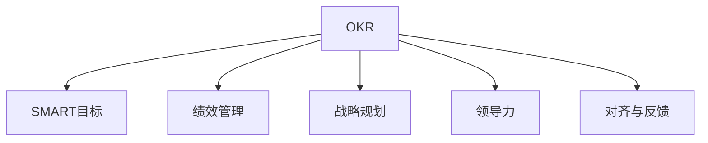

                 

# 目标管理：管理者的领导力

> 关键词：目标管理,OKR,SMART,领导力,绩效管理,战略规划

## 1. 背景介绍

### 1.1 问题由来
在现代企业中，目标管理（Goal Management）已成为组织管理的重要组成部分。传统的目标管理方法往往基于年度预算和财务指标，而忽视了战略目标和长期发展。然而，随着企业环境的多变性和市场竞争的加剧，这种“静态”的目标管理方法已不再适应新的管理需求。

针对上述问题，OKR（Objectives and Key Results）应运而生。OKR是一种目标管理方法，通过设定具体、可衡量的目标（Objectives）和关键结果（Key Results），帮助企业更加灵活、动态地适应市场变化，提升组织绩效和战略执行力。

### 1.2 问题核心关键点
OKR方法的核心在于：
- **设定SMART目标**：确保目标具备具体性（Specific）、可衡量性（Measurable）、可实现性（Achievable）、相关性（Relevant）和时限性（Time-bound）。
- **对齐与反馈**：确保个人和团队目标与公司战略目标对齐，并通过定期的反馈机制，促进目标的实现和调整。
- **提升领导力**：通过明确的目标设定和沟通机制，提升管理者的领导力和团队执行力。

本文将重点探讨OKR的基本原理和操作步骤，并通过具体的案例分析，深入解析其优势和挑战，最后给出实际应用场景和未来发展展望。

## 2. 核心概念与联系

### 2.1 核心概念概述

为更好地理解OKR方法，本节将介绍几个密切相关的核心概念：

- **OKR**：目标管理（Goal Management）中的关键工具，通过设定具体目标和关键结果，实现组织与个人绩效提升。
- **SMART目标**：目标管理中的理想目标定义方法，确保目标具备五项关键特性。
- **绩效管理**：通过设定和跟踪目标，评估个人和团队的工作绩效。
- **战略规划**：企业为实现长期发展目标，制定的全面、系统的策略规划。
- **领导力**：管理者的行为、决策和沟通能力，直接影响团队和组织的绩效表现。
- **对齐与反馈**：确保个人目标与组织目标的一致性，并通过定期反馈促进目标的实现和调整。

这些核心概念之间的逻辑关系可以通过以下Mermaid流程图来展示：



这个流程图展示出OKR与其他管理概念之间的联系：

1. OKR设定具体、可衡量的目标，是SMART目标管理的重要实现方式。
2. OKR与绩效管理结合，通过跟踪目标实现情况，评估团队和个人的绩效表现。
3. OKR与战略规划结合，确保团队和个人的目标与公司战略一致，推动长期发展。
4. OKR提升领导力的同时，也促进了团队的沟通和协作。
5. OKR通过对齐与反馈机制，确保目标实现的一致性和动态性。

## 3. 核心算法原理 & 具体操作步骤

### 3.1 算法原理概述

OKR方法的核心思想是设定具体、可衡量的目标，并确保个人和团队的目标与公司战略目标对齐。通过定期跟踪和反馈，促进目标的实现和调整。其核心流程包括目标设定、对齐、跟踪和反馈。

形式化地，假设公司战略目标为 $G_s$，个人/团队目标为 $G_p$，关键结果为 $KRs$。OKR的目标设定过程可表示为：

$$
G_p = f(G_s, KRs)
$$

其中 $f$ 表示目标设定函数，将公司战略目标 $G_s$ 和关键结果 $KRs$ 映射到个人/团队目标 $G_p$。

通过OKR的设定、对齐、跟踪和反馈机制，不断调整和优化目标，最终实现公司战略目标。

### 3.2 算法步骤详解

OKR的实施步骤通常包括以下几个关键环节：

**Step 1: 设定目标**
- 高层管理者设定公司战略目标 $G_s$。
- 各团队根据公司战略目标，设定具体的业务目标 $G_p$。
- 设定关键结果 $KRs$，确保目标具有可衡量性。

**Step 2: 目标对齐**
- 通过定期的对齐会议，确保个人/团队目标 $G_p$ 与公司战略目标 $G_s$ 对齐。
- 评估关键结果 $KRs$ 的进展，进行必要的调整。

**Step 3: 目标跟踪**
- 通过定期的跟踪会议，记录目标的进展情况，评估完成度。
- 记录和分析关键结果 $KRs$ 的数据，发现问题和改进点。

**Step 4: 反馈与调整**
- 通过定期的反馈会议，分享目标进展情况，讨论改进措施。
- 根据反馈结果，进行目标的调整和优化。

### 3.3 算法优缺点

OKR方法具有以下优点：
1. 灵活适应市场变化。OKR的目标设定具有动态性，能更好地应对外部环境的不确定性。
2. 提升组织绩效。通过明确的目标设定和跟踪，提升团队的执行力。
3. 促进团队协作。OKR强调团队目标的一致性和对齐，促进团队合作。
4. 强化领导力。通过目标设定和跟踪，提升管理者的领导力和决策能力。

同时，OKR方法也存在一些局限性：
1. 目标设定难度大。OKR的设定需要精确把握目标的各项要素，对于管理层的要求较高。
2. 对齐与反馈耗时较长。定期的对齐和反馈会议可能需要耗费较多时间和精力。
3. 数据依赖性强。OKR的有效实施需要依赖高质量的数据和反馈信息，对数据管理的要求较高。
4. 文化差异问题。OKR方法需要企业文化的支持，对于不同的组织文化，实施效果可能存在差异。

尽管存在这些局限性，但就目前而言，OKR方法已成为企业目标管理的重要手段，尤其在技术型和创新型企业中应用广泛。

### 3.4 算法应用领域

OKR方法广泛应用于各类企业中，特别是在技术型和创新型企业中。以下是OKR方法在几个典型场景中的应用：

- **科技公司**：如Google、Apple、Facebook等，通过OKR提升产品创新和市场响应速度。
- **初创企业**：如Dropbox、Airbnb等，通过OKR确保快速适应市场变化，快速成长。
- **传统行业**：如GE、壳牌等，通过OKR推动业务转型和组织变革。

这些企业通过OKR方法，在各自的领域内取得了显著的成效，证明了OKR方法的有效性和普适性。

## 4. 数学模型和公式 & 详细讲解 & 举例说明

### 4.1 数学模型构建

为了更好地理解OKR的目标设定和跟踪过程，我们引入数学模型来表示目标设定和跟踪的逻辑。

假设目标设定函数 $f$ 为线性映射，则目标设定过程可表示为：

$$
G_p = \alpha G_s + \beta KRs
$$

其中 $\alpha$ 和 $\beta$ 为权重系数，表示目标设定函数中的公司和关键结果的贡献比例。

目标跟踪过程中，假设关键结果 $KRs$ 的跟踪数据为 $d_{KR}$，目标进展情况为 $p_G$。则目标跟踪过程可表示为：

$$
p_G = f(KRs, d_{KR})
$$

通过目标跟踪和反馈，不断调整目标设定函数中的权重系数 $\alpha$ 和 $\beta$，优化目标设定和跟踪过程。

### 4.2 公式推导过程

以一家科技公司的产品开发团队为例，设定其目标 $G_p$ 为“产品发布X版本”，关键结果 $KRs$ 为“完成X个功能模块”、“测试覆盖率达90%”、“客户满意度达95%”。

目标设定过程可以表示为：

$$
G_p = 0.7G_s + 0.3KRs
$$

其中 $G_s$ 为“年度销售额增长20%”。

目标跟踪过程中，假设在某个时间点，“完成X个功能模块”的进展为 $d_{KR1}=80%$，“测试覆盖率达90%”的进展为 $d_{KR2}=85%$，“客户满意度达95%”的进展为 $d_{KR3}=90%$。

目标进展情况 $p_G$ 可以表示为：

$$
p_G = 0.8 + 0.15d_{KR1} + 0.05d_{KR2} + 0.05d_{KR3}
$$

通过定期反馈会议，团队可以评估目标进展情况，发现问题并进行调整。例如，发现“测试覆盖率”进度滞后，可以增加测试资源的投入，调整权重系数 $\beta$，以促进目标的实现。

### 4.3 案例分析与讲解

#### 案例1：Google OKR实践

Google是OKR方法的典型代表，其内部的OKR体系非常成熟。Google的OKR设定通常遵循SMART原则，确保目标具体、可衡量、可实现、相关和有时限。例如，某一年度Google的目标之一是“实现搜索广告收入增长15%”，关键结果包括“增加100万付费客户”、“提高广告点击率5%”。

Google通过定期的OKR对齐和反馈会议，确保各团队的目标与公司战略目标对齐，并根据反馈结果进行动态调整。Google的OKR体系不仅提升了公司的整体绩效，还增强了团队协作和领导力。

#### 案例2：Dropbox OKR实践

Dropbox是另一家运用OKR方法获得成功的科技企业。Dropbox的OKR设定通常以“用户体验提升”为重点，例如“改进用户上传速度30%”、“减少用户等待时间20%”。Dropbox通过定期的OKR跟踪和反馈，不断优化产品功能，提升用户体验。

Dropbox通过OKR方法，不仅实现了业务目标，还推动了产品创新和市场扩展。Dropbox的OKR体系体现了数据驱动和持续改进的理念，值得借鉴。

## 5. 项目实践：代码实例和详细解释说明

### 5.1 开发环境搭建

在进行OKR实践前，我们需要准备好开发环境。以下是使用Python进行OKR管理系统的开发环境配置流程：

1. 安装Anaconda：从官网下载并安装Anaconda，用于创建独立的Python环境。

2. 创建并激活虚拟环境：
```bash
conda create -n okr-env python=3.8 
conda activate okr-env
```

3. 安装Python的第三方库：
```bash
pip install flask gunicorn requests
```

4. 安装数据库管理工具：
```bash
pip install mysqlclient
```

5. 安装OKR相关的库：
```bash
pip install okr-py
```

完成上述步骤后，即可在`okr-env`环境中开始OKR实践的代码实现。

### 5.2 源代码详细实现

这里我们以一家科技公司的产品开发团队为例，使用Python和Flask框架开发一个简单的OKR管理系统。

首先，定义OKR数据模型：

```python
from peewee import *

db = SqliteDatabase('okr.db')

class Team(models.Model):
    name = CharField()
    objective = CharField()
    start_date = DateField()
    end_date = DateField()

class KeyResult(models.Model):
    team = ForeignKeyField(Team, on_delete='CASCADE')
    result_name = CharField()
    result_value = FloatField()
    start_date = DateField()
    end_date = DateField()
```

然后，定义OKR管理系统的API接口：

```python
from flask import Flask, jsonify, request

app = Flask(__name__)

@app.route('/teams', methods=['POST'])
def create_team():
    name = request.json['name']
    objective = request.json['objective']
    start_date = request.json['start_date']
    end_date = request.json['end_date']
    
    team = Team.create(name=name, objective=objective, start_date=start_date, end_date=end_date)
    return jsonify({'id': team.id}), 201

@app.route('/teams/<int:team_id>/key_results', methods=['POST'])
def add_key_result(team_id):
    team = Team.get(id=team_id)
    result_name = request.json['result_name']
    result_value = request.json['result_value']
    start_date = request.json['start_date']
    end_date = request.json['end_date']
    
    KeyResult.create(team=team, result_name=result_name, result_value=result_value, start_date=start_date, end_date=end_date)
    return jsonify({'message': 'Key Result added successfully'}), 201

@app.route('/teams/<int:team_id>/key_results', methods=['GET'])
def get_key_results(team_id):
    team = Team.get(id=team_id)
    key_results = KeyResult.select().where(KeyResult.team == team)
    return jsonify([{'id': kr.id, 'result_name': kr.result_name, 'result_value': kr.result_value} for kr in key_results])
```

最后，启动OKR管理系统的API服务：

```python
if __name__ == '__main__':
    db.connect()
    gunicorn_server(app, bind='0.0.0.0:5000')
```

以上就是使用Flask和SQLite实现的OKR管理系统的基本代码框架。通过这个简单的示例，可以看出OKR管理的实现过程，包括目标设定和关键结果的添加、查询。

### 5.3 代码解读与分析

让我们再详细解读一下关键代码的实现细节：

**Team模型和KeyResult模型**：
- `Team`模型表示团队，包含团队名称、目标、开始日期和结束日期。
- `KeyResult`模型表示关键结果，包含所属团队、结果名称、结果值、开始日期和结束日期。

**Flask API接口**：
- `/teams`接口用于创建团队，接收团队名称、目标、开始日期和结束日期等参数，返回创建后的团队ID。
- `/teams/<team_id>/key_results`接口用于添加团队的关键结果，接收团队ID、结果名称、结果值、开始日期和结束日期等参数，返回添加成功的消息。
- `/teams/<team_id>/key_results`接口用于查询团队的关键结果，接收团队ID，返回该团队的所有关键结果。

**Flask服务器启动**：
- 在`__main__`函数中，通过`gunicorn_server`启动Flask服务器，监听5000端口，并绑定到`0.0.0.0`，使得API服务可以公开访问。

通过上述代码的实现，可以看出OKR管理系统的基本功能，包括团队和关键结果的创建、查询。实际开发中，还可以进一步扩展功能，如目标对齐、反馈与调整等。

## 6. 实际应用场景

### 6.1 智能制造企业

在智能制造企业中，OKR方法可以通过设定具体的生产目标和关键结果，推动企业向智能化、自动化方向转型。例如，某制造企业可以设定目标“实现生产自动化率提升20%”，关键结果包括“引入100台自动化设备”、“培训50名操作人员”、“提升设备利用率10%”。

通过OKR方法，企业可以系统化地推动各项任务的实施，提升生产效率和质量，实现智能化转型。

### 6.2 金融科技公司

金融科技公司可以通过OKR方法，提升金融产品的开发和市场响应速度。例如，某金融科技公司可以设定目标“推出新的理财产品”，关键结果包括“完成产品设计30天”、“测试覆盖率达90%”、“获取50万用户”。

通过OKR方法，公司可以高效地推动各项任务的完成，快速响应市场变化，提升产品的竞争力和市场占有率。

### 6.3 教育机构

教育机构可以通过OKR方法，提升教学质量和学生满意度。例如，某大学可以设定目标“提升本科生就业率”，关键结果包括“增加50门实习课程”、“邀请100位行业专家授课”、“建立10个校友企业合作项目”。

通过OKR方法，教育机构可以系统化地推动各项任务的实施，提升教学质量和学生就业率，实现教学与市场的紧密对接。

### 6.4 未来应用展望

随着OKR方法在全球范围内的推广和应用，未来OKR方法将呈现以下几个发展趋势：

1. **数据驱动**：OKR的实施将更加依赖于数据驱动，通过实时监控和分析关键结果的进展，进行动态调整和优化。
2. **智能对齐**：通过AI技术，自动优化目标设定和对齐过程，提升目标设定的科学性和精确性。
3. **多层次管理**：OKR的实施将覆盖更多的管理层次，从个人到团队再到公司层面，形成完整的OKR体系。
4. **跨组织应用**：OKR方法将逐步扩展到跨组织、跨部门的应用场景，推动企业集团内部的协同和协作。

## 7. 工具和资源推荐

### 7.1 学习资源推荐

为了帮助开发者系统掌握OKR方法的理论基础和实践技巧，这里推荐一些优质的学习资源：

1. **《OKR: The Ultimate Guide to Goal Management》**：系统介绍OKR方法的基本原理和操作步骤，提供大量实用案例和最佳实践。

2. **《TheOKRBook》**：详细解析OKR方法在企业中的应用，提供一套完整的OKR实施指南和工具。

3. **《OKR for Dummies》**：入门级OKR方法手册，适合初学者快速了解OKR的基本概念和操作步骤。

4. **Google OKR官方文档**：Google提供的OKR实施指南和工具，包括OKR模板、对齐和反馈机制等。

5. **Airbnb OKR实践**：Airbnb的OKR实施经验分享，提供大量实用的OKR案例和成功经验。

通过对这些资源的学习实践，相信你一定能够快速掌握OKR方法的精髓，并用于解决实际的组织管理问题。

### 7.2 开发工具推荐

OKR方法的实现需要借助一些开发工具来支撑，以下是几款常用的工具：

1. **Flask**：基于Python的轻量级Web框架，适合开发简单的API服务，易于上手和扩展。

2. **SQLite**：轻量级的嵌入式数据库，适合小型应用的数据存储和查询。

3. **MySQL**：开源的关系型数据库，适合中大型应用的数据存储和复杂查询。

4. **GitLab**：基于Git的代码托管平台，适合版本控制和协作开发。

5. **Jira**：项目管理工具，适合OKR的对齐和反馈机制，提供丰富的任务跟踪和报告功能。

合理利用这些工具，可以显著提升OKR方法的开发效率，加快创新迭代的步伐。

### 7.3 相关论文推荐

OKR方法的研究起源于企业管理实践，近年来逐渐成为学术界的研究热点。以下是几篇奠基性的相关论文，推荐阅读：

1. **《OKR: The Ultimate Guide to Goal Management》**：Google的OKR方法论，系统介绍OKR的基本原理和操作步骤。

2. **《TheOKRBook》**：详细解析OKR方法在企业中的应用，提供一套完整的OKR实施指南和工具。

3. **《OKR for Dummies》**：入门级OKR方法手册，适合初学者快速了解OKR的基本概念和操作步骤。

这些论文代表了大规模语言模型微调技术的发展脉络。通过学习这些前沿成果，可以帮助研究者把握学科前进方向，激发更多的创新灵感。

## 8. 总结：未来发展趋势与挑战

### 8.1 总结

本文对OKR方法进行了全面系统的介绍。首先阐述了OKR方法的背景和核心概念，明确了OKR在提升组织绩效、战略执行力方面的独特价值。其次，从原理到实践，详细讲解了OKR的基本流程和操作步骤，并通过具体的案例分析，深入解析其优势和挑战，最后给出实际应用场景和未来发展展望。

通过本文的系统梳理，可以看到，OKR方法正在成为组织管理的重要手段，极大地提升了企业对市场变化的适应能力和整体绩效。未来，伴随OKR方法的不断优化和创新，其应用范围将进一步扩展，推动企业向智能化、数据化方向发展。

### 8.2 未来发展趋势

展望未来，OKR方法将呈现以下几个发展趋势：

1. **数据驱动**：OKR的实施将更加依赖于数据驱动，通过实时监控和分析关键结果的进展，进行动态调整和优化。
2. **智能对齐**：通过AI技术，自动优化目标设定和对齐过程，提升目标设定的科学性和精确性。
3. **多层次管理**：OKR的实施将覆盖更多的管理层次，从个人到团队再到公司层面，形成完整的OKR体系。
4. **跨组织应用**：OKR方法将逐步扩展到跨组织、跨部门的应用场景，推动企业集团内部的协同和协作。

以上趋势凸显了OKR方法在提升组织绩效、战略执行力方面的广阔前景。这些方向的探索发展，必将进一步提升企业对市场变化的适应能力和整体绩效。

### 8.3 面临的挑战

尽管OKR方法已经取得了显著成效，但在迈向更加智能化、普适化应用的过程中，它仍面临着诸多挑战：

1. **目标设定难度大**：OKR的设定需要精确把握目标的各项要素，对于管理层的要求较高。
2. **对齐与反馈耗时较长**：定期的对齐和反馈会议可能需要耗费较多时间和精力。
3. **数据依赖性强**：OKR的有效实施需要依赖高质量的数据和反馈信息，对数据管理的要求较高。
4. **文化差异问题**：OKR方法需要企业文化的支持，对于不同的组织文化，实施效果可能存在差异。

尽管存在这些局限性，但通过持续的优化和创新，OKR方法在企业中的应用将更加广泛，其提升组织绩效、战略执行力的价值将更加凸显。

### 8.4 研究展望

面向未来，OKR方法需要在以下几个方面寻求新的突破：

1. **数据驱动**：通过引入大数据和AI技术，提升目标设定的科学性和精确性。
2. **智能对齐**：通过AI技术，自动优化目标设定和对齐过程，提升目标设定的科学性和精确性。
3. **多层次管理**：覆盖更多的管理层次，从个人到团队再到公司层面，形成完整的OKR体系。
4. **跨组织应用**：逐步扩展到跨组织、跨部门的应用场景，推动企业集团内部的协同和协作。

这些研究方向的探索，必将引领OKR方法走向更高的台阶，为提升企业绩效、推动战略转型提供新的助力。

## 9. 附录：常见问题与解答

**Q1：OKR方法是否适用于所有类型的企业？**

A: OKR方法在大多数类型的企业中都能取得良好的效果，特别是在创新型和技术型企业中。对于传统的制造和农业企业，OKR方法也需要结合实际需求进行调整和优化。

**Q2：如何设置SMART目标？**

A: 设定SMART目标需要遵循五个要素：
1. 具体性（Specific）：目标需要明确、具体，避免模糊。
2. 可衡量性（Measurable）：目标需要具备可衡量的指标，便于跟踪和评估。
3. 可实现性（Achievable）：目标需要具备可实现性，避免过高或过低。
4. 相关性（Relevant）：目标需要与公司战略和团队任务紧密相关。
5. 时限性（Time-bound）：目标需要设定明确的完成时间，避免长期拖延。

**Q3：OKR方法是否需要定期对齐和反馈？**

A: 定期对齐和反馈是OKR方法的核心环节，确保目标的动态性和一致性。通过定期的对齐和反馈，及时发现问题和调整目标，确保目标的实现。

**Q4：OKR方法如何应对跨组织应用？**

A: OKR方法在跨组织应用时，需要设计跨组织的对齐和反馈机制，确保不同部门和单位的目标一致性。可以通过定期的跨部门会议和联合评估，推动跨组织协作。

**Q5：OKR方法在实施过程中如何应对文化差异？**

A: 文化差异是OKR方法实施中的重要挑战。在实施OKR方法时，需要结合企业文化的特点，调整目标设定和对齐方式。可以通过文化培训和领导示范，提升员工对OKR方法的理解和接受度。

通过对这些问题的解答，相信你一定能够更好地理解和应用OKR方法，解决实际的组织管理问题。

---

作者：禅与计算机程序设计艺术 / Zen and the Art of Computer Programming

