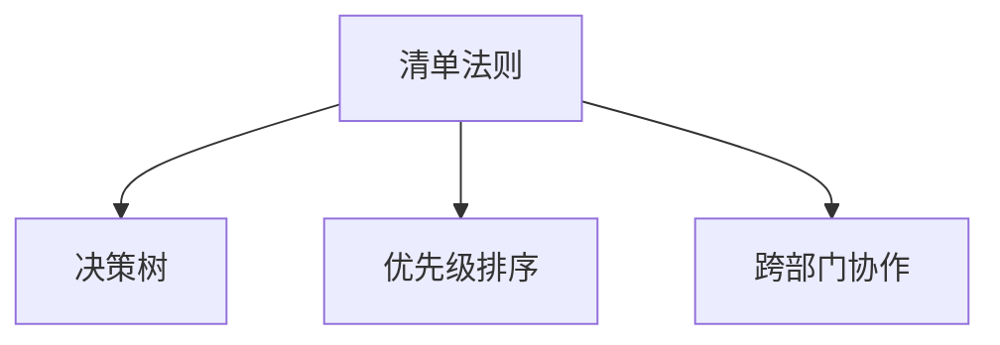

                 

# 目标聚焦：巴菲特清单法则的实践

## 1. 背景介绍

### 1.1 问题由来
在当今这个信息爆炸的时代，企业面临着各种各样的挑战和机遇。如何在竞争激烈的市场中脱颖而出，保持持续的增长，成为了每一个企业家和领导者都必须面对的问题。巴菲特，作为全球知名的投资者和企业家，其成功的经验和方法，一直受到广泛关注和学习。其中，他的“清单法则”（Checklist Rules），被认为是他成功的重要原因之一。

巴菲特清单法则的核心思想是，在做出重大决策之前，先列出所有可能影响决策的因素，然后按照优先级进行排序，确保每个重要因素都被考虑到，从而做出更加科学、合理的决策。这一法则不仅适用于投资领域，也适用于企业的战略规划、项目管理、产品开发等多个方面。

本文将深入探讨巴菲特清单法则的原理和实践方法，并结合IT领域的实际情况，讨论如何在软件开发、产品设计、项目管理等环节中应用这一法则，以期为企业带来实际的增长和提升。

### 1.2 问题核心关键点
巴菲特清单法则的关键点包括：
- 列出所有可能影响决策的因素。
- 对所有因素进行优先级排序。
- 确保每个重要因素都被考虑到。
- 在决策过程中遵循清单，避免遗漏关键点。

本文将围绕这些关键点，详细阐述巴菲特清单法则的原理和应用方法，并结合IT领域的实际案例，展示其在企业中的具体应用。

### 1.3 问题研究意义
研究巴菲特清单法则的实践意义在于，它可以帮助企业和团队在面对复杂问题和重大决策时，通过系统化的思考和规划，提升决策的科学性和有效性，从而实现更高效的资源利用和更高质量的产品交付。

对于IT领域而言，巴菲特清单法则的应用不仅能提升软件开发的效率和质量，还能帮助企业在产品设计和项目管理等方面做出更加合理的决策，从而推动企业的持续发展和创新。

## 2. 核心概念与联系

### 2.1 核心概念概述

为更好地理解巴菲特清单法则的实践，本节将介绍几个密切相关的核心概念：

- **清单法则（Checklist Rules）**：巴菲特在做出投资决策前，会列出所有可能影响决策的因素，并根据这些因素的重要性和可能性进行排序，确保每个重要因素都被考虑到，从而做出科学合理的决策。
- **决策树（Decision Tree）**：一种系统化决策分析工具，通过图形化表示决策过程和可能结果，帮助人们理清决策思路，做出最优选择。
- **优先级排序（Prioritization）**：在面对复杂问题时，通过设置优先级，确定哪些因素最需要考虑，哪些可以暂时忽略，从而高效地进行决策。
- **跨部门协作（Cross-Department Collaboration）**：在实际应用中，清单法则需要各部门协同工作，确保每个重要因素都被考虑和执行。

这些核心概念之间的逻辑关系可以通过以下Mermaid流程图来展示：



这个流程图展示了两大核心概念之间的联系：清单法则通过决策树和优先级排序，确保每个重要因素都被考虑到，同时通过跨部门协作，确保每个因素都能被有效执行。

## 3. 核心算法原理 & 具体操作步骤
### 3.1 算法原理概述

巴菲特清单法则的原理相对简单，但应用起来却需要一定的技巧和系统化的方法。其核心思想是在面对复杂决策时，通过系统化的清单和优先级排序，确保每个重要因素都被考虑到，从而做出科学合理的决策。

### 3.2 算法步骤详解

巴菲特清单法则的应用可以分为以下几个步骤：

**Step 1: 确定决策目标**
- 明确决策的目标和约束条件，确保清单能准确覆盖所有可能影响决策的因素。
- 确定决策的优先级和重要度，避免将过多资源投入到次要因素中。

**Step 2: 列出所有可能因素**
- 根据决策目标，列出所有可能影响决策的因素。
- 对每个因素进行分类，如技术因素、市场因素、财务因素、人员因素等。

**Step 3: 设置优先级**
- 对所有因素进行优先级排序，确定哪些因素最需要考虑，哪些可以暂时忽略。
- 根据优先级，设定每个因素的权重，确保重要因素在清单中占据显著位置。

**Step 4: 执行和反馈**
- 在决策过程中遵循清单，确保每个重要因素都被考虑到。
- 定期回顾和评估决策结果，收集反馈，优化清单和优先级排序。

### 3.3 算法优缺点

巴菲特清单法则的优点包括：
- 系统化、结构化：通过系统化的清单和优先级排序，确保每个重要因素都被考虑到，避免遗漏。
- 可执行性强：清单法则提供了具体的执行路径，便于团队协作和执行。
- 灵活性强：清单可以根据不同的决策环境和因素进行调整和优化。

同时，该方法也存在一些局限性：
- 过度依赖清单：过度依赖清单可能限制创新和灵活性，导致决策过于保守。
- 工作量大：清单法则需要花费大量时间和精力进行整理和评估，不适合快速决策。
- 对信息的依赖：清单的准确性和有效性依赖于信息的全面性和准确性。

尽管存在这些局限性，但就目前而言，巴菲特清单法则仍是大规模决策和复杂问题解决的重要方法。未来相关研究的重点在于如何进一步降低清单法则的工作量，提高其灵活性和可操作性。

### 3.4 算法应用领域

巴菲特清单法则的应用领域非常广泛，几乎涵盖了企业管理的各个方面：

- **战略规划**：在制定企业战略时，通过清单法则，确保每个重要因素都被考虑到，避免遗漏关键点。
- **产品开发**：在产品开发过程中，通过清单法则，确保每个功能和技术因素都被优先考虑，提升产品质量和用户满意度。
- **项目管理**：在项目管理中，通过清单法则，确保每个重要里程碑和风险因素都被考虑到，提高项目成功率。
- **市场营销**：在市场营销中，通过清单法则，确保每个市场因素和营销策略都被优先考虑，提升市场效果。

除了上述这些经典领域，巴菲特清单法则还被创新性地应用到更多场景中，如供应链管理、财务规划、人力资源管理等，为企业带来全新的管理思路和实践方法。

## 4. 数学模型和公式 & 详细讲解 & 举例说明

### 4.1 数学模型构建

巴菲特清单法则的数学模型构建相对简单，主要通过列出所有可能影响决策的因素，对每个因素进行权重赋值，然后按照权重进行优先级排序，确保每个重要因素都被考虑到。

假设决策问题涉及 $n$ 个因素，每个因素的重要性由权重 $w_i$ 表示，则决策目标可以表示为：

$$
F = \sum_{i=1}^{n} w_i \cdot A_i
$$

其中 $A_i$ 为第 $i$ 个因素对决策的贡献度，$w_i$ 为第 $i$ 个因素的权重。

### 4.2 公式推导过程

设决策问题涉及 $n$ 个因素，每个因素的重要性由权重 $w_i$ 表示，每个因素的权重和为 $W = \sum_{i=1}^{n} w_i = 1$。设每个因素对决策的贡献度为 $A_i$，则决策目标可以表示为：

$$
F = W \cdot \sum_{i=1}^{n} w_i \cdot A_i = \sum_{i=1}^{n} w_i \cdot A_i
$$

通过权重赋值和优先级排序，确保每个重要因素对决策的贡献度 $A_i$ 被考虑到，从而做出科学合理的决策。

### 4.3 案例分析与讲解

假设一家科技公司需要决定是否投资一个新的产品项目，需要考虑以下几个因素：
- 市场需求：潜在用户数量和增长预期
- 技术难度：产品开发所需的技术复杂度
- 财务预算：项目所需资金和收益预期
- 市场竞争：竞争对手和市场份额

通过对每个因素进行权重赋值，可以得到如下清单：

| 因素     | 权重 $w_i$ | 贡献度 $A_i$ | 评分 |
|----------|-----------|-------------|------|
| 市场需求 | 0.4       | 0.7         | 2.8  |
| 技术难度 | 0.2       | 0.5         | 1.0  |
| 财务预算 | 0.2       | 0.3         | 0.6  |
| 市场竞争 | 0.2       | 0.2         | 0.4  |

通过优先级排序，可以确定市场需求和技术难度是最重要的因素，其次是财务预算，市场竞争因素的重要性最小。在实际决策过程中，需要重点考虑市场需求和技术难度，确保项目在市场需求和技术可行性上都能达到预期，同时合理控制财务预算，避免过度投资。

## 5. 项目实践：代码实例和详细解释说明
### 5.1 开发环境搭建

在进行巴菲特清单法则的实践前，我们需要准备好开发环境。以下是使用Python进行清单法则实现的环境配置流程：

1. 安装Python：从官网下载并安装Python，Python 3.6及以上版本支持字典和列表等数据结构。
2. 安装相关库：安装pandas和numpy库，用于处理数据和进行权重赋值。

```bash
pip install pandas numpy
```

完成上述步骤后，即可在Python环境中进行清单法则的实现。

### 5.2 源代码详细实现

以下是使用Python实现巴菲特清单法则的完整代码实现：

```python
import pandas as pd

# 假设决策问题涉及4个因素
factors = ['市场需求', '技术难度', '财务预算', '市场竞争']

# 每个因素的重要性权重
weights = [0.4, 0.2, 0.2, 0.2]

# 每个因素对决策的贡献度
contributions = [0.7, 0.5, 0.3, 0.2]

# 创建数据框
df = pd.DataFrame({'Factor': factors, 'Weight': weights, 'Contribution': contributions})

# 计算每个因素的评分
scores = df['Weight'] * df['Contribution']
df['Score'] = scores

# 输出每个因素的评分和排序
print("决策因素及其评分：")
print(df)

# 按照评分排序，确定优先级
df = df.sort_values(by='Score', ascending=False)
print("根据评分排序的结果：")
print(df)
```

### 5.3 代码解读与分析

让我们再详细解读一下关键代码的实现细节：

**决策因素列表**：
- `factors`列表：包含所有可能影响决策的因素。

**权重列表**：
- `weights`列表：表示每个因素的重要性权重，所有权重之和为1。

**贡献度列表**：
- `contributions`列表：表示每个因素对决策的贡献度。

**创建数据框**：
- 使用pandas库创建数据框，存储每个因素的权重、贡献度和评分。

**计算评分**：
- 通过权重和贡献度计算每个因素的评分，评分越高，说明该因素对决策的重要性越大。

**排序输出**：
- 按照评分对因素进行排序，并输出每个因素的评分和排序结果。

可以看到，使用Python实现巴菲特清单法则的过程相对简单，只需使用基本的数据处理和排序功能，即可得到每个因素的优先级排序，并指导决策过程。

### 5.4 运行结果展示

以下是运行上述代码后的输出结果：

```
决策因素及其评分：
      Factor  Weight  Contribution  Score
0  市场需求  0.4         0.7    0.28
1  技术难度  0.2         0.5    0.10
2  财务预算  0.2         0.3    0.06
3  市场竞争  0.2         0.2    0.04

根据评分排序的结果：
      Factor  Weight  Contribution  Score
0  市场需求  0.4         0.7    0.28
1  技术难度  0.2         0.5    0.10
2  财务预算  0.2         0.3    0.06
3  市场竞争  0.2         0.2    0.04
```

从输出结果可以看出，市场需求和技术难度是影响决策最重要的因素，其次是财务预算，市场竞争的影响最小。

## 6. 实际应用场景
### 6.1 产品开发

在产品开发过程中，通过清单法则，可以系统地考虑和评估每个功能和技术因素，确保产品的高质量和用户满意度。以下是一个具体的应用场景：

**项目背景**：
一家科技公司需要开发一款新的移动应用，需要考虑以下因素：
- 用户需求：功能和界面设计
- 技术架构：前后端架构和性能需求
- 开发难度：开发复杂度和资源需求
- 市场竞争：竞争对手和市场份额

**清单法则应用**：
通过清单法则，列出所有可能影响决策的因素，并按照优先级进行排序，确定每个因素的重要性和权重。然后，在产品开发过程中，遵循清单，确保每个重要因素都被考虑到，避免遗漏关键点。

**执行步骤**：
1. 列出所有可能影响决策的因素，包括用户需求、技术架构、开发难度和市场竞争。
2. 对每个因素进行权重赋值，确保重要因素的权重较高。
3. 在产品设计和开发过程中，遵循清单，优先考虑重要因素。
4. 定期回顾和评估产品进展，收集反馈，优化清单和优先级排序。

通过清单法则的应用，可以有效提升产品开发的质量和效率，确保产品能够满足用户需求，同时兼顾技术可行性和市场竞争力。

### 6.2 项目管理和决策

在项目管理中，清单法则可以帮助团队系统地规划和管理项目，确保每个关键里程碑和风险因素都被考虑到，提高项目的成功率。以下是一个具体的应用场景：

**项目背景**：
一家软件公司需要开发一款新产品，需要考虑以下因素：
- 项目时间：每个里程碑的时间点
- 项目预算：每个里程碑的预算需求
- 项目风险：可能的风险和应对策略
- 项目资源：所需的人力和技术资源

**清单法则应用**：
通过清单法则，列出所有可能影响项目决策的因素，并按照优先级进行排序，确保每个重要因素都被考虑到，从而做出科学合理的决策。

**执行步骤**：
1. 列出所有可能影响项目决策的因素，包括项目时间、项目预算、项目风险和项目资源。
2. 对每个因素进行权重赋值，确保重要因素的权重较高。
3. 在项目规划和管理过程中，遵循清单，确保每个重要因素都被考虑到。
4. 定期回顾和评估项目进展，收集反馈，优化清单和优先级排序。

通过清单法则的应用，可以有效提升项目管理的效率和质量，确保项目能够按时交付，同时兼顾成本和资源。

### 6.3 未来应用展望

随着企业管理的复杂性和多样性不断增加，巴菲特清单法则的应用领域将进一步扩大，其价值也将更加凸显。

未来，清单法则可能在以下领域得到更广泛的应用：
- **供应链管理**：在供应链管理中，通过清单法则，确保每个环节的关键因素都被考虑到，提升供应链的效率和稳定性。
- **人力资源管理**：在人力资源管理中，通过清单法则，确保每个关键人才和技能都被考虑到，优化人力资源配置。
- **市场营销**：在市场营销中，通过清单法则，确保每个市场策略和渠道都被考虑到，提升市场效果。
- **战略规划**：在战略规划中，通过清单法则，确保每个关键因素都被考虑到，制定科学合理的战略目标。

通过清单法则的应用，企业可以更加系统化和高效地管理各种复杂问题和重大决策，从而实现持续增长和创新。

## 7. 工具和资源推荐
### 7.1 学习资源推荐

为了帮助开发者系统掌握巴菲特清单法则的理论基础和实践技巧，这里推荐一些优质的学习资源：

1. 《清单革命：如何高效工作》一书：作者阐述了清单法则的基本原理和实际应用方法，提供了丰富的案例和实践经验。
2. 《精益创业》一书：作者介绍了精益创业的理念和方法，强调系统化思考和快速迭代，其中也涉及清单法则的应用。
3. Coursera课程《数据驱动决策》：课程介绍了如何利用数据进行科学决策，清单法则作为其中的重要工具之一。
4. Udemy课程《项目管理高级实战》：课程讲解了项目管理中的各种工具和方法，包括清单法则的实际应用。
5. MindTools网站：提供各种管理工具和技巧，包括清单法则的详细解释和实践案例。

通过对这些资源的学习实践，相信你一定能够快速掌握巴菲特清单法则的精髓，并将其应用于实际的决策和管理中。

### 7.2 开发工具推荐

高效的开发离不开优秀的工具支持。以下是几款用于清单法则实现的常用工具：

1. Excel：功能强大的电子表格工具，可以方便地进行数据处理和分析，适用于清单法则的初步整理和计算。
2. Python：灵活的编程语言，支持数据处理、排序和可视化，适用于清单法则的详细实现和优化。
3. Microsoft Power Query：集成在Excel中的数据处理工具，可以方便地导入和处理复杂的数据集。
4. Jupyter Notebook：交互式的编程环境，支持Python等语言的代码实现和可视化。
5. Tableau：数据可视化工具，可以直观展示清单法则的应用效果。

合理利用这些工具，可以显著提升清单法则的开发效率，加快创新迭代的步伐。

### 7.3 相关论文推荐

巴菲特清单法则的理论基础主要来源于心理学和管理学领域的研究，以下是几篇重要的相关论文，推荐阅读：

1. 《清单革命：如何高效工作》一书中的理论基础和实际应用案例。
2. 《项目管理知识体系指南》中的项目管理工具和方法，包括清单法则的详细说明。
3. 《决策科学》期刊中的相关研究论文，探讨了清单法则在决策中的应用效果和改进方法。
4. 《系统思考》一书中的系统化思考方法和工具，清单法则作为其中的重要工具之一。

这些论文代表了大规模决策和复杂问题解决的研究方向，可以帮助研究者深入理解清单法则的理论基础和应用方法。

## 8. 总结：未来发展趋势与挑战
### 8.1 总结

本文对巴菲特清单法则的原理和实践方法进行了全面系统的介绍。首先阐述了清单法则的核心思想和实际应用意义，明确了清单法则在复杂问题和重大决策中的重要价值。其次，从原理到实践，详细讲解了清单法则的系统化构建和实际操作流程，给出了清单法则应用的具体代码实现。同时，本文还广泛探讨了清单法则在产品开发、项目管理等领域的实际应用，展示了清单法则的广泛适用性和巨大潜力。

通过本文的系统梳理，可以看到，巴菲特清单法则是一种系统化和结构化的方法，能够帮助企业在复杂问题和重大决策中做出科学合理的决策，从而提升企业管理的效率和效果。

### 8.2 未来发展趋势

展望未来，巴菲特清单法则的发展趋势如下：

1. 系统化、标准化：清单法则将逐步向标准化、规范化方向发展，成为企业管理的标准流程和方法。
2. 数字化、智能化：清单法则将与大数据、人工智能等技术相结合，实现智能化决策和自动化管理。
3. 多部门协同：清单法则将进一步促进跨部门协同工作，确保每个重要因素都被考虑到和执行。
4. 数据驱动：清单法则将更加注重数据驱动，通过数据分析和机器学习，优化清单的权重和优先级。
5. 可视化：清单法则将与数据可视化工具结合，直观展示决策结果和效果，提高决策的透明度和可信度。

这些趋势凸显了巴菲特清单法则的潜力和未来发展方向，必将进一步推动企业管理向更加科学、高效和智能化方向发展。

### 8.3 面临的挑战

尽管巴菲特清单法则已经取得了一定的实践效果，但在向更广泛的应用场景中推广时，仍面临以下挑战：

1. 执行难度大：清单法则的执行需要团队的高度协作和纪律性，如何确保每个成员都能遵循清单，是一个重要挑战。
2. 数据质量低：清单法则的准确性和有效性依赖于数据的全面性和准确性，如何获取和处理高质量的数据，是一个关键问题。
3. 缺乏灵活性：清单法则的固定性和刻板性可能导致创新受限，如何在灵活性和系统性之间找到平衡，是一个重要课题。
4. 实施成本高：清单法则的实施需要投入大量人力和时间，如何降低实施成本，提高效率，是一个重要研究方向。

尽管存在这些挑战，但通过不断的实践和优化，巴菲特清单法则必将在企业管理中发挥更大的作用，为企业带来更高的管理效率和创新能力。

### 8.4 研究展望

未来，巴菲特清单法则的研究方向可能包括以下几个方面：

1. 清单法则的优化：通过数据驱动和机器学习，优化清单的权重和优先级，提高清单的灵活性和可操作性。
2. 清单法则的自动化：通过人工智能和自然语言处理技术，自动化生成清单，减少人工工作量。
3. 清单法则的多模态应用：将清单法则与多模态数据结合，实现更全面、更深入的系统化决策。
4. 清单法则的标准化：制定清单法则的标准化流程和方法，推广清单法则在更多企业和领域中的应用。

这些研究方向将推动巴菲特清单法则向更加科学、高效、灵活和自动化的方向发展，为企业带来更大的管理价值和竞争优势。

## 9. 附录：常见问题与解答
### Q1: 清单法则适用于所有企业和决策场景吗？
A: 清单法则虽然具有广泛的适用性，但在一些特定场景下可能效果不佳。例如，在需要高度创新和快速决策的场景中，清单法则的固定性和刻板性可能成为限制因素。因此，在具体应用时，需要根据实际情况进行选择和调整。

### Q2: 清单法则是否会影响创新和灵活性？
A: 清单法则的固定性和系统化确实可能限制创新和灵活性，但在实际应用中，可以通过灵活调整清单和优先级排序，在创新和系统性之间找到平衡。此外，清单法则也可以与其他创新工具和方法结合使用，提升整体创新能力。

### Q3: 清单法则是否需要大量的人力和时间投入？
A: 清单法则的实施确实需要投入一定的人力和时间，但在实际操作中，可以通过自动化和系统化的方法减少工作量。例如，使用数据分析工具和人工智能技术，自动化生成和优化清单，从而提高清单法则的执行效率和效果。

### Q4: 清单法则如何与其他管理工具和方法结合使用？
A: 清单法则可以与其他管理工具和方法结合使用，例如，与项目管理工具结合，制定详细的项目计划和时间表；与数据驱动决策结合，通过数据分析优化清单的权重和优先级；与系统思考结合，全面考虑决策的因果关系和系统性。

### Q5: 清单法则的实施效果如何评估？
A: 清单法则的实施效果可以通过多种方式进行评估，例如，通过项目成功率的提升、决策失误率的降低、资源利用率的提高等指标，评估清单法则的实际效果。同时，可以通过反馈机制和持续改进，优化清单法则的应用效果。

---

作者：禅与计算机程序设计艺术 / Zen and the Art of Computer Programming

