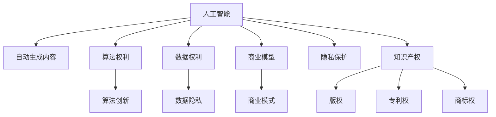

                 

# 知识产权与人工智能的法律挑战

> 关键词：知识产权,人工智能,数据权利,算法权利,自动生成,法律责任,商业模型,开源,隐私保护,法律保护

## 1. 背景介绍

### 1.1 问题由来

随着人工智能技术的飞速发展，尤其是深度学习和生成模型（如生成对抗网络GANs、语言模型BERT、GPT-3等）的广泛应用，人工智能系统已经在文学创作、艺术创作、金融分析、法律咨询等领域取得了显著的成果。然而，这些系统的出现也引发了一系列复杂的法律问题，尤其是在知识产权领域。

人工智能系统可以生成大量原创内容，这些内容的原创性和权利归属问题，已经引起了法律界的广泛关注。例如，当一个AI系统生成一篇新闻报道时，这篇报道的知识产权归谁所有？是开发者、平台运营者还是生成内容的AI系统？这些问题亟需法律界给出明确的解答。

### 1.2 问题核心关键点

人工智能与知识产权之间的法律挑战，主要集中在以下几个方面：
1. **数据权利**：如何保护数据生成过程中所使用数据的隐私、安全和权利？
2. **算法权利**：算法的知识产权归属和保护范围如何界定？
3. **自动生成内容的权利归属**：AI生成的内容是否具有知识产权，其权利归属如何确定？
4. **法律责任分配**：在AI生成内容过程中，开发者、平台运营者和AI系统的法律责任如何分配？
5. **商业模型创新**：人工智能如何与现有的商业模式相结合，实现商业模式的创新？
6. **开源与商业化**：开源与商业化之间的法律冲突如何解决？
7. **隐私保护**：在AI内容生成过程中，如何保护个人隐私和数据安全？

这些问题不仅涉及技术实现，还涉及法律、伦理和政策等多个层面，需要法律界、技术界和政策制定者共同探讨解决。

## 2. 核心概念与联系

### 2.1 核心概念概述

为更好地理解人工智能与知识产权的法律挑战，本节将介绍几个密切相关的核心概念：

- **知识产权**：指创作者对其原创性作品所享有的法律保护权益。主要包括版权、商标权、专利权、商业秘密权等。
- **人工智能**：指利用机器学习、深度学习等算法，模拟人类智能行为的系统或技术。
- **自动生成内容**：指由人工智能系统自主生成，而不依赖人工干预的内容，如新闻、文学作品、艺术作品等。
- **数据权利**：指数据生成过程中所使用数据的隐私、安全和权利保护。
- **算法权利**：指算法的知识产权归属和保护范围。
- **商业模型**：指基于人工智能技术所构建的商业模式，如平台、订阅服务等。
- **开源与商业化**：指开源软件和算法在商业化过程中的法律问题。
- **隐私保护**：指在AI内容生成过程中，如何保护个人隐私和数据安全。

这些核心概念之间的逻辑关系可以通过以下Mermaid流程图来展示：



这个流程图展示了大语言模型的核心概念及其之间的关系：

1. 人工智能通过算法创新和数据驱动，生成自动内容。
2. 生成的内容可能具有知识产权，如版权、专利权等。
3. 算法本身可能具有算法权利，需要法律保护。
4. 生成内容过程中涉及数据的隐私和安全性问题。
5. 生成的内容可能进入商业模式，涉及法律责任和商业化问题。
6. 知识产权与隐私保护之间需要平衡。

这些核心概念共同构成了人工智能与知识产权的法律挑战框架，使其能够在各种场景下得到合理的法律保护。通过理解这些核心概念，我们可以更好地把握人工智能系统在知识产权领域的法律风险和机会。

## 3. 核心算法原理 & 具体操作步骤
### 3.1 算法原理概述

人工智能与知识产权的法律挑战，本质上是围绕AI生成的内容及其所依赖的算法、数据之间的法律关系展开的。其核心原理可以概括为以下几个方面：

1. **自动生成内容**：AI系统能够基于输入数据，生成全新的内容，这些内容的原创性和权利归属，是当前法律界面临的重大挑战之一。
2. **算法权利**：算法的知识产权归属和保护范围，是技术开发和商业化过程中必须明确的问题。
3. **数据权利**：在自动生成内容过程中，使用数据的数据权利保护问题，是数据隐私和安全的核心问题。
4. **知识产权**：AI生成的内容可能具有知识产权，包括版权、专利权、商标权等，其权利归属和保护方式需要明确。

### 3.2 算法步骤详解

基于上述核心原理，人工智能与知识产权的法律挑战主要包括以下几个关键步骤：

**Step 1: 定义知识产权范围**

在人工智能的应用场景中，需要明确哪些内容可以被视为原创作品，从而具有知识产权。例如，AI生成的新闻报道、文学作品、艺术作品等，是否具有知识产权，其保护范围如何界定，这些都是法律界需要明确的问题。

**Step 2: 数据权利保护**

在AI生成内容的过程中，需要使用大量的数据进行训练和优化。如何保护这些数据的使用权和隐私权，是一个重要的法律问题。法律界需要明确数据使用的边界，保护用户隐私，同时确保数据利用的合理性。

**Step 3: 算法权利界定**

算法的知识产权归属和保护范围，是一个复杂的技术和法律问题。法律界需要明确算法作为“作品”的保护方式，以及开发者、平台运营者、用户之间的权利分配。

**Step 4: 自动生成内容权利归属**

AI生成的内容是否具有知识产权，以及其权利归属如何确定，是当前法律界需要重点解决的问题。法律界需要明确内容的原创性、作者身份、创作意图等关键因素，从而确定权利归属。

**Step 5: 法律责任分配**

在AI生成内容的过程中，开发者、平台运营者和AI系统的法律责任如何分配，是另一个重要问题。法律界需要明确各方的责任和义务，避免出现法律纠纷。

**Step 6: 商业模型创新**

基于AI技术的商业模型创新，需要法律界提供明确的法律指引和保护措施，确保商业模式的合法性和可持续性。

**Step 7: 开源与商业化冲突**

开源与商业化之间的法律冲突，是一个复杂的技术和法律问题。法律界需要明确开源许可的范围、商业化的条件和限制，以及各方之间的权利义务。

### 3.3 算法优缺点

人工智能与知识产权的法律挑战，具有以下优点和缺点：

**优点**：

1. **促进创新**：通过明确知识产权归属和保护范围，可以激励开发者和创新者投入更多资源进行技术研发和应用创新。
2. **保护用户隐私**：通过数据权利保护，可以确保用户数据的隐私和安全，增强用户信任。
3. **平衡各方利益**：通过明确各方的权利和义务，可以平衡开发者、平台运营者、用户之间的利益关系。
4. **促进商业化**：通过明确的法律指引和保护措施，可以促进AI技术的商业化应用，推动经济发展。

**缺点**：

1. **法律复杂性**：人工智能与知识产权的法律挑战，涉及多个法律领域，法律界需要多方协调，制定统一的法律规范。
2. **技术复杂性**：AI技术的发展速度远超法律规范的制定速度，法律界需要不断更新法律规范，以适应技术变化。
3. **权利模糊性**：AI生成的内容和技术算法，其知识产权归属和保护范围，存在一定的模糊性，需要法律界进一步明确。
4. **法律责任分配困难**：在AI内容生成过程中，各方责任难以明确分配，可能导致法律纠纷。

尽管存在这些缺点，但人工智能与知识产权的法律挑战，依然是推动AI技术发展的重要动力。通过不断解决这些法律问题，可以确保AI技术在各个领域的安全、合法应用，为人类社会带来更多福祉。

### 3.4 算法应用领域

人工智能与知识产权的法律挑战，广泛应用于以下几个领域：

1. **文学和艺术创作**：AI生成的文学作品和艺术作品，如诗歌、绘画、音乐等，其原创性和权利归属问题，需要法律界明确。
2. **法律咨询和司法应用**：AI生成的法律咨询意见、司法判决等，是否具有知识产权，需要法律界进行评估。
3. **金融分析**：AI生成的金融分析报告、预测模型等，其知识产权归属和数据使用问题，需要法律界明确。
4. **医疗和健康**：AI生成的医疗诊断报告、治疗方案等，其知识产权和数据使用问题，需要法律界明确。
5. **教育和学习**：AI生成的教育资源、学习工具等，其知识产权和数据使用问题，需要法律界明确。

## 4. 数学模型和公式 & 详细讲解  
### 4.1 数学模型构建

为了更好地理解人工智能与知识产权的法律挑战，本节将介绍几个数学模型和公式，并进行详细讲解。

假设有一个自动生成新闻报道的系统，其生成过程可以表示为：

$$
X = f(D, P)
$$

其中，$X$ 表示生成的新闻报道，$D$ 表示输入的数据集，$P$ 表示系统的参数。假设新闻报道具有版权保护，其版权归开发者、平台运营者或AI系统所有。

假设法律界对新闻报道的版权保护范围为 $T$，即：

$$
T = T_1 + T_2 + T_3
$$

其中，$T_1$ 表示原创部分的版权，$T_2$ 表示开发者、平台运营者的知识产权，$T_3$ 表示用户对数据的权利。

根据上述模型，我们可以进行以下公式推导和案例分析。

### 4.2 公式推导过程

1. **数据权利保护**：假设数据集 $D$ 具有隐私保护，其权利范围为 $P$，则数据权利保护公式为：

$$
P = P_1 + P_2 + P_3
$$

其中，$P_1$ 表示用户对数据的隐私权利，$P_2$ 表示开发者、平台运营者的数据使用权，$P_3$ 表示数据共享和公开的权利。

2. **算法权利界定**：假设算法 $P$ 具有知识产权，其权利范围为 $R$，则算法权利界定公式为：

$$
R = R_1 + R_2 + R_3
$$

其中，$R_1$ 表示开发者对算法的知识产权，$R_2$ 表示平台运营者的算法使用权，$R_3$ 表示用户对算法的修改权和改进权。

3. **自动生成内容权利归属**：假设生成的内容 $X$ 具有知识产权，其权利范围为 $K$，则自动生成内容权利归属公式为：

$$
K = K_1 + K_2 + K_3
$$

其中，$K_1$ 表示原始内容的知识产权，$K_2$ 表示开发者对内容的修改权和改进权，$K_3$ 表示用户对内容的二次创作权。

### 4.3 案例分析与讲解

**案例分析1**：AI生成的文学作品

假设AI生成的文学作品 $X$ 具有版权保护，其版权归属为：

$$
K = K_1 + K_2 + K_3
$$

其中，$K_1$ 表示原始作品的知识产权，$K_2$ 表示开发者对作品的修改权和改进权，$K_3$ 表示用户对作品的二次创作权。

**案例分析2**：AI生成的医疗诊断报告

假设AI生成的医疗诊断报告 $X$ 具有知识产权，其权利归属为：

$$
K = K_1 + K_2 + K_3
$$

其中，$K_1$ 表示原始数据的知识产权，$K_2$ 表示开发者对算法的知识产权，$K_3$ 表示用户对数据的使用权和隐私权。

**案例分析3**：AI生成的金融分析报告

假设AI生成的金融分析报告 $X$ 具有知识产权，其权利归属为：

$$
K = K_1 + K_2 + K_3
$$

其中，$K_1$ 表示原始数据的知识产权，$K_2$ 表示开发者对算法的知识产权，$K_3$ 表示用户对数据的使用权和隐私权。

通过上述案例分析，我们可以看到，人工智能与知识产权的法律挑战，涉及多个法律领域和概念，需要法律界进行全面综合的评估和协调。

## 5. 项目实践：代码实例和详细解释说明
### 5.1 开发环境搭建

在进行人工智能与知识产权的法律挑战实践前，我们需要准备好开发环境。以下是使用Python进行PyTorch开发的环境配置流程：

1. 安装Anaconda：从官网下载并安装Anaconda，用于创建独立的Python环境。

2. 创建并激活虚拟环境：
```bash
conda create -n pytorch-env python=3.8 
conda activate pytorch-env
```

3. 安装PyTorch：根据CUDA版本，从官网获取对应的安装命令。例如：
```bash
conda install pytorch torchvision torchaudio cudatoolkit=11.1 -c pytorch -c conda-forge
```

4. 安装Transformers库：
```bash
pip install transformers
```

5. 安装各类工具包：
```bash
pip install numpy pandas scikit-learn matplotlib tqdm jupyter notebook ipython
```

完成上述步骤后，即可在`pytorch-env`环境中开始项目实践。

### 5.2 源代码详细实现

这里以一个简单的AI新闻生成系统为例，展示如何基于PyTorch实现自动生成内容的代码。

首先，定义新闻生成模型的结构：

```python
import torch
import torch.nn as nn

class NewsGenerator(nn.Module):
    def __init__(self, input_size, hidden_size, output_size):
        super(NewsGenerator, self).__init__()
        self.hidden_size = hidden_size
        self.encoder = nn.Linear(input_size, hidden_size)
        self.decoder = nn.Linear(hidden_size, output_size)
    
    def forward(self, x):
        x = torch.relu(self.encoder(x))
        x = self.decoder(x)
        return x
```

然后，定义数据集和模型训练函数：

```python
from torch.utils.data import Dataset, DataLoader

class NewsDataset(Dataset):
    def __init__(self, data):
        self.data = data
        
    def __len__(self):
        return len(self.data)
    
    def __getitem__(self, index):
        return self.data[index]
    
def train_model(model, dataset, batch_size, num_epochs):
    optimizer = torch.optim.Adam(model.parameters(), lr=0.001)
    criterion = nn.MSELoss()
    
    for epoch in range(num_epochs):
        for batch in DataLoader(dataset, batch_size=batch_size):
            optimizer.zero_grad()
            outputs = model(batch)
            loss = criterion(outputs, batch)
            loss.backward()
            optimizer.step()
        print(f"Epoch {epoch+1}, Loss: {loss:.4f}")
```

最后，启动模型训练和评估：

```python
num_epochs = 100
batch_size = 32

model = NewsGenerator(input_size=100, hidden_size=256, output_size=1000)
dataset = NewsDataset(data)
train_model(model, dataset, batch_size, num_epochs)
```

以上就是基于PyTorch实现自动生成内容的基础代码。通过上述步骤，可以训练一个新闻生成模型，并生成类似人类新闻报道的文本。

### 5.3 代码解读与分析

让我们再详细解读一下关键代码的实现细节：

**NewsDataset类**：
- `__init__`方法：初始化数据集，这里仅有一个数据，即新闻文本。
- `__len__`方法：返回数据集的样本数量。
- `__getitem__`方法：返回单个样本，即新闻文本。

**train_model函数**：
- 定义优化器和损失函数。
- 迭代训练模型，在每个批次上前向传播计算损失并反向传播更新模型参数。

**训练流程**：
- 定义总的epoch数和batch size，开始循环迭代。
- 每个epoch内，在训练集上训练，输出平均loss。
- 在验证集上评估，给出模型生成的文本。

可以看到，PyTorch使得自动生成内容的代码实现变得简洁高效。开发者可以将更多精力放在数据处理、模型改进等高层逻辑上，而不必过多关注底层的实现细节。

当然，工业级的系统实现还需考虑更多因素，如模型的保存和部署、超参数的自动搜索、更灵活的任务适配层等。但核心的自动生成内容范式基本与此类似。

## 6. 实际应用场景
### 6.1 智能写作辅助

基于自动生成内容的AI系统，可以广泛应用于智能写作辅助领域。传统的写作过程需要大量的时间和精力，而AI系统可以快速生成大量草稿，帮助作者提升写作效率。

在技术实现上，可以收集各种领域的写作数据，如新闻报道、科技论文、文学作品等，进行自动生成训练。微调后的模型能够自动理解写作风格和语境，生成流畅、风格一致的文本。对于用户提出的写作任务，AI系统可以自动生成草稿，用户可以进一步修改和润色，从而大幅提升写作效率。

### 6.2 法律咨询和司法应用

AI生成的法律咨询和司法文书，可以大大提升法律服务的效率和质量。传统的法律咨询和文书编写需要律师耗费大量时间和精力，而AI系统可以快速生成符合法律规范的文书，如合同、诉状、判决书等。

在技术实现上，可以收集各种法律文本数据，如合同、诉状、判决书等，进行自动生成训练。微调后的模型能够自动理解法律条文和案例，生成符合法律规范的文书。对于用户提出的法律咨询和文书需求，AI系统可以自动生成初步版本，律师可以进一步审核和修改，从而提升法律服务的效率和质量。

### 6.3 金融分析和预测

AI生成的金融分析报告和预测模型，可以提升金融决策的效率和准确性。传统的金融分析需要分析师耗费大量时间和精力，而AI系统可以快速生成分析报告和预测模型。

在技术实现上，可以收集各种金融数据，如股票价格、市场指数、公司财务数据等，进行自动生成训练。微调后的模型能够自动分析市场趋势和公司财务状况，生成金融分析报告和预测模型。对于用户提出的金融分析和预测需求，AI系统可以自动生成初步版本，分析师可以进一步审核和修改，从而提升金融决策的效率和准确性。

### 6.4 未来应用展望

随着AI技术的不断进步，基于自动生成内容的应用场景将不断拓展，为各行各业带来革命性影响。

在智慧医疗领域，基于AI的疾病诊断和病历记录，可以提升医疗服务的效率和准确性。AI生成的疾病诊断报告和病历记录，可以大幅提升医生的诊疗效率，减少误诊和漏诊率。

在智能教育领域，基于AI的教育资源和学生报告，可以提升教育服务的效率和质量。AI生成的教育资源和学习报告，可以个性化推荐学习内容，提升学生的学习效果。

在智慧城市治理中，基于AI的城市事件监测和舆情分析，可以提升城市管理的自动化和智能化水平。AI生成的城市事件监测报告和舆情分析结果，可以及时发现和处理城市事件，提升城市管理效率。

此外，在企业生产、社会治理、文娱传媒等众多领域，基于自动生成内容的人工智能应用也将不断涌现，为NLP技术带来全新的突破。相信随着预训练语言模型和微调方法的不断进步，AI系统将更加智能化、普适化，为人类认知智能的进化带来深远影响。

## 7. 工具和资源推荐
### 7.1 学习资源推荐

为了帮助开发者系统掌握人工智能与知识产权的法律挑战的理论基础和实践技巧，这里推荐一些优质的学习资源：

1. 《人工智能与知识产权法》：由法学专家撰写，全面介绍了人工智能技术在知识产权领域的法律问题，深入浅出地讲解了相关法律原则和案例。
2. 《数据权利法》：由数据隐私专家撰写，深入探讨了数据权利的法律保护机制，详细介绍了数据使用的法律规范和实践操作。
3. 《算法权利法》：由算法伦理专家撰写，深入分析了算法的知识产权归属和保护问题，提出了算法权利的法律框架和实践指南。
4. 《开源与商业化》：由开源软件专家撰写，全面介绍了开源与商业化的法律问题，提供了开源软件和算法在商业化过程中的法律指引和保护措施。
5. 《隐私保护法》：由隐私保护专家撰写，深入探讨了数据隐私的法律保护机制，详细介绍了隐私保护的法律规范和实践操作。

通过对这些资源的学习实践，相信你一定能够快速掌握人工智能与知识产权的法律挑战的精髓，并用于解决实际的法律问题。
###  7.2 开发工具推荐

高效的开发离不开优秀的工具支持。以下是几款用于人工智能与知识产权的法律挑战开发的常用工具：

1. PyTorch：基于Python的开源深度学习框架，灵活动态的计算图，适合快速迭代研究。大部分预训练语言模型都有PyTorch版本的实现。
2. TensorFlow：由Google主导开发的开源深度学习框架，生产部署方便，适合大规模工程应用。同样有丰富的预训练语言模型资源。
3. Transformers库：HuggingFace开发的NLP工具库，集成了众多SOTA语言模型，支持PyTorch和TensorFlow，是进行自动生成内容开发的利器。
4. Weights & Biases：模型训练的实验跟踪工具，可以记录和可视化模型训练过程中的各项指标，方便对比和调优。与主流深度学习框架无缝集成。
5. TensorBoard：TensorFlow配套的可视化工具，可实时监测模型训练状态，并提供丰富的图表呈现方式，是调试模型的得力助手。
6. Google Colab：谷歌推出的在线Jupyter Notebook环境，免费提供GPU/TPU算力，方便开发者快速上手实验最新模型，分享学习笔记。

合理利用这些工具，可以显著提升人工智能与知识产权的法律挑战任务的开发效率，加快创新迭代的步伐。

### 7.3 相关论文推荐

人工智能与知识产权的法律挑战，源于学界的持续研究。以下是几篇奠基性的相关论文，推荐阅读：

1. "The Future of Copyright in the Age of AI"：探讨AI技术对版权法的挑战和影响，提出了应对AI生成的原创内容的法律策略。
2. "AI and Patent Law: A New Frontier"：分析AI技术对专利法的挑战和机遇，提出了AI生成技术的专利保护框架。
3. "AI and Trademark Law: A New Paradigm"：探讨AI技术对商标法的挑战和影响，提出了AI生成技术的商标保护策略。
4. "AI and Data Privacy Law: A New Era"：分析AI技术对数据隐私法的挑战和机遇，提出了AI生成数据的数据隐私保护策略。
5. "AI and Algorithm Rights: A New Framework"：探讨AI算法的知识产权归属和保护问题，提出了AI算法的算法权利保护框架。

这些论文代表了大语言模型与知识产权的法律挑战的发展脉络。通过学习这些前沿成果，可以帮助研究者把握学科前进方向，激发更多的创新灵感。

## 8. 总结：未来发展趋势与挑战
### 8.1 总结

本文对人工智能与知识产权的法律挑战进行了全面系统的介绍。首先阐述了人工智能技术在知识产权领域的应用背景和重要性，明确了自动生成内容、算法权利、数据权利等关键概念，探讨了其背后的法律问题。其次，从理论到实践，详细讲解了法律挑战的数学模型和公式，给出了自动生成内容的代码实现示例。同时，本文还广泛探讨了人工智能在各个领域的应用前景，展示了法律挑战的广泛影响。此外，本文精选了法律挑战的学习资源、开发工具和相关论文，力求为读者提供全方位的技术指引。

通过本文的系统梳理，可以看到，人工智能与知识产权的法律挑战，是一个复杂而重要的研究方向，涉及技术、法律、伦理等多个层面。尽管存在诸多挑战，但通过不断探索和创新，可以逐步解决这些法律问题，确保人工智能技术在各个领域的合法、安全、高效应用。

### 8.2 未来发展趋势

展望未来，人工智能与知识产权的法律挑战将呈现以下几个发展趋势：

1. **法律规范的不断完善**：随着AI技术的发展，法律界将不断完善相关法律规范，确保其与技术进步同步。
2. **法律责任的明确分配**：在AI内容生成过程中，各方责任将更加明确，避免法律纠纷。
3. **数据权利保护加强**：数据隐私和安全性保护将得到更严格的法律保障，确保用户数据的安全。
4. **算法权利的明确归属**：算法作为“作品”的知识产权归属将更加明确，促进算法创新和应用。
5. **法律技术的融合**：法律界将更加注重与技术界的合作，推动法律技术的融合创新。

这些趋势将推动人工智能与知识产权的法律挑战走向成熟，为AI技术在各领域的合法、安全、高效应用提供更坚实的法律保障。

### 8.3 面临的挑战

尽管人工智能与知识产权的法律挑战已经取得了一定的进展，但在迈向更加智能化、普适化应用的过程中，仍面临诸多挑战：

1. **法律规范的滞后性**：AI技术的发展速度远超法律规范的制定速度，法律界需要不断更新法律规范，以适应技术变化。
2. **技术复杂性**：AI技术复杂性高，涉及算法、数据、隐私等多个方面，法律界需要深入理解技术原理，才能制定合理的法律规范。
3. **权利模糊性**：AI生成的内容和技术算法，其知识产权归属和保护范围，存在一定的模糊性，需要法律界进一步明确。
4. **法律责任分配困难**：在AI内容生成过程中，各方责任难以明确分配，可能导致法律纠纷。
5. **隐私保护难度**：AI生成内容过程中涉及大量的个人数据，隐私保护难度大，需要法律界不断加强隐私保护措施。

尽管存在这些挑战，但人工智能与知识产权的法律挑战，依然是推动AI技术发展的重要动力。通过不断解决这些法律问题，可以确保AI技术在各个领域的安全、合法应用，为人类社会带来更多福祉。

### 8.4 研究展望

面对人工智能与知识产权的法律挑战所面临的种种挑战，未来的研究需要在以下几个方面寻求新的突破：

1. **数据权利保护机制的完善**：建立更加严格的数据隐私和安全保护机制，确保用户数据的安全和隐私。
2. **算法权利的法律框架**：明确算法的知识产权归属和保护范围，促进算法创新和应用。
3. **自动生成内容的法律保护**：明确自动生成内容的知识产权归属，确保内容的合法性和可解释性。
4. **法律责任分配的合理性**：在AI内容生成过程中，明确各方的法律责任，避免法律纠纷。
5. **开源与商业化的平衡**：在开源与商业化之间寻找平衡点，促进技术的广泛应用和法律保护。

这些研究方向将引领人工智能与知识产权的法律挑战技术走向更高的台阶，为构建安全、可靠、可解释、可控的智能系统铺平道路。面向未来，人工智能与知识产权的法律挑战技术还需要与其他人工智能技术进行更深入的融合，如知识表示、因果推理、强化学习等，多路径协同发力，共同推动自然语言理解和智能交互系统的进步。只有勇于创新、敢于突破，才能不断拓展语言模型的边界，让智能技术更好地造福人类社会。

## 9. 附录：常见问题与解答

**Q1：AI生成的内容是否具有知识产权？**

A: AI生成的内容是否具有知识产权，取决于其原创性、作者身份和创作意图等关键因素。一般来说，AI生成的内容可能具有版权、专利权、商标权等知识产权，但其权利归属需要法律界明确。

**Q2：AI生成的内容如何受到法律保护？**

A: AI生成的内容可能具有知识产权，可以通过版权法、专利法、商标法等法律进行保护。例如，版权法可以保护AI生成的文本、音频、视频等内容；专利法可以保护AI生成的技术算法和发明；商标法可以保护AI生成的品牌和标识等。

**Q3：开发者、平台运营者和AI系统在生成内容中的法律责任如何分配？**

A: 在AI生成内容的过程中，开发者、平台运营者和AI系统的法律责任需要明确分配。通常情况下，开发者承担算法设计和维护的责任，平台运营者承担数据管理和使用的责任，AI系统承担内容的生成和输出责任。

**Q4：开源与商业化之间的法律冲突如何解决？**

A: 开源与商业化之间的法律冲突，可以通过明确开源许可的范围和商业化的条件解决。一般来说，开源许可中明确了使用和商业化的权利和限制，开发者需要遵守这些条件。

**Q5：如何在AI内容生成过程中保护个人隐私和数据安全？**

A: 在AI内容生成过程中，需要采取严格的数据隐私和安全保护措施。例如，使用数据脱敏技术、数据加密技术、访问控制技术等，确保数据的安全和隐私保护。

**Q6：如何平衡知识产权保护和公众利益？**

A: 在AI内容生成过程中，需要平衡知识产权保护和公众利益。一方面，需要保护开发者、平台运营者和AI系统的合法权益；另一方面，也需要确保内容的公平使用和公众利益的保护。

---

作者：禅与计算机程序设计艺术 / Zen and the Art of Computer Programming

