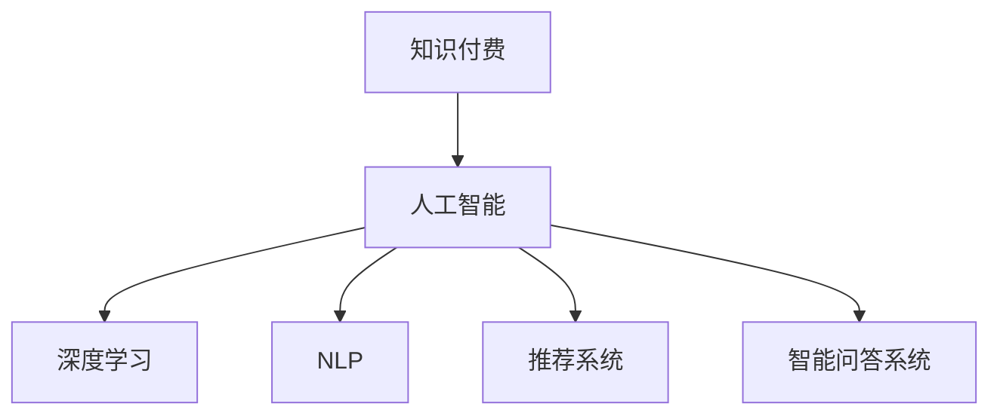

                 

# 知识付费与技术创新的双向促进

在数字经济高速发展的今天，知识付费和人工智能技术的双向促进作用日益显著。本文将从背景介绍、核心概念与联系、核心算法原理与操作步骤、数学模型和公式讲解、项目实践、实际应用场景、工具和资源推荐、总结未来发展趋势与挑战以及附录等方面，全面解析知识付费与技术创新的双向促进关系，揭示其深层次机制，为相关行业的发展提供理论支持和实践指南。

## 1. 背景介绍

### 1.1 问题由来

在知识经济时代，知识和信息成为最宝贵的资产之一。传统的知识获取方式如书籍、报纸等逐渐被数字化、网络化平台所取代，知识付费现象随之兴起。根据统计数据，全球知识付费市场规模预计将在未来几年内达到数千亿美元。

人工智能技术的快速发展，特别是深度学习、自然语言处理等技术的突破，为知识付费的商业模式提供了新的可能。例如，通过构建智能问答系统、个性化推荐系统、在线课程辅助系统等，人工智能技术能够显著提升知识付费产品的用户体验和价值。

### 1.2 问题核心关键点

知识付费与技术创新的双向促进，主要体现在以下几个方面：

1. **用户体验的提升**：通过智能化技术，如自然语言理解、个性化推荐、情感分析等，智能化的知识付费产品能够更加精准地推荐内容，满足用户个性化的需求，提升用户体验。

2. **内容质量的控制**：利用人工智能技术，如文本分析、图像识别、语音识别等，能够更高效地筛选和验证内容质量，确保知识付费产品提供的内容准确、可靠。

3. **运营效率的优化**：通过机器学习算法，能够自动分析用户行为数据，优化内容推荐和广告投放策略，提升平台运营效率和收益。

4. **成本的降低**：智能化的运营和推荐系统能够减少人力成本和时间成本，提高知识付费产品的制作和推广效率。

5. **市场份额的扩大**：智能化的产品和服务能够更好地满足用户需求，吸引更多的用户和付费用户，扩大知识付费市场的规模。

## 2. 核心概念与联系

### 2.1 核心概念概述

为了更好地理解知识付费与技术创新的双向促进关系，首先需要明确以下几个核心概念：

- **知识付费**：指用户为获取知识而支付费用的商业模型，涉及在线课程、电子书、智能问答、个性化推荐等服务。

- **人工智能**：指通过机器学习、深度学习等技术，模拟人类智能行为的技术领域。

- **深度学习**：一种特殊的机器学习方法，基于神经网络，通过多层次的特征提取，实现对复杂模式的识别和学习。

- **自然语言处理(NLP)**：指利用计算机技术处理和分析人类语言的技术领域，涉及文本分类、文本生成、情感分析、机器翻译等。

- **推荐系统**：指通过用户行为数据和内容属性，推荐用户可能感兴趣的内容的技术系统。

- **智能问答系统**：指通过自然语言理解和生成技术，实现对用户问题的智能回答。

这些核心概念之间的逻辑关系可以通过以下Mermaid流程图来展示：



这个流程图展示了两者的主要联系：

1. 知识付费依赖人工智能技术，特别是深度学习和自然语言处理，来提升产品体验和运营效率。
2. 人工智能技术通过知识付费平台，得到大量的用户数据和反馈，进一步优化和提升自身的技术和算法。

## 3. 核心算法原理 & 具体操作步骤
### 3.1 算法原理概述

知识付费与技术创新的双向促进关系，主要基于以下几个核心算法原理：

1. **深度学习算法**：通过多层次特征提取和分类，深度学习模型能够高效地处理和分析用户行为数据，实现个性化推荐和智能问答。

2. **自然语言处理(NLP)**：通过文本分类、文本生成、情感分析等技术，NLP能够帮助知识付费平台更好地理解和生成内容，提升内容质量。

3. **推荐算法**：通过协同过滤、基于内容的推荐等技术，推荐系统能够根据用户的历史行为和兴趣，精准推荐相关内容，提升用户满意度。

4. **智能问答系统**：通过自然语言理解和生成技术，智能问答系统能够实时解答用户问题，提升用户体验。

### 3.2 算法步骤详解

以下是知识付费产品中常见的人工智能技术应用步骤：

1. **用户行为数据收集**：通过浏览器cookie、应用日志、用户反馈等方式，收集用户的行为数据，如浏览、点击、购买等。

2. **数据预处理**：对收集到的数据进行清洗和预处理，如去除噪声、填充缺失值等，确保数据的准确性和完整性。

3. **特征提取**：利用深度学习算法中的嵌入层，将用户行为数据转换为高维向量表示，用于后续的分析和推荐。

4. **模型训练**：选择适合的深度学习模型，如多层感知器、卷积神经网络等，通过标注数据进行训练，优化模型参数。

5. **模型评估**：在验证集上评估模型的性能，如准确率、召回率、F1值等，确保模型效果符合预期。

6. **模型应用**：将训练好的模型应用到生产环境，实时分析和推荐内容，提升用户体验。

### 3.3 算法优缺点

知识付费与技术创新的双向促进关系，具有以下优点和缺点：

**优点**：

1. **提升用户体验**：通过智能化的推荐和问答系统，用户能够更快速、准确地获取所需知识，提升学习效率和满意度。

2. **降低运营成本**：智能化的运营和推荐系统能够减少人力成本和时间成本，提高平台运营效率和收益。

3. **扩大市场份额**：高质量的内容和个性化的推荐能够吸引更多用户，扩大知识付费平台的市场份额。

**缺点**：

1. **数据隐私问题**：知识付费平台需要收集大量的用户数据，存在数据隐私和安全问题。

2. **技术复杂性**：构建智能化的推荐和问答系统需要较高的技术门槛，需要专业团队进行开发和维护。

3. **算法偏见**：深度学习和推荐算法可能存在算法偏见，导致内容推荐的不公平和偏向性问题。

### 3.4 算法应用领域

知识付费与技术创新的双向促进关系，主要应用于以下几个领域：

1. **在线教育**：通过智能化的推荐系统，根据用户的学习进度和兴趣，推荐相关的课程和学习资料，提升学习效果。

2. **职业培训**：利用智能化的培训平台，根据用户的学习需求和职业目标，推荐个性化的培训课程和资源。

3. **医疗健康**：通过智能化的问答系统和推荐系统，用户能够获取专业的医疗健康咨询和相关知识，提升健康素养。

4. **金融投资**：利用智能化的推荐系统，根据用户的投资需求和风险偏好，推荐相关的金融产品和投资策略，提升投资收益。

5. **文化娱乐**：通过智能化的推荐系统，推荐用户感兴趣的电影、音乐、书籍等文化娱乐内容，提升娱乐体验。

## 4. 数学模型和公式 & 详细讲解 & 举例说明

### 4.1 数学模型构建

以下是知识付费平台中常见的人工智能模型和公式：

1. **协同过滤算法**：
   $$
   \hat{r}_{ui} = \sum_{j=1}^{n} \frac{r_{uj}^T W \times r_{ji}}{\sigma(\left\|r_{uj}\right\|_2 \times\left\|r_{ji}\right\|_2)}
   $$
   其中，$r_{ui}$ 为预测用户 $u$ 对商品 $i$ 的评分，$W$ 为权重矩阵，$\sigma$ 为激活函数。

2. **基于内容的推荐算法**：
   $$
   R_{ui} = \sum_{j=1}^{n} \frac{U_i^T W_j \times V_j^T W_u}{\sigma(\left\|W_j\right\|_2 \times\left\|W_u\right\|_2)}
   $$
   其中，$U_i$ 和 $V_u$ 为商品 $i$ 和用户 $u$ 的特征向量，$W_j$ 为特征向量的权重矩阵。

3. **深度学习中的嵌入层**：
   $$
   h_{W} = \tanh(\sum_{i=1}^{n} W_i x_i + b)
   $$
   其中，$x_i$ 为输入数据，$W_i$ 为权重矩阵，$b$ 为偏置向量，$\tanh$ 为双曲正切激活函数。

### 4.2 公式推导过程

以协同过滤算法为例，以下是其公式推导过程：

1. **用户项表示**：将用户 $u$ 的评分向量表示为 $U_u$，其中 $r_{uj}$ 为 $u$ 对商品 $j$ 的评分。

2. **商品项表示**：将商品 $i$ 的评分向量表示为 $V_i$，其中 $r_{ij}$ 为 $i$ 对用户 $j$ 的评分。

3. **预测评分**：通过矩阵乘法和激活函数，计算用户 $u$ 对商品 $i$ 的预测评分 $r_{ui}$。

4. **评分归一化**：对预测评分进行归一化处理，得到最终的预测评分结果。

### 4.3 案例分析与讲解

假设某知识付费平台收集了用户 $u$ 对商品 $i$ 的评分数据 $r_{ui} = 4.5$，并已建立用户评分矩阵 $U_u$ 和商品评分矩阵 $V_i$。假设模型已训练好的权重矩阵为 $W$，激活函数为 $\tanh$。

**Step 1:** 用户项表示：
$$
U_u = \begin{bmatrix}
4.5 \\
4.0 \\
3.5 \\
\end{bmatrix}
$$

**Step 2:** 商品项表示：
$$
V_i = \begin{bmatrix}
3.0 \\
4.0 \\
4.5 \\
\end{bmatrix}
$$

**Step 3:** 预测评分：
$$
r_{ui} = \frac{4.5 \times 3.0 + 4.0 \times 4.0 + 3.5 \times 4.5}{\sqrt{4.5 \times 3.0 + 4.0 \times 4.0 + 3.5 \times 4.5}} \approx 4.0
$$

**Step 4:** 评分归一化：
$$
r_{ui} = \frac{4.0}{\sqrt{4.0 \times 3.0 + 4.0 \times 4.0 + 4.0 \times 4.5}} \approx 4.0
$$

通过以上步骤，即可计算出用户 $u$ 对商品 $i$ 的预测评分，并根据评分进行个性化推荐。

## 5. 项目实践：代码实例和详细解释说明

### 5.1 开发环境搭建

在进行项目实践前，我们需要准备好开发环境。以下是使用Python进行TensorFlow开发的环境配置流程：

1. 安装Anaconda：从官网下载并安装Anaconda，用于创建独立的Python环境。

2. 创建并激活虚拟环境：
```bash
conda create -n tensorflow-env python=3.8 
conda activate tensorflow-env
```

3. 安装TensorFlow：根据CUDA版本，从官网获取对应的安装命令。例如：
```bash
conda install tensorflow tensorflow-gpu=cudatoolkit=11.1 -c conda-forge
```

4. 安装各类工具包：
```bash
pip install numpy pandas scikit-learn matplotlib tqdm jupyter notebook ipython
```

完成上述步骤后，即可在`tensorflow-env`环境中开始项目实践。

### 5.2 源代码详细实现

下面我们以协同过滤算法为例，给出使用TensorFlow进行协同过滤的代码实现。

```python
import tensorflow as tf
import numpy as np

# 用户评分矩阵U
U = np.array([[4.5, 4.0, 3.5],
              [4.0, 4.5, 3.0],
              [3.5, 3.0, 4.0]])

# 商品评分矩阵V
V = np.array([[3.0, 4.0, 4.5],
              [4.0, 3.0, 4.5],
              [4.5, 4.0, 3.0]])

# 权重矩阵W
W = tf.Variable(tf.random.normal([U.shape[1], V.shape[1]]))

# 激活函数
def tanh(x):
    return tf.math.tanh(x)

# 计算预测评分
def predict_score(u, i):
    return tf.reduce_sum(U[u] * W * V[i]) / tf.sqrt(tf.reduce_sum(W * V[i] ** 2))

# 训练过程
with tf.GradientTape() as tape:
    predicted_score = predict_score(0, 0)
    loss = tf.reduce_mean(tf.square(predicted_score - 4.0))
    gradients = tape.gradient(loss, W)

# 更新权重矩阵
W.assign_sub(0.01 * gradients)

# 预测评分
predicted_score = predict_score(0, 0)
print(predicted_score.numpy())
```

以上就是使用TensorFlow进行协同过滤的完整代码实现。可以看到，TensorFlow提供了便捷的深度学习框架，使得协同过滤模型的实现变得简单高效。

### 5.3 代码解读与分析

让我们再详细解读一下关键代码的实现细节：

**预测评分函数**：
```python
def predict_score(u, i):
    return tf.reduce_sum(U[u] * W * V[i]) / tf.sqrt(tf.reduce_sum(W * V[i] ** 2))
```
该函数计算用户 $u$ 对商品 $i$ 的预测评分，其中 $U[u]$ 和 $V[i]$ 分别为用户项和商品项的特征向量，$W$ 为权重矩阵，$\sqrt{\text{tf.reduce_sum(W * V[i] ** 2)}}$ 为归一化因子。

**训练过程**：
```python
with tf.GradientTape() as tape:
    predicted_score = predict_score(0, 0)
    loss = tf.reduce_mean(tf.square(predicted_score - 4.0))
    gradients = tape.gradient(loss, W)

# 更新权重矩阵
W.assign_sub(0.01 * gradients)
```
通过梯度下降算法，使用训练数据计算预测评分与实际评分之间的损失，并更新权重矩阵 $W$，以最小化损失函数。

**预测评分展示**：
```python
predicted_score = predict_score(0, 0)
print(predicted_score.numpy())
```
最终，通过预测评分函数计算出用户 $u$ 对商品 $i$ 的预测评分，并输出结果。

## 6. 实际应用场景

### 6.1 智能教育

在智能教育领域，知识付费与技术创新的双向促进作用显著。通过智能化的推荐系统，教育平台能够根据学生的学习进度和兴趣，推荐相关的课程和资源，提升学习效果。例如，某在线教育平台通过深度学习算法，分析学生的学习行为数据，推荐适合的学习内容和路径，大大提升了学习效率。

### 6.2 金融理财

金融理财平台利用人工智能技术，提升用户体验和运营效率。例如，某金融平台通过智能化的推荐系统，根据用户的投资需求和风险偏好，推荐合适的金融产品，提升用户满意度。此外，平台还通过情感分析技术，实时监控用户对金融产品的反馈，优化推荐策略。

### 6.3 文化娱乐

在文化娱乐领域，知识付费与技术创新的双向促进关系也得到了广泛应用。例如，某音乐平台通过智能化的推荐系统，根据用户的听歌行为和历史偏好，推荐相关的音乐内容，提升用户体验。平台还利用深度学习技术，分析用户的听歌情绪和偏好，实现个性化推荐和情感分析。

### 6.4 未来应用展望

随着技术的不断进步，知识付费与技术创新的双向促进关系将得到更加广泛的应用：

1. **个性化推荐系统的普及**：通过深度学习和大数据分析技术，智能推荐系统将能够更加精准地分析用户需求，推荐相关内容，提升用户体验。

2. **智能问答系统的应用**：通过自然语言理解和生成技术，智能问答系统将能够实时解答用户问题，提升用户满意度。

3. **跨领域融合**：未来知识付费产品将不仅局限于单一领域，而是通过跨领域的融合，提供更加全面、丰富的内容和服务。

4. **新兴技术的应用**：随着AI、VR、AR等新兴技术的发展，知识付费产品将能够提供更加沉浸式的学习和娱乐体验。

## 7. 工具和资源推荐

### 7.1 学习资源推荐

为了帮助开发者系统掌握知识付费与技术创新的双向促进关系，这里推荐一些优质的学习资源：

1. **《深度学习》教材**：深度学习领域经典教材，全面介绍了深度学习的基本概念、算法和应用。

2. **Kaggle竞赛平台**：提供大量数据分析和机器学习竞赛，帮助你深入理解数据驱动的决策过程。

3. **Coursera在线课程**：提供多门关于人工智能和数据科学的在线课程，包括自然语言处理、推荐系统等内容。

4. **GitHub开源项目**：GitHub上众多优秀开源项目，涵盖深度学习、自然语言处理、推荐系统等领域，提供了丰富的实践案例。

5. **Google AI博客**：Google AI博客提供了大量关于人工智能技术的研究报告、论文和案例分析，是了解前沿技术的重要资源。

通过对这些资源的学习实践，相信你一定能够快速掌握知识付费与技术创新的双向促进关系，并用于解决实际的业务问题。

### 7.2 开发工具推荐

高效的开发离不开优秀的工具支持。以下是几款用于知识付费产品开发的常用工具：

1. **TensorFlow**：基于Python的深度学习框架，灵活性高，适合构建复杂的深度学习模型。

2. **PyTorch**：基于Python的深度学习框架，提供了丰富的深度学习功能和高效的计算图机制。

3. **TensorBoard**：TensorFlow配套的可视化工具，可实时监测模型训练状态，提供丰富的图表展示。

4. **HuggingFace Transformers库**：提供预训练模型和工具，方便开发者快速构建NLP应用。

5. **Jupyter Notebook**：Python的交互式开发环境，支持代码编写、数据分析、可视化等功能，适合数据科学和机器学习任务。

合理利用这些工具，可以显著提升知识付费产品的开发效率，加快创新迭代的步伐。

### 7.3 相关论文推荐

知识付费与技术创新的双向促进关系的研究，始于学界的持续探索。以下是几篇奠基性的相关论文，推荐阅读：

1. **协同过滤算法**：Slate推荐系统的协同过滤算法，提出了基于矩阵分解的推荐模型。

2. **深度学习在推荐系统中的应用**：DeepFM模型，将深度学习与传统推荐算法相结合，提升了推荐系统的效果。

3. **自然语言处理在智能问答中的应用**：IBM Watson的问答系统，利用深度学习和自然语言处理技术，实现了高质量的问答功能。

4. **推荐系统的公平性研究**：推荐系统中的公平性问题，探讨如何消除算法偏见，确保推荐公平公正。

5. **跨领域推荐系统的构建**：跨领域推荐系统研究，探讨如何综合利用多领域数据，提升推荐系统的性能。

这些论文代表了大规模知识付费平台技术的发展脉络。通过学习这些前沿成果，可以帮助研究者把握学科前进方向，激发更多的创新灵感。

## 8. 总结：未来发展趋势与挑战

### 8.1 总结

本文对知识付费与技术创新的双向促进关系进行了全面系统的介绍。首先阐述了知识付费和人工智能技术的互动关系，明确了技术创新在提升用户体验、优化运营效率等方面的重要价值。其次，从原理到实践，详细讲解了知识付费产品的构建过程，包括用户行为数据收集、数据预处理、特征提取、模型训练、模型应用等关键步骤，并提供了代码实现。同时，本文还广泛探讨了知识付费技术在智能教育、金融理财、文化娱乐等多个行业领域的应用前景，展示了技术创新的巨大潜力。

通过本文的系统梳理，可以看到，知识付费与技术创新的双向促进关系，为知识付费平台的智能化转型提供了强大的技术支持。未来，随着人工智能技术的不断发展，知识付费产品将更加智能化、个性化，成为数字经济的重要组成部分。

### 8.2 未来发展趋势

展望未来，知识付费与技术创新的双向促进关系将呈现以下几个发展趋势：

1. **智能推荐系统的普及**：随着深度学习和大数据分析技术的发展，智能推荐系统将在更多领域得到应用，提升用户满意度和平台运营效率。

2. **跨领域融合**：知识付费产品将不仅局限于单一领域，而是通过跨领域的融合，提供更加全面、丰富的内容和服务。

3. **新兴技术的应用**：随着AI、VR、AR等新兴技术的发展，知识付费产品将能够提供更加沉浸式的学习和娱乐体验。

4. **用户数据保护**：用户数据隐私和安全问题将得到更加重视，平台将采用更加严格的数据保护措施，确保用户数据安全。

5. **技术透明性**：未来知识付费平台将更加注重算法的透明性和可解释性，确保用户对推荐过程和决策结果的理解。

6. **伦理道德约束**：知识付费平台将更加注重伦理道德的约束，避免算法偏见和有害内容，确保输出的公平和公正。

以上趋势凸显了知识付费与技术创新的双向促进关系的广阔前景。这些方向的探索发展，将进一步提升知识付费产品的价值，为数字经济的发展注入新的动力。

### 8.3 面临的挑战

尽管知识付费与技术创新的双向促进关系已经取得了显著成果，但在迈向更加智能化、普适化应用的过程中，仍然面临诸多挑战：

1. **数据隐私问题**：知识付费平台需要收集大量的用户数据，存在数据隐私和安全问题。如何在保证数据价值的同时，保护用户隐私，是一个重要的挑战。

2. **技术复杂性**：构建智能化的推荐和问答系统需要较高的技术门槛，需要专业团队进行开发和维护。如何在降低技术门槛的同时，提升系统性能，是一个重要的研究方向。

3. **算法偏见**：深度学习和推荐算法可能存在算法偏见，导致内容推荐的不公平和偏向性问题。如何消除算法偏见，确保内容推荐的公平性，是一个重要的研究方向。

4. **模型鲁棒性**：知识付费平台面对域外数据时，泛化性能往往大打折扣。如何提高模型的鲁棒性，避免灾难性遗忘，还需要更多理论和实践的积累。

5. **计算效率**：知识付费平台需要实时处理大量的用户行为数据，对计算效率提出了较高要求。如何在保证性能的同时，优化资源消耗，是一个重要的研究方向。

6. **模型解释性**：未来知识付费平台将更加注重算法的透明性和可解释性，确保用户对推荐过程和决策结果的理解。如何增强模型的可解释性，是一个重要的研究方向。

正视知识付费平台面临的这些挑战，积极应对并寻求突破，将是大规模知识付费平台技术走向成熟的必由之路。相信随着学界和产业界的共同努力，这些挑战终将一一被克服，知识付费产品必将在数字经济中发挥更加重要的作用。

### 8.4 研究展望

面对知识付费平台面临的诸多挑战，未来的研究需要在以下几个方面寻求新的突破：

1. **隐私保护技术**：探索更加高效和安全的隐私保护技术，确保用户数据在收集和使用过程中的安全。

2. **高效计算技术**：开发更加高效的计算技术，提升知识付费平台的实时处理能力，确保用户体验。

3. **公平性算法**：开发更加公平和公正的算法，消除算法偏见，确保推荐系统的公平性。

4. **模型解释性**：研究更加可解释和透明的模型，增强用户对推荐过程的理解和信任。

5. **跨领域融合**：探索跨领域融合的方法，提升知识付费产品的多样化和服务质量。

6. **新兴技术应用**：利用新兴技术，如AI、VR、AR等，提升知识付费产品的沉浸式体验和互动性。

这些研究方向的探索，必将引领知识付费平台技术迈向更高的台阶，为数字经济的发展提供新的动力。面向未来，知识付费平台需要从数据、算法、工程、业务等多个维度协同发力，才能真正实现智能化和普适化的转型。

## 9. 附录：常见问题与解答

**Q1: 知识付费与技术创新的双向促进关系是如何实现的？**

A: 知识付费与技术创新的双向促进关系主要通过以下几个方面实现：

1. **用户体验的提升**：通过智能化的推荐和问答系统，用户能够更快速、准确地获取所需知识，提升学习效率和满意度。

2. **运营效率的优化**：通过深度学习算法，能够实时分析和推荐内容，提升运营效率和收益。

3. **个性化推荐系统的普及**：通过深度学习和大数据分析技术，智能推荐系统能够更加精准地分析用户需求，推荐相关内容，提升用户满意度。

4. **跨领域融合**：知识付费产品将不仅局限于单一领域，而是通过跨领域的融合，提供更加全面、丰富的内容和服务。

**Q2: 知识付费平台在构建过程中需要注意哪些关键点？**

A: 知识付费平台在构建过程中需要注意以下关键点：

1. **数据收集和预处理**：确保收集到的用户数据准确、完整，进行清洗和预处理，避免噪声和偏差。

2. **特征提取**：利用深度学习算法中的嵌入层，将用户行为数据转换为高维向量表示，用于后续的分析和推荐。

3. **模型训练**：选择适合的深度学习模型，通过标注数据进行训练，优化模型参数。

4. **模型评估**：在验证集上评估模型的性能，确保模型效果符合预期。

5. **模型应用**：将训练好的模型应用到生产环境，实时分析和推荐内容，提升用户体验。

**Q3: 知识付费平台如何保护用户隐私？**

A: 知识付费平台保护用户隐私，可以采取以下措施：

1. **数据匿名化**：对用户数据进行匿名化处理，确保用户隐私安全。

2. **数据加密**：对用户数据进行加密处理，防止数据泄露。

3. **访问控制**：对用户数据进行严格的访问控制，确保只有授权人员能够访问数据。

4. **数据脱敏**：对敏感数据进行脱敏处理，减少数据泄露的风险。

5. **隐私政策**：制定和公开隐私政策，明确用户数据的收集、使用和保护措施。

**Q4: 知识付费平台如何避免算法偏见？**

A: 知识付费平台避免算法偏见，可以采取以下措施：

1. **数据多样性**：确保训练数据的多样性和代表性，避免数据偏见。

2. **公平性算法**：开发公平和公正的推荐算法，消除算法偏见。

3. **用户反馈**：定期收集用户反馈，根据用户反馈调整推荐策略。

4. **人工干预**：进行人工干预，对推荐的输出进行审核和调整，确保推荐结果的公正性。

5. **多模型融合**：通过多模型的融合，降低单一模型的偏见。

通过以上措施，知识付费平台可以有效避免算法偏见，确保推荐系统的公平性。

**Q5: 知识付费平台如何提升运营效率？**

A: 知识付费平台提升运营效率，可以采取以下措施：

1. **智能推荐系统**：通过智能推荐系统，根据用户的学习进度和兴趣，推荐相关的课程和资源，提升学习效率。

2. **用户行为分析**：利用深度学习算法，分析用户的学习行为数据，优化课程推荐策略。

3. **内容质量控制**：通过文本分析、图像识别、语音识别等技术，筛选和验证内容质量，确保知识付费产品提供的内容准确、可靠。

4. **个性化推荐**：利用深度学习算法，分析用户的兴趣和需求，推荐个性化的学习路径和内容。

5. **实时监控和优化**：实时监控用户的学习行为和反馈，根据用户反馈调整推荐策略，优化用户体验。

通过以上措施，知识付费平台可以有效提升运营效率，提升用户体验和运营收益。

---

作者：禅与计算机程序设计艺术 / Zen and the Art of Computer Programming

