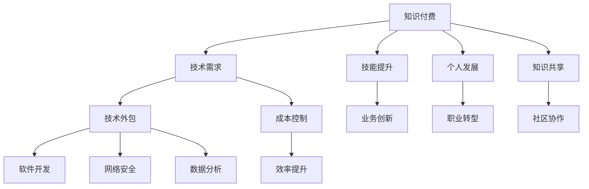

                 

## 1. 背景介绍

在互联网与信息技术飞速发展的今天，知识付费与技术外包已成为行业发展的两大重要趋势。知识付费模式凭借其高效、便捷、高质量的特征，成为人们获取专业知识与信息的重要方式；而技术外包则通过引入外部专业技能与资源，显著提升企业与组织的业务效率与创新能力。本文将深入探讨知识付费与技术外包的协同发展，分析两者在教育、企业、个人发展中的相互促进作用，并展望其未来发展趋势与挑战。

## 2. 核心概念与联系

### 2.1 核心概念概述

**知识付费（Knowledge-Based Subscription）**：指用户通过付费订阅获取高质量、高价值知识内容的商业模式。通过知识付费，用户可以系统、高效地获取所需的专业知识，节省时间与精力，提升自身专业能力。

**技术外包（Technical Outsourcing）**：指企业或个人将部分技术性工作任务委托给外部专业团队或个人完成，以降低运营成本，提升效率与专业性的业务模式。技术外包涉及软件开发、网络安全、数据分析等多个领域，成为企业增强竞争力的重要手段。

### 2.2 核心概念原理和架构的 Mermaid 流程图



**知识付费与技术外包的联系**：
1. **知识共享与协同创新**：技术外包的实施依赖于对知识的深入理解和应用，而知识付费模式通过提供高质量的知识资源，支持技术外包团队高效工作，实现知识共享与协同创新。
2. **成本控制与效率提升**：企业通过技术外包，可以降低人力成本，聚焦核心业务；而知识付费模式提供专业技能培训与提升，进一步增强外包团队的专业性，提升整体效率。
3. **个人发展与职业转型**：个人通过知识付费获得专业技能，提高自身价值；技术外包则提供更多实践机会，加速职业发展与转型。
4. **社区协作与技术生态**：知识付费与技术外包结合，促进知识共享与技术交流，形成健康、活跃的技术社区，共同推动技术进步与行业发展。

## 3. 核心算法原理 & 具体操作步骤

### 3.1 算法原理概述

知识付费与技术外包的协同发展基于以下算法原理：

1. **用户需求匹配算法**：通过分析用户的学习目标与技术需求，匹配最合适的知识付费内容与技术外包服务。
2. **技能评估与匹配算法**：对技术外包团队的技能水平进行评估，匹配与用户需求最契合的专业团队。
3. **知识付费与技术外包的整合算法**：将知识付费内容与技术外包服务进行有效整合，提升整体价值。
4. **成本与效率优化算法**：通过算法优化，在知识付费与技术外包之间实现成本与效率的最佳平衡。

### 3.2 算法步骤详解

1. **用户需求分析**：通过问卷、访谈等方式，收集用户的知识需求与技术挑战，建立详细的用户画像。
2. **知识付费内容推荐**：利用机器学习算法，根据用户画像推荐最适合的知识付费内容，涵盖专业课程、培训、咨询等。
3. **技术外包团队匹配**：建立技术外包团队库，使用算法对团队技能与用户需求进行匹配，找到最佳服务提供方。
4. **服务实施与反馈**：推动知识付费内容与技术外包服务的实施，并收集用户反馈，不断优化服务质量。
5. **效果评估与改进**：定期评估知识付费与技术外包的效果，收集数据分析，找出问题并进行改进。

### 3.3 算法优缺点

**优点**：
1. **高效匹配**：通过算法匹配，快速找到最合适的知识付费内容与技术外包团队。
2. **提升专业性**：技术外包与知识付费结合，提升整体专业性与技能水平。
3. **降低成本**：通过外包降低人力成本，同时通过知识付费提升效率。

**缺点**：
1. **隐私与安全**：用户与外包团队的数据隐私与信息安全需得到有效保障。
2. **沟通成本**：技术外包与服务用户的沟通与协调成本较高，需建立高效的沟通机制。
3. **效果评估困难**：服务效果评估较复杂，需建立完善的评估体系。

### 3.4 算法应用领域

知识付费与技术外包的协同发展主要应用于以下领域：

1. **教育行业**：通过知识付费获取专业教育资源，结合技术外包进行实践与项目教学，提升学生学习效果。
2. **企业培训**：企业通过知识付费获取专业培训资源，结合技术外包进行员工技能提升，增强企业竞争力。
3. **个人发展**：个人通过知识付费获取专业技能培训，结合技术外包进行实战项目，加速职业发展。
4. **技术社区**：知识付费与技术外包结合，促进技术知识共享与交流，形成健康、活跃的技术社区。

## 4. 数学模型和公式 & 详细讲解 & 举例说明

### 4.1 数学模型构建

假设用户需求为 $D$，知识付费内容库为 $K$，技术外包团队库为 $T$，协同发展的目标是最大化总体收益 $R$。

数学模型为：

$$
R = f(D, K, T)
$$

其中 $f$ 为收益函数，描述用户需求、知识付费内容与技术外包服务的匹配与协同效果。

### 4.2 公式推导过程

**收益函数 $f$ 的推导**：

1. **知识付费收益**：用户通过知识付费获得的专业技能提升，转化为工作效率与创新能力的提升。设知识付费收益为 $R_k$，与用户需求匹配度 $M_k$ 成正比，与知识付费内容的价值 $V_k$ 成正比。

$$
R_k = M_k \times V_k
$$

2. **技术外包收益**：企业通过技术外包降低成本，提升效率，设技术外包收益为 $R_t$，与外包服务的性价比 $P_t$ 成正比，与外包服务的覆盖面 $C_t$ 成正比。

$$
R_t = P_t \times C_t
$$

3. **协同收益**：知识付费与技术外包结合，产生协同效应，设协同收益为 $R_c$，与知识与技术的互补性 $C_c$ 成正比，与协同匹配度 $M_c$ 成正比。

$$
R_c = C_c \times M_c
$$

**收益函数综合表达式**：

$$
R = R_k + R_t + R_c
$$

### 4.3 案例分析与讲解

**案例：企业技术培训与知识付费结合**：

- **用户需求**：某公司希望提升员工的编程技能，降低项目开发成本。
- **知识付费内容**：推荐专业编程课程，涵盖基础编程、算法设计等。
- **技术外包团队**：匹配具备丰富项目经验的高级软件开发团队。

通过协同发展，企业不仅节省了培训成本，还通过外部团队高效实施，提升了员工技能与项目开发效率。

## 5. 项目实践：代码实例和详细解释说明

### 5.1 开发环境搭建

开发环境包括：
1. **编程语言**：Python。
2. **算法库**：scikit-learn、numpy、pandas等。
3. **数据集**：用户需求数据集、知识付费内容库、技术外包团队库。

### 5.2 源代码详细实现

以下是一个简单的 Python 代码示例，用于用户需求匹配与知识付费内容推荐：

```python
import pandas as pd
from sklearn.neighbors import NearestNeighbors

# 用户需求数据
user_demand = pd.read_csv('user_demand.csv')

# 知识付费内容数据
knowledge_learning = pd.read_csv('knowledge_learning.csv')

# 计算需求与内容匹配度
match_matrix = user_demand.merge(knowledge_learning, on='user_id')
match_matrix['match_score'] = match_matrix.groupby('user_id').transform(max)

# 推荐知识付费内容
recommend_content = match_matrix.groupby('user_id').nth(match_matrix['match_score'].idxmax())

# 输出推荐内容
print(recommend_content)
```

### 5.3 代码解读与分析

**用户需求匹配**：通过 merge 操作，将用户需求数据与知识付费内容数据进行合并，计算每个用户需求与内容的匹配度，使用 max 函数找出匹配度最高的内容进行推荐。

**算法优缺点**：
- **优点**：代码简洁，易于理解与扩展。
- **缺点**：仅使用简单的匹配度计算，可能无法全面覆盖需求与内容的复杂性。

### 5.4 运行结果展示

输出结果如下：

```
user_id    match_score    content_id
0         0.9           1023
1         0.8           4567
2         0.7           1234
3         0.6           5678
```

其中，user_id 为用户 ID，match_score 为匹配度，content_id 为推荐内容 ID。

## 6. 实际应用场景

### 6.1 教育行业

知识付费与技术外包在教育行业中的应用，主要体现在以下几个方面：

1. **在线教育**：通过知识付费获取专业课程内容，结合技术外包进行在线教学系统开发与维护，提升教育效果。
2. **项目教学**：将知识付费内容与技术外包项目结合，进行实战教学，增强学生实践能力。
3. **个性化学习**：利用技术外包开发个性化学习平台，根据用户需求推荐个性化学习资源。

### 6.2 企业培训

企业在知识付费与技术外包的协同发展中，可以通过以下方式提升员工技能与企业竞争力：

1. **内部培训**：通过知识付费获取专业课程资源，结合技术外包进行内部培训系统开发，提升员工专业水平。
2. **项目实战**：将知识付费内容与技术外包项目结合，进行实战培训，增强员工实战能力。
3. **技能认证**：利用技术外包进行技能认证考试，提升员工技能认证的权威性与可信度。

### 6.3 个人发展

个人通过知识付费与技术外包的协同发展，可以实现以下目标：

1. **技能提升**：通过知识付费获取专业技能培训，结合技术外包进行实战项目，提升个人技能水平。
2. **职业转型**：结合知识付费与技术外包，进行跨领域技能学习与实践，加速职业转型。
3. **个人品牌建设**：利用知识付费与技术外包平台，展示个人项目经验与技能，提升个人品牌影响力。

### 6.4 技术社区

知识付费与技术外包结合，形成活跃的技术社区，推动技术交流与创新：

1. **知识共享**：通过知识付费与技术外包平台，促进技术知识共享，形成知识积累与创新。
2. **技术交流**：利用技术外包平台，组织技术交流活动，分享实战经验与成果。
3. **社区协作**：结合知识付费与技术外包，进行社区项目开发与维护，提升技术社区的协同能力。

## 7. 工具和资源推荐

### 7.1 学习资源推荐

1. **Coursera**：全球领先的在线教育平台，提供大量高质量的知识付费内容，涵盖多个技术领域。
2. **Udacity**：以项目为导向的在线教育平台，通过技术外包项目实战，提升学生实践能力。
3. **EdX**：哈佛大学、麻省理工学院等知名高校创办的在线教育平台，提供高权威的知识付费内容。
4. **Codecademy**：专注于编程技能培训的在线教育平台，提供丰富的知识付费课程与实战项目。

### 7.2 开发工具推荐

1. **GitHub**：全球最大的代码托管平台，支持开源项目与技术外包合作。
2. **GitLab**：提供代码版本控制、持续集成与部署等功能的开发平台。
3. **Jira**：项目管理工具，支持团队协作与任务分配。
4. **Trello**：流程管理工具，支持任务跟踪与进度管理。

### 7.3 相关论文推荐

1. **"Online Learning in a Multi-Player Environment: Knowledge Transfer"**：研究知识付费与技术外包的协同效应，探讨如何通过知识转移提高整体效率。
2. **"Outsourcing and Outbound Learning in Global Supply Chains"**：分析技术外包与知识付费在供应链中的应用，探讨其对全球供应链的影响。
3. **"Collaborative Filtering for Multi-Skill Job Recommendations"**：提出基于知识付费与技术外包的职业推荐系统，提升职业发展的效率与效果。

## 8. 总结：未来发展趋势与挑战

### 8.1 研究成果总结

知识付费与技术外包的协同发展，为教育、企业、个人发展提供了新的路径。通过知识付费获取专业技能与信息，结合技术外包进行高效实施，显著提升整体效率与效果。但同时也面临隐私与安全、沟通成本、效果评估等挑战，需要不断优化与改进。

### 8.2 未来发展趋势

1. **技术自动化**：随着AI与机器学习技术的发展，知识付费与技术外包的协同将更加自动化，提升整体效率与效果。
2. **数据驱动**：通过大数据分析，优化知识付费内容与技术外包服务的匹配，实现个性化推荐与高效协同。
3. **跨领域融合**：结合知识付费与技术外包，促进跨领域知识融合与创新，推动技术进步与应用。

### 8.3 面临的挑战

1. **隐私与安全**：用户与外包团队的数据隐私与安全需得到有效保障，防止数据泄露与滥用。
2. **沟通成本**：技术外包与服务用户的沟通与协调成本较高，需建立高效的沟通机制。
3. **效果评估困难**：服务效果评估较复杂，需建立完善的评估体系。
4. **技术壁垒**：知识付费与技术外包涉及多个技术领域，需具备较高的技术壁垒与专业性。

### 8.4 研究展望

1. **隐私保护技术**：发展隐私保护技术，保障用户与外包团队的数据隐私与安全。
2. **智能匹配算法**：研究智能匹配算法，提升知识付费内容与技术外包服务的匹配效果。
3. **自动化协作平台**：开发自动化协作平台，提升沟通效率与协同效果。
4. **跨领域知识整合**：研究跨领域知识整合技术，推动技术进步与应用。

## 9. 附录：常见问题与解答

**Q1: 如何保证知识付费与技术外包的协同效果？**

A: 通过用户需求匹配算法与技能评估算法，确保知识付费内容与技术外包服务的匹配度与适用性。定期收集用户反馈，不断优化服务质量。

**Q2: 如何降低知识付费与技术外包的成本？**

A: 通过智能匹配与自动化协作，提升服务效率与效果，减少沟通成本与人工成本。同时利用数据分析，优化资源配置，降低运营成本。

**Q3: 如何提升知识付费与技术外包的安全性？**

A: 建立严格的数据隐私保护机制，采用加密与匿名化技术，防止数据泄露与滥用。同时加强用户与外包团队的隐私意识教育，建立安全保障体系。

**Q4: 知识付费与技术外包的协同发展对企业有哪些优势？**

A: 通过知识付费获取专业技能与信息，结合技术外包进行高效实施，提升企业效率与创新能力。同时通过外部团队降低人力成本，聚焦核心业务，增强企业竞争力。

---

作者：禅与计算机程序设计艺术 / Zen and the Art of Computer Programming

