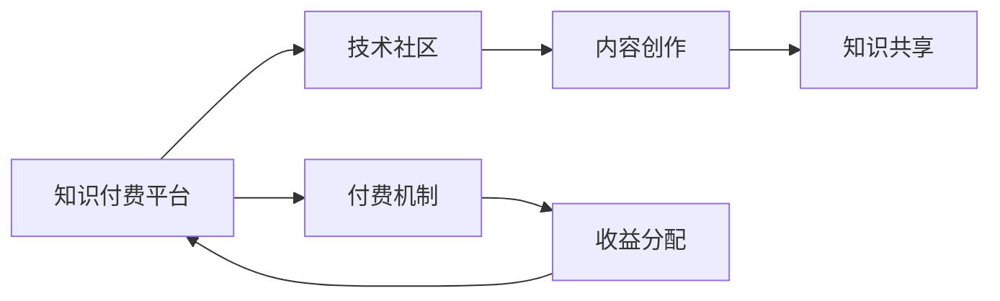

                 

# 知识付费与技术社区建设的良性互动

在数字化时代，知识付费和社区建设作为互联网行业的两大热门领域，都承载着推动知识共享、促进技能提升的使命。本文将深入探讨知识付费与技术社区建设之间的良性互动机制，从原理、操作实践到未来发展趋势等方面，对这一议题进行全面分析。

## 1. 背景介绍

### 1.1 问题由来

知识付费的兴起，源自于人们对信息过载的困惑和对高质量知识的需求。随着互联网的发展，获取信息的渠道日益多样，但碎片化的信息也让人们陷入了知识的海啸中。此时，知识付费的出现，为大众提供了一种高效、有保障的知识获取方式。

与此同时，技术社区的兴起，则是互联网时代技术交流与合作的重要形式。技术社区不仅为技术爱好者提供了一个交流平台，也为企业的技术团队提供了一个协作创新的空间。知识付费与技术社区之间的融合，成为了一个探索的新方向。

### 1.2 问题核心关键点

知识付费与技术社区建设的良性互动，关键在于如何通过付费模式激发高质量内容创作，并在技术社区中构建有价值的知识分享机制。具体体现在以下几个方面：

- **内容质量保障**：如何保证付费内容的质量与专业性，使其真正有价值？
- **社区生态建设**：如何通过付费机制激励社区成员参与，提升社区活力？
- **知识共享与收益**：知识创作者如何从中获得合理回报，同时保证知识传播的公益性？
- **技术交流与创新**：如何通过技术社区促进技术创新，推动行业发展？

## 2. 核心概念与联系

### 2.1 核心概念概述

为更好地理解知识付费与技术社区建设之间的良性互动，本文将介绍几个关键概念：

- **知识付费**：通过付费获取高质量、专业性内容的服务模式。用户通过支付费用，获取深度、系统化的知识体系。
- **技术社区**：以技术交流、知识共享为核心目的的在线平台，旨在促进技术人员的互动与合作。
- **良性互动**：指知识付费平台与技术社区之间，通过合理的机制设计，实现内容创作与知识传播的良性循环。

### 2.2 核心概念原理和架构的 Mermaid 流程图



该图展示了知识付费平台与技术社区之间的良性互动机制。平台通过收费提供高质量内容，而社区则提供交流与共享的环境。创作者在社区中分享知识，获得收益，进而激励更多高质量内容创作，形成良性循环。

## 3. 核心算法原理 & 具体操作步骤

### 3.1 算法原理概述

知识付费与技术社区的良性互动，可以视作一种双向激励机制。知识付费平台通过付费激励创作者提供高质量内容，而技术社区则通过知识共享和互动，激发社区成员的积极性，形成正向反馈。

具体来说，该机制可以分解为以下几个步骤：

1. **内容创作激励**：通过付费机制，吸引并激励创作者提供高质量内容。
2. **内容评估与分发**：平台根据内容质量进行评估，通过算法推荐系统分发至相关用户。
3. **社区互动与反馈**：社区成员在阅读内容后，可以通过评论、点赞等方式参与互动，提供反馈。
4. **创作者收益与再激励**：根据社区反馈和阅读量等指标，分配收益给创作者，并激励其继续创作高质量内容。

### 3.2 算法步骤详解

以下是知识付费与技术社区良性互动的具体操作步骤：

**Step 1: 内容创作激励**

- **内容付费机制设计**：采用订阅制、单次购买、按需获取等多种付费模式，满足不同用户需求。
- **创作者激励策略**：提供流量推荐、金钱奖励、平台认证等多种激励方式，鼓励创作者提供有价值的内容。
- **质量审核机制**：建立专业审核团队，对内容进行严格审核，确保内容的专业性和权威性。

**Step 2: 内容评估与分发**

- **内容质量评估模型**：使用机器学习算法对内容质量进行评估，如文本情感分析、专业度判断等。
- **智能推荐系统**：根据用户兴趣和行为数据，推荐相关内容，提升用户体验。
- **实时互动与反馈**：通过智能聊天机器人、自动回复系统等，增强用户与内容创作者之间的互动。

**Step 3: 社区互动与反馈**

- **社区交流平台**：建立论坛、评论区等互动平台，促进用户之间的交流与讨论。
- **知识共享机制**：支持开源项目、知识库共享，提升社区成员的知识水平。
- **用户评价与反馈**：鼓励用户对内容进行评价与反馈，提供真实的用户需求和建议。

**Step 4: 创作者收益与再激励**

- **收益分配模型**：根据阅读量、点赞数、分享次数等指标，计算内容价值，分配收益给创作者。
- **创作者再激励**：将收益与社区互动数据关联，进一步激励创作者提供优质内容。
- **持续优化机制**：根据反馈数据，不断优化内容创作与收益分配机制，提升整体效果。

### 3.3 算法优缺点

知识付费与技术社区建设的良性互动，具有以下优点：

- **内容质量保障**：通过付费机制和质量审核，确保内容的专业性和权威性。
- **社区活力提升**：通过互动与共享，增强社区成员的参与感和归属感。
- **创作者激励机制**：通过合理收益分配，激发创作者持续创作高质量内容的动力。

同时，也存在一些局限性：

- **付费门槛较高**：对于部分用户而言，付费门槛较高，可能限制其访问优质内容。
- **内容同质化风险**：过分依赖算法推荐，可能导致内容同质化，降低多样性。
- **社区治理挑战**：如何平衡知识共享与知识产权保护，需要复杂的治理机制。

### 3.4 算法应用领域

知识付费与技术社区的良性互动，主要应用于以下几个领域：

- **专业培训与认证**：如编程、设计、市场营销等专业培训课程，通过付费获得系统化的知识体系。
- **技术交流与合作**：如开发者社区、技术论坛等，促进技术人员的交流与合作，推动技术创新。
- **企业内部知识管理**：如企业内部知识库、技术文档等，通过付费机制，保障内容的专业性和准确性。
- **开源项目与知识共享**：如GitHub、Stack Overflow等平台，促进开源项目的协作与知识共享。

## 4. 数学模型和公式 & 详细讲解

### 4.1 数学模型构建

知识付费与技术社区的良性互动，可以建模为一个收益-投入-反馈的动态系统。设 $C$ 为内容创作者集合，$U$ 为用户集合，$V$ 为社区互动价值，$P$ 为内容付费价格，$Q$ 为内容质量，$R$ 为收益分配系数。则系统动态方程可以表示为：

$$
V = f(C, Q, U, P)
$$

其中 $f$ 为社区互动价值函数，$C$ 和 $Q$ 通过创作者激励和质量审核机制决定，$U$ 和 $P$ 通过用户付费行为决定。

### 4.2 公式推导过程

考虑最简单的线性收益模型，设 $R_i$ 为内容创作者 $i$ 的收益，$n_i$ 为其内容被阅读的次数，$\alpha$ 和 $\beta$ 为收益系数。则收益分配模型可以表示为：

$$
R_i = \alpha n_i + \beta Q_i
$$

其中 $Q_i$ 为创作者 $i$ 提供内容的平均质量评分。

假设用户以概率 $p$ 选择付费内容，则阅读量 $n_i$ 为：

$$
n_i = (1-p)n_i + p\frac{R_i}{P}
$$

将收益分配模型代入上式，可得：

$$
n_i = \frac{(1-p)\alpha n_i + \beta p Q_i}{P}
$$

### 4.3 案例分析与讲解

以编程技术社区为例，分析良性互动机制的实现。假设社区中有 $C=100$ 名开发者，每名开发者提供高质量内容 $Q_i=4$。平台设定每篇内容的付费价格 $P=5$，用户以概率 $p=0.1$ 选择付费阅读。根据上述公式，可计算出每位开发者的平均收益 $R_i$ 和阅读量 $n_i$。

## 5. 项目实践：代码实例和详细解释说明

### 5.1 开发环境搭建

在进行项目实践前，我们需要准备好开发环境。以下是使用Python进行Flask开发的环境配置流程：

1. 安装Anaconda：从官网下载并安装Anaconda，用于创建独立的Python环境。
2. 创建并激活虚拟环境：
```bash
conda create -n flask-env python=3.8 
conda activate flask-env
```

3. 安装Flask：
```bash
pip install flask
```

4. 安装其他工具包：
```bash
pip install numpy pandas scikit-learn matplotlib Flask
```

完成上述步骤后，即可在`flask-env`环境中开始项目实践。

### 5.2 源代码详细实现

以下是使用Flask开发一个简单知识付费平台的代码实现，包括用户注册、内容上传、内容审核、付费购买等功能：

```python
from flask import Flask, request, render_template, redirect
from flask_sqlalchemy import SQLAlchemy
import pandas as pd
import numpy as np
from sklearn.feature_extraction.text import TfidfVectorizer

app = Flask(__name__)
app.config['SQLALCHEMY_DATABASE_URI'] = 'sqlite:///users.db'

# 数据库模型
class User(db.Model):
    id = db.Column(db.Integer, primary_key=True)
    username = db.Column(db.String(50))
    email = db.Column(db.String(120), unique=True)
    password = db.Column(db.String(120))
    balance = db.Column(db.Float)

class Content(db.Model):
    id = db.Column(db.Integer, primary_key=True)
    title = db.Column(db.String(200))
    content = db.Column(db.Text)
    quality_score = db.Column(db.Float)
    author_id = db.Column(db.Integer, db.ForeignKey('user.id'))
    price = db.Column(db.Float)
    views = db.Column(db.Integer, default=0)

# 用户注册与登录
@app.route('/register', methods=['GET', 'POST'])
def register():
    if request.method == 'POST':
        username = request.form['username']
        email = request.form['email']
        password = request.form['password']
        user = User(username=username, email=email, password=password, balance=0.0)
        db.session.add(user)
        db.session.commit()
        return redirect('/')
    return render_template('register.html')

@app.route('/login', methods=['GET', 'POST'])
def login():
    if request.method == 'POST':
        email = request.form['email']
        password = request.form['password']
        user = User.query.filter_by(email=email, password=password).first()
        if user:
            session['logged_in'] = True
            return redirect('/')
    return render_template('login.html')

# 内容上传与审核
@app.route('/upload', methods=['GET', 'POST'])
def upload():
    if request.method == 'POST':
        title = request.form['title']
        content = request.form['content']
        price = request.form['price']
        author = session['logged_in']
        content_obj = Content(title=title, content=content, quality_score=3.0, author_id=author, price=price)
        db.session.add(content_obj)
        db.session.commit()
        return redirect('/')
    return render_template('upload.html')

# 内容展示与付费
@app.route('/')
def index():
    contents = Content.query.all()
    return render_template('index.html', contents=contents)

# 内容阅读与付费购买
@app.route('/content/<int:id>')
def content(id):
    content = Content.query.get(id)
    if not content:
        return redirect('/')
    if request.cookies.get('balance') and float(request.cookies.get('balance')) < content.price:
        return render_template('purchase.html', content=content, price=content.price)
    else:
        session['balance'] = session['balance'] - content.price
        db.session.commit()
        return render_template('content.html', content=content)

if __name__ == '__main__':
    app.run(debug=True)
```

### 5.3 代码解读与分析

以下是代码关键部分的解读：

**Flask框架**：
- `Flask`：轻量级Web框架，适合快速开发。
- `Flask-SQLAlchemy`：用于数据库操作的扩展库。

**用户模型**：
- `User`类：表示用户，包含用户名、邮箱、密码、余额等属性。

**内容模型**：
- `Content`类：表示内容，包含标题、内容、质量评分、作者、价格、阅读量等属性。

**路由处理**：
- `/register`：用户注册页面。
- `/login`：用户登录页面。
- `/upload`：内容上传页面。
- `/content/<id>`：内容展示与付费页面。

**模板渲染**：
- `index.html`：内容展示页面。
- `register.html`：用户注册页面。
- `login.html`：用户登录页面。
- `upload.html`：内容上传页面。
- `purchase.html`：购买内容页面。
- `content.html`：内容展示页面。

### 5.4 运行结果展示

运行上述代码，即可在浏览器中访问知识付费平台。用户可以通过注册、登录、上传内容、阅读内容等功能，体验知识付费与技术社区建设带来的便利。

## 6. 实际应用场景

### 6.1 智能教育平台

知识付费与技术社区建设，在智能教育领域有广泛的应用。传统的教育资源往往分散、碎片化，难以整合。通过知识付费与社区建设的结合，可以为学习者提供系统化的、高质量的学习内容。

例如，可以开发一个在线编程学习平台，邀请编程专家提供课程内容，通过付费机制激励其持续更新和改进课程。同时，建立一个技术社区，让学生和专家交流互动，共同解决学习中遇到的问题。这种平台不仅能够提供系统化的知识，还能促进师生之间的互动，提升学习效果。

### 6.2 开源软件社区

开源软件社区是技术社区建设的典型代表。通过知识付费，开源社区可以为开发者提供高质量的开发文档、框架、库等资源。开发者可以付费购买，获取高价值的工具和知识。

例如，可以建立一个基于GitHub的知识付费社区，邀请开源项目的管理者提供高质量的文档、API说明等。开发者可以付费获取这些资源，加速开发进程。同时，社区中还可以建立技术交流平台，促进开发者之间的合作与分享，提升社区的整体活力。

### 6.3 医疗健康平台

医疗健康领域的技术社区建设，也可以借鉴知识付费的模式。通过付费获取高质量的医疗知识，提升医疗服务的水平和效率。

例如，可以开发一个在线医疗健康平台，邀请医生提供高质量的诊疗指南、病例分析、健康管理等知识。患者可以通过付费购买，获取系统化的健康知识。同时，平台还可以建立技术社区，促进医生之间的交流与合作，提升医疗服务的质量。

## 7. 工具和资源推荐

### 7.1 学习资源推荐

为帮助开发者系统掌握知识付费与技术社区建设的原理和实践，这里推荐一些优质的学习资源：

1. **《知识付费与社区建设》系列博文**：由知识付费领域专家撰写，深入浅出地介绍了知识付费与社区建设的原理、模式和最佳实践。
2. **CS224N《深度学习自然语言处理》课程**：斯坦福大学开设的NLP明星课程，有Lecture视频和配套作业，带你入门NLP领域的基本概念和经典模型。
3. **《知识付费与社区建设的理论与实践》书籍**：全面介绍了知识付费与社区建设的基本原理、成功案例和前沿技术。
4. **HuggingFace官方文档**：Flask框架的官方文档，提供了丰富的学习资源和样例代码，是Flask开发的基础。
5. **Flask官方文档**：Flask框架的官方文档，提供了详细的API参考和开发指南。

通过对这些资源的学习实践，相信你一定能够系统掌握知识付费与技术社区建设的精髓，并用于解决实际问题。

### 7.2 开发工具推荐

高效的开发离不开优秀的工具支持。以下是几款用于知识付费与技术社区建设开发的常用工具：

1. **Flask**：轻量级Web框架，灵活的路由设计，适合快速开发。
2. **SQLAlchemy**：用于数据库操作的扩展库，支持多种数据库系统。
3. **Jupyter Notebook**：交互式的编程环境，适合数据探索和模型验证。
4. **GitHub**：代码版本控制和协作平台，适合开源项目管理和版本控制。
5. **TensorBoard**：模型训练的可视化工具，实时监测模型训练状态，提供丰富的图表呈现方式。
6. **TensorFlow**：基于深度学习的开源框架，适合大规模模型训练和部署。

合理利用这些工具，可以显著提升知识付费与技术社区建设的开发效率，加速创新迭代的步伐。

### 7.3 相关论文推荐

知识付费与技术社区建设的研究源自学界的持续探索。以下是几篇奠基性的相关论文，推荐阅读：

1. **《知识付费与技术社区建设：原理与实践》**：深入探讨了知识付费与技术社区建设的基本原理和实践机制。
2. **《深度学习在知识付费与社区建设中的应用》**：探讨了深度学习技术在知识付费与社区建设中的应用，包括推荐系统、内容审核等。
3. **《智能教育与知识付费：协同创新》**：分析了智能教育与知识付费的结合模式，提出了协同创新的思路。
4. **《开源社区的商业化探索》**：研究了开源社区的商业化模式，探讨了通过知识付费激励社区发展的策略。
5. **《医疗健康与知识付费：融合创新》**：分析了医疗健康领域与知识付费的融合模式，提出了提升医疗服务质量的新思路。

这些论文代表了大数据、人工智能与知识付费、社区建设技术的研究方向，对于技术开发者和应用实践者具有重要参考价值。

## 8. 总结：未来发展趋势与挑战

### 8.1 总结

本文对知识付费与技术社区建设的良性互动机制进行了全面系统的介绍。首先阐述了知识付费与技术社区建设的背景和意义，明确了两者在信息传播和技能提升方面的作用。其次，从原理到实践，详细讲解了知识付费与技术社区建设的动态模型和具体步骤，给出了代码实例和运行结果展示。同时，本文还广泛探讨了知识付费与技术社区建设在多个领域的应用前景，展示了其潜在的价值和应用场景。

通过本文的系统梳理，可以看到，知识付费与技术社区建设的良性互动机制，为知识共享和技能提升提供了新的路径。这种机制不仅能够保证内容的质量和专业性，还能够激发社区成员的参与感和创新力，推动技术与知识的协同发展。未来，随着知识付费和社区建设的不断演进，这种良性互动机制将更加成熟，为人工智能技术的普及和应用提供坚实的保障。

### 8.2 未来发展趋势

展望未来，知识付费与技术社区建设的良性互动将呈现以下几个发展趋势：

1. **内容质量提升**：随着知识付费与社区建设的不断完善，内容质量将进一步提升，更加系统化、专业化和实用化。
2. **社区生态优化**：通过更加灵活的激励机制和互动平台，社区生态将更加活跃，用户参与感增强。
3. **智能化程度提升**：借助人工智能技术，内容推荐、质量评估等环节将更加智能化，提升用户体验。
4. **跨领域应用拓展**：知识付费与技术社区建设的结合模式将拓展到更多领域，如智能教育、医疗健康、开源软件等。
5. **国际化推广**：随着全球化进程的加快，知识付费与技术社区建设将拓展到全球市场，为全球用户提供高质量的知识服务。

### 8.3 面临的挑战

尽管知识付费与技术社区建设的良性互动机制已经取得了显著进展，但在实际应用中，仍面临以下挑战：

1. **用户门槛较高**：部分用户可能对付费内容存在抵触心理，影响用户规模和社区活跃度。
2. **内容同质化风险**：过分依赖算法推荐，可能导致内容同质化，降低多样性。
3. **社区治理复杂**：如何平衡知识共享与知识产权保护，需要复杂的治理机制。
4. **数据隐私问题**：用户数据隐私保护需要更加严格的法律法规和技术手段。
5. **平台竞争激烈**：知识付费与技术社区建设领域竞争激烈，如何脱颖而出，需要不断创新。

### 8.4 研究展望

面对知识付费与技术社区建设所面临的挑战，未来的研究需要在以下几个方面寻求新的突破：

1. **用户友好性优化**：通过更加人性化的界面设计和交互方式，降低用户的使用门槛，提升用户体验。
2. **内容多样性保障**：引入更多元的内容来源，丰富内容形式，提升内容多样性。
3. **社区治理机制设计**：建立公平透明的治理机制，平衡知识共享与知识产权保护。
4. **数据隐私保护技术**：开发隐私保护技术，保障用户数据的安全和隐私。
5. **平台差异化策略**：通过独特的商业模式和创新技术，提升平台的竞争力。

总之，知识付费与技术社区建设的良性互动机制，为知识共享和技能提升提供了新的途径。通过不断优化机制设计，克服现存挑战，知识付费与技术社区建设必将在未来的发展中取得更大的成功。

## 9. 附录：常见问题与解答

**Q1：知识付费与技术社区建设的区别是什么？**

A: 知识付费主要指通过付费获取高质量内容的服务模式，强调内容的专业性和权威性。而技术社区则是一个以技术交流、知识共享为核心目的的在线平台，强调成员之间的互动与合作。两者的共同点在于都注重高质量知识内容的传播。

**Q2：如何确保知识付费平台的内容质量？**

A: 知识付费平台需要通过多种机制确保内容质量，如专业审核团队、用户评价系统、收益分配模型等。确保内容的专业性和权威性，才能获得用户信任。

**Q3：知识付费与技术社区建设的互动机制中，如何激励社区成员？**

A: 通过多样化的激励机制，如流量推荐、金钱奖励、平台认证等，激励社区成员提供高质量内容，促进知识共享。同时，通过社区互动平台，增强成员之间的交流与合作，提升社区活力。

**Q4：知识付费与技术社区建设在实际应用中面临哪些挑战？**

A: 知识付费与技术社区建设面临的主要挑战包括用户门槛较高、内容同质化风险、社区治理复杂、数据隐私问题、平台竞争激烈等。需要综合考虑这些因素，进行系统的优化和改进。

**Q5：如何实现知识付费与技术社区建设的良性互动？**

A: 实现良性互动的关键在于合理的机制设计，如付费机制、内容评估与分发、社区互动与反馈、创作者收益与再激励等。通过这些机制的协同运作，实现知识付费与技术社区建设的高效互动。

---

作者：禅与计算机程序设计艺术 / Zen and the Art of Computer Programming

