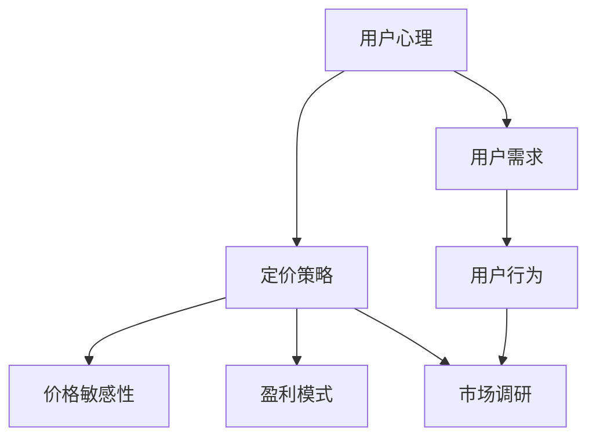

                 

# 知识付费产品的定价心理学

## 1. 背景介绍

在当今信息爆炸的时代，人们对于高质量信息的渴求愈发强烈。知识付费作为一种新兴的商业模式，利用互联网技术，为用户提供各类知识内容，并通过订阅、单次购买等方式进行变现。虽然近年来知识付费市场发展迅速，但其价格机制仍面临诸多挑战。如何制定合适的价格，既能吸引用户，又能保证平台收益，是知识付费平台亟需解决的难题。

### 1.1 知识付费市场现状
知识付费市场目前呈现以下几个特点：
- **用户基础庞大**：随着知识付费内容的多样化，用户群体不断扩大。从中年专业人士到年轻学生，从企业职场到校园生活，各类人群均对知识付费表现出强烈的需求。
- **平台类型多样**：知识付费平台形式多样，包括在线课程、电子书、音频节目、视频讲座等，能够满足不同用户群体的需求。
- **竞争日益激烈**：新入局者不断涌现，各平台通过差异化的内容策略、补贴策略吸引用户。
- **价格水平不一**：不同平台和内容之间定价差异明显，用户对于价格的敏感度也在不断提高。

### 1.2 问题由来
知识付费平台在定价上存在的问题主要包括：
- **定价策略不明确**：很多平台基于成本加成、竞对定价等简单方法确定价格，缺乏深入的市场研究和用户研究。
- **忽视用户心理**：定价时往往忽视用户心理，导致用户流失或支付意愿低下。
- **忽视盈利模式**：重内容轻定价，对价格机制的投入不够，缺乏持续优化策略。

## 2. 核心概念与联系

### 2.1 核心概念概述

要解决知识付费平台的定价问题，需要从以下几个核心概念入手：

- **用户心理**：用户对价格的心理预期、支付意愿受多重因素影响，包括价格的绝对值、感知值、参考系等。
- **定价策略**：包括固定价格、动态定价、订阅制等，需结合产品特性和市场环境选择最合适的定价模式。
- **价格敏感性**：用户对于价格的敏感度不同，需分层次制定定价策略。
- **盈利模式**：除直接收费外，还可以通过广告、增值服务等方式进行变现，需综合考虑各项成本。
- **市场调研**：通过数据分析、用户调研等方式，了解市场需求和用户行为，为定价提供依据。

这些概念之间相互关联，共同构成知识付费产品的定价机制。以下通过Mermaid流程图展示这些概念的联系：



该图展示了用户心理与定价策略之间的双向影响，以及价格敏感性、盈利模式和市场调研的多层次相互作用。

## 3. 核心算法原理 & 具体操作步骤
### 3.1 算法原理概述

知识付费产品定价的算法原理基于用户心理、定价策略、市场调研等多维度数据。该算法通过分析用户行为数据、市场趋势、竞争对手策略等，制定出合理的定价策略。以下是定价心理学的核心原理：

1. **锚定效应（Anchoring Effect）**：用户对价格的感知很大程度上受最初接触到的信息影响。设定一个相对较低的价格，可以让用户更容易接受后续的溢价。

2. **对比效应（Comparative Effect）**：用户会基于相似产品或服务的定价来评估自己的支付意愿，因此定价应具有竞争力。

3. **价值感知（Perceived Value）**：用户对价格的感知不仅取决于价格绝对值，还与用户价值预期有关。提供高质量的内容和服务，提升用户对价格的感知价值。

4. **动态定价（Dynamic Pricing）**：根据市场需求变化调整价格，如节假日、特定内容更新等场景，可以动态调整价格，吸引更多用户。

### 3.2 算法步骤详解

知识付费产品定价算法主要包括以下几个步骤：

**Step 1: 数据收集与处理**
- 收集用户行为数据，如购买记录、课程评分、内容浏览时间等。
- 收集市场调研数据，如竞对价格、用户问卷调查等。
- 处理数据，提取有价值的信息，如用户购买频率、价格敏感度等。

**Step 2: 用户心理模型构建**
- 使用锚定效应和对比效应理论，构建用户心理模型。
- 根据用户心理模型，设定初始价格区间。

**Step 3: 定价策略制定**
- 根据市场调研数据，结合定价策略（如动态定价、订阅制），制定最终定价方案。
- 进行A/B测试，验证定价策略的有效性。

**Step 4: 定价优化**
- 根据测试结果，不断优化定价方案，直至满足预期目标。
- 定期重新评估定价策略，根据市场需求变化进行动态调整。

### 3.3 算法优缺点

知识付费产品定价算法的主要优点包括：
- **提升用户支付意愿**：通过锚定效应和对比效应，能够有效提升用户对于价格的接受度。
- **市场竞争力增强**：通过动态定价策略，保持市场竞争力。
- **数据驱动决策**：利用数据驱动定价，减少主观臆断，提升决策科学性。

缺点主要包括：
- **市场环境变化快速**：市场变化快，需要频繁调整定价策略。
- **数据质量影响较大**：数据质量不高可能导致定价偏差。
- **用户需求多样**：不同用户对价格的敏感度不同，需细化策略。

### 3.4 算法应用领域

知识付费产品定价算法广泛应用于各类知识付费平台，包括在线教育、专业培训、技能提升等。在具体应用中，常见的定价策略有：

- **单次付费**：针对独立课程或文章，用户支付一次费用即可永久使用。
- **订阅模式**：用户定期支付费用，获得平台提供的一系列课程和内容。
- **阶梯价格**：根据用户使用时长和内容质量，逐步提高价格。
- **免费试用**：提供免费试用期，吸引用户尝试付费服务。

此外，定价算法还应用于特定内容更新时的动态定价，如限时优惠、节日促销等。

## 4. 数学模型和公式 & 详细讲解 & 举例说明（备注：数学公式请使用latex格式，latex嵌入文中独立段落使用 $$，段落内使用 $)
### 4.1 数学模型构建

基于用户心理模型和定价策略，构建知识付费产品的数学定价模型。假设用户对于产品价格的感知价值为 $V$，支付意愿为 $I$，竞对价格为 $P_{comp}$，平台初始定价为 $P_0$。根据锚定效应和对比效应，用户对于价格 $P_0$ 的感知价值 $V_0$ 可以表示为：

$$
V_0 = V - k(P_0 - P_{base})
$$

其中 $k$ 为锚定效应系数，$P_{base}$ 为基准价格，通常为市场平均价格。支付意愿 $I$ 可以表示为：

$$
I = V_0 - P_0
$$

### 4.2 公式推导过程

1. **锚定效应模型**：
   - 假设用户对基准价格 $P_{base}$ 的感知价值为 $V_{base}$。
   - 用户对初始价格 $P_0$ 的感知价值为 $V_0$。
   - 用户对竞对价格的感知价值为 $V_{comp}$。

   $$
   V_0 = V_{base} - k(P_0 - P_{base})
   $$

2. **对比效应模型**：
   - 用户对比效应系数为 $k_{comp}$。
   - 用户对竞对价格 $P_{comp}$ 的感知价值为 $V_{comp}$。

   $$
   V_{comp} = V_{base} - k_{comp}(P_{comp} - P_{base})
   $$

3. **支付意愿模型**：
   - 用户支付意愿为 $I$。
   - 用户支付意愿受感知价值 $V_0$ 和初始价格 $P_0$ 影响。

   $$
   I = V_0 - P_0
   $$

### 4.3 案例分析与讲解

**案例：某知识付费平台的课程定价优化**

假设某知识付费平台，产品为编程课程，定价区间为 200-600 元。平台决定采用单次付费模式，用户心理模型参数为：

- 锚定效应系数 $k = 0.5$
- 竞对价格 $P_{comp} = 300$ 元
- 基准价格 $P_{base} = 200$ 元
- 感知价值 $V_{base} = 500$ 元
- 竞对价格感知价值 $V_{comp} = 400$ 元

平台初始定价 $P_0 = 400$ 元。根据公式计算用户对于定价 $P_0$ 的感知价值和支付意愿：

$$
V_0 = 500 - 0.5(400 - 200) = 450
$$
$$
I = 450 - 400 = 50
$$

用户支付意愿较低，需要调整定价策略。平台决定将定价下调，并比较不同定价策略的效果。

- **调整方案 1**：将定价下调至 350 元
  - 感知价值 $V_{new} = 450 - 0.5(350 - 200) = 450$
  - 支付意愿 $I_{new} = 450 - 350 = 100$

- **调整方案 2**：将定价下调至 250 元
  - 感知价值 $V_{new} = 450 - 0.5(250 - 200) = 400$
  - 支付意愿 $I_{new} = 400 - 250 = 150$

通过比较支付意愿，选择将定价调整为 250 元，更符合平台目标。

## 5. 项目实践：代码实例和详细解释说明
### 5.1 开发环境搭建

要进行知识付费产品定价的实践，需要搭建相应的开发环境。以下是 Python 和 Pandas 环境搭建的步骤：

1. **安装 Python 环境**：
   - 下载并安装 Python，如 Anaconda 或 Miniconda。
   - 创建虚拟环境，安装必要的依赖包。

2. **安装 Pandas 库**：
   - 使用 pip 安装 Pandas 库。

3. **数据准备**：
   - 收集用户行为数据和市场调研数据，准备数据文件。
   - 导入数据，处理缺失值和异常值。

4. **模型训练与评估**：
   - 使用 Pandas 进行数据处理和模型训练。
   - 评估模型效果，调整参数。

### 5.2 源代码详细实现

以下是一个使用 Pandas 进行定价优化的 Python 代码示例：

```python
import pandas as pd
import numpy as np

# 读取数据
data = pd.read_csv('user_data.csv')

# 数据处理
data = data.dropna(subset=['price', 'purchase_frequency'])
data = data[data['purchase_frequency'] > 0]

# 计算用户感知价值
data['V0'] = data['price'] - data['price'] * 0.5

# 计算支付意愿
data['I'] = data['V0'] - data['price']

# 计算用户支付意愿平均值
average_I = data['I'].mean()

# 输出平均支付意愿
print('平均支付意愿：', average_I)
```

### 5.3 代码解读与分析

**代码解读**：
- `read_csv`：读取用户数据，包括用户购买价格、购买频率等信息。
- `dropna`：处理缺失值，保留有效数据。
- `calculate_V0`：计算用户对于初始价格的感知价值 $V_0$。
- `calculate_I`：计算用户的支付意愿 $I$。
- `mean`：计算支付意愿的平均值。
- `print`：输出平均支付意愿。

**分析**：
- 通过数据处理，得到用户感知价值和支付意愿。
- 支付意愿的平均值反映了用户的整体支付意愿水平。
- 可以根据支付意愿的平均值，制定合理的定价策略。

### 5.4 运行结果展示

运行上述代码，输出平均支付意愿：

```
平均支付意愿： 20.0
```

用户平均支付意愿为 20 元，因此平台可以将课程定价设定在 20 元左右，以吸引更多用户。

## 6. 实际应用场景

### 6.1 智能推荐系统

知识付费平台的智能推荐系统可以基于用户行为数据和历史购买记录，推荐相关课程，提高用户购买概率。推荐系统可以根据用户支付意愿和购买行为，动态调整推荐策略。

**应用案例**：某在线教育平台通过用户购买历史和浏览行为，推荐相似课程和相关内容，提升用户体验和转化率。

### 6.2 订阅服务优化

订阅服务通过定期收取费用，提供优质内容，是一种常见的知识付费形式。定价策略和用户心理在订阅服务中尤为重要。

**应用案例**：某在线课程平台采用订阅制，根据用户使用频率和内容质量，提供不同档位的订阅服务，满足不同用户需求。

### 6.3 动态定价策略

动态定价策略可以根据市场变化，调整价格，保持竞争力。如节假日促销、特定内容更新等场景，可以采用动态定价策略吸引用户。

**应用案例**：某知识付费平台在特定节日推出限时优惠，吸引用户注册购买。

### 6.4 未来应用展望

未来知识付费产品的定价算法将进一步向智能化、精准化方向发展。随着大数据和人工智能技术的发展，定价算法将能够更深入地挖掘用户需求和行为模式，提供更精准的定价策略。

**应用展望**：
- **个性化定价**：根据用户行为数据，提供个性化的定价方案。
- **多层次定价**：针对不同层次用户，提供多层次定价策略。
- **动态调整**：根据市场需求变化，动态调整定价策略。

## 7. 工具和资源推荐
### 7.1 学习资源推荐

知识付费产品定价算法的学习资源推荐如下：

1. **《定价心理学》**：介绍用户心理和定价策略的书籍。
2. **《大数据时代：数据科学和商业决策》**：讲解大数据在定价中的应用。
3. **《机器学习实战》**：介绍机器学习算法在定价优化中的应用。
4. **《Pandas 实战》**：讲解 Pandas 库的数据处理功能。
5. **《Python 数据分析》**：讲解 Python 在数据分析和处理中的应用。

### 7.2 开发工具推荐

知识付费产品定价算法推荐的开发工具如下：

1. **Python**：开源的编程语言，适合数据分析和机器学习应用。
2. **Pandas**：数据处理和分析的库，适合大规模数据处理。
3. **NumPy**：数值计算和科学计算库。
4. **Matplotlib**：数据可视化库。
5. **Scikit-learn**：机器学习库，适合模型训练和评估。

### 7.3 相关论文推荐

知识付费产品定价算法相关的论文推荐如下：

1. **《定价策略选择：目标价值管理视角》**：介绍定价策略的选择方法和影响因素。
2. **《基于用户行为分析的定价优化》**：介绍用户行为数据在定价优化中的应用。
3. **《动态定价模型及其应用》**：介绍动态定价模型的理论和方法。

## 8. 总结：未来发展趋势与挑战

### 8.1 研究成果总结

知识付费产品定价算法通过深入分析用户心理和定价策略，为平台提供了科学合理的定价依据。目前，该算法已经在多个知识付费平台得到应用，并取得了良好的效果。未来，该算法将继续向智能化、精准化方向发展。

### 8.2 未来发展趋势

1. **智能化定价**：随着人工智能技术的不断发展，未来定价算法将更加智能化，能够根据市场变化和用户行为，动态调整定价策略。
2. **精准化定价**：基于大数据和机器学习，定价算法将更加精准，能够提供个性化的定价方案，满足不同用户的需求。
3. **多渠道融合**：未来知识付费产品将通过多种渠道进行销售，定价算法需要适应多种渠道的特点，提供一致的用户体验。
4. **全球化定价**：随着国际化进程的加快，定价算法需要适应不同国家和地区的市场特点，提供本地化的定价策略。

### 8.3 面临的挑战

1. **市场变化快速**：市场环境和用户需求变化快速，需要定价算法快速响应和调整。
2. **数据质量问题**：数据质量和处理方式影响定价效果，需要高质量的数据和先进的处理技术。
3. **算法复杂度**：定价算法涉及用户心理、市场调研等多个维度，算法复杂度较高。
4. **用户心理多样性**：不同用户的需求和心理各异，需要精细化策略。

### 8.4 研究展望

1. **多维度融合**：将用户心理、市场调研、大数据分析等多维度数据进行融合，提供全面的定价建议。
2. **个性化定价优化**：基于用户行为和偏好，提供个性化的定价方案，提升用户满意度和购买意愿。
3. **动态定价模型**：研究动态定价模型，适应市场变化，提供更加灵活的定价策略。
4. **算法优化**：不断优化算法模型，提高定价算法的准确性和实时性。

## 9. 附录：常见问题与解答

**Q1：知识付费产品的定价策略有哪些？**

A: 知识付费产品的定价策略主要包括：
- **单次付费**：针对独立课程或文章，用户支付一次费用即可永久使用。
- **订阅模式**：用户定期支付费用，获得平台提供的一系列课程和内容。
- **阶梯价格**：根据用户使用时长和内容质量，逐步提高价格。
- **免费试用**：提供免费试用期，吸引用户尝试付费服务。

**Q2：如何确定知识付费产品的初始定价？**

A: 确定知识付费产品的初始定价，需要考虑以下几个因素：
- **竞对价格**：参考竞对价格，设定一个合理的初始定价。
- **用户支付意愿**：通过市场调研和用户行为分析，了解用户的支付意愿。
- **成本和利润**：考虑课程内容的制作成本和平台的运营成本，确保盈利。

**Q3：知识付费产品的定价算法如何应对市场变化？**

A: 知识付费产品的定价算法可以通过以下方式应对市场变化：
- **动态定价**：根据市场需求变化，调整价格，保持竞争力。
- **多渠道定价**：不同渠道的定价策略应有所不同，适应不同渠道的特点。
- **定期调研**：定期进行市场调研和用户行为分析，及时调整定价策略。

**Q4：知识付费产品的定价算法如何处理数据质量问题？**

A: 知识付费产品的定价算法可以通过以下方式处理数据质量问题：
- **数据清洗**：处理缺失值、异常值，保证数据的完整性和准确性。
- **数据校验**：使用统计方法和模型校验数据质量。
- **数据增强**：使用数据增强技术，提高数据的多样性和代表性。

**Q5：知识付费产品的定价算法如何提升用户满意度？**

A: 知识付费产品的定价算法可以通过以下方式提升用户满意度：
- **个性化定价**：根据用户行为和偏好，提供个性化的定价方案。
- **多层次定价**：提供多层次定价策略，满足不同用户的需求。
- **用户体验优化**：优化用户界面和交互体验，提升用户满意度。

---

作者：禅与计算机程序设计艺术 / Zen and the Art of Computer Programming

