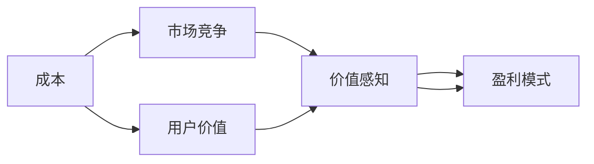

                 

## 1. 背景介绍

### 1.1 问题由来

随着互联网时代的到来，知识付费作为一种新的内容消费模式迅速崛起，为用户提供了丰富多样的付费内容服务。知识付费产品的成功与否，很大程度上取决于其定价策略。定价过高，用户无法承受；定价过低，无法覆盖生产成本。因此，找到最合适的定价策略，已成为知识付费产品运营的核心问题。

### 1.2 问题核心关键点

在确定知识付费产品的定价策略时，需考虑以下关键点：
- 产品成本：包括内容制作、平台维护、技术支持等各项费用。
- 用户价值：用户对内容的实际需求和使用体验。
- 市场竞争：竞争对手的定价策略及其市场份额。
- 价值感知：用户对产品价值的主观认知和支付意愿。
- 盈利模式：包括订阅制、单次付费、免费增值等不同的盈利方式。

这些关键点相互交织，共同构成定价策略制定的复杂系统。

## 2. 核心概念与联系

### 2.1 核心概念概述

要制定合理的知识付费产品定价策略，首先需要理解以下几个核心概念：

- **成本(Cost)**：知识付费产品从策划、制作到推广的全过程中产生的各种费用。
- **用户价值(User Value)**：用户对产品提供的知识和服务所感知的价值，包括学习效果、使用便捷性、个性化推荐等。
- **市场竞争(Market Competition)**：知识付费市场中，竞争对手的数量、产品差异化程度及其市场表现。
- **价值感知(Perceived Value)**：用户对产品价值的感知和期望，受到用户自身认知、市场宣传等因素的影响。
- **盈利模式(Revenue Model)**：知识付费产品的收入来源，包括订阅费、单次付费、广告收入、增值服务费等。

这些核心概念之间存在紧密的联系：
- **成本和用户价值**是制定定价策略的基础，高成本、高用户价值的产品通常定价较高。
- **市场竞争**和**价值感知**直接影响定价策略的选择，竞争激烈的市场需要更低的价格以吸引用户，而用户价值高的产品可以接受更高的价格。
- **盈利模式**则是定价策略的输出，即如何将成本、用户价值与市场竞争、价值感知结合，实现合理定价和收益最大化。

这些概念的联系可以通过以下Mermaid流程图来展示：



这个流程图展示出从成本出发，通过用户价值和市场竞争影响价值感知，进而确定盈利模式的过程。

## 3. 核心算法原理 & 具体操作步骤

### 3.1 算法原理概述

知识付费产品的定价策略，本质上是一个多目标优化问题。目标函数包括成本控制、用户价值最大化和盈利最大化，约束条件则是市场竞争和用户价值感知。具体来说，目标函数可以表示为：

$$
\maximize \text{Revenue} - \text{Cost}
$$

其中，Revenue表示盈利，包括订阅收入、单次付费收入、广告收入、增值服务收入等，Cost包括内容制作成本、平台运营成本、技术开发成本等。

为了解决这一优化问题，需要建立多种定价模型，并通过优化算法进行求解。常用的定价模型包括：

- **成本加成定价模型**：基于产品成本加成固定比例或固定金额进行定价，适用于新用户或基本产品线。
- **价值感知定价模型**：根据用户对产品价值的感知进行定价，适用于用户价值明显高于成本的产品。
- **竞争定价模型**：根据市场竞争情况，参照竞争对手的定价进行调整，适用于市场竞争激烈的产品。

### 3.2 算法步骤详解

具体来说，定价策略的制定步骤如下：

**Step 1: 数据收集**
- 收集产品成本数据，包括内容制作、平台运营、技术开发等方面的支出。
- 收集用户数据，了解用户对产品的需求和使用习惯。
- 收集市场数据，了解竞争对手的定价策略和市场份额。

**Step 2: 模型选择**
- 根据产品类型、市场定位和用户价值等因素，选择适合的定价模型。

**Step 3: 参数设置**
- 设置模型参数，如成本加成比例、价格区间、竞争系数等。

**Step 4: 模型训练**
- 使用优化算法对模型进行训练，求解定价策略。

**Step 5: 效果评估**
- 使用实际数据评估定价策略的效果，调整参数以优化效果。

**Step 6: 实施应用**
- 在产品中实施定价策略，监控效果并进行动态调整。

### 3.3 算法优缺点

知识付费产品的定价策略具有以下优点：
- **易于理解**：定价模型直观明了，易于开发者和运营者理解和应用。
- **灵活性高**：定价策略可以根据市场需求和产品特性进行灵活调整。
- **可操作性强**：定价策略在实际应用中可控性强，易于实施和维护。

同时，该策略也存在一些局限性：
- **复杂度高**：需要考虑多个因素，构建复杂的定价模型。
- **数据需求高**：定价策略的准确性依赖于数据的全面性和准确性。
- **市场响应延迟**：定价调整后，市场反应和效果评估需要时间，难以实时调整。

### 3.4 算法应用领域

知识付费产品的定价策略广泛应用于各类知识服务中，例如：

- **在线教育**：如Coursera、Udemy等平台，通过订阅制或单次付费提供课程。
- **专业培训**：如LinkedIn Learning、Skillshare等，提供专业技能培训，采用按月订阅模式。
- **书籍和文章**：如Kindle电子书、Medium文章，根据内容价值和使用频率收费。
- **音频和视频内容**：如Spotify、Apple Music等音乐平台，以及Patreon、Substack等知识创作者平台，采用订阅或单次付费模式。

## 4. 数学模型和公式 & 详细讲解

### 4.1 数学模型构建

知识付费产品的定价策略可以通过以下数学模型进行建模：

设产品单位成本为 $C$，用户价值感知为 $V$，市场竞争系数为 $K$，用户订阅周期为 $T$，则定价策略的优化目标函数为：

$$
\maximize \frac{P \times T \times V \times K - C}{T}
$$

其中，$P$ 表示产品单价，$T$ 表示订阅周期，$K$ 表示市场竞争系数。

该模型将产品成本 $C$、用户价值感知 $V$、市场竞争系数 $K$、用户订阅周期 $T$ 等因素综合考虑，最大化单位时间内的盈利。

### 4.2 公式推导过程

对于单次订阅模型，用户价值感知 $V$ 和市场竞争系数 $K$ 直接影响产品单价 $P$，可以表示为：

$$
P = C \times (1 + K \times V)
$$

将上式代入优化目标函数，得到：

$$
\maximize \frac{P \times T \times V \times K - C}{T} = \maximize C \times V \times K + C \times V \times K^2 - C
$$

为了简化模型，假设市场竞争系数 $K$ 为常数，则优化目标函数变为：

$$
\maximize C \times V \times K + C \times V \times K^2 - C
$$

该模型表明，单位时间内的盈利由成本 $C$、用户价值感知 $V$ 和市场竞争系数 $K$ 决定。成本 $C$ 和用户价值感知 $V$ 的乘积 $C \times V$ 直接决定产品单价 $P$，市场竞争系数 $K$ 则通过 $K^2$ 进一步放大用户价值感知的效应。

### 4.3 案例分析与讲解

假设某知识付费平台开发了一门新课程，课程成本为 $C = 1000$ 美元，用户价值感知 $V = 0.8$，市场竞争系数 $K = 1.2$，订阅周期 $T = 1$ 个月，则定价策略的优化目标函数为：

$$
\maximize \frac{P \times T \times V \times K - C}{T} = \maximize P \times 0.8 \times 1.2 - 1000
$$

根据成本加成定价模型，产品单价 $P = C \times (1 + K \times V) = 1000 \times (1 + 1.2 \times 0.8) = 1000 \times 1.96 = 1960$ 美元。

根据价值感知定价模型，定价策略为：

$$
P = C \times V \times K = 1000 \times 0.8 \times 1.2 = 960
$$

根据竞争定价模型，定价策略为：

$$
P = C \times V / (1 - K) = 1000 \times 0.8 / (1 - 1.2) = 960 / 0.8 = 1200
$$

三种定价模型分别给出了 1960 美元、960 美元和 1200 美元的定价建议，实际选择时应综合考虑市场反馈和用户接受度。

## 5. 项目实践：代码实例和详细解释说明

### 5.1 开发环境搭建

在进行知识付费产品定价策略的开发时，我们需要以下开发环境：

1. **Python**：Python 是目前数据科学和机器学习领域最流行的编程语言，具有强大的数据处理和分析能力。

2. **Jupyter Notebook**：Jupyter Notebook 是一个交互式的Python开发环境，支持代码块和数学公式的可视化展示。

3. **Pandas**：Pandas 是一个强大的数据处理库，支持数据的导入、清洗和分析。

4. **NumPy**：NumPy 是一个高效的多维数组处理库，支持数值计算和线性代数操作。

5. **SciPy**：SciPy 是一个科学计算库，提供大量数学函数和算法支持。

6. **Matplotlib**：Matplotlib 是一个数据可视化库，支持绘制各种类型的图表和图形。

### 5.2 源代码详细实现

下面以订阅制知识付费产品为例，给出定价策略的代码实现。

首先，导入必要的库：

```python
import pandas as pd
import numpy as np
import matplotlib.pyplot as plt
from scipy.optimize import minimize
```

然后，定义成本、用户价值感知和市场竞争系数：

```python
cost = 1000
value_perception = 0.8
competition_coefficient = 1.2
subscription_period = 1  # 以月为单位
```

接着，构建优化目标函数：

```python
def objective_function(P):
    return P * subscription_period * value_perception * competition_coefficient - cost

# 构建价格搜索空间
price_space = np.linspace(0, 2000, 1000)
```

使用SciPy的optimize模块进行优化求解：

```python
result = minimize(objective_function, 1960, method='BFGS', bounds=[(0, 10000)])
optimal_price = result.x[0]
```

最后，绘制价格-盈利曲线：

```python
# 计算最优定价对应的盈利
optimal_profit = objective_function(optimal_price)

# 绘制价格-盈利曲线
plt.plot(price_space, [objective_function(p) for p in price_space], label='Profit')
plt.axhline(optimal_profit, color='r', linestyle='--', label='Optimal Profit')
plt.xlabel('Price')
plt.ylabel('Profit')
plt.title('Price vs. Profit for a Knowledge Product')
plt.legend()
plt.show()
```

### 5.3 代码解读与分析

以下是代码的详细解读：

1. **导入库**：导入了Pandas、NumPy、SciPy和Matplotlib等常用库，用于数据处理、数值计算和数据可视化。

2. **定义变量**：定义了产品的成本、用户价值感知、市场竞争系数和订阅周期等关键变量。

3. **构建优化目标函数**：使用SciPy的optimize模块，定义了定价策略的优化目标函数，该函数根据定价计算盈利。

4. **价格搜索空间**：定义了价格搜索空间，从0到2000美元，步长为1000个价格点，以确保搜索全面。

5. **优化求解**：使用SciPy的minimize函数，对定价策略进行优化求解，找到最优定价。

6. **计算最优盈利**：根据最优定价计算对应的盈利。

7. **绘制价格-盈利曲线**：使用Matplotlib绘制价格和盈利之间的关系，以可视化最优定价对应的盈利效果。

## 6. 实际应用场景

### 6.1 在线教育

在线教育平台如Coursera、Udemy等，通过订阅制或单次付费提供课程。定价策略应综合考虑课程内容深度、用户价值感知和市场竞争情况。例如，Coursera提供为期一个月的课程订阅，价格为每月49.99美元，用户可以同时访问多个课程，享受完整的教学资源和服务。

### 6.2 专业培训

LinkedIn Learning、Skillshare等专业培训平台，通过按月订阅模式提供职业技能培训。例如，LinkedIn Learning提供基于用户职业路径的课程推荐，用户可以根据自己的职业需求选择订阅内容，价格根据订阅的课程数量和难度而定。

### 6.3 书籍和文章

Kindle电子书和Medium文章等知识产品，通常采用按篇或按月订阅的模式。例如，Kindle电子书采用单次购买模式，价格根据书籍长度和价值而定；而Medium文章则提供单篇购买或按月订阅两种选择，根据文章质量和读者反馈定价。

### 6.4 音频和视频内容

Spotify、Apple Music等音乐平台，以及Patreon、Substack等知识创作者平台，通常采用订阅制或单次付费模式。例如，Spotify提供按月订阅服务，价格根据听单量和用户体验而定；而Patreon则提供每月固定金额的订阅，支持创作者发布独家内容。

## 7. 工具和资源推荐

### 7.1 学习资源推荐

为了帮助开发者系统掌握知识付费产品的定价策略，这里推荐一些优质的学习资源：

1. **《定价策略：理论、方法和应用》**：一本系统介绍定价策略的书籍，涵盖成本加成定价、价值感知定价、竞争定价等多种方法。

2. **Coursera《经济学原理》**：Coursera提供的经济学课程，介绍了市场供需、消费者行为等基础经济学原理，为理解定价策略提供理论基础。

3. **Udemy《定价策略与价值分析》**：Udemy的定价策略课程，通过实际案例讲解成本加成定价、价值感知定价等方法，适合初学者。

4. **JSTOR《定价策略与市场竞争》**：JSTOR提供的经济学文献，深入探讨了市场竞争对定价策略的影响。

5. **Kaggle《定价策略竞赛》**：Kaggle的定价策略竞赛，通过实际数据集训练定价模型，提升实践能力。

通过对这些资源的学习实践，相信你一定能够快速掌握知识付费产品的定价策略，并用于解决实际的定价问题。

### 7.2 开发工具推荐

开发知识付费产品的定价策略，需要以下工具支持：

1. **Python**：Python 是目前数据科学和机器学习领域最流行的编程语言，具有强大的数据处理和分析能力。

2. **Jupyter Notebook**：Jupyter Notebook 是一个交互式的Python开发环境，支持代码块和数学公式的可视化展示。

3. **Pandas**：Pandas 是一个强大的数据处理库，支持数据的导入、清洗和分析。

4. **NumPy**：NumPy 是一个高效的多维数组处理库，支持数值计算和线性代数操作。

5. **SciPy**：SciPy 是一个科学计算库，提供大量数学函数和算法支持。

6. **Matplotlib**：Matplotlib 是一个数据可视化库，支持绘制各种类型的图表和图形。

7. **Scikit-learn**：Scikit-learn 是一个机器学习库，提供各种算法和模型支持。

8. **TensorFlow**：TensorFlow 是一个深度学习框架，支持构建复杂的多目标优化模型。

### 7.3 相关论文推荐

知识付费产品的定价策略研究源于学界的持续研究。以下是几篇奠基性的相关论文，推荐阅读：

1. **《知识付费产品定价策略研究》**：介绍知识付费产品定价策略的理论基础和方法。

2. **《市场竞争对知识付费产品定价的影响》**：探讨市场竞争对知识付费产品定价策略的影响。

3. **《用户价值感知与知识付费产品定价》**：分析用户价值感知对知识付费产品定价的影响。

4. **《成本加成定价模型在知识付费产品中的应用》**：介绍成本加成定价模型在知识付费产品中的应用。

5. **《价值感知定价模型与知识付费产品》**：探讨价值感知定价模型在知识付费产品中的应用。

这些论文代表了大语言模型微调技术的发展脉络。通过学习这些前沿成果，可以帮助研究者把握学科前进方向，激发更多的创新灵感。

## 8. 总结：未来发展趋势与挑战

### 8.1 研究成果总结

本文对知识付费产品的定价策略进行了全面系统的介绍。首先阐述了定价策略的背景和重要性，明确了定价策略在知识付费产品运营中的核心地位。其次，从原理到实践，详细讲解了定价策略的数学模型和操作步骤，给出了定价策略的代码实例。同时，本文还广泛探讨了定价策略在在线教育、专业培训、书籍和文章、音频和视频内容等多个领域的应用前景，展示了定价策略的巨大潜力。最后，本文精选了定价策略的学习资源、开发工具和相关论文，力求为读者提供全方位的技术指引。

通过本文的系统梳理，可以看到，知识付费产品的定价策略在大数据和人工智能技术的支持下，正在逐步从经验式走向科学化、自动化。未来，随着技术的不断进步，定价策略将更加精准、高效，为知识付费产品带来更大的商业价值和社会效益。

### 8.2 未来发展趋势

展望未来，知识付费产品的定价策略将呈现以下几个发展趋势：

1. **数据驱动的定价优化**：利用大数据和机器学习技术，根据用户行为和市场反馈进行动态定价优化。例如，通过分析用户的浏览记录和购买行为，动态调整产品价格，提升用户满意度和盈利能力。

2. **个性化定价**：根据用户的具体需求和价值感知，提供个性化的定价方案。例如，根据用户职业路径、学习进度、知识水平等因素，定制不同的定价策略，满足用户多样化需求。

3. **多渠道定价**：利用多渠道销售平台，提供多种支付方式和定价策略。例如，支持单次付费、月度订阅、年费订阅等多种模式，满足不同用户需求。

4. **动态定价**：根据市场需求和竞争情况，实时调整定价策略。例如，利用市场竞争情报和用户行为数据，动态调整价格，保持市场竞争力。

5. **社交定价**：利用社交网络平台，通过用户口碑和社交关系影响定价。例如，通过社交媒体分享和评价，动态调整产品价格，提升用户信任度。

### 8.3 面临的挑战

尽管知识付费产品的定价策略已经取得了显著进展，但在迈向更加智能化、普适化应用的过程中，仍面临诸多挑战：

1. **数据隐私和安全**：知识付费产品的定价策略需要大量用户数据支持，如何在保护用户隐私的前提下获取高质量数据，是亟待解决的问题。

2. **市场波动风险**：市场竞争和用户需求的变化，可能导致定价策略失效。如何在动态市场中保持定价策略的有效性，需要不断优化和调整。

3. **成本控制难度**：知识付费产品的成本控制涉及多个方面，包括内容制作、平台运营、技术支持等，如何合理控制成本，实现盈利最大化，是定价策略的关键难点。

4. **用户体验优化**：定价策略需要兼顾用户价值感知和支付意愿，如何在定价策略中融入用户体验优化，提升用户满意度和忠诚度，是定价策略的重要方向。

5. **技术实现复杂性**：定价策略涉及多种算法和模型，需要高水平的技术支持。如何在实际应用中简化技术实现，提升系统可维护性和可扩展性，是定价策略的现实挑战。

### 8.4 研究展望

面对知识付费产品定价策略所面临的挑战，未来的研究需要在以下几个方面寻求新的突破：

1. **大数据与深度学习结合**：利用大数据和深度学习技术，提升定价策略的精准性和实时性。例如，通过深度学习模型预测用户需求和市场趋势，实时调整定价策略。

2. **多目标优化算法**：引入多目标优化算法，综合考虑成本、收益和用户价值等指标，实现最优定价策略。例如，使用多目标优化算法，同时最大化收益和用户满意度。

3. **用户行为分析**：深入分析用户行为数据，理解用户需求和价值感知，制定更符合用户期望的定价策略。例如，通过用户行为数据，挖掘用户兴趣点，提供个性化定价方案。

4. **跨平台定价策略**：设计跨平台定价策略，实现多渠道销售和定价优化。例如，通过平台间数据共享和算法协同，提升整体定价效果。

5. **伦理和合规**：在定价策略设计中引入伦理和合规约束，保障用户隐私和数据安全。例如，通过隐私保护技术，确保用户数据的安全性。

这些研究方向的探索，必将引领知识付费产品定价策略的不断优化，为知识付费产品带来更大的商业价值和社会效益。面向未来，知识付费产品的定价策略需要在数据、算法、工程、伦理等多个维度协同发力，共同推动知识付费产品的健康发展和广泛应用。

## 9. 附录：常见问题与解答

**Q1：知识付费产品如何获取用户数据？**

A: 获取用户数据的方法包括：

1. **用户注册和登录**：用户在平台上注册和登录时，可以收集其基本信息，如年龄、性别、职业等。

2. **用户行为分析**：通过跟踪用户在平台上的行为，如浏览记录、购买行为、学习进度等，获取用户价值感知和兴趣偏好。

3. **问卷调查**：通过问卷调查获取用户对产品的评价和反馈，了解用户需求和期望。

4. **第三方合作**：与社交平台、在线广告等第三方合作，获取用户数据。

需要注意的是，在获取用户数据时，应遵循相关法律法规，确保用户隐私和数据安全。

**Q2：知识付费产品如何降低成本？**

A: 降低知识付费产品的成本可以从以下几个方面入手：

1. **内容自动化**：利用自动化工具，提高内容制作效率，减少人力成本。例如，使用AI辅助写作工具，自动生成内容摘要、目录等。

2. **平台优化**：优化平台设计和运营，降低运营成本。例如，通过优化算法，提高资源利用率，减少服务器和带宽成本。

3. **供应链管理**：优化供应链管理，降低采购和物流成本。例如，通过集中采购和分销，降低供应链成本。

4. **技术创新**：采用先进的技术，降低技术成本。例如，使用云计算和边缘计算技术，降低硬件和网络成本。

5. **用户共创**：鼓励用户参与内容制作，降低内容制作成本。例如，通过众包和用户生成内容，降低内容制作成本。

通过这些措施，可以显著降低知识付费产品的成本，提升盈利能力。

**Q3：知识付费产品如何提升用户价值感知？**

A: 提升用户价值感知的方法包括：

1. **高质量内容**：提供高质量、有价值的内容，满足用户学习需求。例如，通过专家评审和质量控制，确保内容质量。

2. **个性化推荐**：利用用户行为数据，提供个性化的内容和推荐。例如，通过机器学习模型，推荐用户感兴趣的内容。

3. **互动与反馈**：增加用户互动和反馈机制，提升用户体验。例如，通过评论区和问答系统，与用户进行互动。

4. **用户体验优化**：优化平台界面和功能，提升用户体验。例如，通过UI/UX设计，提升用户界面和操作便捷性。

5. **社交网络**：利用社交网络效应，提升用户价值感知。例如，通过社交分享和评价，增加用户信任度。

通过这些措施，可以显著提升用户价值感知，增加用户粘性和忠诚度。

**Q4：知识付费产品如何应对市场波动风险？**

A: 应对市场波动风险的方法包括：

1. **动态定价**：根据市场需求和竞争情况，实时调整定价策略。例如，利用市场情报和用户反馈，动态调整价格。

2. **多渠道销售**：利用多渠道销售平台，分散风险。例如，通过多种支付渠道和销售模式，降低单渠道风险。

3. **产品多样化**：提供多种产品和服务，分散风险。例如，通过内容多样化、功能多样化和渠道多样化，降低单一产品和服务风险。

4. **预案管理**：制定应对市场波动的预案，做好风险防范。例如，通过建立风险管理体系和应急预案，应对市场波动。

5. **用户粘性管理**：提升用户粘性，降低市场波动风险。例如，通过用户忠诚计划、会员体系等，增加用户粘性。

通过这些措施，可以显著降低市场波动风险，保持定价策略的有效性和稳定性。

**Q5：知识付费产品如何提升用户体验？**

A: 提升用户体验的方法包括：

1. **用户界面优化**：优化平台界面和功能，提升用户体验。例如，通过UI/UX设计，提升用户界面和操作便捷性。

2. **个性化推荐**：利用用户行为数据，提供个性化的内容和推荐。例如，通过机器学习模型，推荐用户感兴趣的内容。

3. **互动与反馈**：增加用户互动和反馈机制，提升用户体验。例如，通过评论区和问答系统，与用户进行互动。

4. **社交网络**：利用社交网络效应，提升用户体验。例如，通过社交分享和评价，增加用户信任度。

5. **多渠道服务**：提供多渠道服务，提升用户体验。例如，通过移动端、Web端、App端等多种渠道，满足用户多样化需求。

通过这些措施，可以显著提升用户体验，增加用户满意度和忠诚度。

---

作者：禅与计算机程序设计艺术 / Zen and the Art of Computer Programming

