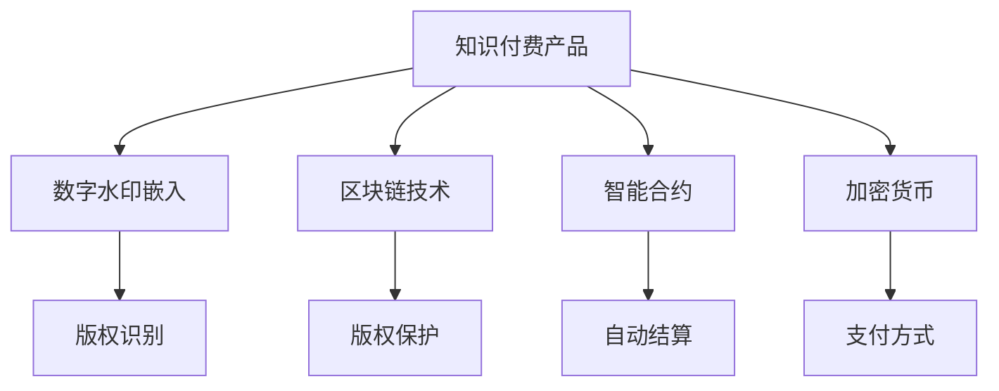

                 

# 知识付费产品的版权保护策略

> 关键词：知识付费,版权保护,区块链技术,数字水印,智能合约,加密货币

## 1. 背景介绍

随着互联网和移动互联网的普及，知识付费市场正在迅速崛起。用户对于高质量、精准、个性化的信息需求不断增长，订阅类、单次付费类、知识社区等多种形式的付费产品层出不穷。但与此同时，版权问题始终是困扰知识付费产品发展的核心痛点。盗版、侵权、内容盗用等现象频发，严重损害了内容创作者的权益，打击了版权保护的积极性。因此，建立有效的版权保护机制，保障内容创作者的利益，已经成为知识付费行业亟待解决的问题。

为了应对版权保护挑战，当前主流的策略包括数字水印嵌入、区块链技术、智能合约和加密货币等。这些技术手段各具特色，能够在不同程度上保障知识付费产品的版权。本文将对这些技术进行详细阐述，探索其在知识付费产品版权保护中的应用前景。

## 2. 核心概念与联系

### 2.1 核心概念概述

为了更好地理解知识付费产品版权保护技术，本节将介绍几个关键概念及其相互联系：

- **知识付费产品(Knowledge-Pay Products)**：即用户需要付费才能获取的内容服务，包括在线课程、电子书、音频视频等。
- **数字水印(Digital Watermarking)**：一种将版权信息嵌入到数字媒体中的技术，用于标识版权归属、追踪盗版、认证内容真伪等。
- **区块链技术(Blockchain Technology)**：一种去中心化的分布式账本技术，用于记录、验证和传输数据，具备不可篡改、透明公开的特点。
- **智能合约(Smart Contracts)**：一种在区块链上自动执行的合约，能够通过代码自动化处理交易和事件。
- **加密货币(Crypto Currencies)**：一种基于区块链技术的数字资产，具有匿名性和抗审查的特点。

这些核心概念共同构成了知识付费产品版权保护的技术框架，帮助解决版权识别、归属认证、盗版追踪、支付结算等问题。

### 2.2 核心概念原理和架构的 Mermaid 流程图



这个流程图展示了核心概念之间的逻辑关系：

1. **知识付费产品**：被保护的对象，其内容需要进行版权保护。
2. **数字水印嵌入**：在产品内容中嵌入版权信息，用于识别版权归属。
3. **区块链技术**：记录版权信息，提供透明公开的版权证明。
4. **智能合约**：自动处理版权相关事务，如版权认证、支付结算等。
5. **加密货币**：保障支付过程的匿名性和安全性，避免支付信息泄露。

各概念之间通过合法的途径和设计，形成互补，共同构建起知识付费产品版权保护的防护网络。

## 3. 核心算法原理 & 具体操作步骤

### 3.1 算法原理概述

知识付费产品版权保护的核心算法主要包括数字水印嵌入、区块链技术、智能合约和加密货币等。这些技术通过不同的机制，实现对版权信息的嵌入、验证、处理和保护。

- **数字水印嵌入**：通过将版权信息嵌入产品内容中，使得版权信息不可见、不可删除，一旦被非法篡改，即可通过嵌入信息确认版权归属。
- **区块链技术**：通过分布式账本记录版权信息，保证信息的不可篡改性和公开性，从而提供版权证明。
- **智能合约**：通过自动执行合约，确保版权事务处理的透明性和可追溯性，提高版权保护的自动化程度。
- **加密货币**：通过匿名支付，保障支付信息的隐私性，避免支付过程中的风险。

### 3.2 算法步骤详解

以下是知识付费产品版权保护各个核心算法的详细步骤：

#### 数字水印嵌入

1. **版权信息的获取**：通过版权登记、购买合同等方式获取版权信息。
2. **水印嵌入算法选择**：根据内容类型选择合适的嵌入算法，如空域嵌入、频域嵌入、视觉密码学等。
3. **嵌入水印**：在内容中嵌入版权信息，确保水印的不可见性。
4. **水印提取和验证**：在需要验证版权归属时，提取嵌入的水印并验证其真伪。

#### 区块链技术

1. **版权信息上链**：将版权信息以区块的形式记录在区块链上。
2. **区块链节点验证**：通过区块链节点的共识机制，验证版权信息的真实性。
3. **版权证明获取**：用户可以通过区块链浏览器查询版权信息，获得官方版权证明。

#### 智能合约

1. **合约设计**：设计自动执行的智能合约，包括版权认证、内容分发、支付结算等。
2. **合约部署**：将智能合约部署在区块链上。
3. **合约触发**：当版权相关事务发生时，智能合约自动执行，处理事务。

#### 加密货币

1. **加密货币选择**：选择安全性高、交易费用低廉的加密货币，如比特币、以太坊等。
2. **交易发起**：用户发起支付交易，并通过加密货币钱包完成支付。
3. **交易确认**：交易通过区块链网络确认，完成支付。

### 3.3 算法优缺点

数字水印嵌入技术：

**优点**：
- 嵌入信息不可见，不会影响用户体验。
- 嵌入信息不可删除，难以逆向攻击。
- 验证过程简单高效。

**缺点**：
- 嵌入信息容易被干扰破坏。
- 嵌入信息不可修改，无法适应内容更新。

区块链技术：

**优点**：
- 信息不可篡改，保证数据的真实性。
- 去中心化分布，保证信息的公开性。
- 自动记录版权信息，无需人工干预。

**缺点**：
- 区块链网络扩展性差，难以处理大规模数据。
- 区块链上交易费用较高，增加用户成本。

智能合约：

**优点**：
- 自动化处理版权事务，提升效率。
- 透明公开，增加信任度。
- 降低人为干预风险。

**缺点**：
- 合约编写复杂，需要专业技能。
- 合约执行依赖网络，存在延迟和故障风险。

加密货币：

**优点**：
- 支付过程匿名，保障用户隐私。
- 抗审查，防止支付信息泄露。
- 分布式账本，增强支付安全性。

**缺点**：
- 交易费用较高，增加用户成本。
- 交易过程复杂，普通用户使用不便。

### 3.4 算法应用领域

数字水印嵌入技术主要应用于版权识别和验证，适合对版权要求较高的内容。

区块链技术主要用于版权信息记录和保护，适合版权登记、版权证明等领域。

智能合约适用于版权自动化处理，如版权认证、内容分发、支付结算等场景。

加密货币主要应用于支付结算，保障支付安全和匿名性。

## 4. 数学模型和公式 & 详细讲解 & 举例说明

### 4.1 数学模型构建

本节将使用数学语言对数字水印嵌入技术进行更加严格的刻画。

设版权信息为 $C$，嵌入的水印为 $W$，原始内容为 $O$。数字水印嵌入过程可以表示为：

$$
O' = O + W
$$

其中 $O'$ 为嵌入水印后的内容。

### 4.2 公式推导过程

嵌入水印的过程可以使用以下公式描述：

1. **空域嵌入算法**：在内容的像素空间中嵌入水印，通过修改像素值实现。

$$
O'_{i,j} = 
\begin{cases} 
O_{i,j} - W_i, & \text{如果 } O_{i,j} > W_i \\
O_{i,j} + W_i, & \text{如果 } O_{i,j} < W_i \\
O_{i,j}, & \text{如果 } O_{i,j} = W_i 
\end{cases}
$$

2. **频域嵌入算法**：在内容的频域中嵌入水印，通过修改频域系数实现。

$$
O'_{u,v} = O_{u,v} \cdot \exp(j\phi W)
$$

其中 $\phi$ 为相位因子，$W$ 为水印信号。

3. **视觉密码学算法**：利用人类视觉系统的特点，在内容中嵌入水印，通过改变亮度、对比度等方式实现。

$$
O'_{i,j} = O_{i,j} + f(W_i)
$$

其中 $f$ 为人类视觉系统响应函数。

### 4.3 案例分析与讲解

以频域嵌入算法为例，分析嵌入水印的具体过程：

- **频域转换**：将原始内容 $O$ 进行傅里叶变换，得到频域系数 $O_{u,v}$。
- **水印嵌入**：将版权信息 $C$ 通过某种方式（如加密、哈希等）转换为水印信号 $W$。
- **频域乘法**：将水印信号 $W$ 与频域系数 $O_{u,v}$ 进行相乘，得到新的频域系数 $O'_{u,v}$。
- **逆变换**：将新的频域系数 $O'_{u,v}$ 进行逆傅里叶变换，得到嵌入水印后的内容 $O'$。

这种嵌入方式具有以下优点：

- 水印信息嵌入到频域中，使得水印具有较好的鲁棒性，不容易被去除。
- 嵌入过程简单高效，对原始内容影响较小。
- 嵌入后的内容可以直接使用，无需额外解码步骤。

## 5. 项目实践：代码实例和详细解释说明

### 5.1 开发环境搭建

在进行知识付费产品版权保护技术开发前，我们需要准备好开发环境。以下是使用Python进行数字水印嵌入的开发环境配置流程：

1. 安装Python：从官网下载并安装Python，建议使用3.6及以上版本。
2. 安装Pillow库：Pillow是Python中常用的图像处理库，支持多种图像格式。
3. 安装NumPy库：NumPy是Python中常用的数值计算库，支持数组运算和矩阵运算。
4. 安装SciPy库：SciPy是Python中常用的科学计算库，支持信号处理、统计分析等功能。
5. 安装Matplotlib库：Matplotlib是Python中常用的绘图库，支持多种图形绘制。

完成上述步骤后，即可在Python环境中进行数字水印嵌入的开发。

### 5.2 源代码详细实现

下面以频域嵌入算法为例，给出使用Pillow和SciPy库进行数字水印嵌入的Python代码实现。

```python
from PIL import Image
import numpy as np
from scipy.fft import fft2, ifft2

def embed_watermark(image, watermark, strength):
    # 将原始图像转换为NumPy数组
    img = np.array(image)
    
    # 将水印信息进行傅里叶变换
    wm = np.fft.fft2(watermark)
    
    # 将水印信息嵌入到图像的频域中
    img_freq = np.fft.fft2(img)
    img_freq *= strength * wm
    
    # 将图像从频域转换回时域
    img_embed = np.real(ifft2(img_freq))
    
    # 将嵌入水印后的图像转换回PIL格式
    img_embed = Image.fromarray(np.uint8(img_embed))
    
    return img_embed

# 加载原始图像和水印图像
original_image = Image.open('original_image.png')
watermark_image = Image.open('watermark.png')

# 设置水印强度
strength = 0.5

# 嵌入水印
embedded_image = embed_watermark(original_image, watermark_image, strength)

# 保存嵌入水印后的图像
embedded_image.save('embedded_image.png')
```

这段代码实现了一个简单的频域数字水印嵌入功能。首先，将原始图像和水印图像转换为NumPy数组，然后进行傅里叶变换，将水印信息嵌入到图像的频域中。最后，将图像从频域转换回时域，并保存嵌入水印后的图像。

### 5.3 代码解读与分析

下面是代码的详细解读：

**1. 加载原始图像和水印图像**

使用Pillow库中的Image.open()函数加载原始图像和水印图像，加载的图像以PIL Image对象的形式返回。

**2. 设置水印强度**

水印强度决定了水印嵌入到图像中的强度，值越大，水印信息越多，但可能影响原始图像的质量。

**3. 嵌入水印**

使用NumPy库的傅里叶变换函数进行频域转换，将水印信息嵌入到图像的频域中。然后，将图像从频域转换回时域，得到嵌入水印后的图像。

**4. 保存嵌入水印后的图像**

使用Pillow库中的Image.save()函数将嵌入水印后的图像保存为PNG格式。

需要注意的是，实际应用中，还需要进行水印提取和验证的步骤。验证过程需要使用相同的频域嵌入算法，对嵌入水印后的图像进行频域转换，然后提取嵌入的水印信息，并与原始水印进行比对验证。

## 6. 实际应用场景

### 6.1 版权识别与验证

在知识付费产品中，版权识别和验证是确保内容版权的关键环节。通过嵌入数字水印，可以实现对内容的版权归属和真伪的验证。

例如，在电子书阅读器中，用户下载电子书后，读取其中的数字水印信息，验证版权归属和真伪。如果数字水印信息与版权登记信息一致，则认为该电子书是合法的；否则，认为是非法盗版。

### 6.2 内容分发与防盗版

在知识付费产品的分销过程中，数字水印技术可以防止内容盗版和非法复制。通过嵌入数字水印，在内容分发时，可以检查分发内容的完整性和真伪。

例如，在在线教育平台中，课程视频在分发时嵌入数字水印，用户在观看视频时，系统自动提取数字水印，验证视频的完整性和真伪。如果数字水印信息与原始水印一致，则认为是合法的；否则，认为是非法盗版。

### 6.3 支付结算与防欺诈

在知识付费产品的支付结算过程中，数字水印技术可以保障支付过程的安全性，防止欺诈行为的发生。

例如，在知识社区中，用户购买内容时，需要支付一定的加密货币。数字水印技术可以保障支付过程的匿名性和安全性，防止支付信息泄露和欺诈行为的发生。

### 6.4 未来应用展望

随着区块链技术、智能合约和加密货币的进一步发展，未来知识付费产品的版权保护将更加安全和高效。

- **区块链版权登记**：通过区块链技术进行版权登记，保障版权信息的公开性和透明性。
- **智能合约版权保护**：利用智能合约自动化处理版权相关事务，提升版权保护的自动化程度。
- **加密货币支付**：通过加密货币保障支付过程的匿名性和安全性，防止欺诈行为的发生。

## 7. 工具和资源推荐

### 7.1 学习资源推荐

为了帮助开发者系统掌握数字水印嵌入、区块链技术、智能合约和加密货币的理论基础和实践技巧，这里推荐一些优质的学习资源：

1. **数字水印嵌入**：
   - 《数字水印技术与应用》书籍：全面介绍了数字水印的基本原理和应用场景。
   - 《数字图像处理与水印技术》课程：由知名高校开设，涵盖了数字水印的多种算法和技术。

2. **区块链技术**：
   - 《区块链原理与技术》书籍：系统介绍了区块链的基本概念和实现原理。
   - 《区块链应用开发实战》课程：由区块链技术专家授课，讲解区块链应用开发的实际案例。

3. **智能合约**：
   - 《智能合约编程实战》书籍：介绍了智能合约的基本原理和编程实践。
   - 《Solidity编程指南》课程：由以太坊官方提供，讲解Solidity编程语言及其应用。

4. **加密货币**：
   - 《加密货币技术与安全》书籍：全面介绍了加密货币的基本原理和安全性问题。
   - 《比特币与区块链技术》课程：由比特币开发者授课，讲解比特币和区块链技术的实现原理。

通过这些学习资源，相信你一定能够全面掌握数字水印嵌入、区块链技术、智能合约和加密货币的理论基础和实践技巧，为知识付费产品的版权保护提供技术支撑。

### 7.2 开发工具推荐

高效的开发离不开优秀的工具支持。以下是几款用于数字水印嵌入、区块链技术、智能合约和加密货币开发常用的工具：

1. **数字水印嵌入**：
   - Python的Pillow库：支持多种图像格式，易于使用。
   - MATLAB的Digital Image Processing工具箱：支持丰富的数字水印算法。

2. **区块链技术**：
   - Ethereum智能合约开发环境：支持Solidity语言的智能合约开发。
   - Hyperledger Fabric开发环境：支持多种区块链框架，支持跨链互操作。

3. **智能合约**：
   - Truffle框架：支持Solidity语言的智能合约开发，集成了测试、部署等功能。
   - Remix IDE：基于Web的智能合约开发环境，支持多种区块链平台。

4. **加密货币**：
   - Bitcoin Core：比特币官方客户端，支持比特币的开发和维护。
   - Ethereum钱包：支持以太坊的钱包功能，支持加密货币的管理和交易。

合理利用这些工具，可以显著提升数字水印嵌入、区块链技术、智能合约和加密货币的开发效率，加快创新迭代的步伐。

### 7.3 相关论文推荐

数字水印嵌入技术、区块链技术、智能合约和加密货币在知识付费产品版权保护领域的发展，源于学界的持续研究。以下是几篇奠基性的相关论文，推荐阅读：

1. **数字水印嵌入**：
   - 《Digital Watermarking Techniques and Applications》（数字水印技术与应用）：详细介绍了数字水印的基本原理和多种算法。

2. **区块链技术**：
   - 《Blockchain Technology and Applications》（区块链技术与应用）：系统介绍了区块链的基本概念和实现原理。

3. **智能合约**：
   - 《Smart Contracts in Ethereum》（以太坊中的智能合约）：介绍了智能合约的基本原理和编程实践。

4. **加密货币**：
   - 《Cryptocurrency Technologies》（加密货币技术）：全面介绍了加密货币的基本原理和安全性问题。

这些论文代表了大语言模型微调技术的发展脉络。通过学习这些前沿成果，可以帮助研究者把握学科前进方向，激发更多的创新灵感。

## 8. 总结：未来发展趋势与挑战

### 8.1 研究成果总结

本文对知识付费产品版权保护的技术进行了详细阐述，主要包括数字水印嵌入、区块链技术、智能合约和加密货币等核心算法。通过这些技术的结合应用，可以有效保护知识付费产品的版权，保障内容创作者的权益。

### 8.2 未来发展趋势

展望未来，知识付费产品版权保护技术将呈现以下几个发展趋势：

1. **技术融合**：数字水印、区块链、智能合约和加密货币等技术将进一步融合，形成更加完善的版权保护生态系统。
2. **自动化程度提升**：版权保护过程将更加自动化和智能化，减少人为干预，提高效率。
3. **跨链互操作**：不同区块链平台之间的互操作性将得到提升，版权信息可以跨平台流通和验证。
4. **隐私保护增强**：通过匿名支付和隐私保护技术，保障支付过程的匿名性和安全性。

### 8.3 面临的挑战

尽管知识付费产品版权保护技术已经取得了一定的进展，但在其应用过程中仍面临诸多挑战：

1. **技术复杂度**：数字水印嵌入、区块链技术、智能合约和加密货币等技术本身较为复杂，需要较高的技术门槛。
2. **实施成本高**：大规模部署这些技术需要较高的成本，包括硬件设备、技术培训等。
3. **用户接受度**：部分用户对新技术的接受度较低，可能影响版权保护措施的实施效果。
4. **法律环境**：各国法律法规对版权保护的支持程度不一，需要适应不同地区的法律环境。

### 8.4 研究展望

未来，知识付费产品版权保护技术的研究方向主要包括以下几个方面：

1. **技术创新**：开发更加高效、安全的数字水印嵌入和区块链技术，提升版权保护的效率和安全性。
2. **算法优化**：优化智能合约和加密货币的算法，降低实施成本，提升用户体验。
3. **法律保障**：推动法律法规的完善，建立完善的版权保护法律体系，保障内容创作者的权益。
4. **多技术融合**：探索多种技术的融合应用，形成更加完善的版权保护生态系统。

通过这些研究方向，相信知识付费产品的版权保护技术将不断突破技术瓶颈，更好地保障内容创作者的权益，推动知识付费行业的健康发展。

## 9. 附录：常见问题与解答

**Q1：如何选择合适的数字水印嵌入算法？**

A: 选择合适的数字水印嵌入算法需要考虑多种因素，如内容类型、水印信息长度、鲁棒性要求等。通常有以下几种选择：
- 频域嵌入：适用于图像和音频等连续数据，嵌入水印对内容质量影响较小。
- 空域嵌入：适用于文本和图形等离散数据，嵌入水印对内容质量影响较大。
- 视觉密码学：适用于文字、图像等具有人类视觉系统特点的内容，嵌入水印对内容质量影响较小。

**Q2：区块链技术在版权保护中如何应用？**

A: 区块链技术在版权保护中的应用主要包括以下几个方面：
- 版权信息上链：将版权信息记录在区块链上，确保信息不可篡改。
- 版权证明获取：用户可以通过区块链浏览器查询版权信息，获得官方版权证明。
- 版权自动确认：版权登记信息一旦上链，便自动确认版权归属，无需人工干预。

**Q3：智能合约在版权保护中如何应用？**

A: 智能合约在版权保护中的应用主要包括以下几个方面：
- 版权认证：通过智能合约自动验证版权信息的真实性和完整性。
- 内容分发：通过智能合约控制内容的发布和分发，防止非法复制。
- 支付结算：通过智能合约自动化处理支付过程，保障支付安全和匿名性。

**Q4：加密货币在版权保护中如何应用？**

A: 加密货币在版权保护中的应用主要包括以下几个方面：
- 匿名支付：通过加密货币保障支付过程的匿名性和安全性，防止支付信息泄露。
- 支付保护：通过加密货币防止支付过程中的欺诈行为。

这些问答帮助我们更好地理解知识付费产品版权保护技术的核心要点，为实际应用提供了可靠的指导。

---

作者：禅与计算机程序设计艺术 / Zen and the Art of Computer Programming

