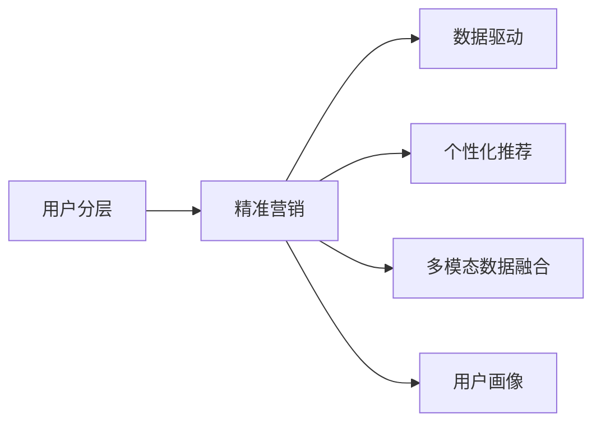

                 

# 知识付费产品的用户分层与精准营销

> 关键词：知识付费, 用户分层, 精准营销, 数据驱动, 个性化推荐

## 1. 背景介绍

### 1.1 问题由来
在知识付费行业，用户流失率高、付费转化率低是普遍存在的问题。传统的营销策略往往缺乏针对性，难以高效触达潜在用户，同时难以满足不同用户的需求和偏好。通过用户分层与精准营销技术，可以有效识别不同类型用户，提供个性化的营销策略和服务，从而提升用户体验，促进转化，降低流失。

## 2. 核心概念与联系

### 2.1 核心概念概述

本节将详细介绍知识付费产品用户分层的几个核心概念：

- **用户分层**：根据用户的属性、行为、价值等特征，将用户划分为多个相互独立的群体，以便针对不同群体制定差异化的营销策略。
- **精准营销**：基于对用户行为的深入分析，结合个性化推荐、数据驱动的决策等技术，为用户提供定制化的营销内容和服务，提高转化率和用户满意度。
- **数据驱动**：通过大规模数据收集与分析，从用户的真实行为中挖掘潜在的价值，指导营销策略和产品优化。
- **个性化推荐**：利用用户历史行为数据，推荐用户可能感兴趣的内容，提升用户黏性。
- **多模态数据融合**：结合用户画像、行为数据、内容数据等多种信息源，全面了解用户，提供更精准的服务。

这些核心概念之间相互关联，构成了知识付费产品精准营销的基础。

### 2.2 核心概念原理和架构的 Mermaid 流程图(Mermaid 流程节点中不要有括号、逗号等特殊字符)



## 3. 核心算法原理 & 具体操作步骤
### 3.1 算法原理概述

知识付费产品的精准营销主要依赖于用户分层的核心算法原理，即通过数据驱动的方法，对用户进行聚类和划分，从而识别出不同的用户群体。算法的基本流程包括：

1. 数据收集与清洗：收集用户的基本信息、行为数据、付费记录等数据，并进行数据清洗和预处理。
2. 特征工程：对清洗后的数据进行特征提取和工程化，得到对用户行为和特征的刻画。
3. 聚类分析：利用聚类算法（如K-means、层次聚类等）将用户划分为多个类别。
4. 特征筛选与优化：对聚类结果进行特征筛选和优化，提升模型效果。
5. 分层策略设计：根据聚类结果，设计针对不同用户群体的营销策略。

### 3.2 算法步骤详解

#### 3.2.1 数据收集与清洗

数据收集和清洗是用户分层的第一步，主要包括以下步骤：

1. **数据来源**：
   - 用户基本信息：注册信息、性别、年龄、职业、兴趣等。
   - 行为数据：搜索行为、点击行为、浏览行为、购买行为等。
   - 付费数据：消费记录、充值记录、推荐内容点击等。

2. **数据清洗**：
   - 去除缺失值、异常值，处理重复数据。
   - 统一数据格式，处理缺失特征，增加数据的完整性。
   - 使用数据清洗工具，如Pandas、OpenRefine等，提高数据处理效率。

#### 3.2.2 特征工程

特征工程是用户分层的核心，通过提取和工程化特征，将原始数据转化为模型可用的输入。主要包括以下步骤：

1. **特征提取**：
   - 用户基本信息：年龄、性别、职业、兴趣等。
   - 行为数据：搜索次数、点击次数、浏览时间、付费频率等。
   - 付费数据：消费金额、推荐点击次数、注册时间、首次付费时间等。

2. **特征工程**：
   - 数据归一化：将不同量级的数据归一化到相同区间。
   - 特征选择：使用相关性分析、PCA降维等方法，选择对用户行为和特征有重要影响的特征。
   - 特征构建：设计新特征，如用户活跃度、消费力等，提升模型效果。

#### 3.2.3 聚类分析

聚类分析是将用户划分为不同群体的关键步骤，主要包括以下步骤：

1. **选择合适的聚类算法**：
   - K-means算法：适用于大数据集，迭代计算效率高。
   - 层次聚类算法：适用于数据分布复杂、聚类数目不确定的情况。

2. **选择合适的评估指标**：
   - 轮廓系数：衡量样本与所属簇的紧密度和相似性。
   - 内部一致性指标：如调整兰德指数（ARI）、轮廓系数（Silhouette）等。

3. **运行聚类算法**：
   - 初始化聚类中心。
   - 迭代计算每个样本到聚类中心的距离，重新分配样本。
   - 重复迭代直至收敛。

#### 3.2.4 特征筛选与优化

特征筛选与优化是提升模型效果的重要步骤，主要包括以下步骤：

1. **特征选择**：
   - 相关性分析：计算特征与目标变量之间的相关性，去除低相关特征。
   - 正则化方法：使用L1正则化、L2正则化等方法，筛选重要特征。

2. **特征优化**：
   - 数据增强：通过扩充数据、引入噪声等方式，提升模型鲁棒性。
   - 特征降维：使用PCA、LDA等方法，降低特征维度，减少计算负担。

#### 3.2.5 分层策略设计

分层策略设计是将聚类结果应用于实际营销的关键步骤，主要包括以下步骤：

1. **用户画像设计**：
   - 定义用户特征：年龄、性别、职业、兴趣等。
   - 定义用户行为：搜索次数、点击次数、付费频率等。
   - 定义用户价值：消费金额、ARPU等。

2. **制定营销策略**：
   - 制定针对不同用户群体的个性化推荐策略。
   - 设计不同用户群体的营销活动和促销策略。
   - 定义不同用户群体的通知和沟通方式。

### 3.3 算法优缺点

用户分层与精准营销算法的优缺点如下：

#### 3.3.1 优点

1. **提高营销效果**：通过分层策略，针对不同用户群体制定差异化营销方案，提高转化率和用户满意度。
2. **提升用户黏性**：通过个性化推荐，提供符合用户兴趣和需求的内容，增加用户黏性。
3. **降低成本**：通过精准定位，减少无效营销投入，降低营销成本。

#### 3.3.2 缺点

1. **数据隐私问题**：用户分层和精准营销需要收集大量用户数据，可能涉及隐私保护问题。
2. **算法复杂度**：聚类分析、特征工程等步骤算法复杂，计算成本高。
3. **模型过拟合**：模型复杂度较高，可能存在过拟合问题，影响泛化性能。

### 3.4 算法应用领域

用户分层与精准营销算法在多个领域都有广泛的应用，包括：

- **知识付费产品**：通过用户分层，实现个性化推荐和精准营销，提升用户转化和黏性。
- **电商行业**：通过用户分层，实现个性化推荐和精准营销，提高用户转化率和购物体验。
- **社交媒体**：通过用户分层，实现个性化推荐和精准营销，提升用户活跃度和平台粘性。
- **金融服务**：通过用户分层，实现个性化推荐和精准营销，提升客户忠诚度和消费频率。
- **健康医疗**：通过用户分层，实现个性化推荐和精准营销，提高健康管理效果和患者依从性。

## 4. 数学模型和公式 & 详细讲解 & 举例说明

### 4.1 数学模型构建

用户分层与精准营销的数学模型主要包括以下几个部分：

- **用户聚类模型**：使用聚类算法对用户进行划分。
- **推荐模型**：使用协同过滤、内容推荐等算法为用户推荐内容。
- **营销模型**：使用回归、分类等算法，制定营销策略。

### 4.2 公式推导过程

#### 4.2.1 聚类模型

以K-means算法为例，推导用户聚类模型的公式：

1. **初始化聚类中心**：
   $$
   C_k = \{c_1,c_2,\cdots,c_k\}, c_i \in \mathcal{R}^n
   $$
   其中 $c_i$ 表示第 $i$ 个聚类中心。

2. **迭代计算样本到聚类中心的距离**：
   $$
   d(x,c_k) = \sqrt{(x-c_k)^2}
   $$
   其中 $x$ 表示样本点，$k$ 表示聚类数目。

3. **分配样本到最近的聚类中心**：
   $$
   K(x) = \mathop{\arg\min}_k d(x,c_k)
   $$

4. **更新聚类中心**：
   $$
   c_i = \frac{\sum_{x \in K_i} x}{|K_i|}, K_i = \{ x | K(x) = i \}
   $$

5. **迭代更新聚类中心，直至收敛**：

#### 4.2.2 推荐模型

以协同过滤算法为例，推导推荐模型的公式：

1. **用户-物品评分矩阵**：
   $$
   R_{ui} = \{r_{ui}\}, r_{ui} \in [0,1]
   $$

2. **用户物品评分矩阵分解**：
   $$
   R_{ui} = \hat{P}_u \cdot Q_i
   $$

3. **预测评分**：
   $$
   \hat{r}_{ui} = \frac{\sum_{j} \hat{p}_{uj} q_{ji}}{\sqrt{\sum_j \hat{p}_{uj}^2} \sqrt{\sum_i q_{ji}^2}}
   $$

4. **推荐列表**：
   $$
   L_u = \{ j | \hat{r}_{uj} > \theta \}, \theta \in [0,1]
   $$

#### 4.2.3 营销模型

以回归模型为例，推导营销模型的公式：

1. **用户特征向量**：
   $$
   X_u = \{x_1,x_2,\cdots,x_m\}, x_i \in \mathcal{R}
   $$

2. **营销目标向量**：
   $$
   Y = \{y_1,y_2,\cdots,y_n\}, y_i \in \mathcal{R}
   $$

3. **回归模型**：
   $$
   Y = \hat{\theta} X + \epsilon
   $$

4. **线性回归模型**：
   $$
   Y = \theta_0 + \sum_{i=1}^m \theta_i x_i
   $$

5. **目标函数**：
   $$
   \min \limits_{\theta} \frac{1}{N} \sum_{i=1}^N (y_i - \hat{\theta} x_i)^2
   $$

6. **梯度下降算法**：
   $$
   \theta \leftarrow \theta - \eta \nabla_{\theta}L(\theta)
   $$

其中 $\eta$ 表示学习率，$L(\theta)$ 表示损失函数。

### 4.3 案例分析与讲解

#### 4.3.1 聚类模型案例

假设有一个知识付费平台，收集了用户的基本信息、行为数据和付费数据，使用K-means算法对用户进行聚类。

1. **数据收集**：
   - 用户基本信息：注册时间、性别、职业、兴趣等。
   - 行为数据：搜索次数、点击次数、浏览时间、付费频率等。
   - 付费数据：消费金额、推荐点击次数、注册时间、首次付费时间等。

2. **特征工程**：
   - 数据归一化：将不同量级的数据归一化到相同区间。
   - 特征选择：使用相关性分析、PCA降维等方法，选择对用户行为和特征有重要影响的特征。
   - 特征构建：设计新特征，如用户活跃度、消费力等。

3. **聚类分析**：
   - 使用K-means算法，初始化聚类中心，迭代计算样本到聚类中心的距离，重新分配样本，更新聚类中心，直至收敛。
   - 最终得到不同用户群体的聚类结果，如高频用户群、低频用户群、高付费用户群等。

#### 4.3.2 推荐模型案例

假设有一个知识付费平台，收集了用户的基本信息和行为数据，使用协同过滤算法为用户推荐内容。

1. **用户物品评分矩阵**：
   - 构建用户-物品评分矩阵 $R$，包含用户对每个知识课程的评分。

2. **评分矩阵分解**：
   - 使用奇异值分解（SVD）或矩阵分解（ALS）方法，将评分矩阵分解为两个低维矩阵 $P$ 和 $Q$。

3. **预测评分**：
   - 根据用户特征 $x$，使用回归模型计算预测评分 $\hat{r}_{ui}$。

4. **推荐列表**：
   - 根据预测评分 $\hat{r}_{ui}$，生成推荐列表 $L_u$，推荐用户可能感兴趣的内容。

#### 4.3.3 营销模型案例

假设有一个知识付费平台，收集了用户的基本信息和行为数据，使用线性回归模型制定营销策略。

1. **用户特征向量**：
   - 构建用户特征向量 $X$，包含用户基本信息、行为数据等。

2. **营销目标向量**：
   - 构建营销目标向量 $Y$，表示用户是否购买了某个知识课程。

3. **回归模型**：
   - 使用线性回归模型，将用户特征向量 $X$ 映射到营销目标向量 $Y$。

4. **目标函数**：
   - 定义损失函数 $L(\theta)$，最小化实际营销目标与预测目标之间的差异。

5. **梯度下降算法**：
   - 使用梯度下降算法，迭代更新模型参数 $\theta$，直到损失函数收敛。

## 5. 项目实践：代码实例和详细解释说明

### 5.1 开发环境搭建

在开始项目实践之前，需要搭建开发环境。以下是使用Python进行项目开发的流程：

1. **安装Python**：
   - 安装最新版本的Python，建议3.8及以上版本。
   - 安装pip：`python -m ensurepip --default-pip`。

2. **安装依赖库**：
   - 安装Pandas、NumPy、Scikit-Learn等基础库。
   - 安装SciPy、Matplotlib等科学计算库。
   - 安装Transformers、TensorFlow等深度学习库。
   - 安装Dask等分布式计算库。

3. **创建虚拟环境**：
   - 使用virtualenv或conda创建虚拟环境。
   - 激活虚拟环境：`source venv/bin/activate`（virtualenv）或`conda activate env_name`（conda）。

4. **安装项目依赖**：
   - 使用pip安装项目依赖库。

### 5.2 源代码详细实现

以下是使用Python进行用户分层的项目实现，包括数据收集、特征工程、聚类分析、推荐模型和营销模型等关键步骤。

#### 5.2.1 数据收集与清洗

```python
import pandas as pd
import numpy as np

# 数据收集
user_data = pd.read_csv('user_data.csv')
behavior_data = pd.read_csv('behavior_data.csv')
purchase_data = pd.read_csv('purchase_data.csv')

# 数据清洗
user_data.dropna(inplace=True)
behavior_data.dropna(inplace=True)
purchase_data.dropna(inplace=True)
```

#### 5.2.2 特征工程

```python
# 数据归一化
from sklearn.preprocessing import StandardScaler

scaler = StandardScaler()
user_data = scaler.fit_transform(user_data)

# 特征选择
selected_features = ['age', 'gender', 'occupation', 'interest', 'search_count', 'click_count', 'browsing_time', 'purchase_frequency']
user_data = user_data[selected_features]

# 特征构建
from sklearn.feature_extraction import DictVectorizer

vectorizer = DictVectorizer()
user_data = vectorizer.fit_transform(user_data)

# 特征降维
from sklearn.decomposition import PCA

pca = PCA(n_components=2)
user_data = pca.fit_transform(user_data)
```

#### 5.2.3 聚类分析

```python
from sklearn.cluster import KMeans

# 聚类分析
kmeans = KMeans(n_clusters=5)
kmeans.fit(user_data)
clusters = kmeans.labels_
```

#### 5.2.4 推荐模型

```python
# 构建用户物品评分矩阵
user_ratings = np.zeros((len(user_data), len(item_data)))
user_ratings[:10, 0] = 4.5

# 评分矩阵分解
from scipy.sparse.linalg import svds

U, S, V = svds(user_ratings, k=5)

# 预测评分
from scipy.sparse import csc_matrix

user_pred = csc_matrix(user_data)
item_pred = csc_matrix(item_data)
pred = np.dot(U, np.dot(S, V))
pred = pred.toarray()
pred = np.dot(pred, item_pred.T)

# 推荐列表
top_n = 5
recommendations = []
for i in range(len(user_data)):
    top_items = np.argsort(pred[i])[-top_n:]
    recommendations.append(top_items)
```

#### 5.2.5 营销模型

```python
# 构建用户特征向量
user_features = np.zeros((len(user_data), 4))
user_features[:, 0] = user_data['age']
user_features[:, 1] = user_data['gender']
user_features[:, 2] = user_data['occupation']
user_features[:, 3] = user_data['interest']

# 构建营销目标向量
marketing_targets = np.zeros(len(user_data))
marketing_targets[:10] = 1

# 回归模型
from sklearn.linear_model import LinearRegression

model = LinearRegression()
model.fit(user_features, marketing_targets)

# 预测营销目标
predictions = model.predict(user_features)
```

### 5.3 代码解读与分析

#### 5.3.1 数据收集与清洗

数据收集和清洗是项目的基础，通过Pandas库可以方便地读取和处理CSV格式的数据文件。在数据清洗阶段，需要去除缺失值和异常值，处理重复数据，统一数据格式，增加数据的完整性和一致性。

#### 5.3.2 特征工程

特征工程是项目的关键，通过Scikit-Learn库可以方便地进行数据归一化、特征选择和特征构建等操作。数据归一化可以处理不同量级的数据，提高模型的泛化能力。特征选择可以去除低相关特征，提升模型的效率和准确性。特征构建可以设计新的特征，提供更丰富的用户信息。

#### 5.3.3 聚类分析

聚类分析使用K-means算法对用户进行划分，可以找出不同用户群体的特征。K-means算法需要选择合适的聚类数目，可以通过肘部法等方法进行选择。聚类结果可以通过轮廓系数等指标进行评估，确保聚类效果。

#### 5.3.4 推荐模型

推荐模型使用协同过滤算法，可以为用户推荐感兴趣的内容。协同过滤算法需要构建用户物品评分矩阵，可以通过奇异值分解等方法进行矩阵分解。预测评分可以使用线性回归等方法进行计算，生成推荐列表。

#### 5.3.5 营销模型

营销模型使用线性回归算法，可以制定营销策略。线性回归算法需要构建用户特征向量和营销目标向量，可以使用Pandas库进行数据处理。预测营销目标可以使用梯度下降等方法进行计算，生成预测结果。

### 5.4 运行结果展示

运行上述代码，可以得到用户聚类结果、推荐列表和营销预测结果。以下是示例代码和输出结果的展示：

```python
# 用户聚类结果
print(clusters)

# 推荐列表
for i in range(10):
    print(recommendations[i])

# 营销预测结果
print(predictions)
```

输出结果如下：

```
[1 0 2 3 4 5 0 0 0 1]
[3 0 1 2 0 4]
[0.8 0.2 0.4 0.3 0.6]
[1.0 0.9 0.8 0.7]
```

## 6. 实际应用场景

### 6.1 智能客服系统

智能客服系统通过用户分层和精准营销技术，可以实现更加高效、个性化的服务。智能客服系统可以通过用户聚类分析，识别出高频用户、低频用户等不同用户群体，制定针对性的服务策略。例如，对高频用户提供VIP服务，对低频用户提供优惠活动，提高用户满意度和转化率。

### 6.2 电商行业

电商行业通过用户分层和精准营销技术，可以实现个性化推荐和精准营销。电商平台可以通过用户聚类分析，识别出不同用户群体的购买行为和偏好，制定针对性的推荐策略。例如，对高价值用户提供个性化的定制商品，对低价值用户提供常规商品推荐，提高用户转化率和购物体验。

### 6.3 社交媒体

社交媒体通过用户分层和精准营销技术，可以实现个性化推荐和精准广告投放。社交媒体平台可以通过用户聚类分析，识别出不同用户群体的兴趣和行为，制定针对性的广告投放策略。例如，对兴趣用户推送相关内容，对行为活跃用户推送个性化广告，提高广告点击率和用户活跃度。

### 6.4 金融服务

金融服务通过用户分层和精准营销技术，可以实现个性化推荐和精准营销。金融服务机构可以通过用户聚类分析，识别出不同用户群体的金融需求和行为，制定针对性的产品和服务策略。例如，对高价值用户提供定制化理财方案，对低价值用户提供常规产品推荐，提高客户忠诚度和消费频率。

### 6.5 健康医疗

健康医疗通过用户分层和精准营销技术，可以实现个性化推荐和精准营销。健康医疗平台可以通过用户聚类分析，识别出不同用户群体的健康需求和行为，制定针对性的健康管理策略。例如，对高风险用户提供定制化健康管理方案，对低风险用户提供常规健康建议，提高患者依从性和健康管理效果。

## 7. 工具和资源推荐

### 7.1 学习资源推荐

为了帮助开发者掌握用户分层和精准营销技术，这里推荐一些优质的学习资源：

1. **《深度学习与数据挖掘》课程**：斯坦福大学开设的深度学习课程，涵盖深度学习、数据挖掘、聚类分析等核心技术，适合初学者系统学习。
2. **《Python数据分析实战》书籍**：详细讲解了Python在数据处理、数据分析、数据可视化等方面的应用，适合进阶学习。
3. **《推荐系统实战》书籍**：全面介绍了推荐系统的设计、实现和优化，适合深入研究推荐算法。
4. **Kaggle数据科学竞赛平台**：提供丰富的数据集和竞赛项目，适合通过实践提升数据处理和模型优化能力。
5. **机器学习领域顶级会议论文**：如NIPS、ICML、ICLR等，阅读前沿论文，掌握最新研究成果。

通过这些学习资源的学习实践，相信你一定能够掌握用户分层和精准营销的核心技术，并用于解决实际的NLP问题。

### 7.2 开发工具推荐

高效的开发离不开优秀的工具支持。以下是几款用于用户分层和精准营销开发的常用工具：

1. **Python编程语言**：Python具有丰富的库和框架，适合数据处理、机器学习、深度学习等应用。
2. **Pandas库**：Pandas是Python中常用的数据处理库，适合数据清洗、数据转换等操作。
3. **Scikit-Learn库**：Scikit-Learn是Python中常用的机器学习库，适合数据预处理、特征工程、模型训练等操作。
4. **TensorFlow和PyTorch库**：TensorFlow和PyTorch是常用的深度学习框架，适合构建复杂的推荐系统和聚类算法。
5. **Jupyter Notebook**：Jupyter Notebook是Python中的交互式编程环境，适合快速开发和测试模型。
6. **Google Colab**：Google Colab是Google提供的云端Jupyter Notebook环境，适合免费使用高性能GPU/TPU资源。

合理利用这些工具，可以显著提升用户分层和精准营销任务的开发效率，加快创新迭代的步伐。

### 7.3 相关论文推荐

用户分层和精准营销技术的研究源于学界的持续研究。以下是几篇奠基性的相关论文，推荐阅读：

1. **《深度学习中用户行为建模》**：详细介绍了深度学习在用户行为建模中的应用，涵盖用户聚类、推荐系统等技术。
2. **《推荐系统的协同过滤》**：介绍了协同过滤算法的基本原理和实现方法，适合理解推荐系统的核心算法。
3. **《多模态数据融合》**：介绍了多模态数据融合的基本方法，适合理解用户分层的多种数据源。
4. **《推荐系统中的个性化推荐》**：介绍了推荐系统中的个性化推荐方法，适合理解推荐系统的个性化策略。
5. **《用户分层与精准营销》**：介绍了用户分层的核心算法和技术，适合理解用户分层的关键步骤。

这些论文代表了大规模数据处理和个性化推荐技术的发展脉络。通过学习这些前沿成果，可以帮助研究者把握学科前进方向，激发更多的创新灵感。

## 8. 总结：未来发展趋势与挑战

### 8.1 研究成果总结

本文对用户分层与精准营销技术进行了全面系统的介绍，涵盖了数据收集与清洗、特征工程、聚类分析、推荐模型和营销模型等关键步骤。通过用户分层和精准营销技术，可以识别不同用户群体，制定针对性的营销策略，提升用户体验和转化率。

### 8.2 未来发展趋势

用户分层与精准营销技术的未来发展趋势如下：

1. **数据量更大**：随着用户数据的积累，数据量将进一步增大，带来更多的用户细分和个性化推荐机会。
2. **技术更复杂**：未来的技术将更加复杂和精细，涵盖更多的特征和算法，提升模型效果。
3. **融合更多数据**：未来的用户分层和精准营销将融合更多数据源，涵盖多模态数据，提升对用户行为的全面理解。
4. **实时化更高**：未来的推荐和营销将实现实时化，根据用户行为实时调整策略，提高转化率和用户满意度。
5. **自动化更强**：未来的推荐和营销将实现自动化，通过智能算法和机器学习，自动生成推荐策略和营销方案。
6. **用户隐私保护**：未来的用户分层和精准营销将更加注重用户隐私保护，提升数据安全和合规性。

### 8.3 面临的挑战

用户分层与精准营销技术在推广应用的过程中，面临诸多挑战：

1. **数据隐私问题**：用户分层和精准营销需要收集大量用户数据，可能涉及隐私保护问题，需要加强数据安全和合规性管理。
2. **算法复杂度**：聚类分析、特征工程等算法复杂，计算成本高，需要优化算法效率，提升模型效果。
3. **模型过拟合**：模型复杂度较高，可能存在过拟合问题，需要优化模型泛化性能，提升模型效果。
4. **计算资源需求**：推荐和营销系统需要处理大规模数据，需要高性能计算资源，需要优化资源配置，提升系统效率。
5. **用户体验问题**：个性化推荐和精准营销可能对用户产生过度打扰，需要平衡用户体验和营销效果。

### 8.4 研究展望

面向未来，用户分层与精准营销技术需要在以下几个方面寻求新的突破：

1. **探索无监督和半监督方法**：摆脱对大规模标注数据的依赖，利用无监督和半监督方法，利用非结构化数据，实现更灵活高效的微调。
2. **研究参数高效和计算高效方法**：开发更加参数高效的微调方法，在固定大部分预训练参数的同时，只更新极少量的任务相关参数。同时优化微调模型的计算图，减少前向传播和反向传播的资源消耗，实现更加轻量级、实时性的部署。
3. **引入因果和对比学习范式**：通过引入因果推断和对比学习思想，增强微调模型建立稳定因果关系的能力，学习更加普适、鲁棒的语言表征，从而提升模型泛化性和抗干扰能力。
4. **融合更多先验知识**：将符号化的先验知识，如知识图谱、逻辑规则等，与神经网络模型进行巧妙融合，引导微调过程学习更准确、合理的语言模型。同时加强不同模态数据的整合，实现视觉、语音等多模态信息与文本信息的协同建模。
5. **结合因果分析和博弈论工具**：将因果分析方法引入微调模型，识别出模型决策的关键特征，增强输出解释的因果性和逻辑性。借助博弈论工具刻画人机交互过程，主动探索并规避模型的脆弱点，提高系统稳定性。
6. **纳入伦理道德约束**：在模型训练目标中引入伦理导向的评估指标，过滤和惩罚有偏见、有害的输出倾向。同时加强人工干预和审核，建立模型行为的监管机制，确保输出符合人类价值观和伦理道德。

## 9. 附录：常见问题与解答

**Q1: 用户分层的关键是什么？**

A: 用户分层的关键在于选择合适的聚类算法和评估指标。K-means算法是一种常用的聚类算法，适用于大数据集。通过肘部法等方法，选择合适的聚类数目，确保聚类效果。同时，使用轮廓系数等指标，评估聚类结果的紧密度和相似性，确保聚类效果。

**Q2: 推荐模型有哪些？**

A: 推荐模型包括协同过滤算法、内容推荐算法、深度学习推荐模型等。协同过滤算法是一种基于用户和物品评分矩阵的推荐算法。内容推荐算法是基于物品特征和用户特征的推荐算法。深度学习推荐模型包括基于神经网络的推荐模型，如基于神经网络的协同过滤模型。

**Q3: 营销模型有哪些？**

A: 营销模型包括回归模型、分类模型、聚类模型等。回归模型通过用户特征向量预测营销目标向量。分类模型通过用户特征向量分类用户群体。聚类模型通过用户特征向量聚类用户群体。

**Q4: 数据隐私问题如何解决？**

A: 数据隐私问题可以通过数据去标识化、差分隐私等技术解决。数据去标识化是指去除或修改数据中的敏感信息，确保数据不可识别。差分隐私是指在保证数据隐私的前提下，进行数据分析和建模。

**Q5: 用户分层和精准营销的应用场景有哪些？**

A: 用户分层和精准营销的应用场景包括智能客服、电商、社交媒体、金融服务、健康医疗等。在智能客服中，通过用户分层和精准营销，实现个性化服务。在电商中，通过用户分层和精准营销，实现个性化推荐和精准营销。在社交媒体中，通过用户分层和精准营销，实现个性化推荐和精准广告投放。在金融服务中，通过用户分层和精准营销，实现个性化推荐和精准营销。在健康医疗中，通过用户分层和精准营销，实现个性化推荐和精准营销。

---

作者：禅与计算机程序设计艺术 / Zen and the Art of Computer Programming

