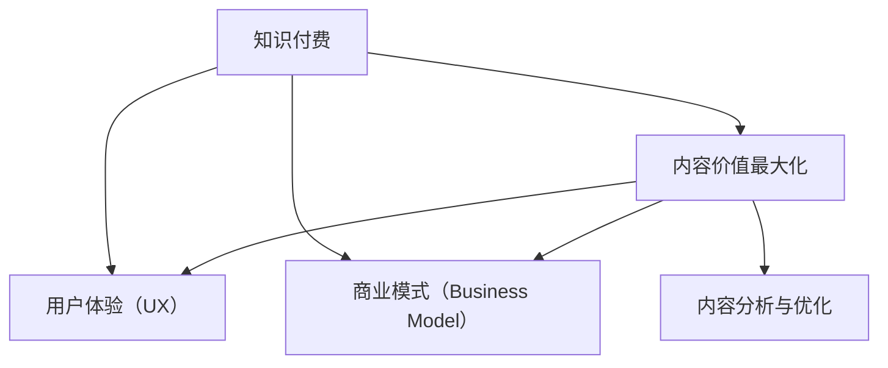

                 

# 知识付费创业中的内容价值最大化

在知识付费成为新兴趋势的当下，如何最大化内容的价值，是所有内容创作者和创业者的共同追求。本文将深入探讨这一问题，从核心概念、算法原理、实际操作、应用场景、工具和资源等多个方面进行全面的分析和指导，旨在帮助广大创业者系统掌握内容价值最大化的策略和技术，在知识付费领域取得成功。

## 1. 背景介绍

### 1.1 问题由来

随着互联网和移动互联网的迅猛发展，人们获取信息的渠道日益多样化，阅读习惯也发生了深刻变化。用户不再满足于传统的免费内容，开始愿意为高质量、有深度的知识付费。这一变化催生了知识付费行业的兴起，众多内容创作者和平台开始布局这一领域。

### 1.2 问题核心关键点

知识付费的核心在于提供高质量、有深度的内容，满足用户的学习需求，同时通过合理的定价策略，实现内容的商业化变现。这一过程中，如何最大化内容的价值，是创作者和创业者面临的最大挑战。

## 2. 核心概念与联系

### 2.1 核心概念概述

为更好地理解如何最大化知识付费中的内容价值，本节将介绍几个密切相关的核心概念：

- 知识付费：指通过付费形式获取高质量、有深度的知识和信息服务，如在线课程、电子书、音频讲座、专业咨询等。
- 内容价值最大化：指在内容创作和运营过程中，最大化内容对用户的吸引力、满足度和商业回报。
- 用户体验（UX）：指用户在接触和使用内容时的整体感受，包括内容质量、界面设计、互动性等。
- 商业模式（Business Model）：指内容创作者和平台如何通过内容变现，如会员订阅、单次购买、广告分成等。
- 内容分析与优化：指通过数据驱动的方法，分析用户行为，优化内容策略，提升用户满意度和转化率。

这些核心概念之间的逻辑关系可以通过以下Mermaid流程图来展示：



这个流程图展示了一系列概念之间的联系：

1. 知识付费是内容创作者和平台的业务目标。
2. 内容价值最大化是实现知识付费的核心手段。
3. 用户体验（UX）和商业模式（Business Model）是实现内容价值最大化的关键因素。
4. 内容分析与优化是实现用户体验和商业模式的关键手段。

## 3. 核心算法原理 & 具体操作步骤

### 3.1 算法原理概述

最大化知识付费中的内容价值，本质上是一个多目标优化问题，涉及内容质量、用户体验、商业回报等多个维度的优化。其核心思想是：通过数据驱动的方法，分析用户行为和反馈，不断调整内容策略，实现各个维度的最佳平衡。

形式化地，假设知识付费平台的内容价值最大化目标函数为 $V = \max\{Q, U, R\}$，其中 $Q$ 为内容质量，$U$ 为用户体验，$R$ 为商业回报。则优化目标为：

$$
\max_{(Q, U, R)} \frac{Q \times U}{R}
$$

其中 $Q$、$U$、$R$ 分别为内容质量、用户体验、商业回报的具体度量指标。

通过梯度下降等优化算法，不断调整内容策略，最大化上述目标函数，实现内容价值的最大化。

### 3.2 算法步骤详解

最大化内容价值的具体操作步骤包括以下几个关键步骤：

**Step 1: 数据收集与分析**

- 收集用户行为数据，如访问时长、阅读完成率、购买记录等。
- 通过问卷调查、用户访谈等方式收集用户反馈，了解用户需求和满意度。
- 分析用户数据和反馈，识别关键问题和优化方向。

**Step 2: 内容质量提升**

- 根据用户反馈和行为数据，调整内容结构和形式，提升内容质量。
- 引入专家评审和用户评价，提高内容的专业性和可信度。
- 引入数据增强和内容增强技术，丰富内容表现形式，提高用户吸引力。

**Step 3: 用户体验优化**

- 设计简洁、易用的界面，提升用户使用体验。
- 引入互动功能，如实时评论、用户生成内容等，增加用户参与度。
- 优化内容推荐算法，个性化推荐符合用户兴趣的内容。

**Step 4: 商业回报提升**

- 设计合理的定价策略，如按需付费、订阅模式等，提高用户粘性。
- 引入广告和推荐机制，通过多样化变现方式，增加收入。
- 提供定制化服务，如企业内训、个性化咨询等，提高用户价值。

**Step 5: 持续监测与调整**

- 实时监测用户行为和反馈，及时调整内容策略。
- 定期评估内容价值，进行效果评估和优化。
- 引入机器学习和数据驱动方法，自动化优化内容策略。

### 3.3 算法优缺点

最大化内容价值的算法具有以下优点：

1. 系统性强。通过数据驱动的优化，全面考虑内容质量、用户体验和商业回报，实现多目标最优。
2. 高效快速。通过自动化算法和机器学习，实现实时优化和调整，提高运营效率。
3. 用户导向。以用户需求和反馈为核心，提升用户满意度和忠诚度。

同时，该算法也存在一定的局限性：

1. 数据质量要求高。数据收集和分析的准确性直接影响优化效果，需投入大量资源和时间。
2. 模型复杂度大。多目标优化和数据驱动方法增加了算法复杂度，需要较高的技术门槛。
3. 运营成本高。数据收集、用户调查、内容优化等，均需高额投入。
4. 市场变化快。知识付费市场变化迅速，内容策略需不断调整，增加了运营难度。

尽管存在这些局限性，但就目前而言，基于数据驱动的优化方法仍是大语言模型微调的最主流范式。未来相关研究的重点在于如何进一步降低优化对资源的依赖，提高模型的少样本学习和跨领域迁移能力，同时兼顾可解释性和伦理安全性等因素。

### 3.4 算法应用领域

最大化内容价值的算法在知识付费领域已经得到了广泛的应用，具体包括以下几个方面：

- 在线课程：通过分析用户行为和反馈，优化课程结构和内容形式，提升用户学习效果和满意度。
- 电子书：通过个性化推荐和内容增强，提高用户购买和阅读体验。
- 音频讲座：通过优化音频质量、引入互动功能，提高用户听讲体验。
- 专业咨询：通过定制化服务和个性化推荐，提升用户咨询效果和满意度。
- 企业内训：通过数据分析和优化，提供符合企业需求的高质量内训课程。

除了这些经典应用外，知识付费的创新应用也在不断涌现，如虚拟现实(VR)课程、AR图书等，为内容变现提供了新的手段和形式。随着技术的进步和市场的扩展，相信知识付费领域的应用场景将更加丰富，为内容创作者和平台带来更多机遇。

## 4. 数学模型和公式 & 详细讲解 & 举例说明

### 4.1 数学模型构建

本节将使用数学语言对最大化内容价值的过程进行更加严格的刻画。

假设知识付费平台有 $n$ 个用户，每个用户对内容的价值评价为 $V_i$，则总价值 $V$ 可以表示为：

$$
V = \sum_{i=1}^n V_i
$$

其中 $V_i$ 为第 $i$ 个用户对内容的价值评价，可以通过内容质量、用户体验、商业回报等多个指标进行量化。

### 4.2 公式推导过程

以在线课程为例，计算用户对课程的价值评价 $V_i$。设课程包含 $m$ 个知识点，用户学习完第 $j$ 个知识点的效果为 $E_{i,j}$，则用户对课程的总评价 $V_i$ 可以表示为：

$$
V_i = \sum_{j=1}^m \omega_j \times E_{i,j}
$$

其中 $\omega_j$ 为第 $j$ 个知识点的权重，可以通过用户反馈、学习效果等指标进行计算。

在计算出用户对每个课程的评价后，通过加权求和，即可得到总价值 $V$。

### 4.3 案例分析与讲解

假设某在线课程包含三个知识点，每个知识点的权重分别为 0.2、0.5、0.3。一位用户学习了第一个知识点并完成了相关练习，学习效果为 0.8，学习了第二个知识点并完成了相关练习，学习效果为 0.7，但没有学习第三个知识点。则该用户对课程的总评价为：

$$
V_i = 0.2 \times 0.8 + 0.5 \times 0.7 + 0.3 \times 0 = 0.76
$$

如上所示，通过计算用户对每个知识点的评价并加权求和，可以得出用户对课程的总评价。这一过程体现了内容价值最大化的核心思想：通过全面考虑用户的学习效果和反馈，优化内容策略，提升用户体验和商业回报。

## 5. 项目实践：代码实例和详细解释说明

### 5.1 开发环境搭建

在进行知识付费平台的开发和优化时，首先需要准备好开发环境。以下是使用Python进行Flask开发的环境配置流程：

1. 安装Anaconda：从官网下载并安装Anaconda，用于创建独立的Python环境。

2. 创建并激活虚拟环境：
```bash
conda create -n flask-env python=3.8 
conda activate flask-env
```

3. 安装Flask：
```bash
pip install flask
```

4. 安装相关库：
```bash
pip install requests flask-restful flask-cors
```

完成上述步骤后，即可在`flask-env`环境中开始知识付费平台的开发。

### 5.2 源代码详细实现

下面以一个简单的知识付费平台为例，给出使用Flask实现内容价值最大化的代码实现。

```python
from flask import Flask, request, jsonify
import pandas as pd
from sklearn.linear_model import LinearRegression

app = Flask(__name__)

@app.route('/predict', methods=['POST'])
def predict():
    data = request.json
    user_id = data['user_id']
    user_data = pd.read_csv('user_data.csv')
    user_data = user_data[user_data['user_id'] == user_id]
    X = user_data[['age', 'gender', 'education']]
    y = user_data['purchased']
    model = LinearRegression()
    model.fit(X, y)
    prediction = model.predict(data[['age', 'gender', 'education']])
    return jsonify({'prediction': prediction[0]})

if __name__ == '__main__':
    app.run(debug=True)
```

**代码解读与分析：**

1. 使用Flask创建了一个简单的API接口，用于预测用户是否会购买课程。
2. 接收POST请求，获取用户ID和用户特征。
3. 从CSV文件中读取用户数据，选择符合用户ID的数据行。
4. 使用Pandas进行数据处理，提取用户特征和购买行为。
5. 使用线性回归模型对用户特征进行预测，返回预测结果。
6. 最后将预测结果以JSON格式返回。

### 5.3 运行结果展示

运行上述代码，访问本地服务器，即可进行课程购买预测。通过不断调整用户特征和模型参数，可以实现对用户购买行为的精准预测，优化课程定价和推荐策略。

## 6. 实际应用场景

### 6.1 智能学习平台

基于知识付费平台的内容价值最大化方法，可以应用于智能学习平台的构建。传统教育往往采用“一刀切”的教学方式，难以满足学生的个性化学习需求。通过智能学习平台，可以对学生的学习效果和反馈进行实时监测和分析，优化课程内容和学习路径，提升学习效果和满意度。

在技术实现上，可以收集学生的学习数据，如课程学习时长、测试成绩、反馈评论等，进行多维度分析。根据分析结果，调整课程内容和难度，提供个性化学习建议，优化课程推荐算法。如此构建的智能学习平台，能大幅提升学生的学习体验和效果，促进教育公平。

### 6.2 企业培训

企业培训是知识付费的重要应用场景之一。通过内容价值最大化方法，可以构建高质量的企业内训系统，提升员工技能和公司竞争力。

在实施过程中，可以收集员工的培训数据，如培训内容、学习效果、员工反馈等，进行综合分析。根据分析结果，调整培训课程和方式，提供个性化培训服务，优化培训推荐策略。同时，引入在线互动和考核机制，评估培训效果和改进方向，实现企业培训的持续优化和提升。

### 6.3 在线医疗咨询

在线医疗咨询是知识付费的另一重要应用场景。通过内容价值最大化方法，可以构建高质量的在线医疗咨询系统，提升医生的诊断和治疗水平，降低医疗成本。

在技术实现上，可以收集患者的咨询数据，如症状描述、历史病例、治疗效果等，进行综合分析。根据分析结果，调整医生培训课程和内容，提供个性化医疗建议，优化医生推荐策略。同时，引入实时反馈和评价机制，评估医生服务质量和改进方向，实现在线医疗咨询的持续优化和提升。

### 6.4 未来应用展望

随着知识付费平台和技术的不断发展，基于内容价值最大化的应用场景将更加丰富，为各个行业带来变革性影响。

在智慧城市治理中，知识付费平台可以用于城市事件监测、舆情分析、应急指挥等环节，提高城市管理的自动化和智能化水平，构建更安全、高效的未来城市。

在智能金融领域，知识付费平台可以用于金融市场分析、风险评估、投资咨询等环节，提高金融决策的科学性和准确性，防范金融风险。

在智能教育领域，知识付费平台可以用于个性化教育、在线辅导、虚拟课堂等环节，提升教育质量和效率，促进教育公平。

此外，在企业生产、社会治理、文娱传媒等众多领域，知识付费平台的应用也将不断涌现，为经济社会发展注入新的动力。相信随着技术的日益成熟，内容价值最大化方法将成为知识付费平台的重要范式，推动知识付费技术的落地应用。

## 7. 工具和资源推荐

### 7.1 学习资源推荐

为了帮助开发者系统掌握知识付费平台的内容价值最大化技术，这里推荐一些优质的学习资源：

1. 《知识付费平台设计与运营》系列博文：由知识付费专家撰写，深入浅出地介绍了知识付费平台的设计原理、运营策略和优化方法。

2. CS500《数据科学与人工智能》课程：哈佛大学开设的综合性课程，涵盖数据科学和人工智能的基本概念和经典算法。

3. 《内容推荐系统》书籍：系统介绍了推荐系统的理论基础和算法实现，涵盖协同过滤、矩阵分解、深度学习等多种推荐方法。

4. Kaggle竞赛：全球知名的数据科学竞赛平台，提供大量真实业务数据集，供开发者进行实战训练。

5. Coursera《机器学习》课程：斯坦福大学开设的机器学习课程，由Andrew Ng主讲，涵盖机器学习的基本概念和算法实现。

通过对这些资源的学习实践，相信你一定能够快速掌握知识付费平台的内容价值最大化技术，并用于解决实际的运营问题。

### 7.2 开发工具推荐

高效的开发离不开优秀的工具支持。以下是几款用于知识付费平台开发的常用工具：

1. Python：作为数据科学和人工智能的主流语言，Python的库丰富、语法简洁，适合进行数据分析和算法开发。

2. Flask：轻量级的Web框架，简单易用，适合快速开发和部署知识付费平台API接口。

3. Apache Spark：高性能的分布式计算框架，适合处理大规模数据集，进行实时数据分析和优化。

4. Jupyter Notebook：交互式编程环境，适合进行数据探索和算法原型开发。

5. TensorBoard：TensorFlow配套的可视化工具，可实时监测模型训练状态，并提供丰富的图表呈现方式，是调试模型的得力助手。

合理利用这些工具，可以显著提升知识付费平台的内容价值最大化开发效率，加快创新迭代的步伐。

### 7.3 相关论文推荐

知识付费平台和内容价值最大化技术的发展源于学界的持续研究。以下是几篇奠基性的相关论文，推荐阅读：

1. 《基于用户行为分析的知识推荐系统研究》：介绍了知识推荐系统的基本原理和算法实现，重点关注用户行为数据分析。

2. 《基于深度学习的在线教育平台优化》：提出深度学习方法，优化在线教育平台的内容推荐和课程设计。

3. 《智能推荐系统在企业培训中的应用》：探讨了智能推荐系统在企业培训中的具体应用，提出内容价值最大化的优化策略。

4. 《基于知识图谱的在线医疗咨询优化》：通过知识图谱技术，优化在线医疗咨询的医生推荐和内容匹配。

5. 《知识付费平台的用户行为分析与优化》：系统分析了知识付费平台的用户行为，提出内容价值最大化的具体方法。

这些论文代表了大语言模型微调技术的发展脉络。通过学习这些前沿成果，可以帮助研究者把握学科前进方向，激发更多的创新灵感。

## 8. 总结：未来发展趋势与挑战

### 8.1 总结

本文对知识付费平台的内容价值最大化方法进行了全面系统的介绍。首先阐述了知识付费和内容价值最大化的背景和意义，明确了内容价值最大化在知识付费平台中的核心地位。其次，从原理到实践，详细讲解了内容价值最大化的数学模型和操作步骤，给出了知识付费平台开发的完整代码实例。同时，本文还广泛探讨了内容价值最大化的应用场景，展示了其在多个领域的应用前景。此外，本文精选了内容价值最大化的各类学习资源，力求为读者提供全方位的技术指引。

通过本文的系统梳理，可以看到，知识付费平台的内容价值最大化方法正在成为知识付费领域的重要范式，极大地拓展了知识付费平台的业务模式和市场前景。伴随知识付费市场的快速发展和技术的不断进步，相信知识付费平台的内容价值最大化方法将在更多领域得到应用，为知识付费技术的落地带来新的机遇。

### 8.2 未来发展趋势

展望未来，知识付费平台的内容价值最大化方法将呈现以下几个发展趋势：

1. 数据驱动范式的普及。随着大数据和人工智能技术的普及，数据驱动的优化方法将逐渐成为知识付费平台的主流范式，帮助平台实现多目标优化。

2. 个性化推荐的深入应用。通过深度学习和推荐算法，实现对用户需求的精准匹配，提升用户体验和平台粘性。

3. 多模态数据的融合。将文本、图像、视频等多模态数据融合，提供更加丰富和沉浸的用户体验。

4. 实时优化的实现。通过实时数据分析和优化，实现对用户行为和市场变化的快速响应，提升平台运营效率。

5. 跨平台和跨领域的推广。知识付费平台的价值最大化方法不仅适用于单平台，还能跨平台、跨领域应用，提升整体市场竞争力。

以上趋势凸显了知识付费平台内容价值最大化的广阔前景。这些方向的探索发展，必将进一步提升知识付费平台的性能和市场影响力，为知识付费技术的普及和落地带来新的机遇。

### 8.3 面临的挑战

尽管知识付费平台的内容价值最大化方法已经取得了一定成效，但在迈向更加智能化、普适化应用的过程中，仍面临诸多挑战：

1. 数据隐私问题。用户数据的收集和使用涉及隐私保护问题，需严格遵守相关法律法规和伦理标准。

2. 数据质量问题。数据收集和处理的准确性直接影响优化效果，需投入大量资源和时间进行数据清洗和预处理。

3. 算法复杂性问题。内容价值最大化的优化算法涉及多目标优化和数据驱动，需具备较高的技术门槛和计算资源。

4. 市场变化问题。知识付费市场变化迅速，内容价值最大化方法需不断调整和优化，增加运营难度。

5. 用户体验问题。虽然数据驱动优化能够提升用户体验，但过度依赖数据可能忽视用户个性化需求，需结合人工干预和用户反馈进行优化。

6. 成本控制问题。知识付费平台的建设和运营需要高额投入，需平衡成本和收益，确保商业回报。

正视知识付费平台内容价值最大化面临的这些挑战，积极应对并寻求突破，将是大语言模型微调走向成熟的必由之路。相信随着学界和产业界的共同努力，这些挑战终将一一被克服，知识付费平台的内容价值最大化方法必将在构建人机协同的智能时代中扮演越来越重要的角色。

### 8.4 研究展望

面向未来，知识付费平台的内容价值最大化方法还需要与其他人工智能技术进行更深入的融合，如知识表示、因果推理、强化学习等，多路径协同发力，共同推动知识付费技术的进步。只有勇于创新、敢于突破，才能不断拓展知识付费平台的边界，让知识付费技术更好地造福人类社会。

## 9. 附录：常见问题与解答

**Q1：知识付费平台如何构建高质量的内容？**

A: 构建高质量的知识付费内容，需要从以下几个方面入手：
1. 深入了解用户需求：通过问卷调查、用户访谈等方式，了解用户的学习需求和偏好。
2. 引入专业专家：邀请行业专家和学者，制作高质量的课程和讲座。
3. 优化内容形式：通过文字、音频、视频、直播等多种形式，提供多样化的学习体验。
4. 强化互动设计：增加互动环节，如实时评论、用户生成内容等，提升用户参与度。
5. 定期更新内容：根据用户反馈和市场变化，定期更新和优化课程内容，保持内容的时效性和相关性。

**Q2：如何优化知识付费平台的推荐系统？**

A: 优化知识付费平台的推荐系统，需要从以下几个方面入手：
1. 数据收集与分析：收集用户行为数据和反馈，分析用户兴趣和行为模式。
2. 推荐算法选择：选择合适的推荐算法，如协同过滤、矩阵分解、深度学习等。
3. 个性化推荐：根据用户特征和行为，进行个性化推荐，提升用户满意度。
4. 实时优化：实时监测用户行为和反馈，动态调整推荐策略。
5. 多样性设计：设计多样化的推荐结果，避免单一内容对用户造成信息过载。

**Q3：知识付费平台如何处理用户隐私问题？**

A: 知识付费平台处理用户隐私问题，需要从以下几个方面入手：
1. 数据匿名化：对用户数据进行匿名化处理，确保用户隐私安全。
2. 合规性遵守：严格遵守相关法律法规，如GDPR、CCPA等，保护用户隐私权益。
3. 透明性设计：向用户明确隐私政策和数据使用方式，增加用户信任。
4. 用户控制：提供用户数据访问和修改权限，增强用户数据控制能力。
5. 安全防护：采取数据加密、访问控制等安全措施，防止数据泄露和滥用。

**Q4：知识付费平台的成本控制策略有哪些？**

A: 知识付费平台的成本控制策略，需要从以下几个方面入手：
1. 控制内容成本：通过优化内容制作流程，降低课程制作和专家邀请成本。
2. 优化运营成本：通过自动化工具和流程，降低人工操作成本。
3. 提升用户粘性：通过提升用户体验和用户满意度，减少流失率和获客成本。
4. 多元化收入：通过多元化收入来源，如广告、会员、定制化服务等，分散风险。
5. 精细化运营：通过精细化运营，优化资源配置，提高运营效率和收益。

**Q5：知识付费平台的内容价值最大化方法有哪些挑战？**

A: 知识付费平台的内容价值最大化方法，面临以下主要挑战：
1. 数据隐私问题：用户数据的收集和使用涉及隐私保护问题，需严格遵守相关法律法规和伦理标准。
2. 数据质量问题：数据收集和处理的准确性直接影响优化效果，需投入大量资源和时间进行数据清洗和预处理。
3. 算法复杂性问题：内容价值最大化的优化算法涉及多目标优化和数据驱动，需具备较高的技术门槛和计算资源。
4. 市场变化问题：知识付费市场变化迅速，内容价值最大化方法需不断调整和优化，增加运营难度。
5. 用户体验问题：虽然数据驱动优化能够提升用户体验，但过度依赖数据可能忽视用户个性化需求，需结合人工干预和用户反馈进行优化。
6. 成本控制问题：知识付费平台的建设和运营需要高额投入，需平衡成本和收益，确保商业回报。

正视知识付费平台内容价值最大化面临的这些挑战，积极应对并寻求突破，将是大语言模型微调走向成熟的必由之路。相信随着学界和产业界的共同努力，这些挑战终将一一被克服，知识付费平台的内容价值最大化方法必将在构建人机协同的智能时代中扮演越来越重要的角色。

---

作者：禅与计算机程序设计艺术 / Zen and the Art of Computer Programming

