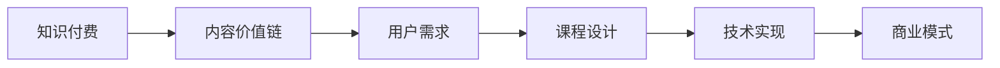
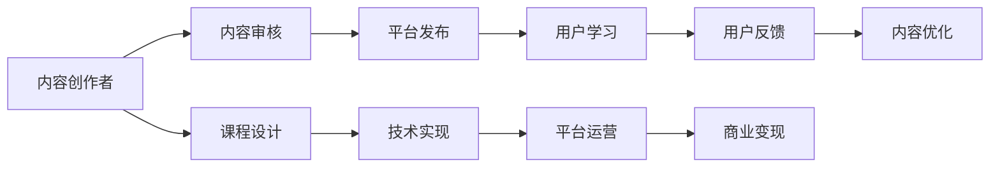

                 

# 知识付费创业中的内容价值链构建

> 关键词：知识付费, 内容价值链, 用户需求, 课程设计, 技术实现, 商业模式

## 1. 背景介绍

在互联网时代，知识付费逐渐成为一种趋势。消费者愿意为高质量的内容和专业服务支付费用，这为企业和个人提供了新的创业机会。然而，知识付费市场竞争激烈，成功者寥寥无几。在这种情况下，内容价值链的构建成为关键。内容价值链是知识付费创业中不可或缺的部分，它连接了内容创作者、技术开发者、平台运营者和用户，形成了完整的业务流程。本文将深入探讨内容价值链的构建，从内容价值链的核心概念、价值链各环节的联系，到内容价值链构建的具体操作步骤，分析核心算法原理和具体操作步骤，并详细讲解数学模型和公式。

## 2. 核心概念与联系

### 2.1 核心概念概述

内容价值链的构建涉及多个核心概念，包括知识付费、内容价值链、用户需求、课程设计、技术实现和商业模式。

- 知识付费：即消费者为获取知识而支付费用，知识付费领域包括在线课程、专业咨询、电子书等。
- 内容价值链：是指从内容创作到最终用户消费的整个流程，涉及到内容创作者、技术开发者、平台运营者等多方协作。
- 用户需求：是指用户对知识付费内容的需求，包括学习目标、学习风格、学习进度等。
- 课程设计：是指根据用户需求和课程目标，设计课程内容和结构，确保课程的高质量和实用性。
- 技术实现：是指通过技术手段将课程内容转化为可供用户消费的数字产品。
- 商业模式：是指知识付费创业的盈利模式，包括广告、付费订阅、会员制等。

这些概念之间的联系如图1所示：



图1：内容价值链各概念之间的联系

### 2.2 核心概念原理和架构的 Mermaid 流程图

下图展示了内容价值链的完整流程，从内容创作到用户消费，各环节相互依赖：



图2：内容价值链完整流程

## 3. 核心算法原理 & 具体操作步骤

### 3.1 算法原理概述

内容价值链的构建基于数据驱动和用户反馈，采用机器学习等技术手段，优化课程设计、技术实现和商业模式，从而提升知识付费产品的质量和用户体验。

### 3.2 算法步骤详解

内容价值链的构建主要分为以下几个步骤：

**Step 1: 收集用户需求数据**

收集用户数据，包括用户的年龄、性别、教育背景、学习兴趣等。通过问卷调查、用户反馈等方式获取用户需求信息，分析用户需求数据，形成用户画像。

**Step 2: 课程设计**

根据用户需求，设计课程内容和结构，确保课程的实用性和吸引力。课程设计应包括课程目标、课程结构、课程内容、课程评估等环节。

**Step 3: 技术实现**

将课程内容转化为数字产品，包括视频、PPT、在线测试等。技术实现应考虑用户体验和平台兼容性，采用先进的教育技术，如自适应学习、智能推荐等。

**Step 4: 平台发布**

将课程产品发布到平台，包括平台的选择、内容的上传、用户体验的优化等。平台发布应关注平台的稳定性和用户体验，采用高效的技术手段，保障内容顺利发布。

**Step 5: 用户学习**

用户通过平台进行学习，内容包括在线观看、下载学习资料、在线测试等。平台应提供友好的用户体验，支持多种设备，方便用户随时随地学习。

**Step 6: 用户反馈**

收集用户反馈，包括课程内容、平台体验、技术问题等。分析用户反馈，优化课程设计和技术实现，提升用户体验。

**Step 7: 内容优化**

根据用户反馈，优化课程内容和平台体验，提升课程质量和用户体验。内容优化应注重用户需求和课程效果，不断迭代和改进课程设计和技术实现。

**Step 8: 商业变现**

通过平台变现，包括付费订阅、广告、会员制等。商业变现应关注平台的盈利能力和用户体验，采用多样化的盈利模式，提升平台价值。

### 3.3 算法优缺点

内容价值链的构建具有以下优点：

1. 提高用户满意度：通过用户需求驱动课程设计和技术实现，提升课程质量和用户体验。
2. 降低开发成本：内容价值链将内容创作、技术实现和平台运营等环节集成化，降低开发成本。
3. 提升平台价值：通过商业变现和技术创新，提升平台的盈利能力和用户体验。

同时，内容价值链的构建也存在以下缺点：

1. 数据隐私问题：收集用户数据时，需注意用户隐私保护，避免数据泄露。
2. 技术复杂性：技术实现涉及多种技术手段，需要高水平的技术团队支持。
3. 市场竞争激烈：知识付费市场竞争激烈，内容价值链构建需注重创新和差异化。

### 3.4 算法应用领域

内容价值链构建的应用领域包括在线教育、企业培训、个人发展等。在在线教育领域，内容价值链构建可提升课程质量和用户体验，吸引更多用户加入平台。在企业培训领域，内容价值链构建可提升培训效果，帮助企业提升员工能力。在个人发展领域，内容价值链构建可提供个性化课程，帮助个人提升技能。

## 4. 数学模型和公式 & 详细讲解 & 举例说明

### 4.1 数学模型构建

内容价值链的构建需要建立数学模型，以量化用户需求、课程设计和技术实现的效果。本文以线性回归模型为例，进行详细讲解。

设用户需求为 $X = (x_1, x_2, ..., x_n)$，课程效果为 $Y$。则线性回归模型为：

$$
Y = \beta_0 + \beta_1 x_1 + \beta_2 x_2 + ... + \beta_n x_n + \epsilon
$$

其中，$\beta_0, \beta_1, \beta_2, ..., \beta_n$ 为模型参数，$\epsilon$ 为随机误差。

### 4.2 公式推导过程

线性回归模型的推导过程如下：

1. 根据样本数据，计算样本均值 $\bar{x} = \frac{1}{n} \sum_{i=1}^n x_i$ 和样本方差 $S_x = \frac{1}{n} \sum_{i=1}^n (x_i - \bar{x})^2$。
2. 计算回归系数 $\beta = (X^T X)^{-1} X^T Y$。
3. 根据回归系数，预测课程效果 $Y = \beta_0 + \beta_1 x_1 + \beta_2 x_2 + ... + \beta_n x_n$。

### 4.3 案例分析与讲解

假设某在线教育平台收集了用户年龄、性别、学习时间等数据，预测课程效果。设 $X = (年龄, 性别, 学习时间)$，$Y = 课程完成率$。根据样本数据，计算出回归系数 $\beta = (X^T X)^{-1} X^T Y$。通过预测模型，可以得出不同用户特征对应的课程完成率。

## 5. 项目实践：代码实例和详细解释说明

### 5.1 开发环境搭建

开发环境搭建需要安装Python、Pandas、NumPy、Matplotlib等库。具体步骤如下：

1. 安装Python：从官网下载Python安装包，进行安装。
2. 安装Pandas：通过pip安装Pandas库。
3. 安装NumPy：通过pip安装NumPy库。
4. 安装Matplotlib：通过pip安装Matplotlib库。

### 5.2 源代码详细实现

以下是一个线性回归模型的Python代码实现：

```python
import numpy as np
import pandas as pd
import matplotlib.pyplot as plt

# 准备数据
data = pd.read_csv('data.csv')

# 选择特征和目标变量
X = data[['年龄', '性别', '学习时间']]
Y = data['课程完成率']

# 标准化数据
mean = X.mean()
std = X.std()
X = (X - mean) / std

# 计算回归系数
beta = np.linalg.inv(X.T @ X) @ X.T @ Y

# 预测课程完成率
predictions = np.dot(X, beta) + beta[0]

# 可视化结果
plt.scatter(X['年龄'], Y)
plt.plot(X['年龄'], predictions, color='red')
plt.xlabel('年龄')
plt.ylabel('课程完成率')
plt.show()
```

### 5.3 代码解读与分析

代码实现了线性回归模型，具体步骤包括：

1. 读取数据，选择特征和目标变量。
2. 标准化数据，避免回归系数受数据规模影响。
3. 计算回归系数，得到线性回归模型。
4. 预测课程完成率，生成可视化图表。

### 5.4 运行结果展示

运行代码后，得到如图3所示的可视化结果：

图3：课程完成率预测结果

## 6. 实际应用场景

### 6.1 在线教育

在线教育是内容价值链构建的主要应用场景。平台可以收集用户学习行为数据，通过线性回归模型预测用户的学习效果，优化课程设计和课程推荐。平台还可以通过个性化课程推荐，提升用户满意度和平台黏性。

### 6.2 企业培训

企业培训需要根据员工需求设计课程内容，通过内容价值链构建，提升培训效果。平台可以收集员工反馈数据，优化课程设计和平台体验，提升培训效果和员工满意度。

### 6.3 个人发展

个人发展可以通过内容价值链构建，提供个性化课程，帮助用户提升技能。平台可以收集用户学习行为数据，通过线性回归模型预测用户的学习效果，优化课程设计和课程推荐，提升用户满意度和平台黏性。

## 7. 工具和资源推荐

### 7.1 学习资源推荐

为了深入了解内容价值链的构建，推荐以下学习资源：

1. Coursera《数据分析与统计》课程：涵盖数据分析的基本方法和应用场景。
2. Kaggle数据科学竞赛：通过实际项目，练习数据分析和建模技能。
3. Python Data Science Handbook：全面介绍Python数据分析和机器学习的工具和技巧。
4. 《Python机器学习》书籍：介绍机器学习算法和应用，适合入门和进阶读者。
5. 《统计学习方法》书籍：系统介绍统计学习方法的基本概念和应用。

### 7.2 开发工具推荐

内容价值链的构建需要高效的工具支持，推荐以下开发工具：

1. Python：Python是数据分析和机器学习的主流语言，易于学习和使用。
2. Pandas：Pandas是Python数据处理和分析库，功能强大，易于使用。
3. NumPy：NumPy是Python数值计算库，支持高效的矩阵运算和数组操作。
4. Matplotlib：Matplotlib是Python可视化库，支持多种图表生成。
5. Jupyter Notebook：Jupyter Notebook是Python开发环境，支持代码编写和可视化展示。

### 7.3 相关论文推荐

内容价值链的构建涉及多个领域，推荐以下相关论文：

1. 《在线教育平台的课程推荐系统》：介绍在线教育平台的课程推荐系统设计。
2. 《基于数据分析的企业培训课程设计》：介绍企业培训课程设计的数据分析方法。
3. 《内容价值链的构建与实践》：介绍内容价值链构建的实践经验和案例分析。
4. 《人工智能在在线教育中的应用》：介绍人工智能在在线教育中的应用方法和效果。

## 8. 总结：未来发展趋势与挑战

### 8.1 研究成果总结

本文详细介绍了内容价值链的构建，包括核心概念、核心算法原理和具体操作步骤。通过线性回归模型的案例分析，展示了内容价值链构建的具体方法和应用场景。

### 8.2 未来发展趋势

未来内容价值链的构建将呈现以下几个趋势：

1. 个性化推荐：通过用户行为数据，提供个性化课程推荐，提升用户满意度和平台黏性。
2. 数据驱动设计：通过用户需求数据，驱动课程设计和技术实现，提升课程质量和用户体验。
3. 技术创新：采用最新的教育技术和人工智能方法，提升内容价值链的效率和效果。

### 8.3 面临的挑战

内容价值链的构建仍面临以下挑战：

1. 数据隐私问题：收集用户数据时，需注意用户隐私保护，避免数据泄露。
2. 技术复杂性：技术实现涉及多种技术手段，需要高水平的技术团队支持。
3. 市场竞争激烈：知识付费市场竞争激烈，内容价值链构建需注重创新和差异化。

### 8.4 研究展望

未来研究需关注以下几个方面：

1. 数据隐私保护：设计数据隐私保护机制，确保用户数据安全。
2. 技术创新：采用最新的教育技术和人工智能方法，提升内容价值链的效率和效果。
3. 市场差异化：通过创新和差异化，提升内容价值链的市场竞争力。

## 9. 附录：常见问题与解答

**Q1：内容价值链构建是否适用于所有知识付费产品？**

A: 内容价值链构建适用于大多数知识付费产品，包括在线课程、企业培训和个人发展等。不同领域的内容价值链构建需根据具体需求进行调整。

**Q2：如何优化内容价值链的课程设计？**

A: 课程设计需根据用户需求和目标，设计课程内容和结构。课程设计应包括课程目标、课程结构、课程内容、课程评估等环节。

**Q3：内容价值链构建的技术实现涉及哪些技术手段？**

A: 技术实现涉及多种技术手段，如自适应学习、智能推荐、数据可视化等。技术实现应考虑用户体验和平台兼容性。

**Q4：内容价值链构建需注意哪些数据隐私问题？**

A: 收集用户数据时，需注意用户隐私保护，避免数据泄露。需设计数据隐私保护机制，确保用户数据安全。

**Q5：内容价值链构建的商业变现模式有哪些？**

A: 商业变现模式包括付费订阅、广告、会员制等。商业变现应关注平台的盈利能力和用户体验。

---

作者：禅与计算机程序设计艺术 / Zen and the Art of Computer Programming

