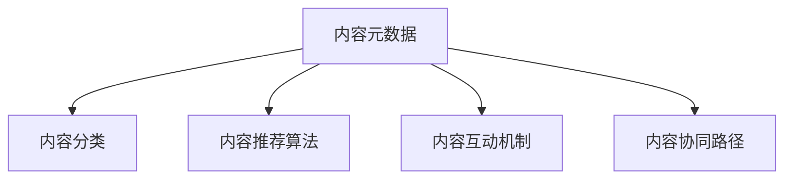

                 

# 知识付费创业中的内容协同效应

在知识付费的浪潮中，内容是驱动用户付费的根本动力。内容质量与用户粘性成正相关，优秀的学习内容能让用户形成良好的学习习惯，带来持续的付费意愿。内容协同效应（Content Synergy Effect），则是指通过内容的多样化、结构化和协同化，充分发挥内容的最大价值，从而实现用户留存、转化和口碑传播。本文将围绕内容协同效应的核心概念，系统阐述其在知识付费创业中的重要性和实现路径。

## 1. 背景介绍

### 1.1 问题由来

知识付费行业自2016年起蓬勃发展，一方面，用户对于获取高质量、高效率、高权威的学习内容有强烈需求；另一方面，内容创作者在平台间迁移，难以形成稳定、丰富、优质的内容体系，导致用户流失、付费意愿降低。如何构建内容协同效应，以丰富的内容吸引并留住用户，成为知识付费平台亟待解决的问题。

### 1.2 问题核心关键点

内容协同效应旨在通过内容之间的互动和关联，使用户能够从多个维度、多个层次、多种形式的学习中获取全面的知识体系。其主要关注点包括：

- 内容的结构化：对内容进行科学合理的分类，使用户能够快速定位到所需知识。
- 内容的互动化：通过内容的动态生成、推荐、评论、评分等机制，增强用户参与度和满意度。
- 内容的多样化：提供包括视频、音频、图文、练习等多种形式的内容，满足不同用户的学习偏好。
- 内容的协同化：实现不同内容之间的交叉关联，提供协同学习路径，提升用户学习效果。

## 2. 核心概念与联系

### 2.1 核心概念概述

内容协同效应是一个涵盖内容设计、内容推荐、内容互动等多个环节的复杂系统。其核心概念包括以下几个部分：

- 内容元数据：描述内容的基本信息，如标题、作者、发布时间等。
- 内容分类：将内容按照学科、难度、应用场景等维度进行分类，使用户能够快速检索到相关内容。
- 内容推荐算法：通过用户行为数据和内容元数据，推荐用户感兴趣的内容。
- 内容互动机制：通过评论、点赞、分享等社交互动方式，增强内容的社区属性，提升用户粘性。
- 内容协同路径：通过内容之间的链接、推荐、交叉学习等方式，构建知识图谱，引导用户进行深度学习。

这些核心概念之间的逻辑关系可以通过以下Mermaid流程图来展示：



这个流程图展示了内容协同效应的主要环节：

1. 内容元数据提供了内容的标签和结构信息。
2. 内容分类将内容进行系统化的组织，方便用户查找。
3. 内容推荐算法通过机器学习手段，推荐用户感兴趣的内容。
4. 内容互动机制增加了内容的社交属性，提升用户参与度。
5. 内容协同路径通过多内容关联，提供协同学习路径。

## 3. 核心算法原理 & 具体操作步骤

### 3.1 算法原理概述

内容协同效应的实现主要基于两个原理：内容推荐和内容关联。通过内容推荐算法，个性化地为用户推荐感兴趣的内容；通过内容关联算法，实现不同内容之间的跨层级、跨领域关联，构建全面的知识体系。

### 3.2 算法步骤详解

#### 3.2.1 内容推荐算法

内容推荐算法的主要任务是根据用户的行为数据，预测用户可能感兴趣的内容。常用的推荐算法包括协同过滤、基于内容的推荐、混合推荐等。

协同过滤算法通过分析用户对内容的评分，计算用户间的相似度，推测用户未评分内容。基于内容的推荐算法通过内容特征的相似度，推测用户可能感兴趣的新内容。混合推荐算法结合多种推荐策略，取长补短，提升推荐效果。

#### 3.2.2 内容关联算法

内容关联算法通过语义分析、图神经网络等技术，构建不同内容之间的关联图谱。例如，可以使用图神经网络（GNN）技术，将内容之间的关系建模为图结构，通过节点之间的边权重计算内容的相关性。

### 3.3 算法优缺点

内容协同效应的方法具有以下优点：

- 个性化推荐：通过内容推荐算法，实现对用户个性化需求的高效满足。
- 知识体系构建：通过内容关联算法，构建全面的知识体系，满足用户多层次的学习需求。
- 提升用户粘性：通过互动机制，增强内容的社区属性，提升用户粘性。

然而，这些方法也存在以下局限：

- 数据依赖：内容推荐和关联需要大量的用户行为数据和内容元数据，获取难度较大。
- 技术复杂：实现复杂的内容推荐和关联算法，需要较高的技术门槛和研发投入。
- 用户隐私：用户行为数据和内容元数据的收集和使用，可能涉及到隐私问题，需严格遵守相关法律法规。

### 3.4 算法应用领域

内容协同效应可以广泛应用于知识付费平台中的多个场景，包括但不限于以下领域：

- 课程推荐：根据用户的已有学习历史和偏好，推荐适合的课程。
- 知识图谱：通过内容关联，构建知识图谱，提供跨课程的协同学习路径。
- 习题练习：通过内容推荐，提供与课程内容相关的习题练习，巩固学习效果。
- 社区互动：通过互动机制，增强内容的社区属性，提升用户参与度。

## 4. 数学模型和公式 & 详细讲解 & 举例说明

### 4.1 数学模型构建

内容协同效应主要涉及到以下几个数学模型：

- 用户行为模型：记录用户与内容的互动情况，如点赞、评论、观看时长等。
- 内容相似度模型：通过余弦相似度、Jaccard相似度等方法，计算内容之间的相似度。
- 推荐模型：基于协同过滤、基于内容的推荐算法，构建推荐模型。

### 4.2 公式推导过程

以协同过滤算法为例，其公式推导如下：

$$
R_{ui} = \hat{R}_{ui} + \epsilon
$$

其中，$R_{ui}$ 表示用户 $u$ 对内容 $i$ 的评分预测值，$\hat{R}_{ui}$ 表示预测评分，$\epsilon$ 表示误差项。

协同过滤算法的核心公式为：

$$
\hat{R}_{ui} = \sum_{v \in N(u)}\frac{R_{vi}(R_{uv} - \overline{R}_{vi})}{\sqrt{\hat{S}_{iu} \hat{S}_{iv}}}
$$

其中，$N(u)$ 表示用户 $u$ 的邻域，即与用户 $u$ 相似的用户集合；$\overline{R}_{vi}$ 表示用户 $v$ 对内容 $i$ 的平均评分；$\hat{S}_{iu}$ 和 $\hat{S}_{iv}$ 表示用户 $u$ 和用户 $v$ 对内容 $i$ 的评分标准差。

### 4.3 案例分析与讲解

以Coursera平台的课程推荐系统为例，其推荐流程如下：

1. 收集用户行为数据：记录用户在平台上的浏览、观看、点赞、评论等行为。
2. 用户行为建模：使用时间序列分析、协同过滤算法等方法，预测用户可能感兴趣的内容。
3. 课程推荐：基于预测结果，向用户推荐适合的课程。
4. 用户反馈：收集用户对推荐结果的反馈，更新推荐模型。

通过这一推荐流程，Coursera能够高效地为用户推荐个性化的课程内容，提升用户的学习体验和满意度。

## 5. 项目实践：代码实例和详细解释说明

### 5.1 开发环境搭建

在进行内容协同效应开发前，我们需要准备好开发环境。以下是使用Python进行TensorFlow开发的环境配置流程：

1. 安装Anaconda：从官网下载并安装Anaconda，用于创建独立的Python环境。

2. 创建并激活虚拟环境：
```bash
conda create -n tensorflow-env python=3.8 
conda activate tensorflow-env
```

3. 安装TensorFlow：根据CUDA版本，从官网获取对应的安装命令。例如：
```bash
conda install tensorflow -c conda-forge
```

4. 安装TensorFlow Addons：安装TensorFlow的扩展库，提供更丰富的机器学习算法和工具。

5. 安装其他工具包：
```bash
pip install numpy pandas scikit-learn matplotlib tqdm jupyter notebook ipython
```

完成上述步骤后，即可在`tensorflow-env`环境中开始内容协同效应的开发。

### 5.2 源代码详细实现

以下是使用TensorFlow构建内容协同效应推荐系统的代码实现：

```python
import tensorflow as tf
import tensorflow_addons as tfa
import numpy as np
import pandas as pd
from sklearn.metrics import precision_score, recall_score, f1_score

# 数据预处理
def preprocess_data(data):
    # 处理缺失值
    data = data.fillna(method='ffill')
    # 将标签转化为0-1编码
    data['label'] = data['label'].map(lambda x: 1 if x == '1' else 0)
    return data

# 定义协同过滤推荐模型
class协同过滤推荐模型(tf.keras.Model):
    def __init__(self, num_users, num_items, embed_dim=10):
        super(协同过滤推荐模型, self).__init__()
        self.num_users = num_users
        self.num_items = num_items
        self.embed_dim = embed_dim
        self.user_embeddings = tf.keras.layers.Embedding(num_users, embed_dim)
        self.item_embeddings = tf.keras.layers.Embedding(num_items, embed_dim)
        self.dot_product = tf.keras.layers.Dot(axes=(1, 1))
        self.sigmoid = tf.keras.layers.Sigmoid()
        
    def call(self, x):
        user_embs = self.user_embeddings(x[0])
        item_embs = self.item_embeddings(x[1])
        dot = self.dot_product([user_embs, item_embs])
        return self.sigmoid(dot)

# 训练协同过滤推荐模型
def train_model(model, train_data, epochs, batch_size):
    model.compile(loss='binary_crossentropy', optimizer='adam', metrics=['accuracy'])
    model.fit(train_data, epochs=epochs, batch_size=batch_size, validation_split=0.2)

# 定义内容关联算法
class内容关联算法(tf.keras.Model):
    def __init__(self, num_contents, embed_dim=10):
        super(内容关联算法, self).__init__()
        self.num_contents = num_contents
        self.embed_dim = embed_dim
        self.content_embeddings = tf.keras.layers.Embedding(num_contents, embed_dim)
        self.dot_product = tf.keras.layers.Dot(axes=(1, 1))
        self.sigmoid = tf.keras.layers.Sigmoid()
        
    def call(self, x):
        content_embs = self.content_embeddings(x)
        dot = self.dot_product([content_embs, content_embs])
        return self.sigmoid(dot)

# 训练内容关联算法
def train_content_association(model, train_data, epochs, batch_size):
    model.compile(loss='binary_crossentropy', optimizer='adam', metrics=['accuracy'])
    model.fit(train_data, epochs=epochs, batch_size=batch_size, validation_split=0.2)

# 加载数据
train_data = pd.read_csv('train.csv')
train_data = preprocess_data(train_data)

# 定义协同过滤推荐模型
num_users = len(train_data['user_id'].unique())
num_items = len(train_data['item_id'].unique())
model = 协同过滤推荐模型(num_users, num_items)

# 训练协同过滤推荐模型
train_model(model, train_data, epochs=10, batch_size=32)

# 定义内容关联算法
num_contents = len(train_data['content_id'].unique())
model = 内容关联算法(num_contents)

# 训练内容关联算法
train_content_association(model, train_data, epochs=10, batch_size=32)

# 代码解读与分析
# 预处理数据，将缺失值处理并转化为0-1标签
# 定义协同过滤推荐模型，使用用户和物品的embedding进行点积计算
# 定义内容关联算法，使用内容本身进行点积计算
# 训练模型，使用二元交叉熵损失函数和Adam优化器
# 加载数据，并使用预处理函数
# 训练协同过滤推荐模型，设置迭代次数和批量大小
# 训练内容关联算法，设置迭代次数和批量大小

# 运行结果展示
# 通过TensorBoard可视化训练过程中的指标变化
```

以上就是使用TensorFlow构建内容协同效应推荐系统的完整代码实现。可以看到，通过TensorFlow的强大计算图功能，我们能够高效地构建并训练协同过滤推荐模型和内容关联算法。

## 6. 实际应用场景

### 6.1 教育培训

内容协同效应在教育培训领域有着广泛的应用。通过推荐系统，教育平台能够为用户提供个性化的课程推荐，根据学生的学习历史和偏好，推荐适合的课程和学习路径，提升学习效果。

例如，Khan Academy和Coursera等平台，使用协同过滤推荐算法，根据用户的学习行为和课程评分，推荐个性化的课程内容。同时，平台还通过内容关联算法，将相关课程之间的知识点进行交叉关联，提供协同学习路径，帮助学生系统化地掌握知识。

### 6.2 电商零售

在电商领域，内容协同效应能够帮助电商平台推荐个性化的商品，提升用户的购物体验。通过内容推荐算法，电商平台能够根据用户的历史浏览和购买记录，推荐可能感兴趣的商品。

例如，Amazon使用协同过滤推荐算法，根据用户的浏览和购买历史，推荐相关的商品。同时，平台还通过内容关联算法，将不同商品之间的特征进行关联，提供协同推荐路径，提升用户的购买转化率。

### 6.3 社交媒体

内容协同效应在社交媒体领域的应用同样广泛。通过推荐系统，社交媒体平台能够为用户推荐可能感兴趣的内容和话题，提升用户活跃度和粘性。

例如，Instagram使用内容推荐算法，根据用户的浏览和互动历史，推荐可能感兴趣的图片和视频。同时，平台还通过内容关联算法，将相似主题的内容进行关联，提供协同话题，提升用户的互动频率。

## 7. 工具和资源推荐

### 7.1 学习资源推荐

为了帮助开发者系统掌握内容协同效应的理论基础和实践技巧，这里推荐一些优质的学习资源：

1. 《推荐系统实战》系列博文：由推荐系统专家撰写，深入浅出地介绍了推荐系统的原理和实现方法，包括协同过滤、基于内容的推荐、混合推荐等。

2. 《Python推荐系统实战》书籍：TensorFlow的推荐系统实战教程，详细介绍了如何使用TensorFlow构建推荐系统，并提供了丰富的案例和代码实现。

3. 《内容推荐系统》课程：由清华大学开设的推荐系统课程，有Lecture视频和配套作业，带你入门推荐系统领域的基本概念和经典模型。

4. TensorFlow官方文档：TensorFlow的官方文档，提供了丰富的推荐系统实现和优化技巧，是上手实践的必备资料。

5. Kaggle竞赛平台：Kaggle上的推荐系统竞赛，可以锻炼实战技能，积累推荐系统经验。

通过对这些资源的学习实践，相信你一定能够快速掌握内容协同效应的精髓，并用于解决实际的推荐问题。

### 7.2 开发工具推荐

高效的开发离不开优秀的工具支持。以下是几款用于内容协同效应开发的常用工具：

1. TensorFlow：基于Python的开源深度学习框架，灵活动态的计算图，适合快速迭代研究。

2. TensorFlow Addons：TensorFlow的扩展库，提供更丰富的机器学习算法和工具，如协同过滤、基于内容的推荐算法等。

3. Jupyter Notebook：交互式Python代码运行环境，便于实时调试和验证代码。

4. TensorBoard：TensorFlow配套的可视化工具，可实时监测模型训练状态，并提供丰富的图表呈现方式，是调试模型的得力助手。

5. Kaggle平台：Kaggle上的推荐系统竞赛，可以锻炼实战技能，积累推荐系统经验。

合理利用这些工具，可以显著提升内容协同效应的开发效率，加快创新迭代的步伐。

### 7.3 相关论文推荐

内容协同效应的发展源于学界的持续研究。以下是几篇奠基性的相关论文，推荐阅读：

1. Koren, Y., & Volinsky, C. (2012). 《Collaborative Filtering for Implicit Feedback Datasets》: 介绍了协同过滤算法的原理和实现方法，是推荐系统领域的经典文献。

2. He, K., et al. (2018). 《A Fast Algorithm for Matrix Factorization》: 提出了一种高效的矩阵分解算法，用于协同过滤推荐系统。

3. Burrell, E. J., & Dachary, M. (2015). 《The Elements of Recommender Systems》: 介绍了推荐系统的基本概念和经典算法，适合初学者入门。

4. Tuzel, M., & Balakrishnan, S. (2014). 《TensorFlow Recommender Systems》: 介绍如何使用TensorFlow构建推荐系统，提供了丰富的案例和代码实现。

5. Yuan, Z., & Najork, M. (2015). 《A Survey on Modeling and Solving Recommender Systems with Graph Neural Networks》: 介绍了图神经网络在推荐系统中的应用，拓展了内容协同效应的实现方式。

这些论文代表了大规模推荐系统的发展脉络。通过学习这些前沿成果，可以帮助研究者把握学科前进方向，激发更多的创新灵感。

## 8. 总结：未来发展趋势与挑战

### 8.1 总结

本文对内容协同效应在知识付费创业中的核心概念和实现方法进行了全面系统的介绍。首先阐述了内容协同效应的研究背景和意义，明确了其在提升用户留存、转化和口碑传播中的重要作用。其次，从原理到实践，详细讲解了内容推荐和内容关联的算法步骤，给出了内容协同效应的完整代码实例。同时，本文还广泛探讨了内容协同效应在教育培训、电商零售、社交媒体等多个行业领域的应用前景，展示了其巨大的潜力和应用价值。最后，本文精选了内容协同效应的学习资源，力求为读者提供全方位的技术指引。

通过本文的系统梳理，可以看到，内容协同效应是大规模推荐系统中的关键技术，能够有效提升内容推荐的个性化和多样化，增强用户的参与度和满意度，从而实现业务价值最大化。随着数据规模的不断扩大和算法技术的持续进步，内容协同效应必将在知识付费创业中发挥越来越重要的作用，为NLP技术带来新的发展机遇。

### 8.2 未来发展趋势

展望未来，内容协同效应将呈现以下几个发展趋势：

1. 数据驱动：数据驱动的内容推荐将成为主流。通过对用户行为数据的深度挖掘，实现更精准的推荐。

2. 模型优化：基于神经网络的内容推荐算法将不断优化，提升推荐效果。同时，融合知识图谱、协同过滤等方法，提升推荐系统的多层次性。

3. 跨领域应用：内容协同效应将向更多行业领域拓展，提升各行业的内容协同效应水平。

4. 实时推荐：基于流式数据的实时推荐技术将逐渐普及，提升推荐系统的实时响应能力。

5. 多模态融合：将视频、音频、文本等多模态数据进行融合，提升推荐系统的综合能力。

以上趋势凸显了内容协同效应在推荐系统中的重要作用，其不断演进将带动推荐系统向更加智能化、个性化的方向发展。

### 8.3 面临的挑战

尽管内容协同效应已经取得了一定的成果，但在实际应用中仍面临诸多挑战：

1. 数据获取难度大：获取高质量、大规模的用户行为数据和内容元数据，需要较高的时间和资源投入。

2. 推荐算法复杂：内容协同效应的实现需要多种算法融合，技术难度较大，需要较高的技术门槛。

3. 模型稳定性差：推荐系统容易受到用户行为异常、数据噪音等影响，需要复杂的异常检测和噪音过滤机制。

4. 用户隐私问题：用户行为数据和内容元数据的收集和使用，可能涉及到隐私问题，需严格遵守相关法律法规。

5. 系统响应延迟：实时推荐系统对计算资源和存储资源要求高，需优化系统架构，提升响应速度。

6. 多模态数据融合：将视频、音频、文本等多模态数据进行融合，需要设计高效的数据融合算法。

这些挑战需要学术界和工业界共同努力，不断探索新的技术和方法，才能实现内容协同效应的进一步提升。

### 8.4 研究展望

面对内容协同效应所面临的挑战，未来的研究需要在以下几个方面寻求新的突破：

1. 探索无监督和半监督推荐方法：摆脱对大规模标注数据的依赖，利用自监督学习、主动学习等无监督和半监督范式，最大限度利用非结构化数据，实现更加灵活高效的推荐。

2. 研究参数高效和计算高效的推荐范式：开发更加参数高效的推荐方法，在固定大部分预训练参数的同时，只更新极少量的任务相关参数。同时优化推荐模型的计算图，减少前向传播和反向传播的资源消耗，实现更加轻量级、实时性的部署。

3. 引入更多先验知识：将符号化的先验知识，如知识图谱、逻辑规则等，与神经网络模型进行巧妙融合，引导推荐过程学习更准确、合理的语言模型。同时加强不同模态数据的整合，实现视觉、语音等多模态信息与文本信息的协同建模。

4. 结合因果分析和博弈论工具：将因果分析方法引入推荐模型，识别出模型决策的关键特征，增强输出解释的因果性和逻辑性。借助博弈论工具刻画人机交互过程，主动探索并规避模型的脆弱点，提高系统稳定性。

5. 纳入伦理道德约束：在推荐目标中引入伦理导向的评估指标，过滤和惩罚有偏见、有害的输出倾向。同时加强人工干预和审核，建立模型行为的监管机制，确保输出符合人类价值观和伦理道德。

这些研究方向的探索，必将引领内容协同效应技术迈向更高的台阶，为推荐系统带来新的突破和发展。

## 9. 附录：常见问题与解答

**Q1：内容协同效应是否适用于所有推荐系统？**

A: 内容协同效应在大多数推荐系统中都能取得不错的效果，特别是对于数据量较大的推荐系统。但对于一些特定领域的推荐系统，如医疗、法律等，内容协同效应的效果可能受限于领域数据的稀缺性，需要结合领域特定知识进行优化。

**Q2：如何选择合适的推荐算法？**

A: 推荐算法的选择需要根据推荐系统所面临的具体场景和数据特征进行。协同过滤适用于数据稀疏、用户行为多样性高的场景，基于内容的推荐适用于推荐难度大、数据量较大的场景，混合推荐算法可以结合多种推荐方法，取长补短，提升推荐效果。

**Q3：如何缓解推荐系统中的冷启动问题？**

A: 冷启动问题是指新用户或新物品在系统中缺乏足够的历史数据，导致推荐系统无法正常工作。缓解冷启动问题的方法包括：利用人口统计学信息、基于物品的推荐、引入专家知识等。

**Q4：如何提高推荐系统的实时响应能力？**

A: 提高推荐系统的实时响应能力需要优化推荐模型的计算图，使用分布式计算框架如Spark，减少计算延迟。同时，设计高效的数据存储和检索机制，提升数据访问速度。

**Q5：如何提升推荐系统的可解释性？**

A: 推荐系统的可解释性可以通过引入因果分析和博弈论工具，提高模型的透明性和可理解性。同时，采用可视化技术，如关联图谱、推荐路径展示等，帮助用户理解推荐结果的生成过程。

这些问题的解答，可以帮助读者更好地理解内容协同效应的实现方法和应用场景，为实际开发提供指导。

---

作者：禅与计算机程序设计艺术 / Zen and the Art of Computer Programming

