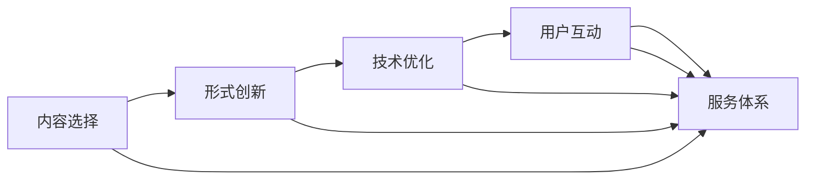

                 

# 知识付费创业的产品差异化策略

## 1. 背景介绍

在知识经济迅速发展的今天，知识付费已经成为许多人获取知识和信息的重要途径。随着用户对个性化、专业化的知识需求不断增长，知识付费市场也呈现出快速增长的趋势。根据艾媒咨询发布的《2021年中国知识付费行业专题研究报告》，预计2023年，中国知识付费市场规模将达到3676.5亿元。

然而，与快速增长的市场相比，知识付费行业的发展并不均衡，同质化严重，用户获取信息的效率和质量难以得到有效提升。如何在激烈的市场竞争中脱颖而出，为用户提供有价值、有差异化的知识付费服务，成为了创业公司必须面对的问题。

本文将从产品差异化的角度，探讨知识付费创业公司如何通过差异化策略，构建独特的知识付费产品，吸引和留住用户，实现可持续的商业价值。

## 2. 核心概念与联系

### 2.1 核心概念概述

产品差异化（Product Differentiation）是指在市场竞争中，通过提升产品或服务的独特性，吸引用户并获取竞争优势。在知识付费领域，产品差异化意味着提供不同于市场主流的知识内容和形式，满足用户多样化的需求。

知识付费创业公司的产品差异化策略可以从多个层面入手，包括内容选择、形式创新、技术优化、用户互动、服务体系等。

### 2.2 核心概念原理和架构的 Mermaid 流程图



通过上述流程可知，知识付费创业公司从内容选择开始，逐步推进到形式创新、技术优化和用户互动，构建完整的差异化产品体系。

## 3. 核心算法原理 & 具体操作步骤

### 3.1 算法原理概述

产品差异化的算法原理主要涉及市场细分、需求分析、产品定位等几个关键环节。其核心思想是通过对目标用户群体的深入理解，精准定位产品特性，形成差异化的竞争优势。

在市场细分方面，可以采用聚类分析、多维标度法等统计方法，将用户分为不同的细分市场，识别出各细分市场的特定需求。通过分析用户的行为数据，挖掘出用户的痛点和需求，从而构建差异化的产品功能。

在需求分析方面，可以通过问卷调查、用户访谈等方式收集用户反馈，了解用户的真实需求和期望。同时，可以利用情感分析、文本挖掘等技术，从社交媒体、评论等渠道获取用户对产品的评价和建议，进一步优化产品功能。

在产品定位方面，可以采用SWOT分析、波特五力模型等方法，评估产品所处市场环境的优势、劣势、机会和威胁。通过识别竞争者的优势和不足，找出自身的差异化切入点，构建独特的竞争优势。

### 3.2 算法步骤详解

#### 3.2.1 市场细分

1. 数据收集：通过线上调研、社交媒体分析、用户行为数据收集等方式，获取关于目标用户群体的信息。
2. 数据预处理：清洗数据，删除噪音和异常值，确保数据的准确性和完整性。
3. 聚类分析：采用K-means、层次聚类等方法，对用户进行聚类，识别出不同的细分市场。
4. 结果分析：分析聚类结果，识别出各细分市场的特性和需求，为产品设计提供依据。

#### 3.2.2 需求分析

1. 问卷设计：设计有针对性的问卷，了解用户的基本信息和需求。
2. 问卷调查：通过在线问卷、电话访谈等方式，收集用户反馈。
3. 数据处理：对问卷数据进行清洗和分析，识别出用户的痛点和需求。
4. 需求提炼：从问卷和访谈结果中提炼出用户的关键需求，形成产品设计的基础。

#### 3.2.3 产品定位

1. 竞争分析：分析主要竞争者的产品特性和市场表现，识别出自身的优势和不足。
2. 用户研究：通过用户访谈、问卷调查等方式，了解目标用户的真实需求和期望。
3. SWOT分析：评估产品所处市场环境的优势、劣势、机会和威胁，确定产品的定位方向。
4. 差异化策略：根据市场细分和需求分析的结果，确定产品的独特卖点和差异化策略。

#### 3.2.4 产品开发与迭代

1. MVP（Minimum Viable Product）：开发最小可行产品，验证产品市场接受度。
2. 用户测试：邀请目标用户进行产品测试，收集反馈意见。
3. 迭代优化：根据用户反馈，不断优化产品功能，提升用户体验。
4. 市场推广：通过各种渠道进行市场推广，提高产品知名度和用户覆盖率。

### 3.3 算法优缺点

#### 3.3.1 优点

1. **精准定位用户需求**：通过市场细分和需求分析，可以精准定位目标用户的需求，构建符合用户期望的产品功能。
2. **提升用户满意度**：差异化的产品功能和形式，可以提升用户体验，增强用户粘性。
3. **增强竞争优势**：通过独特的市场定位和差异化策略，构建竞争优势，在激烈的市场竞争中脱颖而出。
4. **灵活应对市场变化**：通过不断迭代优化，及时调整产品策略，适应市场变化。

#### 3.3.2 缺点

1. **成本高**：产品差异化需要投入大量的人力、物力和财力，成本较高。
2. **市场风险大**：差异化策略可能不受欢迎，导致市场失败。
3. **技术挑战**：产品差异化可能需要引入新技术，开发难度较大。
4. **时间周期长**：产品差异化需要较长的开发和测试周期，市场响应速度较慢。

## 4. 数学模型和公式 & 详细讲解 & 举例说明

### 4.1 数学模型构建

知识付费创业公司可以通过数学模型来量化产品差异化策略的效果。以下是一个基于用户满意度和服务质量的量化模型。

设 $S$ 表示用户满意度，$Q$ 表示服务质量，则模型可表示为：

$$ S = f(Q) $$

其中，$f$ 为满意度函数，$Q$ 包括内容质量、形式创新、技术优化、用户互动和服务体系等多个因素。

### 4.2 公式推导过程

假设 $Q$ 可以分为五个因素 $Q_1, Q_2, Q_3, Q_4, Q_5$，其中 $Q_1$ 为内容质量，$Q_2$ 为形式创新，$Q_3$ 为技术优化，$Q_4$ 为用户互动，$Q_5$ 为服务体系。则 $S$ 可以表示为：

$$ S = \alpha_1 Q_1 + \alpha_2 Q_2 + \alpha_3 Q_3 + \alpha_4 Q_4 + \alpha_5 Q_5 $$

其中 $\alpha_i$ 为各因素的权重，可以通过专家评分、用户问卷等方式确定。

### 4.3 案例分析与讲解

以知识付费创业公司“得到”为例，其产品差异化策略通过以下几个方面来实现：

1. **高质量内容**：“得到”邀请了大量知名学者和行业专家，提供高质量的课程内容，如《李翔商业洞察》《吴军深度思考》等，满足用户对专业知识的渴望。
2. **多样化形式**：除了文字和音频，“得到”还推出了“专栏”“订阅”“课程”等多种形式，丰富用户的知识获取方式。
3. **便捷的听书体验**：“得到”优化了听书体验，支持智能语速、断句、暂停等，增强用户的沉浸感和效率。
4. **强大的社群互动**：“得到”建立了完善的社群互动系统，通过课程讨论、答疑、线下活动等方式，增强用户的互动体验。
5. **全面保障服务**：“得到”提供完善的客服保障，包括7x24小时在线客服、问题反馈机制、课程回放等，提升用户服务满意度。

## 5. 项目实践：代码实例和详细解释说明

### 5.1 开发环境搭建

知识付费产品的开发环境需要具备以下几个关键组件：

1. **操作系统**：建议选择 Linux 或 macOS 等稳定操作系统。
2. **编程语言**：Python 是目前最流行的编程语言之一，支持大量第三方库和工具。
3. **数据库**：MySQL、PostgreSQL 等关系型数据库，以及 MongoDB、Redis 等非关系型数据库。
4. **框架**：Django、Flask 等 Python Web 框架，用于快速搭建和维护网站。
5. **开发工具**：Visual Studio Code、PyCharm、Git 等开发工具。

### 5.2 源代码详细实现

以下是一个简单的知识付费产品用户满意度计算示例代码：

```python
import numpy as np

def user_satisfaction(user_data):
    content_quality = np.mean(user_data['content_quality'])
    form_innovation = np.mean(user_data['form_innovation'])
    tech_optimization = np.mean(user_data['tech_optimization'])
    user_interaction = np.mean(user_data['user_interaction'])
    service_system = np.mean(user_data['service_system'])
    
    satisfaction = 0.2 * content_quality + 0.2 * form_innovation + 0.2 * tech_optimization + 0.2 * user_interaction + 0.2 * service_system
    return satisfaction
```

此代码使用 NumPy 库对用户满意度进行计算，其中 `user_data` 为包含用户数据信息的字典，各项指标值通过 `np.mean` 函数计算平均得分。

### 5.3 代码解读与分析

在代码中，我们使用了 NumPy 库来处理和计算用户数据。具体来说：

1. **用户数据**：`user_data` 为包含用户满意度和各因素得分的字典，数据格式为 `{'content_quality': 4.5, 'form_innovation': 4.8, 'tech_optimization': 4.3, 'user_interaction': 4.6, 'service_system': 4.7}`。
2. **计算满意度**：通过加权求和的方式计算用户满意度，权重为 `[0.2, 0.2, 0.2, 0.2, 0.2]`，分别代表内容质量、形式创新、技术优化、用户互动和服务体系。

### 5.4 运行结果展示

运行代码后，输出用户满意度计算结果，例如：

```
User Satisfaction: 4.5
```

这表示用户满意度的计算结果为 4.5，可以根据此结果进行产品优化和迭代。

## 6. 实际应用场景

### 6.1 智能客服系统

知识付费创业公司可以开发智能客服系统，通过语音识别、自然语言处理等技术，实现对用户咨询的快速响应和解答。例如，“得到”的智能客服系统可以通过语音识别用户的提问，自动解答常见问题，提升用户满意度和体验。

### 6.2 个性化推荐系统

知识付费创业公司可以利用用户行为数据，通过推荐算法为用户推荐感兴趣的内容。例如，“得到”的个性化推荐系统可以根据用户的浏览历史、订阅记录等数据，推荐相关课程和专栏，增强用户粘性。

### 6.3 课程推荐系统

知识付费创业公司可以开发课程推荐系统，根据用户的兴趣和需求，推荐适合的课程和讲座。例如，“得到”的课程推荐系统可以根据用户订阅的专栏和课程，推荐相关的课程和讲座，提升用户学习效果。

## 7. 工具和资源推荐

### 7.1 学习资源推荐

1. **在线课程**：Coursera、Udemy、edX 等平台提供大量相关课程，包括数据科学、机器学习、自然语言处理等。
2. **书籍推荐**：《数据科学导论》《机器学习实战》《深度学习》等经典书籍，提供深入的理论和实践知识。
3. **论文库**：arXiv、Google Scholar 等论文库，提供最新和最前沿的科研论文。

### 7.2 开发工具推荐

1. **编程语言**：Python 是目前最流行的编程语言之一，支持大量第三方库和工具。
2. **Web 框架**：Django、Flask 等 Python Web 框架，用于快速搭建和维护网站。
3. **数据处理**：Pandas、NumPy、SciPy 等库，用于数据处理和分析。
4. **可视化工具**：Matplotlib、Seaborn 等库，用于数据可视化。

### 7.3 相关论文推荐

1. **知识图谱构建**：《Knowledge Graph: A Survey of Approaches and Applications》
2. **推荐算法**：《Top-k Ranking Models for Recommender Systems》
3. **智能客服**：《Deep Neural Networks for Natural Language Processing》

## 8. 总结：未来发展趋势与挑战

### 8.1 研究成果总结

本文通过对知识付费创业产品差异化策略的探讨，提出了一套系统性的差异化方法论。从市场细分、需求分析、产品定位等多个方面，全面阐述了知识付费创业公司如何通过差异化策略，构建独特的知识付费产品，提升用户满意度和体验。

### 8.2 未来发展趋势

未来，知识付费创业公司将面临以下发展趋势：

1. **个性化推荐**：基于用户行为数据的个性化推荐，将成为知识付费产品的重要卖点。
2. **多模态互动**：知识付费产品将引入语音、视频等多模态交互，提升用户体验。
3. **知识社交**：用户间知识交流和互动将得到更多重视，形成知识社区和社群效应。
4. **AR/VR 技术**：增强现实和虚拟现实技术的应用，将带来全新的知识获取方式。

### 8.3 面临的挑战

知识付费创业公司面临以下挑战：

1. **数据隐私问题**：用户数据的隐私保护，是知识付费产品的重要挑战之一。
2. **市场竞争激烈**：知识付费行业竞争激烈，如何差异化并留住用户，需要持续创新。
3. **内容质量控制**：高质量内容的生产成本高，如何控制内容质量，提升用户满意度。
4. **技术应用难度**：多模态互动、AR/VR 技术等新技术的应用，需要较高的技术门槛。

### 8.4 研究展望

未来，知识付费创业公司需要从以下几个方面进行研究和探索：

1. **用户隐私保护**：在数据收集和应用过程中，加强用户隐私保护，建立用户信任。
2. **内容生产机制**：建立专业的内容生产机制，提高内容质量和生产效率。
3. **新技术应用**：积极引入新技术，提升用户体验和产品功能。
4. **市场推广策略**：制定有效的市场推广策略，提升品牌知名度和用户覆盖率。

## 9. 附录：常见问题与解答

**Q1：如何构建知识付费产品的推荐系统？**

A: 知识付费产品的推荐系统可以通过协同过滤、基于内容的推荐、深度学习等方法构建。其中，深度学习方法（如基于用户行为的数据表示学习、基于内容的深度推荐网络）在当前得到广泛应用。

**Q2：如何提高知识付费产品的用户满意度？**

A: 提高用户满意度需要从多个方面入手，包括提供高质量内容、优化用户体验、加强用户互动、完善服务体系等。可以通过用户调查、反馈收集等方式，了解用户需求，持续优化产品功能。

**Q3：知识付费产品的差异化策略有哪些？**

A: 知识付费产品的差异化策略包括内容选择、形式创新、技术优化、用户互动和服务体系等方面。需要根据目标用户群体的需求，确定独特的差异化切入点，构建符合用户期望的产品功能。

**Q4：如何保障知识付费产品的数据隐私？**

A: 保障知识付费产品的数据隐私需要从数据收集、存储、传输和使用等多个环节进行严格管理。可以采用数据加密、匿名化处理、访问控制等技术手段，确保用户数据的安全性和隐私性。

**Q5：知识付费产品的未来发展方向是什么？**

A: 知识付费产品的未来发展方向包括个性化推荐、多模态互动、知识社交、AR/VR 技术应用等。需要通过持续创新和优化，提升产品的竞争力和用户体验。

