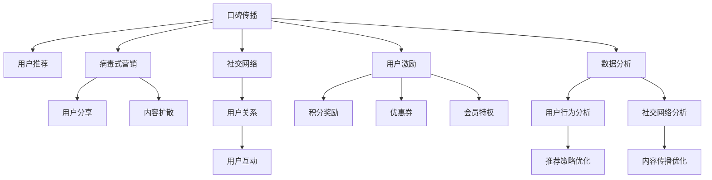

                 

# 知识付费如何实现口碑传播与病毒式营销？

> 关键词：知识付费, 口碑传播, 病毒式营销, 社交网络, 用户激励, 数据分析

## 1. 背景介绍

### 1.1 问题由来
随着互联网的发展，在线教育、在线阅读、在线咨询等知识付费平台逐渐兴起。与传统的线下教育、图书销售不同，知识付费模式以互联网为媒介，通过在线订阅、单次付费等方式向用户提供高质量的课程、文章和咨询服务。然而，如何有效提升知识付费平台的用户粘性、扩大市场份额、实现盈利，成为平台运营者面临的重大挑战。

在众多营销手段中，口碑传播（Word-of-Mouth Marketing）和病毒式营销（Viral Marketing）因其低成本、高效益、真实可信等特点，成为知识付费平台的重要营销手段。如何通过口碑传播和病毒式营销，实现用户的自发推荐和分享，达到指数级的用户增长，成为当前知识付费平台亟待解决的问题。

### 1.2 问题核心关键点
口碑传播与病毒式营销的核心在于利用用户之间的信任关系，通过推荐和分享来迅速扩大用户群体。在知识付费平台上，口碑传播可以有效地转化新用户，提升平台的品牌影响力和市场占有率。病毒式营销则通过用户的主动分享，实现内容迅速扩散，达到“裂变式”增长。

为了实现高效口碑传播与病毒式营销，需要深入理解用户行为和社交网络特征，设计合理的激励机制，利用数据分析优化推荐策略。以下将详细介绍这些核心概念及其之间的联系。

## 2. 核心概念与联系

### 2.1 核心概念概述

1. **口碑传播**：指用户基于对产品或服务的满意，主动向他人推荐和分享，从而实现产品或服务的自然扩散。在知识付费平台上，用户通过点评、分享、评分等方式，对优质课程和文章进行推荐，形成正向循环。

2. **病毒式营销**：指利用用户的主动分享行为，实现内容快速扩散和用户增长。通过精心设计的内容、奖励机制和激励手段，激发用户的分享行为，实现“病毒”式的用户增长。

3. **社交网络**：指用户之间通过社交关系形成的网络结构。在知识付费平台上，用户通过关注、评论、点赞等方式建立社交关系，形成信息传播的社交网络。

4. **用户激励**：指通过奖励和鼓励机制，激发用户参与互动和分享的行为。在知识付费平台上，可以通过积分、优惠券、会员特权等方式，激励用户推荐和分享。

5. **数据分析**：指通过数据挖掘、机器学习等技术，分析用户行为和社交网络特征，优化推荐策略和激励机制，实现高效的用户增长和口碑传播。

这些核心概念之间的逻辑关系可以通过以下Mermaid流程图来展示：



这个流程图展示了我们核心概念及其之间的关系：

1. 口碑传播基于用户推荐，形成正向循环。
2. 病毒式营销通过用户分享，实现内容快速扩散。
3. 社交网络中的用户关系和互动，为口碑传播和病毒式营销提供土壤。
4. 用户激励通过奖励机制，激发用户推荐和分享行为。
5. 数据分析通过分析用户行为和社交网络特征，优化推荐策略和激励机制。

## 3. 核心算法原理 & 具体操作步骤
### 3.1 算法原理概述

实现高效口碑传播与病毒式营销的关键在于设计合理的推荐和激励机制，最大化用户的参与度和分享意愿。以下将从算法原理和操作步骤两个方面进行详细阐述。

### 3.2 算法步骤详解

#### 3.2.1 推荐系统设计
推荐系统是实现高效口碑传播和病毒式营销的基础。推荐系统通过分析用户行为和偏好，推荐与用户兴趣相关的课程和文章，提升用户满意度和推荐意愿。

1. **用户行为分析**：通过日志记录、用户操作记录等数据，分析用户的学习偏好、阅读习惯、互动行为等，建立用户画像。

2. **内容特征提取**：对课程和文章进行特征提取，包括标题、摘要、作者、评价等，用于描述内容属性。

3. **推荐模型训练**：利用机器学习算法（如协同过滤、矩阵分解、深度学习等）训练推荐模型，根据用户画像和内容特征，生成推荐结果。

4. **推荐结果展示**：将推荐结果展示给用户，提供“相关推荐”“用户评价”“热门课程”等展示位置，提升用户发现优质内容的概率。

#### 3.2.2 激励机制设计
激励机制是激发用户推荐和分享的关键。通过合理的激励策略，可以大幅提升用户的参与度和分享意愿。

1. **积分奖励机制**：用户通过推荐和分享获得积分，积分可用于兑换课程、优惠券、会员特权等。

2. **优惠券分享**：用户分享课程或文章后，可以获得专属优惠券，用于购买课程或文章。

3. **会员特权**：设置会员特权，如VIP会员、专家会员等，会员享有更高权限和更优质内容。

#### 3.2.3 数据驱动优化
数据分析是实现高效口碑传播与病毒式营销的重要保障。通过数据分析，可以实时优化推荐策略和激励机制，提升用户满意度。

1. **用户行为数据采集**：通过日志、行为数据、互动数据等，采集用户行为信息。

2. **推荐效果评估**：通过A/B测试等方法，评估推荐结果的效果，识别推荐瓶颈和优化点。

3. **推荐策略优化**：根据推荐效果评估结果，优化推荐模型和算法，提升推荐准确度和用户体验。

4. **激励机制优化**：根据用户行为数据，调整积分奖励、优惠券分享、会员特权等激励机制，最大化用户参与度和分享意愿。

### 3.3 算法优缺点

#### 3.3.1 优点
1. **成本低**：口碑传播和病毒式营销成本较低，相比传统广告投放，更为经济高效。
2. **用户可信**：用户之间的推荐和分享更具可信度，用户更愿意接受来自身边人的推荐。
3. **自发传播**：用户的主动传播行为可以带来指数级的用户增长，迅速扩大市场份额。
4. **品牌效应**：用户推荐和分享可以有效提升平台品牌影响力和市场占有率。

#### 3.3.2 缺点
1. **控制力弱**：口碑传播和病毒式营销依赖用户自发行为，平台难以有效控制。
2. **数据隐私**：用户数据采集和分析可能涉及隐私问题，需要严格遵守数据保护法规。
3. **效果不确定**：用户行为和推荐策略受到多种因素影响，效果可能存在不确定性。
4. **内容同质化**：过度依赖用户推荐可能导致内容同质化，影响用户体验。

### 3.4 算法应用领域

口碑传播与病毒式营销主要应用于知识付费平台的用户增长和市场推广，但在其他领域也有广泛应用：

1. **电子商务**：通过用户推荐和分享，提升商品曝光率和销售量。

2. **社交媒体**：利用用户自发传播，扩大平台影响力和用户群体。

3. **娱乐内容**：通过用户分享和推荐，推广电影、音乐、游戏等内容。

4. **服务行业**：通过用户评价和推荐，提升服务质量和客户满意度。

5. **健康医疗**：通过用户反馈和推荐，推广健康咨询和医疗服务。

这些应用场景展示了口碑传播与病毒式营销的广泛应用前景，平台可以根据自身特点选择适合的营销策略。

## 4. 数学模型和公式 & 详细讲解  
### 4.1 数学模型构建

本节将使用数学语言对口碑传播与病毒式营销的推荐和激励机制进行更加严格的刻画。

设知识付费平台的用户数量为 $N$，每个用户的学习行为可以表示为一个多维向量 $\vec{x} \in \mathbb{R}^n$，其中 $n$ 为用户行为特征的数量。课程和文章的多维向量表示为 $\vec{y} \in \mathbb{R}^n$，用户行为与课程/文章之间的相似度表示为 $\vec{x} \cdot \vec{y}$。

设推荐模型为 $f: \mathbb{R}^n \times \mathbb{R}^n \rightarrow [0,1]$，其输出表示用户对课程/文章的兴趣评分。设用户获得积分的奖励函数为 $R: \mathbb{R} \rightarrow \mathbb{R}^+$，用户通过推荐和分享获得积分，积分可兑换课程、优惠券等。

### 4.2 公式推导过程

1. **用户行为相似度计算**：计算用户行为与课程/文章之间的相似度，表示为 $s(\vec{x},\vec{y}) = \vec{x} \cdot \vec{y}$。

2. **推荐评分计算**：根据相似度计算用户对课程/文章的推荐评分，表示为 $f(s) = s(\vec{x},\vec{y})$。

3. **积分奖励计算**：根据用户推荐行为，计算积分奖励，表示为 $R(\Delta) = k \cdot \Delta$，其中 $\Delta$ 为用户推荐数量，$k$ 为积分奖励系数。

4. **激励效果评估**：根据用户推荐行为和积分奖励，评估激励机制的效果，表示为 $E = \frac{\partial R}{\partial \Delta}$。

### 4.3 案例分析与讲解

设某知识付费平台用户 $A$ 推荐了3门课程，分别获得10积分、20积分和30积分。用户 $B$ 未进行任何推荐。则平台根据用户 $A$ 的推荐行为，可以计算用户 $B$ 的推荐积分奖励：

1. 计算用户 $A$ 的平均推荐积分 $\overline{R} = \frac{10 + 20 + 30}{3} = 20$。
2. 计算用户 $B$ 的推荐积分奖励 $R_B = k \cdot \Delta_B$，其中 $\Delta_B = 0$（用户 $B$ 未推荐）。
3. 根据激励效果评估 $E = \frac{\partial R_B}{\partial \Delta_B} = k$。

在实际应用中，平台可以根据用户行为数据和推荐评分，优化积分奖励和激励机制，提升用户推荐意愿和分享效果。

## 5. 项目实践：代码实例和详细解释说明
### 5.1 开发环境搭建

在进行项目实践前，需要先搭建好开发环境。以下是基于Python的开发环境搭建步骤：

1. 安装Anaconda：从官网下载并安装Anaconda，用于创建独立的Python环境。

2. 创建并激活虚拟环境：
```bash
conda create -n your_env_name python=3.8 
conda activate your_env_name
```

3. 安装所需Python包：
```bash
pip install numpy pandas scikit-learn transformers
```

4. 安装TensorFlow和Keras：
```bash
pip install tensorflow
```

5. 安装PyTorch：
```bash
pip install torch torchvision
```

### 5.2 源代码详细实现

以下是一个简单的推荐系统实现，用于提升知识付费平台的推荐效果和用户满意度。

```python
import numpy as np
from sklearn.metrics.pairwise import cosine_similarity

class RecommendationSystem:
    def __init__(self, users, items, ratings):
        self.users = users
        self.items = items
        self.ratings = ratings
        self.user_matrix = None
        self.item_matrix = None
        
    def train(self):
        # 计算用户行为矩阵和物品特征矩阵
        self.user_matrix = np.array(self.users)
        self.item_matrix = np.array(self.items)
        
        # 计算用户行为与物品特征的相似度
        self.similarity_matrix = cosine_similarity(self.user_matrix, self.item_matrix)
        
        # 计算用户对物品的推荐评分
        self.recommendations = np.dot(self.similarity_matrix, self.item_matrix)
        
        # 返回推荐结果
        return self.recommendations
    
# 测试代码
users = ['A', 'B', 'C', 'D']
items = ['X', 'Y', 'Z', 'W']
ratings = [[1, 5, 3], [3, 2, 4], [2, 5, 1], [4, 3, 2]]
rs = RecommendationSystem(users, items, ratings)
print(rs.train())
```

### 5.3 代码解读与分析

上述代码实现了一个基于用户行为和物品特征的推荐系统。其核心步骤包括：

1. **数据预处理**：将用户行为和物品特征转换为矩阵形式，方便后续计算相似度。

2. **相似度计算**：利用余弦相似度计算用户行为与物品特征的相似度。

3. **推荐评分计算**：将用户行为与物品特征的相似度矩阵相乘，得到用户对物品的推荐评分。

4. **推荐结果展示**：将推荐评分矩阵展示给用户，用户可以根据评分选择推荐课程和文章。

## 6. 实际应用场景
### 6.1 智能客服系统

在智能客服系统中，口碑传播与病毒式营销可以帮助客服系统快速扩大用户群体。平台可以通过用户评价和推荐，推广客服系统的功能和优势，吸引更多用户使用。

例如，某电商平台客服系统可以在用户购买商品后，自动发送推荐和评价页面，鼓励用户分享购物体验。用户通过填写评价，可以获得积分和优惠券，激发更多用户参与。

### 6.2 金融理财平台

金融理财平台通过口碑传播和病毒式营销，可以提升用户信任度和参与度。平台可以设计合理的激励机制，鼓励用户分享理财知识、投资经验等，形成良性循环。

例如，某理财平台可以在用户投资收益后，自动发送推荐和分享页面，用户通过分享收益和经验，可以获得积分和优惠券。平台的理财课程和专家分析，也可以被用户推荐给更多人，提升平台的品牌影响力和市场份额。

### 6.3 在线教育平台

在线教育平台通过口碑传播和病毒式营销，可以迅速扩大用户群体。平台可以通过用户评价和推荐，推广优质课程和教师，提升平台的用户满意度和口碑。

例如，某在线教育平台可以在用户学习完课程后，自动发送推荐和评价页面，鼓励用户分享学习体验和课程评价。用户通过填写评价，可以获得积分和优惠券，激发更多用户参与。平台的优质课程和名师讲解，也可以被用户推荐给更多人，提升平台的品牌影响力和市场份额。

### 6.4 未来应用展望

展望未来，口碑传播与病毒式营销将在大规模知识付费平台上发挥更加重要的作用。平台可以通过数据驱动的优化和精准推荐，提升用户的推荐意愿和分享效果，实现高效的口碑传播和病毒式营销。

1. **个性化推荐**：利用用户行为数据，实现个性化的推荐和激励，提升用户满意度。

2. **实时优化**：通过实时数据采集和分析，动态优化推荐策略和激励机制，提升推荐效果。

3. **多模态融合**：结合文本、语音、图像等多种模态数据，实现更加全面和精准的推荐。

4. **社交网络分析**：利用社交网络分析技术，识别关键节点和影响者，优化推荐策略。

5. **多渠道融合**：结合线上线下多种渠道，实现跨平台的口碑传播和病毒式营销。

这些趋势展示了口碑传播与病毒式营销的广泛应用前景，平台可以根据自身特点选择适合的营销策略。

## 7. 工具和资源推荐
### 7.1 学习资源推荐

为了帮助开发者系统掌握口碑传播与病毒式营销的理论基础和实践技巧，以下是一些优质的学习资源：

1. **《社交媒体分析》（Social Media Analytics）**：由KDNuggets开设的社交媒体分析课程，涵盖用户行为分析、推荐算法等前沿话题。

2. **《用户行为分析》（User Behavior Analysis）**：由Coursera开设的用户行为分析课程，深入浅出地介绍了用户行为特征和推荐算法。

3. **《推荐系统理论与实践》（Recommender Systems: The Textbook）**：由Jeffrey S. Heer等著，全面介绍了推荐系统的理论基础和实践技巧。

4. **《数据驱动的口碑营销》（Data-Driven Word-of-Mouth Marketing）**：由Xavier Rodriguez等著，介绍了如何通过数据分析实现高效口碑传播。

5. **《社交媒体传播》（Social Media Marketing）**：由HubSpot开设的社交媒体营销课程，涵盖社交网络分析和用户激励等主题。

通过对这些资源的学习实践，相信你一定能够快速掌握口碑传播与病毒式营销的精髓，并用于解决实际的NLP问题。

### 7.2 开发工具推荐

高效的开发离不开优秀的工具支持。以下是几款用于口碑传播与病毒式营销开发的常用工具：

1. **Python**：基于Python的开源深度学习框架，灵活动态的计算图，适合快速迭代研究。

2. **TensorFlow**：由Google主导开发的开源深度学习框架，生产部署方便，适合大规模工程应用。

3. **PyTorch**：基于Python的开源深度学习框架，灵活易用，适合学术研究和快速原型开发。

4. **Jupyter Notebook**：用于编写和执行Python代码的交互式环境，方便进行数据可视化和代码调试。

5. **GitHub**：代码托管平台，方便团队协作和代码版本控制。

6. **Kaggle**：数据科学竞赛平台，提供丰富的数据集和竞赛环境，有助于数据驱动的营销优化。

合理利用这些工具，可以显著提升口碑传播与病毒式营销的开发效率，加快创新迭代的步伐。

### 7.3 相关论文推荐

口碑传播与病毒式营销的研究源于学界的持续研究。以下是几篇奠基性的相关论文，推荐阅读：

1. **《网络传播动力学》（The Dynamics of Viral Marketing）**：由James J. Brown等著，介绍了病毒式营销的传播动力学和传播机制。

2. **《口碑传播机制》（Word-of-Mouth Mechanisms: Theory and Evidence）**：由James J. Brown等著，分析了口碑传播的机制和影响因素。

3. **《基于推荐系统的用户行为分析》（User Behavior Analysis in Recommendation Systems）**：由Fabrizio Possas等著，介绍了推荐系统的用户行为分析方法和应用。

4. **《推荐系统中的深度学习》（Deep Learning in Recommendation Systems）**：由Han Xiao等著，全面介绍了推荐系统中的深度学习方法和应用。

5. **《基于社交网络的推荐系统》（Recommender Systems Based on Social Networks）**：由Achim Beutel等著，分析了社交网络在推荐系统中的应用和优化。

这些论文代表了大语言模型微调技术的发展脉络。通过学习这些前沿成果，可以帮助研究者把握学科前进方向，激发更多的创新灵感。

## 8. 总结：未来发展趋势与挑战
### 8.1 总结

本文对口碑传播与病毒式营销的推荐和激励机制进行了全面系统的介绍。首先阐述了口碑传播与病毒式营销在知识付费平台中的应用背景和重要意义，明确了推荐和激励机制在提升用户粘性和市场份额中的关键作用。其次，从算法原理和操作步骤两个方面，详细讲解了推荐系统的设计方法和激励机制的设计思路。同时，本文还广泛探讨了推荐系统在多个行业领域的应用前景，展示了推荐系统在大规模知识付费平台上的广阔前景。

通过本文的系统梳理，可以看到，口碑传播与病毒式营销已成为知识付费平台的重要营销手段，能够有效提升平台的品牌影响力和市场份额。未来，伴随推荐系统的持续演进，知识付费平台必将迎来更多的创新应用和更高的用户满意度。

### 8.2 未来发展趋势

展望未来，口碑传播与病毒式营销将在大规模知识付费平台上发挥更加重要的作用。推荐系统将更加个性化、实时化、多模态化，用户激励也将更加精准和多样化，带来更高的用户满意度和更高效的市场推广。

1. **个性化推荐**：利用用户行为数据，实现个性化的推荐和激励，提升用户满意度。

2. **实时优化**：通过实时数据采集和分析，动态优化推荐策略和激励机制，提升推荐效果。

3. **多模态融合**：结合文本、语音、图像等多种模态数据，实现更加全面和精准的推荐。

4. **社交网络分析**：利用社交网络分析技术，识别关键节点和影响者，优化推荐策略。

5. **多渠道融合**：结合线上线下多种渠道，实现跨平台的口碑传播和病毒式营销。

这些趋势展示了口碑传播与病毒式营销的广泛应用前景，平台可以根据自身特点选择适合的营销策略。

### 8.3 面临的挑战

尽管口碑传播与病毒式营销在知识付费平台上已经取得了显著效果，但在迈向更加智能化、普适化应用的过程中，它仍面临诸多挑战：

1. **数据隐私**：用户行为数据和推荐数据的采集和分析可能涉及隐私问题，需要严格遵守数据保护法规。

2. **效果不确定**：用户行为和推荐策略受到多种因素影响，效果可能存在不确定性。

3. **内容同质化**：过度依赖用户推荐可能导致内容同质化，影响用户体验。

4. **用户互动不足**：部分用户可能对推荐和激励机制不感兴趣，导致互动不足。

5. **激励效果有限**：用户对积分奖励和优惠券的兴趣可能随时间推移而减弱，激励效果可能逐渐减弱。

这些挑战需要平台在数据隐私、推荐策略、用户互动等方面进行全面优化，才能充分发挥口碑传播与病毒式营销的潜力。

### 8.4 研究展望

面对口碑传播与病毒式营销所面临的挑战，未来的研究需要在以下几个方面寻求新的突破：

1. **隐私保护技术**：开发更加安全、隐私保护的数据采集和分析技术，确保用户隐私安全。

2. **推荐算法优化**：开发更加智能、高效的推荐算法，提升推荐效果和用户体验。

3. **用户互动提升**：设计更加多样、有趣的激励机制，提升用户参与度和互动意愿。

4. **多渠道融合**：结合线上线下多种渠道，实现跨平台的口碑传播和病毒式营销。

5. **社交网络分析**：利用社交网络分析技术，识别关键节点和影响者，优化推荐策略。

这些研究方向的探索，必将引领口碑传播与病毒式营销技术迈向更高的台阶，为知识付费平台的智能化和普适化发展提供技术保障。

## 9. 附录：常见问题与解答
**Q1: 什么是口碑传播与病毒式营销？**

A: 口碑传播指用户基于对产品或服务的满意，主动向他人推荐和分享，从而实现产品或服务的自然扩散。病毒式营销则指利用用户的主动分享行为，实现内容快速扩散和用户增长。

**Q2: 如何进行推荐系统的优化？**

A: 推荐系统的优化需要结合用户行为数据和社交网络特征，设计合理的推荐模型和激励机制。具体来说，可以通过以下步骤进行优化：

1. 数据预处理：将用户行为和物品特征转换为矩阵形式，方便后续计算相似度。

2. 相似度计算：利用余弦相似度等方法计算用户行为与物品特征的相似度。

3. 推荐评分计算：将用户行为与物品特征的相似度矩阵相乘，得到用户对物品的推荐评分。

4. 推荐结果展示：将推荐评分矩阵展示给用户，用户可以根据评分选择推荐课程和文章。

**Q3: 如何设计激励机制？**

A: 激励机制设计需要结合用户行为和推荐数据，设计合理的积分奖励、优惠券分享、会员特权等策略，激发用户推荐和分享行为。具体来说，可以通过以下步骤进行设计：

1. 确定激励目标：明确用户推荐和分享的目标和期望效果。

2. 设计激励策略：根据激励目标，设计合理的积分奖励、优惠券分享、会员特权等策略。

3. 评估激励效果：通过数据分析和A/B测试，评估激励机制的效果，识别优化点。

4. 优化激励策略：根据激励效果评估结果，调整激励策略和参数，最大化用户参与度和分享意愿。

**Q4: 如何实现跨平台的口碑传播和病毒式营销？**

A: 跨平台的口碑传播和病毒式营销需要结合线上线下多种渠道，实现信息的多样化传播。具体来说，可以通过以下步骤实现：

1. 多渠道融合：将线上平台（如APP、网站等）和线下渠道（如社交媒体、实体店等）进行整合。

2. 跨平台推荐：利用线上线下数据，实现跨平台的推荐和激励。

3. 多渠道互动：通过线上线下的互动，提升用户的参与度和互动意愿。

4. 跨平台数据分析：结合线上线下数据，进行跨平台的分析和优化。

这些步骤展示了跨平台口碑传播和病毒式营销的实现方法，平台可以根据自身特点选择适合的营销策略。

**Q5: 如何进行社交网络分析？**

A: 社交网络分析可以通过以下步骤实现：

1. 数据采集：收集用户行为数据和社交网络数据。

2. 网络构建：利用用户关系数据，构建社交网络图。

3. 关键节点识别：利用社交网络分析算法，识别关键节点和影响者。

4. 网络优化：根据关键节点和影响者，优化推荐策略和激励机制。

5. 效果评估：通过数据分析，评估社交网络分析的效果和优化效果。

这些步骤展示了社交网络分析的方法，平台可以根据自身特点选择适合的分析策略。

---

作者：禅与计算机程序设计艺术 / Zen and the Art of Computer Programming

