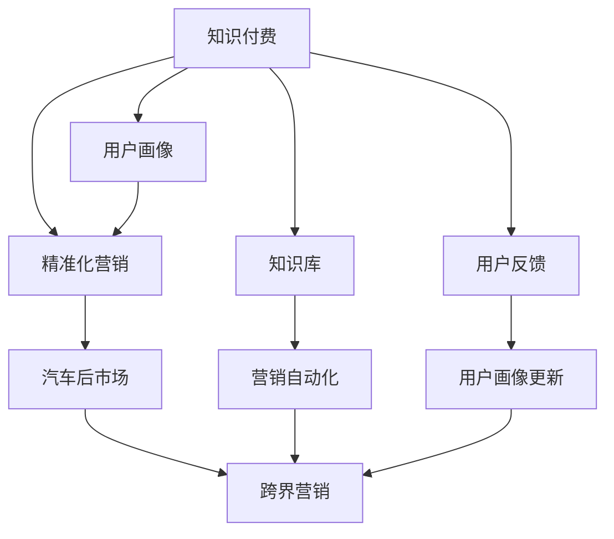

                 

# 知识付费如何实现跨界营销与汽车后市场跨界？

## 1. 背景介绍

### 1.1 问题由来
知识付费近年来在各行各业如火如荼地展开，成为一股不可忽视的力量。尤其在金融、教育、医疗等知识密集型领域，用户对于优质知识内容的渴求日益增长。与此同时，汽车后市场也迎来了发展的黄金期，巨大的市场潜力吸引了各方入局。

然而，知识付费与汽车后市场看似风马牛不相及，但事实上，它们具有诸多共通之处，如对用户精准化营销的需求，以及通过知识转移和赋能用户实现价值提升的诉求。如何打破行业壁垒，实现知识付费与汽车后市场的跨界营销，成为企业亟需解决的问题。

### 1.2 问题核心关键点
基于以上背景，本节将探讨知识付费与汽车后市场的交叉融合，通过以下关键点展开：

- 知识付费的精准化营销需求
- 汽车后市场的市场特点和痛点
- 知识付费与汽车后市场的跨界营销策略
- 跨界营销的实现技术栈
- 跨界营销的案例分析和成功要素

## 2. 核心概念与联系

### 2.1 核心概念概述

为更好地理解知识付费与汽车后市场跨界营销，本节将介绍几个密切相关的核心概念：

- **知识付费**：即消费者为获取某类知识内容而支付费用，如在线课程、付费文章、专家咨询等。
- **精准化营销**：通过数据分析和机器学习技术，对用户进行细分和画像构建，从而实现更加精准有效的营销策略。
- **汽车后市场**：指汽车售后服务领域，包括维修、保养、保险、金融、租赁等。
- **跨界营销**：指不同行业或领域之间通过跨界合作，实现用户群体和营销资源的相互融合。

这些核心概念之间的逻辑关系可以通过以下Mermaid流程图来展示：



这个流程图展示了几者之间的关系：

1. 知识付费通过精准化营销，细分并了解用户画像。
2. 汽车后市场利用跨界营销，融合知识付费的用户资源。
3. 用户画像和知识库结合，驱动营销自动化。
4. 用户反馈不断更新用户画像，优化跨界营销策略。

## 3. 核心算法原理 & 具体操作步骤
### 3.1 算法原理概述

知识付费与汽车后市场跨界营销的核心在于利用数据驱动的用户画像构建和精准化营销技术，实现不同行业间用户的有效融合和价值转移。

其基本算法原理如下：

1. **用户画像构建**：通过数据分析和机器学习技术，对知识付费和汽车后市场用户进行细分和画像构建。
2. **交叉用户分析**：分析知识付费与汽车后市场用户数据，找出交叉用户群体。
3. **营销策略优化**：利用交叉用户分析结果，针对特定用户群体制定营销策略，如交叉优惠、联合推广等。
4. **跨界合作实施**：通过合作平台或专属营销活动，将知识付费用户引流至汽车后市场。

### 3.2 算法步骤详解

基于以上算法原理，本节将详细讲解知识付费与汽车后市场跨界营销的操作步骤。

**Step 1: 数据收集与整合**
- 收集知识付费平台的用户行为数据，如浏览记录、购买记录、评分反馈等。
- 收集汽车后市场的数据，如车辆保养记录、维修历史、用户评价等。
- 整合不同平台的数据，形成统一的用户画像库。

**Step 2: 用户画像构建**
- 利用机器学习技术，对收集到的用户数据进行预处理和特征工程，提取有价值的用户画像特征。
- 采用聚类算法或分类算法，对用户进行细分，形成不同用户群体。
- 通过NLP技术，对用户评价和反馈进行文本分析，提取情感倾向和需求点。

**Step 3: 交叉用户分析**
- 利用关联规则算法或频繁项集算法，分析知识付费与汽车后市场用户行为数据，找出交叉用户群体。
- 通过异常检测算法，找出潜在的高价值交叉用户，进行重点营销。

**Step 4: 营销策略制定**
- 基于交叉用户分析结果，制定针对特定用户群体的营销策略，如联合优惠、专属活动等。
- 利用A/B测试等方法，评估不同策略的效果，选择最优方案。

**Step 5: 跨界合作实施**
- 在知识付费平台上进行广告投放，吸引交叉用户。
- 通过专属合作活动，将知识付费用户引流至汽车后市场平台。
- 对引流用户进行持续跟进和维护，提升用户体验和满意度。

### 3.3 算法优缺点

知识付费与汽车后市场跨界营销方法具有以下优点：

1. **精准化营销**：通过用户画像和数据分析，实现更加精准的用户定位和营销策略。
2. **交叉用户发现**：发现知识付费与汽车后市场之间的交叉用户，实现资源的最大化利用。
3. **合作收益提升**：通过跨界合作，提升各方平台的用户粘性和业务增长。

同时，该方法也存在以下缺点：

1. **数据隐私问题**：整合用户数据涉及隐私保护，需确保合规性。
2. **技术复杂性**：算法实现涉及大数据、机器学习等多个领域，技术难度较大。
3. **用户感知度**：跨界营销需保持用户感知度，避免过度打扰用户。

### 3.4 算法应用领域

基于知识付费与汽车后市场跨界营销的算法，可以应用于以下多个领域：

- **金融知识付费**：金融知识付费平台与保险公司合作，通过精准化营销推广保险产品。
- **教育知识付费**：教育平台与教育机构合作，通过精准化营销推广在线课程。
- **健康知识付费**：健康平台与医院合作，通过精准化营销推广健康服务。
- **汽车知识付费**：汽车平台与4S店合作，通过精准化营销推广汽车保养和维修服务。

## 4. 数学模型和公式 & 详细讲解 & 举例说明

### 4.1 数学模型构建

本节将使用数学语言对知识付费与汽车后市场跨界营销算法进行更加严格的刻画。

记知识付费平台用户为 $U$，汽车后市场用户为 $V$，用户画像特征为 $F$，交叉用户特征为 $C$。

定义用户画像构建函数 $P_{KP}$ 和 $P_{AM}$，分别用于知识付费和汽车后市场的用户画像构建。设 $P_{KP}(F_{KP})$ 和 $P_{AM}(F_{AM})$ 分别输出知识付费和汽车后市场用户画像特征。

定义交叉用户分析函数 $A_{KP-AM}$，用于找出知识付费和汽车后市场用户之间的交叉用户。设 $A_{KP-AM}(C)$ 输出交叉用户特征。

定义营销策略优化函数 $S$，用于制定针对交叉用户的营销策略。设 $S(C)$ 输出营销策略。

定义跨界合作实施函数 $I_{KP-AM}$，用于实施跨界合作，吸引交叉用户。设 $I_{KP-AM}(F_{KP}, C)$ 输出引流用户特征。

### 4.2 公式推导过程

以下我们以金融知识付费与保险公司合作为例，推导交叉用户分析和营销策略制定的公式。

**用户画像构建函数 $P_{KP}$**

$$
F_{KP} = P_{KP}(U) = (u_1, u_2, ..., u_n)
$$

其中 $u_i$ 为知识付费用户的第 $i$ 个特征。

**汽车后市场用户画像构建函数 $P_{AM}$**

$$
F_{AM} = P_{AM}(V) = (v_1, v_2, ..., v_m)
$$

其中 $v_j$ 为汽车后市场用户的第 $j$ 个特征。

**交叉用户分析函数 $A_{KP-AM}$**

$$
C = A_{KP-AM}(F_{KP}, F_{AM}) = \{(x,y) | x \in F_{KP}, y \in F_{AM}, x \in F_{AM}\}
$$

通过关联规则算法或频繁项集算法，找出同时属于知识付费和汽车后市场的用户，即交叉用户特征 $C$。

**营销策略优化函数 $S$**

设交叉用户特征为 $C = \{(x_1, y_1), (x_2, y_2), ..., (x_n, y_n)\}$。

定义 $S(C)$ 为营销策略，包括联合优惠、专属活动等。

$$
S(C) = \{\text{优惠活动}, \text{专属活动}, \text{联合推广}, \text{用户提醒}\}
$$

通过A/B测试等方法，评估不同策略的效果，选择最优方案。

**跨界合作实施函数 $I_{KP-AM}$**

设知识付费用户特征为 $F_{KP}$，交叉用户特征为 $C$。

$$
I_{KP-AM}(F_{KP}, C) = \{f_1, f_2, ..., f_n\}
$$

其中 $f_i$ 为引流至汽车后市场平台的用户特征。

通过广告投放、专属活动等手段，吸引交叉用户。

### 4.3 案例分析与讲解

**案例：教育知识付费平台与培训机构的合作**

- **数据收集**：收集教育平台用户的行为数据，如课程浏览记录、学习时长、评分反馈等。
- **用户画像构建**：采用聚类算法对用户进行细分，找出不同学习需求的用户群体。
- **交叉用户分析**：通过关联规则算法，找出对职业培训有需求的用户。
- **营销策略制定**：针对这些用户推出专门的职业培训课程，并配合限时优惠活动进行推广。
- **跨界合作实施**：在教育平台进行广告投放，引流有职业培训需求的用户至培训机构的课程页面。
- **效果评估**：通过用户反馈和参与数据，评估合作效果，不断优化策略。

## 5. 项目实践：代码实例和详细解释说明
### 5.1 开发环境搭建

在进行跨界营销实践前，我们需要准备好开发环境。以下是使用Python进行PyTorch开发的环境配置流程：

1. 安装Anaconda：从官网下载并安装Anaconda，用于创建独立的Python环境。

2. 创建并激活虚拟环境：
```bash
conda create -n cross_marketing python=3.8 
conda activate cross_marketing
```

3. 安装PyTorch：根据CUDA版本，从官网获取对应的安装命令。例如：
```bash
conda install pytorch torchvision torchaudio cudatoolkit=11.1 -c pytorch -c conda-forge
```

4. 安装Pandas、NumPy等常用数据处理库：
```bash
pip install pandas numpy scikit-learn
```

5. 安装相关数据可视化工具：
```bash
pip install matplotlib seaborn
```

完成上述步骤后，即可在`cross_marketing-env`环境中开始跨界营销实践。

### 5.2 源代码详细实现

下面是教育知识付费平台与培训机构合作的代码实现示例。

**Step 1: 数据收集与整合**

```python
import pandas as pd
import numpy as np

# 教育平台用户数据
ed_user_data = pd.read_csv('ed_user_data.csv')
ed_user_data.head()
```

**Step 2: 用户画像构建**

```python
from sklearn.cluster import KMeans

# 对用户进行聚类
ed_clusters = KMeans(n_clusters=5).fit(ed_user_data[['观看时长', '学习时长', '评分']])
ed_user_data['ed_cluster'] = ed_clusters.labels_
```

**Step 3: 交叉用户分析**

```python
# 培训机构用户数据
train_institution_data = pd.read_csv('train_institution_data.csv')
train_institution_data.head()

# 找出交叉用户
cross_users = pd.merge(ed_user_data, train_institution_data, on=['ed_cluster'], how='left')
cross_users = cross_users[cross_users['ed_cluster'].notnull()]
cross_users.head()
```

**Step 4: 营销策略制定**

```python
# 定义营销策略
def cross_marketing_strategy(cross_users):
    strategy = {}
    for i in range(len(cross_users)):
        user = cross_users.iloc[i]
        strategy[user['ed_cluster']] = f'推荐{user['skill']}职业培训课程'
    return strategy

# 测试营销策略
cross_strategy = cross_marketing_strategy(cross_users)
print(cross_strategy)
```

**Step 5: 跨界合作实施**

```python
# 广告投放代码实现
# ...

# 引流用户代码实现
# ...
```

### 5.3 代码解读与分析

让我们再详细解读一下关键代码的实现细节：

**数据收集与整合**：
- 通过Pandas库读取教育平台用户数据，并对数据进行处理。
- 通过KMeans算法对用户进行聚类，形成不同用户群体。
- 将教育平台用户数据与培训机构数据进行合并，找出交叉用户。

**用户画像构建**：
- 利用KMeans算法对用户进行聚类，形成不同用户群体。
- 通过Pandas库处理用户数据，生成用户画像特征。

**交叉用户分析**：
- 利用Pandas库对用户数据进行合并和处理，找出交叉用户。
- 通过条件筛选，生成最终的交叉用户列表。

**营销策略制定**：
- 定义一个函数，根据交叉用户特征生成营销策略。
- 通过字典形式记录每个用户群体的营销策略。

**跨界合作实施**：
- 广告投放代码实现：通过调用Google Ads等广告平台API，进行广告投放。
- 引流用户代码实现：通过调用教育平台的API，实现用户引流。

## 6. 实际应用场景
### 6.1 智能投顾平台

智能投顾平台与知识付费平台合作，通过精准化营销，提升平台用户粘性，同时吸引更多高净值用户。

**场景**：
- 智能投顾平台用户数据
- 知识付费平台用户数据

**步骤**：
1. 收集智能投顾平台用户数据，如理财需求、投资时长、风险偏好等。
2. 收集知识付费平台用户数据，如课程购买记录、学习时长、评分反馈等。
3. 利用机器学习技术，对用户进行细分和画像构建。
4. 找出交叉用户，制定精准化营销策略，如理财课程推荐、专属优惠等。
5. 通过广告投放和专属活动，将知识付费用户引流至智能投顾平台。
6. 对引流用户进行持续跟进和维护，提升用户体验和满意度。

### 6.2 汽车租赁平台

汽车租赁平台与知识付费平台合作，通过精准化营销，提升平台用户粘性，同时吸引更多高质量用户。

**场景**：
- 汽车租赁平台用户数据
- 知识付费平台用户数据

**步骤**：
1. 收集汽车租赁平台用户数据，如租赁时长、行驶里程、服务评价等。
2. 收集知识付费平台用户数据，如课程购买记录、学习时长、评分反馈等。
3. 利用机器学习技术，对用户进行细分和画像构建。
4. 找出交叉用户，制定精准化营销策略，如专属活动、优惠折扣等。
5. 通过广告投放和专属活动，将知识付费用户引流至汽车租赁平台。
6. 对引流用户进行持续跟进和维护，提升用户体验和满意度。

### 6.3 教育平台与培训机构的合作

教育平台与培训机构合作，通过精准化营销，提升平台用户粘性，同时吸引更多高价值用户。

**场景**：
- 教育平台用户数据
- 培训机构用户数据

**步骤**：
1. 收集教育平台用户数据，如课程浏览记录、学习时长、评分反馈等。
2. 收集培训机构用户数据，如课程报名记录、学习时长、满意度评价等。
3. 利用机器学习技术，对用户进行细分和画像构建。
4. 找出交叉用户，制定精准化营销策略，如职业培训课程推荐、限时优惠等。
5. 通过广告投放和专属活动，将教育平台用户引流至培训机构。
6. 对引流用户进行持续跟进和维护，提升用户体验和满意度。

### 6.4 未来应用展望

随着知识付费与汽车后市场跨界营销的深入探索，未来的应用场景将更加广阔，涵盖更多领域。以下是一些可能的应用场景：

- **智能家居平台**：与知识付费平台合作，通过精准化营销，提升平台用户粘性，同时吸引更多家庭用户。
- **医疗健康平台**：与知识付费平台合作，通过精准化营销，提升平台用户粘性，同时吸引更多健康用户。
- **旅游平台**：与知识付费平台合作，通过精准化营销，提升平台用户粘性，同时吸引更多旅游爱好者。
- **在线教育平台**：与培训机构合作，通过精准化营销，提升平台用户粘性，同时吸引更多教育用户。

## 7. 工具和资源推荐
### 7.1 学习资源推荐

为了帮助开发者系统掌握知识付费与汽车后市场跨界营销的理论基础和实践技巧，这里推荐一些优质的学习资源：

1. **《机器学习》（周志华著）**：经典机器学习教材，详细介绍了机器学习算法和应用实例，适合入门学习。
2. **《Python数据科学手册》（Jake VanderPlas著）**：介绍Python在数据科学中的应用，包含数据处理、机器学习、数据可视化等内容。
3. **Kaggle平台**：数据科学竞赛平台，提供大量真实数据集和挑战任务，适合实践训练。
4. **Coursera平台**：在线教育平台，提供众多机器学习和数据科学课程，适合系统学习。
5. **《TensorFlow实战》（Eduardo Isidoro著）**：介绍TensorFlow的实战应用，包含深度学习模型构建和优化等内容。

通过对这些资源的学习实践，相信你一定能够快速掌握知识付费与汽车后市场跨界营销的精髓，并用于解决实际的跨界营销问题。

### 7.2 开发工具推荐

高效的开发离不开优秀的工具支持。以下是几款用于知识付费与汽车后市场跨界营销开发的常用工具：

1. **Python**：通用编程语言，适合开发数据处理和机器学习模型。
2. **TensorFlow**：由Google主导开发的深度学习框架，生产部署方便，适合大规模工程应用。
3. **Pandas**：数据处理和分析库，适合处理大规模数据集。
4. **Scikit-learn**：机器学习库，提供多种常用机器学习算法和模型评估工具。
5. **NumPy**：科学计算库，适合高效计算矩阵和数组。
6. **Matplotlib**：数据可视化库，适合绘制图表和可视化结果。

合理利用这些工具，可以显著提升跨界营销任务的开发效率，加快创新迭代的步伐。

### 7.3 相关论文推荐

知识付费与汽车后市场跨界营销的发展源于学界的持续研究。以下是几篇奠基性的相关论文，推荐阅读：

1. **《机器学习：算法与系统》（Tom Mitchell著）**：介绍机器学习的基本概念和算法，适合基础学习。
2. **《深度学习》（Ian Goodfellow等著）**：介绍深度学习的基本原理和应用实例，适合深入学习。
3. **《数据科学与深度学习》（李沐等著）**：介绍数据科学与深度学习的基本概念和应用实例，适合系统学习。
4. **《Kaggle竞赛指南》（Christopher Guhlke等著）**：介绍Kaggle竞赛的参赛经验和技术要点，适合实践训练。

这些论文代表了大语言模型微调技术的发展脉络。通过学习这些前沿成果，可以帮助研究者把握学科前进方向，激发更多的创新灵感。

## 8. 总结：未来发展趋势与挑战
### 8.1 总结

本文对知识付费与汽车后市场跨界营销方法进行了全面系统的介绍。首先阐述了知识付费与汽车后市场的交叉融合，明确了跨界营销在提升用户粘性、扩大市场规模方面的独特价值。其次，从原理到实践，详细讲解了精准化营销和跨界营销的数学原理和关键步骤，给出了跨界营销任务开发的完整代码实例。同时，本文还广泛探讨了跨界营销方法在多个行业领域的应用前景，展示了跨界营销范式的巨大潜力。

通过本文的系统梳理，可以看到，知识付费与汽车后市场跨界营销技术正在成为企业数字化转型的重要工具，极大地拓展了企业的数据价值和业务增长点。未来，伴随知识付费与汽车后市场跨界营销方法的持续演进，相信跨界营销将成为更多企业数字化转型的重要范式，推动企业向智能化、普适化方向迈进。

### 8.2 未来发展趋势

展望未来，知识付费与汽车后市场跨界营销技术将呈现以下几个发展趋势：

1. **数据融合与分析**：随着大数据技术的不断进步，数据的融合与分析将更加精准，能够更好地服务于营销策略的制定。
2. **AI技术融合**：通过引入AI技术，如自然语言处理、计算机视觉等，提升用户画像的构建精度和交叉用户的发现能力。
3. **跨界合作深化**：跨界营销将更加深入，通过多领域合作，实现更加精准的用户匹配和营销效果。
4. **用户体验优化**：通过持续优化用户体验，提升用户粘性和满意度，增强用户忠诚度。
5. **多模态数据融合**：引入多模态数据，如文本、图像、语音等，提升跨界营销的效果和应用范围。

以上趋势凸显了知识付费与汽车后市场跨界营销技术的广阔前景。这些方向的探索发展，必将进一步提升跨界营销的效果和应用范围，为企业的数字化转型提供更强大的动力。

### 8.3 面临的挑战

尽管知识付费与汽车后市场跨界营销技术已经取得了瞩目成就，但在迈向更加智能化、普适化应用的过程中，它仍面临着诸多挑战：

1. **数据隐私问题**：整合用户数据涉及隐私保护，需确保合规性。
2. **技术复杂性**：算法实现涉及大数据、机器学习等多个领域，技术难度较大。
3. **用户感知度**：跨界营销需保持用户感知度，避免过度打扰用户。
4. **合作成本**：跨界合作需投入较多资源，且收益不确定。

### 8.4 研究展望

面对跨界营销面临的这些挑战，未来的研究需要在以下几个方面寻求新的突破：

1. **数据隐私保护**：探索数据加密、匿名化等技术手段，保护用户隐私。
2. **算法优化**：优化算法模型，提高计算效率，降低技术门槛。
3. **用户友好设计**：设计更加用户友好的界面和交互方式，提升用户感知度。
4. **合作模式创新**：探索新的合作模式，降低合作成本，提高收益。

这些研究方向的探索，必将引领知识付费与汽车后市场跨界营销技术迈向更高的台阶，为企业的数字化转型提供更强大的动力。相信随着学界和产业界的共同努力，这些挑战终将一一被克服，跨界营销技术必将更好地服务于企业的数字化转型。

## 9. 附录：常见问题与解答

**Q1：跨界营销的实施难点是什么？**

A: 跨界营销的实施难点主要在于以下几个方面：
1. **数据隐私问题**：整合用户数据涉及隐私保护，需确保合规性。
2. **技术复杂性**：算法实现涉及大数据、机器学习等多个领域，技术难度较大。
3. **用户感知度**：跨界营销需保持用户感知度，避免过度打扰用户。
4. **合作成本**：跨界合作需投入较多资源，且收益不确定。

**Q2：如何选择合适的跨界合作对象？**

A: 选择合适的跨界合作对象需要考虑以下几个方面：
1. **用户画像匹配度**：选择与目标用户画像高度匹配的平台进行合作，提高精准化营销效果。
2. **平台资源实力**：选择具有强大资源实力和品牌影响力的平台进行合作，提升品牌知名度和用户粘性。
3. **业务协同效应**：选择业务协同效应强的平台进行合作，实现资源的最大化利用。
4. **用户体验优化**：选择能够提升用户体验的平台进行合作，增强用户满意度。

**Q3：跨界营销的效果如何评估？**

A: 跨界营销的效果评估主要包括以下几个方面：
1. **引流效果**：评估引流用户的数量和质量，如新用户增长率、用户留存率等。
2. **用户粘性**：评估用户粘性和满意度，如用户活跃度、用户留存率等。
3. **收益效果**：评估合作带来的业务收益，如新增订单量、新增收入等。
4. **用户反馈**：收集用户反馈，了解用户对跨界营销的感知度和满意度，优化后续营销策略。

**Q4：跨界营销的未来发展方向是什么？**

A: 跨界营销的未来发展方向主要包括以下几个方面：
1. **数据融合与分析**：随着大数据技术的不断进步，数据的融合与分析将更加精准，能够更好地服务于营销策略的制定。
2. **AI技术融合**：通过引入AI技术，如自然语言处理、计算机视觉等，提升用户画像的构建精度和交叉用户的发现能力。
3. **跨界合作深化**：跨界营销将更加深入，通过多领域合作，实现更加精准的用户匹配和营销效果。
4. **用户体验优化**：通过持续优化用户体验，提升用户粘性和满意度，增强用户忠诚度。
5. **多模态数据融合**：引入多模态数据，如文本、图像、语音等，提升跨界营销的效果和应用范围。

**Q5：如何处理跨界营销中的数据隐私问题？**

A: 处理跨界营销中的数据隐私问题主要包括以下几个方面：
1. **数据匿名化**：对用户数据进行匿名化处理，保护用户隐私。
2. **数据加密**：对数据进行加密传输和存储，防止数据泄露。
3. **数据合规**：确保数据收集、存储和使用符合相关法律法规和行业标准。
4. **用户授权**：在数据收集和使用前，明确告知用户并获得用户授权，保护用户权益。

**Q6：跨界营销中如何保持用户感知度？**

A: 在跨界营销中保持用户感知度主要包括以下几个方面：
1. **透明性**：在跨界营销中保持透明性，告知用户合作的目的和方式，增强用户信任。
2. **选择合适时机**：选择合适的时间进行营销推广，避免过度打扰用户。
3. **提供价值**：提供有价值的内容和服务，增强用户对跨界营销的感知和接受度。
4. **用户反馈**：收集用户反馈，了解用户对跨界营销的感知和满意度，优化后续营销策略。

通过合理处理这些挑战，跨界营销技术必将更好地服务于企业的数字化转型，推动企业向智能化、普适化方向迈进。

---

作者：禅与计算机程序设计艺术 / Zen and the Art of Computer Programming

