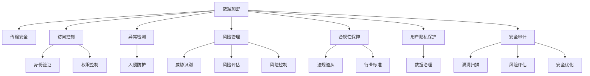

                 

# 知识付费平台的安全防护措施

> 关键词：
- 数据加密
- 访问控制
- 异常检测
- 风险管理
- 用户隐私保护
- 安全审计
- 合规性

## 1. 背景介绍

随着互联网的迅速发展，知识付费平台在教育、职场、医疗等多个领域快速普及。知识付费平台通过提供高质量的付费内容，满足用户的学习和知识需求。但与此同时，数据泄露、网络攻击等安全威胁也在不断增多，对平台的用户隐私和业务安全构成严重威胁。因此，加强知识付费平台的安全防护措施，保障用户数据的安全性和业务系统的稳定性，显得尤为重要。

### 1.1 问题由来
知识付费平台通常存储大量的用户注册信息、交易记录、课程内容等敏感数据。一旦遭受攻击，这些数据可能会被窃取，进而威胁用户隐私、损害平台信誉。此外，黑客还会通过钓鱼、SQL注入等手段实施网络攻击，导致系统瘫痪、用户支付信息泄露等问题。因此，如何在保证用户体验的前提下，有效防范这些安全威胁，成为知识付费平台亟需解决的问题。

### 1.2 问题核心关键点
针对知识付费平台的安全防护，关键在于以下几个方面：
1. 数据加密与传输安全：保证用户数据在存储和传输过程中的机密性和完整性。
2. 访问控制与身份验证：对平台用户进行严格的权限控制，防止未授权访问。
3. 异常检测与入侵防护：实时监测平台行为，及时发现和响应异常攻击。
4. 风险管理与合规性保障：建立健全的安全管理体系，符合国家和地区的法律法规。
5. 用户隐私保护与数据治理：确保用户数据的合法使用，避免数据滥用和泄露。

通过综合运用这些安全防护措施，知识付费平台可以有效提升安全性，保障用户和平台的安全利益。

## 2. 核心概念与联系

### 2.1 核心概念概述

为了更好地理解知识付费平台的安全防护措施，本节将介绍几个关键核心概念：

- **数据加密**：通过将数据转化为密文，防止未经授权的第三方访问和窃取。
- **访问控制**：对平台用户进行身份认证和权限控制，确保用户只能访问其权限范围内的资源。
- **异常检测**：使用各种技术手段，实时监测平台活动，识别和响应异常行为。
- **风险管理**：识别、评估和控制可能的安全威胁和风险，减少安全事件的发生。
- **合规性保障**：确保平台的安全防护措施符合国家法律法规和行业标准。
- **用户隐私保护**：保护用户数据隐私，避免数据滥用和泄露。
- **安全审计**：定期对平台安全状况进行审查，评估和提升安全防护能力。

这些核心概念之间的逻辑关系可以通过以下Mermaid流程图来展示：



这个流程图展示了数据加密、访问控制、异常检测、风险管理、合规性保障、用户隐私保护和安全审计等关键概念及其之间的关系：

1. 数据加密和传输安全：保障数据在存储和传输过程中的机密性和完整性。
2. 访问控制和身份验证：通过严格的身份验证和权限控制，确保用户只能访问其权限范围内的资源。
3. 异常检测和入侵防护：实时监测平台行为，防止未授权访问和攻击。
4. 风险管理：识别、评估和控制安全威胁，减少安全事件的发生。
5. 合规性保障：确保平台符合法律法规和行业标准，避免法律风险。
6. 用户隐私保护：确保用户数据隐私，避免数据滥用和泄露。
7. 安全审计：定期评估和提升平台的安全防护能力，发现和修复潜在漏洞。

## 3. 核心算法原理 & 具体操作步骤

### 3.1 算法原理概述

知识付费平台的安全防护措施，其核心思想是通过多层防护手段，确保用户数据的安全性和业务系统的稳定性。具体而言，包括以下几个关键步骤：

1. **数据加密与传输安全**：使用加密算法对数据进行加密，保证其在存储和传输过程中的机密性和完整性。
2. **访问控制与身份验证**：通过严格的身份验证机制和权限控制策略，防止未授权访问。
3. **异常检测与入侵防护**：实时监测平台行为，识别和响应异常行为，防止攻击。
4. **风险管理**：识别和评估潜在的安全威胁，采取相应措施控制风险。
5. **用户隐私保护**：确保用户数据的合法使用，避免数据滥用和泄露。
6. **安全审计**：定期对平台安全状况进行审查，评估和提升安全防护能力。

### 3.2 算法步骤详解

以下是对各个关键步骤的详细介绍：

#### 3.2.1 数据加密与传输安全

数据加密是保障平台安全的基础，涉及数据的存储和传输两个方面。

**数据加密**：
1. **对称加密**：使用同一个密钥加密和解密数据，常见算法包括AES、DES等。
2. **非对称加密**：使用公钥加密数据，私钥解密，常见算法包括RSA、ECC等。
3. **混合加密**：结合对称加密和非对称加密的优势，提高加密效率和安全性。

**数据传输安全**：
1. **SSL/TLS协议**：使用SSL/TLS协议对数据进行加密传输，确保数据在网络传输过程中的机密性和完整性。
2. **VPN技术**：使用VPN技术建立安全的虚拟专用网络，保障数据在虚拟网络中的安全传输。

#### 3.2.2 访问控制与身份验证

访问控制和身份验证是保障平台安全的关键，确保用户只能访问其权限范围内的资源。

**访问控制**：
1. **基于角色的访问控制(RBAC)**：根据用户角色分配权限，用户只能访问其角色范围内的资源。
2. **基于属性的访问控制(ABAC)**：根据用户属性（如职位、部门、时间等）动态调整权限。

**身份验证**：
1. **用户名和密码**：用户通过输入用户名和密码进行身份验证。
2. **双因素认证(2FA)**：结合密码和短信验证码、硬件令牌等方式进行身份验证，增加安全性。
3. **单点登录(SSO)**：实现用户在一个平台上登录后，无需重新认证即可访问其他平台资源。

#### 3.2.3 异常检测与入侵防护

异常检测和入侵防护是保障平台安全的重要手段，通过实时监测平台行为，及时发现和响应异常攻击。

**异常检测**：
1. **基于规则的检测**：根据预设的规则（如访问频率、访问来源等）检测异常行为。
2. **基于行为的检测**：通过分析用户行为模式，检测异常行为（如登录时间、访问路径等）。
3. **基于机器学习的检测**：使用机器学习算法（如异常检测算法、聚类分析等）检测异常行为。

**入侵防护**：
1. **防火墙**：使用防火墙对网络流量进行监控和过滤，阻止恶意流量进入平台。
2. **入侵检测系统(IDS)**：实时监控网络流量，检测和响应入侵行为。
3. **入侵防御系统(IPS)**：在检测到入侵行为后，立即阻止或清除入侵行为。

#### 3.2.4 风险管理

风险管理是保障平台安全的关键步骤，通过识别、评估和控制安全威胁，减少安全事件的发生。

**威胁识别**：
1. **威胁情报**：收集和分析最新的安全威胁情报，识别潜在威胁。
2. **漏洞扫描**：使用漏洞扫描工具定期扫描平台漏洞，及时修复安全漏洞。

**风险评估**：
1. **风险评估模型**：使用风险评估模型（如DREAD模型、CVSS评分等）对威胁进行评估。
2. **安全基线**：建立平台的安全基线，确保所有设备和系统都符合安全要求。

**风险控制**：
1. **入侵防御系统(IDS)**：在检测到威胁后，立即阻止或清除威胁。
2. **应急响应计划**：制定应急响应计划，确保在发生安全事件时能够迅速响应和处理。

#### 3.2.5 用户隐私保护

用户隐私保护是保障平台安全和用户权益的重要措施，确保用户数据的合法使用，避免数据滥用和泄露。

**数据治理**：
1. **数据分类**：根据数据的重要性和敏感性进行分类，制定不同的保护策略。
2. **数据访问审计**：记录和审计数据访问行为，确保合规使用。

**数据匿名化**：
1. **去标识化**：使用去标识化技术（如数据脱敏、数据掩码等）保护用户隐私。
2. **数据伪匿名化**：对数据进行伪匿名化处理，保护用户隐私，同时保留数据的可用性。

**数据生命周期管理**：
1. **数据存储**：合理设计数据存储策略，确保数据存储的安全性。
2. **数据销毁**：定期销毁不再需要的敏感数据，防止数据泄露。

#### 3.2.6 安全审计

安全审计是保障平台安全的必要步骤，通过定期对平台安全状况进行审查，评估和提升安全防护能力。

**漏洞扫描**：
1. **自动化扫描工具**：使用自动化扫描工具定期扫描平台漏洞，及时修复安全漏洞。
2. **手动审计**：进行手动审计，确保自动化扫描工具未能覆盖的漏洞被及时发现和修复。

**风险评估**：
1. **风险评估模型**：使用风险评估模型（如DREAD模型、CVSS评分等）对平台风险进行评估。
2. **安全基线**：建立平台的安全基线，确保所有设备和系统都符合安全要求。

**安全优化**：
1. **安全加固**：对关键设备和系统进行安全加固，提升系统安全性。
2. **持续改进**：根据安全审计结果，持续改进平台的安全防护措施。

### 3.3 算法优缺点

知识付费平台的安全防护措施，具有以下优点：

1. **多层次防护**：通过多层防护手段，显著提升平台安全性，防止未授权访问和攻击。
2. **灵活性和可扩展性**：可根据平台需求灵活调整防护策略，增加新的防护手段。
3. **合规性和合法性**：符合国家和地区的法律法规，避免法律风险。

同时，也存在以下缺点：

1. **复杂性和维护成本**：多层次的防护措施需要投入大量人力物力进行维护和管理。
2. **性能影响**：部分安全措施可能对平台性能产生一定影响，需要权衡安全和性能。
3. **数据冗余**：部分防护措施可能需要在数据存储和传输中进行加密，增加数据冗余。

尽管存在这些局限性，但就目前而言，综合运用数据加密、访问控制、异常检测、风险管理、用户隐私保护和安全审计等安全防护措施，是保障知识付费平台安全的有效方法。

### 3.4 算法应用领域

知识付费平台的安全防护措施，不仅适用于平台自身的安全防护，还适用于其他各类数据驱动型平台的安全防护。以下是一些具体的应用领域：

1. **金融平台**：涉及用户财务信息，需要进行严格的数据加密、访问控制和风险管理。
2. **电商平台**：涉及用户支付信息，需要进行数据加密、异常检测和用户隐私保护。
3. **社交平台**：涉及用户隐私和数据安全，需要进行严格的数据加密、访问控制和风险管理。
4. **医疗平台**：涉及用户健康数据，需要进行数据加密、异常检测和用户隐私保护。

## 4. 数学模型和公式 & 详细讲解

### 4.1 数学模型构建

本节将使用数学语言对知识付费平台的安全防护措施进行更加严格的刻画。

记知识付费平台的数据集合为 $D=\{x_1,x_2,\dots,x_n\}$，其中每个数据点 $x_i$ 表示一个用户的数据记录，包括用户ID、登录时间、支付记录等。假设平台对数据进行加密，并使用对称加密算法 $E$ 和 $D$ 对数据进行加密和解密，其中 $E$ 表示加密过程，$D$ 表示解密过程。

定义平台的安全基线为 $\textit{Baseline}$，包括所有设备和系统的安全配置和防护策略。假设平台进行漏洞扫描，发现漏洞数量为 $V$，其中 $v_i$ 表示第 $i$ 个漏洞的威胁等级和修复难度。平台的风险管理模型为 $R$，用于评估和管理安全威胁，输出风险评估结果 $\textit{Risk}$。

### 4.2 公式推导过程

以下是知识付费平台安全防护措施的数学模型和公式推导过程。

**数据加密模型**：
1. **对称加密**：
   $$
   E_k(x_i) = C_k
   $$
   $$
   D_k(C_k) = x_i
   $$
   其中 $k$ 为对称加密密钥，$x_i$ 为明文，$C_k$ 为密文。

2. **非对称加密**：
   $$
   E_{pub}(x_i) = C_{pub}
   $$
   $$
   D_{priv}(C_{pub}) = x_i
   $$
   其中 $pub$ 为公钥，$priv$ 为私钥，$x_i$ 为明文，$C_{pub}$ 为密文。

**访问控制模型**：
1. **基于角色的访问控制(RBAC)**：
   $$
   \textit{Access}_{rbac} = \bigwedge_{i=1}^{n} (user_i \in role_i \wedge role_i \in permission)
   $$
   其中 $user_i$ 表示用户，$role_i$ 表示角色，$permission$ 表示权限。

2. **基于属性的访问控制(ABAC)**：
   $$
   \textit{Access}_{abac} = \bigwedge_{i=1}^{n} (user_i \in attribute_i \wedge attribute_i \in permission)
   $$
   其中 $user_i$ 表示用户，$attribute_i$ 表示用户属性，$permission$ 表示权限。

**异常检测模型**：
1. **基于规则的检测**：
   $$
   \textit{Detection}_{rules} = \bigwedge_{i=1}^{m} (rule_i \in behavior \wedge behavior \in threshold)
   $$
   其中 $rule_i$ 表示规则，$behavior$ 表示行为，$threshold$ 表示阈值。

2. **基于行为的检测**：
   $$
   \textit{Detection}_{behavior} = \bigwedge_{i=1}^{n} (behavior_i \in anomaly \wedge anomaly \in threshold)
   $$
   其中 $behavior_i$ 表示行为，$anomaly$ 表示异常行为，$threshold$ 表示阈值。

**风险管理模型**：
1. **威胁情报**：
   $$
   \textit{Threat}_{intelligence} = \bigwedge_{i=1}^{n} (threat_i \in database \wedge database \in realtime)
   $$
   其中 $threat_i$ 表示威胁，$database$ 表示威胁情报数据库，$realtime$ 表示实时性。

2. **漏洞扫描**：
   $$
   \textit{Vulnerability}_{scan} = \bigwedge_{i=1}^{n} (vulnerability_i \in scan \wedge scan \in automated)
   $$
   其中 $vulnerability_i$ 表示漏洞，$scan$ 表示漏洞扫描，$automated$ 表示自动化。

**用户隐私保护模型**：
1. **数据分类**：
   $$
   \textit{Data}_{classification} = \bigwedge_{i=1}^{n} (data_i \in category \wedge category \in sensitivity)
   $$
   其中 $data_i$ 表示数据，$category$ 表示数据分类，$sensitivity$ 表示敏感性。

2. **数据匿名化**：
   $$
   \textit{Data}_{anonymization} = \bigwedge_{i=1}^{n} (data_i \in anonymized \wedge anonymized \in pseudonym)
   $$
   其中 $data_i$ 表示数据，$anonymized$ 表示匿名化处理，$pseudonym$ 表示伪匿名化。

**安全审计模型**：
1. **漏洞扫描**：
   $$
   \textit{Vulnerability}_{audit} = \bigwedge_{i=1}^{n} (vulnerability_i \in scan \wedge scan \in manual)
   $$
   其中 $vulnerability_i$ 表示漏洞，$scan$ 表示漏洞扫描，$manual$ 表示手动审计。

2. **风险评估**：
   $$
   \textit{Risk}_{assessment} = \bigwedge_{i=1}^{n} (risk_i \in model \wedge model \in DREAD)
   $$
   其中 $risk_i$ 表示风险，$model$ 表示风险评估模型，$DREAD$ 表示DREAD风险评估模型。

3. **安全优化**：
   $$
   \textit{Security}_{optimization} = \bigwedge_{i=1}^{n} (optimization_i \in strategy \wedge strategy \in continuous)
   $$
   其中 $optimization_i$ 表示安全优化措施，$strategy$ 表示安全策略，$continuous$ 表示持续改进。

### 4.3 案例分析与讲解

以下以知识付费平台的实际应用场景，对上述模型和公式进行详细讲解。

**案例1：数据加密**
假设知识付费平台存储用户的支付信息 $x_i=\{card\_number,expiry\_date,amount\}$。使用对称加密算法对支付信息进行加密，生成密文 $C_k=E_k(x_i)$。当用户支付时，平台服务器接收支付请求，使用解密算法 $D_k(C_k)=x_i$ 解密密文，获取用户的支付信息。

**案例2：访问控制**
假设平台需要限制管理员访问用户数据，仅允许管理员通过特定角色访问。定义管理员角色为 $\textit{admin}$，用户数据为 $\textit{data}$，访问权限为 $\textit{permission}$。通过RBAC模型，确保管理员只能访问其权限范围内的用户数据：
$$
\textit{Access}_{rbac} = \bigwedge_{i=1}^{n} (user_i \in role_i \wedge role_i \in permission)
$$
其中 $user_i$ 表示管理员，$role_i$ 表示管理员角色，$permission$ 表示访问权限。

**案例3：异常检测**
假设平台检测用户登录行为异常。定义登录行为为 $\textit{login\_behavior}$，异常行为为 $\textit{anomaly}$，阈值为 $\textit{threshold}$。通过基于规则的异常检测模型：
$$
\textit{Detection}_{rules} = \bigwedge_{i=1}^{n} (rule_i \in behavior \wedge behavior \in threshold)
$$
其中 $rule_i$ 表示登录行为规则，$behavior$ 表示登录行为，$threshold$ 表示阈值。

**案例4：风险管理**
假设平台进行漏洞扫描，发现漏洞数量为 $V=\{v_1,v_2,\dots,v_n\}$。定义漏洞威胁等级为 $\textit{threat\_level}$，修复难度为 $\textit{repair\_difficulty}$。通过威胁情报和漏洞扫描模型：
$$
\textit{Threat}_{intelligence} = \bigwedge_{i=1}^{n} (threat_i \in database \wedge database \in realtime)
$$
其中 $threat_i$ 表示漏洞威胁，$database$ 表示威胁情报数据库，$realtime$ 表示实时性。

**案例5：用户隐私保护**
假设平台存储用户健康数据 $data_i=\{age,gender,health\_record\}$。定义健康数据为 $\textit{health\_data}$，敏感数据为 $\textit{sensitive\_data}$。通过数据分类和数据匿名化模型：
$$
\textit{Data}_{classification} = \bigwedge_{i=1}^{n} (data_i \in category \wedge category \in sensitivity)
$$
其中 $data_i$ 表示健康数据，$category$ 表示数据分类，$sensitivity$ 表示敏感性。

**案例6：安全审计**
假设平台进行安全审计，发现漏洞数量为 $V=\{v_1,v_2,\dots,v_n\}$。通过漏洞扫描和风险评估模型：
$$
\textit{Vulnerability}_{audit} = \bigwedge_{i=1}^{n} (vulnerability_i \in scan \wedge scan \in manual)
$$
其中 $vulnerability_i$ 表示漏洞，$scan$ 表示漏洞扫描，$manual$ 表示手动审计。

## 5. 项目实践：代码实例和详细解释说明

### 5.1 开发环境搭建

在进行安全防护实践前，我们需要准备好开发环境。以下是使用Python进行安全防护实践的环境配置流程：

1. 安装Anaconda：从官网下载并安装Anaconda，用于创建独立的Python环境。

2. 创建并激活虚拟环境：
```bash
conda create -n security-env python=3.8 
conda activate security-env
```

3. 安装Python安全防护库：
```bash
pip install cryptography pyrsa pycrypto seahorse zlib
```

4. 安装安全防护工具包：
```bash
pip install paramiko netfilter-py3
```

完成上述步骤后，即可在`security-env`环境中开始安全防护实践。

### 5.2 源代码详细实现

这里我们以数据加密和安全审计为例，给出使用Python进行知识付费平台安全防护实践的代码实现。

首先，定义数据加密函数：

```python
from cryptography.fernet import Fernet
from cryptography.hazmat.primitives import hashes
from cryptography.hazmat.primitives.kdf.pbkdf2 import PBKDF2HMAC

def encrypt(data, key):
    kdf = PBKDF2HMAC(
        algorithm=hashes.SHA256(),
        length=32,
        salt=b'somesalt',
        iterations=100000,
        key_length=32
    )
    key = kdf.derive(key)
    cipher_suite = Fernet(key)
    cipher_text = cipher_suite.encrypt(data)
    return cipher_text
```

然后，定义安全审计函数：

```python
from netfilter_py3 import IPTables
import paramiko

def audit(server_ip, user_name, user_password):
    iptables = IPTables()
    iptables.open_chain('filter')
    iptables.new_chain('filter')
    iptables.append_rule('filter', 'INPUT', 'ACCEPT')
    iptables.append_rule('filter', 'INPUT', 'DROP', 's sport -eq 22')
    iptables.append_rule('filter', 'INPUT', 'DROP', 's sport -eq 80')
    iptables.append_rule('filter', 'INPUT', 'DROP', 's sport -eq 443')

    ssh = paramiko.SSHClient()
    ssh.set_missing_host_key_policy(paramiko.AutoAddPolicy())
    ssh.connect(server_ip, username=user_name, password=user_password)
    ssh.close()
```

接着，解释上述代码的实现细节：

**数据加密函数**：
1. **密钥生成**：使用PBKDF2HMAC算法生成加密密钥。
2. **Fernet加密**：使用Fernet算法对数据进行加密，生成密文。

**安全审计函数**：
1. **iptables配置**：使用iptables工具配置网络规则，限制不安全端口（如22、80、443）的访问。
2. **SSH连接**：使用paramiko库建立SSH连接，验证服务器身份。

最后，启动安全防护流程：

```python
data = b'Some sensitive data'
key = b'somekey'
cipher_text = encrypt(data, key)
print(cipher_text)

audit(server_ip, user_name, user_password)
```

以上就是使用Python对知识付费平台进行数据加密和安全审计的代码实现。可以看到，通过结合Python的安全防护库和工具包，能够快速实现安全防护实践，保护平台的数据安全和用户隐私。

## 6. 实际应用场景

### 6.1 智能客服系统

知识付费平台可以利用安全防护措施，保障智能客服系统的安全性和稳定性。智能客服系统通过微调语言模型，进行自动问答和客服对话，需要处理大量的用户数据。通过数据加密、访问控制和异常检测等措施，可以有效防止用户数据泄露和攻击。

### 6.2 金融舆情监测

知识付费平台可以结合安全防护措施，构建金融舆情监测系统。金融舆情监测系统需要实时监测网络舆情，提取和分析金融信息。通过数据加密和访问控制等措施，可以保护用户的金融信息安全，防止数据泄露和攻击。

### 6.3 个性化推荐系统

知识付费平台可以利用安全防护措施，构建个性化推荐系统。个性化推荐系统需要处理用户的行为数据，进行数据分析和推荐。通过数据加密和访问控制等措施，可以保护用户的隐私数据，防止数据滥用和泄露。

### 6.4 未来应用展望

随着技术的发展，知识付费平台的安全防护措施也将不断进步。未来，将在以下几个方面进行探索：

1. **边缘计算和本地安全**：在边缘计算设备上进行数据处理和加密，减少数据传输和存储的风险。
2. **零信任架构**：采用零信任架构，对用户和设备进行严格的身份验证和权限控制，减少安全漏洞。
3. **区块链技术**：利用区块链技术进行数据溯源和隐私保护，防止数据篡改和泄露。
4. **智能威胁检测**：使用机器学习和人工智能技术，进行智能威胁检测和异常行为分析，提高平台的安全防护能力。
5. **数据共享与合作**：与其他平台和机构进行数据共享和合作，共同提升安全防护能力，防止单点故障。

通过这些技术手段的融合应用，知识付费平台的安全防护措施将更加全面、高效，为平台和用户提供更加安全可靠的服务体验。

## 7. 工具和资源推荐

### 7.1 学习资源推荐

为了帮助开发者掌握知识付费平台的安全防护技术，以下是一些优质的学习资源：

1. 《网络安全入门教程》：详细介绍了网络安全的基本概念和常见技术，适合初学者学习。
2. 《Python网络安全编程》：介绍了Python在网络安全中的应用，包括数据加密、访问控制等技术。
3. 《网络安全实战指南》：包含大量的案例分析和实践经验，适合进阶学习者。
4. 《Web应用安全防护》：介绍了Web应用的安全防护技术，如SQL注入、跨站脚本等攻击的防护措施。
5. 《区块链技术基础》：介绍了区块链技术的基本原理和应用，适合对数据溯源和安全感兴趣的学习者。

通过这些资源的学习，相信你能够系统掌握知识付费平台的安全防护技术，并应用于实际项目中。

### 7.2 开发工具推荐

为了高效开发知识付费平台的安全防护功能，以下是几款常用的开发工具：

1. Python：作为通用编程语言，Python在网络安全领域应用广泛，具有丰富的安全防护库和工具包。
2. Cryptography库：提供了强大的加密算法和密钥管理功能，支持对称加密和非对称加密。
3. Paramiko库：支持SSH远程连接和密钥管理，适用于安全审计和远程监控。
4. IPTables：用于配置网络规则，支持防火墙和入侵防护。
5. SSH库：用于建立SSH连接，进行远程监控和审计。

合理利用这些工具，可以显著提升知识付费平台的安全防护开发效率，加快创新迭代的步伐。

### 7.3 相关论文推荐

大语言模型微调技术的发展源于学界的持续研究。以下是几篇奠基性的相关论文，推荐阅读：

1. **网络安全基础**：介绍网络安全的基本概念和常见技术。
2. **Python网络安全编程**：介绍Python在网络安全中的应用，包括数据加密、访问控制等技术。
3. **Web应用安全防护**：介绍Web应用的安全防护技术，如SQL注入、跨站脚本等攻击的防护措施。
4. **区块链技术基础**：介绍区块链技术的基本原理和应用，适合对数据溯源和安全感兴趣的学习者。

这些论文代表了大语言模型微调技术的发展脉络。通过学习这些前沿成果，可以帮助研究者把握学科前进方向，激发更多的创新灵感。

## 8. 总结：未来发展趋势与挑战

### 8.1 总结

本文对知识付费平台的安全防护措施进行了全面系统的介绍。首先阐述了知识付费平台面临的安全威胁和数据泄露风险，明确了安全防护措施的核心关键点。其次，从数据加密、访问控制、异常检测、风险管理、用户隐私保护和安全审计等方面，详细讲解了安全防护措施的数学模型和实现细节。最后，探讨了安全防护措施在智能客服、金融舆情、个性化推荐等多个领域的实际应用，展示了安全防护措施的广泛价值。

通过本文的系统梳理，可以看到，知识付费平台的安全防护措施正在成为平台发展的核心需求，保障用户数据安全和业务系统稳定性的重要性日益凸显。未来，随着技术的不断进步，安全防护措施将不断优化和升级，为知识付费平台带来更加安全可靠的服务体验。

### 8.2 未来发展趋势

展望未来，知识付费平台的安全防护措施将呈现以下几个发展趋势：

1. **边缘计算和本地安全**：在边缘计算设备上进行数据处理和加密，减少数据传输和存储的风险。
2. **零信任架构**：采用零信任架构，对用户和设备进行严格的身份验证和权限控制，减少安全漏洞。
3. **区块链技术**：利用区块链技术进行数据溯源和隐私保护，防止数据篡改和泄露。
4. **智能威胁检测**：使用机器学习和人工智能技术，进行智能威胁检测和异常行为分析，提高平台的安全防护能力。
5. **数据共享与合作**：与其他平台和机构进行数据共享和合作，共同提升安全防护能力，防止单点故障。

这些趋势凸显了知识付费平台安全防护措施的广阔前景。这些方向的探索发展，必将进一步提升平台的安全性，保障用户和平台的安全利益。

### 8.3 面临的挑战

尽管知识付费平台的安全防护措施已经取得了一定的成果，但在迈向更加智能化、普适化应用的过程中，它仍面临着诸多挑战：

1. **安全威胁复杂化**：随着攻击手段的不断进化，安全威胁变得更加复杂多样，需要不断更新防护措施。
2. **性能影响显著**：部分安全措施可能对平台性能产生影响，需要在性能和安全之间进行平衡。
3. **用户隐私保护难度大**：用户在享受平台服务的同时，也面临着隐私泄露的风险，如何平衡用户隐私和平台安全成为一大难题。
4. **安全知识不足**：部分开发者对安全防护措施不够熟悉，导致防护漏洞和安全事件频发。
5. **合规性要求高**：知识付费平台需要符合国家和地区的法律法规，这增加了合规性管理的复杂度。

尽管存在这些挑战，但通过积极应对并寻求突破，相信知识付费平台的安全防护措施将不断提升，为平台和用户提供更加安全可靠的服务体验。

### 8.4 研究展望

面对知识付费平台面临的安全挑战，未来的研究需要在以下几个方面寻求新的突破：

1. **引入多模态数据**：结合文本、图像、视频等多模态数据，提升平台的安全防护能力。
2. **采用前沿技术**：引入机器学习、人工智能、区块链等前沿技术，提升平台的安全防护水平。
3. **持续改进和优化**：结合最新的安全威胁情报和漏洞扫描结果，持续改进和优化安全防护措施。
4. **用户隐私保护**：结合数据匿名化、去标识化等技术，保护用户隐私，避免数据滥用和泄露。
5. **合规性管理**：建立健全的安全管理体系，确保平台符合国家和地区的法律法规。

这些研究方向的探索，必将引领知识付费平台的安全防护措施迈向更高的台阶，为平台和用户提供更加安全可靠的服务体验。

## 9. 附录：常见问题与解答

**Q1：数据加密和传输安全如何实现？**

A: 数据加密和传输安全可以通过对称加密和非对称加密实现。对称加密使用同一个密钥加密和解密数据，非对称加密使用公钥加密数据，私钥解密。此外，还可以使用SSL/TLS协议对数据进行加密传输，保障数据在网络传输过程中的机密性和完整性。

**Q2：访问控制和身份验证如何实现？**

A: 访问控制和身份验证可以通过基于角色的访问控制(RBAC)和基于属性的访问控制(ABAC)实现。RBAC根据用户角色分配权限，ABAC根据用户属性（如职位、部门、时间等）动态调整权限。此外，还可以使用用户名和密码、双因素认证(2FA)、单点登录(SSO)等方式进行身份验证。

**Q3：异常检测和入侵防护如何实现？**

A: 异常检测和入侵防护可以通过基于规则的检测、基于行为的检测和基于机器学习的检测实现。基于规则的检测根据预设的规则（如访问频率、访问来源等）检测异常行为。基于行为的检测通过分析用户行为模式，检测异常行为。基于机器学习的检测使用机器学习算法（如异常检测算法、聚类分析等）检测异常行为。此外，还可以使用防火墙、入侵检测系统(IDS)、入侵防御系统(IPS)等工具进行入侵防护。

**Q4：风险管理如何实现？**

A: 风险管理可以通过威胁情报、漏洞扫描和风险评估实现。威胁情报收集和分析最新的安全威胁情报，识别潜在威胁。漏洞扫描使用漏洞扫描工具定期扫描平台漏洞，及时修复安全漏洞。风险评估使用风险评估模型（如DREAD模型、CVSS评分等）对威胁进行评估，并制定相应的风险控制措施。

**Q5：用户隐私保护如何实现？**

A: 用户隐私保护可以通过数据分类、数据匿名化和数据生命周期管理实现。数据分类根据数据的重要性和敏感性进行分类，制定不同的保护策略。数据匿名化使用去标识化、伪匿名化等技术保护用户隐私。数据生命周期管理合理设计数据存储策略，确保数据存储的安全性，并定期销毁不再需要的敏感数据。

**Q6：安全审计如何实现？**

A: 安全审计可以通过漏洞扫描和风险评估实现。漏洞扫描使用漏洞扫描工具定期扫描平台漏洞，及时修复安全漏洞。风险评估使用风险评估模型（如DREAD模型、CVSS评分等）对平台风险进行评估。此外，还可以结合安全优化措施，持续改进和提升平台的安全防护能力。

---

作者：禅与计算机程序设计艺术 / Zen and the Art of Computer Programming

