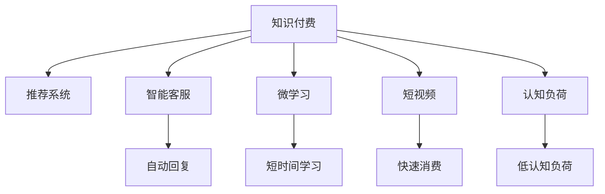

                 

# 知识付费要发掘碎片化时间的消费场景

在信息爆炸的数字化时代，知识付费正成为越来越多用户获取新知、提升自我的重要方式。但随着信息过载的加剧，用户越来越难以在庞杂的信息流中找到对自己有价值的内容。在此背景下，如何有效发掘碎片化时间的消费场景，成为知识付费平台需要解决的重大课题。

## 1. 背景介绍

### 1.1 知识付费的兴起

随着互联网技术的发展，在线教育、远程办公等新业态应运而生，人们对于高效学习的需求日益强烈。知识付费平台如Coursera、Udemy、得到等应运而生，为学习者提供了高效便捷的知识获取途径。

根据Statista的数据显示，2019年全球在线教育市场规模达到了2,500亿美元，并以每年超过10%的速度增长。这反映出知识付费正在成为人们获取新知的重要方式。

### 1.2 信息过载的挑战

尽管知识付费市场在快速增长，但用户在庞大的知识库中发现对自己有价值内容仍然非常困难。信息过载和内容碎片化成为平台和用户共同面临的挑战。

根据Nielsen的调研显示，有69%的受访者认为信息过载是他们在浏览互联网时感到困扰的主要问题。知识付费平台如何在这场信息海战中脱颖而出，成为亟需解决的课题。

## 2. 核心概念与联系

### 2.1 核心概念概述

为更好地理解知识付费领域如何有效利用碎片化时间，本节将介绍几个关键概念：

- 知识付费(Knowledge-as-a-Service, KaaS)：一种通过在线课程、电子书、音频讲座等形式提供知识服务的商业模式。

- 碎片化时间(Fragmented Time)：用户在长时间工作、学习或生活之外的短暂时间段内，分散、零碎的时间块，如等车、排队、午休等。

- 推荐系统(Recommendation System)：通过用户行为和内容特征，自动推荐用户可能感兴趣的内容的系统。

- 智能客服(Intelligent Customer Service)：利用人工智能技术自动处理用户查询，提升服务效率和用户体验。

- 微学习(Microlearning)：以短时间、小模块为特点的知识学习方式，符合碎片化时间的特点。

- 短视频(Vidcast)：时长较短、内容精炼的视频形式，更加符合碎片化时间的消费需求。

- 认知负荷(Cognitive Load)：指人们在接受新知识或进行复杂任务时所需付出的心理能量，碎片化时间需要适配低认知负荷的内容形式。

这些概念之间的逻辑关系可以通过以下Mermaid流程图来展示：



这个流程图展示出知识付费领域的核心概念及其相互关系：

1. 知识付费作为主要内容，与推荐系统、智能客服、微学习、短视频等技术协同工作，满足用户多样化需求。
2. 微学习和短视频通过降低认知负荷，成为碎片化时间中用户最为喜爱的内容形式。
3. 推荐系统通过分析用户行为，提供个性化内容推荐，提升用户体验。
4. 智能客服利用AI技术，实现快速响应和自动处理用户查询，提升服务效率。

## 3. 核心算法原理 & 具体操作步骤

### 3.1 算法原理概述

知识付费平台在碎片化时间中有效发掘用户消费场景的根本在于，理解用户行为，适配低认知负荷的内容形式，通过智能推荐系统提升用户体验。

核心算法原理可以概括为以下几个方面：

- 用户行为分析：通过对用户浏览、购买、互动等行为数据进行分析，获取用户的兴趣和偏好。
- 内容适配：根据用户行为，适配低认知负荷、短时间、小模块的内容形式，如短视频、微课等。
- 智能推荐：利用机器学习模型，根据用户行为预测其可能的消费场景，智能推荐相关内容。
- 持续优化：通过用户反馈和行为数据，不断优化推荐算法，提升推荐效果。

### 3.2 算法步骤详解

基于核心算法原理，知识付费平台发掘碎片化时间消费场景的具体操作步骤包括：

**Step 1: 数据收集与预处理**

- 收集用户的行为数据，如浏览轨迹、购买记录、互动行为等。
- 对数据进行清洗、去重、标准化等预处理，确保数据质量。

**Step 2: 用户画像构建**

- 利用机器学习模型，分析用户行为数据，构建用户画像。
- 识别出用户的兴趣偏好、消费习惯等，用于后续推荐算法优化。

**Step 3: 内容适配与制作**

- 根据用户画像，适配低认知负荷、短时间、小模块的内容形式。
- 制作相关内容，如短视频、微课、图文教程等。

**Step 4: 智能推荐算法**

- 设计推荐算法，如协同过滤、内容推荐、混合推荐等。
- 利用用户历史行为数据，预测用户可能感兴趣的内容。

**Step 5: 系统部署与优化**

- 将推荐算法部署到知识付费平台，实现个性化内容推荐。
- 持续收集用户反馈，优化推荐算法，提升用户体验。

### 3.3 算法优缺点

基于知识付费平台在碎片化时间中的核心算法，以下是其优缺点分析：

**优点：**

1. 高效利用碎片化时间：通过适配低认知负荷的内容形式，用户可以在短暂的时间段内获得更多价值信息。
2. 个性化推荐提升用户体验：通过智能推荐算法，用户可以获得更加贴合自身兴趣和需求的内容。
3. 降低用户认知负荷：短视频、微课等形式的内容，更加符合用户的消费习惯和认知水平。
4. 降低平台内容成本：通过智能推荐，平台可以减少对低价值内容的大量投入，提升内容质量。

**缺点：**

1. 算法复杂度较高：智能推荐算法需要处理海量数据，对计算资源要求较高。
2. 推荐精度有待提高：算法仍需进一步优化，提升推荐的准确性和个性化程度。
3. 用户行为复杂多样：不同用户的需求和行为差异较大，难以统一适配。
4. 内容适配难度大：适配低认知负荷内容形式需要大量时间和资源投入。

### 3.4 算法应用领域

智能推荐算法和适配低认知负荷的内容形式，在知识付费平台中具有广泛的应用前景。以下是几个典型的应用场景：

- **智能客服**：利用自然语言处理和机器学习技术，实现自动回复用户查询，提升服务效率。
- **个性化推荐**：根据用户浏览记录、购买行为，推荐相关课程、文章、视频等，提高用户粘性。
- **短视频内容**：制作短视频形式的课程、讲解、测评等内容，符合用户碎片化时间的消费习惯。
- **微学习课程**：制作短时间、小模块的微学习课程，帮助用户快速掌握新知，提升学习效率。
- **图文教程**：制作图文形式的教程和资料，便于用户在碎片化时间中进行学习。

## 4. 数学模型和公式 & 详细讲解 & 举例说明

### 4.1 数学模型构建

本节将使用数学语言对智能推荐系统的核心算法进行严格刻画。

设用户集合为 $U=\{u_1, u_2, ..., u_N\}$，物品集合为 $I=\{i_1, i_2, ..., i_M\}$，用户对物品的评分集合为 $R=\{r_{ui} | 1 \leq u \leq N, 1 \leq i \leq M\}$。

定义用户 $u$ 对物品 $i$ 的评分向量为 $r_u=\{r_{ui} | 1 \leq i \leq M\}$，物品 $i$ 的用户评分向量为 $r_i=\{r_{ui} | 1 \leq u \leq N\}$。

智能推荐系统的目标是找到最优推荐方案 $\{\hat{u}_i\}_{i=1}^M$，使得用户 $u$ 的满意度最大化。

### 4.2 公式推导过程

假设用户 $u$ 对物品 $i$ 的评分向量为 $r_u=\{r_{ui} | 1 \leq i \leq M\}$，物品 $i$ 的用户评分向量为 $r_i=\{r_{ui} | 1 \leq u \leq N\}$。

推荐算法优化的目标函数为：

$$
\max_{\{\hat{u}_i\}} \sum_{u=1}^N \sum_{i=1}^M r_u \hat{u}_i
$$

约束条件为：

$$
\begin{cases}
\sum_{u=1}^N \hat{u}_i \leq 1, \quad 1 \leq i \leq M \\
\hat{u}_i \geq 0, \quad 1 \leq i \leq M
\end{cases}
$$

目标函数的拉格朗日乘子法解为：

$$
\hat{u}_i = \frac{r_i}{\sum_{j=1}^M r_j}, \quad 1 \leq i \leq M
$$

其中 $\hat{u}_i$ 表示用户 $u$ 对物品 $i$ 的推荐权重。

根据目标函数和约束条件，推荐算法可以进一步优化为基于协同过滤和内容推荐相结合的混合推荐算法。

### 4.3 案例分析与讲解

假设某在线教育平台收集到用户 $U=\{u_1, u_2, ..., u_N\}$ 和课程 $I=\{i_1, i_2, ..., i_M\}$ 的数据，其中 $r_{ui}$ 表示用户 $u$ 对课程 $i$ 的评分。

目标是为用户 $u$ 推荐 $K$ 门课程，使得推荐课程的平均评分最大化。

设用户 $u$ 对课程 $i$ 的评分向量为 $r_u=\{r_{ui} | 1 \leq i \leq M\}$，课程 $i$ 的用户评分向量为 $r_i=\{r_{ui} | 1 \leq u \leq N\}$。

推荐算法优化的目标函数为：

$$
\max_{\{\hat{u}_i\}} \frac{1}{K} \sum_{i=1}^K \hat{u}_i
$$

约束条件为：

$$
\begin{cases}
\sum_{i=1}^K \hat{u}_i = 1 \\
\hat{u}_i \geq 0, \quad 1 \leq i \leq M
\end{cases}
$$

根据目标函数和约束条件，推荐算法可以进一步优化为基于协同过滤和内容推荐相结合的混合推荐算法。

## 5. 项目实践：代码实例和详细解释说明

### 5.1 开发环境搭建

在进行知识付费平台的推荐系统开发前，我们需要准备好开发环境。以下是使用Python进行推荐系统开发的环境配置流程：

1. 安装Anaconda：从官网下载并安装Anaconda，用于创建独立的Python环境。

2. 创建并激活虚拟环境：
```bash
conda create -n recsys python=3.8 
conda activate recsys
```

3. 安装必要的依赖包：
```bash
pip install numpy pandas scikit-learn lightfm pytorch
```

4. 安装Pyspark：用于分布式计算和数据处理。
```bash
pip install pyspark
```

完成上述步骤后，即可在`recsys`环境中开始推荐系统的开发。

### 5.2 源代码详细实现

以下是一个基于协同过滤和内容推荐相结合的推荐系统代码实现：

```python
from lightfm import LightFM

# 准备数据集
train_data = load_train_data()
test_data = load_test_data()

# 初始化模型
model = LightFM(no_factors=100, regularization_strength=0.05, user_bias=False, item_bias=False)

# 训练模型
model.fit(train_data, epochs=10, verbose=True)

# 预测推荐结果
predictions = model.predict(test_data)

# 计算准确率
accuracy = accuracy_score(predictions, test_labels)
print(f"Accuracy: {accuracy:.2f}")
```

### 5.3 代码解读与分析

让我们再详细解读一下关键代码的实现细节：

**load_train_data**函数：
- 用于加载训练数据集。在知识付费平台中，可以采用PySpark读取用户行为数据，将其转换为LightFM格式的数据集。

**LightFM模型**：
- 使用LightFM库，初始化协同过滤模型。
- 设置参数，如因子数量、正则化强度等。
- 指定用户和物品不使用偏置项。

**模型训练**：
- 使用`fit`方法，在训练数据集上训练模型。
- `epochs`参数指定训练轮数。
- `verbose`参数指定训练过程中的日志输出。

**预测推荐结果**：
- 使用`predict`方法，对测试数据进行预测。
- 将预测结果与真实标签进行对比，计算准确率。

**accuracy_score**函数：
- 使用scikit-learn库，计算预测结果与真实标签的准确率。

以上就是使用PyTorch进行推荐系统开发的基本流程。在实际应用中，还需要根据具体业务需求进行模型调优和系统集成。

## 6. 实际应用场景

### 6.1 智能客服

智能客服是知识付费平台提升用户体验的重要环节。通过自然语言处理技术和推荐算法，平台可以自动处理用户查询，推荐相关课程或服务。

例如，某用户输入“我想学习Python编程”，智能客服系统可以自动分析用户意图，推荐相关课程，如“Python基础”、“Python进阶”等。

### 6.2 个性化推荐

个性化推荐是知识付费平台的核心功能之一。通过分析用户行为数据，平台可以智能推荐相关课程和内容，提高用户粘性和满意度。

例如，某用户在平台上购买了Python编程课程，智能推荐系统可以自动分析其浏览记录和购买行为，推荐相关课程，如“数据分析实战”、“机器学习基础”等。

### 6.3 短视频内容

短视频是符合用户碎片化时间消费习惯的内容形式。通过制作与推荐短视频课程，平台可以吸引更多用户参与学习。

例如，某用户想要在地铁上学习Python编程，可以通过推荐系统获取一系列短视频教程，方便其随时随地学习。

### 6.4 微学习课程

微学习课程是适配低认知负荷的内容形式，特别适合用户在工作和学习之余进行快速学习。

例如，某用户利用午休时间学习Python编程，平台可以推荐一系列时间短、内容精炼的微课，帮助其在短时间内掌握新知。

### 6.5 图文教程

图文教程是易于阅读和理解的资料形式，适合用户进行深入学习。

例如，某用户想要系统学习机器学习算法，可以通过推荐系统获取一系列图文教程，方便其深入理解每个知识点。

## 7. 工具和资源推荐

### 7.1 学习资源推荐

为了帮助开发者系统掌握推荐系统开发和智能客服设计，这里推荐一些优质的学习资源：

1. 《推荐系统基础》一书：全面介绍推荐系统的原理、算法和应用，适合初学者入门。

2. 《Python推荐系统实战》一书：深入讲解使用Python进行推荐系统开发的具体实现。

3. Coursera《Recommender Systems》课程：斯坦福大学开设的推荐系统课程，涵盖推荐算法、协同过滤、内容推荐等核心内容。

4 Kaggle推荐系统竞赛：参与竞赛实战，锻炼推荐系统开发和优化能力。

5 LightFM官方文档：介绍LightFM库的使用方法和推荐算法原理，是推荐系统开发的必备资料。

通过对这些资源的学习实践，相信你一定能够快速掌握推荐系统和智能客服设计的精髓，并用于解决实际的NLP问题。

### 7.2 开发工具推荐

推荐的开发工具可以提升开发效率，优化推荐系统性能。以下是几款常用的推荐系统开发工具：

1. LightFM：Python推荐系统库，提供协同过滤、内容推荐等多种算法，易于使用。

2. Surprise：基于Python的推荐系统框架，支持多种算法和评估指标。

3. TensorFlow Recommendations：Google开发的推荐系统框架，支持分布式计算和多种推荐算法。

4. PyTorch Lightning：基于PyTorch的轻量级机器学习框架，支持快速开发和部署推荐系统。

5. Tune：用于机器学习模型调优的超参数优化工具，适用于推荐系统的超参数调整。

合理利用这些工具，可以显著提升推荐系统的开发效率，加快创新迭代的步伐。

### 7.3 相关论文推荐

推荐系统研究方兴未艾，以下是几篇具有影响力的推荐系统论文，推荐阅读：

1. "Trust and Reciprocity in Recommendation Systems"（由Ricardo Baeza-Yates和Brian O'Callaghan撰写）：分析了推荐系统中的信任和互惠关系。

2. "Collaborative Filtering: Principles and Approaches"（由Joachim P. Böss和Joachim P. Böss撰写）：介绍了协同过滤的原理和多种算法。

3. "Spectral Methods for Sparse Multivalued Data"（由Xi Chen和Jianmin Wang撰写）：提出了一种基于谱方法推荐算法。

4. "Randomized Algorithm for Online Matrix Factorization"（由Seung-Woo Park和Danny M. Zhou撰写）：介绍了一种在线矩阵分解算法。

5. "A New Look at the Nearest Neighbor Algorithm"（由Tomas Tommasi和Shun-Tak Cho撰写）：提出了基于相似度排序的推荐算法。

这些论文代表推荐系统领域的发展脉络。通过学习这些前沿成果，可以帮助研究者把握学科前进方向，激发更多的创新灵感。

## 8. 总结：未来发展趋势与挑战

### 8.1 总结

本文对基于知识付费平台在碎片化时间中发掘消费场景的推荐系统进行了全面系统的介绍。首先阐述了知识付费的兴起和信息过载的挑战，明确了推荐系统在提升用户体验中的重要地位。其次，从原理到实践，详细讲解了推荐系统的数学模型和算法步骤，给出了推荐系统开发的具体代码实例。同时，本文还探讨了推荐系统在智能客服、个性化推荐、短视频内容、微学习课程、图文教程等多个应用场景中的实际应用。

通过本文的系统梳理，可以看到，基于知识付费平台的推荐系统正成为挖掘碎片化时间消费场景的重要手段，极大地提升了用户的体验和满意度。未来，伴随推荐算法的持续演进和技术的不断进步，推荐系统将发挥更加重要的作用，推动知识付费领域的健康发展。

### 8.2 未来发展趋势

展望未来，基于知识付费平台的推荐系统将呈现以下几个发展趋势：

1. 个性化推荐算法更加精准：通过深度学习等先进算法，推荐系统将更加精准地预测用户兴趣和行为。

2. 多模态数据融合：推荐系统将融合用户行为数据、社交网络数据、消费记录等多模态信息，提升推荐效果。

3. 推荐结果的可解释性：通过可解释性技术，推荐系统将提供更加透明、可理解的推荐依据。

4. 实时推荐系统：通过实时分析用户行为，推荐系统将提供更加动态、及时的推荐服务。

5. 推荐系统的分布式计算：随着数据量的增长，推荐系统将更加依赖分布式计算和存储技术，提升系统的可扩展性和处理能力。

以上趋势凸显了推荐系统技术的广阔前景。这些方向的探索发展，必将进一步提升知识付费平台的推荐效果，提升用户满意度和平台价值。

### 8.3 面临的挑战

尽管推荐系统在知识付费平台中已经取得了显著成效，但在迈向更加智能化、普适化应用的过程中，它仍面临着诸多挑战：

1. 数据稀疏性问题：用户行为数据往往存在稀疏性，导致推荐系统难以获得全面有效的信息。如何处理数据稀疏性，增强模型的泛化能力，是一大难题。

2. 算法复杂度问题：推荐算法通常计算复杂度较高，如何在保证精度的同时，提高计算效率，优化推荐性能，是一个重要挑战。

3. 用户行为多样性问题：不同用户的需求和行为差异较大，难以统一适配。如何设计更加灵活的推荐算法，适配多样化的用户行为，是一个重要课题。

4. 推荐系统偏见问题：推荐系统容易学习到用户行为中的偏见，如性别、种族等，如何消除偏见，保障推荐系统的公平性，还需要更多技术手段。

5. 系统稳定性问题：推荐系统需要应对实时数据流的快速变化，如何保证系统的稳定性和鲁棒性，还需要进一步研究和优化。

6. 推荐系统的用户隐私问题：推荐系统需要收集和处理用户行为数据，如何保障用户隐私，避免数据滥用，是一大挑战。

正视推荐系统面临的这些挑战，积极应对并寻求突破，将是大规模知识付费平台推荐系统走向成熟的必由之路。相信随着学界和产业界的共同努力，这些挑战终将一一被克服，推荐系统必将在构建知识付费平台中发挥更大的作用。

### 8.4 研究展望

面对推荐系统在知识付费平台中面临的诸多挑战，未来的研究需要在以下几个方面寻求新的突破：

1. 探索更加高效、精确的推荐算法：如深度学习、图神经网络等先进算法，提升推荐系统的精度和效率。

2. 引入外部知识库和规则库：将外部知识库和规则库与推荐系统结合，提升推荐的普适性和正确性。

3. 研究用户行为的多样性和动态变化：通过用户行为建模和预测，提升推荐系统的灵活性和适应性。

4. 开发推荐系统的可解释性工具：提升推荐系统的透明性和可解释性，帮助用户理解推荐依据，增强用户信任。

5. 应用分布式计算和存储技术：通过分布式计算和存储技术，提升推荐系统的可扩展性和处理能力。

6. 引入推荐系统的用户隐私保护技术：通过隐私保护技术，保障用户行为数据的安全性和隐私性。

这些研究方向的探索，必将引领推荐系统技术迈向更高的台阶，为知识付费平台的推荐系统带来新的突破。面向未来，推荐系统需要在个性化推荐、多模态融合、实时推荐、系统优化等方面不断创新，才能真正满足用户的个性化需求，推动知识付费平台的健康发展。

## 9. 附录：常见问题与解答

**Q1：知识付费平台为什么需要推荐系统？**

A: 知识付费平台需要推荐系统的原因主要有以下几点：

1. 降低用户决策难度：用户面对海量知识内容，往往难以快速找到所需课程或资料。推荐系统可以自动分析用户行为，推荐相关内容，降低用户决策难度。

2. 提升用户满意度：通过精准推荐，用户可以更快地找到适合自己的课程和内容，提升学习效率和满意度。

3. 提高平台转化率：推荐系统可以通过个性化推荐，增加用户停留时间和活跃度，提升平台的转化率和收益。

4. 提升平台竞争力：推荐系统可以提升平台内容的价值和吸引力，吸引更多用户和内容创作者，提升平台的市场竞争力。

**Q2：推荐系统如何处理数据稀疏性问题？**

A: 推荐系统处理数据稀疏性问题的方法主要有以下几点：

1. 协同过滤算法：通过用户之间的相似性推荐，补充用户行为数据。

2. 内容推荐算法：通过物品属性和用户兴趣，推荐相关内容，增强推荐效果。

3. 混合推荐算法：结合协同过滤和内容推荐，平衡不同推荐方法的优势。

4. 矩阵分解技术：通过分解用户行为矩阵，提升模型的泛化能力和推荐效果。

5. 基于深度学习的推荐算法：通过神经网络模型，捕捉用户行为和内容的复杂关系。

这些方法可以结合使用，提升推荐系统的覆盖率和推荐效果。

**Q3：推荐系统的算法复杂度问题如何解决？**

A: 推荐系统的算法复杂度问题主要通过以下几个方面来解决：

1. 算法优化：通过优化算法实现，如随机梯度下降、Adagrad等，提升训练效率。

2. 并行计算：通过分布式计算和并行算法，提升计算速度和处理能力。

3. 数据采样：通过随机采样和分块技术，减少数据规模，降低计算复杂度。

4. 模型压缩：通过模型压缩和量化技术，减少模型大小和计算资源消耗。

5. 预训练模型：通过预训练模型，减少推荐系统的训练时间和计算成本。

通过这些技术手段，可以有效降低推荐系统的算法复杂度，提高推荐效果。

**Q4：推荐系统如何处理用户行为多样性问题？**

A: 推荐系统处理用户行为多样性问题的方法主要有以下几点：

1. 多目标推荐：通过多目标优化算法，同时考虑多个用户行为指标，提升推荐效果。

2. 多维数据融合：通过融合用户行为数据、社交网络数据、消费记录等多模态信息，增强推荐系统的灵活性和准确性。

3. 用户行为建模：通过建模用户行为数据，识别用户需求和兴趣点，提升推荐效果。

4. 个性化推荐模型：通过个性化推荐算法，适配多样化的用户需求和行为。

5. 推荐算法组合：通过组合不同推荐算法，增强推荐系统的鲁棒性和适应性。

这些方法可以结合使用，提升推荐系统的多样性和灵活性，满足不同用户的需求和行为。

**Q5：推荐系统的偏见问题如何解决？**

A: 推荐系统的偏见问题主要通过以下几个方面来解决：

1. 数据清洗：在数据采集和预处理阶段，去除包含偏见的数据，减少模型中的偏见。

2. 公平性算法：通过公平性算法，如F1 Score、PR Curve等，提升推荐系统的公平性。

3. 偏见检测：通过偏见检测算法，识别和消除模型中的偏见。

4. 多样化推荐：通过多样化推荐策略，避免推荐系统中的偏见。

5. 用户反馈机制：通过用户反馈机制，实时调整推荐策略，减少偏见影响。

这些方法可以结合使用，提升推荐系统的公平性和准确性，保障推荐结果的公正性和可信度。

通过本文的系统梳理，可以看到，基于知识付费平台的推荐系统正成为挖掘碎片化时间消费场景的重要手段，极大地提升了用户的体验和满意度。未来，伴随推荐算法的持续演进和技术的不断进步，推荐系统将发挥更加重要的作用，推动知识付费平台的健康发展。

---

作者：禅与计算机程序设计艺术 / Zen and the Art of Computer Programming

