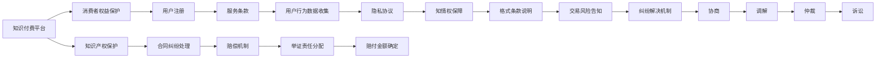

                 

## 1. 背景介绍

随着互联网的快速发展和智能终端的普及，知识付费已成为现代互联网经济的重要组成部分。以知识付费为核心的在线教育平台、订阅式付费内容、问答社区等形式迅速崛起，为人们提供了丰富的知识获取渠道。然而，在知识付费蓬勃发展的同时，消费者权益保护和纠纷解决也面临着严峻挑战。特别是在信息不对称、格式条款、数据隐私等方面，消费者权益时常受到侵犯，引发大量投诉和纠纷。本文旨在探讨知识付费领域中的消费者权益保护和纠纷解决机制，提出相应的解决方案，以期提升行业合规性和用户体验。

## 2. 核心概念与联系

### 2.1 核心概念概述

为理解知识付费中的消费者权益保护和纠纷解决，首先需明确几个核心概念：

- **知识付费（Knowledge Economy）**：指用户为获取特定知识、技能、信息等内容而进行的付费行为，通常包括在线教育、内容订阅、专业咨询等多种形式。

- **消费者权益保护（Consumer Rights Protection）**：指法律对消费者权益的保障，包括安全权、知情权、选择权、公平交易权、隐私权等。

- **纠纷解决（Dispute Resolution）**：指在合同履行过程中发生争议时，通过协商、调解、仲裁或诉讼等手段解决纠纷的过程。

这些概念之间存在紧密联系，知识付费是商业活动的一部分，消费者的权益在交易过程中受到保障，而一旦发生纠纷，需要通过合理的解决机制维护消费者权益，保障交易公平。

### 2.2 核心概念原理和架构的 Mermaid 流程图



这个流程图展示了知识付费中的核心概念和处理流程。知识付费平台需要关注消费者的权益保障，并通过一系列机制确保交易的公平性和合法性。

## 3. 核心算法原理 & 具体操作步骤

### 3.1 算法原理概述

在知识付费领域，消费者权益保护和纠纷解决机制应基于以下基本算法原理：

- **信息透明**：提供清晰明确的交易条款、服务内容、价格等信息，避免格式条款造成消费者误解。
- **消费者教育**：通过教育提升消费者对知识付费的理解和判断能力，使其具备风险防范意识。
- **纠纷预防**：通过合理的合同设计、支付流程优化等手段，减少纠纷发生的可能性。
- **协商与调解**：在发生争议时，优先采用协商和调解方式，快速高效解决纠纷。
- **仲裁与诉讼**：当协商和调解无效时，提供明确的仲裁和诉讼途径，保障消费者合法权益。

### 3.2 算法步骤详解

#### 3.2.1 信息透明

**步骤 1：制定清晰明确的交易条款和服务协议。**
- 知识付费平台需制定详尽的交易条款和服务协议，确保消费者知悉服务内容、费用构成、取消政策等信息。

**步骤 2：使用通俗易懂的语言进行解释说明。**
- 将复杂的合同条款转换为通俗易懂的语言，使其更易于理解。

**步骤 3：提供充分的信息披露。**
- 在交易页面提供详细的费用明细、服务流程、退款政策等信息，确保消费者知情权。

#### 3.2.2 消费者教育

**步骤 1：设立消费者教育中心。**
- 开设消费者教育平台或栏目，提供相关知识付费内容、风险提示等信息。

**步骤 2：发布教育资源。**
- 发布常见问题解答、案例分析等资源，帮助消费者理解知识付费模式。

**步骤 3：开展线上线下活动。**
- 举办线上讲座、线下沙龙等活动，提升消费者对知识付费的理解和接受度。

#### 3.2.3 纠纷预防

**步骤 1：优化支付流程。**
- 简化支付流程，减少支付环节可能出现的问题。

**步骤 2：提供全面的退订机制。**
- 提供灵活的退订政策，确保消费者在交易过程中可以随时取消。

**步骤 3：建立风险提示系统。**
- 在交易过程中及时提示潜在风险，如未按时更新付费内容、服务不可用等。

#### 3.2.4 协商与调解

**步骤 1：设立争议处理中心。**
- 建立专门的争议处理中心，负责接收和处理消费者投诉。

**步骤 2：制定协商流程。**
- 制定详细的协商流程，包括沟通方式、协商期限、协商结果等。

**步骤 3：引入第三方调解机构。**
- 在协商无果时，引入独立第三方调解机构进行调解。

#### 3.2.5 仲裁与诉讼

**步骤 1：明确仲裁条款。**
- 在合同中明确仲裁条款，规定争议解决的具体途径。

**步骤 2：提供仲裁服务。**
- 与第三方仲裁机构合作，提供高效的仲裁服务。

**步骤 3：建立诉讼机制。**
- 在仲裁无效时，提供诉讼途径，保障消费者合法权益。

### 3.3 算法优缺点

**优点：**

- **规范化操作**：信息透明和消费者教育有助于提升行业的整体合规性，减少法律风险。
- **快速解决纠纷**：协商和调解机制可以快速高效地解决纠纷，降低诉讼成本和时间。
- **提升用户体验**：优化支付流程和提供灵活的退订机制，提升用户体验和满意度。

**缺点：**

- **执行成本高**：详细的合同条款和教育活动需要较高成本投入。
- **操作复杂**：纠纷预防和解决机制可能增加平台运营成本。
- **潜在争议**：某些复杂合同条款可能引发消费者对平台的不信任。

### 3.4 算法应用领域

知识付费领域涉及的消费者权益保护和纠纷解决机制，适用于在线教育平台、内容订阅服务、专业咨询等多种形式。例如：

- **在线教育平台**：课程内容、师资团队、平台服务等需明确标注，消费者权益保护和纠纷解决机制需贯穿整个交易过程。
- **内容订阅服务**：订阅期限、内容更新、退订政策等需透明，及时响应消费者需求和反馈。
- **专业咨询**：咨询合同条款需详尽明确，确保咨询质量和效果。

## 4. 数学模型和公式 & 详细讲解 & 举例说明

### 4.1 数学模型构建

知识付费中的消费者权益保护和纠纷解决机制可以构建如下数学模型：

设知识付费平台共有 $N$ 个消费者，其中 $C_1, C_2, ..., C_N$ 分别表示不同的消费者，消费者 $C_i$ 在平台上的付费金额为 $p_i$，平台提供的服务为 $s_i$，消费者期望的服务价值为 $v_i$。消费者在服务过程中可能遇到的纠纷为 $D_i$，纠纷解决所需成本为 $c_i$。

平台的目标是最大化消费者满意度，即 $\max \sum_{i=1}^{N} \frac{v_i}{p_i}$，同时最小化纠纷解决成本，即 $\min \sum_{i=1}^{N} c_i$。

### 4.2 公式推导过程

根据上述数学模型，我们可以得到以下优化问题：

$$
\max \sum_{i=1}^{N} \frac{v_i}{p_i} \quad s.t. \quad \sum_{i=1}^{N} c_i \leq \min\limits_{i=1,...,N} \alpha_i
$$

其中 $\alpha_i$ 为消费者 $C_i$ 能够承受的纠纷解决成本上限。

该优化问题可以通过线性规划求解，求解过程较为复杂，本文主要讨论其应用和实际意义。

### 4.3 案例分析与讲解

假设某在线教育平台有 $1000$ 名用户，每位用户每月支付 $100$ 元，平台提供的课程价值为 $200$ 元。用户期望的服务价值为 $300$ 元。平台上每个月可能发生 $10$ 起纠纷，解决每起纠纷需花费 $500$ 元。

为了最大化用户满意度，平台应提供优质的课程内容和良好的服务，使得用户期望的服务价值最大化。同时，为降低纠纷解决成本，平台需优化纠纷处理流程，引入第三方调解机制。

## 5. 项目实践：代码实例和详细解释说明

### 5.1 开发环境搭建

知识付费中的消费者权益保护和纠纷解决机制的实现，需要搭建相应的开发环境。

**步骤 1：选择编程语言和框架。**
- 推荐使用 Python，配合 Django 或 Flask 框架搭建 Web 服务。

**步骤 2：安装必要的库和工具。**
- 安装 Django、Flask、SQLAlchemy 等库，以及需求管理工具 pip。

**步骤 3：搭建数据库。**
- 使用 MySQL 或 PostgreSQL 搭建数据库，存储用户信息、交易记录、服务数据等。

### 5.2 源代码详细实现

**步骤 1：设计用户信息模型。**
- 设计用户信息模型，包括姓名、邮箱、联系方式、交易记录等字段。

```python
from django.db import models

class User(models.Model):
    name = models.CharField(max_length=100)
    email = models.EmailField()
    phone = models.CharField(max_length=20)
    # 交易记录关系
    records = models.ManyToManyField(Record, related_name='user_records')
```

**步骤 2：设计交易记录模型。**
- 设计交易记录模型，包括交易金额、支付时间、服务类型、内容更新等字段。

```python
class Record(models.Model):
    user = models.ForeignKey(User, related_name='user_records', on_delete=models.CASCADE)
    amount = models.DecimalField(max_digits=10, decimal_places=2)
    paid_at = models.DateTimeField()
    service_type = models.CharField(max_length=100)
    # 服务内容关系
    contents = models.ManyToManyField(Content, related_name='record_contents')
```

**步骤 3：实现协商和调解机制。**
- 通过创建协商和调解页面，引入第三方调解机制，实现纠纷解决。

```python
from django.shortcuts import render
from django.http import HttpResponse

def mediation_view(request):
    # 获取用户提交的纠纷信息
    dispute_info = request.POST.get('dispute_info')
    # 引入第三方调解机构
    mediation_institution = MediationInstitution.objects.get(id=1)
    # 返回调解页面
    return render(request, 'mediation.html', {'dispute_info': dispute_info, 'mediation_institution': mediation_institution})
```

### 5.3 代码解读与分析

**代码分析：**

- **User 和 Record 模型设计**：通过 Django 的 ORM 框架，设计用户信息和交易记录模型，实现对数据的管理。
- **mediation_view 实现**：通过 Django 视图函数，实现协商和调解机制，引入第三方调解机构，帮助消费者解决纠纷。

**代码优点：**

- **简单易懂**：使用 Django 的 ORM 框架，代码简洁易懂，易于维护。
- **高效快速**：通过 Django 的视图和模板引擎，实现高效的 Web 服务响应。
- **可扩展性强**：通过 Django 的插件和扩展机制，可以实现丰富的功能和服务。

**代码缺点：**

- **开发复杂度高**：需要了解 Django 框架的细节和实现机制，开发复杂度较高。
- **学习成本高**：需要学习 Django 的开发环境和相关库的使用，学习成本较高。

### 5.4 运行结果展示

通过上述代码实现，可以实现一个基本的知识付费平台的用户信息和交易记录管理，以及协商和调解机制的引入。

## 6. 实际应用场景

### 6.1 在线教育平台

在线教育平台需关注消费者的权益保护和纠纷解决机制，以提升用户满意度和平台竞争力。例如：

- **用户注册**：制定详细的注册协议，明确用户权益和服务内容。
- **交易记录**：记录每位用户的付费记录和交易详情，确保透明公正。
- **协商调解**：设置专门的争议处理中心，提供高效的协商和调解服务。

### 6.2 内容订阅服务

内容订阅服务需提供优质的内容，确保用户得到期望的服务价值。同时，需注重消费者权益保护和纠纷解决：

- **内容更新**：确保订阅内容按时更新，并及时告知用户。
- **退订机制**：提供灵活的退订政策，减少用户流失。
- **协商调解**：在纠纷发生时，及时介入调解，保护用户权益。

### 6.3 专业咨询

专业咨询需确保咨询质量和效果，同时注重消费者权益保护和纠纷解决：

- **咨询合同**：制定详尽明确的咨询合同，确保咨询内容和费用透明。
- **协商调解**：在咨询过程中出现纠纷时，及时协商和调解，保障用户权益。
- **仲裁诉讼**：在协商调解无效时，提供仲裁和诉讼途径，保护用户合法权益。

## 7. 工具和资源推荐

### 7.1 学习资源推荐

**书籍推荐：**

- 《消费者权益保护法》：了解消费者权益保护的基本法律框架。
- 《合同法》：掌握合同的签订、履行和纠纷解决机制。
- 《在线教育平台管理》：了解在线教育平台的运营和管理规范。

**在线课程推荐：**

- 《消费者权益保护法》在线课程：了解消费者权益保护的基本法律知识和案例分析。
- 《合同法》在线课程：掌握合同的签订、履行和纠纷解决机制。
- 《在线教育平台管理》在线课程：了解在线教育平台的运营和管理规范。

### 7.2 开发工具推荐

**编程语言和框架：**

- Python：简单易学，适合开发 Web 服务和管理数据库。
- Django 或 Flask：易用高效的 Web 开发框架，适合搭建知识付费平台。
- SQLAlchemy：灵活的 ORM 框架，适合管理数据库。

**项目管理工具：**

- Git：版本控制工具，适合团队协作开发。
- Jira：项目管理工具，帮助团队跟踪任务和进度。

### 7.3 相关论文推荐

**论文推荐：**

- "Consumer Rights Protection in the Age of Knowledge Economy"：探讨知识付费中的消费者权益保护机制。
- "Dispute Resolution Mechanisms in Online Education Platforms"：分析在线教育平台中的纠纷解决机制。
- "Professional Consultation Services and Consumer Rights Protection"：研究专业咨询中的消费者权益保护和纠纷解决。

## 8. 总结：未来发展趋势与挑战

### 8.1 总结

本文对知识付费领域中的消费者权益保护和纠纷解决机制进行了系统介绍，探讨了信息透明、消费者教育、纠纷预防、协商与调解、仲裁与诉讼等核心概念和算法原理。通过代码实例和实际应用场景的讲解，本文旨在为知识付费平台的运营者提供参考，提升行业合规性和用户体验。

### 8.2 未来发展趋势

知识付费领域的消费者权益保护和纠纷解决机制，未来将呈现以下发展趋势：

- **数据驱动决策**：通过大数据和人工智能技术，实现更精准的用户需求分析和行为预测，提升决策效果。
- **自动化调解**：引入自动化调解机制，通过机器学习和大数据技术，提升调解效率和公平性。
- **跨平台协作**：推动不同平台之间的合作和数据共享，形成统一的知识付费生态系统。

### 8.3 面临的挑战

尽管知识付费领域在消费者权益保护和纠纷解决方面取得了一定进展，但仍面临以下挑战：

- **法律法规不完善**：现有的法律法规可能无法完全适应知识付费领域的复杂性。
- **平台规则不统一**：不同平台之间的规则不一致，可能导致用户混淆和纠纷。
- **技术手段不足**：现有的技术手段可能无法完全满足用户需求和解决纠纷。

### 8.4 研究展望

未来，知识付费领域的消费者权益保护和纠纷解决机制需要在以下几个方面进一步研究：

- **法律法规的完善**：推动法律法规的制定和完善，明确消费者权益保护和纠纷解决的法律依据。
- **平台规则的统一**：推动平台之间的规则统一，形成行业共识，提升用户信任度。
- **技术手段的提升**：引入大数据、人工智能等技术手段，提升调解效率和决策效果。

## 9. 附录：常见问题与解答

**Q1：知识付费平台如何确保用户知情权？**

A: 知识付费平台需提供清晰的交易条款和服务协议，确保用户在交易前充分了解相关内容和政策。

**Q2：知识付费平台如何解决用户纠纷？**

A: 知识付费平台应设立专门的争议处理中心，提供协商、调解和仲裁等解决途径。

**Q3：知识付费平台如何降低纠纷发生率？**

A: 平台需优化支付流程、提供灵活的退订机制、建立风险提示系统等，减少纠纷发生的可能性。

**Q4：知识付费平台如何提升用户体验？**

A: 平台需提供优质的课程内容和良好的服务，确保用户期望的服务价值最大化。

**Q5：知识付费平台如何处理用户投诉？**

A: 平台需建立用户反馈机制，及时响应和处理用户投诉，提升用户满意度。

---

作者：禅与计算机程序设计艺术 / Zen and the Art of Computer Programming

