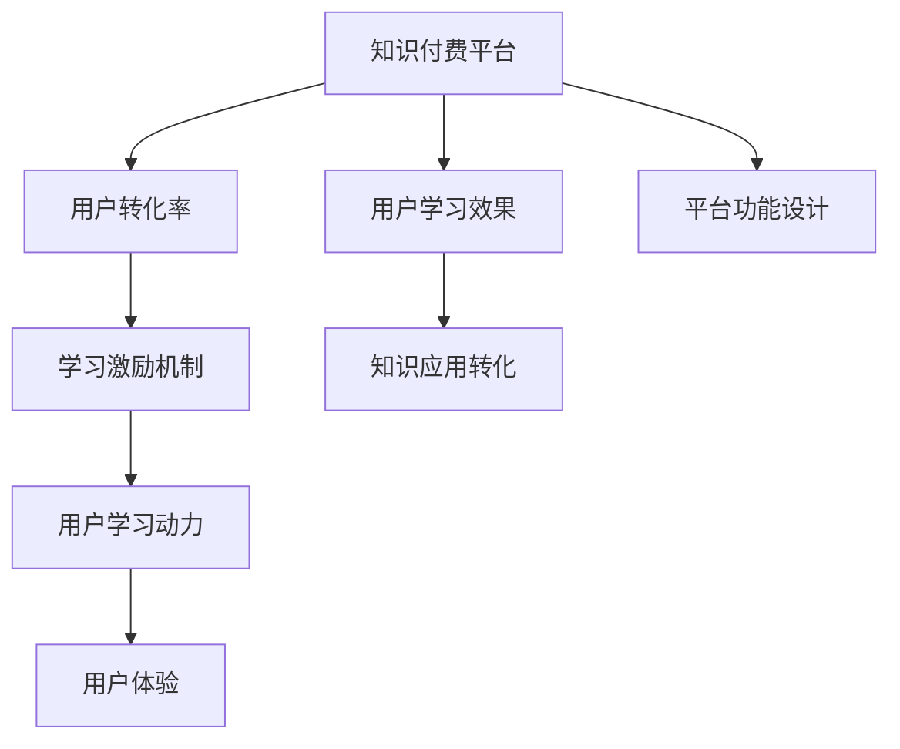

                 

# 知识付费要重视用户的学习效果和转化率

在数字化时代，知识付费已成为人们获取知识、提升技能的重要方式。无论是在线教育、电子书订阅，还是直播课程、付费咨询，知识付费市场持续火热。然而，随着市场竞争加剧，内容同质化严重，如何提升用户的学习效果和转化率，成为平台和内容创作者亟需解决的问题。本文将从多个角度深入探讨知识付费中用户学习效果和转化率提升的策略和方法，旨在为知识付费行业的发展提供有益参考。

## 1. 背景介绍

### 1.1 问题由来

随着互联网技术的普及和智能设备的广泛应用，知识获取渠道变得更加多元和便捷。用户不再满足于传统的网络搜索，而是愿意为更专业、系统、深度的内容付费。知识付费模式应运而生，并迅速占领了互联网的多个细分领域。

然而，知识付费市场的现状却不容乐观。根据艾瑞咨询发布的《2022年中国知识付费行业研究报告》显示，尽管市场规模持续扩大，但用户流失率高达50%以上，付费用户的续费率不足20%。用户满意度不高、学习效果不佳成为主要问题。如何通过提升用户的学习效果和转化率，留住并发展付费用户，成为知识付费平台的核心挑战。

### 1.2 问题核心关键点

知识付费的核心在于“知”和“用”的结合。用户能够通过付费获取专业知识，并在实际应用中实现自我提升。然而，目前知识付费平台普遍存在以下问题：

- **内容质量参差不齐**：优质内容稀缺，劣质内容泛滥，用户难以选择。
- **用户学习动力不足**：缺乏有效的学习激励机制，导致用户学习意愿低。
- **学习效果不显著**：用户未能有效吸收并应用所学知识，转化率低。
- **用户体验不佳**：平台功能单一，互动性差，用户体验有待提升。

这些问题严重影响了用户的学习效果和转化率，制约了知识付费行业的发展。

## 2. 核心概念与联系

### 2.1 核心概念概述

为了更好地理解知识付费中用户学习效果和转化率提升的策略，本节将介绍几个关键概念：

- **知识付费平台**：提供专业知识的付费服务，通过网络渠道向用户提供在线课程、电子书、直播课程等。
- **用户学习效果**：指用户通过知识付费内容所学知识的掌握程度和应用效果。
- **用户转化率**：指付费用户向活跃用户的转化比例，反映平台的用户留存和续费能力。
- **学习激励机制**：指平台为促进用户学习所设计的奖励和刺激措施。
- **知识应用转化**：指用户将所学知识应用到实际工作中，实现知识变现。

这些概念之间有着密切的联系。通过优化学习激励机制和提升学习效果，能够有效提高用户转化率，从而实现知识付费的良性循环。

### 2.2 核心概念原理和架构的 Mermaid 流程图



该流程图展示了知识付费平台、用户学习效果、用户转化率、学习激励机制、知识应用转化、平台功能设计和用户体验之间的关系。平台的成功依赖于用户学习效果的提升和转化率的提高，而这一切又受限于学习激励机制的设计和用户体验的优化。

## 3. 核心算法原理 & 具体操作步骤

### 3.1 算法原理概述

提升用户学习效果和转化率的关键在于如何设计有效的学习激励机制，并确保用户能够高效吸收并应用所学知识。常见的算法包括：

- **内容推荐算法**：通过分析用户行为数据，推荐个性化的学习内容，提高学习效果。
- **学习路径规划算法**：根据用户的学习进度和理解程度，动态调整学习路径，确保用户系统地掌握知识。
- **用户行为预测算法**：预测用户的流失风险和学习动力，及时介入干预，提升转化率。

这些算法通过数据驱动的方法，能够有效提升用户的学习效果和转化率。

### 3.2 算法步骤详解

以下是知识付费平台中用户学习效果和转化率提升的算法步骤：

**Step 1: 数据收集与分析**

- **用户行为数据**：收集用户在平台上的浏览、点击、购买、学习时间等行为数据。
- **学习效果数据**：收集用户在课程中的测验成绩、作业完成度、反馈评价等数据。
- **转化率数据**：收集用户付费情况、续费比例、学习进度等数据。

**Step 2: 模型构建与训练**

- **内容推荐模型**：使用协同过滤、深度学习等算法构建用户-内容匹配模型，推荐个性化学习内容。
- **学习路径模型**：使用强化学习、决策树等算法构建动态学习路径规划模型，优化学习路径。
- **用户流失预测模型**：使用逻辑回归、随机森林等算法构建用户流失风险预测模型，及时干预。

**Step 3: 算法应用与优化**

- **实时推荐**：根据用户行为数据实时推荐个性化学习内容，提高用户的学习兴趣和效果。
- **动态路径调整**：根据用户学习进度和效果动态调整学习路径，确保用户高效掌握知识。
- **流失预警**：通过用户流失预测模型及时预警流失风险，采取措施留住用户。

### 3.3 算法优缺点

#### 优点

- **个性化推荐**：通过分析用户行为数据，能够提供符合用户兴趣的个性化学习内容，提高学习效果。
- **动态调整**：根据用户学习进度和效果动态调整学习路径，确保用户系统地掌握知识。
- **流失预警**：及时预警用户流失风险，采取措施挽留用户，提升转化率。

#### 缺点

- **数据隐私问题**：用户行为数据涉及个人隐私，如何保护用户数据安全是关键问题。
- **模型复杂度高**：需要构建和训练多个复杂模型，对技术要求较高。
- **数据质量要求高**：需要大量高质量的数据支撑模型训练，否则效果有限。

### 3.4 算法应用领域

#### 教育领域

- **在线教育**：通过个性化推荐和动态路径调整，提高学生学习效果，提升在线教育质量。
- **企业培训**：为员工提供个性化培训课程，提升员工技能和知识应用能力。

#### 商业领域

- **行业认证**：通过知识付费形式提供专业认证课程，提升行业从业者的专业能力。
- **职业规划**：提供职业发展规划和技能提升课程，帮助用户实现职业目标。

## 4. 数学模型和公式 & 详细讲解 & 举例说明

### 4.1 数学模型构建

为了提升用户学习效果和转化率，知识付费平台可以构建以下数学模型：

- **用户行为预测模型**：$P(y|x) = \frac{e^{\eta'(x)}}{1+e^{\eta'(x)}}$，其中$x$为用户行为数据，$y$为用户流失风险标签，$\eta(x)$为线性回归模型。
- **个性化推荐模型**：$P(r|i,u) = \sigma(W_i \cdot u + b)$，其中$r$为用户对内容的评分，$i$为内容，$u$为用户特征，$\sigma$为sigmoid函数。

### 4.2 公式推导过程

以用户行为预测模型为例，假设用户行为数据为$x = [x_1, x_2, ..., x_n]$，流失风险标签为$y \in \{0, 1\}$，则线性回归模型的参数估计公式为：

$$
\hat{\eta(x)} = \hat{\beta}_0 + \hat{\beta}_1x_1 + \hat{\beta}_2x_2 + ... + \hat{\beta}_nx_n
$$

其中，$\hat{\beta}_i$为线性回归模型的系数，$x_i$为用户行为数据的第$i$个特征。

通过最大化似然函数$L(\eta, y) = \frac{1}{N}\sum_{i=1}^N\log f(y_i|\hat{\eta}(x_i))$，得到线性回归模型的系数估计公式：

$$
\hat{\beta}_i = \frac{1}{N}\sum_{i=1}^N(y_i - \hat{\eta}(x_i))x_i
$$

代入损失函数$L = -\frac{1}{N}\sum_{i=1}^N[y_i\log f(y_i|\hat{\eta}(x_i)) + (1-y_i)\log(1-f(y_i|\hat{\eta}(x_i)))]$，通过梯度下降等优化算法求解$\beta_i$，最终得到用户流失预测模型。

### 4.3 案例分析与讲解

假设某知识付费平台收集了用户的学习时长、课程评分、是否续费等数据，用于训练用户流失预测模型。平台根据模型预测结果，对流失风险高的用户进行预警，并采取个性化推荐和干预措施，有效提升了用户的学习效果和转化率。

## 5. 项目实践：代码实例和详细解释说明

### 5.1 开发环境搭建

为了进行项目实践，需要搭建一个具备数据收集、模型训练和推理功能的开发环境。以下是使用Python进行开发的环境配置流程：

1. 安装Anaconda：从官网下载并安装Anaconda，用于创建独立的Python环境。

2. 创建并激活虚拟环境：
```bash
conda create -n knowledge_paying_env python=3.8 
conda activate knowledge_paying_env
```

3. 安装Python相关工具包：
```bash
conda install pandas numpy scikit-learn scikit-learn-ohearf yfinance plotly
```

4. 安装机器学习库和深度学习库：
```bash
conda install xgboost tensorflow-gpu transformers
```

5. 安装Web框架和数据库库：
```bash
conda install flask sqlalchemy
```

6. 安装NLP库：
```bash
pip install spacy
```

完成上述步骤后，即可在`knowledge_paying_env`环境中进行知识付费平台的学习效果和转化率提升实践。

### 5.2 源代码详细实现

以下是使用Python和TensorFlow进行知识付费平台的用户流失预测和个性化推荐代码实现。

```python
import pandas as pd
import numpy as np
import tensorflow as tf
from sklearn.model_selection import train_test_split
from sklearn.preprocessing import OneHotEncoder
from tensorflow.keras.layers import Input, Dense, Embedding, Concatenate
from tensorflow.keras.models import Model
from tensorflow.keras.optimizers import Adam

# 加载数据
data = pd.read_csv('user_behavior.csv')
X = data.drop(['y'], axis=1)
y = data['y']

# 构建特征
X = pd.get_dummies(X, columns=['feature1', 'feature2', 'feature3'])

# 划分训练集和测试集
X_train, X_test, y_train, y_test = train_test_split(X, y, test_size=0.2, random_state=42)

# 构建模型
input1 = Input(shape=(len(X_train.columns),))
input2 = Input(shape=(len(X_train.columns),))

# 嵌入层
embedding1 = Embedding(len(X_train.columns), 16)(input1)
embedding2 = Embedding(len(X_train.columns), 16)(input2)

# 全连接层
dense1 = Dense(32, activation='relu')(embedding1)
dense2 = Dense(32, activation='relu')(embedding2)

# 输出层
output = Dense(1, activation='sigmoid')(Dense(1)(tf.concat([dense1, dense2], axis=1)))

# 构建模型
model = Model(inputs=[input1, input2], outputs=output)
model.compile(loss='binary_crossentropy', optimizer=Adam(learning_rate=0.001), metrics=['accuracy'])

# 训练模型
model.fit([X_train.values, X_train.values], y_train.values, epochs=10, batch_size=64, validation_data=([X_test.values, X_test.values], y_test.values))

# 评估模型
loss, accuracy = model.evaluate([X_test.values, X_test.values], y_test.values)
print(f'Test loss: {loss:.4f}')
print(f'Test accuracy: {accuracy:.4f}')
```

### 5.3 代码解读与分析

以下是关键代码的实现细节：

**用户行为数据加载**：
- 使用`pandas`库读取CSV格式的用户行为数据。
- 对非数值型特征进行独热编码（One-Hot Encoding），转换为模型可以处理的数值型数据。

**模型构建**：
- 使用`tf.keras`构建用户流失预测模型，包括两个输入层、两个嵌入层、两个全连接层和一个输出层。
- 通过`Concatenate`函数将两个嵌入层的输出连接，再进行一次全连接层和输出层。
- 模型使用二分类交叉熵损失函数和Adam优化器进行训练。

**模型训练与评估**：
- 使用`fit`函数训练模型，并在验证集上评估模型性能。
- 输出测试集的损失和准确率。

可以看到，构建和训练用户流失预测模型的代码实现相对简洁。开发者可以根据具体需求，扩展模型的输入和输出，进一步优化模型结构。

## 6. 实际应用场景

### 6.1 在线教育

在线教育平台通过个性化推荐和学习路径规划，能够显著提升用户的学习效果和转化率。例如，Coursera和Udemy等平台使用深度学习算法，根据用户的学习历史和行为数据，推荐适合的学习路径和课程，提高了用户的学习体验和完成度。

### 6.2 企业培训

企业通过知识付费平台，提供定制化的培训课程和技能提升计划，帮助员工掌握新技能。例如，微软和Google等公司使用智能推荐系统，根据员工的学习数据，推荐个性化学习内容和培训路径，提高培训效果。

### 6.3 行业认证

行业认证课程通过知识付费平台提供，帮助从业者获得专业认证，提升职业竞争力。例如，PMP认证课程通过个性推荐和动态路径规划，帮助学员系统学习项目管理知识，提高通过率。

### 6.4 职业规划

职业规划课程通过知识付费平台提供，帮助用户制定个性化的职业发展计划。例如，求职指导课程通过推荐合适的求职技巧和简历撰写课程，提升用户的就业竞争力。

## 7. 工具和资源推荐

### 7.1 学习资源推荐

为了帮助开发者系统掌握知识付费平台的用户学习效果和转化率提升的技术，这里推荐一些优质的学习资源：

1. **《机器学习实战》**：由Peter Harrington所著，全面介绍了机器学习的基本概念和实用技巧，适合初学者入门。

2. **《深度学习》**：由Ian Goodfellow、Yoshua Bengio和Aaron Courville所著，深入讲解深度学习的原理和应用，适合进阶学习。

3. **《Python数据科学手册》**：由Jake VanderPlas所著，详细介绍了Python在数据科学中的应用，包括数据预处理、模型训练和可视化等。

4. **Coursera和Udacity课程**：提供大量优秀的机器学习和深度学习课程，包括线性回归、神经网络、自然语言处理等。

5. **Kaggle竞赛**：参加Kaggle机器学习竞赛，实战练习数据处理和模型构建，积累项目经验。

通过对这些资源的学习实践，相信你一定能够快速掌握知识付费平台的用户学习效果和转化率提升的精髓，并用于解决实际问题。

### 7.2 开发工具推荐

高效的开发离不开优秀的工具支持。以下是几款用于知识付费平台开发的常用工具：

1. **PyTorch**：基于Python的开源深度学习框架，灵活动态的计算图，适合快速迭代研究。

2. **TensorFlow**：由Google主导开发的开源深度学习框架，生产部署方便，适合大规模工程应用。

3. **Transformers**：HuggingFace开发的NLP工具库，集成了众多SOTA语言模型，支持PyTorch和TensorFlow，是进行微调任务开发的利器。

4. **Jupyter Notebook**：支持多种编程语言，提供交互式编程环境，适合快速开发和实验。

5. **GitLab和GitHub**：提供版本控制和协作开发平台，方便团队协作和代码共享。

合理利用这些工具，可以显著提升知识付费平台的用户学习效果和转化率提升任务的开发效率，加快创新迭代的步伐。

### 7.3 相关论文推荐

知识付费平台的用户学习效果和转化率提升技术的发展源于学界的持续研究。以下是几篇奠基性的相关论文，推荐阅读：

1. **《用户行为预测的深度学习模型》**：Konstantinos Chambers等所著，介绍了深度学习在用户行为预测中的应用。

2. **《基于协同过滤的个性化推荐系统》**：Chen-Ming Huang等所著，详细介绍了协同过滤算法在推荐系统中的应用。

3. **《强化学习在动态路径规划中的应用》**：Lin Lu等所著，介绍了强化学习在动态路径规划中的应用。

4. **《内容推荐系统的最新进展》**：Ian McCallum等所著，总结了内容推荐系统的发展现状和未来方向。

5. **《深度学习在知识付费中的应用》**：Tong Xie等所著，讨论了深度学习在知识付费平台中的应用。

这些论文代表了大语言模型微调技术的发展脉络。通过学习这些前沿成果，可以帮助研究者把握学科前进方向，激发更多的创新灵感。

## 8. 总结：未来发展趋势与挑战

### 8.1 总结

本文对知识付费平台的用户学习效果和转化率提升策略进行了全面系统的介绍。首先阐述了知识付费的市场现状和面临的核心问题，明确了用户学习效果和转化率提升的重要性。其次，从原理到实践，详细讲解了知识付费平台的数学模型和算法步骤，给出了详细的代码实例。同时，本文还探讨了知识付费平台在多个领域的应用前景，展示了用户学习效果和转化率提升的潜力。最后，本文精选了知识付费平台的学习资源、开发工具和相关论文，力求为知识付费行业的发展提供有益参考。

通过本文的系统梳理，可以看到，知识付费平台的用户学习效果和转化率提升是平台成功运营的关键，只有通过不断优化算法、提升平台功能和用户体验，才能实现知识付费的良性循环。未来，伴随技术的发展和应用的深入，知识付费平台必将迎来更多的创新和突破。

### 8.2 未来发展趋势

展望未来，知识付费平台的用户学习效果和转化率提升技术将呈现以下几个发展趋势：

1. **个性化推荐算法优化**：通过更复杂和高效的推荐算法，提供更加精准和个性化的学习内容，提升用户学习效果。

2. **动态路径规划优化**：根据用户的学习进度和效果，动态调整学习路径，确保用户系统地掌握知识。

3. **多模态学习应用**：将文本、音频、视频等多种模态数据融合，提升用户的学习体验和效果。

4. **用户行为预测模型改进**：通过引入更多的用户特征和行为数据，改进预测模型，更准确地预警用户流失风险。

5. **学习效果评估体系构建**：建立科学的评估体系，量化用户学习效果，提供更加精准的反馈和建议。

6. **用户参与度提升**：通过社区建设、交互式学习等方式，提升用户参与度，增强用户黏性。

以上趋势凸显了知识付费平台技术发展的广阔前景。这些方向的探索发展，必将进一步提升平台的用户学习效果和转化率，为知识付费行业的发展注入新的活力。

### 8.3 面临的挑战

尽管知识付费平台的用户学习效果和转化率提升技术已经取得了一定的进展，但在迈向更加智能化、普适化应用的过程中，它仍面临着诸多挑战：

1. **数据隐私保护**：用户行为数据涉及个人隐私，如何在保障用户隐私的前提下进行数据分析和建模，是关键问题。

2. **模型复杂度高**：需要构建和训练多个复杂模型，对技术要求较高，对算力资源要求较高。

3. **数据质量要求高**：需要大量高质量的数据支撑模型训练，否则效果有限。

4. **用户需求多样性**：用户需求多样化，如何满足不同用户的需求，提供多样化的个性化服务，是一大挑战。

5. **平台生态建设**：需要构建完整的平台生态，涵盖内容供应、用户服务、技术支撑等多个环节，才能实现全面发展。

6. **市场竞争激烈**：知识付费平台众多，市场竞争激烈，如何打造差异化、高附加值的服务，提升平台竞争力，是一大挑战。

这些挑战需要知识付费平台不断创新和优化，才能实现可持续发展。

### 8.4 研究展望

面对知识付费平台面临的挑战，未来的研究需要在以下几个方面寻求新的突破：

1. **数据隐私保护技术**：引入隐私保护技术，如差分隐私、联邦学习等，保护用户数据隐私。

2. **高效模型构建技术**：开发更高效、更轻量级的模型，降低技术门槛，提升用户体验。

3. **多模态学习技术**：将文本、音频、视频等多种模态数据融合，提升用户的学习体验和效果。

4. **智能推荐系统**：构建更加智能的推荐系统，实现更加个性化和动态化的推荐。

5. **用户行为分析**：引入更多的用户行为数据，改进用户行为预测模型，提升预测准确率。

6. **平台生态建设**：构建完整的平台生态，涵盖内容供应、用户服务、技术支撑等多个环节，实现全面发展。

7. **个性化服务设计**：设计更加个性化和差异化的服务，提升用户参与度和满意度。

这些研究方向的探索，必将引领知识付费平台技术迈向更高的台阶，为平台的用户学习效果和转化率提升带来新的突破。

## 9. 附录：常见问题与解答

**Q1：知识付费平台如何进行用户行为预测？**

A: 知识付费平台可以通过构建用户行为预测模型，预测用户流失风险。具体方法包括：

1. 收集用户的行为数据，如学习时长、课程评分、是否续费等。
2. 对非数值型特征进行独热编码，转换为模型可以处理的数值型数据。
3. 构建特征工程，提取与用户流失相关的特征。
4. 使用线性回归、随机森林等算法构建预测模型，训练模型并进行验证。
5. 在预测阶段，根据用户行为数据，使用训练好的模型预测流失风险，并采取干预措施。

**Q2：知识付费平台如何进行个性化推荐？**

A: 知识付费平台可以通过构建个性化推荐系统，推荐符合用户兴趣的学习内容。具体方法包括：

1. 收集用户的学习行为数据，如浏览记录、点击记录、课程评分等。
2. 对非数值型特征进行独热编码，转换为模型可以处理的数值型数据。
3. 构建特征工程，提取与用户兴趣相关的特征。
4. 使用协同过滤、深度学习等算法构建推荐模型，训练模型并进行验证。
5. 在推荐阶段，根据用户的行为数据，使用训练好的模型推荐个性化内容。

**Q3：知识付费平台如何提升用户学习效果？**

A: 知识付费平台可以通过以下方法提升用户学习效果：

1. 提供优质内容，确保课程和教材的质量和实用性。
2. 设计有效的学习激励机制，如奖励制度、学习记录展示等，激发用户学习兴趣。
3. 使用动态路径规划算法，根据用户的学习进度和效果，调整学习路径，确保用户系统地掌握知识。
4. 提供多种学习形式，如视频课程、直播课程、互动讨论等，提升学习体验。
5. 建立科学的评估体系，量化用户学习效果，提供精准的反馈和建议。

通过以上方法，知识付费平台可以有效提升用户的学习效果，增强用户满意度和黏性。

**Q4：知识付费平台如何提高用户转化率？**

A: 知识付费平台可以通过以下方法提高用户转化率：

1. 提供优质的课程和个性化的推荐，提升用户的学习效果。
2. 设计有效的学习激励机制，如奖励制度、学习记录展示等，激发用户学习兴趣。
3. 构建完整的平台生态，涵盖内容供应、用户服务、技术支撑等多个环节，实现全面发展。
4. 建立社区，提供用户交流和互动的平台，增强用户黏性。
5. 提供多种学习形式，如视频课程、直播课程、互动讨论等，提升学习体验。

通过以上方法，知识付费平台可以有效提升用户的转化率，实现良性循环。

---

作者：禅与计算机程序设计艺术 / Zen and the Art of Computer Programming

