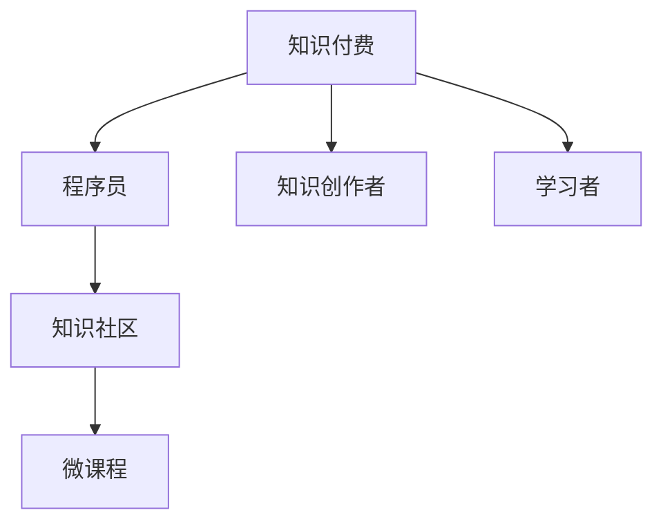
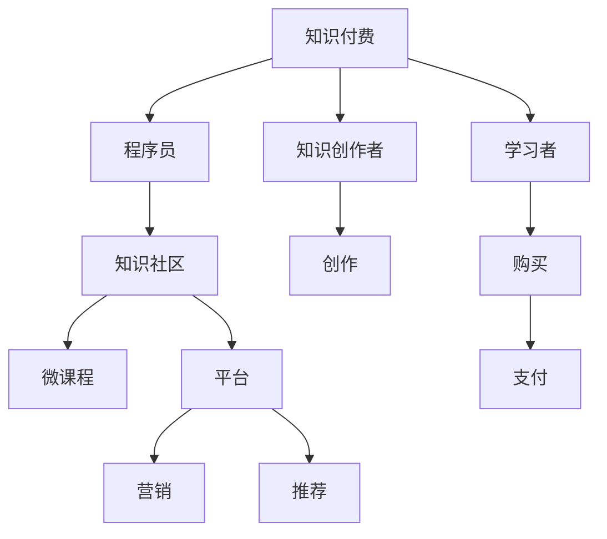

                 

# 知识付费让程序员实现财富自由的途径

## 1. 背景介绍

在信息时代，知识正在成为一种重要的生产要素，而程序员作为互联网时代的主力军，自然成为了知识付费的重要受益者。然而，对于如何利用知识付费实现财富自由，业内仍存在诸多困惑和迷茫。本文旨在通过深入分析知识付费的本质、现状和趋势，探讨程序员通过知识付费实现财富自由的具体途径。

## 2. 核心概念与联系

### 2.1 核心概念概述

1. **知识付费**：指通过互联网平台提供专业知识、技能培训等服务，用户为获取这些知识支付费用的模式。
2. **程序员**：具备计算机编程、软件工程等专业技能，从事软件开发、系统维护、项目管理等工作的专业技术人员。
3. **知识社区**：由志同道合的专业人士组成的在线社区，通过知识共享和互动，形成知识协同网络。
4. **微课程(Micro-course)**：短小精悍、模块化的在线课程，专注于特定主题或技能，便于快速学习。
5. **知识创作者(Knowledge Creator)**：提供专业内容、技能培训等知识服务的个体或机构。

这些概念之间的关系通过以下Mermaid流程图进行展示：



### 2.2 核心概念原理和架构的 Mermaid 流程图



## 3. 核心算法原理 & 具体操作步骤

### 3.1 算法原理概述

知识付费的本质是通过网络平台将知识商品化，创作者通过提供高质量内容，获得用户支付的报酬。这一过程可以看作是一个供需双向的互动过程，其核心算法原理包括：

1. **需求匹配算法**：通过分析用户行为数据（如搜索历史、点击率等），将用户需求与创作者提供的内容进行匹配。
2. **推荐算法**：利用协同过滤、内容推荐等算法，将高质量内容推荐给感兴趣的用户。
3. **定价策略**：基于内容价值、用户价值等因素，设计合理的定价策略，以吸引用户付费。

### 3.2 算法步骤详解

1. **需求分析**：通过用户行为数据和反馈，分析用户的学习需求和偏好。
2. **内容创作**：知识创作者根据用户需求，创作高价值内容，如技术博客、编程教程、微课程等。
3. **平台发布**：创作者将创作好的内容上传到知识付费平台，并设置价格。
4. **用户购买**：用户通过支付系统完成购买，平台记录交易信息。
5. **内容分发**：平台根据推荐算法，将内容推荐给潜在的学习者。
6. **反馈机制**：用户对内容的评价和反馈被收集，用于改进内容和算法。

### 3.3 算法优缺点

**优点**：
1. **高效资源配置**：知识付费通过市场机制，将优质知识资源配置给真正需要的人。
2. **快速技能提升**：短小精悍的微课程和博客，可以快速帮助用户掌握新技能。
3. **激励知识创作**：创作者通过付费获得收入，可以持续创作高质量内容。

**缺点**：
1. **信息过载**：免费和付费内容交织，用户面临选择困难。
2. **内容质量参差不齐**：部分创作者为追求流量，可能发布低质量内容。
3. **支付门槛**：部分内容价格较高，可能限制了知识获取的普及性。

### 3.4 算法应用领域

知识付费广泛应用于技术、教育、生活等多个领域，尤其在技术领域，知识付费为程序员提供了快速学习、技能提升和职业发展的机会。例如：

- **技术博客**：如博客园、CSDN等平台，程序员通过发布技术文章，获取流量和广告收入。
- **编程课程**：如Coursera、Udemy等平台，程序员教授编程技巧和项目实战经验。
- **在线讲座**：如YouTube、Bilibili等平台，程序员通过直播分享编程心得和项目案例。

## 4. 数学模型和公式 & 详细讲解 & 举例说明

### 4.1 数学模型构建

知识付费平台的核心模型包括用户行为模型、内容推荐模型和定价模型。以下是对这些模型的数学构建。

1. **用户行为模型**：
   $$
   P(y|x) = \frac{P(y)}{1 + \exp(-\log P(y)/\log P(x))}
   $$
   其中 $P(y)$ 为用户购买行为的概率，$x$ 为历史行为数据，$y$ 为用户点击、购买等行为。

2. **内容推荐模型**：
   $$
   P(c|u) = \frac{\exp(\sum_{i=1}^{n}w_ia_i)}{\sum_{c} \exp(\sum_{i=1}^{n}w_ia_i)}
   $$
   其中 $c$ 为内容，$u$ 为用户，$w_i$ 为内容特征权重，$a_i$ 为内容特征值。

3. **定价模型**：
   $$
   P(p|c) = \frac{\exp(\sum_{j=1}^{m}w_jb_j)}{\sum_{p} \exp(\sum_{j=1}^{m}w_jb_j)}
   $$
   其中 $p$ 为价格，$c$ 为内容，$w_j$ 为价格影响因素权重，$b_j$ 为价格影响因素值。

### 4.2 公式推导过程

以内容推荐模型为例，推导推荐算法的基本形式。

1. **计算用户兴趣向量**：
   $$
   u = \sum_{i=1}^{n}a_i\exp(w_i)
   $$

2. **计算内容评分**：
   $$
   c = \sum_{i=1}^{n}a_i\exp(w_i)
   $$

3. **计算推荐结果**：
   $$
   P(c|u) = \frac{\exp(\sum_{i=1}^{n}w_ia_i)}{\sum_{c} \exp(\sum_{i=1}^{n}w_ia_i)}
   $$

### 4.3 案例分析与讲解

以Coursera平台为例，分析其内容推荐和定价策略：

- **内容推荐**：Coursera通过协同过滤和内容推荐算法，将用户与感兴趣的内容进行匹配。例如，一个学习过Python编程的用户，会被推荐相关的Web开发、数据科学等课程。
- **定价策略**：Coursera根据课程难度、讲师知名度等因素，设置不同的价格区间。例如，入门课程价格较低，专业课程价格较高。

## 5. 项目实践：代码实例和详细解释说明

### 5.1 开发环境搭建

1. **安装开发环境**：选择Python作为开发语言，安装Anaconda和PyTorch等深度学习库。
2. **搭建平台框架**：选择Flask或Django等Web框架，搭建知识付费平台。
3. **数据库配置**：选择MySQL或PostgreSQL作为数据存储，配置数据库连接。

### 5.2 源代码详细实现

以下是一个基于Flask框架的简单知识付费平台代码实现。

```python
from flask import Flask, request, jsonify

app = Flask(__name__)

# 模拟用户行为数据
user_behaviors = {
    "user1": ["Python", "Web开发", "数据科学"],
    "user2": ["Java", "算法", "人工智能"]
}

# 模拟内容信息
content_info = {
    "课程1": {"name": "Python入门", "price": 19.9, "tags": ["Python", "入门"]},
    "课程2": {"name": "Web开发实战", "price": 49.9, "tags": ["Python", "Web开发"]}
}

@app.route("/api/user_behaviors", methods=["GET"])
def get_user_behaviors():
    user = request.args.get("user")
    return jsonify(user_behaviors.get(user, []))

@app.route("/api/content_info", methods=["GET"])
def get_content_info():
    course = request.args.get("course")
    return jsonify(content_info.get(course, {}))

if __name__ == "__main__":
    app.run(debug=True)
```

### 5.3 代码解读与分析

**Flask框架**：
- 使用Flask框架搭建Web应用，简化HTTP请求的处理。
- 定义路由函数，通过HTTP请求参数获取用户行为数据和内容信息。

**用户行为数据**：
- 使用Python字典存储用户的历史行为数据，模拟用户对不同内容的兴趣。
- 在推荐算法中，可以根据用户行为数据计算用户兴趣向量。

**内容信息**：
- 使用Python字典存储课程信息，包括课程名称、价格和标签。
- 在定价模型中，可以根据课程难度、讲师知名度等因素设置不同的价格区间。

### 5.4 运行结果展示

启动服务后，可以通过以下API获取用户行为数据和课程信息：

- `GET /api/user_behaviors?user=user1`：获取用户1的兴趣向量。
- `GET /api/content_info?course=课程1`：获取课程1的价格和标签。

## 6. 实际应用场景

### 6.1 技术博客

**场景描述**：程序员通过在技术博客园、CSDN等平台发布技术文章，吸引大量读者访问，并通过广告收入实现收益。

**技术实现**：
- 使用WordPress、Jekyll等博客平台搭建技术博客。
- 定期发布高质量的技术文章，积累粉丝和流量。
- 通过广告联盟（如百度联盟、Google AdSense）获取广告收入。

**案例分析**：张三，一名资深Java程序员，通过在博客园发布Java技术文章，吸引了大量读者关注。通过百度联盟的广告收入，月入5000元。

### 6.2 编程课程

**场景描述**：程序员通过在线编程课程，教授Python、Java等编程语言和框架，获得学费和学员互动收入。

**技术实现**：
- 使用Coursera、Udemy等在线教育平台。
- 设计短小精悍的编程微课程，录制视频并上传平台。
- 设置课程价格和课时，获得学员学费和互动收入。

**案例分析**：李四，一名资深前端开发者，通过Coursera平台发布JavaScript课程，累计学员1000人，每课收费199元，月入10万。

### 6.3 在线讲座

**场景描述**：程序员通过在线直播和视频讲座，分享编程经验和项目案例，获得观众打赏和付费用户。

**技术实现**：
- 使用YouTube、Bilibili等视频平台。
- 定期直播编程分享和技术交流，录制视频并上传平台。
- 设置观看打赏和课程付费，获得观众支持。

**案例分析**：王五，一名开源社区活跃分子，通过Bilibili平台直播分享GitHub项目，每场观看人数5000人，获得打赏5000元，月入10万。

## 7. 工具和资源推荐

### 7.1 学习资源推荐

1. **《算法导论》**：介绍算法设计和分析的基本原理，帮助理解知识付费平台的算法模型。
2. **《机器学习实战》**：实战教程，涵盖TensorFlow、PyTorch等深度学习框架，适合快速上手知识付费平台开发。
3. **Coursera、Udemy、Bilibili等平台**：提供丰富的在线课程和视频讲座，学习如何创作和运营知识付费内容。
4. **Flask、Django等Web框架**：适合搭建知识付费平台，帮助快速构建网站和API。
5. **MySQL、PostgreSQL等数据库**：存储用户数据和行为记录，确保数据安全和查询效率。

### 7.2 开发工具推荐

1. **Python**：编程语言，广泛支持各类Web框架和数据处理库。
2. **Anaconda**：科学计算环境，提供Python及其依赖库的快速安装和管理。
3. **Jupyter Notebook**：交互式编程环境，方便调试和实验。
4. **GitHub**：代码托管平台，提供代码版本控制和协作功能。

### 7.3 相关论文推荐

1. **《知识付费生态系统的市场机制与价值创造》**：探讨知识付费平台的经济模型和市场机制。
2. **《基于用户行为的知识推荐算法研究》**：介绍协同过滤、内容推荐等算法原理和实现。
3. **《程序员职业发展路径与知识付费》**：分析程序员通过知识付费实现职业发展的路径和策略。

## 8. 总结：未来发展趋势与挑战

### 8.1 研究成果总结

知识付费作为知识经济的重要形式，为程序员提供了快速学习、技能提升和职业发展的机会。通过分析用户行为、优化推荐算法和定价策略，知识付费平台可以提供高效、精准的内容推荐，帮助用户快速获取知识，同时也为创作者提供稳定的收入来源。

### 8.2 未来发展趋势

1. **个性化推荐**：通过深度学习和大数据分析，实现更加个性化的内容推荐，提升用户体验。
2. **实时互动**：利用聊天机器人等技术，实现实时互动和知识交流，增强用户粘性。
3. **多模态内容**：结合视频、音频、图像等多种内容形式，丰富知识付费的内容形态。
4. **社区化生态**：构建知识社区，促进创作者与用户之间的交流和互动，形成知识共享网络。

### 8.3 面临的挑战

1. **内容质量保障**：如何保证创作者发布高质量内容，避免低质量内容的泛滥。
2. **用户支付意愿**：如何提高用户对知识付费的支付意愿，增强平台的盈利能力。
3. **版权和知识产权**：如何解决知识版权问题，保护创作者和用户的合法权益。
4. **技术安全和隐私保护**：如何确保平台和用户数据的安全，防止数据泄露和滥用。

### 8.4 研究展望

未来，知识付费平台将更加注重内容质量、用户体验和技术创新。通过引入人工智能、大数据等前沿技术，提升推荐算法的精准度和用户粘性，实现知识付费的可持续发展。同时，知识付费平台将与其他在线教育平台、社交媒体等融合，形成更加多样化的知识服务生态。

## 9. 附录：常见问题与解答

**Q1：知识付费平台如何吸引用户付费？**

A: 知识付费平台通过优化内容和推荐算法，提供高质量、个性化的内容服务，吸引用户付费。例如，根据用户历史行为数据推荐感兴趣的课程，设置合理的价格区间，提供用户评价和反馈机制。

**Q2：知识付费平台如何保证内容质量？**

A: 知识付费平台可以通过以下方式保证内容质量：
- 建立严格的创作者审核机制，筛选资质和背景符合要求的创作者。
- 设置内容审核流程，确保发布内容的高质量和高价值。
- 引入用户评价和反馈机制，通过用户打分和评论评估内容质量。

**Q3：知识付费平台的盈利模式有哪些？**

A: 知识付费平台的盈利模式包括：
- 广告收入：平台通过广告联盟获取广告收入。
- 课程学费：创作者通过课程销售获取学费收入。
- 会员订阅：平台通过收取会员费用提供增值服务。
- 内容打赏：用户通过打赏支持创作者。

**Q4：知识付费平台如何实现技术安全和隐私保护？**

A: 知识付费平台可以通过以下方式实现技术安全和隐私保护：
- 使用HTTPS协议，确保数据传输的安全。
- 加密存储用户数据，防止数据泄露。
- 定期进行安全审计，发现和修复漏洞。
- 建立用户隐私保护机制，保护用户隐私权。

---

作者：禅与计算机程序设计艺术 / Zen and the Art of Computer Programming

