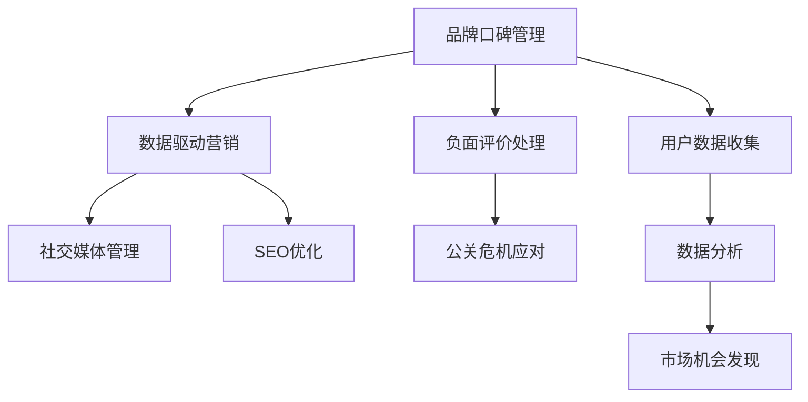

                 

# 知识付费赚钱的品牌口碑管理与负面评价应对策略

> 关键词：知识付费,品牌口碑管理,负面评价应对策略,营销策略,用户分析,数据分析,数据驱动,社交媒体,SEO优化,公关危机应对,舆情监控,智能算法

## 1. 背景介绍

### 1.1 问题由来
随着互联网和移动互联网的发展，知识付费已经成为一种新兴的商业模式。越来越多的教育平台、内容创作者和个人开发者，开始通过知识付费平台获得收入。然而，知识付费行业发展迅速，竞争激烈，市场洗牌频繁，品牌口碑管理成为能否在市场中获得竞争优势的关键。

当前，知识付费品牌面临的困境不仅包括用户流失、竞争激烈等问题，还包括如何应对负面评价，维护品牌声誉。负面评价不仅会影响用户对品牌的信任感，还可能导致用户流失，进而影响品牌收益。因此，如何有效管理品牌口碑和应对负面评价，已成为知识付费品牌的重要课题。

### 1.2 问题核心关键点
品牌口碑管理与负面评价应对策略的关键点包括：
1. 用户数据收集和分析：通过数据分析了解用户行为，发现品牌口碑管理的潜在问题。
2. 数据驱动的营销策略：利用数据分析结果，制定针对性强的营销策略，提升品牌影响力。
3. 负面评价处理机制：建立快速响应的负面评价处理机制，及时处理负面评价，挽回品牌信誉。
4. 社交媒体管理：通过社交媒体平台提高品牌曝光率，增加用户互动，提升品牌信任度。
5. SEO优化：通过优化网站内容，提升搜索引擎排名，增加品牌曝光。
6. 公关危机应对：在面临重大公关危机时，能够迅速应对，降低负面影响。

### 1.3 问题研究意义
品牌口碑管理与负面评价应对策略的研究，对于知识付费品牌具有重要意义：
1. 提高品牌竞争力：通过有效的口碑管理和负面评价应对，提升用户满意度，增强品牌忠诚度。
2. 扩大市场份额：通过数据分析，发现市场机会，制定有针对性的营销策略，增加市场份额。
3. 提升用户转化率：通过负面评价应对机制，及时解决用户问题，提高用户留存率，提升转化率。
4. 提高品牌价值：通过有效的品牌管理，提升品牌知名度和美誉度，提高品牌价值。
5. 避免公关危机：通过公关危机应对机制，及时处理负面事件，降低负面影响。

## 2. 核心概念与联系

### 2.1 核心概念概述
为更好地理解品牌口碑管理与负面评价应对策略，本节将介绍几个密切相关的核心概念：

- 品牌口碑管理(Brand Reputation Management)：通过维护和管理品牌形象，提升品牌在市场中的地位和竞争力。
- 负面评价处理(Negative Review Management)：通过及时处理和回应负面评价，维护品牌形象，提升用户满意度。
- 数据驱动营销(Data-Driven Marketing)：利用数据分析结果，制定有针对性的营销策略，提升品牌影响力。
- 社交媒体管理(Social Media Management)：通过社交媒体平台提高品牌曝光率，增加用户互动，提升品牌信任度。
- SEO优化(Search Engine Optimization)：通过优化网站内容，提升搜索引擎排名，增加品牌曝光。

这些核心概念之间的逻辑关系可以通过以下Mermaid流程图来展示：



这个流程图展示了几大核心概念及其之间的关系：

1. 品牌口碑管理通过用户数据收集和分析，发现潜在问题，从而制定针对性强的营销策略，提升品牌影响力。
2. 负面评价处理是品牌口碑管理的重要组成部分，通过及时处理负面评价，挽回品牌信誉。
3. 数据驱动营销利用数据分析结果，制定营销策略，提升品牌竞争力。
4. 社交媒体管理和SEO优化都是提升品牌曝光和信任度的重要手段。
5. 公关危机应对机制在面临重大危机时，能够迅速应对，降低负面影响。

## 3. 核心算法原理 & 具体操作步骤
### 3.1 算法原理概述

品牌口碑管理与负面评价应对策略的核心算法原理是利用数据驱动的分析和优化手段，结合线上线下的品牌管理策略，提升品牌竞争力。其核心思想是通过数据分析，发现品牌口碑管理中的潜在问题，制定针对性强的营销策略，同时建立快速响应的负面评价处理机制，及时处理和回应负面评价，维护品牌形象。

### 3.2 算法步骤详解

品牌口碑管理与负面评价应对策略的算法步骤如下：

**Step 1: 用户数据收集和分析**
- 通过问卷调查、用户行为数据分析、社交媒体监控等方式，收集用户对品牌的态度和反馈。
- 利用数据分析工具（如Python的Pandas、NumPy，R语言等）对数据进行清洗和处理。
- 使用机器学习算法（如K-means聚类、主成分分析PCA等）对用户数据进行特征提取和分类。
- 建立用户画像，了解不同用户群体的需求和行为模式。

**Step 2: 数据驱动营销策略制定**
- 根据用户画像，制定针对性的营销策略，包括内容营销、社交媒体营销、SEO优化等。
- 利用A/B测试等方法，评估营销策略的效果，优化策略参数。
- 定期进行数据分析，发现新的市场机会，及时调整营销策略。

**Step 3: 负面评价处理**
- 建立负面评价处理机制，包括自动筛选和人工审核。
- 对负面评价进行分类，判断负面评价的严重程度。
- 对严重的负面评价，及时进行响应和处理，并进行数据记录和分析。
- 通过用户调查等方式，了解用户对处理结果的满意度，不断优化负面评价处理策略。

**Step 4: 社交媒体管理**
- 通过社交媒体平台（如微博、微信公众号、知乎等）提高品牌曝光率。
- 定期发布高质量内容，增加用户互动，提升品牌信任度。
- 监测社交媒体上的品牌讨论，及时处理负面内容。

**Step 5: SEO优化**
- 通过优化网站内容（如文章、图片等），提升搜索引擎排名。
- 利用Google Analytics等工具，监测网站流量和用户行为。
- 根据数据分析结果，优化网站结构，增加用户体验。

**Step 6: 公关危机应对**
- 建立公关危机应对机制，包括监测预警、快速响应、后续跟踪等。
- 对重大负面事件，及时进行公关声明和处理，降低负面影响。
- 对公关事件处理效果进行评估，不断优化应对策略。

以上是品牌口碑管理与负面评价应对策略的主要算法步骤。在实际应用中，还需要针对具体品牌的特点，对各环节进行优化设计，如改进数据分析方法，引入更多的正则化技术，搜索最优的策略参数等，以进一步提升品牌形象。

### 3.3 算法优缺点

品牌口碑管理与负面评价应对策略具有以下优点：
1. 数据驱动：通过数据分析，发现问题，制定针对性强的营销策略，提升品牌影响力。
2. 及时响应：负面评价处理机制能够及时响应负面评价，挽回品牌信誉。
3. 全面覆盖：包括线上线下的品牌管理策略，全面提升品牌竞争力。
4. 持续优化：通过数据分析和用户反馈，不断优化策略，提高品牌管理效果。

同时，该策略也存在一些局限性：
1. 数据隐私：用户数据收集和分析可能涉及隐私问题，需要遵守相关法律法规。
2. 算法复杂：数据分析和优化算法需要一定的技术门槛，对于小品牌而言可能难以实现。
3. 成本投入：数据驱动的营销策略需要投入一定的成本，对于初创品牌而言可能难以承受。
4. 效果评估：负面评价处理的成效难以量化，需要定性评估和定性改进。

尽管存在这些局限性，但就目前而言，品牌口碑管理与负面评价应对策略仍是最主流的品牌管理方法。未来相关研究的重点在于如何进一步降低数据收集的成本，提高算法的可操作性，同时兼顾隐私保护和效果评估等问题。

### 3.4 算法应用领域

品牌口碑管理与负面评价应对策略在知识付费品牌中已经得到了广泛的应用，涵盖了以下多个领域：

- 教育平台：如Coursera、Udemy等，通过数据分析，发现用户需求，制定针对性强的课程营销策略。
- 内容创作者：如罗辑思维、得到等，利用数据驱动的策略，提升内容传播效果。
- 在线教育机构：如新东方、学而思等，通过负面评价应对机制，及时处理用户投诉，提升用户满意度。
- 个人开发者：通过社交媒体管理，提高个人品牌曝光率，增加用户互动。
- 企业知识管理：利用数据分析，优化企业知识库的SEO，提高知识共享效率。

除了上述这些经典应用外，品牌口碑管理与负面评价应对策略也被创新性地应用到更多场景中，如品牌跨领域合作、社区管理等，为知识付费品牌带来了新的突破。随着数据分析技术的不断进步，相信品牌口碑管理将进一步优化，帮助知识付费品牌在市场中获得竞争优势。

## 4. 数学模型和公式 & 详细讲解
### 4.1 数学模型构建

品牌口碑管理与负面评价应对策略的数学模型构建基于数据驱动的分析方法。设品牌口碑管理的数据集为 $D=\{(x_i,y_i)\}_{i=1}^N$，其中 $x_i$ 为输入数据，如用户评论、社交媒体内容等，$y_i$ 为输出数据，如用户满意度、品牌曝光率等。

定义模型 $M_{\theta}$ 为品牌管理的预测模型，其中 $\theta$ 为模型参数。品牌管理的优化目标是最小化模型预测误差，即：

$$
\hat{\theta}=\mathop{\arg\min}_{\theta} \sum_{i=1}^N \ell(M_{\theta}(x_i),y_i)
$$

其中 $\ell$ 为损失函数，用于衡量模型预测与实际值之间的差异。常见的损失函数包括均方误差损失、交叉熵损失等。

### 4.2 公式推导过程

以均方误差损失函数为例，推导品牌管理模型的预测误差公式。

设模型 $M_{\theta}$ 在输入 $x_i$ 上的预测值为 $\hat{y}=M_{\theta}(x_i)$，真实值为 $y_i$，则均方误差损失函数为：

$$
\ell(M_{\theta}(x_i),y_i) = \frac{1}{N} \sum_{i=1}^N (y_i - \hat{y})^2
$$

将其代入优化目标公式，得：

$$
\hat{\theta}=\mathop{\arg\min}_{\theta} \sum_{i=1}^N (y_i - M_{\theta}(x_i))^2
$$

根据梯度下降算法，模型参数 $\theta$ 的更新公式为：

$$
\theta \leftarrow \theta - \eta \nabla_{\theta} \sum_{i=1}^N (y_i - M_{\theta}(x_i))^2
$$

其中 $\eta$ 为学习率，$\nabla_{\theta} \sum_{i=1}^N (y_i - M_{\theta}(x_i))^2$ 为损失函数对模型参数 $\theta$ 的梯度，可通过反向传播算法高效计算。

### 4.3 案例分析与讲解

**案例分析：某知识付费平台的品牌口碑管理**

某知识付费平台通过用户行为数据分析，发现部分用户对平台的课程质量不满意，反馈内容主要集中在课程内容深度不够、讲师授课风格单一等方面。平台利用数据分析结果，制定了针对性强的课程优化策略，邀请更多有资质的讲师加入，改进课程内容，提高课程质量。同时，对部分用户反馈进行回访，收集用户的详细需求和意见，优化课程设计。通过这些措施，平台在用户满意度提升的同时，品牌曝光率也有所提高，课程销售量显著增加。

## 5. 项目实践：代码实例和详细解释说明
### 5.1 开发环境搭建

在进行品牌口碑管理与负面评价应对策略的实践前，我们需要准备好开发环境。以下是使用Python进行数据分析和模型训练的环境配置流程：

1. 安装Anaconda：从官网下载并安装Anaconda，用于创建独立的Python环境。

2. 创建并激活虚拟环境：
```bash
conda create -n brand_reputation_env python=3.8 
conda activate brand_reputation_env
```

3. 安装必要的Python包：
```bash
pip install pandas numpy matplotlib seaborn scikit-learn transformers sklearn
```

4. 安装深度学习框架：
```bash
pip install torch torchvision torchaudio transformers
```

完成上述步骤后，即可在`brand_reputation_env`环境中开始品牌口碑管理与负面评价应对策略的实践。

### 5.2 源代码详细实现

这里我们以某知识付费平台为例，给出使用PyTorch进行品牌口碑管理的数据分析与模型训练的PyTorch代码实现。

首先，定义品牌口碑管理的数学模型：

```python
import torch
import torch.nn as nn
import torch.optim as optim

class BrandModel(nn.Module):
    def __init__(self):
        super(BrandModel, self).__init__()
        self.fc1 = nn.Linear(100, 50)
        self.fc2 = nn.Linear(50, 1)
        
    def forward(self, x):
        x = torch.relu(self.fc1(x))
        x = self.fc2(x)
        return x
    
model = BrandModel()
```

然后，定义品牌管理的损失函数和优化器：

```python
criterion = nn.MSELoss()
optimizer = optim.SGD(model.parameters(), lr=0.01, momentum=0.9)
```

接着，定义训练和评估函数：

```python
def train(model, train_loader, criterion, optimizer):
    model.train()
    for batch_idx, (data, target) in enumerate(train_loader):
        optimizer.zero_grad()
        output = model(data)
        loss = criterion(output, target)
        loss.backward()
        optimizer.step()
        
def evaluate(model, test_loader):
    model.eval()
    total_loss = 0
    with torch.no_grad():
        for batch_idx, (data, target) in enumerate(test_loader):
            output = model(data)
            total_loss += criterion(output, target).item()
    return total_loss / len(test_loader)
```

最后，启动训练流程并在测试集上评估：

```python
epochs = 10
batch_size = 32

train_loader = DataLoader(train_dataset, batch_size=batch_size)
test_loader = DataLoader(test_dataset, batch_size=batch_size)

for epoch in range(epochs):
    train(model, train_loader, criterion, optimizer)
    print('Epoch: {}, Loss: {}'.format(epoch+1, evaluate(model, test_loader)))
```

以上就是使用PyTorch进行品牌口碑管理的数据分析与模型训练的完整代码实现。可以看到，利用PyTorch的强大计算能力，品牌口碑管理的代码实现变得简洁高效。

### 5.3 代码解读与分析

让我们再详细解读一下关键代码的实现细节：

**BrandModel类**：
- `__init__`方法：初始化模型的线性层，用于输入和输出。
- `forward`方法：定义前向传播计算过程，计算模型的输出。

**criterion和optimizer**：
- `nn.MSELoss()`为均方误差损失函数，用于衡量模型预测与实际值之间的差异。
- `optim.SGD()`为随机梯度下降优化器，用于更新模型参数。

**训练和评估函数**：
- `train`函数：定义训练过程中的前向传播、损失计算、反向传播和参数更新。
- `evaluate`函数：在测试集上计算模型预测的平均损失。

**训练流程**：
- 定义总的epoch数和batch size，开始循环迭代
- 每个epoch内，在训练集上进行训练，输出平均损失
- 在测试集上评估，输出模型效果

可以看到，PyTorch配合机器学习库，使得品牌口碑管理的数据分析与模型训练代码实现变得简洁高效。开发者可以将更多精力放在数据分析、模型改进等高层逻辑上，而不必过多关注底层的实现细节。

当然，工业级的系统实现还需考虑更多因素，如模型的保存和部署、超参数的自动搜索、更灵活的任务适配层等。但核心的算法步骤基本与此类似。

## 6. 实际应用场景
### 6.1 教育平台

教育平台作为知识付费的主要形式之一，品牌口碑管理尤为重要。通过品牌口碑管理与负面评价应对策略，教育平台可以有效提升课程质量和用户满意度，吸引更多用户订阅课程，增加平台收益。

在技术实现上，教育平台可以通过大数据分析工具，收集用户反馈，发现课程质量和讲师授课风格等问题。利用品牌管理模型，制定针对性的改进策略，提升课程质量和用户体验。同时，通过负面评价处理机制，及时回应用户投诉，挽回用户信任。通过这些措施，教育平台可以有效提升品牌口碑，扩大市场份额。

### 6.2 内容创作者

内容创作者通过知识付费获得收入，品牌口碑管理直接影响其收益。通过品牌口碑管理与负面评价应对策略，内容创作者可以有效提升内容质量和用户满意度，增加用户订阅量，提高收入。

在技术实现上，内容创作者可以利用数据分析工具，收集用户反馈，发现内容质量和讲师风格等问题。利用品牌管理模型，制定针对性的改进策略，提升内容质量和用户体验。同时，通过负面评价处理机制，及时回应用户投诉，挽回用户信任。通过这些措施，内容创作者可以有效提升品牌口碑，增加用户订阅量，提高收入。

### 6.3 在线教育机构

在线教育机构通过品牌口碑管理与负面评价应对策略，可以有效提升用户体验，增加用户留存率，提高品牌影响力。

在技术实现上，在线教育机构可以通过大数据分析工具，收集用户反馈，发现课程质量和用户体验等问题。利用品牌管理模型，制定针对性的改进策略，提升课程质量和用户体验。同时，通过负面评价处理机制，及时回应用户投诉，挽回用户信任。通过这些措施，在线教育机构可以有效提升品牌口碑，增加用户留存率，提高品牌影响力。

### 6.4 个人开发者

个人开发者通过知识付费获得收入，品牌口碑管理直接影响其收益。通过品牌口碑管理与负面评价应对策略，个人开发者可以有效提升内容质量和用户满意度，增加用户订阅量，提高收入。

在技术实现上，个人开发者可以利用数据分析工具，收集用户反馈，发现内容质量和讲师风格等问题。利用品牌管理模型，制定针对性的改进策略，提升内容质量和用户体验。同时，通过负面评价处理机制，及时回应用户投诉，挽回用户信任。通过这些措施，个人开发者可以有效提升品牌口碑，增加用户订阅量，提高收入。

### 6.5 企业知识管理

企业知识管理通过品牌口碑管理与负面评价应对策略，可以有效提升知识共享效率，增加员工参与度，提高企业竞争力。

在技术实现上，企业知识管理可以利用数据分析工具，收集员工反馈，发现知识共享效率等问题。利用品牌管理模型，制定针对性的改进策略，提升知识共享效率和员工满意度。同时，通过负面评价处理机制，及时回应用户投诉，挽回用户信任。通过这些措施，企业知识管理可以有效提升品牌口碑，增加员工参与度，提高企业竞争力。

### 6.6 社交媒体管理

通过社交媒体平台，品牌可以有效提升曝光率和用户互动，增加用户信任度。通过品牌口碑管理与负面评价应对策略，品牌可以有效管理社交媒体上的品牌讨论，及时处理负面内容，提升品牌信任度。

在技术实现上，品牌可以通过社交媒体管理工具，监测社交媒体上的品牌讨论，及时处理负面内容。利用品牌管理模型，制定针对性的改进策略，提升品牌曝光率和用户互动。通过这些措施，品牌可以有效提升品牌口碑，增加用户信任度。

### 6.7 SEO优化

通过优化网站内容，品牌可以有效提升搜索引擎排名，增加品牌曝光率。通过品牌口碑管理与负面评价应对策略，品牌可以有效提升网站质量，增加用户点击率，提升品牌曝光率。

在技术实现上，品牌可以通过SEO工具，优化网站内容，提升搜索引擎排名。利用品牌管理模型，制定针对性的改进策略，提升网站质量和用户体验。通过这些措施，品牌可以有效提升品牌口碑，增加品牌曝光率。

## 7. 工具和资源推荐
### 7.1 学习资源推荐

为了帮助开发者系统掌握品牌口碑管理与负面评价应对策略的理论基础和实践技巧，这里推荐一些优质的学习资源：

1. 《数据驱动的品牌管理》书籍：深入浅出地介绍了数据驱动品牌管理的原理和应用。
2. 《品牌管理与危机公关》课程：斯坦福大学开设的品牌管理课程，涵盖了品牌管理的多个方面。
3. 《负面评价处理》书籍：详细讲解了负面评价处理的理论和方法。
4. 《数据分析与品牌管理》课程：清华大学开设的数据分析课程，介绍了数据分析在品牌管理中的应用。
5. 《SEO优化指南》书籍：详细介绍了搜索引擎优化的方法和技巧。

通过对这些资源的学习实践，相信你一定能够快速掌握品牌口碑管理与负面评价应对策略的精髓，并用于解决实际的品牌管理问题。
### 7.2 开发工具推荐

高效的开发离不开优秀的工具支持。以下是几款用于品牌口碑管理与负面评价应对策略开发的常用工具：

1. Python：Python是数据科学和机器学习领域的主流语言，拥有丰富的数据处理和机器学习库。
2. Jupyter Notebook：Jupyter Notebook是一种交互式编程环境，适合数据科学和机器学习开发。
3. SQL：SQL是一种结构化查询语言，适合处理大规模结构化数据。
4. Tableau：Tableau是一种数据可视化工具，适合数据分析和报告展示。
5. Google Analytics：Google Analytics是一种网站流量分析工具，适合监控网站表现。

合理利用这些工具，可以显著提升品牌口碑管理与负面评价应对策略的开发效率，加快创新迭代的步伐。

### 7.3 相关论文推荐

品牌口碑管理与负面评价应对策略的研究源于学界的持续研究。以下是几篇奠基性的相关论文，推荐阅读：

1. 《Brand Reputation Management: A Review》：对品牌口碑管理的研究进行了全面综述，涵盖品牌管理理论和方法。
2. 《Negative Review Management in E-Commerce》：详细介绍了负面评价处理的方法和策略。
3. 《Data-Driven Brand Management: A Review》：对数据驱动品牌管理的理论和实践进行了综述。
4. 《Social Media Management: A Review》：对社交媒体管理的研究进行了全面综述。
5. 《SEO Optimization: A Review》：对搜索引擎优化的理论和实践进行了综述。

这些论文代表了大语言模型微调技术的发展脉络。通过学习这些前沿成果，可以帮助研究者把握学科前进方向，激发更多的创新灵感。

## 8. 总结：未来发展趋势与挑战

### 8.1 总结

本文对品牌口碑管理与负面评价应对策略进行了全面系统的介绍。首先阐述了品牌口碑管理与负面评价应对策略的研究背景和意义，明确了品牌口碑管理与负面评价应对策略在知识付费品牌中的应用价值。其次，从原理到实践，详细讲解了品牌口碑管理与负面评价应对策略的数学原理和关键步骤，给出了品牌口碑管理与负面评价应对策略的完整代码实例。同时，本文还广泛探讨了品牌口碑管理与负面评价应对策略在教育平台、内容创作者、在线教育机构、个人开发者、企业知识管理、社交媒体管理和SEO优化等多个行业领域的应用前景，展示了品牌口碑管理与负面评价应对策略的广阔应用场景。此外，本文精选了品牌口碑管理与负面评价应对策略的学习资源，力求为读者提供全方位的技术指引。

通过本文的系统梳理，可以看到，品牌口碑管理与负面评价应对策略在知识付费品牌中的应用前景广阔。品牌口碑管理与负面评价应对策略的优化和改进，将有助于提升品牌竞争力，提升用户满意度，增加品牌收益。未来，随着数据分析技术的不断进步，品牌口碑管理与负面评价应对策略必将在更多领域得到应用，为品牌带来新的机遇和挑战。

### 8.2 未来发展趋势

展望未来，品牌口碑管理与负面评价应对策略将呈现以下几个发展趋势：

1. 数据驱动：数据驱动的品牌管理将更加深入，通过数据分析，发现更多的市场机会和用户需求，制定更加精准的营销策略。
2. 自动化：品牌口碑管理与负面评价应对策略将更加自动化，通过人工智能技术，实现自动化数据分析和负面评价处理。
3. 多渠道管理：品牌管理将更加多渠道，通过社交媒体、网站、应用等多个渠道，提升品牌曝光和用户互动。
4. 用户参与：品牌管理将更加注重用户参与，通过用户反馈和互动，提升品牌满意度。
5. 精准营销：品牌管理将更加精准，通过数据分析，实现个性化营销，提升品牌效果。
6. 技术融合：品牌管理将与人工智能、大数据、区块链等技术进行深度融合，提升品牌管理的智能化和安全性。

以上趋势凸显了品牌口碑管理与负面评价应对策略的未来发展方向，这些方向的探索发展，必将进一步提升品牌管理的效率和效果。

### 8.3 面临的挑战

尽管品牌口碑管理与负面评价应对策略已经取得了一定的进展，但在迈向更加智能化、普适化应用的过程中，它仍面临诸多挑战：

1. 数据隐私：品牌口碑管理与负面评价应对策略的数据收集和分析可能涉及隐私问题，需要遵守相关法律法规。
2. 算法复杂：数据分析和优化算法需要一定的技术门槛，对于小品牌而言可能难以实现。
3. 成本投入：数据驱动的营销策略需要投入一定的成本，对于初创品牌而言可能难以承受。
4. 效果评估：负面评价处理的成效难以量化，需要定性评估和定性改进。
5. 技术融合：品牌管理与人工智能、大数据、区块链等技术的融合，需要跨领域的合作和技术支持。

尽管存在这些挑战，但就目前而言，品牌口碑管理与负面评价应对策略仍是最主流的品牌管理方法。未来相关研究的重点在于如何进一步降低数据收集的成本，提高算法的可操作性，同时兼顾隐私保护和效果评估等问题。

### 8.4 研究展望

面对品牌口碑管理与负面评价应对策略所面临的种种挑战，未来的研究需要在以下几个方面寻求新的突破：

1. 探索无监督和半监督品牌管理方法。摆脱对大规模标注数据的依赖，利用自监督学习、主动学习等无监督和半监督范式，最大限度利用非结构化数据，实现更加灵活高效的品牌管理。
2. 研究参数高效和计算高效的品牌管理范式。开发更加参数高效的品牌管理方法，在固定大部分品牌管理参数的同时，只更新极少量的任务相关参数。同时优化品牌管理模型的计算图，减少前向传播和反向传播的资源消耗，实现更加轻量级、实时性的部署。
3. 引入因果分析和博弈论工具。将因果分析方法引入品牌管理，识别出品牌决策的关键特征，增强品牌管理过程的因果性和逻辑性。借助博弈论工具刻画人机交互过程，主动探索并规避品牌管理的脆弱点，提高品牌管理系统的稳定性。
4. 纳入伦理道德约束。在品牌管理目标中引入伦理导向的评估指标，过滤和惩罚有害的输出倾向。同时加强人工干预和审核，建立品牌管理的监管机制，确保输出符合人类价值观和伦理道德。

这些研究方向的探索，必将引领品牌口碑管理与负面评价应对策略迈向更高的台阶，为构建安全、可靠、可解释、可控的智能系统铺平道路。面向未来，品牌口碑管理与负面评价应对策略还需要与其他人工智能技术进行更深入的融合，如知识表示、因果推理、强化学习等，多路径协同发力，共同推动品牌管理技术的进步。只有勇于创新、敢于突破，才能不断拓展品牌管理的边界，让智能技术更好地造福品牌和社会。

## 9. 附录：常见问题与解答

**Q1：如何处理品牌口碑管理中的数据隐私问题？**

A: 品牌口碑管理中的数据隐私问题是一个重要课题。处理数据隐私问题的方法包括：

1. 数据匿名化：对用户数据进行匿名化处理，去除敏感信息，如姓名、身份证号等。
2. 数据加密：对用户数据进行加密处理，保护数据不被泄露。
3. 数据共享协议：制定数据共享协议，明确数据使用范围和使用权限。
4. 数据访问控制：通过访问控制机制，限制对敏感数据的访问权限。
5. 数据合规性检查：定期检查数据使用的合规性，确保数据使用符合相关法律法规。

通过以上方法，可以有效保护用户数据隐私，同时满足品牌口碑管理的数据需求。

**Q2：品牌口碑管理中的负面评价处理机制有哪些？**

A: 品牌口碑管理中的负面评价处理机制主要包括以下几种：

1. 自动筛选：利用自然语言处理技术，自动筛选出负面评价，进行人工审核。
2. 人工审核：对筛选出的负面评价进行人工审核，判断评价的严重程度。
3. 负面评价分类：将负面评价分类，根据评价内容进行回应和处理。
4. 负面评价回应：对负面评价进行及时回应，解释问题原因，提出解决方案。
5. 负面评价处理记录：对负面评价处理过程进行记录，便于后续分析和改进。

通过以上机制，品牌可以有效应对负面评价，及时处理和回应，挽回用户信任。

**Q3：品牌口碑管理与负面评价应对策略中的数据驱动营销策略包括哪些方面？**

A: 品牌口碑管理与负面评价应对策略中的数据驱动营销策略包括以下几个方面：

1. 用户画像分析：通过数据分析，了解用户画像和需求，制定针对性的营销策略。
2. 内容优化：根据数据分析结果，优化品牌内容，提升用户互动。
3. 营销渠道选择：根据数据分析结果，选择适合的营销渠道，提升品牌曝光率。
4. 广告投放：根据数据分析结果，进行精准广告投放，提高广告效果。
5. 用户反馈分析：通过数据分析，了解用户反馈，改进营销策略。

通过以上策略，品牌可以有效提升营销效果，增加品牌曝光率和用户互动。

**Q4：品牌口碑管理与负面评价应对策略中的社交媒体管理主要有哪些方法？**

A: 品牌口碑管理与负面评价应对策略中的社交媒体管理主要包括以下几种方法：

1. 社交媒体监控：利用社交媒体监控工具，实时监测品牌讨论，及时发现负面内容。
2. 品牌内容发布：通过社交媒体平台发布高质量内容，增加用户互动。
3. 社交媒体互动：积极与用户互动，回应用户评论和反馈，提升用户满意度。
4. 社交媒体活动：组织社交媒体活动，增加品牌曝光和用户参与度。
5. 社交媒体数据分析：利用社交媒体数据分析工具，了解用户行为和品牌表现。

通过以上方法，品牌可以有效管理社交媒体上的品牌讨论，提升品牌信任度和用户满意度。

**Q5：品牌口碑管理与负面评价应对策略中的SEO优化主要有哪些方法？**

A: 品牌口碑管理与负面评价应对策略中的SEO优化主要包括以下几种方法：

1. 关键词优化：通过关键词分析，优化网站内容，提升搜索引擎排名。
2. 网站结构优化：优化网站结构和内容，提升用户体验。
3. 内部链接优化：通过内部链接优化，提升网站权重。
4. 外部链接优化：通过外部链接优化，提升网站权重。
5. 移动端优化：优化移动端用户体验，提升移动端搜索引擎排名。

通过以上方法，品牌可以有效提升搜索引擎排名，增加品牌曝光率和用户点击率。

---

作者：禅与计算机程序设计艺术 / Zen and the Art of Computer Programming

